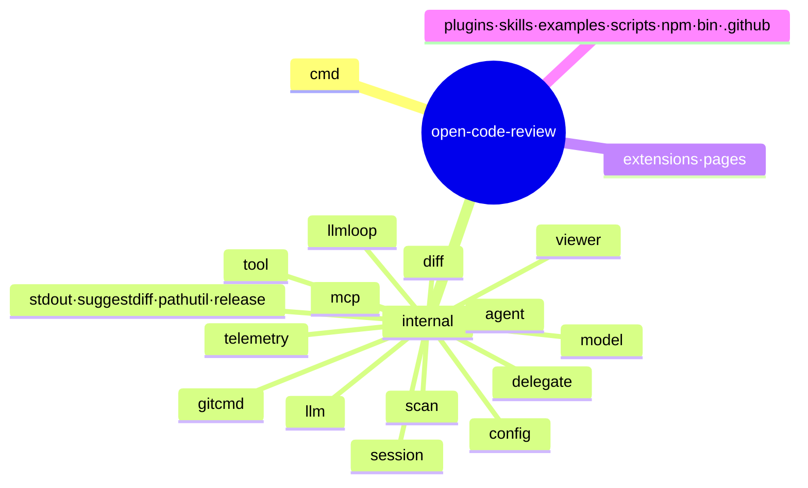
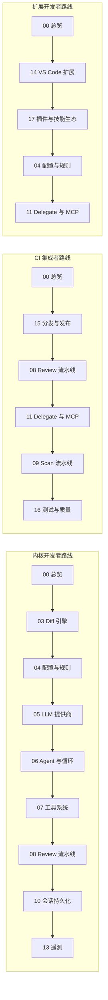

# 项目总览：OpenCodeReview

> **关联源码**：`README.md`、`go.mod`、`Makefile`、`package.json`、`action.yml`、`cmd/opencodereview/root.go`、`ROADMAP.md`、`CONTRIBUTING.md`、`SECURITY.md`、`ASSURANCE_CASE.md` 等
> **前置阅读**：无

## 目录

- [1. 项目定位与背景](#1-项目定位与背景)
- [2. 核心能力矩阵](#2-核心能力矩阵)
- [3. 技术栈清单](#3-技术栈清单)
- [4. 仓库目录导览](#4-仓库目录导览)
- [5. 核心术语表](#5-核心术语表)
- [6. 构建与常用命令速查](#6-构建与常用命令速查)
- [7. 分析文档阅读路线](#7-分析文档阅读路线)
- [8. 差异记录与待确认项](#8-差异记录与待确认项)

---

## 1. 项目定位与背景

### 1.1 从阿里内部工具到开源项目

OpenCodeReview（CLI 命令名 `ocr`）是一个 AI 驱动的代码审查命令行工具。按 [README.md](../../README.md#L37-L41) 的自述，它起源于阿里巴巴集团内部的官方 AI 代码审查助手：过去两年间服务于数万名内部开发者，识别了数百万个代码缺陷；在超大规模验证之后，被孵化为面向社区的开源项目（Apache-2.0，Copyright 2026 Alibaba，见 [README.md](../../README.md#L197-L198)）。用户只需配置一个模型端点即可开始使用。

它的工作方式是：读取 Git diff，把变更文件通过一个具备工具调用能力的 Agent 发送给可配置的 LLM，生成带行级精度的结构化审查评论。Agent 可以读取完整文件内容、搜索代码库、检查其他变更文件以获取上下文，从而产出深度审查——而不只是表面化的 diff 反馈（[README.md](../../README.md#L41)）。

运行前置条件只有一条：**Git >= 2.41**（[README.md](../../README.md#L99-L101)），OCR 依赖 Git 完成 diff 生成、代码搜索与仓库操作。

### 1.2 要解决的问题：通用 Agent 做代码审查的三大痛点

[README.md](../../README.md#L67-L75) 的 "The Problem with General-Purpose Agents" 一节指出，直接用 Claude Code 这类通用 Agent 加 Skills 做代码审查会遇到：

| 痛点 | 表现 |
|---|---|
| **Incomplete coverage**（覆盖不全） | 大变更集上 Agent 倾向于"偷工减料"，只选择性审查部分文件，漏掉其余 |
| **Position drift**（位置漂移） | 报告的问题经常与实际代码位置对不上，行号或文件引用偏移目标 |
| **Unstable quality**（质量不稳） | 自然语言驱动的 Skills 难以调试，审查质量随 prompt 的微小变化剧烈波动 |

README 对根因的判断是：**纯语言驱动的架构缺乏对审查过程的硬约束**（[README.md](../../README.md#L75)）。

### 1.3 核心设计：确定性工程 × Agent 混合

[README.md](../../README.md#L77-L95) 的 "Core Design" 一节给出项目的核心哲学——确定性工程与 Agent 各司其职：

**确定性工程（硬约束）**——对"绝不能出错"的环节，由工程逻辑而非语言模型保证正确性：

- **精确文件选择**：确定哪些文件需要审查、哪些应被过滤，确保不漏掉重要变更（[README.md](../../README.md#L85)）；
- **智能文件捆绑**：把相关文件组成单一审查单元（例如 `message_en.properties` 与 `message_zh.properties` 捆绑），每个 bundle 作为一个上下文隔离的子 Agent 运行——分而治之的策略在大变更集上保持稳定，并天然支持并发审查（[README.md](../../README.md#L86)）；
- **细粒度规则匹配**：按文件特征匹配审查规则，保持模型注意力聚焦、从源头消除信息噪声；相比纯语言驱动的规则引导，基于模板引擎的规则匹配更稳定可预测（[README.md](../../README.md#L87)）；
- **外部定位与反思模块**：独立的评论定位（positioning）与评论反思（reflection）模块，系统性提升 AI 反馈的位置准确率与内容准确率（[README.md](../../README.md#L88)）。前者对应 [relocation.go](../../internal/diff/relocation.go)，后者对应 [review_filter_task_system.md](../../internal/config/template/prompts/review_filter_task_system.md)。

**Agent（动态决策）**——Agent 的能力集中在最有价值的动态决策与动态上下文获取上：

- **场景化调优的 prompt**：为代码审查深度优化的 prompt 模板，在提升效果的同时降低 token 消耗（[README.md](../../README.md#L94)），模板位于 [internal/config/template/prompts/](../../internal/config/template/prompts)；
- **场景化调优的工具集**：从大规模生产数据的工具调用轨迹中蒸馏而来（调用频率分布、单工具重复率、新工具对调用链的影响），比通用 Agent 工具箱更稳定可预测（[README.md](../../README.md#L95)），实现位于 [internal/tool/](../../internal/tool)。

### 1.4 AACR-Bench 基准与「精确率优先」的取舍

项目发布了一个真实世界代码审查基准 **AACR-Bench**（数据集在 [HuggingFace: Alibaba-Aone/aacr-bench](https://huggingface.co/datasets/Alibaba-Aone/aacr-bench)，[README.md](../../README.md#L53)）：

- 构成：**50** 个流行开源仓库、**200** 个真实 Pull Request、**10** 种编程语言，由 80+ 位资深工程师交叉标注，共 **1,505** 条 ground-truth 问题（[README.md](../../README.md#L51)）；
- 结论：与通用 Agent（Claude Code）相比，在相同底座模型下取得显著更高的 **Precision** 与 **F1**，同时只消耗约 **1/9 的 token** 且审查更快；**Recall 低于通用 Agent——这是刻意做出的取舍，优先精确率而非噪音**（[README.md](../../README.md#L49)）。

这个取舍的理由写在基准指标表里：Precision 是"报告的问题中真实缺陷的占比"，越高意味着需要人工分诊的误报越少；而漏报（Recall）的补救方式是再跑一轮审查，误报的补救成本（人工甄别）更高（[README.md](../../README.md#L55-L61)）。各项指标的具体数值以 [imgs/benchmark-*.png](../../imgs) 图表为准，README 正文未给出百分比数字。

值得注意的是，[ROADMAP.md](../../ROADMAP.md#L46-L51) 已把 **Ultra Mode**（更高召回的审查模式，用更多 token 与时间换取显著更高的问题召回率，面向安全敏感或高风险变更集）列入 H2 2026 计划，可以视为对这一取舍的补充路线。

### 1.5 演进方向（ROADMAP 摘要）

[ROADMAP.md](../../ROADMAP.md#L10-L26) 描述的当前状态包括：CLI 工具、编码 Agent 集成（Claude Code / Codex / Cursor）、VS Code 扩展、CI/CD 集成、多提供商 LLM 支持、MCP server、规则引擎、五语言文档。规划中：

- **H2 2026**：JetBrains 插件（[ROADMAP.md](../../ROADMAP.md#L30-L34)）；订阅友好的 Delegate 审查模式——`ocr` 不再依赖单独配置的 LLM 端点，而是解析审查范围、应用排除、加载规则、注入背景、收集 diff，然后把结构化审查任务交给宿主编码 Agent 用其自带的订阅执行（[ROADMAP.md](../../ROADMAP.md#L36-L44)，该能力当前已可用的部分见第 2 节 Delegate 条目）；Ultra Mode（[ROADMAP.md](../../ROADMAP.md#L46-L51)）；
- **H1 2027**：领域长期记忆——持久化积累领域知识（重复模式、历史审查决策、项目约定）用于未来审查（[ROADMAP.md](../../ROADMAP.md#L53-L60)）；
- **明确不做**：无人审批的自动修复（OCR 是审查工具而非自动修复工具，建议的修复始终需要人工批准）、通用 AI 编码助手、自带/自托管 LLM（[ROADMAP.md](../../ROADMAP.md#L62-L73)）。

---

## 2. 核心能力矩阵

以下每项能力给出一段说明与入口代码/目录链接，深度分析见对应编号文档。

### 2.1 Review——diff 审查（核心模式）

入口 [review_cmd.go](../../cmd/opencodereview/review_cmd.go#L60-L107)，选项结构 [review_cmd.go](../../cmd/opencodereview/review_cmd.go#L31-L56)。支持三种输入模式：工作区模式（审查所有 staged/unstaged/untracked 变更，`ocr review`）、分支区间模式（merge-base，`--from main --to feature-branch`）、单提交模式（`--commit abc123`）（[README.md](../../README.md#L135-L146)，模式常量定义见 [manifest.go](../../internal/session/manifest.go#L29-L37)）。审查结果可输出为 text/json/sarif 三种格式（[shared_flags.go](../../cmd/opencodereview/shared_flags.go#L34-L39)）。编排逻辑在 [internal/agent](../../internal/agent)，端到端流程见 **08**。

### 2.2 Scan——全文件扫描

入口 [scan_cmd.go](../../cmd/opencodereview/scan_cmd.go#L55-L90)，实现在 [internal/scan](../../internal/scan)。不依赖 diff，对整个仓库或指定目录/文件做全文件审查（`ocr scan`、`ocr scan --path internal/agent`），适合审计陌生代码库或没有有意义 diff 的目录（[README.md](../../README.md#L150-L153)）。scan 使用独立的 `scan_template.json` 模板，与 review 的 prompt 相互独立演化（[internal/scan/agent.go](../../internal/scan/agent.go#L37-L39)），并提供 `--no-plan`（跳过每文件 PLAN_TASK 预分析）等选项（[scan_cmd.go](../../cmd/opencodereview/scan_cmd.go#L42-L45)）。详见 **09**。

### 2.3 Delegate——委托模式（免 LLM 配置）

入口 [delegate_cmd.go](../../cmd/opencodereview/delegate_cmd.go#L36-L88)，实现在 [internal/delegate](../../internal/delegate)。OCR 只负责文件选择与规则解析，把审查工作"委托"给宿主 AI 编码 Agent（如 Claude Code）用它自己的 LLM 执行，因此无需配置任何 API key（[README.md](../../README.md#L158-L162)）。提供两个子命令：`delegate preview`（输出带 mode/ref 元数据的可审查文件清单）与 `delegate rule`（输出按内容分组的已解析审查规则）（[delegate_cmd.go](../../cmd/opencodereview/delegate_cmd.go#L57-L81)）。规则分组渲染见 [format.go](../../internal/delegate/format.go#L11-L28)。详见 **11**。

### 2.4 Session——会话持久化与断点续跑

入口 [session_cmd.go](../../cmd/opencodereview/session_cmd.go)（子命令 list/show/comments/compare，注册见 [session_cmd.go](../../cmd/opencodereview/session_cmd.go#L143-L146)），实现在 [internal/session](../../internal/session)。会话持久化到 `~/.opencodereview/sessions/`（[session_cmd.go](../../cmd/opencodereview/session_cmd.go#L38)），被中断的区间审查或全文件扫描可用 `ocr review --resume <session-id>` / `ocr scan --resume <session-id>` 续跑（[README.md](../../README.md#L147-L153)，`--resume` flag 注册见 [shared_flags.go](../../cmd/opencodereview/shared_flags.go#L207-L208)）。每次运行还产出机器可读的覆盖清单 Manifest（schema `ocr.run-manifest/v1`，[manifest.go](../../internal/session/manifest.go#L20-L27)；注意 v1 中 scan 尚无 manifest）。详见 **10**。

### 2.5 Viewer——Web 会话查看器

入口 [viewer_cmd.go](../../cmd/opencodereview/viewer_cmd.go#L18-L40)（默认监听 `localhost:5483`，[viewer_cmd.go](../../cmd/opencodereview/viewer_cmd.go#L37)），实现在 [internal/viewer](../../internal/viewer)。在浏览器中浏览与回放审查会话、把评论标记为已修复或忽略（[README.md](../../README.md#L185)）。服务器通过 `go:embed` 内嵌 HTML 模板与静态资源（[server.go](../../internal/viewer/server.go#L18-L19)），并叠加 Host 头白名单（防 DNS rebinding）与安全响应头两层防护（[server.go](../../internal/viewer/server.go#L30-L40)）。详见 **12**。

### 2.6 VS Code 扩展

位于 [extensions/vscode](../../extensions/vscode)。在编辑器内发起审查、展示评论、应用/丢弃建议修复（命令 `ocr.review.start`、`ocr.comment.apply` 等，见 [package.json](../../extensions/vscode/package.json#L43-L68)）。扩展宿主侧为 TypeScript services（[extensions/vscode/src/extension/services](../../extensions/vscode/src/extension/services)），webview 侧用 preact 构建视图（运行时依赖仅 [preact ^10.29.8](../../extensions/vscode/package.json#L122-L124)）。详见 **14**。

### 2.7 GitHub Action——CI 集成

位于仓库根的 [action.yml](../../action.yml#L1-L8)（composite action "OpenCodeReview PR Review"）：安装 `ocr`、写入 LLM 配置、从 merge-base 运行 `ocr review --audience agent --format json`，再把评论以 inline + summary 形式贴回 PR（[action.yml](../../action.yml#L645-L680)、[action.yml](../../action.yml#L699-L760)）。支持 sticky summary、增量（非破坏性）评论、严重度/类别路由、跨 push checkpoint（[action.yml](../../action.yml#L77-L141)）。其他 CI 系统的示例见 [examples/](../../examples)。详见 **15**。

### 2.8 Agent 插件与技能生态

- [plugins/open-code-review](../../plugins/open-code-review)：面向 Claude Code（slash 命令插件）、Codex（可调用技能插件）、Cursor（可移植技能插件）、OpenCode（原生工具与命令）、QCA Forward（宿主模型 + 委托模板）的集成（[plugins/open-code-review/README.md](../../plugins/open-code-review/README.md#L22-L80)）；
- [skills/](../../skills)：跨 Agent 可移植的技能定义 [open-code-review/SKILL.md](../../skills/open-code-review/SKILL.md#L1-L20) 与委托版 [open-code-review-delegate](../../skills/open-code-review-delegate/SKILL.md)。

详见 **17**。

### 2.9 MCP——外部工具扩展

[internal/mcp](../../internal/mcp)：通过 stdio transport 启动 MCP server 子进程并初始化连接（[client.go](../../internal/mcp/client.go#L25-L30)），把 MCP 工具注册进 Agent 工具注册表（[provider.go](../../internal/mcp/provider.go#L30-L33)），从而用任意外部工具扩展审查 Agent（[README.md](../../README.md#L173)）。详见 **11**。

### 2.10 SARIF 输出与其他

`ocr review --format sarif` 输出 OASIS SARIF v2.1.0 标准结果（[sarif.go](../../cmd/opencodereview/sarif.go#L19-L32)），便于接入 GitHub Code Scanning 等消费方。此外还有交互式 provider 配置 TUI（[provider_tui.go](../../cmd/opencodereview/provider_tui.go#L13-L14)，bubbletea/lipgloss）、shell 补全生成（[completion.go](../../cmd/opencodereview/completion.go#L13-L33)）等支撑能力。

---

## 3. 技术栈清单

### 3.1 Go 侧（直接依赖，来自 [go.mod](../../go.mod#L5-L30)）

Go module 为 `github.com/alibaba/open-code-review`，Go 版本 **1.25.5**（[go.mod](../../go.mod#L1-L3)）。

| 依赖 | 版本 | 用途 |
|---|---|---|
| `github.com/spf13/cobra` | v1.10.2 | CLI 框架，命令树与 flag 解析（[root.go](../../cmd/opencodereview/root.go#L10)） |
| `github.com/spf13/pflag` | v1.0.10 | POSIX/GNU 风格 flag 解析（cobra 底层，仓库内直接使用） |
| `charm.land/bubbletea/v2` | v2.0.8 | 终端 TUI 框架，驱动 `ocr config provider/model` 交互界面（[provider_tui.go](../../cmd/opencodereview/provider_tui.go#L13)） |
| `charm.land/bubbles/v2` | v2.1.1 | bubbletea 配套 TUI 组件 |
| `charm.land/lipgloss/v2` | v2.0.6 | TUI 样式（颜色/布局，[provider_tui.go](../../cmd/opencodereview/provider_tui.go#L14)） |
| `github.com/charmbracelet/x/term` | v0.2.2 | 终端能力检测（TTY、宽度等） |
| `github.com/anthropics/anthropic-sdk-go` | v1.63.1 | Anthropic Messages 协议客户端 |
| `github.com/openai/openai-go/v3` | v3.51.0 | OpenAI 兼容协议客户端（含 Responses API，见 [responses_client.go](../../internal/llm/responses_client.go)） |
| `github.com/aws/aws-sdk-go-v2/config` | v1.32.35 | AWS 环境凭证链，供 Bedrock 提供商使用（AmbientAuth，[providers.go](../../internal/llm/providers.go#L68-L80)） |
| `github.com/modelcontextprotocol/go-sdk` | v1.7.0 | MCP 官方 Go SDK，stdio transport 客户端（[client.go](../../internal/mcp/client.go#L15)） |
| `github.com/pkoukk/tiktoken-go` | v0.1.8 | token 计量；仓库内嵌 `cl100k_base` 词表（[internal/llm/bpe_data](../../internal/llm/bpe_data)）避免运行时下载 |
| `github.com/bmatcuk/doublestar/v4` | v4.10.0 | 支持 `**` 的 glob 匹配，用于规则路径模式与 `--exclude` |
| `github.com/google/uuid` | v1.6.0 | 会话/请求标识生成 |
| `go.opentelemetry.io/otel`（+ `sdk`、`trace`、`metric`、`sdk/metric` 及 6 个 exporter 模块，共 11 项） | v1.45.0 | OpenTelemetry 遥测：otlp gRPC/HTTP 与 stdout 两类 exporter，metrics + traces 双信号（[internal/telemetry](../../internal/telemetry)） |

协议层共四种：`anthropic`、`openai`、`openai-responses`、`anthropic-bedrock`（[providers.go](../../internal/llm/providers.go#L12-L20)）。

### 3.2 前端侧

**VS Code 扩展**（[extensions/vscode/package.json](../../extensions/vscode/package.json)）：

- 运行时依赖仅 `preact ^10.29.8`（[package.json](../../extensions/vscode/package.json#L122-L124)）——webview UI 用 preact 而非完整 React，控制扩展体积；
- 开发链：webpack + ts-loader + jest + eslint + `@vscode/vsce`（[package.json](../../extensions/vscode/package.json#L84-L92)）；
- 目标平台 `engines.vscode: ^1.74.0`（[package.json](../../extensions/vscode/package.json#L13-L15)）。

**文档站/着陆页**（[pages/package.json](../../pages/package.json)）：

- 框架为**自建的 React SPA**（TypeScript + Webpack + Tailwind CSS，见 [pages/README.md](../../pages/README.md#L1-L3)），不是 Astro/Docusaurus/Starlight；
- 运行时依赖：`react`/`react-dom` 18、`react-router-dom` 6、`marked`（Markdown 渲染）+ `dompurify`（XSS 净化）、`mermaid`（图表）、`three`（3D 视觉效果）、`@agentscope-ai/icons`（[package.json](../../pages/package.json#L14-L23)）；
- 开发链：webpack 5、Tailwind CSS 3、vitest + Testing Library、size-limit（bundle ≤ 150 kB，[package.json](../../pages/package.json#L27-L32)）；
- 多语言内容（en/zh/ja/ko/ru 文档页）在 [pages/src/content/docs/](../../pages/src/content/docs)，UI 文案表在 [pages/src/i18n/](../../pages/src/i18n)。

### 3.3 构建与分发

- Go 二进制：`make build` 产出 `./dist/opencodereview`（[Makefile](../../Makefile#L32-L33)）；发布矩阵为 6 个平台（linux/darwin/windows × amd64/arm64，[Makefile](../../Makefile#L89-L107)），`CGO_ENABLED=0` 静态编译（[Makefile](../../Makefile#L25-L29)）；
- npm 分发：根 [package.json](../../package.json#L1-L7) 定义 `@alibaba-group/open-code-review`，`ocr` 命令指向 [bin/ocr.js](../../bin/ocr.js#L35-L41) 启动器（解析平台二进制后 spawn）；6 个平台子包作为 optionalDependencies（[package.json](../../package.json#L33-L40)），下载 URL/校验和模式定义在 `ocrConfig` 字段（[package.json](../../package.json#L29-L32)）；
- 安装脚本：`curl | sh` 一键安装（[install.sh](../../install.sh#L6-L12)）与 Windows `install.ps1`；
- [npm/](../../npm) 目录下是 6 个平台子包各自的占位 `package.json`。

---

## 4. 仓库目录导览

**图 0-1**：仓库结构总览（internal 下全部 18 个包；小包与生态目录合并展示以控制图规模，完整清单见下方表格）

### 4.1 顶层目录与文件

| 路径 | 职责一句话 | 对应文档 |
|---|---|---|
| [cmd/opencodereview/](../../cmd/opencodereview) | CLI 入口（`main` 包），10 个子命令的命令定义、flag 注册与输出渲染 | 02 |
| [internal/](../../internal) | Go 内核，18 个内部包（见 4.2） | 03-13 |
| [extensions/vscode/](../../extensions/vscode) | VS Code 扩展（TypeScript；extension host services + preact webview） | 14 |
| [pages/](../../pages) | 文档站与着陆页（自建 React+Webpack+Tailwind SPA，5 语言） | 17 |
| [plugins/open-code-review/](../../plugins/open-code-review) | Claude Code / Codex / Cursor / OpenCode / QCA Forward 插件集成 | 17 |
| [skills/](../../skills) | 跨 Agent 可移植技能（`open-code-review` 与 `open-code-review-delegate` 两份 SKILL.md） | 17 |
| [examples/](../../examples) | CI 集成示例：bitbucket_pipelines、codeup_ci、gerrit_ci、gitflic_ci、github_actions、gitlab_ci 共 6 种 | 15 |
| [scripts/](../../scripts) | 安装/更新/发布脚本、GitHub Action 契约检查、license 与 english-only 校验 | 15、16 |
| [npm/](../../npm) | 6 个平台子包（darwin/linux/win32 × x64/arm64）的占位 package.json | 15 |
| [bin/](../../bin) | npm 启动器 `ocr.js` 及其测试 | 15 |
| [.github/](../../.github) | 10 个 workflow（ci、release、codeql、deploy-pages、pages-ci、vscode-ext、ocr-review、action-contract、plugin-contract、translation-sync）、issue/PR 模板、dependabot | 15、16 |
| [docs/](../../docs) | 本分析文档系列所在的目录（`docs/analysis/`）；现有 `docs/superpowers/plans/` 存放本系列的编写计划 | 00 |
| [imgs/](../../imgs) | README 徽章、logo、基准与亮点截图（含 4 语言版本的 benchmark/highlights 图） | — |
| [.opencodereview/](../../.opencodereview) | 本仓库自身的项目级审查规则 [rule.json](../../.opencodereview/rule.json)（四层规则中的 project 层） | 04 |
| [.agents/](../../.agents) | Agent 市场清单（`plugins/marketplace.json`） | 17 |
| [.claude/](../../.claude) | Claude Code 仓库级 slash 命令（`commit.md`、`tag.md`） | 17 |
| [.claude-plugin/](../../.claude-plugin) | Claude Code 插件市场清单（`marketplace.json`） | 17 |
| [.trae-html-share-packages/](../../.trae-html-share-packages) | HTML 页面的共享打包产物（zip），为 IDE 工具生成的工件，不参与构建 | — |
| [action.yml](../../action.yml) | GitHub composite action：PR 审查（安装、配置、运行、贴评论、checkpoint） | 15 |
| [install.sh](../../install.sh) / [install.ps1](../../install.ps1) | Unix/Windows 一键安装脚本（从 GitHub Release 下载二进制） | 15 |
| [package.json](../../package.json) | npm 包定义（`@alibaba-group/open-code-review`，`ocr` bin，平台子包，`ocrConfig` 下载模式） | 15 |
| [Makefile](../../Makefile) | 构建入口：build/test/check/coverage/dist 等（见第 6 节） | 16 |
| [go.mod](../../go.mod) / [go.sum](../../go.sum) | Go 模块定义与依赖锁定（`github.com/alibaba/open-code-review`，Go 1.25.5） | — |
| [AGENTS.md](../../AGENTS.md) / [CLAUDE.md](../../CLAUDE.md) | AI 编码助手协作规范（CLAUDE.md 仅一行，指向 AGENTS.md） | — |
| [ROADMAP.md](../../ROADMAP.md) | 路线图（H2 2026 / H1 2027 / Not Planned） | — |
| [ASSURANCE_CASE.md](../../ASSURANCE_CASE.md) | 安全保障案例：威胁模型（T1-T7）、Saltzer & Schroeder 设计原则映射、OWASP/CWE 反制措施 | — |
| [SECURITY.md](../../SECURITY.md) | 安全策略：仅支持最新版、GitHub Private Vulnerability Reporting、3/7/14 天响应时限、Artifact Attestations 签名 | — |
| [GOVERNANCE.md](../../GOVERNANCE.md) | 项目治理方式与决策流程 | — |
| [CODE_OF_CONDUCT.md](../../CODE_OF_CONDUCT.md) | 行为准则 | — |
| [CONTRIBUTING.md](../../CONTRIBUTING.md)（+ zh-CN / ja-JP / ko-KR / ru-RU 四个翻译版） | 贡献指南：环境要求、分支规范、Conventional Commits、CLA、SPDX 头、LF 行尾 | — |
| [README.md](../../README.md)（+ zh-CN / ja-JP / ko-KR / ru-RU 四个翻译版） | 项目说明：定位、基准、快速上手、文档索引 | — |
| [LICENSE](../../LICENSE) | Apache-2.0 许可证 | — |
| `.gitattributes` / `.gitignore` / `.npmignore` | 仓库元数据（行尾规范、忽略规则） | — |

### 4.2 internal 下的包（经逐一核对为 18 个）

> 注：分析计划文档（[docs/superpowers/plans/2026-09-07-repository-deep-analysis.md](../../docs/superpowers/plans/2026-09-07-repository-deep-analysis.md#L17)）表述为「19 个包」，但其括号内列出的名字与仓库实际目录均为 18 个；若将 `config` 的 5 个子包单列则共 23 个。本文按实际 18 个顶层包呈现。

| 包 | 职责 | 代表文件 | 文档 |
|---|---|---|---|
| [internal/agent](../../internal/agent) | Review Agent 编排：文件分组（bundle）、多轮审查、review filter、manifest 生成、预算估算 | [agent.go](../../internal/agent/agent.go)、[grouping.go](../../internal/agent/grouping.go)（`maxFilesPerGroup = 10` 见 [grouping.go](../../internal/agent/grouping.go#L22)） | 06 |
| [internal/config](../../internal/config) | 配置与规则系统，含 5 个子包：`allowlist`（扩展名白名单与默认排除模式）、`rules`（规则解析 + 49 份 rule docs + sniffer）、`template`（任务模板与 effort 预设）、`testconnection`（`ocr llm test` 的测试任务）、`toolsconfig`（工具配置） | [system_rules.go](../../internal/config/rules/system_rules.go)、[template.go](../../internal/config/template/template.go) | 04 |
| [internal/delegate](../../internal/delegate) | 委托模式：规则按内容分组与 Markdown 渲染 | [rulegroup.go](../../internal/delegate/rulegroup.go)、[format.go](../../internal/delegate/format.go) | 11 |
| [internal/diff](../../internal/diff) | Diff 引擎：git 调用、diff 解析、hunk 提取、评论行号解析（resolver）、re-location 重定位、gitignore 处理 | [parser.go](../../internal/diff/parser.go)、[relocation.go](../../internal/diff/relocation.go) | 03 |
| [internal/gitcmd](../../internal/gitcmd) | git 子进程执行器（硬编码子命令、`--end-of-options` 防注入） | [runner.go](../../internal/gitcmd/runner.go) | 03 |
| [internal/llm](../../internal/llm) | LLM 层：客户端、内置 provider 注册表、4 种协议、原生响应、重试边界/报告、`auth_token_cmd` 凭证命令、内嵌 tiktoken 词表 | [client.go](../../internal/llm/client.go)、[providers.go](../../internal/llm/providers.go#L38-L54)、[protocol.go](../../internal/llm/protocol.go) | 05 |
| [internal/llmloop](../../internal/llmloop) | Agent 执行循环：工具调用循环、评论 worker 池、memory compression | [loop.go](../../internal/llmloop/loop.go)、[pool.go](../../internal/llmloop/pool.go) | 06 |
| [internal/mcp](../../internal/mcp) | MCP 客户端（stdio transport）与工具注册桥接 | [client.go](../../internal/mcp/client.go)、[provider.go](../../internal/mcp/provider.go) | 11 |
| [internal/model](../../internal/model) | 跨层数据模型：Diff、LlmComment、scan/preview 结构 | [diff.go](../../internal/model/diff.go)、[review.go](../../internal/model/review.go#L6-L21) | 01 |
| [internal/pathutil](../../internal/pathutil) | 路径安全：`WithinBase` 仓库根校验（symlink 前后双重验证） | [path.go](../../internal/pathutil/path.go#L21-L32) | 03、12 |
| [internal/release](../../internal/release) | 发布产物命名契约的测试（当前仅含 `asset_naming_test.go`，校验 package.json 的 `ocrConfig` 模式与二进制命名一致） | [asset_naming_test.go](../../internal/release/asset_naming_test.go#L16-L23) | 15 |
| [internal/scan](../../internal/scan) | 全文件扫描流水线：批处理、去重、预算、PLAN_TASK 预分析 | [agent.go](../../internal/scan/agent.go)、[batch.go](../../internal/scan/batch.go) | 09 |
| [internal/session](../../internal/session) | 会话持久化：JSONL 历史、manifest、断点续跑、会话比较、评论提取 | [persist.go](../../internal/session/persist.go)、[manifest.go](../../internal/session/manifest.go#L20-L37)、[resume.go](../../internal/session/resume.go) | 10 |
| [internal/stdout](../../internal/stdout) | stdout 全局写入器与静默（`Quiet`）控制 | [stdout.go](../../internal/stdout/stdout.go#L17-L30) | 02 |
| [internal/suggestdiff](../../internal/suggestdiff) | 建议代码的行级 diff 计算（Myers 风格 LCS），供 CLI 彩色渲染 | [diff.go](../../internal/suggestdiff/diff.go#L4-L27) | 02、08 |
| [internal/telemetry](../../internal/telemetry) | OpenTelemetry 封装：配置、事件、exporter、metrics、span、优雅关闭 | [config.go](../../internal/telemetry/config.go)、[exporter.go](../../internal/telemetry/exporter.go) | 13 |
| [internal/tool](../../internal/tool) | Agent 内置工具：file_read、file_read_diff、code_search、code_comment、definitions、file_find、comment_collector 等 | [definitions.go](../../internal/tool/definitions.go)、[file_read.go](../../internal/tool/file_read.go) | 07 |
| [internal/viewer](../../internal/viewer) | Viewer Web 服务器：路由、模板、会话存储、host guard、安全响应头 | [server.go](../../internal/viewer/server.go#L24-L40)、[hostguard.go](../../internal/viewer/hostguard.go) | 12 |

---

## 5. 核心术语表

阅读后续文档时反复出现的领域术语，每条附代码/模板佐证：

| 术语 | 定义 | 佐证 |
|---|---|---|
| **Review** | 基于 Git diff 的审查模式，支持工作区/区间/单提交三种输入 | [review_cmd.go](../../cmd/opencodereview/review_cmd.go#L60-L65)；输入模式常量 [manifest.go](../../internal/session/manifest.go#L33-L37) |
| **Scan** | 不依赖 diff 的全文件审查模式，面向整库或指定路径 | [scan_cmd.go](../../cmd/opencodereview/scan_cmd.go#L55-L59) |
| **Delegate** | 委托模式：OCR 解析审查范围与规则，宿主 Agent 用自己的 LLM 执行审查，无需 OCR 配置 API key | [delegate_cmd.go](../../cmd/opencodereview/delegate_cmd.go#L36-L42)；设计动机 [ROADMAP.md](../../ROADMAP.md#L36-L44) |
| **Session** | 一次审查/扫描运行的持久化记录（JSONL），是断点续跑、查看器回放、会话比较的数据基础 | [session_cmd.go](../../cmd/opencodereview/session_cmd.go#L20-L28)；存储位置 `~/.opencodereview/sessions/`（[session_cmd.go](../../cmd/opencodereview/session_cmd.go#L38)） |
| **Manifest** | 一次运行产出的机器可读覆盖清单（schema `ocr.run-manifest/v1`），逐文件记录成败与失败类别；v1 仅 review 有、scan 尚无 | [manifest.go](../../internal/session/manifest.go#L20-L27)；失败类别枚举 [manifest.go](../../internal/session/manifest.go#L55-L64) |
| **Provider** | 内置 LLM 提供商预设（名称、协议、BaseURL、认证方式、模型列表），如 anthropic、bedrock 等 | [providers.go](../../internal/llm/providers.go#L11-L36)；注册表起始 [providers.go](../../internal/llm/providers.go#L38-L54) |
| **Rule** | 面向文件路径模式的审查规则，按 custom（`--rule`）> project（`.opencodereview/rule.json`）> global（`~/.opencodereview/rule.json`）> system（内置）四层解析 | 四层标签映射 [rules_cmd.go](../../cmd/opencodereview/rules_cmd.go#L63-L68)；本仓库 project 层实例 [rule.json](../../.opencodereview/rule.json) |
| **Rule Doc** | 规则命中后注入 prompt 的审查指引文档（Markdown），内置 49 份覆盖 go、rust、java、yaml 等 | [internal/config/rules/rule_docs/](../../internal/config/rules/rule_docs)（如 [go.md](../../internal/config/rules/rule_docs/go.md)） |
| **Sniffer** | 规则系统的内容嗅探装饰器：当 `.m` 扩展名歧义（MATLAB vs Objective-C）时按文件首行内容选规则，而非仅按路径 | [sniffer.go](../../internal/config/rules/sniffer.go#L32-L44) |
| **Grouping** | 把变更文件按语义相关性分组（`FileGroup`）的预处理步骤，由 LLM 依据文件元数据（不含 diff 内容）产出分组 | [grouping.go](../../internal/agent/grouping.go#L29-L33)；prompt [grouping_task_system.md](../../internal/config/template/prompts/grouping_task_system.md) |
| **Bundle** | README 所述「智能文件捆绑」的阈值与策略在模板中体现：`GROUPING_BUNDLE_LINE_THRESHOLD`（默认 200 行）以下的小变更集直接捆绑为单组（`GroupingBundleAll`），不发起 LLM 分组调用 | [template.go](../../internal/config/template/template.go#L26)、[template.go](../../internal/config/template/template.go#L89-L90)；默认值 [task_template.json](../../internal/config/template/task_template.json#L42)；理念 [README.md](../../README.md#L86) |
| **Re-location** | 评论重定位模块：文本匹配定位失败时，由独立 LLM 调用重新生成精确的 `existing_code` 片段后重试解析，用于修正位置漂移 | [relocation.go](../../internal/diff/relocation.go#L44-L57)；prompt [re_location_task_system.md](../../internal/config/template/prompts/re_location_task_system.md) |
| **Review Filter** | 评论反思模块：独立的"事实核查者" LLM 调用，只删除 diff 能**证明**事实错误的评论；证据不足时一律保留（宁保留可疑、不误删真实发现） | 执行入口 [agent.go](../../internal/agent/agent.go#L1746-L1750)；prompt [review_filter_task_system.md](../../internal/config/template/prompts/review_filter_task_system.md#L1-L11) |
| **Comment** | LLM 产出的结构化审查评论 `LlmComment`：路径、内容、建议代码、既有代码、起止行、类别（bug/security/performance/maintainability/test/style/documentation/other）、严重度（critical/high/medium/low） | [review.go](../../internal/model/review.go#L6-L21) |
| **SARIF** | OASIS 静态分析结果交换格式 v2.1.0；`--format sarif` 的输出目标，带 `ocrFinding/v1` 指纹 | [sarif.go](../../cmd/opencodereview/sarif.go#L19-L32) |
| **Viewer** | 本地 Web 会话查看器：浏览/回放会话、标记评论已修复或忽略；默认 `localhost:5483`，带 host guard 与安全响应头 | [viewer_cmd.go](../../cmd/opencodereview/viewer_cmd.go#L18-L40)；[server.go](../../internal/viewer/server.go#L24-L40) |
| **TUI** | 终端交互界面，特指 `ocr config provider` / `ocr config model` 的 bubbletea 交互式配置流程 | [provider_tui.go](../../cmd/opencodereview/provider_tui.go#L13-L14) |
| **Audience** | 输出受众开关：`human`（显示进度；json/sarif 时进度走 stderr）或 `agent`（仅摘要，面向 AI 宿主消费） | [shared_flags.go](../../cmd/opencodereview/shared_flags.go#L34-L39) |
| **Effort** | 审查力度预设 low/medium/high（默认 medium），映射为模板中的 `MaxReviewRounds`（1/2/3 轮）等旋钮 | [effort.go](../../internal/config/template/effort.go#L11-L38)；flag 注册 [shared_flags.go](../../cmd/opencodereview/shared_flags.go#L216-L217) |
| **ItemID** | manifest 中每个覆盖条目的稳定标识，使同一逻辑文件在 resume 链上保持同一 id | [manifest.go](../../internal/session/manifest.go#L29-L32) |

---

## 6. 构建与常用命令速查

### 6.1 make 目标（以 [Makefile](../../Makefile) 实际内容为准）

| 目标 | 作用 | 佐证 |
|---|---|---|
| `make build` | 编译到 `./dist/opencodereview`，以 ldflags 注入 Version/GitCommit/BuildDate | [Makefile](../../Makefile#L32-L33)、[Makefile](../../Makefile#L18-L21) |
| `make test` | `LC_ALL=C go test -v -race -count=1`（强制英文 git 输出 + 竞态检测） | [Makefile](../../Makefile#L43-L44) |
| `make check` | 依次执行 license-check、english-check、`go mod tidy`、`gofmt -s -w`、`go vet`（就地格式化与 tidy，无需单独跑 gofmt/vet） | [Makefile](../../Makefile#L73-L77) |
| `make coverage` | 生成覆盖率并强制 **90%** 总量门槛，低于即失败 | [Makefile](../../Makefile#L46-L56) |
| `make dist` | 完整发布：clean → 六平台构建 → sha256sum 校验和 → 写入 VERSION 文件 | [Makefile](../../Makefile#L114-L115) |
| `make build-all` | 构建 linux/darwin/windows × amd64/arm64 六个二进制（`CGO_ENABLED=0`） | [Makefile](../../Makefile#L107)、[Makefile](../../Makefile#L25-L29) |
| `make license-add` / `license-check` | 为新文件自动添加 / 校验 SPDX 头 | [Makefile](../../Makefile#L79-L86) |
| `make english-check` | 校验源码仅含 ASCII 字符（翻译内容限定在指定目录） | [Makefile](../../Makefile#L82-L83)，检查器 [verify-english-only.go](../../scripts/verify-english-only.go) |
| `make fmt` / `vet` / `clean` / `run` / `help` / `sha256sum` / `version-info` | 格式化 / 静态检查 / 清理 dist / 构建后以 `--staged` 运行 / 打印帮助 / 生成校验和 / 打印版本信息 | [Makefile](../../Makefile#L58-L65)、[Makefile](../../Makefile#L110-L120) |

前端与脚本侧的测试入口在根 [package.json](../../package.json#L16-L21)：`test:github-actions`（Action 后处理脚本契约测试）、`test:update`、`test:launcher`。

### 6.2 `ocr` 子命令一览（10 个）

与 [root.go](../../cmd/opencodereview/root.go#L46-L55) 中 `AddCommand` 注册的 10 个命令逐一核对一致：

| # | 命令（别名） | 用途 | 关键 flags / 子命令 | 定义 |
|---|---|---|---|---|
| 1 | `version` | 打印版本信息（版本由构建时 ldflags 注入） | — | [version.go](../../cmd/opencodereview/version.go#L19-L26) |
| 2 | `review`（`r`） | 发起 diff 审查 | `--from`/`--to`、`--commit`/`-c`、`--resume`、`--exclude`、`--format`/`-f`（text/json/sarif）、`--audience`（human/agent）、`--output`/`-o`、`--effort`、`--background`/`-b`、`--background-file`/`-B`、`--provider`、`--model`、`--concurrency`、`--timeout`、`--max-tools`、`--max-tokens`、`--preview`/`-p`、`--rule`、`--repo` | [review_cmd.go](../../cmd/opencodereview/review_cmd.go#L60-L107)，flag 注册 [shared_flags.go](../../cmd/opencodereview/shared_flags.go#L206-L217) |
| 3 | `scan`（`s`） | 全文件扫描（无需 diff） | `--path`、`--exclude`、`--resume`、`--preview`、`--no-plan`、`--no-dedup`、`--no-summary`、`--batch`、输出/并发/预算类 flag 同 review | [scan_cmd.go](../../cmd/opencodereview/scan_cmd.go#L55-L90)，选项字段 [scan_cmd.go](../../cmd/opencodereview/scan_cmd.go#L42-L45) |
| 4 | `delegate`（`d`） | 输出供宿主 Agent 委托执行审查的规格（无需 LLM） | 子命令 `preview`（可审查文件清单）、`rule <path...>`（按内容分组的规则）；`--from`/`--to`/`--commit`/`--exclude`/`--rule`/`--background`/`--repo` | [delegate_cmd.go](../../cmd/opencodereview/delegate_cmd.go#L36-L88) |
| 5 | `session`（`sessions`） | 列出与检视已保存会话 | 子命令 `list`/`ls`、`show`、`comments`（`--severity`/`--category` 过滤）、`compare`/`diff`；`--repo`、`--json`、`--limit` | [session_cmd.go](../../cmd/opencodereview/session_cmd.go#L20-L95)，注册 [session_cmd.go](../../cmd/opencodereview/session_cmd.go#L143-L146) |
| 6 | `config` | 管理配置（`~/.opencodereview/config.json`） | 子命令 `set`、`unset`、`provider`（交互式）、`model`（交互式） | [config_cmd.go](../../cmd/opencodereview/config_cmd.go#L20-L89)，配置路径 [config_cmd.go](../../cmd/opencodereview/config_cmd.go#L91-L98) |
| 7 | `llm` | LLM 工具命令 | 子命令 `test`（连通性验证）、`providers`（列出内置提供商） | [llm_cmd.go](../../cmd/opencodereview/llm_cmd.go#L18-L51) |
| 8 | `rules` | 检查与调试审查规则 | 子命令 `check <file-path>`（显示命中规则、来源层与匹配模式）；`--rule`、`--repo` | [rules_cmd.go](../../cmd/opencodereview/rules_cmd.go#L14-L43) |
| 9 | `viewer`（`v`） | 启动 Web 会话查看器 | `--addr`（默认 `localhost:5483`）、`--open`（auto/always/never） | [viewer_cmd.go](../../cmd/opencodereview/viewer_cmd.go#L18-L40) |
| 10 | `completion` | 生成 shell 补全脚本 | 位置参数 `bash`/`zsh`/`fish`/`powershell` | [completion.go](../../cmd/opencodereview/completion.go#L13-L33) |

根命令本身支持 `--version`/`-V` 与 `--color` 相关 flag（[root.go](../../cmd/opencodereview/root.go#L41-L44)），flag 拼写错误时给出建议（`SetFlagErrorFunc`，[root.go](../../cmd/opencodereview/root.go#L42)）。

---

## 7. 分析文档阅读路线

本系列共 18 篇（00-17），外加 README 索引。按读者角色推荐三条路线：

**图 0-2**：三条阅读路线（节点为文档编号）

### 7.1 内核开发者路线

适合想给 Go 内核贡献代码、修 bug 或深度理解审查引擎内部机制的读者。从数据如何进入系统（diff 解析）开始，沿依赖方向读到 LLM、Agent 循环与工具系统，最后覆盖两条流水线与横切设施：

1. 00 总览（本文）
2. 03 Diff 解析引擎（输入侧：git 调用与 diff/hunk 解析）
3. 04 配置与规则系统（规则四层解析、模板、effort）
4. 05 LLM 提供商层（协议、provider、重试）
5. 06 Agent 与执行循环（分组、多轮、review filter）
6. 07 工具系统（file_read、code_search 等内置工具与 MCP 桥接的前置）
7. 08 Review 端到端流水线（组装全部前述模块）
8. 10 会话持久化与断点续跑
9. 13 遥测系统

（随后可按需补读 09 Scan 流水线与 01 总体架构——01 为全部模块的收敛综合，建议最后读。）

### 7.2 CI 集成者路线

适合要在 GitHub Actions / GitLab / Gerrit 等流水线里接入 `ocr`、或负责维护内部 CI 平台集成的工程师。先弄清二进制如何分发与安装，再理解 review 的对外契约（输入模式、输出格式、退出码、checkpoint），最后覆盖无密钥的委托接入方式与质量门槛：

1. 00 总览（本文）
2. 15 分发、发布与 CI（npm/安装脚本/action.yml/workflows）
3. 08 Review 端到端流水线（`--audience agent --format json` 的语义）
4. 11 Delegate 委托与 MCP（免 API key 的接入路径）
5. 09 Scan 流水线（存量代码审计场景）
6. 16 测试与质量保障（覆盖率门槛与 CI 检查）

### 7.3 扩展开发者路线

适合想开发 VS Code 扩展功能、给其他编码 Agent（Claude Code / Codex / Cursor / OpenCode / QCA）写插件或技能、或自定义审查规则的读者。先摸清两个前端集成面，再回到规则系统理解插件背后调用的 CLI 契约：

1. 00 总览（本文）
2. 14 VS Code 扩展（extension host + webview 双侧结构）
3. 17 文档站、插件与技能生态（plugins/skills/examples 的组织方式）
4. 04 配置与规则系统（自定义 rule.json 与 rule docs）
5. 11 Delegate 委托与 MCP（技能的委托调用模式与外部工具扩展）

---

## 8. 差异记录与待确认项

以下为本文写作过程中发现的文档间/文档与源码间的差异，均以源码实际状态为准：

1. **internal 包数量**：分析计划文档称「internal/ 下 19 个包」（[计划文档](../../docs/superpowers/plans/2026-09-07-repository-deep-analysis.md#L17)），但其列出的包名与仓库实际目录均为 **18 个**。本文按 18 个呈现（若把 `internal/config` 的 5 个子包单列则为 23 个 Go 包）。不影响理解，仅作记录。
2. **examples/README.md 集成清单不全**：[examples/README.md](../../examples/README.md#L5-L11) 只列出 5 种 CI 集成（github_actions、gitlab_ci、bitbucket_pipelines、gitflic_ci、gerrit_ci），漏掉了实际存在的 `codeup_ci/` 目录（见 [examples/codeup_ci](../../examples/codeup_ci)）。实际共 6 种。
3. **AACR-Bench 具体数值**：README 正文只给出定性结论（更高 Precision/F1、约 1/9 token、更低 Recall）与图表（[imgs/benchmark-*.png](../../imgs)），未在文本中给出各项指标的百分比数值。本文不转述具体数字；如需引用请以图表或 HuggingFace 数据集为准。
4. **ROADMAP 与现状的关系**：ROADMAP 把「Subscription-friendly review（Delegate Mode）」列为 H2 2026 计划（[ROADMAP.md](../../ROADMAP.md#L36-L44)），而当前代码库已提供 `ocr delegate preview/rule` 子命令（[delegate_cmd.go](../../cmd/opencodereview/delegate_cmd.go#L36-L88)）且 README 已将其文档化（[README.md](../../README.md#L158-L162)）。可理解为该计划已部分落地；「完整把审查任务交给宿主 Agent 执行」的端到端形态是否等于现有 delegate 能力，待与维护者确认。
5. **`make build` 产物名**：Makefile 中二进制名为 `opencodereview`（[Makefile](../../Makefile#L7)），而 npm 安装后的命令名为 `ocr`（经 [bin/ocr.js](../../bin/ocr.js) 启动器映射）。两个名称并存属设计使然，非不一致。
