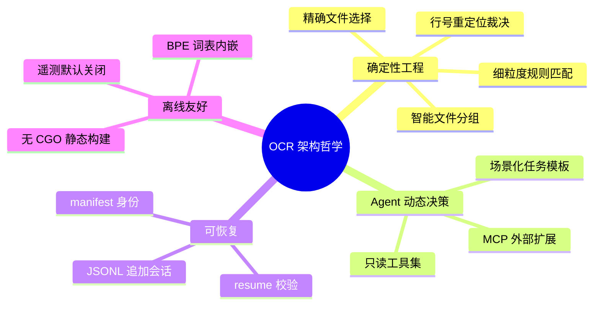
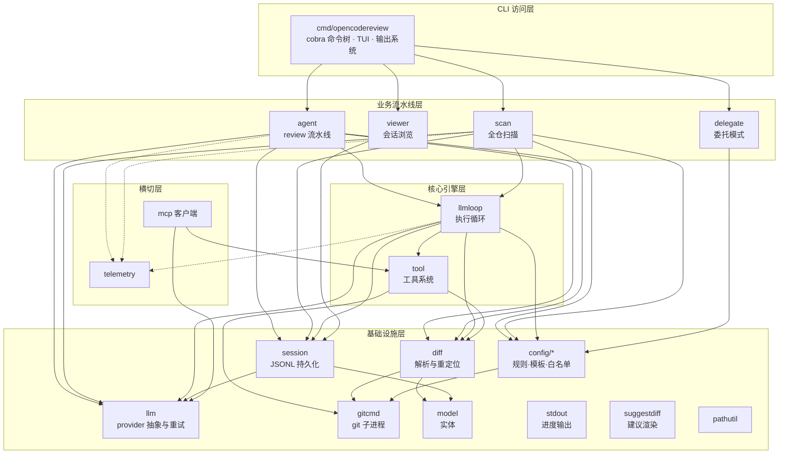
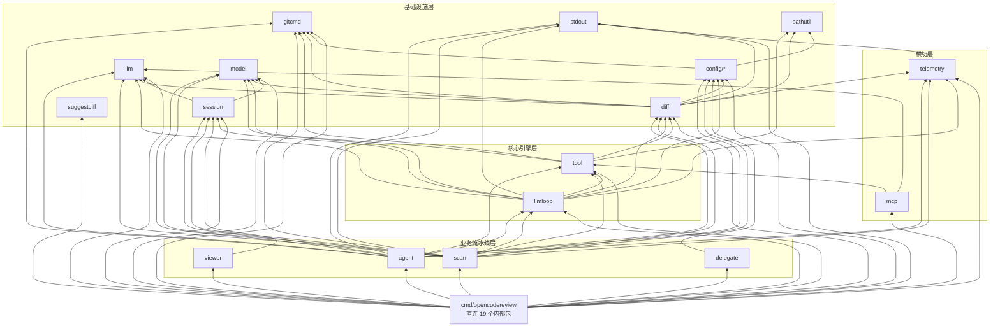
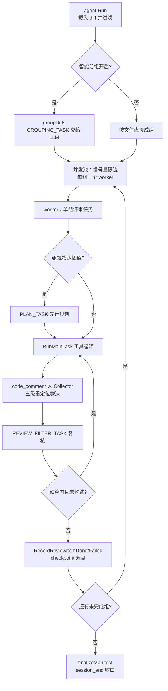
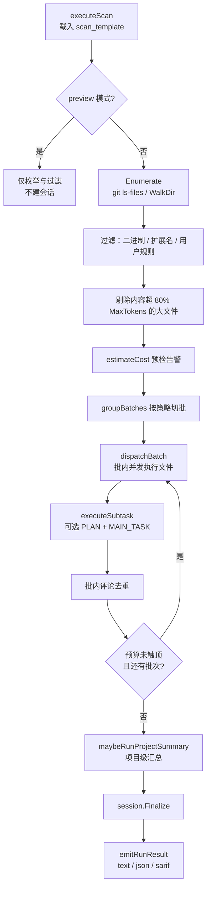
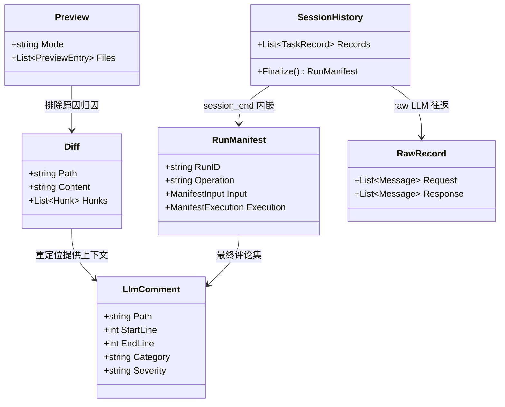
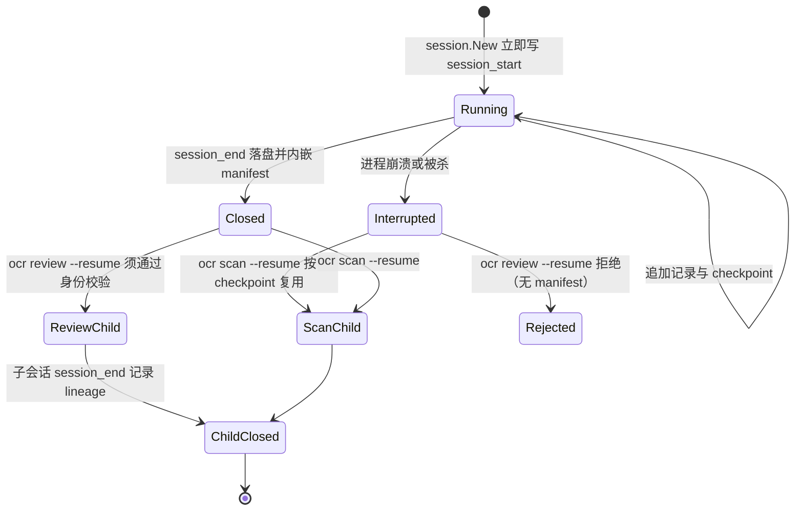

# 总体架构与全局图

> **关联源码**：`cmd/opencodereview/`（CLI 层全部）、`internal/`（18 个目录，其中 `config` 含 5 个子包、`release` 仅含测试）
> **前置阅读**：[00-overview.md](00-overview.md)。本篇是整个分析系列的**收敛篇**：把 [02](02-cli-commands.md)–[17](17-ecosystem.md) 十六篇模块分析的结论收拢为一张全局图。各节论断优先给出源码行号锚点（本篇写作时逐一核实），模块内部细节锚定到对应模块篇，避免重复展开。

## 目录

- [1. 设计哲学与架构总览](#1-设计哲学与架构总览)
  - [1.1 确定性工程 × Agent 混合架构](#11-确定性工程--agent-混合架构)
  - [1.2 单体二进制与运行形态](#12-单体二进制与运行形态)
  - [1.3 分层心智模型](#13-分层心智模型)
- [2. 五层架构全局图](#2-五层架构全局图)
- [3. 端到端审查主链路](#3-端到端审查主链路)
- [4. 内部包依赖全景](#4-内部包依赖全景)
  - [4.1 验证方法](#41-验证方法)
  - [4.2 包级依赖图](#42-包级依赖图)
  - [4.3 关键依赖边与分层例外](#43-关键依赖边与分层例外)
- [5. 并发与预算模型](#5-并发与预算模型)
  - [5.1 review 流水线：文件组级并发](#51-review-流水线文件组级并发)
  - [5.2 scan 流水线：批次调度并发](#52-scan-流水线批次调度并发)
  - [5.3 token 预算的三道闸门](#53-token-预算的三道闸门)
- [6. 核心数据模型](#6-核心数据模型)
- [7. 横切关注点](#7-横切关注点)
  - [7.1 重试体系](#71-重试体系)
  - [7.2 遥测](#72-遥测)
  - [7.3 平台兼容](#73-平台兼容)
  - [7.4 安全](#74-安全)
  - [7.5 国际化](#75-国际化)
- [8. 关键设计决策表](#8-关键设计决策表)
- [9. 已知问题与待确认事项汇总](#9-已知问题与待确认事项汇总)
  - [9.1 文档与源码冲突（以源码为准）](#91-文档与源码冲突以源码为准)
  - [9.2 各篇待确认清单](#92-各篇待确认清单)
  - [9.3 无待确认项的模块](#93-无待确认项的模块)
- [10. 扩展点指南](#10-扩展点指南)
- [11. 模块文档索引](#11-模块文档索引)

---

## 1. 设计哲学与架构总览

### 1.1 确定性工程 × Agent 混合架构

整个系统可以归结为一句话：**「不能出错的部分用确定性工程写死，需要判断的部分才交给 LLM」**。这条分界线贯穿所有模块：

- **确定性工程负责**（"must not fail"）：
  - **精确文件选择**——workspace/range/commit 三种 diff 获取策略与 include/exclude/扩展名过滤（[03-diff-engine.md](03-diff-engine.md)）；
  - **智能文件分组**——把变更切成可独立评审的组，控制单次上下文体积（[06-agent-loop.md](06-agent-loop.md)）；
  - **细粒度规则匹配**——语言嗅探 + 50 份 rule_docs 规则文档（含 default.md 兜底）按路径/模式命中（[04-config-rules.md](04-config-rules.md)）；
  - **行号裁决**——LLM 产出的评论行号必须经过三级重定位（行内解析 → 跨文件重定位 → LLM 重定位），最终行号由 CLI 输出期统一解析（[08-review-pipeline.md](08-review-pipeline.md)）。

- **Agent 负责动态决策**（需要判断力的部分）：
  - 六对**场景化任务模板**（plan/main/review_filter/grouping/re_location/memory_compression）驱动 LLM 在不同阶段切换行为（[04-config-rules.md](04-config-rules.md) §6）；
  - **只读工具集**让 LLM 按需补齐上下文（[07-tool-system.md](07-tool-system.md)）；
  - **MCP 外部工具**按需扩展工具面（[11-delegate-mcp.md](11-delegate-mcp.md) §5）。

**图 1-1** 架构哲学全景（mindmap）。导读：四个主干分别对应「确定性边界」「动态决策」「可恢复」「离线友好」四个维度；每个叶子都在后文有对应章节与源码锚点。收敛来看，这套哲学的直接产物是第 8 节的 16 项设计决策。



### 1.2 单体二进制与运行形态

OCR 是**无守护进程的单体 CLI**：`main` 函数（[main.go](../../cmd/opencodereview/main.go#L16-L28)）只做三件事——注入版本号与内嵌 BPE 词表、初始化遥测（默认关闭，见 [13-telemetry.md](13-telemetry.md)）、执行 cobra 命令树。没有后台服务、没有本地 API server（`ocr viewer` 是按需启动的只读 Web 服务器，退出即消失，见 [12-viewer-server.md](12-viewer-server.md)）。

这一形态有三重后果：

1. **状态全部落盘**。跨进程共享的唯一介质是 `~/.opencodereview/` 下的 JSONL 会话文件与配置（[10-session-persistence.md](10-session-persistence.md)），resume、viewer、session 子命令都围绕它工作。
2. **生态全部经子进程**。VS Code 扩展（[14-vscode-extension.md](14-vscode-extension.md)）、五套 agent 插件（[17-ecosystem.md](17-ecosystem.md)）、CI 集成（[15-distribution-release.md](15-distribution-release.md)）都以 `spawn ocr ...` 方式消费 CLI，输出契约是 stdout JSON + stderr 进度流。
3. **分发即二进制**。六平台 `CGO_ENABLED=0` 静态构建，npm 根包经 `optionalDependencies` 钉住六平台子包（[15-distribution-release.md](15-distribution-release.md) §2）。

### 1.3 分层心智模型

把 18 个 internal 目录按依赖方向（第 4 节逐一验证）归入五层，是阅读全部模块篇的地图：

| 层 | 包 | 一句话职责 |
|---|---|---|
| CLI 访问层 | `cmd/opencodereview` | cobra 命令树（[root.go](../../cmd/opencodereview/root.go#L46-L55) 注册 10 个子命令）、TUI、输出系统 |
| 业务流水线层 | `agent` / `scan` / `delegate` / `viewer` | 四条独立业务线：review、scan、委托、会话浏览 |
| 核心引擎层 | `llmloop` / `tool` | 与业务无关的执行循环与工具系统，被业务层复用 |
| 基础设施层 | `llm` / `diff` / `gitcmd` / `config/*` / `model` / `session` / `stdout` / `suggestdiff` / `pathutil` | provider 抽象、diff 解析、git 执行、规则模板、实体与持久化 |
| 横切层 | `telemetry` / `mcp` | 遥测（默认关闭）与 MCP 客户端（按需外接） |

分层的判定标准不是文件路径而是**依赖方向**：上层调下层，同层尽量不互调；例外与「反向边」见 4.3 节。

## 2. 五层架构全局图

**图 1-2** 五层架构（flowchart，自上而下）。导读：图中每条边都是一条真实的 Go import（验证方法见 4.1 节）；`config` 节点聚合了 `config/rules`、`config/template`、`config/allowlist`、`config/toolsconfig`、`config/testconnection` 五个子包。横切层用虚线表示——telemetry 被 CLI/业务/引擎三层调用但不在主链路上；mcp 只被 CLI 装配后注入引擎层。注意 `llmloop → tool` 与 `tool → diff` 这两条边：工具系统在引擎层内部消费基础设施，而不是直接挂在业务层。



与模块篇的对应关系：CLI 层展开见 [02-cli-commands.md](02-cli-commands.md)；`agent` 见 [06-agent-loop.md](06-agent-loop.md) 与 [08-review-pipeline.md](08-review-pipeline.md)；`scan` 见 [09-scan-pipeline.md](09-scan-pipeline.md)；`delegate` 见 [11-delegate-mcp.md](11-delegate-mcp.md)；`viewer` 见 [12-viewer-server.md](12-viewer-server.md)；`llmloop`/`tool` 见 [07-tool-system.md](07-tool-system.md)；基础设施层各包见 [03](03-diff-engine.md)、[04](04-config-rules.md)、[05](05-llm-providers.md)、[10](10-session-persistence.md)。

## 3. 端到端审查主链路

**图 1-3** 端到端审查主链路（sequenceDiagram）。导读：这是 `ocr review` 一次完整执行的最小忠实路径，与 [08-review-pipeline.md](08-review-pipeline.md) 的分阶段版对齐——08 篇按七个阶段逐步展开，本图只保留结构骨干。三个值得注意的结构点：① LLM 请求全部经 `llmloop`，业务层（agent）不直接持有 provider 客户端请求循环；② 评论的**产出**（code_comment 工具调用）与**行号裁决**（输出期 `ResolveLineNumbers`，[shared.go](../../cmd/opencodereview/shared.go#L692)）分离；③ 会话记录贯穿全程，resume 与 viewer 都依赖它。

```mermaid
sequenceDiagram
    participant U as 用户/CI
    participant CLI as cmd review_cmd
    participant CTX as config 规则+模板
    participant AG as agent
    participant LOOP as llmloop
    participant TOOL as tool
    participant LLM as llm provider
    participant SESS as session
    participant OUT as 输出系统

    U->>CLI: ocr review --from/--to · --commit · --resume ...
    CLI->>CLI: validateReviewRefs / 身份校验 / loadLLMRuntime
    CLI->>CTX: 载入规则与任务模板
    CLI->>AG: agent.New(Args)
    AG->>SESS: New 立即写 session_start
    CLI->>AG: Run(ctx)
    AG->>CTX: include/exclude/ext 过滤
    opt 分组开启
        AG->>LLM: GROUPING_TASK 智能分组
    end
    loop 每个文件组（信号量并发）
        AG->>LOOP: RunMainTask（阈值触发时前置 PLAN_TASK）
        LOOP->>LLM: 请求
        LLM-->>LOOP: 工具调用
        LOOP->>TOOL: 只读工具执行
        LOOP->>LOOP: code_comment 入 Collector + 三级重定位
        LOOP->>LLM: REVIEW_FILTER_TASK 复核
        AG->>SESS: RecordReviewItemDone/Failed
    end
    AG->>SESS: finalizeManifest + session_end
    AG-->>CLI: comments + RunManifest
    CLI->>OUT: emitRunResult 内 ResolveLineNumbers
    OUT-->>U: text / json / sarif + stderr 进度
```

scan 的平行链路见 [09-scan-pipeline.md](09-scan-pipeline.md)（枚举-过滤-切批-批内并发的不同拓扑，5.2 节对比）；委托模式的「半程链路」（OCR 只出文件清单与规则、宿主 agent 自己评审）见 [11-delegate-mcp.md](11-delegate-mcp.md)。

## 4. 内部包依赖全景

### 4.1 验证方法

本章所有依赖边来自对仓库的机械验证：对 `cmd/` 与 `internal/` 下全部非测试 `.go` 文件 grep `github.com/alibaba/open-code-review/internal/` 的 import 语句，逐文件记录（2026-09-10 快照）。图表中**只画真实存在的 import 边**；为控制规模，`config` 五个子包聚合为一个节点，cmd 的完整依赖面见 4.3 节的证据表。

包数量口径沿用 [00-overview.md](00-overview.md) §8 的裁定：internal 下 **18 个目录**；若把 config 的 5 个子包单列、计入仅含测试的 `release`，则共 23 个 Go 包。

### 4.2 包级依赖图

**图 1-4** 内部包依赖图（flowchart，自下而上 = 依赖方向）。导读：箭头 `A --> B` 表示 A import B（A 依赖 B）。这张图与图 1-2 的区别在于：图 1-2 画的是「角色与分层」，本图画的是**包粒度的全部关键依赖边**，每条边都可以在 4.3 节的表格中找到源文件证据。两个结构性观察：① `llm`、`gitcmd`、`model`、`stdout`、`pathutil`、`suggestdiff` 是六个零内部依赖的叶子包，构成依赖图的底座；② `cmd` 依赖面最宽（直连 19 个内部包，含 config 四个子包），是典型的「组装层」。



### 4.3 关键依赖边与分层例外

图 1-4 每条边的证据文件（包名 → 依赖包：源文件）：

| 依赖边 | 证据 |
|---|---|
| cmd → 15 个非 config 包 + 4 个 config 子包（共 19 个内部包） | [review_cmd.go](../../cmd/opencodereview/review_cmd.go)、[scan_cmd.go](../../cmd/opencodereview/scan_cmd.go)、[shared.go](../../cmd/opencodereview/shared.go)、[output.go](../../cmd/opencodereview/output.go)、[delegate_cmd.go](../../cmd/opencodereview/delegate_cmd.go)、[viewer_cmd.go](../../cmd/opencodereview/viewer_cmd.go) 等 |
| agent → llmloop/tool/diff/session/config/llm/gitcmd/model/stdout/telemetry（十包） | [agent.go](../../internal/agent/agent.go)（单文件聚合全部依赖）、[preview.go](../../internal/agent/preview.go)（config/allowlist） |
| scan → 与 agent 完全相同的十包（diff 经 provider.go 引入） | [agent.go](../../internal/scan/agent.go)、[provider.go](../../internal/scan/provider.go) |
| llmloop → tool/diff/session/config/llm/model/stdout/telemetry | [loop.go](../../internal/llmloop/loop.go)、[compression.go](../../internal/llmloop/compression.go)、[pool.go](../../internal/llmloop/pool.go) |
| tool → diff/gitcmd/model/pathutil | [file_find.go](../../internal/tool/file_find.go)、[filereader.go](../../internal/tool/filereader.go)、[code_comment.go](../../internal/tool/code_comment.go) |
| diff → gitcmd/model/config/llm/stdout/telemetry/pathutil | [parser.go](../../internal/diff/parser.go)、[git.go](../../internal/diff/git.go)、[relocation.go](../../internal/diff/relocation.go)、[workspace_file.go](../../internal/diff/workspace_file.go) |
| session → model/llm | [persist.go](../../internal/session/persist.go)、[raw_writer.go](../../internal/session/raw_writer.go)、[history.go](../../internal/session/history.go) |
| config(rules) → gitcmd/pathutil | [system_rules.go](../../internal/config/rules/system_rules.go)、[sniffer.go](../../internal/config/rules/sniffer.go) |
| delegate → config(rules) | [rulegroup.go](../../internal/delegate/rulegroup.go)（业务层中依赖面最窄的包，仅此一条） |
| viewer → session | [store.go](../../internal/viewer/store.go) |
| mcp → llm/tool | [provider.go](../../internal/mcp/provider.go) |
| telemetry → stdout | [events.go](../../internal/telemetry/events.go) |

**分层规则的三条例外**（都在基础设施层内部，不破坏整体方向）：

1. **diff → llm**：评论重定位的最后一级 `ReLocateComment` 需要 LLM（[relocation.go](../../internal/diff/relocation.go)）。这让「diff 引擎」不是纯文本工具，而是唯一自带 LLM 调用的基础设施包（llmloop 在 [loop.go](../../internal/llmloop/loop.go#L680-L710) 编排三级解析时调用它）。
2. **session → llm**：raw 记录器实现 `llm.RawWriter` 接口（[raw_writer.go](../../internal/session/raw_writer.go#L26)），TaskRecord 直接持有 `llm.Message`/`llm.NativeTurn` 字段（[history.go](../../internal/session/history.go#L93-L118)）——持久化层为了记录 LLM 往返而依赖 llm 的类型定义。
3. **config/rules → gitcmd**：规则解析需要调 git 判断仓库状态（[system_rules.go](../../internal/config/rules/system_rules.go)），配置层因此不是纯静态数据。

另有一处**测试专用包**：`internal/release` 只含 [asset_naming_test.go](../../internal/release/asset_naming_test.go)，不参与生产依赖图（产物命名守护，见 [15-distribution-release.md](15-distribution-release.md)）。

## 5. 并发与预算模型

两条流水线的并发拓扑**刻意不同**（对比 [08-review-pipeline.md](08-review-pipeline.md) 与 [09-scan-pipeline.md](09-scan-pipeline.md)）：review 以「文件组」为并发单元，scan 以「批次」为调度单元、批内再并发。

### 5.1 review 流水线：文件组级并发

**图 1-5** review 并发拓扑（flowchart）。导读：并发的粒度是**文件组**——每组独立走「可选 PLAN → 工具循环 → 复核」的完整流程，组间用信号量限流（[agent.go](../../internal/agent/agent.go#L690) 的 `sem` 获取/释放；评论落盘侧另有 [NewCommentWorkerPool](../../internal/agent/agent.go#L50) 工作池）。预算在**取信号量之前**做前瞻检查（[agent.go](../../internal/agent/agent.go#L654) 注释明说），避免拿到槽位后发现预算不足。



### 5.2 scan 流水线：批次调度并发

**图 1-6** scan 并发拓扑（flowchart，改编自 [09-scan-pipeline.md](09-scan-pipeline.md) 图 9-1）。导读：scan 面对的是**整仓**而非一次变更，因此多了「枚举-过滤-切批」的预处理，且预算闸门在**批次之间**——只要预算未触顶就继续派发下一批。批内并发执行文件，批与批之间是串行调度。这正是两条流水线最本质的差异：review 的并发单元自带完整生命周期，scan 的并发单元嵌在批次调度器之内。



### 5.3 token 预算的三道闸门

预算控制贯穿两条流水线，可归纳为三道闸门（细节见 [06-agent-loop.md](06-agent-loop.md) §5 与 [09-scan-pipeline.md](09-scan-pipeline.md) §5）：

| 闸门 | 位置 | 行为 |
|---|---|---|
| 入口剔除 | scan 枚举后 | 内容超过 80% MaxTokens 的文件直接不送审（[09-scan-pipeline.md](09-scan-pipeline.md)） |
| 组/批前瞻 | 取并发槽位前 | agent 逐组做预算前瞻（[agent.go](../../internal/agent/agent.go#L654)）；scan 的 estimateCost 预检告警 |
| 途中熔断 | 循环内部 | 预算触顶即停：review 收束当前组、scan 停止派发下一批，已完成的发现照常输出 |

计量基础是内嵌的 cl100k_base BPE 词表（[embedded_loader.go](../../internal/llm/embedded_loader.go)，动机是离线确定性，见 [05-llm-providers.md](05-llm-providers.md) §8）。

## 6. 核心数据模型

**图 1-7** 核心实体关系（classDiagram）。导读：`model` 包是零依赖的实体底座（[Diff](../../internal/model/diff.go#L7)、[LlmComment](../../internal/model/review.go#L7)、[Preview](../../internal/model/preview.go#L31)、[ScanItem](../../internal/model/scan.go#L10)）；`session` 包在其上叠加持久化结构。两条关键关系：**Diff 是 LlmComment 的定位上下文**（重定位系统消费），**RunManifest 是一次执行的完整身份**（resume 校验与 viewer 展示都读它）。



结构锚点：`RunManifest` 及其输入/执行子结构（[manifest.go](../../internal/session/manifest.go#L240-L274)）、`ManifestBuilder`（[manifest.go](../../internal/session/manifest.go#L330-L351)）、`SessionHistory` 与 `New`（[history.go](../../internal/session/history.go#L40)、[history.go](../../internal/session/history.go#L155)）、raw 记录（[raw_writer.go](../../internal/session/raw_writer.go#L49-L76)）。

**图 1-8** 会话生命周期（stateDiagram-v2，取自 [10-session-persistence.md](10-session-persistence.md) 的裁定版）。导读：这张状态机解释了 resume 语义的分叉——**崩溃留下的 Interrupted 会话**只能被 scan 按 checkpoint 续跑（review 因无 manifest 无法验证身份而拒绝）；**正常关闭的 Closed 会话**两条流水线都能续；子会话收口时记录 lineage 与 parent（[resume_identity.go](../../internal/session/resume_identity.go#L168)）。



## 7. 横切关注点

### 7.1 重试体系

重试不是散落的 `for` 循环，而是 `internal/llm` 里的四件套：`retry_boundary`（判定哪些错误可重试）、`retry_meta`（退避元数据）、`retry_observer`（观察协议，与决策分离）、`retry_report`（人机可读报告）。设计要点是**观察与决策分离**——策略集中可测试，报告可进输出流。全部细节见 [05-llm-providers.md](05-llm-providers.md) §7。

### 7.2 遥测

OpenTelemetry traces + metrics 双信号，无 logs 信号；三条铁律：**默认关闭**（`DefaultConfig` 的 `Enabled=false`）、**best-effort**（任何失败只打 stderr 警告，绝不打断主流程）、**关掉即 no-op**（调用方无感）。初始化只在 [main.go](../../cmd/opencodereview/main.go#L21-L23) 一处，支持 `TRACEPARENT` 继承以与 CI 编排链路拼树。隐私边界与已知盲区（`os.Exit(1)` 绕过 defer）见 [13-telemetry.md](13-telemetry.md) §7-§8。

### 7.3 平台兼容

- **构建层**：六平台 `CGO_ENABLED=0` 静态编译，无 cgo 依赖（[15-distribution-release.md](15-distribution-release.md)）。
- **源码层**：按平台的构建约束文件成对出现——[procattr_unix.go](../../cmd/opencodereview/procattr_unix.go)/[procattr_windows.go](../../cmd/opencodereview/procattr_windows.go)（子进程属性）、[shell_unix.go](../../cmd/opencodereview/shell_unix.go)/[shell_windows.go](../../cmd/opencodereview/shell_windows.go)（shell 探测）、[keycmd_unix.go](../../internal/llm/keycmd_unix.go)/[keycmd_windows.go](../../internal/llm/keycmd_windows.go)（密钥链读取）、`browser_exec` 分平台浏览器启动（[12-viewer-server.md](12-viewer-server.md) §4）。
- **测试层**：Windows 路径与编码边界有专门 CI 作业（[16-testing-quality.md](16-testing-quality.md) §6）。

### 7.4 安全

安全设计按资产分层：

| 资产 | 防线 | 出处 |
|---|---|---|
| LLM 密钥 | 系统密钥链（keychain/credential manager）优先，绝不回显 | [05-llm-providers.md](05-llm-providers.md) |
| 本机会话 | viewer 只读 + Host 白名单 + 五条安全响应头 | [12-viewer-server.md](12-viewer-server.md) §3 |
| 提示注入 | qca 模板「仓库内容当数据非指令」+ 工具白名单 | [17-ecosystem.md](17-ecosystem.md) §4 |
| 前端渲染 | DOMPurify 净化 + mermaid strict 模式 | [17-ecosystem.md](17-ecosystem.md) §1.6 |
| 供应链 | attested build provenance + SHA 固定（部分） | [15-distribution-release.md](15-distribution-release.md)、[16-testing-quality.md](16-testing-quality.md) |
| 整体论证 | ASSURANCE_CASE.md 结构化安全论证 + SECURITY.md 政策 | [16-testing-quality.md](16-testing-quality.md) §4-§5 |

### 7.5 国际化

三层各有策略：CLI 帮助文本单英文；文档站五语言 UI 表 + 内容英文回退（[17-ecosystem.md](17-ecosystem.md) §1.4）；README 五份结构硬校验、docs 翻译软提醒（[17-ecosystem.md](17-ecosystem.md) §2）。VS Code 扩展自带 locale 解析（[14-vscode-extension.md](14-vscode-extension.md)）。分析文档系列（本系列）与翻译资产互不扫描（AGENTS.md 的 english-check 豁免规则）。

## 8. 关键设计决策表

下表收敛全系列最重要的 16 项设计决策。每行给出决策、动机与证据锚点；更完整的权衡讨论见对应模块篇。

| # | 决策 | 动机 | 证据 |
|---|---|---|---|
| D1 | 行号裁决权收归 CLI 输出期：LLM 只产内容与锚点，最终行号由 `ResolveLineNumbers` 统一解析 | 单一裁决点避免行号在各路径漂移；text/json/sarif 与 resume 共享同一结果 | [shared.go](../../cmd/opencodereview/shared.go#L680-L692)、[08-review-pipeline.md](08-review-pipeline.md) |
| D2 | 自研 diff 解析器（`ParseDiffText`/`ParseHunks`），不依赖三方 diff 库 | 需要精确 hunk 边界、上下文与跨文件重定位语义，第三方库的通用模型不够 | [parser.go](../../internal/diff/parser.go#L33)、[hunk.go](../../internal/diff/hunk.go#L40)、[03-diff-engine.md](03-diff-engine.md) |
| D3 | 精简只读工具集（file_read/file_read_diff/code_search/file_find/code_comment），评论仅经 code_comment 工具通道 | 缩小幻觉面与攻击面；结构化输出强约束替代自由文本解析 | [07-tool-system.md](07-tool-system.md)、[definitions.go](../../internal/tool/definitions.go#L85) |
| D4 | 会话 JSONL 追加式持久化 + RunManifest 密封身份 | 断点续跑与崩溃恢复的可审计基础；append-only 天然防写坏 | [manifest.go](../../internal/session/manifest.go#L274)、[10-session-persistence.md](10-session-persistence.md) |
| D5 | LLM provider 声明式注册表 + 统一协议层（28 内置 provider） | 新 provider 只需一条声明；协议归一降低客户端与重试复杂度 | [providers.go](../../internal/llm/providers.go#L38)、[05-llm-providers.md](05-llm-providers.md) |
| D6 | 重试四件套（boundary/meta/observer/report）：观察与决策分离 | 重试策略集中可测试、可报告，杜绝 ad-hoc 重试散落 | [05-llm-providers.md](05-llm-providers.md) §7 |
| D7 | BPE 词表 `//go:embed` 内嵌（cl100k_base） | CI/沙箱离线运行；token 预算计量不依赖网络 | [embedded_loader.go](../../internal/llm/embedded_loader.go)、[05-llm-providers.md](05-llm-providers.md) §8 |
| D8 | prompt 模板引擎：六对任务模板 + effort 预设，而非自由文本拼接 | 场景化提示可版本化、可测试；effort 旋钮调节评审轮数 | [04-config-rules.md](04-config-rules.md) §6、[template.go](../../internal/config/template/template.go) |
| D9 | viewer 只读、零 XHR 静态前端（数据随 HTML 一次注入） | 会话数据不出本机；无客户端请求面即无 API 攻击面 | [12-viewer-server.md](12-viewer-server.md) |
| D10 | viewer Host 白名单 + 安全响应头中间件 | 防局域网 DNS rebinding 类攻击绑定伪 Host | [hostguard.go](../../internal/viewer/hostguard.go)、[12-viewer-server.md](12-viewer-server.md) §3 |
| D11 | 遥测默认关闭 + best-effort + 关闭即 no-op | 观测绝不打断主流程；数据默认不离开机器 | [13-telemetry.md](13-telemetry.md) §1 |
| D12 | MCP 仅 client 定位：外接 MCP server 扩工具，不提供 MCP server | 扩展 agent 工具面而不新增暴露面 | [mcp/provider.go](../../internal/mcp/provider.go)、[11-delegate-mcp.md](11-delegate-mcp.md) §5 |
| D13 | delegate 模式：OCR 侧免 LLM，只出文件清单与规则分组 | 宿主 agent 复用自身模型与凭证；OCR 回归纯确定性工程 | [rulegroup.go](../../internal/delegate/rulegroup.go)、[11-delegate-mcp.md](11-delegate-mcp.md)、[17-ecosystem.md](17-ecosystem.md) §5.2 |
| D14 | npm 根包 + 六平台 `optionalDependencies` 子包分发 | 一条 `npm install -g` 命令跨平台装上静态二进制；npm 只做搬运不做构建 | [15-distribution-release.md](15-distribution-release.md) §2 |
| D15 | 测试 test_home 隔离约定：五包逐字相同的 `setTestHome` helper | 测试绝不读写开发者真实 `~/.opencodereview` | [16-testing-quality.md](16-testing-quality.md) §1.3 |
| D16 | 插件生态 prompt-only：「一套 CLI、五份胶水」 | Claude Code/Codex/Cursor/opencode/QCA 零可执行代码复用同一 CLI；文本资产用契约测试守护 | [17-ecosystem.md](17-ecosystem.md) §3、§7 |

## 9. 已知问题与待确认事项汇总

本节把 16 篇模块文档中全部「待与维护者确认」事项收拢为一张清单，避免读者逐篇翻找。**冲突裁定原则**：模块文档与源码不一致时，一律以源码为准，且各篇已在正文标注。

### 9.1 文档与源码冲突（以源码为准）

| 冲突 | 裁定 | 出处 |
|---|---|---|
| 用户文档 telemetry.md 称 LLM 往返与工具执行不产生独立 span | 代码在五处创建 `llm.request`、两处创建 `tool.execute.*` span——**有** | [13-telemetry.md](13-telemetry.md) §5.4 |
| 用户文档 telemetry.md 把 `OTEL_SERVICE_NAME` 默认值写作 `open-code-review` | 那是 instrumentation 名；不设环境变量时 span 无 `service.name` 资源属性 | [13-telemetry.md](13-telemetry.md) §3.5 |
| opencode 插件 README 写「15 分钟总超时」 | 工具层默认 30 分钟；15 分钟只是 `runOcr` 未显式传参时的兜底 | [17-ecosystem.md](17-ecosystem.md) §3.5 |
| ci.yml 注释称 Windows 覆盖率会跌破「Linux 强制的 80%」 | 实际门槛 90%（Makefile 与 ci.yml 自身） | [15-distribution-release.md](15-distribution-release.md) §8、[16-testing-quality.md](16-testing-quality.md) §3 |
| ci.yml 注释称 golang:1.26.5 镜像 | test 作业实为 golang:1.26.6 | [15-distribution-release.md](15-distribution-release.md) §8 |
| examples/README 只列 5 种 CI 集成 | 实际 6 种（漏列 codeup_ci） | [00-overview.md](00-overview.md) §8 |
| 分析计划文档称 internal 19 个包 | 实际 18 个目录（config 五子包单列则 23 个 Go 包） | [00-overview.md](00-overview.md) §8 |

### 9.2 各篇待确认清单

| 篇 | 待确认事项 |
|---|---|
| [00-overview](00-overview.md) | ROADMAP 的 Delegate Mode 已部分落地，端到端形态是否等于现有 `ocr delegate` 能力；AACR-Bench 文本无数值（以图表/HuggingFace 为准） |
| [04-config-rules](04-config-rules.md) | scan_template 各任务 `timeout` 字段未被结构体消费（预留还是遗留）；`EffortPreset` 唯一旋钮是 `MaxReviewRounds`，是否有扩展计划；`objc.md` 是 default.md 的占位副本，正式 Objective-C 规则是否在计划中 |
| [05-llm-providers](05-llm-providers.md) | `o200k_base` 未内嵌——o1/o3/o4 模型 token 计量退化为 `len/4` 启发式，是否补内嵌；bpe_data 精确字节数 |
| [06-agent-loop](06-agent-loop.md) | `stripMarkdownFences`/`buildMessageXML`/`copyMessages` 在 util.go 与 compression.go 各有一份等价实现（拆包遗留），是否收敛 |
| [07-tool-system](07-tool-system.md) | `ToolNotFoundMsg` 与 `NotAvailableMsg` 文本相同且前者无引用（死常量还是兼容别名）；README「工具集从生产数据蒸馏」无仓库内佐证；`code_comment` 直通路径仅测试可达，是否与 loop 内增强路径合并 |
| [09-scan-pipeline](09-scan-pipeline.md) | `file_read_diff` 已对 LLM 隐藏，`injectScanContentMap` 仍填充其 DiffMap（防幻觉调用还是历史遗留）；scan_template timeout 字段（同 04 篇） |
| [13-telemetry](13-telemetry.md) | review 的 `[ocr] TraceID:` 恒为空（打印处读 `ctx` 而非含 span 的 `runCtx`，疑笔误）；metric exporter 失败而 trace 成功时的 nil provider 潜在 panic 路径；`PhaseEvent` 定义且测过但无生产调用；`os.Exit(1)` 绕过 defer 丢失失败 run 的遥测；service.name 文档措辞（见 9.1） |
| [14-vscode-extension](14-vscode-extension.md) | package.json 声明 6 命令但只注册 4（`COMMANDS.reviewStart/Cancel` 无注册方）；`cliStatus` 消息无发送方；ConfigView `layout: modal` 形态无使用方；进度换流现靠 `--format json` 的隐式 stdout swap 契约，`--progress-stderr` 显式 flag 是 TODO |
| [15-distribution-release](15-distribution-release.md) | `.github/release.yml` 是否闲置（release workflow 自行生成 notes）；VS Code 扩展未见 vsce 发布工作流；workflow 内 action 引用未统一 SHA 固定 |
| [16-testing-quality](16-testing-quality.md) | ci.yml 80%/90% 注释漂移（同 15 篇，见 9.1） |
| [17-ecosystem](17-ecosystem.md) | opencode 插件 README 15 分钟 vs 代码 30 分钟超时（见 9.1） |

### 9.3 无待确认项的模块

[02-cli-commands.md](02-cli-commands.md)、[03-diff-engine.md](03-diff-engine.md)、[08-review-pipeline.md](08-review-pipeline.md)（该篇明确记录「待确认为无」）、[10-session-persistence.md](10-session-persistence.md)、[11-delegate-mcp.md](11-delegate-mcp.md)、[12-viewer-server.md](12-viewer-server.md) 六篇写作时未发现需要标注待确认的行为论断。

## 10. 扩展点指南

五类常见扩展的「改哪里」清单。共同原则：先读对应模块篇，再按下表定位文件。

**新增 LLM provider**

1. 在 [providers.go](../../internal/llm/providers.go#L38) 的 `registry` 追加一条 `Provider` 声明（Name/Protocol/BaseURL/EnvVar/Models）——已有协议族（Anthropic/OpenAI 等）零新代码；
2. 仅当引入新协议族时才动 `protocol.go` 与 client 实现；
3. 测试落在 `providers_test.go`；端到端用 `ocr llm test` 验证（[testconnection](../../internal/config/testconnection/testconnection.go)）。
4. 详见 [05-llm-providers.md](05-llm-providers.md)。

**新增语言规则**

1. [system_rules.json](../../internal/config/rules/system_rules.json) 增加语言条目（pattern 匹配路径）；
2. [rule_docs/](../../internal/config/rules/rule_docs) 下新增 `<lang>.md` 规则正文（`objc.md` 是占位先例，见 9.2）；
3. 必要时更新 [sniffer.go](../../internal/config/rules/sniffer.go) 的语言嗅探映射；
4. 测试：`sniffer_test.go`/`system_rules_test.go`。详见 [04-config-rules.md](04-config-rules.md)。

**新增 agent 工具**

1. `internal/tool/` 新建 provider 文件（参考 [file_read.go](../../internal/tool/file_read.go#L19) 的最小形态）；
2. [definitions.go](../../internal/tool/definitions.go#L85) 的 `NewRegistry` 注册（保留名检查见 `IsReserved`）；
3. [tools.json](../../internal/config/toolsconfig/toolsconfig.go) 加开关与参数上限；
4. **MCP 工具无需改代码**——经 [mcp/provider.go](../../internal/mcp/provider.go) 动态注册（[11-delegate-mcp.md](11-delegate-mcp.md) §5）。
5. 详见 [07-tool-system.md](07-tool-system.md)。

**新增子命令**

1. `cmd/opencodereview/` 新建 `<name>_cmd.go`；
2. [root.go](../../cmd/opencodereview/root.go#L46-L55) `AddCommand` 注册（现役 10 个子命令）；
3. 输出复用 [shared.go](../../cmd/opencodereview/shared.go#L680) 的 `emitRunResult` 与 quiet handle 机制，勿自造格式；
4. 测试按 e2e 惯例放 `cmd/opencodereview`（[16-testing-quality.md](16-testing-quality.md)）。详见 [02-cli-commands.md](02-cli-commands.md)。

**CI / 宿主平台集成**

- GitHub：根 [action.yml](../../action.yml) 复合动作（PR 自动评审，`pull_request_target`）；详见 [15-distribution-release.md](15-distribution-release.md) §4；
- 其他 CI：`examples/` 六种模板（github_actions/gitlab_ci/bitbucket_pipelines/gitflic_ci/gerrit_ci/codeup_ci）；
- agent 宿主：`plugins/open-code-review/` 与根 `skills/`（prompt-only，注意 plugin-contract.yml 守护 frontmatter 与链接完整性）；委托模式面向无 OCR 凭证的宿主。详见 [17-ecosystem.md](17-ecosystem.md)。

## 11. 模块文档索引

| 篇 | 主题 | 一句话定位 |
|---|---|---|
| [00-overview.md](00-overview.md) | 总览 | 项目定位、术语表、阅读路线、差异记录 |
| [01-architecture.md](01-architecture.md) | **本篇** | 五层架构、依赖全景、决策表、待确认汇总 |
| [02-cli-commands.md](02-cli-commands.md) | CLI 层 | cobra 命令树、子命令逐一走读、输出系统 |
| [03-diff-engine.md](03-diff-engine.md) | diff 引擎 | git 执行、三种获取策略、解析器与 hunk 模型 |
| [04-config-rules.md](04-config-rules.md) | 配置与规则 | 规则库、语言嗅探、rule_docs、模板引擎、白名单 |
| [05-llm-providers.md](05-llm-providers.md) | LLM 层 | provider 注册表、协议层、密钥、重试四件套、token 计量 |
| [06-agent-loop.md](06-agent-loop.md) | Agent | 生命周期、分组、预算、preview、并发池 |
| [07-tool-system.md](07-tool-system.md) | 工具系统 | 注册与 JSON Schema、五个内置工具、评论收集器 |
| [08-review-pipeline.md](08-review-pipeline.md) | review 流水线 | 七阶段端到端走读、输出系统、失败与恢复 |
| [09-scan-pipeline.md](09-scan-pipeline.md) | scan 流水线 | 枚举-过滤-切批-批内并发、预算、preview/resume |
| [10-session-persistence.md](10-session-persistence.md) | 会话持久化 | JSONL 布局、manifest、resume 身份、session 子命令 |
| [11-delegate-mcp.md](11-delegate-mcp.md) | 委托与 MCP | delegate 命令、规则分组、MCP 客户端架构 |
| [12-viewer-server.md](12-viewer-server.md) | viewer | 只读 Web 服务器、安全设计、跨平台浏览器 |
| [13-telemetry.md](13-telemetry.md) | 遥测 | OTel 双信号、exporter、隐私边界 |
| [14-vscode-extension.md](14-vscode-extension.md) | VS Code 扩展 | extension host/webview/CLI 子进程三层 |
| [15-distribution-release.md](15-distribution-release.md) | 分发发布 | npm 打包、安装脚本、GitHub Action、release 流水线 |
| [16-testing-quality.md](16-testing-quality.md) | 测试质量 | 四层测试、覆盖率工程、门禁、安全论证 |
| [17-ecosystem.md](17-ecosystem.md) | 生态 | 文档站、五宿主插件、skills、qca 模板 |

---

> **收敛结论**：这是一个依赖方向清晰（五层、六个零依赖叶子包）、哲学一致（确定性工程划定 LLM 边界）、状态全落盘（JSONL + manifest）、生态全文本（prompt-only 插件 + 契约测试守护）的单体 CLI。读懂图 1-2（分层）、图 1-4（依赖）与本节索引，即可按需进入任意模块篇深潜。
