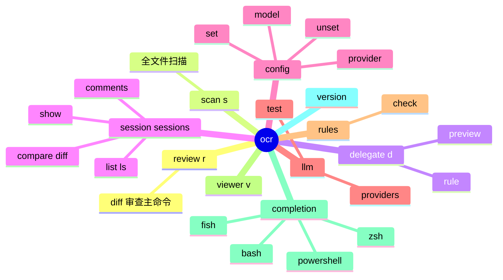
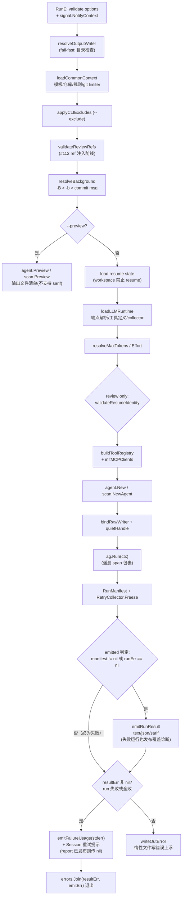
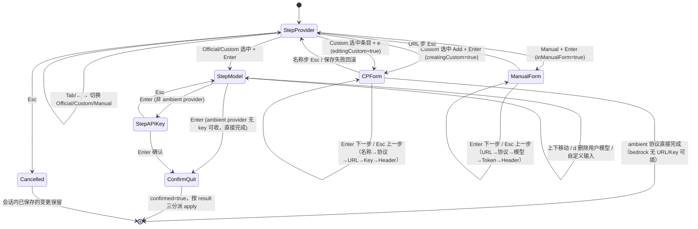

# CLI 命令层

> **关联源码**：`cmd/opencodereview/`（main.go、root.go、review_cmd.go、scan_cmd.go、delegate_cmd.go、session_cmd.go、config_cmd.go、llm_cmd.go、rules_cmd.go、viewer_cmd.go、completion.go、version.go、shared.go、shared_flags.go、output.go、sarif.go、provider_cmd.go、provider_tui.go、color.go、flag_suggest.go、arg_errors.go、git.go、background_file.go、shell_unix.go / shell_windows.go、procattr_unix.go / procattr_windows.go）
> **前置阅读**：[00-overview.md](00-overview.md)

## 目录

1. [模块职责与定位](#1-模块职责与定位)
2. [入口与命令树](#2-入口与命令树)
3. [命令清单总表](#3-命令清单总表)
4. [核心子命令走读：ocr review](#4-核心子命令走读ocr-review)
5. [核心子命令走读：ocr scan](#5-核心子命令走读ocr-scan)
6. [其余子命令走读](#6-其余子命令走读)
7. [共享机制](#7-共享机制)
8. [输出系统](#8-输出系统)
9. [Provider TUI](#9-provider-tui)
10. [平台差异层](#10-平台差异层)
11. [Git 辅助与后台上下文](#11-git-辅助与后台上下文)
12. [测试布局概览](#12-测试布局概览)
13. [源文件覆盖清单](#13-源文件覆盖清单)

## 1. 模块职责与定位

`cmd/opencodereview` 是整个工具的**表现层**：它把 internal 各模块的能力（agent 审查、diff 解析、规则解析、LLM 客户端、会话持久化、遥测）组装成一条用户可执行的命令管线。它的边界纪律相当清晰——本目录不实现任何审查逻辑，只负责：

- **参数解析与校验**：Cobra 命令树、flag 注册、互斥模式校验（[shared_flags.go](../../cmd/opencodereview/shared_flags.go#L85-L103)）、退出码契约（[review_cmd.go](../../cmd/opencodereview/review_cmd.go#L315-L341)）；
- **装配**：把校验过的选项装配成 `agent.Args` / `scan.Args` 并构造运行时（`commonContext` + `llmRuntime`，见第 7 章）；
- **输出契约**：text / json / sarif 三种格式的渲染、`--output` 文件的惰性创建与 ANSI 剥离（第 8 章）；
- **交互式配置**：Provider/Model 两个 Bubble Tea TUI 向导（第 9 章）。

与 internal 的分工遵循一条原则：**凡是会被两条以上命令复用的装配逻辑都下沉到 shared.go**，凡是只在命令间共享的 flag 注册都集中到 shared_flags.go。因此 review_cmd.go（589 行）与 scan_cmd.go（284 行）的 `execute*Context` 读起来是纯粹的「顺序装配 + 错误传播」管道，没有横切的工具函数。

另一个值得记录的设计：命令层是**仓库中唯一允许 `package main` 的目录**，版本注入（`-X main.Version=...`，[version.go](../../cmd/opencodereview/version.go#L12-L17)）也发生在这一层，internal 模块需要版本号时（如遥测、MCP 客户端握手）通过 `llm.AppVersion = Version`（[main.go](../../cmd/opencodereview/main.go#L17)）这样的显式赋值传递，而不是反向依赖命令层。

## 2. 入口与命令树

### 2.1 main 与 root

[main.go](../../cmd/opencodereview/main.go#L16-L29) 只有 14 行，做了四件事：注入 LLM 客户端可见的版本号、初始化嵌入式 prompt 加载器、按需启动遥测（`telemetry.Init` 返回 false 时完全不引入 collector，关掉时零开销）、执行 `rootCmd.Execute()` 并在失败时向 stderr 打印 `Error: %v` 后 `os.Exit(1)`。

[root.go](../../cmd/opencodereview/root.go#L13-L39) 定义了根命令 `ocr`，两个值得注意的细节：

- `SilenceUsage: true, SilenceErrors: true`（[L20-L21](../../cmd/opencodereview/root.go#L20-L21)）——Cobra 默认会把 usage 连同错误一起打两遍，这里全部静默，错误的呈现方式完全由 main.go 的统一出口控制。代价是**错误信息必须自带引导**，这正是 [arg_errors.go](../../cmd/opencodereview/arg_errors.go#L14-L19) 注释里说明的设计动机：参数个数错误必须拼上命令自己的 Use/Example，否则用户什么都看不到。
- `PersistentPreRunE`（[L24-L30](../../cmd/opencodereview/root.go#L24-L30)）在**任何**子命令的 RunE 之前运行，先校验 `--color` 值再解析颜色决策。校验放在这里而不是 flag 校验函数里，是为了「每个子命令一次」的语义——`ocr --color=never review` 与 `ocr review --color=never` 等价（`--color` 注册为 persistent flag，[color.go](../../cmd/opencodereview/color.go#L35-L39)）。

根命令自身支持 `--version/-V`（打印版本）和无参数时打印帮助（[L31-L38](../../cmd/opencodereview/root.go#L31-L38)）。

命令注册集中在 [init](../../cmd/opencodereview/root.go#L41-L56)：共 10 个一级命令——version、review、scan、delegate、session、config、llm、rules、viewer、completion。

**图 2-1**：命令树总览

### 2.2 版本命令

[version.go](../../cmd/opencodereview/version.go#L19-L30) 是最小的一个命令：`ocr version` 直接打印 [versionString](../../cmd/opencodereview/root.go#L58-L69)。三个变量 `Version`（默认 `"dev"`）、`GitCommit`、`BuildDate` 由 ldflags 注入（[L12-L17](../../cmd/opencodereview/version.go#L12-L17)），输出格式为 `open-code-review <version> (<commit>) <os>/<arch>` 加可选的构建时间与项目主页。注意根命令的 `-V` 与 `ocr version` 走的是同一个 `printVersion`，两者永远一致。

## 3. 命令清单总表

下表是命令层全部对外命令的权威清单（别名来自各 cobra.Command 的 `Aliases` 字段；flag 默认值来自 [shared_flags.go](../../cmd/opencodereview/shared_flags.go)）：

| 命令 | 别名 | 位置参数 | 关键 flag（默认值） | 职责 |
|---|---|---|---|---|
| `ocr review` | `r` | 无（`cobra.NoArgs`） | `--from --to` / `--commit/-c`、`--resume`、`--format/-f`（text）、`--audience`（human）、`--output/-o`、`--concurrency`（8）、`--timeout`（15 分钟）、`--max-tools`（0=模板默认）、`--max-git-procs`（16）、`--max-tokens`（0）、`--max-tokens-budget`（0=不限）、`--background/-b`、`--background-file/-B`、`--provider`、`--model`、`--effort`、`--no-filter`、`--preview/-p`、`--exclude`、`--rule`、`--repo`、`--tools` | diff 驱动的 LLM 代码审查（[review_cmd.go](../../cmd/opencodereview/review_cmd.go#L60-L107)） |
| `ocr scan` | `s` | 无 | review 全套并发/输出 flag + `--path`、`--no-plan`、`--no-dedup`、`--no-summary`、`--batch` | 全文件扫描，无需 diff（[scan_cmd.go](../../cmd/opencodereview/scan_cmd.go#L55-L90)） |
| `ocr delegate preview` | — | 无 | `--from --to --commit`、`--exclude`、`--rule`、`--background/-B`、`--max-git-procs`（16）、`--format/-f`（text/json） | 输出待审查文件清单 + 模式/ref 元数据，供宿主 Agent 构造 git 命令，**不调 LLM**（[delegate_cmd.go](../../cmd/opencodereview/delegate_cmd.go#L57-L68)） |
| `ocr delegate rule` | — | `<path...>`（≥1） | 同上 | 输出按内容分组的审查规则（[delegate_cmd.go](../../cmd/opencodereview/delegate_cmd.go#L70-L81)） |
| `ocr session list` | `ls` | 无 | `--repo`、`--json`、`--limit`（20） | 列出当前仓库的持久化会话（[session_cmd.go](../../cmd/opencodereview/session_cmd.go#L34-L43)） |
| `ocr session show` | — | `<session-id>` | `--repo`、`--json` | 查看单个会话元数据与逐文件条目（[session_cmd.go](../../cmd/opencodereview/session_cmd.go#L48-L56)） |
| `ocr session comments` | — | `<session-id>` | `--severity`、`--category`、`--json` | 查看/过滤会话内评论（[session_cmd.go](../../cmd/opencodereview/session_cmd.go#L63-L72)） |
| `ocr session compare` | `diff` | `<before> <after>` | `--repo`、`--json` | 对比两会话的 new/persisting/resolved/not-reviewed（[session_cmd.go](../../cmd/opencodereview/session_cmd.go#L77-L95)） |
| `ocr config set` | — | `<key> <value>` | — | 写配置键（providers.*/custom_providers.*/mcp_servers.*/llm.*/telemetry.* 等 23 类，[config_cmd.go](../../cmd/opencodereview/config_cmd.go#L420-L443)） |
| `ocr config unset` | — | `<key>` | — | 删除 provider/max_tokens/effort/custom_providers.\<name\>/mcp_servers.\<name\>（[config_cmd.go](../../cmd/opencodereview/config_cmd.go#L149-L178)） |
| `ocr config provider` | — | 无 | — | 交互式 Provider 配置向导（TUI，第 9 章） |
| `ocr config model` | — | 无 | — | 交互式模型选择（TUI，第 9 章） |
| `ocr llm test` | — | 无 | — | 连通性探测：发一条测试对话（[llm_cmd.go](../../cmd/opencodereview/llm_cmd.go#L30-L37)） |
| `ocr llm providers` | — | 无 | — | 列出内置 provider 表（[llm_cmd.go](../../cmd/opencodereview/llm_cmd.go#L39-L46)） |
| `ocr rules check` | — | `<file-path>` | `--repo`、`--rule` | 显示某文件命中的审查规则及其来源层（[rules_cmd.go](../../cmd/opencodereview/rules_cmd.go#L27-L37)） |
| `ocr viewer` | `v` | 无 | `--addr`（localhost:5483）、`--open`（auto/always/never） | 启动会话历史 WebUI（[viewer_cmd.go](../../cmd/opencodereview/viewer_cmd.go#L18-L34)） |
| `ocr completion` | — | `<bash\|zsh\|fish\|powershell>` | — | 生成 shell 补全脚本（[completion.go](../../cmd/opencodereview/completion.go#L13-L33)） |
| `ocr version` | — | 无 | — | 打印版本（[version.go](../../cmd/opencodereview/version.go#L19-L26)） |
| `ocr`（根） | — | 无 | `--version/-V`、`--color`（auto） | 帮助/版本入口（[root.go](../../cmd/opencodereview/root.go#L13-L39)） |

所有命令共享根命令的 persistent flag `--color`（auto/always/never）；review/scan 额外共享 `--format`/`--audience`/`--output` 与并发类 flag，注册逻辑集中在 [shared_flags.go](../../cmd/opencodereview/shared_flags.go#L15-L81) 的 `add*Flag` 家族。父命令（session、config、llm、rules、delegate）自身都只是 `cmd.Help()` 的占位（如 [session_cmd.go](../../cmd/opencodereview/session_cmd.go#L20-L28)）。

## 4. 核心子命令走读：ocr review

`ocr review` 是整个 CLI 的主命令，[review_cmd.go](../../cmd/opencodereview/review_cmd.go) 的结构分三段：命令定义与参数校验（L60-L111）、执行管线 `executeReviewContext`（L113-L313）、辅助函数（L315-L589）。

### 4.1 RunE 前置层

[RunE](../../cmd/opencodereview/review_cmd.go#L99-L106) 做两件事：先跑 [validateReviewOptions](../../cmd/opencodereview/shared_flags.go#L124-L162)（互斥模式、format/audience 归一化、数值下限、effort 枚举），再用 `signal.NotifyContext(os.Interrupt, syscall.SIGTERM)` 把 Ctrl-C 变成 ctx 取消传入执行层——**取消语义是命令层的职责**，agent 内部只观察 ctx。

[validateReviewOptions](../../cmd/opencodereview/shared_flags.go#L124-L162) 的核心规则：模式互斥由 [validateDiffMode](../../cmd/opencodereview/shared_flags.go#L85-L103) 实现（`--from/--to` 与 `--commit` 只能指定一种，`--from` 与 `--to` 必须成对出现）、`--preview` 与 `--resume` 互斥（[L128-L130](../../cmd/opencodereview/shared_flags.go#L128-L130)）。`--max-tools` 有 50 的下限（低于时打警告并抬升，[L139-L146](../../cmd/opencodereview/shared_flags.go#L139-L146)）。

### 4.2 executeReviewContext 装配管线

[executeReviewContext](../../cmd/opencodereview/review_cmd.go#L113-L313) 是一条严格顺序的装配线，每一步都可能提前返回错误：

1. **输出目标解析**（[L114-L122](../../cmd/opencodereview/review_cmd.go#L114-L122)）：`resolveOutputWriter` 先于一切执行，目录/父目录不存在的 fail-fast 检查在此完成（详见第 8 章）；
2. **公共上下文**（[L124-L129](../../cmd/opencodereview/review_cmd.go#L124-L129)）：`loadCommonContext` 加载模板、解析仓库路径、构造规则 Resolver 与 git 并发限制器（第 7.1 节）；CLI `--exclude` 通过 `applyCLIExcludes` 追加到 FileFilter；
3. **ref 注入防线**（[L131-L134](../../cmd/opencodereview/review_cmd.go#L131-L134)）：[validateReviewRefs](../../cmd/opencodereview/review_cmd.go#L466-L491) 拒绝以 `-` 开头的 ref，并用 `git rev-parse --verify --end-of-options <ref>^{commit}` 验证每个 `--from/--to/--commit` 都是真实 commit ref——这是 issue #112 的安全修复，必须在**任何** git 调用之前执行；
4. **后台上下文**（[L136-L140](../../cmd/opencodereview/review_cmd.go#L136-L140)）：`resolveBackground` 解析 `--background-file` > `--background` > commit message 的优先级（第 11.2 节）；
5. **preview 短路**（[L142-L144](../../cmd/opencodereview/review_cmd.go#L142-L144)）：`--preview` 直接走 `agent.Preview` 输出文件清单，不构造 LLM 运行时；
6. **resume 状态加载**（[L146-L149](../../cmd/opencodereview/review_cmd.go#L146-L149)）：[loadReviewResumeState](../../cmd/opencodereview/review_cmd.go#L343-L368) 拒绝 workspace 模式的 resume，并用 `state.ValidateOptions` 校验当前 CLI 参数与会话记录一致；
7. **LLM 运行时**（[L151-L168](../../cmd/opencodereview/review_cmd.go#L151-L168)）：`loadLLMRuntime`（第 7.2 节）解析端点与工具定义；`resolveMaxTokens` 按 CLI > app config > 模板默认的优先级定 token 上限，`resolveEffort` 同理（[shared.go](../../cmd/opencodereview/shared.go#L50-L76)）；
8. **resume 身份校验**（[L173-L176](../../cmd/opencodereview/review_cmd.go#L173-L176)）：[validateResumeIdentity](../../cmd/opencodereview/review_cmd.go#L384-L412) 在 `agent.New` **之前**执行——`agent.New` 会立即写 session_start 事件，校验晚了会留下孤儿会话。它解析当前输入的密封身份（sealed identity，覆盖 input/rules/provider/model 四元组）并与父会话比对，其中 provider/model 只在**命令行显式传参**时参与比对（`ProviderExplicit: opts.provider != ""`），因为这次校验要拒绝的正是「父会话之后用户改了 config 文件或环境变量」的静默漂移（[L370-L383](../../cmd/opencodereview/review_cmd.go#L370-L383) 的注释完整论证了顺序约束：还必须在 max-tokens 解析之后，因为 filterLargeDiffs 用它决定丢什么）；
9. **工具注册表与 MCP**（[L188-L208](../../cmd/opencodereview/review_cmd.go#L188-L208)）：`buildToolRegistry` 注册 file_read/file_find/file_read_diff/code_search/code_comment 五件套；[initMCPClients](../../cmd/opencodereview/review_cmd.go#L509-L579) 按配置逐个拉起 stdio/remote MCP server（remote 走 Streamable HTTP，stdio 先跑可选的 `setup` 命令，5 分钟超时，失败降级为警告而非中断审查——[L547-L566](../../cmd/opencodereview/review_cmd.go#L547-L566)）。MCP 工具定义追加进 Plan/Main 两套 ToolDefs；
10. **Agent 构造与运行**（[L210-L262](../../cmd/opencodereview/review_cmd.go#L210-L262)）：组装 `agent.Args`（含 CommentWorkerPool 并发池、SealedInput、MaxTokensBudget、SkipFilter 等 21 个字段），绑定 raw writer（`OCR_RAW_LOGGING=1` 时的原始请求落盘，[bindRawWriter](../../cmd/opencodereview/shared.go#L277-L297)），`newQuietHandle` 静默 stdout，然后开 `review.run` 遥测 span，`ag.Run(runCtx)` 返回 comments 与错误；
11. **结果冻结与发布**（[L264-L312](../../cmd/opencodereview/review_cmd.go#L264-L312)）：先 `ag.RunManifest()` 冻结覆盖清单，再 `rt.RetryCollector.Freeze` 冻结重试报告（run_id 用内存 UUID 而非可能为空的持久化 ID，注释 L264-L269 论证了为什么）。发布顺序刻意安排：**即使 runErr 非 nil，只要 manifest 构造成功也先 emitRunResult 发布完整结果**（[L288-L295](../../cmd/opencodereview/review_cmd.go#L288-L295)），然后才走失败路径 `emitFailureUsage` + 返回 `errors.Join(resultErr, emitErr)`。

**图 2-2**：review / scan 共享的执行管线

### 4.3 退出码契约

[reviewResultError](../../cmd/opencodereview/review_cmd.go#L315-L341) 定义了 review 的退出契约，注释（L320-L330）把它写得很明确：**非零仅限 run 级失败或「所有选中条目全部失败」**。manifest 的 terminal_state 为 `partial`（比如 token 预算截断——受控截断不算 run_failure）时只要覆盖了任何东西就退出 0；`complete/partial/skipped` 都成功，只有 `failed` 落到非零分支。这条契约被 SARIF 的 `executionSuccessful` 映射（第 8.4 节）和 JSON 的 `status` 字段共同遵守。

### 4.4 resume 的两级校验

resume 在命令层有两道闸：

- [loadReviewResumeState](../../cmd/opencodereview/review_cmd.go#L343-L368)：参数级校验（模式一致、`--resume` 值存在）。注意它**故意放行**「父会话全部条目失败」的情况——有可验证的 manifest 就能整体重新分发；
- [validateResumeIdentity](../../cmd/opencodereview/review_cmd.go#L384-L412)：身份级校验。返回的 `sealed.ResolvedHead` 随后被 [fileReadRef](../../cmd/opencodereview/review_cmd.go#L421-L430) 用来替换用户输入的 ref：密封输入把 file_read 的读取锚定到「准入时刻该 ref 解析到的 commit」，防止审查过程中 ref 被移动导致模型读到与 diff 不同版本的文件（workspace 模式无 ref，保持读工作树）。

## 5. 核心子命令走读：ocr scan

[scan_cmd.go](../../cmd/opencodereview/scan_cmd.go) 与 review 共享同一条管线骨架（[executeScan](../../cmd/opencodereview/scan_cmd.go#L111-L250)），差异点集中在四处：

1. **独立模板**：scan 不用 diff 审查模板，而是 [template.LoadScanDefault](../../cmd/opencodereview/scan_cmd.go#L131-L145) 加载 `scan_template.json`，`--max-tools` 只允许抬高（「only raise」）模板的 `MaxToolRequestTimes`；`--batch` 直接覆盖 `BatchStrategy`（未知值下游静默回退 `none`）；token 预算由 `--max-tokens-budget` 覆盖模板值（[L146-L150](../../cmd/opencodereview/scan_cmd.go#L146-L150)）；
2. **非 git 容忍**：`loadCommonContext(..., requireGit=false)`（[L122](../../cmd/opencodereview/scan_cmd.go#L122)），非 git 目录允许扫描（文件枚举回退 `filepath.Walk`）；同时 contentRef 传空，规则嗅探读工作树而非 ref；
3. **工具裁剪**：[excludeToolDef(rt.MainToolDefs, "file_read_diff")](../../cmd/opencodereview/scan_cmd.go#L188) 把 `file_read_diff` 从工具清单剔除——scan 没有 diff，暴露它只会让 LLM 浪费轮次探测不存在的 diff 内容（[L185-L187](../../cmd/opencodereview/scan_cmd.go#L185-L187) 注释）。FileReader 也固定 `Mode: tool.ModeWorkspace`（[L191-L195](../../cmd/opencodereview/scan_cmd.go#L191-L195)）；
4. **scan 特有流程开关**：`SkipPlan`（跳过逐文件 PLAN_TASK 预处理）、`SkipDedup`（跳过批内去重）、`SkipSummary`（跳过 PROJECT_SUMMARY_TASK 汇总）三个布尔开关直传 `scan.Args`（[L216-L218](../../cmd/opencodereview/scan_cmd.go#L216-L218)）。

scan 的 resume 走 [loadScanResumeState](../../cmd/opencodereview/scan_cmd.go#L252-L267)：校验扫描路径一致且至少有一个已完成条目。scan 传给 `emitRunResult` 的 retryReport 恒为 nil（scan 的请求不带 RequestMeta，collector 不会记录任何东西，冻结结果自然为 nil，见 [shared.go](../../cmd/opencodereview/shared.go#L188-L193) 注释）。

`splitPaths`（[L96-L109](../../cmd/opencodereview/scan_cmd.go#L96-L109)）是 `--path`/`--exclude` 共用的逗号分隔解析器，容忍空段与空白。

## 6. 其余子命令走读

### 6.1 ocr delegate（委托模式）

[delegate_cmd.go](../../cmd/opencodereview/delegate_cmd.go) 面向宿主 Agent（Claude Code / Codex 等）输出「审查规格」而非执行审查——完全不触碰 LLM。[loadDelegateContext](../../cmd/opencodereview/delegate_cmd.go#L96-L117) 复用 review 的公共上下文 + ref 注入防线 + background 解析，保证宿主 Agent 看到的文件清单与真正跑 `ocr review` 时一致：

- `delegate preview`（[executeDelegatePreview](../../cmd/opencodereview/delegate_cmd.go#L157-L223)）：在 `agent.Preview` 结果之上附加 mode/from/to/commit/merge_base/background 元数据（merge-base 由 [diff.NewProvider](../../cmd/opencodereview/delegate_cmd.go#L131-L138) 计算，仅 range 模式非空）。text 格式输出 Markdown 清单（被排除文件用 `~~删除线~~` 标记并带原因），json 格式输出 `schema_version: "1"` 的结构（[delegatePreviewJSON](../../cmd/opencodereview/delegate_cmd.go#L252-L268)），编码器特意 `SetEscapeHTML(false)`（[L316-L321](../../cmd/opencodereview/delegate_cmd.go#L316-L321)）——规则文本里的 `<` 不转义才能直接被 Markdown 消费；
- `delegate rule`（[executeDelegateRule](../../cmd/opencodereview/delegate_cmd.go#L225-L240)）：`delegate.GroupRules` 把多个文件按命中的规则分组，text 输出 Markdown、json 输出分组结构（`delegateRulesJSON`）。

### 6.2 ocr session（会话管理）

[session_cmd.go](../../cmd/opencodereview/session_cmd.go) 是纯读取端，四个子命令都走 `internal/session` 的读取 API，命令层负责展示与过滤：

- **补全支持**：`show/comments/compare` 的位置参数注册了 [completeSessionIDs](../../cmd/opencodereview/session_cmd.go#L101-L123) 动态补全——从磁盘列出会话 ID 并附「时间 · 评论数 · 状态」描述；compare 因为有两个位置参数而重置 args 计数（[L86-L91](../../cmd/opencodereview/session_cmd.go#L86-L91)）；
- **过滤**：[filterComments](../../cmd/opencodereview/session_cmd.go#L361-L378) 按 `--severity`/`--category` 逗号分隔集合做大小写不敏感过滤；
- **compare 语义**：[runSessionCompare](../../cmd/opencodereview/session_cmd.go#L234-L287) 先拒绝跨仓库比较（错误而非警告——跨仓库比对没有意义），模式不同只警告（stderr，因为 stdout 的 json 会被管道消费）。[reviewedPaths](../../cmd/opencodereview/session_cmd.go#L315-L327) 只把 `Completed+Reused` 算作「已审查」——`Selected` 是意图集合，被打断的运行不应把没审到的文件报成「已解决」；`Failed`/`Waived` 同理未决。
- **展示**：`printSessionTable`/`printSessionDetail`（[L406-L486](../../cmd/opencodereview/session_cmd.go#L406-L486)）用 tabwriter 渲染，状态列优先读 manifest 的 terminal_state，旧会话回退 `legacy` 标签；resume 谱系（`ResumeLineage`）会显示父运行与 provider/model 迁移线。

### 6.3 ocr config（配置管理）

[config_cmd.go](../../cmd/opencodereview/config_cmd.go) 承载配置文件的读写模型。`set`/`unset` 是非交互路径，`provider`/`model` 是交互路径（provider_cmd.go，第 9 章）。

**配置数据模型**（[L313-L384](../../cmd/opencodereview/config_cmd.go#L313-L384)）在命令层定义：`Config`（provider/model/max_tokens/effort 四个标量 + providers/custom_providers/llm/mcp_servers/telemetry 五个结构块）、`ProviderEntry`（api_key/api_key_cmd/url/protocol/model/models/auth_header/timeout_sec/extra_body/extra_headers/retry_codes + AWS 的 profile/region）、`LlmConfig`（单端点手动配置，含遗留的 `use_anthropic` 布尔镜像）、`MCPServerConfig`（stdio/remote 双形态）、`TelemetryConfig`。

写路径的几个安全细节：

- **写路径固定**：`runConfigSet` 永远用 [defaultConfigPath](../../cmd/opencodereview/config_cmd.go#L92-L98)（`~/.opencodereview/config.json`），[resolveConfigPath](../../cmd/opencodereview/config_cmd.go#L100-L108) 的 `OCR_CONFIG_PATH` 环境变量覆盖**只**用于 `ocr llm test` 这类只读命令——注释明说这是为了「泄漏的 OCR_CONFIG_PATH 不能重定向写」（[L100-L102](../../cmd/opencodereview/config_cmd.go#L100-L102)）；
- **秘密掩码**：[shouldMaskConfigValue](../../cmd/opencodereview/config_cmd.go#L144-L147) 把回显值按归一化后缀匹配 api_key/auth_token，掩码展示（`maskKey` 保留首尾 4 字符）；
- **键白名单**：[supportedConfigKeys](../../cmd/opencodereview/config_cmd.go#L420-L443) 是 setConfigValue 接受的顶层键的唯一事实来源，未知键的错误消息由该列表生成，二者不可能漂移；
- **协议镜像**：设置 `llm.protocol` 时同步镜像 `use_anthropic`（[L542-L551](../../cmd/opencodereview/config_cmd.go#L542-L551)），反向设置 use_anthropic 也镜像 protocol 但避免把 openai-responses 静默降级（[L552-L566](../../cmd/opencodereview/config_cmd.go#L552-L566)）——双向镜像让旧二进制读新配置、新二进制读旧配置都不出错；
- **Bedrock 拒绝**：`llm.protocol` 不接受 bedrock（[L536-L540](../../cmd/opencodereview/config_cmd.go#L536-L540)），因为 llm 块没有地方放 region/profile；`aws_region/aws_profile` 字段只允许 protocol 为 bedrock 的 entry 接受（[providerAcceptsAWSSettings](../../cmd/opencodereview/config_cmd.go#L701-L707)），否则拒绝——存了没人读的配置比报错更糟；切换协议离开 bedrock 时主动清掉 AWS 字段（[L634-L638](../../cmd/opencodereview/config_cmd.go#L634-L638)）；
- **删除联动**：删除激活的 custom provider 会同时清空 `provider`/`model` 标量（[deleteCustomProvider](../../cmd/opencodereview/config_cmd.go#L290-L310)）；
- **影子警告**：provider 激活时再设置 `llm.*` 键触发 [legacyLLMShadowWarning](../../cmd/opencodereview/config_cmd.go#L226-L237)——provider 配置优先级高于 llm 块，用户容易改错地方。

`mcp_servers.<name>.<field>` 的 set/unset（[setMCPServerValue](../../cmd/opencodereview/config_cmd.go#L844-L932)、[unsetMCPServer](../../cmd/opencodereview/config_cmd.go#L262-L286)）覆盖 type/command/args/env/url/headers/tools/setup 八个字段，env 要求 KEY=VALUE 形态、url 要求 http(s) 且有 host、tools 去重去空。

### 6.4 ocr llm / ocr rules / ocr viewer / ocr completion

- **[llm_cmd.go](../../cmd/opencodereview/llm_cmd.go)**：`llm test`（[runLLMTest](../../cmd/opencodereview/llm_cmd.go#L53-L133)）读嵌入式测试对话配置（`testconnection.LoadDefault`），应用语言设置后发一条真实请求（默认 30 秒超时），打印来源/URL/模型/回复与 `✓ Connection test successful`。Bedrock 特殊分支（[bedrockContext](../../cmd/opencodereview/llm_cmd.go#L138-L144)）不打印 URL 而打印解析出的 region/profile——Bedrock 没有 URL，打错区域的失败看起来像坏 model ID。它**不带 RetryCollector**（[L84-L86](../../cmd/opencodereview/llm_cmd.go#L84-L86) 注释：连通性探测不是审查）。`llm providers` 用 tabwriter 打印内置 provider 表；
- **[rules_cmd.go](../../cmd/opencodereview/rules_cmd.go)**：`rules check <path>`（[runRulesCheck](../../cmd/opencodereview/rules_cmd.go#L45-L82)）构造 Resolver 后断言 `DetailResolver` 接口，输出命中规则的来源层（Custom/Project/Global/System 四层，规则层体系详见 [04-config-rules.md](04-config-rules.md)）、匹配 pattern 与规则全文；内容嗅探命中的文件会附注说明（`SniffedAs`）。`resolveRepoDir` 委托 [resolveWorkingDir(input, true)](../../cmd/opencodereview/review_cmd.go#L446-L449)，从 monorepo 子目录运行时锚定到 git 顶层（#287）；
- **[viewer_cmd.go](../../cmd/opencodereview/viewer_cmd.go)**：最薄的命令——校验 `--open` 枚举后直接调 `viewer.StartServer`（WebUI 实现在 internal/viewer，默认 `localhost:5483`；`--open=auto` 仅在本地终端有显示时开浏览器，管道/WSL 场景自动降级）；
- **[completion.go](../../cmd/opencodereview/completion.go)**：四个 shell 各调 Cobra 的 Gen*Completion 系列方法，`Args: cobra.MatchAll(exactArgs(1), cobra.OnlyValidArgs)` 双重约束参数。长帮助文本自带四种 shell 的安装指引（[L35-L64](../../cmd/opencodereview/completion.go#L35-L64)）。

## 7. 共享机制

### 7.1 commonContext：review/scan/delegate 共用的启动序列

[loadCommonContext](../../cmd/opencodereview/shared.go#L92-L129) 把「决定 preview 还是真跑之前」必须就绪的状态打包为 [commonContext](../../cmd/opencodereview/shared.go#L36-L46)（模板 + RepoDir + 规则 Resolver + FileFilter + git Runner + IsGitRepo）。启动顺序有讲究：git limiter 先于 Resolver 构造，因为规则嗅探器要通过它读 ref 处的文件内容（[L109-L112](../../cmd/opencodereview/shared.go#L109-L112)）。

[resolveWorkingDir](../../cmd/opencodereview/shared.go#L134-L174) 处理路径锚定，其中藏着一个重要修复（#287）：git 的 diff 路径与 `git show HEAD:<path>` 都是**仓库根相对**的，从 monorepo 子目录运行时必须把 RepoDir 锚定到 `--show-toplevel`，否则根相对路径在磁盘与 git-show 两侧都解析不到。裸仓库（有 `.git` 无工作树）会在这里被显式拒绝而不是静默沿用子目录路径（[L160-L172](../../cmd/opencodereview/shared.go#L160-L172)）。注意锚定只发生在 requireGit=true（review 路径）；scan 保留 CWD 使 `git ls-files` 范围留在子目录。

### 7.2 llmRuntime：LLM 侧运行时

[loadLLMRuntime](../../cmd/opencodereview/shared.go#L218-L271) 构造 [llmRuntime](../../cmd/opencodereview/shared.go#L180-L204)——工具定义（Plan/Main 两套）、语言调整后的模板、LLM 客户端、模型名、评论 collector、重试 collector、raw holder、端点元数据。三个值得记录的点：

- **RetryCollector 的位置**：它在这里而不是 agent 或 session 上创建，因为客户端先于二者存在；它是 per-run 的，同一进程两次运行不会共享数据。`newRetryCollector` 特意声明为包级变量（[L206-L211](../../cmd/opencodereview/shared.go#L206-L211)），这是测试唯一能注入「不变量已破坏」的 collector 的口子；
- **RuntimeConfig 脱敏**：manifest 的 runtime_config 哈希只收协议、[sanitizeEndpointHost](../../cmd/opencodereview/shared.go#L304-L313) 归一化出的 host（小写、去 userinfo/path/query）、语言与超时——token 与完整 URL 永远不进 manifest；
- **语言应用**：`tpl.ApplyLanguage` 在配置文件缺失时也执行（空语言回落默认），保证模板语言状态确定性。

### 7.3 ResultProvider 与 emitRunResult：统一的收尾

[ResultProvider](../../cmd/opencodereview/shared.go#L630-L660) 接口抽象了 `internal/agent.Agent` 与 `internal/scan.Agent` 暴露的运行后元数据（diffs、token 统计、工具调用、manifest、budget 等 13 个方法），[emitRunResult](../../cmd/opencodereview/shared.go#L680-L763) 是 review/scan 共享的收尾管线：行号解析（`diff.ResolveLineNumbers`）→ 遥测记录 → stdout 恢复（agent-text 受众需要先拿回 stdout 才能打 trace 摘要，[L714-L718](../../cmd/opencodereview/shared.go#L714-L718)）→ 按格式分发到三个输出函数（第 8 章）。resume 信息与文件分组通过可选接口（`resumeInfoProvider`、`FileGroups()`）类型断言获取——scan 没有这两个能力，接口因此保持窄。

### 7.4 flag 注册与校验体系

[shared_flags.go](../../cmd/opencodereview/shared_flags.go#L15-L81) 的 `add*Flag` 家族（repo/rule/diff/background/output/outputPath/exclude/concurrency/model/provider/tools/preview）是所有命令 flag 的唯一定义点，`registerReviewFlags`/`registerScanFlags`/`registerDelegateFlags`（[L201-L258](../../cmd/opencodereview/shared_flags.go#L201-L258)）把它们拼装成命令清单。**枚举 flag 一律注册补全**：format/audience/effort/batch/color/open/severity/category 都挂了 `RegisterFlagCompletionFunc(completeEnum(...))`（[completeEnum](../../cmd/opencodereview/shared_flags.go#L77-L81)），`--resume` 挂动态会话补全。

校验函数（validateReviewOptions/validateScanOptions/validateDelegateOptions）的共同纪律：**归一化后写回 opts**（`opts.outputFormat = normalizedFormat`），下游拿到的一定是已归一化的值；数值 flag 拒绝负数并区分「0=默认」语义。

### 7.5 错误与提示体系

因为根命令 SilenceUsage，错误的全部信息必须自带。命令层为此做了两层增强：

- **flag 拼写建议**（[flag_suggest.go](../../cmd/opencodereview/flag_suggest.go#L16-L61)）：`rootCmd.SetFlagErrorFunc(flagErrorWithSuggestion)`（[root.go L42](../../cmd/opencodereview/root.go#L42)）拦截 unknown flag 错误，用 Levenshtein 距离（编辑距离 ≤3，[L63-L89](../../cmd/opencodereview/flag_suggest.go#L63-L89) 的双行滚动数组实现）在当前命令与继承 flag 里找最接近的候选，附「Did you mean this?」；
- **参数个数引导**（[arg_errors.go](../../cmd/opencodereview/arg_errors.go#L23-L41)）：`exactArgs`/`minimumArgs` 替代 Cobra 原生校验器，错误消息从命令自己的 Use（[positionalSignature](../../cmd/opencodereview/arg_errors.go#L81-L94) 提取 `<key> <value>` 形态）、ValidArgs、UseLine、Example 拼装——引导信息来自命令自身声明的元数据，因此不可能与 help 输出漂移。

### 7.6 颜色系统

[color.go](../../cmd/opencodereview/color.go#L59-L70) 的 [resolveColor](../../cmd/opencodereview/color.go#L59-L70) 实现四级优先：`--color=never` > `--color=always`（即使进管道也开，服务 `| less -R`）> `TERM=dumb` 关 > stdout 是终端才开。决策在 PersistentPreRunE 一次性写入包级 `colorEnabled`，所有渲染路径经 [colorize/colorf](../../cmd/opencodereview/color.go#L78-L88) 或显式 `colorOn()` 分支——不存在第三条颜色出口（`ansiReset` 常量收尾）。`--color` 拼写错误直接报错而非静默当 auto（[validateColorMode](../../cmd/opencodereview/color.go#L43-L50)）。

## 8. 输出系统

### 8.1 输出目标：resolveOutputWriter / lazyFileWriter / stripAnsiWriter

[resolveOutputWriter](../../cmd/opencodereview/shared.go#L612-L625) 把 `--output` 解析成 writer + 清理函数：

- `""`/`"-"` → os.Stdout，无清理；
- 真实路径 → [lazyFileWriter](../../cmd/opencodereview/shared.go#L528-L600) 包裹 `os.Create`。

[lazyFileWriter](../../cmd/opencodereview/shared.go#L528-L537) 的核心设计是**惰性创建**：`os.Create` 推迟到第一次 Write，一次没有输出的运行（LLM 失败、preview 出错、中断）不会把已存在的目标文件截断为零。「Results written to」提示也只在第一次成功写之后打 stderr，Agent 永远看不到一个从未落盘的路径提示。写错误被记录（`writeErr`），text 渲染丢弃 fmt.Fprintf 错误的场合由 [writeOutError](../../cmd/opencodereview/shared.go#L585-L590) 在收尾统一上浮——text 与 json 对「写失败必须以非零退出」的契约一致。

text 格式落文件时再包一层 [stripAnsiWriter](../../cmd/opencodereview/shared.go#L417-L520)：完整 ANSI 状态机（normal/esc/csi/osc/oscEsc 五态，[L400-L409](../../cmd/opencodereview/shared.go#L400-L409)），跨 Write 调用任意分割的转义序列都能正确剥离，只丢弃装饰不丢内容——终端专用的颜色/光标控制永不进 `--output` 文件。OSC 上限 4096、CSI 上限 256 字节的防失控保护也在这里（[L395-L398](../../cmd/opencodereview/shared.go#L395-L398)）。

### 8.2 stdout 保护：quietHandle

[newQuietHandle](../../cmd/opencodereview/shared.go#L375-L384) 的三条分支对应三种「为什么 stdout 需要保护」：`--audience=agent` 直接丢弃进度（[stdout.Quiet](../../cmd/opencodereview/shared.go#L377-L379)）；机器可读格式 + 人类受众把进度**转移**到 stderr（`stdout.Swap(os.Stderr)`），进度仍然可看而 stdout 保持单一可解析文档；其余 no-op。[isMachineReadable](../../cmd/opencodereview/shared.go#L354-L361) 就是 json/sarif 两个值。恢复是幂等的（[Restore](../../cmd/opencodereview/shared.go#L387-L393) 置 nil）。

### 8.3 text 与 json 输出

**text**（[output.go](../../cmd/opencodereview/output.go#L68-L133)）：[renderComment](../../cmd/opencodereview/output.go#L93-L133) 渲染单条评论——文件:行号的分隔线、`[category · severity]` 徽章（按严重级别着色，[severityColor](../../cmd/opencodereview/output.go#L155-L168)：critical 加粗亮红 → high 亮红 → medium 亮黄 → low 亮蓝 → 未知暗淡）、按 rune 宽度 100 列折行的正文（[wrapByRunes](../../cmd/opencodereview/output.go#L183-L192)，尊重已有换行与词边界）、以及 ExistingCode→SuggestionCode 的行级 diff（绿/红/灰三色）。所有用户内容过 [sanitizeTerminal](../../cmd/opencodereview/output.go#L240-L249)（剥控制字符，保留 \t\n）。

**json**（[outputJSONWithWarnings](../../cmd/opencodereview/output.go#L352-L412)）：`jsonOutput` 结构（[L317-L336](../../cmd/opencodereview/output.go#L317-L336)）携带 status/llm/trace_id/summary/tool_calls/comments/groups/warnings/project_summary/resume/session_id/manifest/retry_report。status 的赋值规则：manifest 存在时取 terminal_state；否则有 subtask_error 警告为 `completed_with_errors`、其他警告为 `completed_with_warnings`、干净运行为 `success`。`budget_exceeded` 刻意**不**改 status（[L401-L408](../../cmd/opencodereview/output.go#L401-L408) 的长注释）：预算截断是受控覆盖截断，已由 manifest 的 `failed(budget)` 分类与 `partial` 状态表达，预算信号只走 summary.budget_exceeded / token_budget_reached 警告 / coverage.failed[].classification 三个确定性出口。manifest 存在时 [warningsForOutput](../../cmd/opencodereview/output.go#L48-L62) 会剥掉 subtask 级诊断（已冻结进 coverage.failed，重复展示还可能带出 provider 原始错误文本）。零文件时 [outputJSONNoFiles](../../cmd/opencodereview/output.go#L628-L640) 输出 status=skipped 的合法文档。

**retry report**（[outputRetryReportText](../../cmd/opencodereview/output.go#L453-L494)）：按六个审查阶段（规划/核心审查/上下文压缩/评论重定位/评论过滤/文件分组，[retryStages](../../cmd/opencodereview/output.go#L416-L426)）分组列受影响请求，每组至多 5 条（`retryGroupListLimit`），attempt 链用短语渲染（rate limited → provider overloaded → ...，[retryErrorPhrase](../../cmd/opencodereview/output.go#L565-L592)）——**只渲染稳定分类与状态码，provider 原始错误文本不出现**。完整明细指向 `--format json` 的 retry_report 字段。

### 8.4 SARIF 输出

[sarif.go](../../cmd/opencodereview/sarif.go#L131-L151) 输出 SARIF v2.1.0 文档，只建模本项目需要的子集（[L19-L123](../../cmd/opencodereview/sarif.go#L19-L123) 的结构注释明确列了与 schema 的对齐点：locations 是数组、replacement.deletedRegion 必填、invocations 承载执行状态）。关键映射（[sarifResultFromComment](../../cmd/opencodereview/sarif.go#L228-L278)，按 FR-3 规范）：

| LlmComment | SARIF |
|---|---|
| Path | locations[].physicalLocation.artifactLocation.uri |
| StartLine/EndLine（有效区间） | region |
| Content | message.text |
| Category（空则 other） | ruleId（8 个内置规则，[sarifRules](../../cmd/opencodereview/sarif.go#L155-L166)） |
| Severity | level：critical/high→error、medium→warning、low/未知→note（[sarifSeverityLevel](../../cmd/opencodereview/sarif.go#L174-L185)，未知严重级别落到 note 而非 warning，避免夸大） |
| SuggestionCode+ExistingCode+有效区间 | fixes（区间无效时只进 message.text，因为 deletedRegion 必填不可省） |
| Path+Category+ExistingCode | partialFingerprints（sha256；ExistingCode 为空时回退 StartLine 防碰撞，[sarifFingerprints](../../cmd/opencodereview/sarif.go#L288-L297)） |

同指纹的重复发现（同文件同模式的两处 SQL 注入）追加 `#N` 出现序号（[sarifResults](../../cmd/opencodereview/sarif.go#L195-L211)），让 GitHub Code Scanning 当作独立 alert 跟踪而非折叠。[sarifInvocationFromRun](../../cmd/opencodereview/sarif.go#L314-L348) 的 executionSuccessful 只在 StateFailed 时为 false——partial 是预算截断的预期可发布结果，声明失败与流水线自身契约矛盾；非 complete 状态附一条带 manifestMessage 的 warning 通知。

preview 明确拒绝 sarif（[outputPreview](../../cmd/opencodereview/output.go#L716-L728)）：preview 是文件/规则元数据不是审查发现，一个形状不同的文档只会让 SARIF 消费方困惑。

### 8.5 emitFailureUsage：失败路径的结构化用量

[emitFailureUsage](../../cmd/opencodereview/output.go#L667-L710) 在运行失败时向 stderr 补一份「这次失败花了多少」的记录：json 格式输出 jsonOutput 形态的对象（与 stdout 的结果流分离，stdout 永远只有一个 JSON 文档），text 格式打一行 `[ocr] usage on failure: ...`。retryReport 的归属规则（[L662-L666](../../cmd/opencodereview/output.go#L662-L666) 注释）：emitRunResult 已经跑过就把 report 归它、这里传 nil——report 永不重复也永不丢失。

## 9. Provider TUI

### 9.1 命令侧编排（provider_cmd.go）

[runConfigProvider](../../cmd/opencodereview/provider_cmd.go#L19-L57) 是 `ocr config provider` 的入口：加载配置 → `newProviderTUI` 构造 Bubble Tea 模型 → `tea.NewProgram(m).Run()` → 按最终状态三分派：

- **未确认**（Esc/ctrl+c 退出）：[printWizardCancelled](../../cmd/opencodereview/provider_cmd.go#L61-L67)——注意 TUI 中的增删改**会话期间已经落盘**（savedInSession），Esc 只放弃最后一步确认，所以消息是「Cancelled. (Configuration changes made during this session were kept.)」；
- **三个 apply 函数**按 result 类型分发：[applyManualConfig](../../cmd/opencodereview/provider_cmd.go#L103-L155) 写 llm 块（清空 provider/model 标量、镜像 use_anthropic 兼容旧二进制）；[applyCustomProviderConfig](../../cmd/opencodereview/provider_cmd.go#L157-L230) 写 custom_providers 条目（models 列表去重合并、非编辑态激活 provider）；[applyOfficialProviderConfig](../../cmd/opencodereview/provider_cmd.go#L260-L315) 写 providers 条目（[checkAPIKeyRequirement](../../cmd/opencodereview/provider_cmd.go#L243-L258) 按 ambient-auth/env-var/api_key_cmd 三态决定是否允许空 key）。三个函数保存后都跑 `runLLMTest()` 做连通性验证，**失败不回滚配置**，只提示「已保存，修复后跑 ocr llm test 复验」。

[runConfigModel](../../cmd/opencodereview/provider_cmd.go#L317-L417) 是 `ocr config model` 的入口：从 config 读出当前 provider（preset 或 custom 两种形态的模型列表合并逻辑不同），构造 `newModelTUIConfig`，运行后把选择写回。official 的 models 用「注册表 + 用户增删」合并，custom 直接用 entry.Models。

[saveConfig](../../cmd/opencodereview/provider_cmd.go#L419-L435) 统一落盘：`MkdirAll(0755)` 建目录、`WriteFile(0600)` 写入、再显式 `Chmod(0600)`——**chmod 兜底**是因为已存在文件的权限不会被 WriteFile 改变。

### 9.2 Provider 向导状态机（provider_tui.go）

[providerTUIModel](../../cmd/opencodereview/provider_tui.go#L129-L189) 是一个约 60 字段的大状态机，但结构是清晰的三层：

- **顶层 step**（[L19-L25](../../cmd/opencodereview/provider_tui.go#L19-L25)）：stepProvider → stepModel → stepAPIKey；
- **provider 层 tab**（[L27-L34](../../cmd/opencodereview/provider_tui.go#L27-L34)）：tabOfficial / tabCustom / tabManual；
- **子表单 step**：custom provider 表单五步（[L36-L44](../../cmd/opencodereview/provider_tui.go#L36-L44)：名称→协议→URL→API key→auth header）、manual 表单五步（[L46-L54](../../cmd/opencodereview/provider_tui.go#L46-L54)：URL→协议→模型→token→auth header）。

**图 2-3**：Provider TUI 状态机（简化，省略删除确认子态）

几个状态机的关键行为（[Update](../../cmd/opencodereview/provider_tui.go#L636-L763)）：

- **分发优先级**：删除确认 > API key 输入 > custom/manual 表单 > 顶层导航。`ctrl+c` 全局退出；`esc` 在 stepProvider 退出（标记 cancelled），其余步退一步并清 formError；
- **ambient 协议短路**：custom 表单选中 bedrock 时表单在协议步直接结束（[handleCustomFormEnter](../../cmd/opencodereview/provider_tui.go#L1143-L1167) 的 `cpAmbientProtocol` 分支）——这种协议从 AWS 凭证链认证，没有 URL/key/header 可收，多走三步只会写入死配置。切换到 ambient 时旧值清空（[result](../../cmd/opencodereview/provider_tui.go#L1995-L2001)：url/key/authHeader 置空，防止陈旧 host 活过协议变更）；
- **secret 掩码替换**：已保存的 key 显示为掩码占位，用户开始编辑即触发 [beginAPIKeyReplace](../../cmd/opencodereview/provider_tui.go#L898-L909)（清空重输，非追加）；未改动则 result() 返回 `apiKeyOriginal`（[L1972-L1977](../../cmd/opencodereview/provider_tui.go#L1972-L1977)），掩码态确认保留原值；
- **manual 的协议子集**：[manualProtocols](../../cmd/opencodereview/provider_tui.go#L71-L75) 刻意不含 bedrock——llm 块放不下 region/profile（与 config set 的拒绝一致）；
- **删除确认**：custom 条目按 `d`、用户自增模型按 `d` 都进入 y/n 确认子态（[L718-L731](../../cmd/opencodereview/provider_tui.go#L718-L731)），保存失败时 [reloadConfigAfterSaveFailure](../../cmd/opencodereview/provider_tui.go#L1699-L1711) 重读磁盘回滚内存态；
- **sessionModelPick**：wizard 期间为非激活 provider 选过的模型记在内存（[L178-L180](../../cmd/opencodereview/provider_tui.go#L178-L180)），不落盘——切回该 provider 时仍记得选择（[resolvedModel](../../cmd/opencodereview/provider_tui.go#L99-L109) 回退）。

[newProviderTUI](../../cmd/opencodereview/provider_tui.go#L264-L408) 的初始化恢复逻辑决定首屏：激活 provider 是 preset → official tab + 选中该项；是 custom → custom tab；只有 llm.url 无 provider → manual tab 并预填全部字段（含协议的 use_anthropic 遗留回退，[L395-L404](../../cmd/opencodereview/provider_tui.go#L395-L404)）。刻意**不**在只有 custom provider 时自动切 tab（[L382-L384](../../cmd/opencodereview/provider_tui.go#L382-L384) 注释）——光标留在 Official 迫使用户显式导航。

TUI 技术栈是 charm.land 的 bubbletea v2 + bubbles textinput + lipgloss（[L12-L14](../../cmd/opencodereview/provider_tui.go#L12-L14)），视图用全屏 AltScreen（[View](../../cmd/opencodereview/provider_tui.go#L2106-L2122)），样式集中在 [L2580-L2620](../../cmd/opencodereview/provider_tui.go#L2580-L2620)。

### 9.3 Model 向导（modelTUIModel）

`ocr config model` 用的 [modelTUIModel](../../cmd/opencodereview/provider_tui.go#L2634-L2660) 是 provider 向导的「单步版」：只做模型选择（列表 + 自定义输入 + 用户模型的增删），没有 step 切换。official 与 custom 的模型列表来源不同（[displayModels](../../cmd/opencodereview/provider_tui.go#L2722-L2735)：custom 用内存 m.models 随增删更新，official 每次从注册表 + config 合并派生），用户自增模型当场持久化（[persistAddedModelName](../../cmd/opencodereview/provider_tui.go#L2811-L2858)，保存失败回滚）。`newModelTUI`（[L2665-L2679](../../cmd/opencodereview/provider_tui.go#L2665-L2679)）是无配置路径的测试构造器。

## 10. 平台差异层

命令层的跨平台代码只有四个极小的构建标签文件：

| 文件 | 构建标签 | 函数 | Unix 行为 | Windows 行为 |
|---|---|---|---|---|
| [shell_unix.go](../../cmd/opencodereview/shell_unix.go#L13-L15) | `!windows` | `shellCommand` | `sh -c <script>` | — |
| [shell_windows.go](../../cmd/opencodereview/shell_windows.go#L13-L15) | `windows` | `shellCommand` | — | `cmd /c <script>` |
| [procattr_unix.go](../../cmd/opencodereview/procattr_unix.go#L13-L21) | `!windows` | `configureProcessGroup` | `Setpgid: true` 建进程组；`cmd.Cancel` 用 `kill(-pid, SIGKILL)` **杀整个进程组** | — |
| [procattr_windows.go](../../cmd/opencodereview/procattr_windows.go#L10-L16) | `windows` | `configureProcessGroup` | — | no-op（注释：Windows 上 exec.CommandContext 的 os.Kill 只终止直接子进程；完整进程树清理需要 Job Object，`sh -c` 在 Windows 罕见，接受该局限） |

这组抽象的消费方是 MCP server 的 `setup` 命令与 `api_key_cmd`/`auth_token_cmd` 执行（[review_cmd.go L550-L553](../../cmd/opencodereview/review_cmd.go#L550-L553)：`shellCommand` + `configureProcessGroup` + `CombinedOutput`）。进程组的意义：setup 脚本可能再拉起子进程，超时取消时 Unix 侧必须连孙子进程一起杀，否则留下孤儿进程。

## 11. Git 辅助与后台上下文

### 11.1 git.go

[git.go](../../cmd/opencodereview/git.go) 是命令层自己的轻量 git 调用（不走 internal/gitcmd 的并发限制器，因为都是一次性低频调用）：

- [runGitCmd](../../cmd/opencodereview/git.go#L12-L16)：`git -C <repoDir> ...`，CombinedOutput（stdout+stderr 合并）；
- [runGitCmdStdout](../../cmd/opencodereview/git.go#L21-L25)：仅 stdout——输出作为**数据**消费的场合（如 `--show-toplevel` 解析路径），防止 git 的 stderr 通告（权限/弃用/config 提示）污染结果，这正是 resolveWorkingDir 注释里强调的点；
- [getCommitMessage](../../cmd/opencodereview/git.go#L27-L33)：`git log -1 --format=%B --end-of-options <commit>`，供 background 的 commit-message 回退使用；`--end-of-options` 同样是 #112 注入防线。

### 11.2 background_file.go

[resolveBackground](../../cmd/opencodereview/background_file.go#L50-L64) 实现背景上下文的三级优先：`--background-file` > `--background` > commit message（最后者仅 commit 模式且两者都空时）。[loadBackgroundFile](../../cmd/opencodereview/background_file.go#L66-L114) 的校验链：非目录、≤1MB（`maxBackgroundFileBytes`）、清洗后非空、不含保留定界符 `<ocr_user_background>`（防止注入 prompt 结构）、软限 2000 字符警告 / 硬限 8000 字符拒绝（限值只对清洗后内容计数，包装定界符的开销不算在用户头上）。[sanitizeMarkdown](../../cmd/opencodereview/background_file.go#L116-L136) 剥控制字符（C0/C1、DEL、全部 Cf 类的不可见字符——零宽空格、BOM、软连字符等）并折叠 3+ 连续换行为空行。

## 12. 测试布局概览

`cmd/opencodereview` 的测试不进 internal，全部留在包内（`package main`），共 62 个 `_test.go` 文件与 27 个源文件同置一目录。布局按主题分组而非一一对应源文件：

| 测试组 | 代表文件 | 覆盖对象 |
|---|---|---|
| 命令树与参数校验 | [zero_args_test.go](../../cmd/opencodereview/zero_args_test.go)、[parent_cmd_test.go](../../cmd/opencodereview/parent_cmd_test.go)、[flags_test.go](../../cmd/opencodereview/flags_test.go)、[arg_errors_test.go](../../cmd/opencodereview/arg_errors_test.go)、[flag_suggest_test.go](../../cmd/opencodereview/flag_suggest_test.go) | NoArgs 校验、flag 归一化、拼写建议、参数个数错误文案 |
| review 管线 | [review_cmd_test.go](../../cmd/opencodereview/review_cmd_test.go)、[review_helpers_test.go](../../cmd/opencodereview/review_helpers_test.go)、[review_resume_more_test.go](../../cmd/opencodereview/review_resume_more_test.go)、[review_mcp_more_test.go](../../cmd/opencodereview/review_mcp_more_test.go) | 装配顺序、resume 校验、MCP 初始化 |
| scan 管线 | [scan_cmd_test.go](../../cmd/opencodereview/scan_cmd_test.go)、[scan_helpers_test.go](../../cmd/opencodereview/scan_helpers_test.go)、[scan_budget_json_test.go](../../cmd/opencodereview/scan_budget_json_test.go)、[scan_resume_more_test.go](../../cmd/opencodereview/scan_resume_more_test.go) | 模板覆盖、预算、resume |
| 输出系统 | [output_test.go](../../cmd/opencodereview/output_test.go)、[output_manifest_test.go](../../cmd/opencodereview/output_manifest_test.go)、[output_file_test.go](../../cmd/opencodereview/output_file_test.go)、[output_color_test.go](../../cmd/opencodereview/output_color_test.go)、[output_helpers_test.go](../../cmd/opencodereview/output_helpers_test.go)、[sarif_test.go](../../cmd/opencodereview/sarif_test.go)、[emit_run_result_test.go](../../cmd/opencodereview/emit_run_result_test.go)、[budget_output_test.go](../../cmd/opencodereview/budget_output_test.go) | 三格式、manifest 发布、惰性文件、ANSI 剥离 |
| 共享机制 | [shared_test.go](../../cmd/opencodereview/shared_test.go)、[shared_llmruntime_test.go](../../cmd/opencodereview/shared_llmruntime_test.go)、[shared_raw_test.go](../../cmd/opencodereview/shared_raw_test.go)、[color_test.go](../../cmd/opencodereview/color_test.go)、[git_test.go](../../cmd/opencodereview/git_test.go)、[background_file_test.go](../../cmd/opencodereview/background_file_test.go) | 工作目录锚定、运行时、raw writer、颜色决策、背景清洗 |
| TUI | [provider_tui_test.go](../../cmd/opencodereview/provider_tui_test.go)、[provider_tui_funcs_test.go](../../cmd/opencodereview/provider_tui_funcs_test.go)、[provider_tui_modeltui_test.go](../../cmd/opencodereview/provider_tui_modeltui_test.go)、[provider_tui_customform_test.go](../../cmd/opencodereview/provider_tui_customform_test.go)、[provider_tui_cpinput_test.go](../../cmd/opencodereview/provider_tui_cpinput_test.go)、[provider_tui_manualenter_test.go](../../cmd/opencodereview/provider_tui_manualenter_test.go)、[provider_tui_editsave_test.go](../../cmd/opencodereview/provider_tui_editsave_test.go)、[provider_tui_persist_test.go](../../cmd/opencodereview/provider_tui_persist_test.go)、[provider_tui_savefail_test.go](../../cmd/opencodereview/provider_tui_savefail_test.go)、[provider_tui_rollback_test.go](../../cmd/opencodereview/provider_tui_rollback_test.go)、[provider_tui_deleteconfirm_test.go](../../cmd/opencodereview/provider_tui_deleteconfirm_test.go)、[provider_cmd_test.go](../../cmd/opencodereview/provider_cmd_test.go)、[provider_config_apply_test.go](../../cmd/opencodereview/provider_config_apply_test.go)、[apply_provider_field_test.go](../../cmd/opencodereview/apply_provider_field_test.go) | 状态机各转换、掩码替换、保存回滚、apply 分派 |
| 配置命令 | [config_cmd_test.go](../../cmd/opencodereview/config_cmd_test.go)、[config_runset_test.go](../../cmd/opencodereview/config_runset_test.go)、[config_dispatch_test.go](../../cmd/opencodereview/config_dispatch_test.go)、[config_unset_error_test.go](../../cmd/opencodereview/config_unset_error_test.go)、[bedrock_config_test.go](../../cmd/opencodereview/bedrock_config_test.go)、[compat_test.go](../../cmd/opencodereview/compat_test.go) | set/unset 分派、协议镜像、Bedrock 拒绝 |
| 会话命令 | [session_cmd_test.go](../../cmd/opencodereview/session_cmd_test.go)、[session_complete_test.go](../../cmd/opencodereview/session_complete_test.go)、[session_display_more_test.go](../../cmd/opencodereview/session_display_more_test.go) | 列表/详情/compare |
| e2e / 集成 | [retry_report_e2e_test.go](../../cmd/opencodereview/retry_report_e2e_test.go)、[manual_e2e_retry_test.go](../../cmd/opencodereview/manual_e2e_retry_test.go)、[progress_stream_e2e_test.go](../../cmd/opencodereview/progress_stream_e2e_test.go)、[smallfiles_test.go](../../cmd/opencodereview/smallfiles_test.go)、[retry_fake_llm_test.go](../../cmd/opencodereview/retry_fake_llm_test.go)、[delegate_exec_test.go](../../cmd/opencodereview/delegate_exec_test.go)、[delegate_helpers_test.go](../../cmd/opencodereview/delegate_helpers_test.go) | 假 LLM 服务器驱动的端到端管线 |
| 杂项 | [misc_helpers_test.go](../../cmd/opencodereview/misc_helpers_test.go)、[rules_cmd_test.go](../../cmd/opencodereview/rules_cmd_test.go)、[rules_check_test.go](../../cmd/opencodereview/rules_check_test.go)、[cli_reference_compare_docs_test.go](../../cmd/opencodereview/cli_reference_compare_docs_test.go) | 辅助函数、rules 命令、文档一致性 |

两个测试值得点名：[cli_reference_compare_docs_test.go](../../cmd/opencodereview/cli_reference_compare_docs_test.go#L18-L38) 钉住四个语言的 CLI 参考文档都必须包含 `ocr session compare`（手工同步的四份文档最容易只在 en 落地，PR #920 的教训）；[zero_args_test.go](../../cmd/opencodereview/zero_args_test.go#L13-L43) 强制所有零参数命令显式声明 Args 校验且拒绝意外位置参数——错误文案统一为 Cobra 风格的 `unknown command "unexpected" for "..."`。

## 13. 源文件覆盖清单

本文档对 `cmd/opencodereview/` 全部 27 个源文件的覆盖情况：

| 源文件 | 行数级别 | 主题章节 | 覆盖深度 |
|---|---|---|---|
| [main.go](../../cmd/opencodereview/main.go) | ~29 | §2.1 | 完整走读 |
| [root.go](../../cmd/opencodereview/root.go) | ~69 | §2.1 | 完整走读 |
| [version.go](../../cmd/opencodereview/version.go) | ~30 | §2.2 | 完整走读 |
| [review_cmd.go](../../cmd/opencodereview/review_cmd.go) | ~589 | §4 | 完整走读 |
| [scan_cmd.go](../../cmd/opencodereview/scan_cmd.go) | ~284 | §5 | 完整走读 |
| [delegate_cmd.go](../../cmd/opencodereview/delegate_cmd.go) | ~321 | §6.1 | 完整走读 |
| [session_cmd.go](../../cmd/opencodereview/session_cmd.go) | ~589 | §6.2 | 完整走读 |
| [config_cmd.go](../../cmd/opencodereview/config_cmd.go) | ~956 | §6.3 | 完整走读 |
| [llm_cmd.go](../../cmd/opencodereview/llm_cmd.go) | ~160 | §6.4 | 完整走读 |
| [rules_cmd.go](../../cmd/opencodereview/rules_cmd.go) | ~82 | §6.4 | 完整走读 |
| [viewer_cmd.go](../../cmd/opencodereview/viewer_cmd.go) | ~41 | §6.4 | 完整走读 |
| [completion.go](../../cmd/opencodereview/completion.go) | ~64 | §6.4 | 完整走读 |
| [shared.go](../../cmd/opencodereview/shared.go) | ~763 | §7、§8.1、§8.2 | 完整走读 |
| [shared_flags.go](../../cmd/opencodereview/shared_flags.go) | ~259 | §3、§7.4 | 完整走读 |
| [output.go](../../cmd/opencodereview/output.go) | ~806 | §8.3、§8.5 | 完整走读 |
| [sarif.go](../../cmd/opencodereview/sarif.go) | ~348 | §8.4 | 完整走读 |
| [provider_cmd.go](../../cmd/opencodereview/provider_cmd.go) | ~462 | §9.1 | 完整走读 |
| [provider_tui.go](../../cmd/opencodereview/provider_tui.go) | ~3142 | §9.2、§9.3 | 主流程走读（View 渲染细节从略） |
| [color.go](../../cmd/opencodereview/color.go) | ~90 | §7.6 | 完整走读 |
| [flag_suggest.go](../../cmd/opencodereview/flag_suggest.go) | ~89 | §7.5 | 完整走读 |
| [arg_errors.go](../../cmd/opencodereview/arg_errors.go) | ~105 | §7.5 | 完整走读 |
| [git.go](../../cmd/opencodereview/git.go) | ~33 | §11.1 | 完整走读 |
| [background_file.go](../../cmd/opencodereview/background_file.go) | ~163 | §11.2 | 完整走读 |
| [shell_unix.go](../../cmd/opencodereview/shell_unix.go) | ~15 | §10 | 完整走读 |
| [shell_windows.go](../../cmd/opencodereview/shell_windows.go) | ~15 | §10 | 完整走读 |
| [procattr_unix.go](../../cmd/opencodereview/procattr_unix.go) | ~21 | §10 | 完整走读 |
| [procattr_windows.go](../../cmd/opencodereview/procattr_windows.go) | ~15 | §10 | 完整走读 |

**未展开的关联模块**（属其他文档范围，本文仅引用其接口）：`internal/agent`（审查流水线，见 [05-agent-pipeline.md](05-agent-pipeline.md)）、`internal/scan`（扫描流水线）、`internal/llm`（端点解析与客户端，见 [06-llm-providers.md](06-llm-providers.md)）、`internal/session`（会话持久化，见 [10-session-persistence.md](10-session-persistence.md)）、`internal/config/template`（模板）、`internal/config/rules`（规则解析，见 [04-config-rules.md](04-config-rules.md)）、`internal/viewer`（WebUI）、`internal/mcp`（MCP 客户端）、`internal/telemetry`（遥测）。

**差异记录**：无。源码阅读与本文写作之间未发现文档性差异；命令行为均以当前工作区代码为准。`ocr config model` 的 TUI 内联删除用户模型的交互（`d` 键确认流）在 provider_tui.go 与 modelTUIModel 两处均有实现，行为一致。
