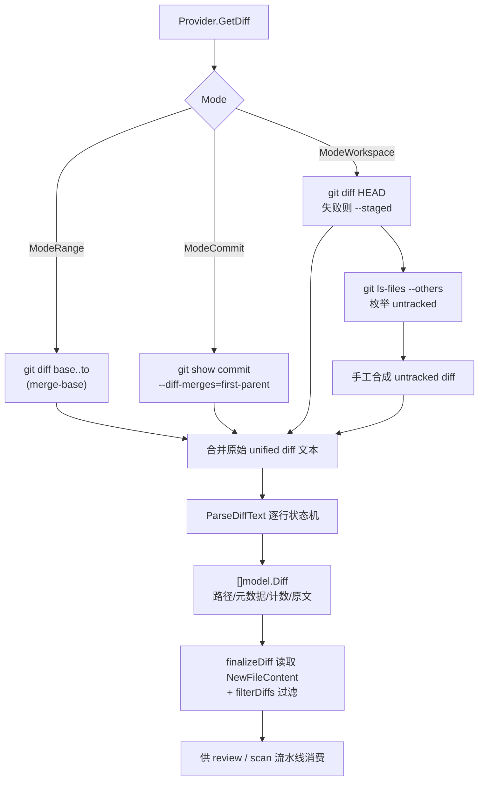
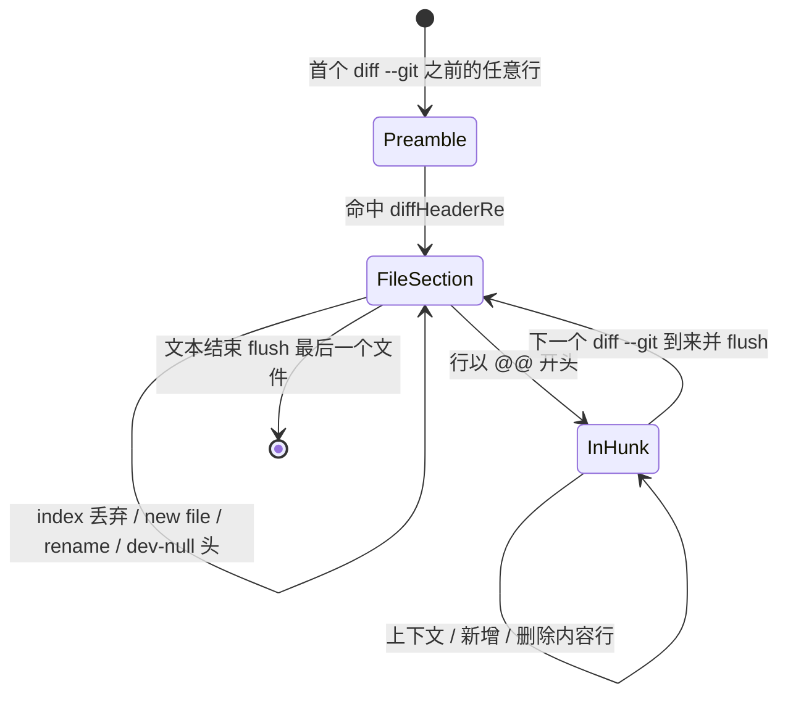
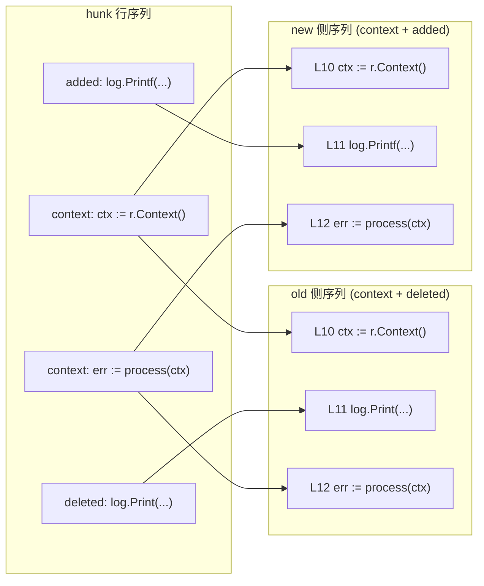
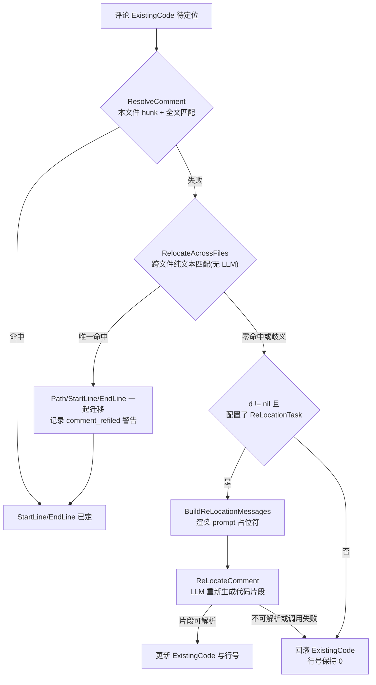

# Diff 解析引擎

> **关联源码**：`internal/diff/`、`internal/gitcmd/`、`internal/model/diff.go`
> **前置阅读**：[00-overview.md](00-overview.md)

## 目录

1. [模块职责与定位](#1-模块职责与定位)
2. [git 命令执行层](#2-git-命令执行层)
3. [diff 获取策略](#3-diff-获取策略)
4. [unified diff 解析器走读](#4-unified-diff-解析器走读)
5. [数据模型](#5-数据模型)
6. [hunk 与行号解析](#6-hunk-与行号解析)
7. [评论重定位机制](#7-评论重定位机制)
8. [过滤体系](#8-过滤体系)
9. [workspace_file.go 职责](#9-workspace_filego-职责)
10. [错误处理与边界情况汇总](#10-错误处理与边界情况汇总)
11. [测试覆盖分析](#11-测试覆盖分析)
12. [源文件覆盖清单](#12-源文件覆盖清单)

## 1. 模块职责与定位

`internal/diff` 是 review 与 scan 两条流水线的第一站：它把「仓库在某个输入区间内发生了什么变化」这一事实，从 git 的文本输出翻译成机器可计算的结构。Agent 在执行任何 LLM 调用之前，先通过 `Provider.GetDiff` 拿到结构化的 `[]model.Diff`（[agent.go](../../internal/agent/agent.go#L538-L568)），后续的 prompt 构造、行号解析、评论落点全部以这份结构为唯一事实来源。

为什么说「精确的 diff 解析」是行级评论精度的基础？因为本项目的确定性设计把行号的裁决权从 LLM 手里收了回来：

- LLM 输出的评论只带 `ExistingCode` 代码片段，不带行号（[review.go](../../internal/model/review.go#L7-L21) 中 `StartLine`/`EndLine` 由引擎填充）；
- 行号由 [resolver.go](../../internal/diff/resolver.go#L15-L58) 通过「解析 hunk 结构 + 归一化文本匹配」这一确定性算法计算；
- 即使文本匹配失败、需要 LLM 参与重定位（第 7 章），LLM 的职责也仅是**重新生成一段代码片段**，行号依然由确定性匹配器裁定。

同一份 diff 文本因此承担双重角色：既是喂给模型的上下文（`model.Diff.Diff` 原文进入 prompt），又是给机器算坐标的依据。解析器任何一处误判都会沿两条路径放大——误判二进制标记会让整个文件从审查中静默消失（[parser_test.go](../../internal/diff/parser_test.go#L183-L213) 防的正是这个）；漏数一行插入会让 `Insertions` 统计偏斜，进而影响依赖变更行数阈值的下游决策（[parser_test.go](../../internal/diff/parser_test.go#L215-L245)）。这就是本项目「确定性工程」哲学的地基：**模型负责理解，坐标必须由工程保证**。

**图 3-1**：diff 解析流水线总览



## 2. git 命令执行层

[runner.go](../../internal/gitcmd/runner.go) 是全仓库统一的 git 子进程执行器，核心设计是**全局并发上限**：`Runner` 内部用一个 channel 信号量限制同时存活的 git 子进程数量（[runner.go](../../internal/gitcmd/runner.go#L19-L30)），默认 `defaultMaxConcurrent = 16`，`New(maxConcurrent <= 0)` 时回落到默认值（[runner.go](../../internal/gitcmd/runner.go#L25-L30)，由 [runner_test.go](../../internal/gitcmd/runner_test.go#L45-L58) 锁定）。所有 git 调用都应经过共享的 Runner 实例，这样系统级的子进程总数才是有界的。

命令构造本身很薄：`exec.CommandContext(ctx, "git", args...)` 加 `cmd.Dir = repoDir`，不追加任何额外参数。四种执行形态对应四类消费场景：

| 方法 | 输出形态 | 适用场景 |
|---|---|---|
| `Run` | stdout+stderr 合并（[L47-L57](../../internal/gitcmd/runner.go#L47-L57)） | 容错查询，如 `merge-base` |
| `Output` | 仅 stdout（[L60-L69](../../internal/gitcmd/runner.go#L60-L69)） | 输出即数据，如 `git show ref:path` 读文件内容 |
| `RunSplit` | stdout/stderr 分离（[L72-L87](../../internal/gitcmd/runner.go#L72-L87)） | 产出 diff 且失败时需要引用 stderr 诊断 |
| `Stream` | stdout 以 `io.Reader` 流式供给（[L93-L130](../../internal/gitcmd/runner.go#L93-L130)） | 大输出边读边处理 |

几个值得注意的工程细节：

- **信号量获取可取消**：`acquire` 在 `select` 中同时等待信号量与 `ctx.Done()`（[runner.go](../../internal/gitcmd/runner.go#L32-L42)），排不上队时不会卡死整个取消链路（[runner_test.go](../../internal/gitcmd/runner_test.go#L143-L154)）。
- **Stream 的排空契约**：注释明确要求 `consume` 必须把 stdout reader 读完，否则 `cmd.Wait()` 可能阻塞或报 broken pipe；`consume` 出错时会先 kill 进程再返回消费错误（[runner.go](../../internal/gitcmd/runner.go#L89-L129)）。
- **环境变量处理**：Runner **不修改**子进程环境，git 完整继承父进程环境（包括 `GIT_EXTERNAL_DIFF` 等用户配置——这正是不设防会被 [issue #82](../../internal/diff/git_test.go#L188-L209) 击穿的原因，防线设在调用方的 `--no-ext-diff` flag 上，见第 3 章）。测试侧的 locale 隔离则由 `make test` 统一设置 `LC_ALL=C`（[Makefile](../../Makefile#L44)），保证 CI 中 git 输出英文消息；**运行时**则不假设 locale——错误断言锚定 SHA 而非 `fatal:` 前缀（[git_error_test.go](../../internal/diff/git_error_test.go#L253-L263) 的注释解释了 zh_CN locale 下前缀会被翻译成「致命错误」），错误截断还做了 UTF-8 边界修正（见下文）。

**错误规范化**发生在 diff 包的 `gitFailure`（[git.go](../../internal/diff/git.go#L709-L728)），Runner 只负责执行。它的规则由 [git_error_test.go](../../internal/diff/git_error_test.go#L21-L95) 逐条锁定：

1. 保留操作名、底层错误链（`errors.Is` 可解包）与 git 自己的诊断文本——修复的是 issue #972：以前失败只表现为光秃秃的 `exit status 129`，无法区分坏 revision 与不支持的选项（[git_error_test.go](../../internal/diff/git_error_test.go#L236-L268)）；
2. 诊断超过 `gitDiagLimit = 2000` 字节时**保留尾部**——git 的 `die()` 最后退出，致命错误永远在输出的最后（[git.go](../../internal/diff/git.go#L714-L726)）；
3. 按字节截断可能落在多字节 rune 中间，先丢弃残缺的前导字节再补 `...` 前缀，保证输出始终是合法 UTF-8——这同样源自 #972 的日语 Windows 环境（[git_error_test.go](../../internal/diff/git_error_test.go#L81-L94)）。

而 **stdout 与 stderr 为什么必须分离**，[runGitSplit](../../internal/diff/git.go#L654-L692) 的文档注释给出了完整的威胁模型：合并输出意味着一条写 diff 中途死掉的命令，其错误尾部全是 diff 内容——仓库源码、以及源码里恰好包含的任何东西（API key 等）；这个字符串不会留在本地，它经 `span.RecordError` 进入遥测后端。`TestGetDiff_FailureQuotesStderrNotStdout`（[git_error_test.go](../../internal/diff/git_error_test.go#L179-L198)）用一个输出假 secret 的 git shim 钉死了这条边界。取消场景同理：被信号杀死的进程 stderr 为空，`runGitSplit` 的取消守卫保证错误解包为 `context.DeadlineExceeded` 而不是「signal: killed」这种机制描述（[git.go](../../internal/diff/git.go#L674-L691)，[git_error_test.go](../../internal/diff/git_error_test.go#L203-L230)）。

## 3. diff 获取策略

[git.go](../../internal/diff/git.go) 的 `Provider` 用一个 `Mode` 枚举区分三种输入区间（[git.go](../../internal/diff/git.go#L43-L49)）：

| Mode | 构造函数 | 语义 |
|---|---|---|
| `ModeWorkspace` | `NewWorkspaceProvider`（[L88](../../internal/diff/git.go#L88-L94)） | 当前工作区：staged + unstaged + untracked |
| `ModeCommit` | `NewCommitProvider`（[L78](../../internal/diff/git.go#L78-L85)） | 单个 commit 对其第一父提交的变化 |
| `ModeRange` | `NewProvider`（[L67](../../internal/diff/git.go#L67-L75)） | `merge-base(from,to)..to` 的分支对比 |

CLI 侧如何把 `--commit` / `--from --to` / 无参数映射到这三个构造函数，见 [agent.go](../../internal/agent/agent.go#L538-L545)（命令层细节归 [02-cli-commands.md](02-cli-commands.md)，断点续跑时从会话恢复端点后同样走这段分发，见 [10-session-persistence.md](10-session-persistence.md)）。

### 3.1 GetDiff 的三分支组装

`GetDiff`（[git.go](../../internal/diff/git.go#L174-L236)）按模式组装 git 命令、把原始输出拼进一个 `strings.Builder`，最后统一交给 `ParseDiffText` 并过滤。三条路径的命令行是本模块最密集的工程决策点，每个 flag 都对应一类真实故障：

**Range 分支**（[L179-L187](../../internal/diff/git.go#L179-L187)）：先取 `merge-base`（带缓存，[L165-L171](../../internal/diff/git.go#L165-L171)），取不到直接报 `cannot find merge-base between %s and %s`；然后执行 `git diff`。**Commit 分支**（[L189-L198](../../internal/diff/git.go#L189-L198)）：执行 `git show`。**Workspace 分支**（[L200-L221](../../internal/diff/git.go#L200-L221)）：先取 tracked 变化，再枚举 untracked 文件并手工合成 diff。共同的 flag 清单：

- `-c core.quotepath=false`：禁止 git 对非 ASCII 路径做 `"` 转义。仓库用含 `café/(authenticated)/文件.ts` 的真实 fixture 在三种模式下锁定该行为（[git_test.go](../../internal/diff/git_test.go#L101-L150)）。
- `--no-ext-diff --no-textconv`：抵御用户配置的外部 diff 工具（`GIT_EXTERNAL_DIFF` / `diff.external`）。没有它，垃圾脚本的输出会替换 unified diff，解析器读出 0 个 diff，review 静默变成「No files changed」——issue #82。三个模式各有一个测试钉住（[git_test.go](../../internal/diff/git_test.go#L188-L209)）。
- `--find-renames`：强制开启重命名检测。用户可能配置 `diff.renames=false`，此时重命名会退化成 delete+add 两条记录，触发 issue #99 的连锁故障（见第 4 章 /dev/null 一节）。测试专门把 `diff.renames` 设为 false 再验证（[git_test.go](../../internal/diff/git_test.go#L390-L442)）。
- `--src-prefix=a/ --dst-prefix=b/`：固定路径前缀。解析器的 `diffHeaderRe` 依赖这两个前缀切分 old/new 路径，绝不能受用户 `diff.srcPrefix` 配置影响。
- `--no-color`：排除颜色转义序列污染。
- `-U3`：上下文行数，来自常量 `DiffContextLines = 3`（[git.go](../../internal/diff/git.go#L23-L24)）。
- `--end-of-options`：**注入防线**。git 的参数解析在此之后不再把任何 token 当作选项，形如 `-O./pwn.sh` 的「commit ref」会被当作无效 revision 拒绝，而不是被解释成 `git show` 的选项去执行任意 pager 命令（[git_test.go](../../internal/diff/git_test.go#L268-L288) 构造了写 `PROOF` 文件的攻击脚本验证）。

**Commit 分支的 `--diff-merges=first-parent`** 值得单独讲：普通 `git show` 对 merge commit 输出 combined diff（`diff --cc`），`ParseDiffText` 无法解析，于是恰好是最需要审查冲突解决的提交会静默产出零个 diff。加上该 flag 后 merge 一律对第一父提交做常规 unified diff（[git.go](../../internal/diff/git.go#L189-L194) 注释，[git_test.go](../../internal/diff/git_test.go#L480-L540) 用一个真实冲突合并仓库验证 `+resolved-conflict` 出现在结果里）。

### 3.2 Workspace 的错误恢复路径

`workspaceTrackedDiff`（[L568-L582](../../internal/diff/git.go#L568-L582)）实现了唯一一条 fallback：`git diff HEAD` 失败或为空时退回 `git diff --staged`。存在的原因是**尚无任何 commit 的仓库没有 HEAD**——`git diff HEAD` 会报 `bad revision 'HEAD'`，而 `--staged` 仍然可以通过「index 对空树」的比较呈现已暂存变更，这是首个 commit 之前审查工作区的唯一途径（[git_test.go](../../internal/diff/git_test.go#L216-L239)）。

fallback 的 stderr 选择同样经过推敲（[L200-L210](../../internal/diff/git.go#L200-L210) 注释）：能走到 fallback 就意味着 `git diff HEAD` 已经失败，而在 fallback 存在的主场景（无 commit 仓库）里那次失败是预期噪声；真正值得呈现给用户的是第二次失败的原因。`TestGetDiff_WorkspaceFailureSurfacesFallbackMessage` 通过损坏 `.git/index` 逼出「双失败」，断言错误里出现 index 的诊断而不出现 `bad revision`（[git_error_test.go](../../internal/diff/git_error_test.go#L105-L135)）。

untracked 部分（[L584-L642](../../internal/diff/git.go#L584-L642)）：`git ls-files --others --exclude-standard` 枚举，逐个读文件内容后**手工合成** unified diff——`diff --git a/f b/f` + `--- /dev/null` + `+++ b/f` + `@@ -0,0 +1,N @@` + 每行加 `+` 前缀。合成器对「末行无换行」做了行数补偿（`content[len-1] != '\n'` 时 `lineCount++`），保证 `@@` 头声明的行数与实际 `+` 行数一致。`ls-files` 的失败不再被吞掉（旧实现把「无 untracked 文件」与「git 枚举失败」混为一谈，后者曾静默丢失工作区输入的一半）——现在经由 `gitFailure("git ls-files", ...)` 报出（[L623-L625](../../internal/diff/git.go#L622-L642)，[git_error_test.go](../../internal/diff/git_error_test.go#L137-L156)）。

### 3.3 读 ref 时的文件内容来源

解析完成后每个 diff 需要 `NewFileContent`（新文件全文，行号兜底匹配的数据源）。`GetDiff` 为此选定一个 ref（[L223-L229](../../internal/diff/git.go#L223-L229)）：range 用 `to`、commit 用 `commit`、workspace 无 ref（直接读磁盘）。读取动作在 `finalizeDiff` 中执行（第 4 章）。这里的深刻之处在于：**评论行号解析发生在 review 进行时，而 workspace 的工作树内容可能在解析 diff 与匹配评论之间被改动**——所以 range/commit 模式锚定 ref 读取，把输入冻结在不可变对象上。

### 3.4 端点冻结：ResolveInput 与 RemoteIdentity

`ResolveInput`（[L125-L152](../../internal/diff/git.go#L125-L152)）把本次运行的比较端点冻结成不可变 SHA，服务于 run manifest（[01-architecture.md](01-architecture.md) 的输入模式矩阵）。三种模式的语义由 [git_resolve_test.go](../../internal/diff/git_resolve_test.go) 全景锁定：

- **range**：base = merge-base，head = `to` 解析出的 commit，两者都有才拼 `ExactRange`（[L50-L71](../../internal/diff/git_resolve_test.go#L50-L71)）；
- **commit**：head = commit 本身，base = 第一父（与 `--diff-merges=first-parent` 的比较基准严格一致，[L111-L142](../../internal/diff/git_resolve_test.go#L111-L142)）；**根提交没有 base**，`ResolvedBase`/`ExactRange` 保持空（[L93-L109](../../internal/diff/git_resolve_test.go#L93-L109)）；
- **workspace**：base = HEAD（存在时），head 恒空——工作区没有不可变 head（[L144-L159](../../internal/diff/git_resolve_test.go#L144-L159)）；**unborn 仓库连 base 也为空**（[L211-L225](../../internal/diff/git_resolve_test.go#L211-L225)）。

设计纪律写在 `InputResolution` 的文档注释里：空字段表示「不适用或不可解析」，调用方**绝不能把空值当真端点、更不能伪造一个**。实现上全部走只读 git 查询且从不返回 error——`resolveCommit` 用 `rev-parse --verify --quiet ref^{commit}`，`^{commit}` 把 tag/tree 剥到 commit，解析失败静默返回空串（[L527-L533](../../internal/diff/git.go#L527-L533)）；`commitParents` 用 `rev-list --parents -n 1`（`rev-list` 不会回显 `--end-of-options`，marker 因此对该命令安全，[L542-L552](../../internal/diff/git.go#L542-L552)）。

`RemoteIdentity` / `canonicalRemote`（[L421-L495](../../internal/diff/git.go#L421-L495)）为 manifest 提供免凭据的仓库身份：读 `origin` URL，剥 userinfo/query/fragment、host 小写但**保留端口**、去尾部 `.git`，同一仓库无论怎么 clone 都得到同一身份；本地文件系统 remote 一律归一化为空串，与无 origin 同等对待（[git_resolve_test.go](../../internal/diff/git_resolve_test.go#L161-L195) 的 20 个用例矩阵，包括「路径里的 @ 不能当 scp userinfo 截断」「端口必须保留」这类边角）。

## 4. unified diff 解析器走读

[parser.go](../../internal/diff/parser.go) 只有一个导出函数 `ParseDiffText`（[L33-L116](../../internal/diff/parser.go#L33-L116)），加上私有辅助 `finalizeDiff`（[L120-L149](../../internal/diff/parser.go#L120-L149)）。它是整个引擎最核心的 150 行，逐段走读如下。

### 4.1 输入输出与整体结构

```go
func ParseDiffText(ctx context.Context, diffText string, repoDir string, ref string, runner *gitcmd.Runner) ([]model.Diff, error)
```

输入是**多个文件拼接**的完整 unified diff 文本（workspace 模式下还混入手工合成的 untracked diff）；输出是逐文件的 `[]model.Diff`。函数先 `strings.Split(diffText, "\n")` 切行，然后单趟扫描，用一个 2 分钟的 `context.WithTimeout` 兜底（[L46-L47](../../internal/diff/parser.go#L46-L47)）。状态只有三个变量：`current *model.Diff`（当前文件）、`buf strings.Builder`（当前文件的 raw diff 原文）、`inHunk bool`（是否处于 hunk 内容区）。

状态机全貌如下，后文逐段展开：

**图 3-4**：解析器逐行状态机



「Preamble」状态即 `current == nil` 时逐行 `continue`（[L64-L66](../../internal/diff/parser.go#L64-L66)）——`git show` 输出前部的 commit message、Author、Date 等头信息都在这里被丢弃。

### 4.2 文件边界：diffHeaderRe 与 flush

```go
diffHeaderRe = regexp.MustCompile(`^diff --git a/(.+?) b/(.+)$`)
```

（[L21](../../internal/diff/parser.go#L20-L26)）每命中一次即：把 `buf` 内容（去掉尾部换行）赋给上一个 diff 的 `Diff` 字段、调 `finalizeDiff`、append 进结果、重置 buf；再新建 `current`，`OldPath`/`NewPath` 取自捕获组，`inHunk` 归位 false（[L50-L63](../../internal/diff/parser.go#L50-L63)）。循环结束后还有一次「flush 最后一个文件」（[L108-L113](../../internal/diff/parser.go#L108-L113)）。`(.+?)` 的非贪婪配合 ` b/` 分隔符意味着**路径中含空格时**，`a/pkg/old name.go b/pkg/new name.go` 会被切成 `pkg/old name.go` 与 `pkg/new name.go`——但这个切法在 new 路径本身含 ` b/` 子串时会切错，所以重命名场景由 `rename from/to` 头覆盖修正（见 4.4）。

### 4.3 核心：inHunk 状态与内容/头部分类

解析器的全部精度来自一个观察，写在 [L38-L44](../../internal/diff/parser.go#L38-L44) 的注释里：**hunk 内的内容行永远带一个 `+`、`-` 或空格前缀；hunk 外的 `+++ b/file`、`--- a/file` 是文件头。**同一串字符在两个状态下含义完全不同。于是分类 switch（[L68-L103](../../internal/diff/parser.go#L68-L103)）大量用 `!inHunk` / `inHunk` 守卫：

| 行 | 守卫 | 动作 |
|---|---|---|
| `@@` 前缀 | 无 | `inHunk = true`（[L69-L70](../../internal/diff/parser.go#L69-L70)） |
| `index ` 前缀 | `!inHunk` | `continue`——**不写入 buf**（[L74-L75](../../internal/diff/parser.go#L74-L75)） |
| `^Binary files ` | `!inHunk` | `IsBinary = true`（[L76-L77](../../internal/diff/parser.go#L76-L77)） |
| `new file mode ` | 无（注释论证内容行必带前缀，裸前缀匹配安全） | `IsNew = true`（[L80-L81](../../internal/diff/parser.go#L80-L81)） |
| `deleted file mode ` | 无 | `IsDeleted = true` |
| `rename from ` | 无 | `OldPath` 覆盖 + `IsRenamed`（[L84-L88](../../internal/diff/parser.go#L84-L88)） |
| `rename to ` | 无 | `NewPath` 覆盖 + `IsRenamed` |
| `--- /dev/null` 整行相等 | `!inHunk` | `IsNew = true`（[L95-L96](../../internal/diff/parser.go#L95-L96)） |
| `+++ /dev/null` 整行相等 | `!inHunk` | `IsDeleted = true`（[L97-L98](../../internal/diff/parser.go#L97-L98)） |
| `+` 前缀 | `inHunk` | `Insertions++`（[L99-L100](../../internal/diff/parser.go#L99-L100)） |
| `-` 前缀 | `inHunk` | `Deletions++`（[L101-L102](../../internal/diff/parser.go#L101-L102)） |

逐个守卫展开讲透：

**index 头丢弃（不对称处理）**。`index 1234567..89abcde 100644` 的 blob ID 与模式对 LLM 没有审查价值，所以在文件头区被 `continue` 掉、不进 `Diff` 原文；但在 hunk 内部，文件内容恰好是一行 `index added-content` 时，它渲染为 `+index added-content`、带着前缀，天然落入 `+` 分支被计数并保留（[L71-L75](../../internal/diff/parser.go#L71-L75) 注释，[parser_test.go](../../internal/diff/parser_test.go#L12-L51) 两个断言分别钉住「prompt diff 无 index 头」与「`+index` 内容行不丢」）。这条测试名为 `StripsIndexHeadersFromPromptDiff`——点题了 `Diff` 字段的下游身份：它是直接进 prompt 的文本。

**二进制标记锚定**。`binaryRe` 是 `^Binary files `——行首锚定。旧版未锚定的正则会匹配**任何**位置的子串，于是内容里出现 `Note: Binary files are handled specially by git.` 的文本文件被误判成二进制、整个文件从审查里消失（[parser_test.go](../../internal/diff/parser_test.go#L178-L213)）。锚定为什么绝对安全？还是那条观察：hunk 内容行必带前缀，`Binary files` 出现在内容中时前面必有 `+`/`-`/空格，行首正则不可能命中（[L22-L25](../../internal/diff/parser.go#L22-L25) 注释）。

**/dev/null 的整行相等比较**。git 对新增文件输出 `--- /dev/null`（**无** `a/` 前缀），删除文件输出 `+++ /dev/null`（无 `b/` 前缀）。旧版解析要求这些行带前缀，导致删除文件被误分类、然后 `finalizeDiff` 对一个不存在的路径发起注定失败的 `git show`（issue #99 的症状之一：`WARNING: cannot read file ... exit status 128`，[parser_test.go](../../internal/diff/parser_test.go#L115-L145) 的注释记录了这段历史）。反向陷阱同样存在：**hunk 内部**可能出现整行恰为 `+++ /dev/null` 的内容（原文件新增了一行 `++ /dev/null`，渲染成三个加号开头），所以这两个分支必须用 `!inHunk` 守卫，否则一次误判把正常文件标成已删除（[L92-L98](../../internal/diff/parser.go#L92-L98) 注释，[parser_test.go](../../internal/diff/parser_test.go#L247-L272)）。

**计数守卫**。`Insertions`/`Deletions` 只在 `inHunk` 时累加。这防住另一类统计偏斜：内容行本身以 `--`/`++` 开头（比如删除了 `---oldFlag`、新增了 `+++newFlag`），渲染出来是 `---oldFlag`/`+++newFlag`，与文件头 `--- a/x`、`+++ b/x` 语法上无法区分——只有 hunk 状态能裁决。旧版用「排除 +++/--- 头」的启发式把它们从计数里丢掉了，导致每文件统计与下游 `changeLines` 阈值失真（[parser_test.go](../../internal/diff/parser_test.go#L215-L245)）。

**重命名头的权威路径**。`rename from pkg/old name.go` / `rename to pkg/new name.go` 直接覆盖 `OldPath`/`NewPath`，注释称其为「比 diff --git 头更可靠的权威路径」——`git diff` 的 `diff --git a/x b/y` 行在路径含空格时没有引号或转义，切分天然有歧义，而 `rename from/to` 是整行前缀匹配、内容即路径，无歧义（[L84-L91](../../internal/diff/parser.go#L84-L91)）。100% 相似的纯重命名**没有任何 hunk 与 `---`/`+++` 行**，只有 similarity index 与 rename 头，解析结果依然正确（[parser_test.go](../../internal/diff/parser_test.go#L93-L113)）。

### 4.4 finalizeDiff：补齐 NewFileContent

flush 时逐文件调用（[L120-L149](../../internal/diff/parser.go#L120-L149)）：

1. 已删除文件（`IsDeleted` 或 `NewPath == "/dev/null"`）直接把 `NewPath` 归一为 `/dev/null` 返回——新文件内容不存在；
2. `ref != ""`（range/commit 模式）：`git -c core.quotepath=false show --end-of-options ref:path` 经 `runner.Output` 读取**不可变 ref 上的**文件内容（quotepath=false 同样是为了非 ASCII 路径；`--end-of-options` 防 `ref:path` 中的路径被当作选项）；
3. 否则读工作区磁盘（`readWorkspaceFileForDiff`，第 9 章）；
4. 读取失败**不返回 error**，只向 stderr 打 `[ocr] WARNING`——单个文件读不出不应让整个 review 崩溃，缺了 `NewFileContent` 的文件只是失去兜底匹配能力（第 6 章）。

注意一个前置条件：workspace 模式下合成 untracked diff 时路径已经过 `readWorkspaceFileForDiff` 的安全校验（第 9 章），这里二次调用同一函数是纵深防御。

### 4.5 解析不了的输入：combined diff

`diff --cc`（merge commit 的 combined diff）不在本解析器能力范围内——engine 的态度不是「尝试解析」而是**在上游用 `--diff-merges=first-parent` 消灭这种输入**（第 3.1 节）。这是一个典型的工程取舍：与其写一个能同时理解两种格式的解析器，不如约束命令行让格式唯一。

## 5. 数据模型

[model/diff.go](../../internal/model/diff.go#L7-L18) 的 `Diff` 结构体是全流水线通用的货币，逐字段说明：

| 字段 | 类型 | 语义 | 主要生产者 |
|---|---|---|---|
| `OldPath` | string | 变更前路径（相对仓库根）；重命名时被 `rename from` 覆盖；删除文件时是唯一有效路径 | parser（[L58-L60](../../internal/diff/parser.go#L58-L61)、[L84-L88](../../internal/diff/parser.go#L84-L88)） |
| `NewPath` | string | 变更后路径；删除文件归一为 `"/dev/null"` | parser + finalizeDiff（[L121-L124](../../internal/diff/parser.go#L121-L124)） |
| `Diff` | string | 该文件的完整 unified diff **原文**（已剥 index 头），直接进 LLM prompt | parser buf（[L53](../../internal/diff/parser.go#L51-L57)） |
| `NewFileContent` | string | 新文件全文（ref 版本或工作区版本），行号兜底匹配的数据源 | finalizeDiff（[L141](../../internal/diff/parser.go#L141)、[L149](../../internal/diff/parser.go#L144-L149)） |
| `IsBinary` | bool | 二进制文件标记（`^Binary files ` 行首锚定检测），下游决定是否跳过审查 | parser（[L76-L77](../../internal/diff/parser.go#L76-L77)） |
| `IsDeleted` / `IsNew` / `IsRenamed` | bool | 文件级元数据，来自 `deleted file mode` / `new file mode` / `rename` 头与 `/dev/null` 检测 | parser |
| `Insertions` / `Deletions` | int64 | 新增/删除行数（仅 hunk 内容行计数），汇总成 `totalInsertions`/`totalDeletions`（[agent.go](../../internal/agent/agent.go#L561-L565)） | parser（[L99-L102](../../internal/diff/parser.go#L99-L102)） |

配套的行级模型在 [hunk.go](../../internal/diff/hunk.go#L12-L34)：`HunkLineType` 三值枚举（`HunkContext`/`HunkAdded`/`HunkDeleted` 对应 `' '`/`'+'`/`'-'` 前缀）、`HunkLine{Type, Content}`（Content 已剥前缀）、`Hunk{OldStart, OldCount, NewStart, NewCount, Lines}`——四个行号字段均为 **1-indexed** 起点，`OldCount`/`NewCount` 是该侧行数。

与行号语义直接相关的还有 [model/review.go](../../internal/model/review.go#L7-L21) 的 `LlmComment`（不在本模块，但语义上属于本引擎的输出侧）：`Path` + `ExistingCode` 是引擎的输入，`StartLine`/`EndLine` 是引擎的输出，`0` 表示「未定位」。**新旧行号语义**：resolver 优先返回新文件行号（评论一般挂在新代码上）；当代码片段只存在于旧侧（被删除的行）时返回旧文件行号——这是 unified diff 的固有语义，删除行在新文件中没有坐标。

## 6. hunk 与行号解析

### 6.1 ParseHunks：单文件文本到 Hunk 序列

[ParseHunks](../../internal/diff/hunk.go#L40-L113) 与 `ParseDiffText` 是两层拆分：前者只管**单个文件**的 diff 文本（输入正是 `model.Diff.Diff` 字段），产出 `[]Hunk`。hunk 头正则：

```go
hunkHeaderRe = regexp.MustCompile(`^@@ -(\d+)(?:,(\d+))? \+(\d+)(?:,(\d+))? @@`)
```

（[hunk.go](../../internal/diff/hunk.go#L36)）count 段缺省时按 git 语义取 1（`@@ -5 +5,2 @@` 表示旧侧只有一行）（[L51-L60](../../internal/diff/hunk.go#L51-L60)）。扫描规则：

- 第一个 `@@` 之前的行（`diff --git`、`---`、`+++` 等文件头）全部忽略（[L70-L72](../../internal/diff/hunk.go#L70-L72)）；
- `\ No newline at end of file` 元数据行跳过、不进 `Lines`（[L75-L77](../../internal/diff/hunk.go#L75-L77)，[hunk_test.go](../../internal/diff/hunk_test.go#L81-L94)）；
- 遇到 `diff --git ` 前缀直接 `break`——防御多文件文本误入的截断语义（[L79-L81](../../internal/diff/hunk.go#L79-L81)）；
- `+`/`-` 前缀归 Added/Deleted，**default 分支一律归 Context** 并剥去可能的前导空格（[L83-L104](../../internal/diff/hunk.go#L83-L104)）——空行内容行（渲染为一个空格后跟空串）在这里变成空 Content 的 context 行。

### 6.2 行号映射算法：extractSideLines 的双计数器

把 `Hunk` 变成「带绝对行号的行序列」的核心是 [extractSideLines](../../internal/diff/resolver.go#L186-L214)：`oldLine` 从 `OldStart` 起步、`newLine` 从 `NewStart` 起步，按行类型推进——

- context 行：**两侧都输出**（分别带 new/old 行号），双计数器各 +1；
- added 行：只进 new 侧序列，仅 `newLine++`；
- deleted 行：只进 old 侧序列，仅 `oldLine++`。

每行内容都经 `normalizeLine` 归一（TrimSpace、剥一个前导 `+`/`-`、再 TrimSpace，[L301-L306](../../internal/diff/resolver.go#L301-L306)）——剥 diff 标记是因为 LLM 常把 prompt 里带 `+` 前缀的行原样抄进 `ExistingCode`（[resolver_test.go](../../internal/diff/resolver_test.go#L859-L880) 专门测了 `+y := 2` 的输入）。

**图 3-2**：行号映射示意（示例取自 [resolver_test.go](../../internal/diff/resolver_test.go#L12-L19) 的 fixture，hunk 头 `@@ -10,7 +10,7 @@`）



[matchConsecutive](../../internal/diff/resolver.go#L217-L234) 在侧序列上做滑动窗口：找一段**连续**的行，与 `splitAndNormalize(ExistingCode)` 产出的目标行逐行相等，命中则返回窗口首尾的绝对行号。多个命中时**第一个胜出**（[resolver_test.go](../../internal/diff/resolver_test.go#L497-L503)）。

### 6.3 三级匹配策略中的前两级

[resolveFromHunk](../../internal/diff/resolver.go#L151-L181)（主路径）：

1. 先对**每个 hunk 的 new 侧**（context+added）做 `matchConsecutive`——新侧优先保证评论尽量落到新文件行号（[resolver_test.go](../../internal/diff/resolver_test.go#L643-L668)：同一段代码双侧都能命中时，取 new 侧行号 9 而非 old 侧的 6）；
2. 全部 new 侧失败后，再对每个 hunk 的 **old 侧**（context+deleted）匹配——被删除的代码只在此侧有坐标。

一个容易忽略的语义细节：hunk 侧的「连续」是**严格连续**（空 context 行归一后是空串，参与窗口比较，会把跨空行的目标挡在门外）；而兜底路径 [resolveFromFileContent](../../internal/diff/resolver.go#L238-L283) 显式跳过空行，把「连续」放宽为「相邻非空行」——注释（[L249-L253](../../internal/diff/resolver.go#L249-L253)）直说了动机：源码里的空行不该打断滑动窗口。兜底路径还处理 CRLF（对文件行 `TrimRight "\r"`，[L255](../../internal/diff/resolver.go#L255)，[resolver_test.go](../../internal/diff/resolver_test.go#L178-L194)）。跨空行匹配的行号区间取首尾**非空行的原始行号**（`fileLineNums`），所以 `a\n\n\nb\n\nc\n` 匹配 `a b c` 得到 `1..6`（[resolver_test.go](../../internal/diff/resolver_test.go#L142-L158)）。

两个批量入口：

- [ResolveLineNumbers](../../internal/diff/resolver.go#L15-L58)：先建 `diffByPath` 双路径索引（`NewPath` 与 `OldPath` 都指向同一 `Diff`，跳过 `/dev/null` 与空串——重命名后评论引用旧路径也能命中，[resolver_test.go](../../internal/diff/resolver_test.go#L802-L822)）；已有行号的评论跳过；先 hunk 后全文兜底。消费点在 [shared.go](../../cmd/opencodereview/shared.go#L692)。
- [ResolveComment](../../internal/diff/resolver.go#L62-L73)：单条版本，`ReLocateComment` 与 `RelocateAcrossFiles` 复用它。

## 7. 评论重定位机制

### 7.1 动机与三级解析顺序

LLM/Agent 产出的 `ExistingCode` 与真实文件有系统性偏差：缩进不同、抄录了 diff 标记、圈进了多余上下文，甚至——Agent 通过 `file_read_diff` 读过相关文件后，把**别的文件里的代码**当成 `ExistingCode` 写进了评论（声明在头文件、实现在源文件的场景）。文本匹配失败时行号停在 0，评论无法落到具体行。

引擎的对策是三级解析，顺序固定在 [loop.go](../../internal/llmloop/loop.go#L674-L688) 的注释里并实现于 L680-L724：

1. **本文件**：`ResolveComment(cm, d)`——hunk + 全文匹配（第 6 章）；
2. **跨文件**：`RelocateAcrossFiles`——纯字符串匹配、零模型参与；
3. **LLM 重定位**：`BuildReLocationMessages` + `ReLocateComment`。

顺序有讲究：跨文件搜索**必须**先于 LLM，因为它需要 Agent 的原始 `ExistingCode`，而 LLM 步骤会覆写这个字段；即使本文件根本没有 diff（`d == nil`），跨文件搜索照跑——「评论引用的路径在本轮输入里没有 diff」恰恰是跨文件搜索还能力挽狂澜的场景（[loop.go](../../internal/llmloop/loop.go#L674-L679) 注释）。

**图 3-3**：评论重定位流程



### 7.2 RelocateAcrossFiles：跨文件重定位

[resolver.go](../../internal/diff/resolver.go#L100-L139) 的文档注释完整讲述了动机与设计：Agent 把头文件里的声明评论错挂到实现文件（或反过来）后，`ResolveComment` 失败，随后的 LLM 重定位只拿到**错误文件**的 diff 与一个「必须回代码块」的 prompt，模型只能硬答一个最像的 token 序列——这会覆写掉指向真实代码的唯一证据，让评论「看起来已定位」却指着一根不相干的行。

所以跨文件搜索**先**执行、**不用模型**：`ExistingCode` 是逐字摘录，找它的真实归属就是纯字符串匹配。算法：

1. 跳过评论自己的文件（`NewPath`/`OldPath` 等于 `cm.Path`——本文件已试过，且必须排除以防自匹配冒充跨文件命中，[L111-L115](../../internal/diff/resolver.go#L111-L115)）；
2. 对其余每个 diff 用 **probe 副本**做 `ResolveComment`（行号清零后探测，失败候选不会在原评论上留下行号残迹，[L116-L118](../../internal/diff/resolver.go#L116-L118)）；
3. 一旦命中数超过 1 **立即返回失败**——同一句样板代码合法地出现在多个文件里时，猜任何一个都是用一个错误换另一个错误（[L126-L129](../../internal/diff/resolver.go#L126-L129)）；
4. 唯一命中才迁移：`Path`、`StartLine`、`EndLine` **三者一起动**——只改路径不改行号等于把评论重新归档到正确的文件却仍指着错误的行（[L132-L138](../../internal/diff/resolver.go#L132-L138)，[relocate_across_files_test.go](../../internal/diff/relocate_across_files_test.go#L43-L62) 的断言注释特别强调了这一点）。

[relocate_across_files_test.go](../../internal/diff/relocate_across_files_test.go) 的四个用例构成完整行为矩阵：正确重归档到实现文件（span.h → span.c）、歧义时放弃且**不改动**评论（[L64-L88](../../internal/diff/relocate_across_files_test.go#L64-L88)）、完全无命中时放弃（[L90-L101](../../internal/diff/relocate_across_files_test.go#L90-L101)）、自身文件排除与空输入防御（[L103-L127](../../internal/diff/relocate_across_files_test.go#L103-L127)）。调用方对 `false` 的语义是「仍未定位」而非错误，迁移成功则记一条 `comment_refiled` 警告进观测流水（[loop.go](../../internal/llmloop/loop.go#L683-L687)）。

### 7.3 LLM 重定位：ReLocateComment 与 prompt 协作

LLM 兜底被刻意拆成两个函数（[relocation.go](../../internal/diff/relocation.go#L19-L27) 注释解释了拆分动机）：

[BuildReLocationMessages](../../internal/diff/relocation.go#L28-L42) 是**纯 prompt 构造**：把模板会话中的 `{diff}`、`{existing_code}`、`{suggestion_content}` 占位符替换为 `d.Diff`、`cm.ExistingCode`、`cm.Content`。任务模板缺失或为空时返回 nil，调用方据此**跳过会话记录与整个请求**——不发出任何 HTTP 调用（[relocation_test.go](../../internal/diff/relocation_test.go#L254-L273) 钉住「零消息时不得触达 client」）。这个拆分让调用方能在发起 HTTP 前**先**创建 `ReLocationTask` 会话记录、拿到 `RequestNo`（[loop.go](../../internal/llmloop/loop.go#L696-L710)），可观测性因此不必下沉到 diff 包。

[ReLocateComment](../../internal/diff/relocation.go#L49-L95) 执行调用并裁定结果：

1. 空消息直接返回 `(false, nil)`；
2. LLM 调用带遥测 span 与 token 统计（[L62-L81](../../internal/diff/relocation.go#L62-L81)，遥测细节见 [13-telemetry.md](13-telemetry.md)）；调用失败打日志返回 `(false, nil)`；
3. [extractCodeBlock](../../internal/diff/relocation.go#L99-L117) 从回复中取**第一个** fenced code block：跳过开 fence 行（可能带语言标签），要求开 fence 后有换行、且存在闭合 fence，否则返回空串（[relocation_test.go](../../internal/diff/relocation_test.go#L275-L297) 的七个边界用例）；
4. 拿到代码块后**临时替换** `cm.ExistingCode`，重试 `ResolveComment`；仍失败则**回滚原始值**（[L88-L94](../../internal/diff/relocation.go#L88-L94)）——LLM 给的片段即使不匹配，也不能销毁掉 Agent 的原始证据（[relocation_test.go](../../internal/diff/relocation_test.go#L221-L250)）。

与 prompt 的协作在工程侧的要点：[re_location_task_system.md](../../internal/config/template/prompts/re_location_task_system.md) 把模型定位成「code location assistant」并加 `/no_think`；[re_location_task_user.md](../../internal/config/template/prompts/re_location_task_user.md) 的规则（VERBATIM 抄录、剥 diff 标记、只输出 fenced code block）与 `extractCodeBlock` 的解析假设一一咬合——「只输出代码块」的纪律让提取器可以只认第一个 fence。prompt 模板本体归 [04-config-rules.md](04-config-rules.md) 详述。

## 8. 过滤体系

diff 引擎的过滤回答的问题是「**哪些变更根本不该进入审查**」，分两层叠加（[isPathExcluded](../../internal/diff/git.go#L264-L294)）：

**第一层：硬编码目录黑名单**。`providerDirIgnoreDirs`（[git.go](../../internal/diff/git.go#L27-L40)）列出 12 个目录前缀（`.git/`、`node_modules/`、`vendor/`、`target/`、`rpm/` 等），无条件排除——`.gitignore` 的 `!` 反向模式**不能**翻案（[L266-L272](../../internal/diff/git.go#L266-L272)，[gitignore_test.go](../../internal/diff/gitignore_test.go#L185-L186) 明确锁定「hardcoded dirs are not negatable」）。通过 [gitignore.go](../../internal/diff/gitignore.go#L9-L13) 的 `ExcludedDirs()` 导出副本供其他包复用（返回拷贝防调用方篡改内部 slice，[gitignore_test.go](../../internal/diff/gitignore_test.go#L12-L33)）。

**第二层：.gitignore 语义**。`loadGitignorePatterns`（[L239-L253](../../internal/diff/git.go#L239-L253)）只读仓库根的 `.gitignore`（剥注释与空行，不做嵌套 .gitignore 合并——这是简化，与 git 真实语义的差异点）。匹配遵循 git 的核心规则：

- **last-match-wins**：按文件顺序遍历，**最后**一个命中的模式决定结果，`!` 前缀反转极性（[L274-L293](../../internal/diff/git.go#L274-L293)）。这不是可选项而是正确性前提——github/gitignore 的「白名单惯用法」（`*` 全排除后用 `!` 逐个放行）只有在 last-match-wins 下才成立；早期实现把 `!` 当作不可匹配，这类仓库里**每个文件**都显得被排除，review 静默覆盖零文件（[L255-L263](../../internal/diff/git.go#L255-L263) 注释，[gitignore_test.go](../../internal/diff/gitignore_test.go#L136-L171) 用真实的 `Go.AllowList.gitignore` 模式做矩阵测试，[L175-L196](../../internal/diff/gitignore_test.go#L175-L196) 锁定顺序语义）；
- **negated 目录模式跳过**：`!*/` 这类反向目录模式不参与匹配——git 用它保持「继续下钻子目录」而非重新纳入其中文件，照字面兑现会把根下所有文件重新放行（[L284-L287](../../internal/diff/git.go#L284-L287)）。

单个模式体 `matchGitignoreBody`（[L311-L357](../../internal/diff/git.go#L311-L357)）覆盖：尾部 `/` 目录模式（对路径的**目录组件**匹配，[matchGitignoreDirectory](../../internal/diff/git.go#L359-L385)：无 slash 的模式匹配任意深度的同名目录，含 slash 或根锚定的按完整目录前缀）；前导 `/` 锚定仓库根；含 `**` 的模式交给 doublestar 库（globstar 语义）；无 `/` 的模式匹配 basename；含 `/` 的模式匹配全路径，另做**组件边界后缀匹配**（`"/"+body`，防 `othersrc/main.go` 被 `src/main.go` 误伤，[L345-L354](../../internal/diff/git.go#L345-L354)，[gitignore_test.go](../../internal/diff/gitignore_test.go#L213-L219)）。极性判定被刻意隔离在 [matchGitignorePattern](../../internal/diff/git.go#L302-L307)（negated 恒 false，供单模式测试使用）与 `isPathExcluded`（有序整体裁决）两处。

过滤入口 [filterDiffs](../../internal/diff/git.go#L388-L401) 在 `GetDiff` 末尾执行：逐 diff 用 `NewPath`（删除文件用 `OldPath`）检查。untracked 枚举同样复用 `isPathExcluded`（[L630-L640](../../internal/diff/git.go#L622-L642)）。

**与 allowlist 的分工**：`internal/config/allowlist/default_exclude_patterns.json`（54 条 doublestar glob，排除各语言测试文件、生成代码、快照等）由 [allowed_ext.go](../../internal/config/allowlist/allowed_ext.go#L39-L43) 以 `go:embed` 内嵌，属于**配置规则系统**的默认排除清单（[04-config-rules.md](04-config-rules.md) 详述）。两者互补：diff 层按「git 语义上不该审查」（.gitignore + 目录黑名单）在获取阶段过滤；allowlist 层按「项目规则上不值得送 LLM」（扩展名白名单 + 排除模式）在流水线更下游过滤。另一条复用线：`internal/scan` 与 `internal/tool/file_find`（Agent 的文件搜索工具）都直接调用 `diff.LoadGitignorePatterns`/`diff.IsPathExcluded`（[scan/provider.go](../../internal/scan/provider.go#L90-L103)、[tool/file_find.go](../../internal/tool/file_find.go#L159-L187)），保证 scan 流水线与 Agent 工具看到的文件可见性和 review 一致（见 [09-scan-pipeline.md](09-scan-pipeline.md)、[07-tool-system.md](07-tool-system.md)）。

## 9. workspace_file.go 职责

[workspace_file.go](../../internal/diff/workspace_file.go#L14-L63) 只有一个私有函数 `readWorkspaceFileForDiff(repoDir, relPath)`：为 workspace 模式（以及 `finalizeDiff` 无 ref 的分支）安全地读取仓库内文件。它是一条**纵深防御链**，每一步都有对应测试（[workspace_file_test.go](../../internal/diff/workspace_file_test.go)）：

1. `pathutil.CanonicalPath` 解析仓库根（[L15-L18](../../internal/diff/workspace_file.go#L14-L18)）；
2. **拒绝绝对路径**（[L19-L21](../../internal/diff/workspace_file.go#L19-L21)，错误文案 `must be relative`）；
3. `filepath.Join` + `WithinBase` 检查——`../../../etc/passwd` 类穿越被拒（[L23-L26](../../internal/diff/workspace_file.go#L23-L26)）；
4. 对**父目录**做 `EvalSymlinks` 再查 `WithinBase`——`escape/secret.txt`（escape 是指向仓库外的符号链接）被拒（[L28-L34](../../internal/diff/workspace_file.go#L28-L34)）；
5. `Lstat`：目录拒绝（[L36-L42](../../internal/diff/workspace_file.go#L36-L42)）；
6. **符号链接返回 target 路径字符串而非目标内容**（[L43-L49](../../internal/diff/workspace_file.go#L43-L49)）——这是防泄漏的关键决策：git 对符号链接的 blob 内容就是 target 路径，跟随链接读外部文件会把仓库外机密（测试里的 `TOP_SECRET`）带进 diff 与 LLM prompt。`TestWorkspaceUntrackedSymlinkDoesNotReadExternalTarget`（[git_test.go](../../internal/diff/git_test.go#L290-L333)）在完整 workspace diff 流程上验证了 `NewFileContent` 恰是符号链接的 target 路径；tracked 文件被改成符号链接的场景同样覆盖（[git_test.go](../../internal/diff/git_test.go#L335-L382)）；
7. 全路径 `EvalSymlinks` + 最后一道 `WithinBase` 后才 `os.ReadFile`（[L51-L62](../../internal/diff/workspace_file.go#L51-L62)）。

## 10. 错误处理与边界情况汇总

| 错误/边界 | 触发条件 | 处理方式 |
|---|---|---|
| merge-base 不可得 | range 模式两 ref 无共同祖先 | `GetDiff` 直接报错 `cannot find merge-base between %s and %s`（[git.go](../../internal/diff/git.go#L179-L182)）；`ResolveInput` 则以空字段表达（[git.go](../../internal/diff/git.go#L127-L134)） |
| git diff/show 失败 | 坏 ref、不支持的选项、权限等 | `gitFailure` 包装：操作名 + 错误链 + stderr 诊断，2000 字节封顶保尾部，UTF-8 截断修正（[git.go](../../internal/diff/git.go#L709-L727)，[git_error_test.go](../../internal/diff/git_error_test.go#L21-L95)） |
| stdout 内容泄入错误 | 命令写 diff 中途死亡 | 只引用 stderr 不引用合并输出（[runGitSplit](../../internal/diff/git.go#L654-L692)，[git_error_test.go](../../internal/diff/git_error_test.go#L179-L198)） |
| 进程被取消 | ctx 超时/取消落到执行窗口 | 取消守卫优先返回 `ctx.Err()`（[git.go](../../internal/diff/git.go#L674-L691)，[git_error_test.go](../../internal/diff/git_error_test.go#L203-L230)） |
| 无 HEAD 的工作区 | 仓库尚无任何 commit | `git diff HEAD` 失败回落 `--staged`（[git.go](../../internal/diff/git.go#L576-L582)，[git_test.go](../../internal/diff/git_test.go#L216-L239)）；双失败时呈现 fallback 的 stderr（[git_error_test.go](../../internal/diff/git_error_test.go#L105-L135)） |
| ls-files 枚举失败 | 仓库损坏、路径不可达 | 经 `gitFailure("git ls-files", ...)` 上抛，不再与「无 untracked」混淆（[git.go](../../internal/diff/git.go#L623-L625)，[git_error_test.go](../../internal/diff/git_error_test.go#L137-L156)） |
| untracked diff 失败 | 合成 diff 阶段出错 | `untracked file diff failed: %w` 上抛（[git.go](../../internal/diff/git.go#L213-L216)） |
| ref 上读文件失败 | 路径在 ref 上不存在等 | 仅 stderr `WARNING`，不中断（[parser.go](../../internal/diff/parser.go#L136-L140)） |
| 工作区读文件失败 | 路径逃逸/绝对路径/目录/不可读 | `readWorkspaceFileForDiff` 逐层拒绝（[workspace_file.go](../../internal/diff/workspace_file.go#L14-L63)）；上层同样降级为 WARNING（[parser.go](../../internal/diff/parser.go#L144-L148)） |
| 符号链接指向仓库外 | untracked/已跟踪文件被改为符号链接 | 返回 target 路径字符串，绝不读外部内容（[workspace_file.go](../../internal/diff/workspace_file.go#L43-L49)，[git_test.go](../../internal/diff/git_test.go#L290-L382)） |
| 二进制文件 | git 输出 `Binary files a/x and b/y differ` | 置 `IsBinary` 标记，是否跳过审查由下游决定（[parser.go](../../internal/diff/parser.go#L76-L77)） |
| merge commit 的 combined diff | `git show <merge>` 默认输出 `diff --cc` | 上游用 `--diff-merges=first-parent` 消灭该输入（[git.go](../../internal/diff/git.go#L189-L194)） |
| 用户外部 diff 工具 | `GIT_EXTERNAL_DIFF`/`diff.external` 配置 | 所有 diff/show 调用点强制 `--no-ext-diff --no-textconv`（[git_test.go](../../internal/diff/git_test.go#L188-L209)） |
| option-like ref 注入 | commit ref 形如 `-O./pwn.sh` | `--end-of-options` 阻断选项解释（[git_test.go](../../internal/diff/git_test.go#L268-L288)） |
| 非 ASCII 路径 | `core.quotepath` 默认开启转义 | 所有路径输出命令统一 `-c core.quotepath=false`（[git_test.go](../../internal/diff/git_test.go#L101-L150)） |
| 行号解析失败 | `ExistingCode` 在 diff 与全文均无匹配 | 行号保持 0，评论仍收集（不丢），跨文件与 LLM 重定位在其后逐级尝试（[resolver.go](../../internal/diff/resolver.go#L15-L58)、[loop.go](../../internal/llmloop/loop.go#L680-L724)） |

## 11. 测试覆盖分析

本模块的测试几乎每一个都对应一个**曾经真实发生过的 bug**（多数在注释中标注了 issue 编号），从 fixture 的形状可以反推出当初的故障形态。提炼关键用例：

1. **`TestParseDiffText_BinaryMarkerAnchored`**（[parser_test.go](../../internal/diff/parser_test.go#L183-L213)）——要防的 bug：未锚定的二进制正则把「内容里提到 Binary files 的文本文件」误判为二进制，文件被**静默**从审查中剔除，用户毫无感知。测试同时保证真二进制仍被识别，双向钉死。
2. **`TestParseDiffText_CountsContentLinesWithPlusMinusPrefix` 与 `TestParseDiffText_DevNullStringInsideHunk`**（[parser_test.go](../../internal/diff/parser_test.go#L220-L272)）——要防的 bug：内容行与文件头在**语法上不可区分**（`+++newFlag` vs `+++ b/file`），任何不依赖 hunk 状态的启发式都会错。两个测试分别钉住计数偏斜（影响下游 changeLines 阈值）与误标删除。
3. **`TestWorkspaceDiffSurvivesExternalDiffTool` 及 commit/range 变体**（[git_test.go](../../internal/diff/git_test.go#L188-L209)）——issue #82：用户配置外部 diff 工具后引擎读到垃圾输出、解析出 0 个 diff、review 静默报「无变更」。测试用一个输出 `not a diff` 的脚本冒充 git 调用的 diff 工具，逼每个调用点自证传了 `--no-ext-diff`。
4. **`TestRangeDiffDetectsRename`**（[git_test.go](../../internal/diff/git_test.go#L390-L442)）——issue #99：`diff.renames=false` 时重命名退化为 delete+add，坏掉的 `/dev/null` 检测让删除半边去执行注定失败的 `git show ref:oldpath`，刷屏 `exit status 128` 警告。测试显式关掉用户的重命名检测再验证引擎强制 `--find-renames` + 权威 rename 头。
5. **`TestCommitDiffMergeCommitReviewsFirstParentDiff`**（[git_test.go](../../internal/diff/git_test.go#L480-L540)）——要防的 bug：merge commit 的 combined diff 解析不出任何东西，**最需要人工审查的冲突解决**恰好全部漏审。测试构造真实冲突分支并合并，断言冲突解决行出现在结果里。
6. **`TestGetDiff_FailureQuotesStderrNotStdout` 与 `TestGetDiff_CancelledMidWriteReportsCancellation`**（[git_error_test.go](../../internal/diff/git_error_test.go#L179-L230)）——安全回归：错误信息携带仓库源码（含假 API key）进入遥测后端；以及取消被报告为「signal: killed」这类机制描述而非原因。第二个测试用无限循环的 git shim 让取消必然落在写窗口内，消除时序抖动。
7. **`TestGitFailure`（multibyte 子用例）**（[git_error_test.go](../../internal/diff/git_error_test.go#L81-L94)）——issue #972 的日语 Windows 环境：按字节截断 stderr 落在 rune 中间，把一个令人困惑的错误变成不可读的错误。fixture 直接用日文长文本断言输出仍是合法 UTF-8 且尾部完整。
8. **`TestRelocateAcrossFiles_*` 四连**（[relocate_across_files_test.go](../../internal/diff/relocate_across_files_test.go)）——行为矩阵：唯一命中迁移（行号必须随路径一起动）、歧义放弃（cm 不得被部分改动）、无命中放弃、自身文件排除与空输入。防的是「评论看起来已定位、实则指错行」这一最隐蔽的失败模式。
9. **`TestIsPathExcluded_AllowListGitignore` / `LastMatchWins`**（[gitignore_test.go](../../internal/diff/gitignore_test.go#L136-L196)）——白名单惯用法仓库里全部文件被判排除、review 静默覆盖零文件的灾难；以及顺序语义（`*.log` + `!important.log` vs 反过来）必须与 git 一致。
10. **`TestResolveInput_RootCommit` / `UnbornWorkspace`**（[git_resolve_test.go](../../internal/diff/git_resolve_test.go#L93-L109)、[L211-L225](../../internal/diff/git_resolve_test.go#L211-L225)）——端点冻结的「不伪造」纪律：根提交没有 base、unborn 工作区没有 HEAD，字段必须为空而非编造一个 SHA。
11. **`TestFirstLine`**（[first_line_test.go](../../internal/diff/first_line_test.go#L10-L29)）——小而关键：解析出的 SHA 不能被尾随换行或意外第二行污染（`resolveCommit`/`commitParents`/`RemoteIdentity` 都依赖它）。

测试风格上值得注意：git 交互测试全部走真实临时仓库（`initRepoWithChange` 等助手，[git_test.go](../../internal/diff/git_test.go#L45-L99)），只有错误路径用 PATH shim 冒充 git（[git_error_test.go](../../internal/diff/git_error_test.go#L158-L169)）；locale 相关断言刻意锚定 locale 无关的证据（SHA、错误码）而非 git 的英文散文（[git_error_test.go](../../internal/diff/git_error_test.go#L253-L263) 注释）。

## 12. 源文件覆盖清单

以下为 `internal/diff` 与 `internal/gitcmd` 全部非测试 `.go` 文件，加 `internal/model/diff.go`，与 Glob 结果一一对应（共 9 个）：

| 源文件 | 职责 | 关键符号 |
|---|---|---|
| [git.go](../../internal/diff/git.go) | diff 获取策略：三种 Mode 的命令组装、workspace 错误恢复、untracked diff 合成、端点冻结、gitignore 过滤、git 执行封装与错误规范化 | `Provider`、`NewProvider`、`NewCommitProvider`、`NewWorkspaceProvider`、`GetDiff`、`ResolveInput`、`InputResolution`、`MergeBase`、`RemoteIdentity`、`filterDiffs`、`isPathExcluded`、`matchGitignoreBody`、`workspaceTrackedDiff`、`untrackedFileDiffs`、`runGit`、`runGitSplit`、`gitFailure`、`canonicalRemote`、`resolveCommit`、`commitParents`、`firstLine` |
| [parser.go](../../internal/diff/parser.go) | unified diff 全文到逐文件 `model.Diff` 的状态机解析、新文件内容补齐 | `ParseDiffText`、`finalizeDiff`、`diffHeaderRe`、`binaryRe` |
| [hunk.go](../../internal/diff/hunk.go) | 单文件 diff 文本到 `Hunk` 序列的解析、hunk 行分类 | `ParseHunks`、`Hunk`、`HunkLine`、`HunkLineType`、`hunkHeaderRe` |
| [resolver.go](../../internal/diff/resolver.go) | `ExistingCode` 到行号的确定性解析：hunk 双侧匹配、全文兜底、跨文件重定位 | `ResolveLineNumbers`、`ResolveComment`、`RelocateAcrossFiles`、`resolveFromHunk`、`extractSideLines`、`matchConsecutive`、`resolveFromFileContent`、`splitAndNormalize`、`normalizeLine` |
| [relocation.go](../../internal/diff/relocation.go) | LLM 重定位：prompt 构造与结果裁定、代码块提取 | `BuildReLocationMessages`、`ReLocateComment`、`extractCodeBlock` |
| [gitignore.go](../../internal/diff/gitignore.go) | 过滤能力的包级导出（供 scan 与 Agent 工具复用） | `ExcludedDirs`、`LoadGitignorePatterns`、`IsPathExcluded`、`MatchGitignorePattern` |
| [workspace_file.go](../../internal/diff/workspace_file.go) | 工作区文件的安全读取（路径穿越/符号链接防御） | `readWorkspaceFileForDiff` |
| [runner.go](../../internal/gitcmd/runner.go) | git 子进程统一执行：并发信号量、四种输出形态 | `Runner`、`New`、`Run`、`Output`、`RunSplit`、`Stream`、`defaultMaxConcurrent` |
| [diff.go](../../internal/model/diff.go) | diff 数据模型（全流水线通用货币） | `model.Diff` |

---

**交叉引用**：命令层如何到达本引擎见 [02-cli-commands.md](02-cli-commands.md)；re-location prompt 模板与 allowlist 配置详见 [04-config-rules.md](04-config-rules.md)；三级解析的调用现场与评论收集见 [06-agent-loop.md](06-agent-loop.md) 与 [08-review-pipeline.md](08-review-pipeline.md)；scan 流水线对过滤 API 的复用见 [09-scan-pipeline.md](09-scan-pipeline.md)；断点续跑时端点的恢复见 [10-session-persistence.md](10-session-persistence.md)；`gitFailure` 防泄漏设计与遥测的关系见 [13-telemetry.md](13-telemetry.md)。
