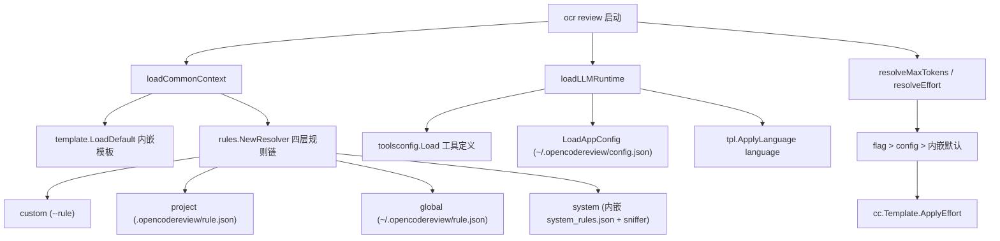
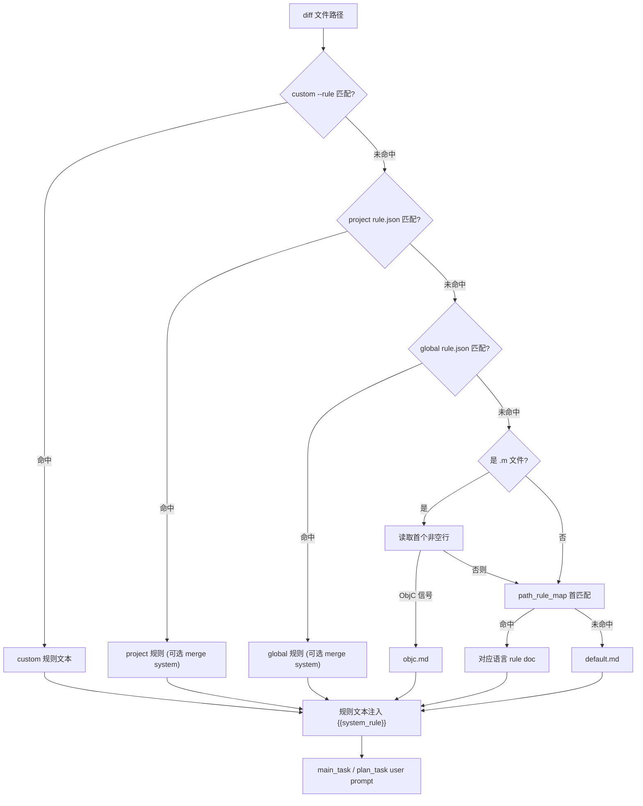
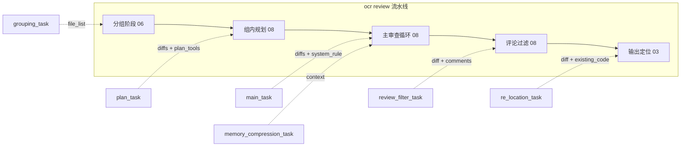

# 配置与规则系统

> **关联源码**：`internal/config/`
> **前置阅读**：[00-overview.md](00-overview.md)

## 目录

- [1. 配置体系总览](#1-配置体系总览)
- [2. 规则数据库](#2-规则数据库)
- [3. 语言嗅探器](#3-语言嗅探器)
- [4. rule_docs 体系](#4-rule_docs-体系)
- [5. 仓库级规则与分层合并](#5-仓库级规则与分层合并)
- [6. Prompt 模板引擎](#6-prompt-模板引擎)
- [7. 六组 prompt 对详解](#7-六组-prompt-对详解)
- [8. allowlist 文件过滤](#8-allowlist-文件过滤)
- [9. toolsconfig 工具配置](#9-toolsconfig-工具配置)
- [10. testconnection 连通性测试](#10-testconnection-连通性测试)
- [11. 源文件覆盖清单](#11-源文件覆盖清单)

---

## 1. 配置体系总览

本项目的"配置"由两条相互独立的轴线构成：

1. **应用配置轴**（provider、model、语言、effort 等）：决定"用哪个 LLM、以什么预算跑"。
2. **规则与模板轴**（rule.json、system_rules.json、task_template.json 等）：决定"审什么、怎么审、prompt 长什么样"。

### 1.1 配置的物理位置

| 层 | 位置 | 加载代码 |
|---|---|---|
| 全局应用配置 | `~/.opencodereview/config.json` | [config_cmd.go](../../cmd/opencodereview/config_cmd.go#L91-L98) `defaultConfigPath()` |
| 环境变量覆盖（仅只读命令） | `OCR_CONFIG_PATH` | [config_cmd.go](../../cmd/opencodereview/config_cmd.go#L100-L108) `resolveConfigPath()` |
| 全局规则 | `~/.opencodereview/rule.json` | [system_rules.go](../../internal/config/rules/system_rules.go#L371-L390) `loadGlobalRule()` |
| 仓库级规则 | `<repoRoot>/.opencodereview/rule.json` | [system_rules.go](../../internal/config/rules/system_rules.go#L405-L442) `loadProjectRule()` |
| 自定义规则（flag） | `--rule <path>` 指定的任意 JSON | [system_rules.go](../../internal/config/rules/system_rules.go#L392-L403) `loadRuleFile()` |
| 内嵌系统规则 | `system_rules.json` + `rule_docs/*.md` | [system_rules.go](../../internal/config/rules/system_rules.go#L89-L115) `LoadDefault()` |
| 内嵌 prompt 模板 | `task_template.json` + `prompts/*.md` | [template.go](../../internal/config/template/template.go#L215-L255) `LoadDefault()` |

值得注意的安全细节：`OCR_CONFIG_PATH` 只影响只读命令（如 `ocr llm test`），写路径（`config set`、review）固定使用 `defaultConfigPath()`，"避免泄漏的 `OCR_CONFIG_PATH` 重定向写入"（[config_cmd.go](../../cmd/opencodereview/config_cmd.go#L100-L108) 注释原文）。仓库级的 `.opencodereview/rule.json` 属于不可信输入（可能由 PR 作者提交），加载时有 symlink 与目录逃逸检查，详见第 5 章。

全局应用配置 `Config` 结构（[config_cmd.go](../../cmd/opencodereview/config_cmd.go#L350-L362)）包含 `provider`、`model`、`max_tokens`、`effort`、`providers`、`custom_providers`、`llm`（遗留单端点块）、`language`、`telemetry`、`mcp_servers` 十类键；合法键集合由 [supportedConfigKeys](../../cmd/opencodereview/config_cmd.go#L417-L443) 单一来源定义。该部分与 LLM 提供商解析的关系见 [05-llm-providers.md](05-llm-providers.md)。

### 1.2 优先级规则

标量型设置（max_tokens、effort）遵循「CLI flag > 应用配置 > 内嵌默认」：

- `resolveMaxTokens`（[shared.go](../../cmd/opencodereview/shared.go#L50-L64)）：`--max-tokens` > config `max_tokens` > 模板内嵌 `MAX_TOKENS`。
- `resolveEffort`（[shared.go](../../cmd/opencodereview/shared.go#L66-L76)）：`--effort` > config `effort` > `EffortDefault`（medium）。

规则文本的解析优先级是四层链（[system_rules.go](../../internal/config/rules/system_rules.go#L265-L271) `composedResolver` 字段注释）：

```text
custom (--rule)  >  project (.opencodereview/rule.json)  >  global (~/.opencodereview/rule.json)  >  system (内嵌 + sniffer)
```

**图 4-2** 展示了一次 `ocr review` 启动时的完整配置解析流（入口为 [loadCommonContext](../../cmd/opencodereview/shared.go#L92-L129) 与 [loadLLMRuntime](../../cmd/opencodereview/shared.go#L218-L271)，前者在 [review_cmd.go](../../cmd/opencodereview/review_cmd.go#L113-L168) `executeReviewContext` 中被调用）：

**图 4-2**：配置解析优先级



启动序列的关键顺序（[review_cmd.go](../../cmd/opencodereview/review_cmd.go#L113-L168)）：`loadCommonContext`（模板+规则）→ `resolveBackground` → `loadLLMRuntime`（工具+应用配置+端点）→ `resolveMaxTokens` → `resolveEffort` → `ApplyEffort` → `agent.New`。模板的 `MaxToolRequestTimes` 会被 `--max-tools` 上调（[shared.go](../../cmd/opencodereview/shared.go#L97-L99)），但不会下调。

**图 4-1** 给出本系统最核心的一条数据流——一个变更文件如何被逐层解析出规则文本并注入 prompt：

**图 4-1**：文件 → 嗅探 → 规则匹配 → prompt 组装



图 4-1 中每一步的实现位置：四层匹配在 [composedResolver.Resolve](../../internal/config/rules/system_rules.go#L447-L457)；`.m` 嗅探在 [sniffer.go](../../internal/config/rules/sniffer.go#L55-L60)；`{{system_rule}}` 注入在 [agent.go](../../internal/agent/agent.go#L1269-L1290) `buildMainTaskMessages`。

---

## 2. 规则数据库

### 2.1 system_rules.json 结构

[system_rules.json](../../internal/config/rules/system_rules.json#L1-L53) 只有两个顶层字段：

| 字段 | 类型 | 含义 |
|---|---|---|
| `default_rule` | string | 兜底规则文档名（当前为 `default.md`，[L2](../../internal/config/rules/system_rules.json#L2)） |
| `path_rule_map` | object | pattern → 规则文档名的**有序**映射，共 49 条（[L3-L53](../../internal/config/rules/system_rules.json#L3-L53)） |

`path_rule_map` 的 JSON 对象在标准 `encoding/json` 反序列化下会丢失键序，而本系统的匹配语义是"先声明者先匹配"，因此 [SystemRule.UnmarshalJSON](../../internal/config/rules/system_rules.go#L38-L87) 用 `json.Decoder` 流式逐 token 读取键值对，把 map 重建为有序的 `[]PathRule` 切片（[system_rules.go](../../internal/config/rules/system_rules.go#L26-L30)）。保序行为由 [system_rules_unmarshal_test.go](../../internal/config/rules/system_rules_unmarshal_test.go#L15-L31) 固化，`path_rule_map` 缺失或为 null 时产生空规则列表（[同文件 L33-L51](../../internal/config/rules/system_rules_unmarshal_test.go#L33-L51)）。

**声明顺序即匹配顺序**的实例：`.github/workflows/**/*.{yaml,yml}` 声明在 `.github/**/*.{yaml,yml}` 之前，后者又先于 `**/*.{yaml,yml}`（[system_rules.json](../../internal/config/rules/system_rules.json#L12-L14)），因此 CI 工作流文件命中 `github_workflows.md`、其它 `.github` 配置命中 `github_config.md`、普通 YAML 命中 `yaml.md`。这条优先序由 [resolve_github_test.go](../../internal/config/rules/resolve_github_test.go#L11-L37) 佐证——该测试验证的是 `.github` 目录下路径规则的匹配优先级，而非"从 GitHub 拉取上游规则"（仓库内不存在后者的实现，规则文件全部通过 `go:embed` 内嵌，见下文）。

### 2.2 加载流程：从文件名到规则全文

`rules` 包通过 [go:embed](../../internal/config/rules/system_rules.go#L89-L90) 把 `system_rules.json` 与整个 `rule_docs/` 目录打进二进制：

```go
//go:embed system_rules.json rule_docs/*
var rulesFS embed.FS
```

[LoadDefault](../../internal/config/rules/system_rules.go#L92-L115) 的流程是：

1. 从 embed FS 读 `system_rules.json` 并反序列化为 `SystemRule`；
2. 读 `rule_docs/<default_rule>` 的文件内容，**替换** `DefaultRule` 字段为规则全文；
3. 对每个 `PathRules[i].Rule` 同样把文件名替换为 `rule_docs/<name>` 的全文（`strings.TrimRight` 去掉尾部换行）。

也就是说 `SystemRule` 在内存中持有的不是文件引用而是完整规则文本，后续匹配不再触碰文件系统。

### 2.3 校验逻辑

运行时校验集中在 [TestSystemRulesIntegrity](../../internal/config/rules/system_rules_test.go#L1858-L1937)（CI 层面的完整性守护），共五项：

- **file_existence**：`system_rules.json` 引用的每个规则文件必须存在于 embed FS；
- **pattern_validity**：每个 pattern 经 `expandBraces` 展开后必须通过 `doublestar.ValidatePattern`；
- **no_orphan_files**：`rule_docs/` 下不允许存在未被引用的孤儿文件（[specialCaseRuleDocs](../../internal/config/rules/system_rules_test.go#L1811-L1818) 为 `objc.md` 保留豁免——它由 Go 代码经 `loadObjCRule` 直接加载；当前它同时被 `**/*.mm` 引用，该豁免实为防御性冗余）；
- **extensions_are_allowlisted**：扩展名类 pattern 的目标扩展必须在 [supported_file_types.json](../../internal/config/allowlist/supported_file_types.json#L1-L108) 中——否则文件在进入规则解析前就会被 allowlist 过滤，规则永远不生效（测试注释原话："its rule can never run"）；
- **no_duplicate_patterns**：同一 pattern 不允许重复声明（保序解码使重复键能被发现而非被 map 静默合并）。

### 2.4 匹配算法

[SystemRule.resolveDetail](../../internal/config/rules/system_rules.go#L166-L177) 对每个候选路径：

1. 路径与 pattern 都 `strings.ToLower`（大小写不敏感，[TestResolve_CaseInsensitive](../../internal/config/rules/system_rules_test.go#L233-L272) 佐证，含 `Cargo.toml` 这类大小写混合文件名）；
2. pattern 先经 [expandBraces](../../internal/config/rules/system_rules.go#L179-L203) 展开：`*.{go,py}` → `["*.go", "*.py"]`（单组花括号展开，未闭合的花括号原样返回）；
3. 用 `doublestar.Match`（[bmatcuk/doublestar/v4](../../internal/config/rules/system_rules.go#L15)）做全 glob 匹配，`**` 可跨目录；
4. **首匹配优先**；全部未命中时回退 `DefaultRule`，此时 `Pattern` 字段记为 `"default"`（[L176](../../internal/config/rules/system_rules.go#L176)）。

`Resolve` 与 `ResolveDetail` 的关系（[L145-L151](../../internal/config/rules/system_rules.go#L145-L151)）：`Resolve` 只是 `resolveDetail(path).Rule` 的捷径。`DetailResolver` 接口（[L140-L143](../../internal/config/rules/system_rules.go#L140-L143)）额外暴露 `RuleDetail{Rule, Source, Pattern, SniffedAs}`，供 `ocr rules check` 调试命令展示规则来源（[rules_cmd.go](../../cmd/opencodereview/rules_cmd.go#L45-L81)，Source 标签映射为 `Custom (--rule)` / `Project` / `Global` / `System built-in`）。

### 2.5 CanonicalConfig：配置指纹

[SystemRule.CanonicalConfig](../../internal/config/rules/system_rules.go#L153-L164) 与 [composedResolver.CanonicalConfig](../../internal/config/rules/system_rules.go#L459-L487) 产出一个确定性的、顺序稳定的字段列表，用于计算运行 manifest 的 `rule_config_sha256`。每个字段带层名与角色标签（`layer`/`pattern`/`rule`/`merge`），"两个结构不同的配置不可能在长度前缀哈希下碰撞"。确定性由 [canonical_config_test.go](../../internal/config/rules/canonical_config_test.go#L20-L37) 固化，project 规则变更必须改变输出（[同文件 L77-L99](../../internal/config/rules/canonical_config_test.go#L77-L99)）。这部分与运行清单的关系详见 [10-session-persistence.md](10-session-persistence.md)。

---

## 3. 语言嗅探器

### 3.1 为什么需要嗅探：`.m` 之争

扩展名 `.m` 同时被 MATLAB 与 Objective-C 使用。[system_rules.json](../../internal/config/rules/system_rules.json#L49) 把 `**/*.m` 静态映射到 `matlab.md`；[sniffer.go](../../internal/config/rules/sniffer.go#L32-L44) 的注释说明了这个装饰器的使命：当 `.m` 文件的**首个非空行**呈现 Objective-C 特征时，改判为 `objc.md`。这是全系统唯一的基于内容的语言嗅探——其它所有判定都基于路径 pattern。

### 3.2 装饰位置：为何包装 system 层而不是组合层

[sniffer](../../internal/config/rules/sniffer.go#L45-L51) 实现了 `systemLayer` 接口（`Resolve`/`resolveDetail`/`CanonicalConfig`，[L26-L30](../../internal/config/rules/sniffer.go#L26-L30)），在 [NewResolver](../../internal/config/rules/system_rules.go#L335-L346) 中只包裹系统层：

```go
system: &sniffer{
    inner:    sysRule,
    repoDir:  repoDir,
    ref:      opts.Ref,
    runner:   opts.Runner,
    objcRule: objcRule,
},
```

注释（[sniffer.go](../../internal/config/rules/sniffer.go#L37-L40)）解释了设计动机：如果把 sniffer 套在最外层组合 resolver 上，嗅探会**短路用户自己的 `.m` 规则**——用户配置的 custom/project/global 层必须永远压过系统层，包括设置了 `merge_system_rule` 的场景。这一层级保证由 [TestSniffer_UserRuleOutranksSniff](../../internal/config/rules/sniffer_test.go#L161-L175) 守护：项目 rule.json 写了 `**/*.m` 规则后，即使文件内容是 ObjC 也返回用户规则。

### 3.3 嗅探算法

[sniffsAsObjC](../../internal/config/rules/sniffer.go#L87-L92)：非 `.m` 路径直接返回 false，绝不触发文件读取；`.m` 文件则取首个非空行做 [looksLikeObjC](../../internal/config/rules/sniffer.go#L159-L172) 前缀匹配。[objcSniffPrefixes](../../internal/config/rules/sniffer.go#L144-L157) 列出 13 类信号：

- 预处理/导入：`#import`、`#include`、`#pragma`、`#if`（覆盖 `#ifdef`/`#ifndef`）、`#define`
- ObjC 指令：`@import`、`@interface`、`@implementation`、`@class`、`@protocol`
- C 风格注释：`//`、`/*`

两个刻意的设计（注释 [L144-L157](../../internal/config/rules/sniffer.go#L144-L157)）：

1. **不放宽为裸 `#`**：Octave 也用 `.m` 且以 `#` 作注释符，裸 `#` 会把真实的 Octave/MATLAB 文件误判为 ObjC。[TestLooksLikeObjC](../../internal/config/rules/sniffer_test.go#L272-L293) 明确断言 `"# an Octave comment"` 不嗅探为 ObjC。
2. **包含 `//` 与 `/*`**：真实 Xcode 工程文件几乎不以 `#import` 开头——文件模板以 `//` 横幅开头、多数项目首行是 license 注释；MATLAB 文件合法首字符不可能是 `/`，因此 C 风格注释本身就是可靠信号（[TestSniffer_RealisticObjCHeaders](../../internal/config/rules/sniffer_test.go#L300-L317)）。

内容为空、读取失败、无匹配前缀时一律返回 false，保持 MATLAB 默认（保守降级）。

### 3.4 内容读取：ref 感知与超时

[peekFirstLine](../../internal/config/rules/sniffer.go#L94-L116) 有两条读取路径：

- **`s.ref != ""`**（review 的 `--to`/`--commit` 模式）：通过 `git show <ref>:<path>` 读（[showAtRef](../../internal/config/rules/sniffer.go#L118-L142)，带 `-c core.quotepath=false` 与 `--end-of-options`），因为审查目标可能是未检出的 ref，文件在工作树上可能根本不存在。[TestSniffer_ReadsAtRefNotCheckedOut](../../internal/config/rules/sniffer_test.go#L120-L155) 佐证：删除工作树文件后带 ref 仍嗅探成功；不带 ref 则降级 MATLAB；未知 ref 也降级而非报错。
- **`s.ref == ""`**（`ocr scan`、`ocr rules check`）：直接 `os.Open` 工作树文件。

`git show` 由 [sniffTimeout = 5s](../../internal/config/rules/sniffer.go#L19-L21) 的 context 限时限时；有 `gitcmd.Runner` 时走共享并发限制器（[ResolverOptions.Runner](../../internal/config/rules/system_rules.go#L277-L286)，由 [loadCommonContext](../../cmd/opencodereview/shared.go#L109-L116) 在 resolver 之前创建），无 runner 时直接 exec。

sniffer **刻意无状态**（无 peek 缓存，[L41-L44](../../internal/config/rules/sniffer.go#L41-L44) 注释）：`Resolve` 被并发审查 goroutine 调用，加缓存需要锁，而一次 peek 最多一个 `.m` 文件读一次。

### 3.5 元数据契约

[resolveDetail](../../internal/config/rules/sniffer.go#L62-L73) 覆写 `Rule` 与 `SniffedAs`，但**保持 `Pattern` 为纯 glob**（`**/*.m`）——Pattern 会流入 delegate 的 `delegateRuleGroupJSON`（带 schema_version 的版本化契约），嗅探标注会静默改变序列化形状，因此嗅探事实记录在 `json:"-"` 的内部字段 `SniffedAs` 中（[RuleDetail](../../internal/config/rules/system_rules.go#L127-L138)）。[TestSniffer_ResolveDetailKeepsPatternPlain](../../internal/config/rules/sniffer_test.go#L206-L240) 固化此契约。

由于 `objc.md` 不被 `system_rules.json` 引用，[sniffer.CanonicalConfig](../../internal/config/rules/sniffer.go#L75-L83) 显式追加 objc 规则文本，否则编辑 `objc.md` 不会改变 `rule_config_sha256`（[TestSniffer_CanonicalConfigIncludesObjCRule](../../internal/config/rules/sniffer_test.go#L245-L270)）。

另外，`merge_system_rule` 的系统侧也吃到嗅探结果：[TestSniffer_MergeSystemRuleUsesSniffedRule](../../internal/config/rules/sniffer_test.go#L179-L200) 断言合并进来的必须是 objc 规则而非 MATLAB 规则。

### 3.6 45+ 语言规则文档如何挂接

语言 → rule doc 的映射**完全由 `system_rules.json` 的 pattern 声明顺序驱动**，没有独立的语言注册表：嗅探器只在 `.m` 歧义点介入。也就是说"某语言用什么规则"这个问题的答案永远是"按 path_rule_map 从上往下第一条命中的 pattern"。`ocr rules check <path>`（[rules_cmd.go](../../cmd/opencodereview/rules_cmd.go#L27-L43)）是暴露这条链的调试入口。

---

## 4. rule_docs 体系

`rule_docs/` 下共 50 个 Markdown 规则文档，全部被 [system_rules.json](../../internal/config/rules/system_rules.json#L1-L53) 引用（1 个 `default_rule` + 49 条 `path_rule_map` 的 49 个互不相同目标）；其中 `objc.md` 除经 `**/*.mm` 引用外，还由嗅探器通过 `loadObjCRule` 直接加载。完整性（无孤儿、无缺失）由 [TestSystemRulesIntegrity](../../internal/config/rules/system_rules_test.go#L1858-L1937) 守护。

### 4.1 精读五篇：模板结构总结

精读 [go.md](../../internal/config/rules/rule_docs/go.md)、[python.md](../../internal/config/rules/rule_docs/python.md)、[ts_js_tsx_jsx.md](../../internal/config/rules/rule_docs/ts_js_tsx_jsx.md)、[yaml.md](../../internal/config/rules/rule_docs/yaml.md)、[default.md](../../internal/config/rules/rule_docs/default.md) 后，可归纳出三级模板形态：

**形态一：深度语言规则**（go.md、python.md 为代表）

```
引言块（blockquote）：声明「宁缺毋滥」（precision over recall）总原则
#### <风险域 1>            ← 语义化小节标题，如 "Errors, Panics, and API Contracts"
- <可报告问题模式>         ← 每条一行，描述可判定的缺陷形态
- <...> Do not report ...  ← 反例条款：明确不可报告的情况
#### <风险域 2>
...
```

- go.md（[L1-L69](../../internal/config/rules/rule_docs/go.md#L1-L69)）：引言声明"误报消耗审查者信任；正确性/安全为阻塞级、风格为非阻塞"（[L2](../../internal/config/rules/rule_docs/go.md#L2)），随后 8 个风险域：错误与 API 契约（[L6](../../internal/config/rules/rule_docs/go.md#L6)）、nil 与值语义、context/goroutine/取消（[L19-L27](../../internal/config/rules/rule_docs/go.md#L19-L27)）、channel/锁/共享状态、timer/资源生命周期（[L39-L46](../../internal/config/rules/rule_docs/go.md#L39-L46)，含 Go 1.23 timer 语义变化）、切片与数值边界、安全边界（[L55-L64](../../internal/config/rules/rule_docs/go.md#L55-L64)）、测试与审查范围。其鲜明特征是**与工具链分工**：明确"不要报告 `go vet`、Staticcheck、`go test -race`、编译器、`gofmt` 已能可靠判定的问题"（[L4](../../internal/config/rules/rule_docs/go.md#L4)）。
- python.md（[L1-L76](../../internal/config/rules/rule_docs/python.md#L1-L76)）：同样以 precision-over-recall 引言开头（[L1](../../internal/config/rules/rule_docs/python.md#L1)），风险域为：拼写错误（仅声明处）、死代码、可变默认参数与共享状态（[L12-L17](../../internal/config/rules/rule_docs/python.md#L12-L17)）、边界处理、异常处理（[L29-L36](../../internal/config/rules/rule_docs/python.md#L29-L36)，`bare except`/`raise ... from`）、`is` 与 `==`、资源管理、性能（先确认热路径）、并发（先确认并发证据）、安全（[L68-L76](../../internal/config/rules/rule_docs/python.md#L68-L76)，`eval`/`shell=True`/`pickle`/`yaml.load`）。

**形态二：工程规范清单**（ts_js_tsx_jsx.md）

[ts_js_tsx_jsx.md](../../internal/config/rules/rule_docs/ts_js_tsx_jsx.md#L1-L40) 没有引言块，直接以小节组织：拼写、死代码、代码质量（[L10-L18](../../internal/config/rules/rule_docs/ts_js_tsx_jsx.md#L10-L18)，禁 `var`、禁 `==`、避 `any`）、React 实践（[L20-L27](../../internal/config/rules/rule_docs/ts_js_tsx_jsx.md#L20-L27)，Hooks 规则/副作用/内嵌组件）、异步规范、安全（[L34-L39](../../internal/config/rules/rule_docs/ts_js_tsx_jsx.md#L34-L39)，XSS/`innerHTML`/`eval`/原型链）。条目风格是"要求"（prohibitions/requirements）而非"缺陷形态"。

**形态三：极简域规则**（yaml.md、default.md）

- [yaml.md](../../internal/config/rules/rule_docs/yaml.md#L1) 全文一行："Check for spelling errors in yaml-keys within YAML files; ignore the content of yaml-values."——只查 key 拼写、明确忽略 value，把审查面收窄到最小。
- [default.md](../../internal/config/rules/rule_docs/default.md#L1-L22)：5 个通用提问式维度（Correctness/Security/Performance/Maintainability/Test Coverage），每维 2-3 个问句（"Is the logic correct? Are there missing boundary conditions?"）。这是所有未命中语言规则的文件的兜底。

**关于变量占位符**：rule_docs 本身是**纯静态文本，不含任何变量占位符**；语言名直接写死在小节标题中（如 `#### Go Review Principles`）。动态注入发生在 prompt 层——整个规则文本作为 `{{system_rule}}` 变量填入 user prompt（见第 7 章），LLM 看到的是"规则全文 + diff"的组合。

**通用结构要素**（跨全部深度规则文档）：

1. 降误报声明：几乎每篇语言规则都以"precision over recall"类引言开头；
2. 正例/反例成对：可报告模式与 "Do not report / Do not flag" 条款并列；
3. 证据要求：非局部论断要求先用 `file_read`/`code_search` 建立证据（go.md [L4](../../internal/config/rules/rule_docs/go.md#L4)、python.md [L22](../../internal/config/rules/rule_docs/python.md#L22)）；
4. 阻塞级分级：correctness/security 为 blocking，style 为 non-blocking。

### 4.2 语言差异化举例

同为"并发"主题，三个语言各自聚焦本语言的真实陷阱：

- go.md 聚焦 goroutine 泄漏、`sync.Once` 不可重试（[L17](../../internal/config/rules/rule_docs/go.md#L17)）、Go 1.22 前后 range 变量语义差异（[L26](../../internal/config/rules/rule_docs/go.md#L26)）；
- python.md 聚焦 GIL 下 `threading` 与 `multiprocessing` 的选择（[L60](../../internal/config/rules/rule_docs/python.md#L60)）、`async def` 内的阻塞调用（[L62](../../internal/config/rules/rule_docs/python.md#L62)）、未 await 的 task；
- ts_js_tsx_jsx.md 完全不谈并发，代之以 React 渲染副作用禁令（[L25](../../internal/config/rules/rule_docs/ts_js_tsx_jsx.md#L25)）。

### 4.3 完整清单（50 篇）

| 分类 | 文档 |
|---|---|
| 通用默认（1） | default.md |
| 编程语言/模板（28） | go, java, python, ts_js_tsx_jsx, kotlin, rust, cpp, c, php, swift, matlab, objc, arkts, astro, freemarker, handlebars_mustache, pug, graphql, prisma, julia, r, haskell, nim, elm, jsonnet, zig, solidity, vyper |
| IDL/数据模式（3） | protobuf, thrift, capnp |
| 硬件描述（2） | verilog, vhdl |
| 配置/清单/构建（11） | properties, mapper_dao_xml, pom_xml, build_gradle, package_json, cargo_toml, composer_json, json, yaml, github_workflows, github_config |
| i18n（2） | po, pot |
| 基础设施（3） | terraform, bicep, nix |

每篇的匹配 pattern 见 [system_rules.json](../../internal/config/rules/system_rules.json#L4-L52)；各文档命中效果的抽样断言见 [TestResolve_DefaultRules](../../internal/config/rules/system_rules_test.go#L59-L173)（覆盖 60+ 路径 → 关键子串）。

---

## 5. 仓库级规则与分层合并

### 5.1 rule.json 结构

三层用户规则（custom/project/global）共用同一 schema（[system_rules.go](../../internal/config/rules/system_rules.go#L205-L217)）：

```go
type ProjectRuleEntry struct {
    Path            string `json:"path"`                     // glob pattern
    Rule            string `json:"rule"`                     // 内联文本或规则文件引用
    MergeSystemRule bool   `json:"merge_system_rule,omitempty"`
}
type ProjectRule struct {
    Rules   []ProjectRuleEntry `json:"rules"`
    Include []string           `json:"include,omitempty"`     // 文件白名单 glob
    Exclude []string           `json:"exclude,omitempty"`     // 文件黑名单 glob
}
```

仓库自身的 [`.opencodereview/rule.json`](../../.opencodereview/rule.json#L1-L9) 是一个活示例：对 `internal/llm/providers.go` 配置了 provider 注册表的风格一致性、文档同步（四个语种的 configuration.md）、测试覆盖三条要求，并设置 `merge_system_rule: true`——即在 Go 系统规则之上叠加项目专属要求。

`Rule` 字段是**双态**的（[looksLikeFilePath](../../internal/config/rules/system_rules.go#L558-L570)）：单行、无空格、以 `.md`/`.txt`/`.markdown` 结尾（[allowedRuleExts](../../internal/config/rules/system_rules.go#L555-L556)）视为文件引用，其余（含多行文本、带空格句子）视为内联规则内容。[resolveRuleEntries](../../internal/config/rules/system_rules.go#L572-L587) 在加载时把文件引用替换为文件全文；[TestLooksLikeFilePath_WithSpaces](../../internal/config/rules/system_rules_test.go#L1443-L1455) 佐证 `"Follow rules from team.md"` 被当作内联而非路径。

### 5.2 合并语义

[composedResolver.Resolve](../../internal/config/rules/system_rules.go#L447-L457) 的完整算法：

1. 依 custom → project → global 顺序调用 [matchProjectRuleEntry](../../internal/config/rules/system_rules.go#L535-L553)（同样 lowercase + expandBraces + doublestar，声明顺序内首匹配优先）；
2. 命中且未设 `merge_system_rule`：**用户规则完全替换**系统规则（[TestNewResolver_ProjectRuleReplacesSystemRuleByDefault](../../internal/config/rules/system_rules_test.go#L482-L510)）；
3. 命中且设 `merge_system_rule`：调用 [mergeWithSystemRule](../../internal/config/rules/system_rules.go#L489-L504)，拼接为固定格式：

   ```markdown
   ## System-Specific Rules (Mandatory)

   <系统规则全文>

   ---

   ## User-Specific Rules (Mandatory)

   <用户规则全文>
   ```

4. 空规则条目（`rule == ""` 且无 merge）在匹配时被跳过并继续下探（[L542-L544](../../internal/config/rules/system_rules.go#L542-L544)，[TestNewResolver_EmptyRuleSkippedAndFallsBack](../../internal/config/rules/system_rules_test.go#L416-L447)）；空规则 + merge 则只返回系统规则、不带 User 段头（[TestNewResolver_EmptyRuleMergeSystemRuleReturnsSystemOnly](../../internal/config/rules/system_rules_test.go#L449-L480)）；
5. 三层全未命中 → 系统层（含嗅探）。

`ResolveDetail`（[L510-L533](../../internal/config/rules/system_rules.go#L510-L533)）在 merge 场景下返回合并文本但 Source/Pattern 仍描述**获胜的用户层**条目。

### 5.3 不可信输入的安全模型

project 层 rule.json 可能由任意 PR 作者提交，因此按不可信输入处理：

- **目录与文件 symlink 检查**：[loadProjectRule](../../internal/config/rules/system_rules.go#L405-L442) 先 `pathutil.CanonicalPath` 得到 confineRoot，再 `filepath.EvalSymlinks` 解析 `.opencodereview/rule.json`，解析结果必须 `pathutil.WithinBase(confineRoot, ...)`，否则打警告并跳过整个文件（[L424-L427](../../internal/config/rules/system_rules.go#L424-L427)）。[TestLoadProjectRule_RejectsSymlinkedDir](../../internal/config/rules/system_rules_test.go#L1745-L1762) 与 [TestLoadProjectRule_RejectsSymlinkedRuleFile](../../internal/config/rules/system_rules_test.go#L1764-L1787) 佐证两个方向都封死。
- **规则文件引用的 confine**：[readRuleFileSafe](../../internal/config/rules/system_rules.go#L632-L664) 施加四重限制——扩展名白名单（`.md`/`.txt`/`.markdown`）、512 KB 大小上限、symlink 解析后必须在 confineRoot 内、内容 TrimRight。[TestLoadProjectRule_ConfinesUntrustedReferences](../../internal/config/rules/system_rules_test.go#L1709-L1740) 用一个指向仓库外 `AWS_KEY=...` 文件的绝对路径引用验证攻击被阻断（rule 被清空）。
- **相对路径 traversal**：[tryReadRuleFile](../../internal/config/rules/system_rules.go#L612-L618) 对相对引用做 `filepath.Clean(Join(repoDir, rule))` 前缀校验。
- **信任分层**：custom（`--rule`，用户自己敲的命令行）与 global（用户自己的 HOME）传空 confineRoot，绝对路径允许指向仓库外（[TestResolveRuleEntries_TrustedAbsoluteOutsideAllowed](../../internal/config/rules/system_rules_test.go#L1668-L1683)）——只有 project 层受限。
- **monorepo 锚定**：`ocr review` 从子目录运行时 RepoDir 被 `git rev-parse --show-toplevel` 锚定到仓库根（[shared.go](../../cmd/opencodereview/shared.go#L154-L172)，issue #287），因此 rule.json 永远从仓库根读取；子项目局部 rule.json 被有意忽略（[loadProjectRule 注释](../../internal/config/rules/system_rules.go#L405-L409)）。

### 5.4 include/exclude 文件过滤

[buildFileFilter](../../internal/config/rules/system_rules.go#L349-L369) 不做合并而是**整体选层**：取最高优先级（custom > project > global）中配置了任一 include/exclude 的层，其余层的过滤配置被忽略（[TestNewResolver_FileFilterPriorityOverride](../../internal/config/rules/system_rules_test.go#L784-L825)）。`FileFilter.IsUserExcluded`/`IsUserIncluded`（[L231-L263](../../internal/config/rules/system_rules.go#L231-L263)）大小写不敏感 + 花括号展开；Include 为空时 `IsUserIncluded` 恒 false（不构成白名单约束）。CLI 的 `--exclude` 通过 [applyCLIExcludes](../../cmd/opencodereview/shared.go#L315-L326) 追加到 FileFilter.Exclude（可在无任何 rule.json 层时凭空创建 FileFilter）。

---

## 6. Prompt 模板引擎

### 6.1 Template 与 manifest 双结构

[template.go](../../internal/config/template/template.go#L16-L31) 的 `Template` 结构就是 [task_template.json](../../internal/config/template/task_template.json#L1-L46) 的 Go 映射，分两类字段：

**对话字段**（每组一个 system+user 消息对）：

| 字段 | 必填 | 用途 |
|---|---|---|
| `MAIN_TASK` | 是 | 主审查任务 |
| `PLAN_TASK` | 可选 | 组内规划 |
| `MEMORY_COMPRESSION_TASK` | 是 | 上下文压缩 |
| `RE_LOCATION_TASK` | 可选 | 评论重定位 |
| `REVIEW_FILTER_TASK` | 可选 | 评论反思过滤 |
| `GROUPING_TASK` | 可选 | 文件分组 |

**标量字段**（[task_template.json](../../internal/config/template/task_template.json#L38-L45) 当前值）：

| 键 | 值 | 消费方 |
|---|---|---|
| `MAX_TOKENS` | 200000 | 上下文 token 预算（[checkPromptBudget](../../internal/agent/agent.go#L1292-L1304) 以其 80% 为提示上限） |
| `MAX_COMPLETION_TOKENS` | 16384 | 输出上限（[CompletionTokenLimit](../../internal/config/template/template.go#L139-L146)，未设时回落 MAX_TOKENS） |
| `MAX_TOOL_REQUEST_TIMES` | 100 | 每任务工具调用次数上限（`--max-tools` 只升不降） |
| `PLAN_MODE_LINE_THRESHOLD` | 50 | 触发规划的单文件行数阈值 |
| `PLAN_MODE_GROUP_LINE_THRESHOLD` | 100 | 触发规划的组累计行数阈值（文件数 ≥ 2 时） |
| `GROUPING_MIN_FILES` | 4 | 低于此文件数不做 LLM 分组 |
| `GROUPING_BUNDLE_LINE_THRESHOLD` | 200 | 低于此变更行数可合并为一组 |
| `MAX_REVIEW_ROUNDS` | 2 | 每组审查轮数（effort 覆写目标） |

阈值逻辑的三个方法值得走读：

- [PlanRequired](../../internal/config/template/template.go#L63-L81)（[L69-L81](../../internal/config/template/template.go#L69-L81)）：`PlanModeLineThreshold <= 0` 时恒 true（规划无条件）；否则单文件 churn ≥ 50 行、或文件数 ≥ 2 且组累计 ≥ 100 行时触发。注释点明双阈值协作动机：前者抓"单个大重写"，后者抓"多个中等文件合计需要结构化引导"。
- [GroupingPlan](../../internal/config/template/template.go#L112-L137)：返回三值策略 `GroupingViaLLM` / `GroupingBundleAll` / `GroupingPerFile`（[L83-L110](../../internal/config/template/template.go#L83-L110)）。文件数 < `GROUPING_MIN_FILES` 时先问"分区值不值得算"（不值得则跳过 LLM），再问"能否装进一个组"（churn < 200 行则 bundle，否则 per-file）。任一阈值 ≤ 0 各自禁用自己的步骤。
- [ReviewRounds](../../internal/config/template/template.go#L55-L61)：恒 ≥ 1。

### 6.2 prompt_file 引用与解析

task_template.json 的每个任务用 `prompt_file` 引用 `prompts/` 下的 Markdown（例如 [L2-L7](../../internal/config/template/task_template.json#L2-L7)：MAIN_TASK 的 system 指向 `main_task_system.md`、user 指向 `main_task_user.md`）。[resolveConversation](../../internal/config/template/template.go#L188-L202) 从 embed FS（[go:embed task_template.json prompts/*](../../internal/config/template/template.go#L156-L157)）读出文件内容、TrimRight 后组装为 `ChatMessage{Role, Content}`。这一间接层让 prompt 文本独立于 manifest JSON 版本化。

[LoadDefault](../../internal/config/template/template.go#L215-L255) 逐任务解析：必填任务（MAIN/MEMORY_COMPRESSION）缺失报错，可选任务（PLAN/RE_LOCATION/REVIEW_FILTER/GROUPING）缺失为 nil、由调用方降级处理。[Validate](../../internal/config/template/template.go#L312-L326) 只做四项下限检查（MaxTokens > 0、MaxToolRequestTimes > 0、MaxReviewRounds ≥ 0、MainTask 非空）。

### 6.3 scan_template.json：内联变体

[ScanTemplate](../../internal/config/template/template.go#L33-L53) 与 review 模板**完全分离**（注释："Kept entirely separate ... so the two pipelines can evolve their prompts and budgets independently"）。差异有三：

1. **prompt 内联**：[scan_template.json](../../internal/config/template/scan_template.json#L1-L89) 的消息直接写 `content` 而非 `prompt_file`，不经 embed FS 解析（[LoadScanDefault](../../internal/config/template/template.go#L257-L264) 直接 Unmarshal）。
2. **独有任务**：`DEDUP_TASK`（批内评论去重，[L28-L40](../../internal/config/template/scan_template.json#L28-L40)）与 `PROJECT_SUMMARY_TASK`（全仓扫描总结，[L41-L53](../../internal/config/template/scan_template.json#L41-L53)），归 [09-scan-pipeline.md](09-scan-pipeline.md) 详述。
3. **独有标量**：`MAX_TOKENS: 58888`、`MAX_TOOL_REQUEST_TIMES: 60`、`MAX_FILE_SIZE_BYTES: 2097152`（2 MB）、`BATCH_STRATEGY: "by-language"`、`BATCH_SIZE: 50`、`DEDUP_MIN_COMMENTS: 4`、`TOOL_REQUEST_WAIT_TIME_MS: 10000`、`MAX_SUBTASK_EXECUTION_TIME_MINUTES: 5`（[L80-L88](../../internal/config/template/scan_template.json#L80-L88)）。

一个如实记录的观察：scan_template.json 每个任务对象还带 `timeout` 字段（90-180 秒，如 [L13](../../internal/config/template/scan_template.json#L13)），但 `ScanTemplate`/`LlmConversation`（review 侧，[L342-L350](../../internal/config/template/template.go#L342-L350)）均未声明该字段，`json.Unmarshal` 会忽略之；scan 的实际运行超时由 `MAX_SUBTASK_EXECUTION_TIME_MINUTES` 驱动（[scan/agent.go](../../internal/scan/agent.go#L655) 换算 `ConcurrentTaskTimeout`）。该字段是否为预留，**待与维护者确认**。

scan 的 MAIN_TASK prompt 与 review 版有可感知的差异（[L6](../../internal/config/template/scan_template.json#L6)）：声明"reviewing an ENTIRE existing source file (no diff context)"，并加入工具预算纪律——"文件内容已在 `<current_file_content>` 中，不要调 `file_read` 重新读取；每个 finding 最多 2-3 次上下文调用；批量提交 `code_comment`"。

### 6.4 ApplyLanguage

[ApplyLanguage](../../internal/config/template/template.go#L283-L310) 把 `"\n\nAlways respond in <Language>."` 追加到**所有 system 角色消息**尾部（review 版作用于 MAIN/PLAN/MEMORY_COMPRESSION，scan 版额外作用于 DEDUP/PROJECT_SUMMARY）；空语言回退 English。语言值来自应用配置的 `language` 键（[loadLLMRuntime](../../cmd/opencodereview/shared.go#L234-L240)，config 文件缺失时也执行默认注入）。

### 6.5 effort 分级

[effort.go](../../internal/config/template/effort.go#L15-L22) 定义三档 effort：`low` / `medium`（默认）/ `high`。每档展开为 [EffortPreset](../../internal/config/template/effort.go#L29-L38)，目前唯一旋钮是审查轮数：

| Effort | MaxReviewRounds |
|---|---|
| low | 1 |
| medium（默认） | 2 |
| high | 3 |

[ParseEffort](../../internal/config/template/effort.go#L40-L47) 做大小写不敏感校验；[ApplyEffort](../../internal/config/template/effort.go#L57-L61) 直接覆写 `t.MaxReviewRounds`（当前不调整 prompt 文本或 token 预算——若未来有此意图，**待与维护者确认**）。生效链路：`ocr config set effort high` 或 `--effort` flag → [resolveEffort](../../cmd/opencodereview/shared.go#L66-L76) → [ApplyEffort](../../cmd/opencodereview/review_cmd.go#L164-L168)（在 `agent.New` 之前）。

---

## 7. 六组 prompt 对详解

先给出全局视图。**图 4-3**：六组 prompt 与流水线阶段的对应关系（阶段编号对应各分篇文档；`ocr review` 主链路见 [08-review-pipeline.md](08-review-pipeline.md)）：



六组 prompt 全部遵循同一对话形态：system 定角色与输出纪律，user 携带全部业务数据。变量注入统一用 `strings.ReplaceAll` 简单替换（非模板引擎），逐组说明如下。

### 7.1 main_task（主审查）

- **文件**：[main_task_system.md](../../internal/config/template/prompts/main_task_system.md#L1-L25)、[main_task_user.md](../../internal/config/template/prompts/main_task_user.md#L1-L26)
- **使用阶段**：review 流水线每组每轮的主 LLM 调用（[buildMainTaskMessages](../../internal/agent/agent.go#L1266-L1290)，第 2 轮起 plan_guidance 为空时整段剥离）
- **system 要求 LLM 做什么**：以专业代码审查助理身份产出可合并前的审查反馈；逐步思考；理解 Unified Diff 语义（`-` 删除、`+` 新增、连续 `-`/`+` 为修改）（[L7](../../internal/config/template/prompts/main_task_system.md#L7)）；上下文不清时**用工具获取信息而非基于假设判断**（[L8](../../internal/config/template/prompts/main_task_system.md#L8)）；只评新增代码、不评删除代码与未变更代码；默认不评注释/`@Generated` 等元数据（[L14](../../internal/config/template/prompts/main_task_system.md#L14)）。Strict Focus Rules（[L16-L19](../../internal/config/template/prompts/main_task_system.md#L16-L19)）要求逐文件各过一遍、鼓励 `<review_files>` 内跨文件观察（不一致/漏改/契约破坏），但**评论必须落在 review_files 内的代码上**。Reply limit（[L21-L25](../../internal/config/template/prompts/main_task_system.md#L21-L25)）规定终止协议：完成调 `task_done`、确认问题调 `code_comment`、需上下文调上下文工具。
- **user 注入的变量**（[main_task_user.md](../../internal/config/template/prompts/main_task_user.md#L1-L26)，替换点 [agent.go#L1274-L1286](../../internal/agent/agent.go#L1274-L1286)）：

| 占位符 | 注入内容 | 来源 |
|---|---|---|
| `{{change_files}}` | 本次变更中**不在本组**的其它文件清单（`<other_changed_files>`） | agent 组装 |
| `{{diffs}}` | 本组各文件的 `<file>` diff 块 | agent 组装 |
| `{{current_system_date_time}}` | 真实世界当前时间 | `a.currentDate` |
| `{{requirement_background}}` | 需求背景（`--background`，可选） | `a.args.Background`（[agent.go#L114](../../internal/agent/agent.go#L114)） |
| `{{system_rule}}` | 第 2-5 章解析出的规则全文 | resolver |
| `{{plan_guidance}}` | plan_task 产出的结构化计划（第 1 轮） | plan 结果 |
| `{{confirmed_comments}}` | 前几轮已确认的发现（第 2+ 轮） | 评论收集器 |

plan_guidance / confirmed_comments 为空时由 `stripEmptyPlanBlock`/`stripEmptyConfirmedBlock` 连标题整段移除（[agent.go#L1279-L1285](../../internal/agent/agent.go#L1279-L1285)），避免留空标题噪音。

### 7.2 plan_task（规划）

- **文件**：[plan_task_system.md](../../internal/config/template/prompts/plan_task_system.md#L1-L36)、[plan_task_user.md](../../internal/config/template/prompts/plan_task_user.md#L1-L17)
- **使用阶段**：review 每组在 [PlanRequired](../../internal/config/template/template.go#L69-L81) 为 true 时先跑规划（[executeGroupPlanPhase](../../internal/agent/agent.go#L1692-L1744)，一次性非 agent 调用）
- **system 要求**：作为审查规划专家，分析变更、识别风险点、为每个风险点**规划工具调用策略**。输出为严格纯文本结构（禁 Markdown 标题、禁代码围栏）：`Summary:` 行 + 编号 Issues 列表，每条带 `[high|medium|low]` 严重度（定义见 [L30-L33](../../internal/config/template/prompts/plan_task_system.md#L30-L33)：high=安全/数据丢失/崩溃，medium=性能/可维护性/边界，low=风格）、每条下若干 `→ (工具名) (参数) — (调用理由)` 行。工具**只描述意图不真调用**（[L34](../../internal/config/template/prompts/plan_task_system.md#L34)）；无风险时输出 `(none)` 且不许编造。
- **user 变量**：与 main_task 共享 `{{change_files}}`、`{{diffs}}`、`{{current_system_date_time}}`、`{{requirement_background}}`、`{{system_rule}}`（[plan_task_user.md](../../internal/config/template/prompts/plan_task_user.md#L1-L15)），另有 system 侧的 `{{plan_tools}}`（[plan_task_system.md#L7](../../internal/config/template/prompts/plan_task_system.md#L7)）注入 plan 阶段可用工具的 JSON 定义（`formatToolDefs(a.args.PlanToolDefs)`，[agent.go#L1707](../../internal/agent/agent.go#L1707)；工具集由 tools.json 的 `plan_task: true` 过滤，见第 9 章）。
- 产出作为 `{{plan_guidance}}` 回灌 main_task（第 7.1 节）。

### 7.3 grouping_task（分组）

- **文件**：[grouping_task_system.md](../../internal/config/template/prompts/grouping_task_system.md#L1-L13)、[grouping_task_user.md](../../internal/config/template/prompts/grouping_task_user.md#L1-L6)
- **使用阶段**：review 变更集文件数 ≥ `GROUPING_MIN_FILES` 时（[GroupingPlan](../../internal/config/template/template.go#L129-L137) 判定，[callGroupingLLM](../../internal/agent/grouping.go#L167-L187) 执行；小变更集走本地 groupWithoutLLM，见 [06-agent-loop.md](06-agent-loop.md)）
- **system 要求**：把变更文件聚成"应一起审查的语义簇"，给出四种同组特征——同模块/特性、生产者-消费者关系（如接口与实现）、同一资源的 i18n/config 变体、同目录单一关注点。硬性规则：每个文件恰属一组、单文件可成组、每组 ≤ 10 文件、**只输出 JSON 数组**。
- **user 变量**：仅 `{{file_list}}`（[grouping_task_user.md#L3](../../internal/config/template/prompts/grouping_task_user.md#L3)，由 [buildFileList](../../internal/agent/grouping.go#L181) 构造）。期望输出形如 `[{"label": "short theme description", "files": ["path1", "path2"]}]`。

### 7.4 re_location_task（重定位）

- **文件**：[re_location_task_system.md](../../internal/config/template/prompts/re_location_task_system.md#L1)、[re_location_task_user.md](../../internal/config/template/prompts/re_location_task_user.md#L1-L20)
- **使用阶段**：review 输出阶段，`code_comment` 的 `existing_code` 文本匹配失败时兜底（[BuildReLocationMessages](../../internal/diff/relocation.go#L28-L42)，归 [03-diff-engine.md](03-diff-engine.md)）
- **system 要求**：一句话角色——"给定 unified diff 与一条审查评论，唯一任务是从 diff 中提取评论所指的精确代码片段"，尾部 `/no_think` 关闭思考模式（省 token）。
- **user 变量**：注意这组用**单大括号**占位符（区别于其它组的双大括号），[relocation.go#L36-L38](../../internal/diff/relocation.go#L36-L38) 替换：`{diff}` = 该文件 diff 全文、`{existing_code}` = 匹配失败的原始代码片段、`{suggestion_content}` = 评论内容。五条规则要求逐字复制 diff 行、剥离 `+`/`-`/空格前缀、只含直接相关行、多候选时取单个最相关处、**只输出围栏代码块**。新旧模板占位符差异由 [template_test.go#L188-L190](../../internal/config/template/template_test.go#L188-L190) 固化（"ReLocation user has diff (single brace)"）。

### 7.5 review_filter_task（评论反思过滤）

- **文件**：[review_filter_task_system.md](../../internal/config/template/prompts/review_filter_task_system.md#L1-L15)、[review_filter_task_user.md](../../internal/config/template/prompts/review_filter_task_user.md#L1-L86)
- **使用阶段**：review 每组评论收集后（[executeGroupReviewFilter](../../internal/agent/agent.go#L1746-L1821)，`--no-filter` 可跳过）
- **system 的不对称代价论**：这是全系统最精心设计的一段 prompt。它先框定角色为"事实核查员"：Agent 能读全代码库，而你只能看到这组 diff——"你看不到的，Agent 很可能看到了"（[L3](../../internal/config/template/prompts/review_filter_task_system.md#L3)）。随后声明**两种错误的代价不对称**：保留错误评论只耗审查者几秒；删除正确评论则"静默毁掉一个真实发现，永远无人知晓"（[L7-L10](../../internal/config/template/prompts/review_filter_task_system.md#L7-L10)）。结论："证据不足即放行"。
- **user 的五步方法**（[L52-L68](../../internal/config/template/prompts/review_filter_task_user.md#L52-L68)，按序短路）：Step 1 受保护主题否决（内存安全/并发/链接一致性/行为兼容变更/未用参数五类，[L31-L41](../../internal/config/template/prompts/review_filter_task_user.md#L31-L41)——即使确信错误也放行）；Step 2 价值否决（风格类属实则放行，"low value is not your concern"）；Step 3 Ground A（评论描述的代码不在其目标文件 diff 中 → 删）；Step 4 Ground B（任一文件的某一行字面反驳评论核心论断、无需推理链 → 删）；Step 5 放行。
- **输出协议**：必须恰好调用一个工具——`report_incorrect_comments`（仅限能点名反驳行的评论）或 `approve_all_comments`（其余一切情形）。
- **user 变量**：`{{path}}`（组键）、`{{diff}}`（组内串联 diff）、`{{comments}}`（候选评论 JSON）（[agent.go#L1800-L1805](../../internal/agent/agent.go#L1800-L1805)）。

### 7.6 memory_compression_task（上下文压缩）

- **文件**：[memory_compression_task_system.md](../../internal/config/template/prompts/memory_compression_task_system.md#L1-L31)、[memory_compression_task_user.md](../../internal/config/template/prompts/memory_compression_task_user.md#L1)
- **使用阶段**：agent 主循环中消息历史逼近 token 上限时的三区压缩（[runCompression](../../internal/llmloop/compression.go#L219-L239)，[06-agent-loop.md](06-agent-loop.md)）
- **system 要求**：作为对话摘要助手，把"审查助理与 LLM 的完整对话（含工具调用及结果）"压缩为结构化摘要，使审查可从当前状态继续。输出固定五维（可省略空维）：Identified Code Issues（按 HIGH/MEDIUM/LOW 排序，含路径/类型/严重度/简述）、Tool Call Conclusions、Completed Tasks、Pending Tasks、Current Focus（一句话）。规则禁具体代码细节、禁冗余。
- **user 变量**：仅 `{{context}}`——[buildMessageXML](../../internal/llmloop/compression.go#L233) 把冻结区与压缩区之间的消息序列化为 XML 后注入。压缩产物回填 user prompt，重建为 `[frozen] + [摘要] + [active]` 三区结构（[compression.go#L219-L222](../../internal/llmloop/compression.go#L219-L222) 注释）。

---

## 8. allowlist 文件过滤

[allowedext 包](../../internal/config/allowlist/allowed_ext.go#L4-L28) 决定"哪些文件有资格进入审查"，两层机制：

### 8.1 扩展名白名单

[supported_file_types.json](../../internal/config/allowlist/supported_file_types.json#L1-L108) 是 106 个扩展名的 JSON 数组（`.java` 到 `.vy`），经 [initMap](../../internal/config/allowlist/allowed_ext.go#L55-L64) 用 `sync.Once` 惰性建入 map。[IsAllowedExt](../../internal/config/allowlist/allowed_ext.go#L75-L80) 大小写不敏感查询。注意白名单比规则库宽：如 `.scala`、`.cs`、`.rb`、`.vue`、`.dart`、`.lua`、`.sql` 在白名单中但无专属 rule doc（落 default.md）；反方向则被 [TestSystemRulesIntegrity](../../internal/config/rules/system_rules_test.go#L1901-L1921) 的 extensions_are_allowlisted 检查禁止（规则文档的扩展必须在白名单内，否则规则永不生效）。

### 8.2 默认排除模式

[default_exclude_patterns.json](../../internal/config/allowlist/default_exclude_patterns.json#L1-L56) 是 54 条 glob 排除模式，覆盖：各语言测试文件（`**/*_test.go`、`**/*.test.{js,jsx,ts,tsx}`、`**/src/test/java/**/*.java` 等）、快照与测试数据（`**/__snapshots__/**`、`**/testdata/**`、`**/fixtures/**`）、生成代码（`**/*.pb.go`、`**/*.capnp.h`、`**/kitex_gen/**/*.go`、`**/*.generated.*`）、硬件 testbench（`**/tb_*.{v,sv,vhd,vhdl}`）等。[IsExcludedPath](../../internal/config/allowlist/allowed_ext.go#L82-L99) 大小写不敏感匹配。

包级文档注释（[L8-L27](../../internal/config/allowlist/allowed_ext.go#L8-L27)）给出了 doublestar 语法的权威说明：

- `*` 匹配单段内任意字符（**不跨 `/`**）：`*_test.go` 只匹配根目录测试文件；
- `**` 匹配零或多段（可跨 `/`）：`**/*_test.go` 匹配任意深度；
- `{a,b,c}` 花括号展开：`**/*.{js,ts}`。

这层默认排除与第 5.4 节的用户 FileFilter（rule.json 的 include/exclude）叠加生效：默认排除先剔除测试/生成物，用户配置再做精细化圈定。文件过滤的整体时序见 [08-review-pipeline.md](08-review-pipeline.md)。

---

## 9. toolsconfig 工具配置

[tools.json](../../internal/config/toolsconfig/tools.json#L1-L213) 以 JSON 数组定义 6 个工具，[ToolConfigEntry](../../internal/config/toolsconfig/toolsconfig.go#L14-L20) 每项含四个字段：

| 字段 | 含义 |
|---|---|
| `name` | 工具名 |
| `plan_task` | 是否在规划阶段可用 |
| `main_task` | 是否在主审查阶段可用 |
| `definition` | OpenAI function-calling 格式的原生 JSON Schema（保持 RawMessage 透传） |

[Load](../../internal/config/toolsconfig/toolsconfig.go#L25-L43) 在 `--tools` 指定路径时读外部文件（可完全替换工具集），否则用内嵌默认。[ToolDefsByPhase](../../internal/config/toolsconfig/toolsconfig.go#L45-L57) 按 phase 二选一过滤，[BuildToolDefs](../../cmd/opencodereview/shared.go#L223-L224) 产出 `planToolDefs` 与 `mainToolDefs` 两份。

六个工具的相位矩阵：

| 工具 | plan_task | main_task | 职责（description 摘要） |
|---|---|---|---|
| [task_done](../../internal/config/toolsconfig/tools.json#L2-L26) | - | 是 | 终止任务，`state` ∈ {DONE, FAILED} |
| [code_comment](../../internal/config/toolsconfig/tools.json#L27-L99) | - | 是 | 提交评论；`comments` 数组每项含 `content`/`existing_code`/`suggestion_code`/`category`(8 枚举)/`severity`(4 枚举)/`path`；description 详述滑动窗口匹配机制，要求 `existing_code` 逐字存在于 diff 新增行 |
| [code_search](../../internal/config/toolsconfig/tools.json#L100-L135) | 是 | 是 | 文本/正则搜索，支持 git pathspec 式 file_patterns（含 `:(exclude)`）、大小写开关、Perl 正则开关；>100 命中截断 |
| [file_read](../../internal/config/toolsconfig/tools.json#L136-L164) | - | 是 | 按行读文件（改动后版本）；description 教 LLM 如何从 `@@-x,y +m,n@@` 推导上下文行号；>500 行截断 |
| [file_read_diff](../../internal/config/toolsconfig/tools.json#L165-L188) | 是 | 是 | 查看其它文件的 diff（跨文件确认问题用）；scan 模式下被 [excludeToolDef](../../cmd/opencodereview/shared.go#L328-L340) 隐藏 |
| [file_find](../../internal/config/toolsconfig/tools.json#L189-L213) | 是 | 是 | 按文件名关键词找文件，查询含 `/` 时匹配全路径；前 100 条 |

相位设计值得注意：plan 阶段只给**检索类**工具（code_search/file_read_diff/file_find，规划只要"看"不要"做"），而 `file_read` 反而只在 main 阶段（规划输入已含全量 diff，无需读原文件）。`{{plan_tools}}` 把 plan 相位定义注入 plan_task system prompt（第 7.2 节）。工具的执行端实现见 [07-tool-system.md](07-tool-system.md)。

---

## 10. testconnection 连通性测试

[testconnection 包](../../internal/config/testconnection/testconnection.go#L1-L57) 服务 `ocr llm test`（[llm_cmd.go](../../cmd/opencodereview/llm_cmd.go#L30-L37)）：

[task.json](../../internal/config/testconnection/task.json#L1-L15) 定义一轮极小对话：system 声明身份（"You are open-code-review, a code review assistant developed by Alibaba, running in the user's command-line environment"）并给出快速上手命令 `ocr --help`；user 只有一句 "One sentence to answer who you are."；`timeout: 120`。

[runLLMTest](../../cmd/opencodereview/llm_cmd.go#L53-L133) 的流程：

1. `resolveConfigPath()`（此处 OCR_CONFIG_PATH 生效）读应用配置；
2. `llm.ResolveEndpoint` 解析端点（provider/model/api_key，详见 [05-llm-providers.md](05-llm-providers.md)）；
3. [LoadDefault](../../internal/config/testconnection/testconnection.go#L33-L40) 加载内嵌任务，[ApplyLanguage](../../internal/config/testconnection/testconnection.go#L49-L57) 注入语言指令（与主模板同款 `\n\nAlways respond in <Language>.`）；
4. 超时取 `task.Timeout`（120s，未设回退 30s）；
5. 构造 `MaxTokens: 2048` 的单次 Completions 请求——**判定成功的标准就是该请求返回且无错误**（无内容校验、无重试收集器，注释明言 "llm test is a connectivity probe, not a review"）；
6. 成功则打印端点 Source、模型（优先响应中的 `resp.Model`）等信息。

---

## 11. 源文件覆盖清单

internal/config 下非测试 `.go` 共 7 个、数据资产 JSON 共 7 个、prompts 12 篇、rule_docs 50 篇，逐一列入（Glob `internal/config/**/*.go` 剔除 `_test.go` 后核对无遗漏；测试文件单列参考）。

### 11.1 Go 源文件

| 源文件 | 职责 | 关键符号 |
|---|---|---|
| [rules/system_rules.go](../../internal/config/rules/system_rules.go) | 规则加载、四层 resolver、文件过滤、配置指纹 | `SystemRule`、`ProjectRule`、`FileFilter`、`composedResolver`、`NewResolver`、`LoadDefault`、`UnmarshalJSON`、`expandBraces`、`resolveRuleEntries`、`readRuleFileSafe`、`CanonicalConfig` |
| [rules/sniffer.go](../../internal/config/rules/sniffer.go) | `.m` 扩展名 MATLAB/ObjC 内容嗅探装饰器 | `sniffer`、`systemLayer`、`sniffsAsObjC`、`peekFirstLine`、`showAtRef`、`looksLikeObjC`、`objcSniffPrefixes` |
| [template/template.go](../../internal/config/template/template.go) | review/scan 任务模板加载与阈值策略 | `Template`、`ScanTemplate`、`LoadDefault`、`LoadScanDefault`、`resolveConversation`、`PlanRequired`、`GroupingPlan`、`GroupingStrategy`、`ApplyLanguage`、`Validate`、`LlmConversation` |
| [template/effort.go](../../internal/config/template/effort.go) | effort 分级预设 | `Effort`、`EffortPreset`、`effortPresets`、`ParseEffort`、`ApplyEffort` |
| [allowlist/allowed_ext.go](../../internal/config/allowlist/allowed_ext.go) | 扩展名白名单与默认排除模式 | `IsAllowedExt`、`IsExcludedPath`、`initMap`、`initExclude` |
| [toolsconfig/toolsconfig.go](../../internal/config/toolsconfig/toolsconfig.go) | 工具定义加载与相位过滤 | `ToolConfigEntry`、`Load`、`ToolDefsByPhase` |
| [testconnection/testconnection.go](../../internal/config/testconnection/testconnection.go) | LLM 连通性测试任务 | `TestTask`、`LoadDefault`、`ApplyLanguage` |

### 11.2 数据资产

| 源文件 | 职责 | 关键内容 |
|---|---|---|
| [rules/system_rules.json](../../internal/config/rules/system_rules.json) | 系统规则数据库 | `default_rule: default.md` + 49 条有序 pattern 映射 |
| [template/task_template.json](../../internal/config/template/task_template.json) | review 任务 manifest | 6 组任务的 prompt_file 引用 + 8 个标量阈值 |
| [template/scan_template.json](../../internal/config/template/scan_template.json) | scan 任务模板（内联 prompt） | MAIN/PLAN/DEDUP/PROJECT_SUMMARY/MEMORY_COMPRESSION/RE_LOCATION + scan 专属标量 |
| [allowlist/supported_file_types.json](../../internal/config/allowlist/supported_file_types.json) | 可审扩展名白名单 | 106 个扩展名 |
| [allowlist/default_exclude_patterns.json](../../internal/config/allowlist/default_exclude_patterns.json) | 默认排除 glob | 54 条模式（测试/生成物/快照等） |
| [toolsconfig/tools.json](../../internal/config/toolsconfig/tools.json) | 工具定义 | 6 工具的相位标记与 JSON Schema |
| [testconnection/task.json](../../internal/config/testconnection/task.json) | 连通性测试对话 | TEST_TASK（system+user，timeout 120） |

### 11.3 prompts/（12 篇，全部走读于第 7 章）

| 文件 | 所属任务 | 角色 |
|---|---|---|
| [main_task_system.md](../../internal/config/template/prompts/main_task_system.md) | MAIN_TASK | system |
| [main_task_user.md](../../internal/config/template/prompts/main_task_user.md) | MAIN_TASK | user |
| [plan_task_system.md](../../internal/config/template/prompts/plan_task_system.md) | PLAN_TASK | system |
| [plan_task_user.md](../../internal/config/template/prompts/plan_task_user.md) | PLAN_TASK | user |
| [grouping_task_system.md](../../internal/config/template/prompts/grouping_task_system.md) | GROUPING_TASK | system |
| [grouping_task_user.md](../../internal/config/template/prompts/grouping_task_user.md) | GROUPING_TASK | user |
| [re_location_task_system.md](../../internal/config/template/prompts/re_location_task_system.md) | RE_LOCATION_TASK | system |
| [re_location_task_user.md](../../internal/config/template/prompts/re_location_task_user.md) | RE_LOCATION_TASK | user |
| [review_filter_task_system.md](../../internal/config/template/prompts/review_filter_task_system.md) | REVIEW_FILTER_TASK | system |
| [review_filter_task_user.md](../../internal/config/template/prompts/review_filter_task_user.md) | REVIEW_FILTER_TASK | user |
| [memory_compression_task_system.md](../../internal/config/template/prompts/memory_compression_task_system.md) | MEMORY_COMPRESSION_TASK | system |
| [memory_compression_task_user.md](../../internal/config/template/prompts/memory_compression_task_user.md) | MEMORY_COMPRESSION_TASK | user |

### 11.4 rule_docs/（50 篇，清单见 4.3 节）

`internal/config/rules/rule_docs/` 整目录经 `go:embed` 打进二进制（[system_rules.go#L89-L90](../../internal/config/rules/system_rules.go#L89-L90)），加载时由 `LoadDefault` / `loadObjCRule` 读出全文替换引用名。50 篇全部被 system_rules.json 引用 = `default_rule` 1 篇 + `path_rule_map` 49 个互不相同的目标（其中 objc.md 在 `**/*.mm` 引用之外还被嗅探器直接加载），无孤儿。完整分类清单见 [4.3 节](#43-完整清单50-篇)。

### 11.5 佐证测试文件（参考，不计入覆盖清单）

| 文件 | 覆盖点 |
|---|---|
| [rules/system_rules_test.go](../../internal/config/rules/system_rules_test.go) | 默认规则解析、优先级链、merge、FileFilter、规则文件引用安全、系统完整性 |
| [rules/sniffer_test.go](../../internal/config/rules/sniffer_test.go) | 嗅探全路径（工作树/ref/用户规则压嗅探/Pattern 契约/真实 ObjC 头） |
| [rules/system_rules_unmarshal_test.go](../../internal/config/rules/system_rules_unmarshal_test.go) | 保序解码与错误分支 |
| [rules/canonical_config_test.go](../../internal/config/rules/canonical_config_test.go) | CanonicalConfig 确定性与变更敏感性 |
| [rules/resolve_github_test.go](../../internal/config/rules/resolve_github_test.go) | `.github` 路径规则优先序 |
| [rules/test_home_test.go](../../internal/config/rules/test_home_test.go) | 测试 HOME 隔离（HOME/USERPROFILE 双设） |
| [template/template_test.go](../../internal/config/template/template_test.go) | 模板结构断言、ApplyLanguage |
| [template/effort_test.go](../../internal/config/template/effort_test.go) | effort 预设 |
| [allowlist/allowed_ext_test.go](../../internal/config/allowlist/allowed_ext_test.go) | 白名单与排除模式 |
| [toolsconfig/toolsconfig_test.go](../../internal/config/toolsconfig/toolsconfig_test.go) | 工具加载 |
| [testconnection/testconnection_test.go](../../internal/config/testconnection/testconnection_test.go) | 测试任务加载与语言注入 |

### 待与维护者确认项

1. scan_template.json 各任务的 `timeout` 字段（90-180s）未被 `ScanTemplate` 结构体消费，`json.Unmarshal` 静默忽略；scan 实际超时由 `MAX_SUBTASK_EXECUTION_TIME_MINUTES` 驱动。该字段是预留还是遗留？
2. `EffortPreset` 目前唯一旋钮是 `MaxReviewRounds`，不影响 prompt 文本与 token 预算；后续是否有扩展计划？
3. `objc.md` 当前内容是 `default.md` 的占位副本（[sniffer_test.go#L58-L61](../../internal/config/rules/sniffer_test.go#L58-L61) 注释证实），正式的 Objective-C 专属规则文档是否在计划中？
