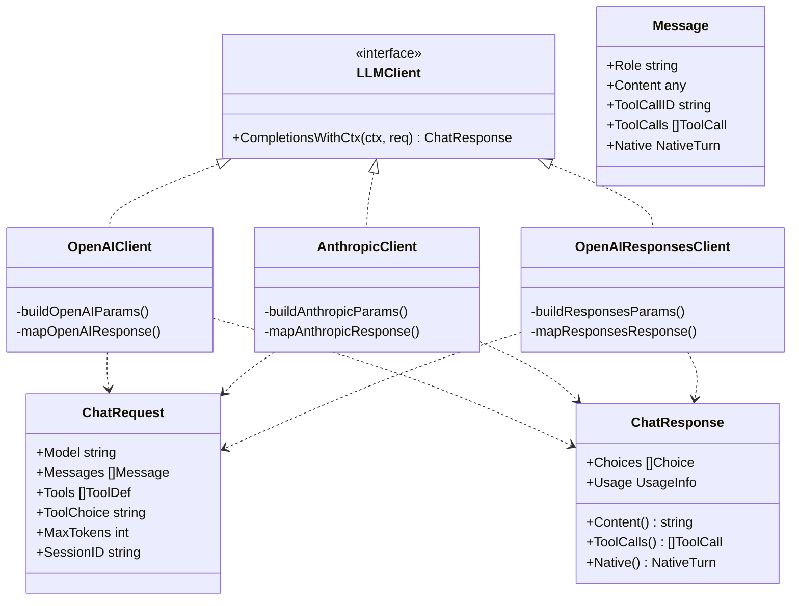
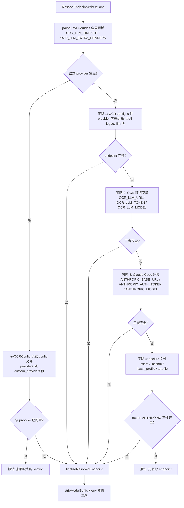
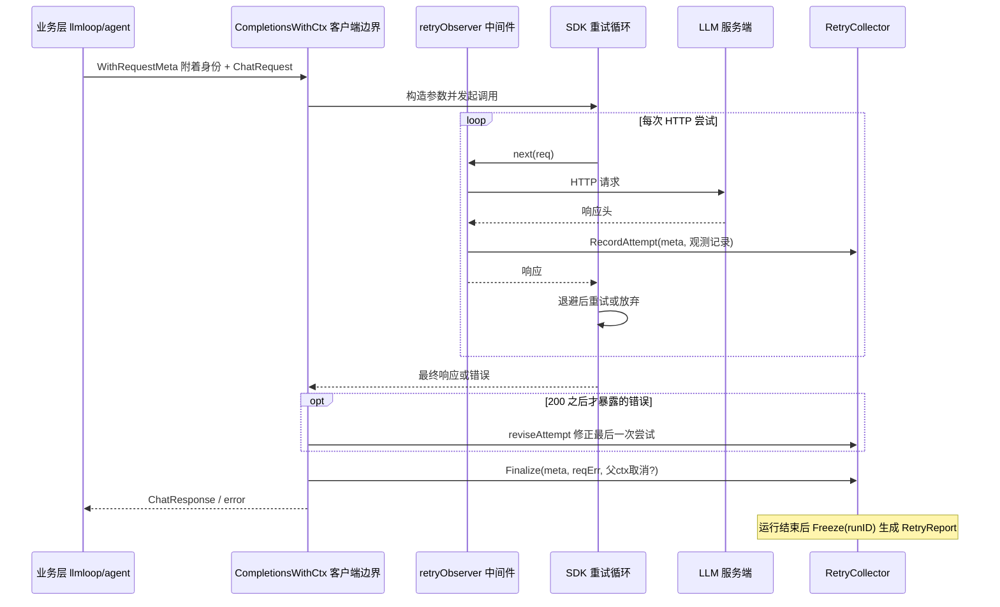
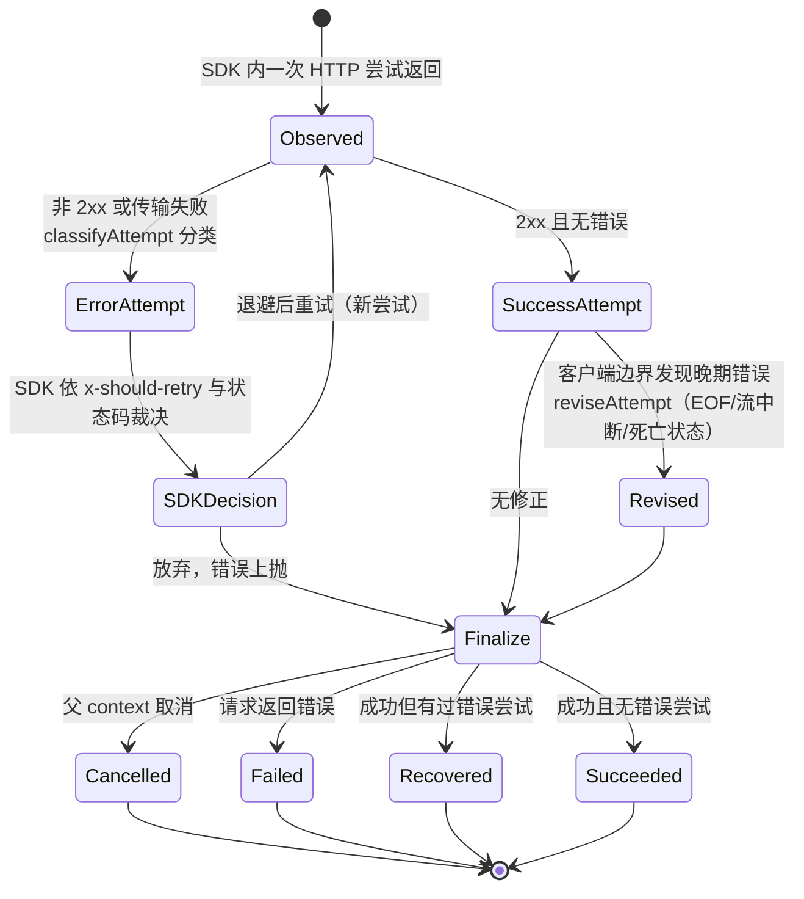

# LLM 提供商层

> **关联源码**：`internal/llm/`
> **前置阅读**：[00-overview.md](00-overview.md)、[04-config-rules.md](04-config-rules.md)

## 目录

- [1. 模块职责与定位](#1-模块职责与定位)
- [2. Provider 抽象与注册表](#2-provider-抽象与注册表)
- [3. 统一协议层](#3-统一协议层)
- [4. 客户端实现](#4-客户端实现)
- [5. Provider 解析链](#5-provider-解析链)
- [6. 密钥管理](#6-密钥管理)
- [7. 重试体系四件套](#7-重试体系四件套)
- [8. Token 计量](#8-token-计量)
- [9. raw.go 原始调试模式](#9-rawgo-原始调试模式)
- [10. Bedrock 特殊路径](#10-bedrock-特殊路径)
- [11. 源文件覆盖清单](#11-源文件覆盖清单)

---

## 1. 模块职责与定位

`internal/llm` 是整个工具的 LLM 接入层。包注释（[client.go](../../internal/llm/client.go#L4-L10)）开门见山：本包提供支持多种协议的 LLM 客户端，规范协议名共四种——`anthropic`（Anthropic Messages API）、`anthropic-bedrock`（同一 API 由 AWS Bedrock 提供、SigV4 签名）、`openai`（OpenAI Chat Completions API）、`openai-responses`（OpenAI Responses API）。

它向下游暴露的唯一接口是 `LLMClient`（[client.go](../../internal/llm/client.go#L89-L92)）：

```go
type LLMClient interface {
	CompletionsWithCtx(ctx context.Context, req ChatRequest) (*ChatResponse, error)
}
```

一个方法，进出都是本包自定义的统一数据模型。所有上层消费者只认识这个接口：

| 消费者 | 位置 | 用途 |
|---|---|---|
| Agent 执行循环 | [internal/agent/agent.go](../../internal/agent/agent.go#L82) | 每文件的工具调用主循环（见 [06-agent-loop.md](06-agent-loop.md)） |
| LLM 子循环 | [internal/llmloop/loop.go](../../internal/llmloop/loop.go#L30) | main_task / 压缩等会话化请求（见 [06-agent-loop.md](06-agent-loop.md)） |
| Diff 重定位 | [internal/diff/relocation.go](../../internal/diff/relocation.go#L53) | 行号重定位（见 [03-diff-engine.md](03-diff-engine.md)） |
| Scan 流水线 | [internal/scan/agent.go](../../internal/scan/agent.go#L49) | 扫描任务的 LLM 调用（见 [09-scan-pipeline.md](09-scan-pipeline.md)） |

本包内部可以清晰地切成两半：

1. **"跟谁说话"**——[resolver.go](../../internal/llm/resolver.go) 负责把 config 文件、环境变量、shell rc 等来源解析成一个 `ResolvedEndpoint`（URL、Token、Model、Protocol 等）。
2. **"怎么说话"**——[client.go](../../internal/llm/client.go) 与 [responses_client.go](../../internal/llm/responses_client.go) 按协议把统一的 `ChatRequest` 翻译成各家 SDK 的 wire 格式，把响应映射回统一的 `ChatResponse`。

它解决的核心问题是**多 provider 协议差异的屏蔽**：上层代码（review/scan/delegate）不需要知道当前接的是 Anthropic 直连、Bedrock、OpenAI 还是二十余家 OpenAI 兼容网关中的哪一家；协议细节（认证头、system 消息的位置、tool call 与 tool result 的表示、reasoning 回放）全部收口在适配层内。围绕这两半，还有四组配套设施：密钥管理（keycmd/sessionkey）、重试观测四件套（retry_*）、token 计量（embedded_loader/usage_resolver）与原始报文捕获（raw.go）。

客户端的创建入口是工厂函数 `NewLLMClient(ep, collector, raw)`（[client.go](../../internal/llm/client.go#L429-L454)）。生产路径上，它由 `loadLLMRuntime` 调用（[cmd/opencodereview/shared.go](../../cmd/opencodereview/shared.go#L218-L271)）：解析 endpoint、创建每 run 的 `RetryCollector`、按需创建 `RawHolder`，一起组装进 `llmRuntime`。`ocr llm test` 则显式传 `nil, nil`（[llm_cmd.go](../../cmd/opencodereview/llm_cmd.go#L84-L86)）——连通性探测不产生重试报告。

---

## 2. Provider 抽象与注册表

### 2.1 Provider 结构体

[providers.go](../../internal/llm/providers.go#L21-L36) 定义预设 provider 的元数据：

```go
type Provider struct {
	Name        string   // 注册名（大小写不敏感查找）
	DisplayName string   // 展示名
	Protocol    string   // 规范协议名（protocol.go 的四个常量之一）
	BaseURL     string   // 默认 endpoint，可被 config 中 entry.URL 覆盖
	AuthHeader  string   // 仅 Anthropic 协议有意义；OpenAI 兼容 provider 留空
	EnvVar      string   // API key 的环境变量兜底名
	Models      []string // 模型选择器的种子列表
	AmbientAuth bool     // 凭证来自环境自身的链（如 AWS SigV4），无 api_key
}
```

`AmbientAuth` 字段（[providers.go](../../internal/llm/providers.go#L30-L35)）目前只有 bedrock 为 true：resolver 对这类 provider 跳过 api_key 完整性要求，否则它将永远无法通过校验。

### 2.2 内置 provider 清单（28 个）

以下清单逐一核对自 `registry`（[providers.go](../../internal/llm/providers.go#L38-L484)），共 **28 个**内置 provider。按协议分组：

**Anthropic 协议（1 个）**

| Name | 默认 BaseURL | AuthHeader | 密钥环境变量 |
|---|---|---|---|
| `anthropic` | `https://api.anthropic.com` | `x-api-key` | `ANTHROPIC_API_KEY` |

**Anthropic Bedrock 协议（1 个，AmbientAuth）**

| Name | 默认 BaseURL | 密钥 |
|---|---|---|
| `bedrock` | 无（由 AWS region 推导 host） | 无 api_key，走 AWS 标准凭证链 |

**OpenAI Responses 协议（1 个）**

| Name | 默认 BaseURL | 密钥环境变量 |
|---|---|---|
| `openai-responses` | `https://api.openai.com/v1` | `OPENAI_RESPONSES_API_KEY` |

**OpenAI Chat Completions 协议（25 个）**

| Name | 默认 BaseURL | 密钥环境变量 |
|---|---|---|
| `openai` | `https://api.openai.com/v1` | `OPENAI_API_KEY` |
| `edenai` | `https://api.edenai.run/v3` | `EDENAI_API_KEY` |
| `gemini` | `https://generativelanguage.googleapis.com/v1beta/openai` | `GEMINI_API_KEY` |
| `dashscope` | `https://dashscope.aliyuncs.com/compatible-mode/v1` | `DASHSCOPE_API_KEY` |
| `dashscope-tokenplan` | `https://token-plan.cn-beijing.maas.aliyuncs.com/compatible-mode/v1` | `DASHSCOPE_TOKENPLAN_KEY` |
| `volcengine` | `https://ark.cn-beijing.volces.com/api/v3` | `ARK_API_KEY` |
| `deepseek` | `https://api.deepseek.com` | `DEEPSEEK_API_KEY` |
| `tencent-tokenhub` | `https://tokenhub.tencentmaas.com/v1` | `TENCENT_TOKENHUB_API_KEY` |
| `hy-tokenplan` | `https://api.lkeap.cloud.tencent.com/plan/v3` | `TENCENT_HUNYUAN_TOKENPLAN_KEY` |
| `iflytek` | `https://spark-api-open.xf-yun.com/v1` | `SPARK_API_KEY` |
| `kimi` | `https://api.moonshot.cn/v1` | `MOONSHOT_API_KEY` |
| `kimi-global` | `https://api.moonshot.ai/v1` | `MOONSHOT_GLOBAL_API_KEY` |
| `z-ai` | `https://open.bigmodel.cn/api/paas/v4` | `Z_AI_API_KEY` |
| `z-ai-coding` | `https://open.bigmodel.cn/api/coding/paas/v4` | `Z_AI_CODING_API_KEY` |
| `mimo` | `https://api.xiaomimimo.com/v1` | `MIMO_API_KEY` |
| `minimax` | `https://api.minimax.io/v1` | `MINIMAX_GLOBAL_API_KEY` |
| `minimax-cn` | `https://api.minimaxi.com/v1` | `MINIMAX_API_KEY` |
| `baidu-qianfan` | `https://qianfan.baidubce.com/v2` | `QIANFAN_API_KEY` |
| `ollama-cloud` | `https://ollama.com/v1` | `OLLAMA_API_KEY` |
| `novita` | `https://api.novita.ai/openai` | `NOVITA_API_KEY` |
| `xai` | `https://api.x.ai/v1` | `XAI_API_KEY` |
| `litellm` | `http://localhost:4000/v1` | `LITELLM_API_KEY` |
| `siliconflow` | `https://api.siliconflow.com/v1` | `SILICONFLOW_GLOBAL_API_KEY` |
| `siliconflow-cn` | `https://api.siliconflow.cn/v1` | `SILICONFLOW_API_KEY` |
| `mistral` | `https://api.mistral.ai/v1` | `MISTRAL_API_KEY` |

每个 provider 还带一个 `Models` 种子列表（如 `anthropic` 的 6 个 claude 模型、`bedrock` 的 8 个 us./global. 前缀模型、`ollama-cloud` 的 18 个模型）。注意两个注释里的定位说明：bedrock 的模型列表只是起点，账号与 region 不同可用模型不同（[providers.go](../../internal/llm/providers.go#L56-L67)）；mistral 的列表刻意精简以降低维护成本，用户可用 `ocr config set model` 指向任意模型（[providers.go](../../internal/llm/providers.go#L474-L478)）。`Models` 列表在 resolver 中还充当 `--model` 覆盖的白名单（见 [5.3 节](#53-config-文件路径provider-段--legacy-llm-块)）。

### 2.3 查询接口与防御性拷贝

- `LookupProvider(name)`（[providers.go](../../internal/llm/providers.go#L497-L503)）：小写化 + 去空白后查 `registryMap`（init 时构建，[providers.go](../../internal/llm/providers.go#L486-L493)）。
- `ListProviders()`（[providers.go](../../internal/llm/providers.go#L505-L516)）：按 Name 排序返回全部。
- 两者都经 `copyProvider`（[providers.go](../../internal/llm/providers.go#L518-L525)）深拷贝 `Models` 切片，防止调用方修改注册表数据。

用户侧入口：`ocr llm providers` 列出全部内置 provider（[llm_cmd.go](../../cmd/opencodereview/llm_cmd.go#L39-L46)）；`ocr config provider` 交互式配置（[config_cmd.go](../../cmd/opencodereview/config_cmd.go#L66-L73)），写出的就是 resolver 读取的 config.json provider 段。

### 2.4 自定义 provider（custom_providers）

自定义 provider **不在代码中注册**，而是 config.json 的 `custom_providers` 段里的任意键（[resolver.go](../../internal/llm/resolver.go#L337-L339)）。解析规则在 `tryProviderConfig`（[resolver.go](../../internal/llm/resolver.go#L446-L464)）：

- `protocol` 字段必填，且必须是四个规范名之一（[resolver.go](../../internal/llm/resolver.go#L452-L458)）；
- 除 bedrock 外的协议必须提供 `url`（bedrock 的 host 由 region 决定，存了也没人读，[resolver.go](../../internal/llm/resolver.go#L459-L461)）；
- 自定义 provider 没有 `EnvVar` 兜底——那是内置 preset 的特权（[resolver.go](../../internal/llm/resolver.go#L416-L425)）。

也就是说，registryMap 是"内置名 → 预设"的封闭集合；"用户定义名 → 配置"是 config 文件里的开放集合，两者在 `tryOCRConfig` 里按 `cfg.Provider` 是否命中 `LookupProvider` 分流到 `providers` 或 `custom_providers` 段（[resolver.go](../../internal/llm/resolver.go#L371-L387)）。

### 2.5 兼容性分级：以 Protocol 为准

`Provider` 结构体中**没有** `compatible` / `tier` 之类的分级字段。事实上的分级就是 `Protocol` 字段的四值分布（28 个 = 1 anthropic + 1 bedrock + 1 responses + 25 openai chat completions），唯一的附加信号是 `AuthHeader`（注释明确"Anthropic-only; empty for OpenAI-compatible"，[providers.go](../../internal/llm/providers.go#L26)）与 `AmbientAuth`。文档若宣称存在更细的兼容性等级，需与维护者确认。

---

## 3. 统一协议层

### 3.1 协议名规范（protocol.go）

[protocol.go](../../internal/llm/protocol.go#L19-L38) 只做一件事：定义四个规范协议常量及它们的归一化/校验。命名约定是 `<vendor>-<flavor>`；新增协议需要三处同步：加常量、扩 `ValidateProtocol` 白名单、给 `NewLLMClient` 加 case（注释见 [protocol.go](../../internal/llm/protocol.go#L16-L18)）。

- `NormalizeProtocol`（[protocol.go](../../internal/llm/protocol.go#L45-L61)）：大小写不敏感、去空白；已知名映射到规范常量；**未知值原样（小写化）返回**——这样 `ValidateProtocol` 能报出精确的错误信息而不是吞掉拼写错误。
- `ValidateProtocol`（[protocol.go](../../internal/llm/protocol.go#L65-L72)）：白名单校验，只接受四个规范名。

值得注意的是 `anthropic-bedrock` 的设计（[protocol.go](../../internal/llm/protocol.go#L30-L37)）：请求体与 `anthropic` 完全相同，差异全在传输层（SigV4 签名、model 从 body 移入 URL path、region 决定 host），因此它复用 Anthropic 客户端而不另起炉灶。

### 3.2 统一数据模型（client.go 共享类型）

统一消息模型定义在 client.go 的 "Shared data types" 区（[client.go](../../internal/llm/client.go#L94-L344)）：

- **`Message`**（[client.go](../../internal/llm/client.go#L100-L116)）：`Role`（system/user/assistant/tool）+ `Content`（`any`：纯字符串，或 Claude 风格的 `[]ContentBlock`）+ `ToolCallID`（OpenAI 格式的 tool result 关联）+ `ToolCalls`（assistant 的工具调用）+ `Native`（不透明回放状态）+ `ReasoningContent`（仅供展示的推理文本投影）。
- **`ContentBlock`**（[client.go](../../internal/llm/client.go#L183-L188)）：`type` 为 `"text"` 或 `"tool_result"`，后者可嵌套文本块——这是 Anthropic 多段内容的统一表示。
- **`ToolCall` / `FunctionCall`**（[client.go](../../internal/llm/client.go#L251-L261)）：OpenAI 风格的 `{id, type, function:{name, arguments}}`，其中 `Arguments` 是 JSON 编码字符串。
- **`ChatRequest`**（[client.go](../../internal/llm/client.go#L575-L583)）与 **`ChatResponse`**（[client.go](../../internal/llm/client.go#L274-L330)）：请求/响应的统一外壳。`ChatResponse` 上只有访问器（`Content()`、`VisibleContent()`、`ToolCalls()`、`ReasoningContent()`、`Native()`），全部字段 `json:"-"`，由 internal/session 显式持久化需要的部分。
- **`ToolDef` / `FunctionDef`**（[client.go](../../internal/llm/client.go#L332-L344)）：工具定义，`RawDefinition` 允许透传未建模的 JSON schema 字段。

构造函数（[client.go](../../internal/llm/client.go#L191-L214)）：`NewTextMessage`（纯文本）、`NewToolCallMessage`（assistant 历史，保留 native 与 reasoning）、`NewToolResultMessage`（`role=tool` + `tool_call_id` + 字符串内容，即 OpenAI Chat Completions 格式）。`ExtractText`（[client.go](../../internal/llm/client.go#L216-L242)）能同时处理字符串与 `[]ContentBlock` 两种 Content。

### 3.3 双 wire 格式适配：tool call / tool result

统一模型以 OpenAI 格式为基准（`role=tool` + `tool_call_id`），Anthropic 侧的翻译发生在 `buildAnthropicParams`（[client.go](../../internal/llm/client.go#L1304-L1387)）：

- **tool result（tool → user + tool_result 块）**：连续的 `role=tool` 消息被收集进 `pendingToolResults`，在下一条非 tool 消息前统一 flush 成**一条 user 消息**，内含若干 `NewToolResultBlock(toolCallID, content, false)`（[client.go](../../internal/llm/client.go#L1309-L1323)）。这符合 Anthropic API "tool_result 必须在 user turn 里"的约束。
- **tool call（assistant → tool_use 块）**：`msg.ToolCalls` 逐个转成 `NewToolUseBlock(tc.ID, argsMap, tc.Function.Name)`；注意 arguments 在统一模型里是 JSON 字符串，这里要 `json.Unmarshal` 回 map——**null 参数会被规整成空 map**，因为 Anthropic 拒绝 `input: null`（[client.go](../../internal/llm/client.go#L1348-L1360)，对应 issue #382）。
- **system**：统一模型里 system 是消息列表的一员；Anthropic 侧抽出来放进顶层 `params.System`（[client.go](../../internal/llm/client.go#L1327-L1331)）；Responses API 侧则拼接为顶层 `Instructions`（多个 system 消息以 `\n\n` 连接，[responses_client.go](../../internal/llm/responses_client.go#L184-L187)）。

OpenAI 侧翻译在 `buildOpenAIParams`（[client.go](../../internal/llm/client.go#L769-L806)）：system/user/tool 三种角色直接映射（tool → `openai.ToolMessage(content, toolCallID)`）；assistant 带 `ToolCalls` 时构造 `OfAssistant` 消息。Responses API 侧在 `buildResponsesParams`（[responses_client.go](../../internal/llm/responses_client.go#L181-L207)）：assistant 的每个 ToolCall 拆成独立的 `function_call` item（以 `tc.ID` 为 `CallID`），`role=tool` 消息变成 `function_call_output` item。

**图 5-4** 统一模型与三种 wire 格式的适配关系：



### 3.4 NativeTurn：reasoning 回放状态

`NativeTurn`（[client.go](../../internal/llm/client.go#L118-L128)）是本包最精巧的设计之一：一个**不透明的**每 assistant turn 回放状态。`Family` 仅为可观测性标注（`anthropic-messages` / `openai-chat-completions` / `openai-responses`）；安全性来自 `Payload` 的 Go 类型断言——只有产生它的适配器能复用它：

- Anthropic：`anthropic.MessageParam`（含 thinking 块与签名），仅在响应含 thinking/redacted_thinking 时设置（[client.go](../../internal/llm/client.go#L1528-L1531)）；回放时整体复用（[client.go](../../internal/llm/client.go#L1339-L1343)）。
- OpenAI chat completions：`ReasoningPayload`（命名字符串类型，防止误断言）承载网关扩展的 `reasoning_content`（[client.go](../../internal/llm/client.go#L876-L887)）；回放时经 `SetExtraFields` 写回（[client.go](../../internal/llm/client.go#L798-L801)）。
- Responses API：`[]responses.ResponseInputItemUnionParam`（reasoning item 含 `encrypted_content`），且设了 `hasActionableItem` 门控——只有 reasoning 而无 message/function_call 的输出不能独立回放，否则重放会 400（[responses_client.go](../../internal/llm/responses_client.go#L270-L315)）。

这套机制的动机是 issue #805：某些 provider（DeepSeek R1 类）要求后续请求逐字节带回 reasoning。`native_turn_test.go` 用确定性用例锁死了这条链路：`TestOpenAIChatCompletions_ReplaysReasoningContentAcrossTurns` 断言 reasoning_content 经 map → NewToolCallMessage → buildParams 全链路字节不丢（[native_turn_test.go](../../internal/llm/native_turn_test.go#L40-L73)）。`EstimatedTokens`（[client.go](../../internal/llm/client.go#L137-L168)）按 marshaled 字节数/4 粗估 native 部分未被 `ExtractText()` 覆盖的 token 量。

### 3.5 流式响应：收敛而非抽象

本包**没有对外暴露流式接口**：`ChatResponse` 永远是完整结果。流式只在 OpenAI Chat Completions 客户端内部使用，触发条件是 provider config 的 `extra_body.stream=true`（[client.go](../../internal/llm/client.go#L631-L633)）；Anthropic 与 Responses 客户端是非流式的，且都**主动丢弃** `stream` 键——转发它会让 API 以 SSE 应答而让单 JSON body 的解码路径全挂（[client.go](../../internal/llm/client.go#L1271-L1277)、[responses_client.go](../../internal/llm/responses_client.go#L121-L129)，对应测试 `TestOpenAIClient_NonStreamingRequestDropsStreamField`、`TestAnthropicClient_ExtraBodyStreamDropped`，[client_test.go](../../internal/llm/client_test.go#L859)、[client_test.go](../../internal/llm/client_test.go#L1286)）。

---

## 4. 客户端实现

### 4.1 工厂 NewLLMClient

[client.go](../../internal/llm/client.go#L429-L454) 按 `ep.Protocol` 分发：`anthropic` → `NewAnthropicClient`；`anthropic-bedrock` → `NewAnthropicBedrockClient`；`openai-responses` → `NewOpenAIResponsesClient`；**其余一切（含未知名）防御性落到 `NewOpenAIClient`**，保持对绕过 resolver 归一化的老调用方的兼容（[client.go](../../internal/llm/client.go#L420-L428)）。`collector` 与 `raw` 是"属于本次 run 而非 endpoint"的句柄，所以作为参数传入而不是 `ResolvedEndpoint` 的字段。

三个客户端共享的基础设施：

- **超时**：`cfg.Timeout <= 0` 时默认 5 分钟（如 [client.go](../../internal/llm/client.go#L534-L536)）。`httpClientWithHeaderTimeout`（[client.go](../../internal/llm/client.go#L56-L75)）用"请求超时 + 30s 余量"覆盖 SDK 硬编码的 10 分钟 `ResponseHeaderTimeout`，保证 `timeout_sec` 在慢 endpoint 上真正生效（issue #1161，[client.go](../../internal/llm/client.go#L46-L60)）；余量确保先触发的是请求级 context deadline 而非 header 超时，避免把本该 `ctx.Err()` 的失败变成可重试的传输错误。Bedrock 构造器**不装**这个 client，原因见 [10 节](#10-bedrock-特殊路径)。
- **SDK 重试**：三家都设 `WithMaxRetries(5)`（[client.go](../../internal/llm/client.go#L550)、[client.go](../../internal/llm/client.go#L960)、[responses_client.go](../../internal/llm/responses_client.go#L48)）。默认被 SDK 重试的状态码是 408/409/429 与 5xx（证据：`sanitizeRetryCodes` 的错误文案"SDK already retries it"，[resolver.go](../../internal/llm/resolver.go#L932-L947)）。
- **中间件顺序**：`retryCodesMiddleware`（注入 `x-should-retry`，见 [7.5 节](#75-判定逻辑综述谁决定重试谁负责记录)）→ raw 捕获 → retry observer。raw 必须先于 observer 注册，因为 SDK 的包装是"后注册者在最内层"，raw 的全量 body 读取与落盘否则会虚增 observer 记录的 `DurationToHeadersMS`（[client.go](../../internal/llm/client.go#L558-L566)）。
- **User-Agent**：`open-code-review/<version>`，Anthropic 客户端再附 ` | claude`（[client.go](../../internal/llm/client.go#L81-L87)）。

### 4.2 OpenAIClient：Chat Completions 路径

**构造**（[client.go](../../internal/llm/client.go#L533-L572)）：URL 归一化为以 `/chat/completions` 结尾，再剥掉后缀得到 SDK base URL（SDK 自己会拼回）。`SessionKey` 为空时自动生成（见 [6.3 节](#63-sessionkey提示缓存亲和键)）。契约由 `TestNewOpenAIClient_URLNormalization` 锁定（[client_test.go](../../internal/llm/client_test.go#L22)）。

**请求主路径 `CompletionsWithCtx`**（[client.go](../../internal/llm/client.go#L591-L670)）：

1. `defer finalizeRequest(...)`——这是重试报告的**客户端边界**（详见 [7.3 节](#73-retry_boundarygo客户端边界修正)），panic 也会先 finalize 再原样重抛（[client.go](../../internal/llm/client.go#L592-L601)）。
2. `buildOpenAIParams` 完成消息/工具翻译（[4.2 节](#42-openaiclientchat-completions-路径)上文已述）。
3. 逐请求展开 `ExtraHeaders` / `ExtraBody`（session key 模板替换）；**跳过 `stream` 键**（交给下面的专用布尔判断与 SDK 的流式方法，[client.go](../../internal/llm/client.go#L619-L630)）。
4. `extra_body.stream=true` → 走流式包装（下文）；否则调 `Chat.Completions.New`。
5. **EOF 一次性恢复**：`io.ErrUnexpectedEOF`（截断响应，HTTP 200 下发生）时先 `reviseAttempt` 把该次尝试修正为 network/response_decode，再重发一次 SDK 调用；第二次仍 EOF 则修正后放弃。两处修正都放在 ctx 提前返回**之前**，防止"父 context 恰好取消时，截断尝试被记成成功"（[client.go](../../internal/llm/client.go#L635-L664)）。测试：`TestOpenAIClient_RetriesTruncatedResponse`、`TestOpenAIClient_StopsAfterSecondTruncatedResponse`、`TestOpenAIClient_DoesNotRetryTruncatedResponseAfterCancellation`（[client_test.go](../../internal/llm/client_test.go#L601)、[client_test.go](../../internal/llm/client_test.go#L642)、[client_test.go](../../internal/llm/client_test.go#L712)）。

**流式路径**（[client.go](../../internal/llm/client.go#L684-L766)）：`completionsStreaming` 是唯一包装层——inner 失败时 `classifyStreamError` + `reviseAttempt` 修正（observer 只看到了开流的 HTTP 200，看不到流中断）；它**不能**再 defer finalize，因为外层 `CompletionsWithCtx` 直接 return 它的结果，其 defer 已经覆盖（[client.go](../../internal/llm/client.go#L672-L683)）。SSE 解析由 SDK 的 `NewStreaming` 完成，客户端侧做四件事：

- 用 `openai.ChatCompletionAccumulator` 聚合 chunk；`AddChunk` 失败（不一致 chunk）抛 `streamIntegrityError`（[client.go](../../internal/llm/client.go#L736-L739)）。
- 从 `choice.Delta.JSON.ExtraFields["reasoning_content"]` 累积各 choice 的推理文本，回填进 `ReasoningContent` 与 `Native`（[client.go](../../internal/llm/client.go#L720-L735)、[client.go](../../internal/llm/client.go#L756-L763)）。
- 从携带 usage 的 chunk 原始 JSON 提取用量（[client.go](../../internal/llm/client.go#L706-L710)）。
- 流完整性校验：无任何 choice、或某 choice 未收到 `finish_reason` 即结束，都算失败（[client.go](../../internal/llm/client.go#L743-L750)）。测试覆盖：`TestOpenAIClient_StreamingToolCall` / `StreamingUsage` / `StreamingReasoningContent` / `StreamingIncomplete` / `StreamingNoChoices` / `StreamingInconsistentChunks` / `StreamingError` / `StreamingCancellation`（[client_test.go](../../internal/llm/client_test.go#L917) 起）。

**响应映射 `mapOpenAIResponse`**（[client.go](../../internal/llm/client.go#L841-L907)）：usage 优先从原始 JSON 走 `resolveUsage`（兼容网关变体，见 [8.2 节](#82-usage_resolvergo-用量字段归一化)），SDK 结构体字段兜底；`reasoning_content` 只看 ExtraFields 的存在性（`Valid()` 对 extra 恒为 false，[client.go](../../internal/llm/client.go#L876-L882)）。

### 4.3 AnthropicClient：Messages 路径

**构造**（[client.go](../../internal/llm/client.go#L937-L998)）：URL 归一化补 `/v1/messages`；`AuthHeader` 归一化后默认 `authorization`，三种分支分别用 `WithAuthToken`（Bearer）、`WithAPIKey`（x-api-key）或自定义头（同时删掉两个标准头防泄漏，[client.go](../../internal/llm/client.go#L970-L981)）。Anthropic 的 prompt cache 由服务端管理，所以不像 OpenAI 那样注入 session key body 字段，但 key 仍可经 `ExtraHeaders`/`ExtraBody` 模板展开（[client.go](../../internal/llm/client.go#L932-L936)）。

**请求路径**（[client.go](../../internal/llm/client.go#L1238-L1301)）：`initErr` 非空时直接返回（Bedrock 构造失败延迟到首次请求，见 [10 节](#10-bedrock-特殊路径)）；参数构建失败发生在任何 HTTP 尝试之前，因此 Finalize 找不到条目、该请求自然不进报告（[client.go](../../internal/llm/client.go#L1234-L1237)）。`ExtraBody` 中 `thinking` 键的两条丢弃规则：强制 `tool_choice=required` 时丢弃；`budget_tokens >= max_tokens`（默认 max_tokens 为 8192，[client.go](../../internal/llm/client.go#L77-L79)）时丢弃（[client.go](../../internal/llm/client.go#L1280-L1291)；测试 [client_test.go](../../internal/llm/client_test.go#L1344)、[client_test.go](../../internal/llm/client_test.go#L1405)）。错误经 `explainError` 翻译（仅 Bedrock 生效，[client.go](../../internal/llm/client.go#L1296-L1298)）。

**`buildAnthropicParams`**（[client.go](../../internal/llm/client.go#L1304-L1446)）在 3.3 节的双 wire 翻译之外，还做了三层 **prompt cache 布点**：

1. system 块的最后一个加 `CacheControlEphemeral`（[client.go](../../internal/llm/client.go#L1412-L1415)）；
2. tools 列表的最后一个加（[client.go](../../internal/llm/client.go#L1416-L1419)）；
3. **动态断点**：最后一条消息的最后一个内容块加——多轮历史增量缓存的"读全前缀、只写增量"模式（[client.go](../../internal/llm/client.go#L1425-L1440)）。修改前必须经 `cloneContentBlockParam` 深拷贝，因为块可能与存储的历史共享（[client.go](../../internal/llm/client.go#L1448-L1459)）。测试：`TestBuildAnthropicParams_CacheControl*`、`TestBuildAnthropicParams_DynamicCacheBreakpoint`（[client_test.go](../../internal/llm/client_test.go#L108) 起）。

**响应映射 `mapAnthropicResponse`**（[client.go](../../internal/llm/client.go#L1486-L1567)）：text 块拼接为主内容；thinking/redacted_thinking 块聚合为 `ReasoningContent`，且**仅当出现 thinking 时**才设置 `Native`（普通 turn 靠 Content/ToolCalls 往返，Anthropic 拒绝空内容块，[client.go](../../internal/llm/client.go#L1526-L1531)）；tool_use 块转 `ToolCall`（`Input` 原样字符串化）。usage 把 `InputTokens + CacheReadInputTokens + CacheCreationInputTokens` 合计为 `PromptTokens` 并单列缓存读写（[client.go](../../internal/llm/client.go#L1538-L1547)）。

### 4.4 OpenAIResponsesClient：Responses API 路径

**为什么单独实现**：Responses API 的消息原语不是 message 而是 **item**（`function_call` / `function_call_output` / `reasoning` / `message`），system 是顶层 `Instructions`，推理回放依赖 `encrypted_content`——与 chat completions 的差异是结构性的，硬塞进同一个客户端只会让两边都变脏。`ensureResponsesEndpoint`（[responses_client.go](../../internal/llm/responses_client.go#L81-L87)）的 URL 契约与 OpenAI 客户端同构（`/v1 → /v1/responses` 等）。

**关键语义**（[responses_client.go](../../internal/llm/responses_client.go#L162-L253)）：

- **无状态**：每个请求携带完整 input 历史，不用 `previous_response_id`；`store=false`（隐私：服务端不留存）；`Include: ReasoningEncryptedContent` 让推理可回放（[responses_client.go](../../internal/llm/responses_client.go#L171-L175)、[responses_client.go](../../internal/llm/responses_client.go#L222-L229)）。
- **PromptCacheKey**：来自 `req.SessionID`——调用方为每个文件会话生成随机 UUID，让同一文件的 agent loop 全部 turn 落在同一缓存桶（[responses_client.go](../../internal/llm/responses_client.go#L173-L176)、[responses_client.go](../../internal/llm/responses_client.go#L234-L236)）。
- **HTTP 200 不等于成功**：Responses API 对 failed/cancelled（终态失败）和 queued/in_progress（后台模式）都返回 200 且 SDK 无 Go error。客户端显式把这些状态翻成 error，让按 `err != nil` 分支的调用方真正失败（[responses_client.go](../../internal/llm/responses_client.go#L137-L157)），同时 `reviseAttempt` 修正 observer 看到的"200 成功"假象。
- **FinishReason 粗粒度映射**（[responses_client.go](../../internal/llm/responses_client.go#L352-L371)）：有 tool calls 一律 `tool_calls`（模型在工具循环中间，无论 API 状态）；`incomplete → length`；`failed/cancelled → error`；默认 `stop`。
- 回放与用量归一化见 3.4 与 8.2 节；`OutputText()` 聚合全部 `output_text`（[responses_client.go](../../internal/llm/responses_client.go#L255-L265)）。

### 4.5 三客户端差异对照

| 维度 | OpenAIClient | AnthropicClient | OpenAIResponsesClient |
|---|---|---|---|
| SDK | openai-go v3 | anthropic-sdk-go | openai-go v3 |
| system 位置 | messages 内 | 顶层 `System` 块 | 顶层 `Instructions` |
| tool result | `role=tool` 消息 | user 消息内 tool_result 块 | `function_call_output` item |
| reasoning 回放 | `reasoning_content` extra field | `MessageParam`（thinking+签名） | reasoning item（encrypted_content） |
| 流式 | 支持（extra_body.stream） | 否（丢弃 stream 键） | 否（丢弃 stream 键） |
| prompt cache | 客户端注入（见 6.3） | 服务端管理 + cache_control 布点 | `PromptCacheKey` = SessionID |
| 默认 max tokens | 不设 | 8192 | 不设 |
| 认证 | Bearer（SDK 默认） | x-api-key / authorization / 自定义 | Bearer |

---

## 5. Provider 解析链

### 5.1 ResolvedEndpoint

解析的产出是 `ResolvedEndpoint`（[resolver.go](../../internal/llm/resolver.go#L18-L47)）：URL、Token、Model、Provider、Protocol（规范名）、AuthHeader、Source（人类可读的来源标签）、ExtraBody/ExtraHeaders、Timeout（0 = 客户端默认 5 分钟；仅 config 文件与 `OCR_LLM_TIMEOUT` 能设置，[resolver.go](../../internal/llm/resolver.go#L29-L33)）、RetryCodes、AmbientAuth、AWSProfile/AWSRegion。

### 5.2 解析顺序与决策树

`ResolveEndpointWithOptions`（[resolver.go](../../internal/llm/resolver.go#L96-L150)）的精确逻辑：

1. **全局 env 覆盖先行解析**（`parseEnvOverrides`，[resolver.go](../../internal/llm/resolver.go#L100-L109)）：`OCR_LLM_TIMEOUT` 与 `OCR_LLM_EXTRA_HEADERS` 在任何策略运行前解析。时序是刻意的——若放在 finalize 里，一个拼错的值会在 `api_key_cmd` 已经弹过 1Password/pinentry/Touch ID 之后才让解析失败，凭据白白作废。
2. **显式 provider 覆盖**（`--provider` / `ResolveOptions.Provider`）：只查 config 文件的 provider/custom_providers 段，不做任何回退；config 文件不存在则直接报错指明缺哪个 section（[resolver.go](../../internal/llm/resolver.go#L111-L124)）。
3. **策略链依次尝试**：config 文件 → OCR 环境变量 → Claude Code 环境变量 → shell rc（[resolver.go](../../internal/llm/resolver.go#L126-L134)）。每个策略的产出要过**完整性判定**：`Model != ""` 且（`AmbientAuth` 或（URL 与 Token 均非空））（[resolver.go](../../internal/llm/resolver.go#L141-L143)）——不完整就试下一个。
4. 全部落空时报错并列出三条出路（[resolver.go](../../internal/llm/resolver.go#L149)）。

**图 5-1** provider 解析决策树：



优先级由测试锁定：`TestResolveEndpoint_ConfigPrecedesOCREnvironment` / `ConfigPrecedesClaudeCodeEnvironment` / `IncompleteConfigFallsBackToOCREnvironment` / `ConfigPrecedesInvalidCompleteEnvironment`（[resolver_test.go](../../internal/llm/resolver_test.go#L297)、[resolver_test.go](../../internal/llm/resolver_test.go#L314)、[resolver_test.go](../../internal/llm/resolver_test.go#L332)、[resolver_test.go](../../internal/llm/resolver_test.go#L349)）。注意优先级语义：**config 文件存在且完整时赢**；不完整时向后回退，而不是字段级合并。`--model` 覆盖可补全缺失 model 的环境变量策略（`TestResolveEndpointWithOptions_ModelOverrideCompletesOCREnvironment`，[resolver_test.go](../../internal/llm/resolver_test.go#L367)），且覆盖值优先于环境变量模型（[resolver_test.go](../../internal/llm/resolver_test.go#L381)）。

### 5.3 config 文件路径（provider 段 / legacy llm 块）

`tryOCRConfig`（[resolver.go](../../internal/llm/resolver.go#L343-L368)）：无 `provider` 字段则走 legacy `llm` 块。显式 provider 覆盖时，若与文件中的 provider 不同则清空顶层 model（防止不同 provider 复用不兼容的模型名，[resolver.go](../../internal/llm/resolver.go#L357-L362)）。

**provider 段解析 `tryProviderConfig`**（[resolver.go](../../internal/llm/resolver.go#L371-L593)）是整个 resolver 最厚的函数，要点：

- **凭证优先级**（[resolver.go](../../internal/llm/resolver.go#L409-L425)）：静态 `api_key` > `api_key_cmd`（两者并存时用静态值并打警告，命令保留作后备）> 预设 provider 的 `EnvVar` 环境变量（仅当 key 与 cmd 都未设置时才查，且自定义 provider 无此兜底）。**纯空白值一律视为未设置**——`api_key: "  "` 不会遮蔽能用的 `api_key_cmd`（[resolver.go](../../internal/llm/resolver.go#L396-L408)）。
- **URL/协议**：preset 的 `BaseURL` 与 `Protocol` 可分别被 entry 的 `url` / `protocol` 覆盖；自定义 provider 的规则见 2.4 节。
- **AmbientAuth 跟随生效协议**（[resolver.go](../../internal/llm/resolver.go#L466-L474)）：判定放在协议覆盖**之后**——把 bedrock preset 改成 `openai` 协议的 entry 就得有 token；显式选 bedrock 协议的 entry 无论 preset 怎么说都按签名处理。
- **无凭证即错误**，且报错发生在 `api_key_cmd` 运行之前（[resolver.go](../../internal/llm/resolver.go#L477-L483)）。
- **模型三级**：顶层 `cfg.Model` < entry `model`（后者覆盖前者，[resolver.go](../../internal/llm/resolver.go#L485-L490)）< `--model` 覆盖。覆盖受**白名单门控**：preset Models + entry models 合并列表（[resolver.go](../../internal/llm/resolver.go#L492-L520)）；ambient-auth provider 豁免门控——Bedrock 的模型 ID 按账号和 region 划定，还可能是用于成本归因的 inference profile ARN，上游列表不可能穷举（[resolver.go](../../internal/llm/resolver.go#L499-L505)）。测试：`TestBedrockModelOverrideIsNotGatedByThePresetList`、`TestModelOverrideStillGatedForKeyBasedProviders`（[bedrock_test.go](../../internal/llm/bedrock_test.go#L304)、[bedrock_test.go](../../internal/llm/bedrock_test.go#L328)）。
- **`api_key_cmd` 尽可能晚执行**（[resolver.go](../../internal/llm/resolver.go#L563-L575)）：它前面的一切校验都可能失败，失败就不该弹 Touch ID；ambient-auth provider 完全跳过（签名请求用不到命令输出，弹了也是白弹）。
- Anthropic 协议的 URL 经 `ensureMessagesSuffix` 补 `/v1/messages`（[resolver.go](../../internal/llm/resolver.go#L914-L930)）。

**legacy llm 块 `tryLegacyLlmConfig`**（[resolver.go](../../internal/llm/resolver.go#L596-L695)）：`auth_token` > `auth_token_cmd`；块不完整（缺 url/model/双 token）直接落下一策略，且**不完整的块绝不运行 auth_token_cmd**；`protocol` 字段（归一化后）优先于 `use_anthropic` 布尔；`llm.protocol=anthropic-bedrock` 被拒绝（见 10 节）。

### 5.4 环境变量与 shell rc

- **`tryOCREnv`**（[resolver.go](../../internal/llm/resolver.go#L247-L295)）：`OCR_LLM_URL` / `OCR_LLM_TOKEN` / `OCR_LLM_MODEL` 三者必须齐全；协议由 `OCR_LLM_PROTOCOL`（归一化+校验，优先）或 `OCR_USE_ANTHROPIC`（默认 true；`false/0/no` 才切换到 openai）决定；anthropic 协议下 `OCR_LLM_AUTH_HEADER` 可指定认证头。环境变量名定义集中在 [resolver.go](../../internal/llm/resolver.go#L50-L74)。
- **`tryCCEnv`**（[resolver.go](../../internal/llm/resolver.go#L698-L713)）：读 Claude Code 惯例的 `ANTHROPIC_BASE_URL` / `ANTHROPIC_AUTH_TOKEN` / `ANTHROPIC_MODEL`，映射为 anthropic 协议 + `authorization` 头（OAuth/Bearer 风格凭证）。
- **`tryShellRC`**（[resolver.go](../../internal/llm/resolver.go#L716-L799)）：按 `.zshrc`、`.bashrc`、`.bash_profile`、`.profile` 的存在顺序逐个解析，正则 `exportRe`（[resolver.go](../../internal/llm/resolver.go#L747)）匹配 `export ANTHROPIC_XXX=...` 并支持双引号/单引号/裸值三种写法；同样映射为 anthropic + authorization。测试 `TestTryShellRC`（[resolver_shellrc_test.go](../../internal/llm/resolver_shellrc_test.go#L30)）。

### 5.5 全局覆盖与归一化

`finalizeResolvedEndpoint`（[resolver.go](../../internal/llm/resolver.go#L179-L197)）对胜出的策略统一做三件事：打 Source 标签（未设置时）、`stripModelSuffix`（剥掉形如 `claude-x[32m]` 的 thinking 后缀，[resolver.go](../../internal/llm/resolver.go#L749-L753)，测试 [resolver_test.go](../../internal/llm/resolver_test.go#L16)）、应用 env 覆盖（timeout 直接覆盖；headers 合并、env 优先）。`OCR_LLM_TIMEOUT` 是正整数秒，负数与溢出都报错（[resolver.go](../../internal/llm/resolver.go#L203-L234)）。

其他归一化行为：

- **`NormalizeAuthHeader`**（[resolver.go](../../internal/llm/resolver.go#L820-L835)）：`x-api-key` / `authorization` / `bearer`（归一为 authorization）三值，其余报错。测试 [resolver_norm_test.go](../../internal/llm/resolver_norm_test.go#L13)。
- **`ParseExtraHeaders`**（[resolver.go](../../internal/llm/resolver.go#L847-L912)）：逗号分隔 key=value，值可双引号包住以含逗号；保留头（authorization / x-api-key / content-type / user-agent，[resolver.go](../../internal/llm/resolver.go#L837-L845)）被拒绝——这些由专门字段或 SDK 管理，extra_headers 覆盖它们只会造成难以理解的失败。
- **`sanitizeRetryCodes` / `ParseRetryCodes`**（[resolver.go](../../internal/llm/resolver.go#L932-L980)）：自定义 retry codes 只接受 4xx；408/409/429 被过滤并警告（SDK 已默认重试）；5xx 一律报错（同样默认重试）。

---

## 6. 密钥管理

### 6.1 keycmd：从命令取 key

`resolveKeyCmd`（[keycmd.go](../../internal/llm/keycmd.go#L59-L133)）执行 shell 命令、取其 stdout 作为凭证。配置面有两个入口：provider 段的 `api_key_cmd` 与 legacy llm 块的 `auth_token_cmd`。安全与健壮性设计：

- **不落盘**：注释明确"resolved credential is used in memory only and is never written to config or logged"（[keycmd.go](../../internal/llm/keycmd.go#L57-L58)）。
- **交互可用**：子进程 stderr 接到进程 stderr（pinentry / 1Password 提示可见）、stdin 接到进程 stdin（提示可应答）；前提是 resolve 发生在 TUI 之外（[keycmd.go](../../internal/llm/keycmd.go#L60-L71)）。
- **有界**：60 秒超时（`keyCmdTimeout`，包变量便于测试收缩，[keycmd.go](../../internal/llm/keycmd.go#L17-L19)）；`WaitDelay` 5 秒——`exec.CommandContext` 只 SIGKILL shell，继承 stdout 管道的孙进程（gpg-agent、`op`）会让 Wait 卡死，WaitDelay 让 Wait 在 context 死后不久放弃（[keycmd.go](../../internal/llm/keycmd.go#L72-L81)）；输出上限 64 KiB——`cappedBuffer` 拒绝写入会让 os/exec 的 copier 关管道，失控命令死于 SIGPIPE 而非撑爆堆（[keycmd.go](../../internal/llm/keycmd.go#L26-L48)）。
- **输出严格校验**：先判超时（报成超时而非它引发的 SIGKILL 退出码）；再判溢出；多行输出拒绝（提示 `head -n1`）；内部 CR 拒绝；任何控制字节（0x00-0x1F 除 TAB、0x7F）拒绝并报偏移——这些字节会让 net/http 以难懂的 "invalid header field value" 拒绝凭证（[keycmd.go](../../internal/llm/keycmd.go#L104-L126)）。空输出拒绝。

### 6.2 平台差异

- **Unix**（[keycmd_unix.go](../../internal/llm/keycmd_unix.go#L32-L34)）：`sh -c <cmd>`。刻意**不用** `Setpgid`：进程组脱离终端前台组后，pinentry / ssh-askpass / `op` 一读 tty 就收 SIGTTIN 停住，提示功能直接废掉；代价是命令自己后台化的孙进程不被收割——这是"用户的命令自己要求的"，短命 CLI 反正会先退出（完整论证见 [keycmd_unix.go](../../internal/llm/keycmd_unix.go#L13-L31)）。
- **Windows**（[keycmd_windows.go](../../internal/llm/keycmd_windows.go#L38-L49)）：`cmd.exe /S /C "<cmd>"`，且命令行经 `SysProcAttr.CmdLine` 而非 Args 传递——os/exec 的 `EscapeArg` 按 `CommandLineToArgvW` 规则转义，而 cmd.exe 是文档化的例外，会把含双引号的命令（如 `op read "op://Private/My Vault/api-key"`）拆坏；`/S` 让 cmd.exe 只剥我们加的最外层引号、其余原样通过。不转义内层是**设计而非漏洞**：`api_key_cmd` 本来就是作者要求执行的命令行，且只从用户级 config.json 读取、绝不来自被审查仓库（[keycmd_windows.go](../../internal/llm/keycmd_windows.go#L26-L37)）。两平台的命令字符串不可移植（`%VAR%` vs `$VAR`）。

### 6.3 sessionkey：提示缓存亲和键

OpenAI 风格的 prompt cache 需要显式亲和键。本包用两层机制（[sessionkey.go](../../internal/llm/sessionkey.go)）：

- **模板变量 `{ocr_session_key}`**（[sessionkey.go](../../internal/llm/sessionkey.go#L21)）：用户在 `extra_headers` / `extra_body` 值里嵌入，客户端每请求展开（`expandSessionKeyInHeaders/Body`，递归替换嵌套 map/slice，[sessionkey.go](../../internal/llm/sessionkey.go#L108-L152)）——OCR 不必知道每家 provider 的惯例字段名。
- **`SessionTaskKey`**（[sessionkey.go](../../internal/llm/sessionkey.go#L65-L81)）：把亲和键作用域细化到"一个任务的会话"——`(session, taskType, scope)`。理由：prompt cache 按前缀匹配，而 plan / 主工具循环 / 压缩 / 去重等任务 prompt 互不相关，整个 run 共用一个 key 只会把并发会话钉到同一缓存节点且无共享前缀；热 key 本身也会被服务端重路由（OpenAI 约 15 req/min 起）。键格式受 OpenAI `prompt_cache_key` 64 字符上限约束：session UUID 取前 8 字符 + taskType 截到 38 字符 + scope 的 sha256 前 8 字节十六进制。
- **作用域与生命周期**：review/scan 在 Run 顶部绑 session 历史的 SessionID 为基键，各任务用 `SessionTaskKey` 精化（`ContextWithSessionKey`，[sessionkey.go](../../internal/llm/sessionkey.go#L42-L47)）；无会话的调用（`ocr llm test`）落到客户端构造时自动生成的 `NewSessionKey()`（UUIDv4，[sessionkey.go](../../internal/llm/sessionkey.go#L90-L103)；client 侧见 [client.go](../../internal/llm/client.go#L537-L539)）。`SessionKeyFromContext` 优先于配置的静态键（[client.go](../../internal/llm/client.go#L610-L613)）。Responses 客户端不走模板而是直接用 `ChatRequest.SessionID` 作 `PromptCacheKey`（[responses_client.go](../../internal/llm/responses_client.go#L234-L236)）。

### 6.4 泄漏防护

四道防线，各有测试佐证：

1. **raw 捕获的 header 脱敏**：`sensitiveHeader` 按子串匹配 `auth/token/key/secret/credential/cookie`，命中即写 `[REDACTED]`（[raw.go](../../internal/llm/raw.go#L142-L175)）——漏一个会泄密，误杀只是藏一个头，故偏向脱敏。
2. **extra_headers 不可覆盖保留头**（[resolver.go](../../internal/llm/resolver.go#L837-L845)），防止凭证头被意外改写。
3. **keycmd 输出校验**（6.1 节）：控制字节/多行拒绝，避免凭证以不可预期方式进入日志或头。
4. **运行时配置不带 token**：`RuntimeConfig` 只含协议、脱敏 endpoint host、语言与 timeout，显式注明 "never carries the token or full URL"（[cmd/opencodereview/shared.go](../../cmd/opencodereview/shared.go#L199-L204)）。

---

## 7. 重试体系四件套

这是本包设计密度最高的部分。四个文件各管一段：**meta 管"是谁"**，**observer 管"看见了什么"**，**boundary 管"事后才发现什么"**，**report 管"记下来什么、怎么收尾"**。前提概念是**逻辑请求（logical request）与 HTTP 尝试（attempt）的分离**：一次业务级调用（一个 main_task turn、一次重定位、一次压缩）在 SDK 重试循环内可能展开为多次真实 HTTP 尝试（[retry_meta.go](../../internal/llm/retry_meta.go#L20-L27)）。

**图 5-2** 请求 → 重试 → 上报的完整时序：



### 7.1 retry_meta.go：请求身份（retry identity）

- **`RequestMeta`**（[retry_meta.go](../../internal/llm/retry_meta.go#L40-L50)）：五元组 `Provider / Model / FilePath / TaskType / RequestNo`，刻意镜像 session.TaskRecord 的字段，让重试报告能与 session JSONL **join** 而不引入第二事实源。`RequestNo` 是从 1 起的序号，作用域为 `(FilePath, TaskType)`——正是这个作用域让元组在一个 run 内唯一。`run_id` 刻意缺席：它只在 `Freeze` 计算 `logical_request_id` 时才需要，collector 因此可以在 session 尚未创建前构造（客户端在 `loadLLMRuntime` 就建好了，远早于 `agent.New`，[retry_meta.go](../../internal/llm/retry_meta.go#L36-L39)）。
- **幂等身份**：`logicalRequestID`（[retry_meta.go](../../internal/llm/retry_meta.go#L91-L106)）对 `(版本前缀, runID, 各字段)` 逐字段 NUL 分隔后 sha256。字段全部 NUL 终止而非直接拼接——FilePath 等可含任意可打印字节，裸拼接会让不同 meta 碰撞；末字段也终止是为未来加字段时不引入碰撞。版本前缀 `ocr.llm-request/v1` 保证字段集变更后新旧 ID 永不冲突。`valid()`（[retry_meta.go](../../internal/llm/retry_meta.go#L57-L70)）拒绝含 NUL 的字段（否则可伪造他人的字节流）与非正序号。**与断点续跑的关系**：身份是纯函数式派生——同一 run 内同一 (file, task, request_no) 恒得同一 ID，报告与 session 记录因此可稳定对齐（详见 [10-session-persistence.md](10-session-persistence.md)）。
- **传递机制**：`WithRequestMeta` 把 meta 塞进 context（[retry_meta.go](../../internal/llm/retry_meta.go#L132-L137)）——因为 `LLMClient` 是单方法接口，不能改调用签名；无效 meta 不附着，请求走"无身份"路径（被 collector 丢弃），绝不引入新的失败模式。打点方是 internal/llmloop 与 internal/agent（注释明说，[retry_meta.go](../../internal/llm/retry_meta.go#L139-L147)；llmloop 侧有 retry_identity_test.go 佐证）。scan 与 `ocr llm test` 的请求**刻意不带**身份：探针不进重试报告。

### 7.2 retry_observer.go：尝试观测

`newRetryObserver`（[retry_observer.go](../../internal/llm/retry_observer.go#L30-L49)）是一个 SDK 中间件，三个客户端共用同一实现（两个 SDK 的 `option.Middleware` 是同型函数的**类型别名**，一个值同时满足两者，[retry_observer.go](../../internal/llm/retry_observer.go#L12-L16)）。它位于 SDK 重试循环**之内**：每次真实 HTTP 尝试跑一次；退避睡眠发生在它外围（不可见）；响应体在它返回后由 SDK 读取（不可见）——这两点决定了它能诚实报告什么（注释，[retry_observer.go](../../internal/llm/retry_observer.go#L18-L29)）。它**从不读取或关闭响应体**，否则会破坏 SDK 并把响应内容带去不该去的地方。

每次尝试产出一条 `AttemptRecord`（`observeAttempt`，[retry_observer.go](../../internal/llm/retry_observer.go#L57-L69)）：

- **观测字段**：状态码；provider 请求 ID（Anthropic 的 `request-id` 优先、OpenAI 的 `x-request-id` 兜底，[retry_observer.go](../../internal/llm/retry_observer.go#L74-L79)）；`Retry-After-Ms` / `Retry-After`（数值毫秒/秒优先，后者可 RFC1123 日期，语义对齐 SDK 的解析优先级，[retry_observer.go](../../internal/llm/retry_observer.go#L109-L131)）；`x-should-retry` 指令（只记 true/false 两个 SDK 会执行的值，[retry_observer.go](../../internal/llm/retry_observer.go#L85-L95)）。
- **分类时机**：仅当状态非 2xx 或传输失败时调 `classifyAttempt`——这不是可选项，collector 会把"未分类的非 2xx 成功"记为违规（见 7.4）。
- 诊断字段**只含观测值**：没有请求/响应体、没有 prompt、没有 URL、没有 SDK 原始错误串（`AttemptRecord` 注释，[retry_report.go](../../internal/llm/retry_report.go#L95-L103)）。

### 7.3 retry_boundary.go：客户端边界修正

SDK 返回之后、业务层拿到结果之前，还有一类错误 observer 看不见：**HTTP 200 之后才暴露的失败**——截断的 body、流中途断掉、Responses API 的死亡状态对象。boundary 文件提供三个工具：

- **`classifyBoundaryError`**（[retry_boundary.go](../../internal/llm/retry_boundary.go#L45-L63)）：`context.Canceled → cancelled/context`；`DeadlineExceeded → timeout/context`；`ErrUnexpectedEOF → network/response_decode`；JSON 语法/类型错误 → `unknown/response_decode`（两类 JSON 错误用 `errors.As` 匹配，因为 SDK 会包装它们）。**不认识的错误返回 `false` 原样放行**——此处仅凭消息文本猜测分类，不如留着已观测到的 HTTP 200 事实（[retry_boundary.go](../../internal/llm/retry_boundary.go#L33-L43)）。
- **`classifyStreamError`**（[retry_boundary.go](../../internal/llm/retry_boundary.go#L80-L92)）：流已建立后的失败，`streamIntegrityError` 与 `ssestream.StreamError` 归 `provider/stream`，其余同上；未知的归 `unknown/stream` 而非 transport 阶段的 network 默认——200 之后的错误来自解码或 provider 的可能性同样大。
- **`reviseAttempt` / `finalizeRequest`**（[retry_boundary.go](../../internal/llm/retry_boundary.go#L102-L140)）：修正与收尾的公共入口，nil collector 与无身份请求都是 no-op。**顺序是承重的**：先修正后 Finalize——反过来的话修正变成"Finalize 后修改"违规，Freeze 会拒掉整个 run 的报告，比不修正还糟（[retry_boundary.go](../../internal/llm/retry_boundary.go#L113-L119)）。`finalizeRequest` 只判父 context 的 `Canceled`（不把 per-attempt 的 deadline 算作用户取消）。`errRequestPanicked` 哨兵（[retry_boundary.go](../../internal/llm/retry_boundary.go#L15-L21)）让 panic 的请求也有记录结局——否则条目永不 finalize，agent.go 的每文件恢复会让**一个**panic 文件抹掉整个 run 的重试记录。修正的幂等性由 `ReviseLastAttempt` 的前置条件保证（见 7.4），所以流内联修正、Responses 状态修正与边界 defer 的通用修正可以共存。

### 7.4 retry_report.go：收集、判定与报告

**分类判定 `classifyAttempt`**（[retry_report.go](../../internal/llm/retry_report.go#L182-L218)）是整个观测体系的判定核心，原则是**只读 HTTP 状态与 Go 错误类型，从不读错误消息文本**。状态码优先于错误（非 2xx 是最强事实）：

| 观测 | ErrorClass | FailurePhase |
|---|---|---|
| 429 | `rate_limited` | `http` |
| 529 | `overloaded` | `http` |
| 401 / 403 | `authentication` | `http` |
| 408 / 504 | `timeout` | `http` |
| 其余非 2xx（402/404/409/413、瞬态 5xx…） | `provider` | `http` |
| `context.Canceled` | `cancelled` | `context` |
| `context.DeadlineExceeded` | `timeout` | `context` |
| `io.ErrUnexpectedEOF` | `network` | `response_decode` |
| 其他非 nil 错误 | `network` | `transport` |

`provider` 桶刻意粗粒度：细分靠 `status_code` 字段本身，不再造一个重复 HTTP 的枚举（[retry_report.go](../../internal/llm/retry_report.go#L192-L198)）。注意**没有"上下文超长"专属分类**——413 落入 provider 桶。`isErrorStatus`（[retry_report.go](../../internal/llm/retry_report.go#L172-L174)）是"非 2xx 才算错误状态"的唯一定义，分类器与 collector 的一致性守卫共用它，防止两者对 3xx 之类判断漂移。

**`RetryCollector`**（[retry_report.go](../../internal/llm/retry_report.go#L261-L269)）：每 run 一个，由 llmRuntime 持有；无包级状态，两个 run 不会串数据；全方法并发安全（`--concurrency > 1` 时多文件写同一实例）。没有 Register 步骤——首次 `RecordAttempt` 创建条目，"TotalRequests 只计有尝试的 meta"因此是数据结构的性质而非需要记住的规则（[retry_report.go](../../internal/llm/retry_report.go#L255-L260)）。

- **`RecordAttempt`**（[retry_report.go](../../internal/llm/retry_report.go#L289-L354)）：Number / Outcome / 两个时长都在 collector 派生，observer 既不能让编号与真实调用顺序脱钩，也不能编造它测不到的退避。`ObservedBackoffMS` 是**测得的**上一次尝试结束到本次开始的时间差——不是 SDK 计划的等待（SDK 的 jitter 从外部不可读，`AttemptRecord` 注释 [retry_report.go](../../internal/llm/retry_report.go#L113-L117)）；零基线（首次尝试）跳过而非按"这是第 1 次"跳过——OpenAI EOF 恢复会让第二个 SDK 调用的首次尝试也有前驱，那个间隔是真实的客户端重调间隔（[retry_report.go](../../internal/llm/retry_report.go#L337-L349)）。**一致性守卫**：成功 Outcome 但非 2xx 状态 → 记违规——不修复而是拒绝发布，因为 collector 没有错误、猜一个分类等于伪造（[retry_report.go](../../internal/llm/retry_report.go#L308-L335)）。
- **`ReviseLastAttempt`**（[retry_report.go](../../internal/llm/retry_report.go#L381-L405)）：只把**仍记为成功**的最后一次尝试改写为错误；已按状态码分类的尝试（500、402）永不改写——状态码是更强事实，坏掉的错误体只损失诊断丰富度。这一前置条件同时是幂等性来源。
- **`Finalize`**（[retry_report.go](../../internal/llm/retry_report.go#L432-L462)）按有序规则表决出请求级 Outcome，**绝不从最后一次尝试推断**：
  1. 无尝试 → 无记录（无可报之事）；
  2. **父 context 取消 → cancelled**（即使最后一次尝试是 HTTP 错误——退避期间取消不产生新尝试，序列仍以错误结尾而成因是取消）；
  3. 请求返回错误 → failed；
  4. 成功但有错误尝试 → recovered；
  5. 成功且无错误尝试 → succeeded。

  恰好一次：第二次调用记违规。EOF 恢复在一个逻辑请求下做两次 SDK 调用，只有最外层边界能 finalize（[retry_report.go](../../internal/llm/retry_report.go#L427-L431)）。
- **`Freeze`**（[retry_report.go](../../internal/llm/retry_report.go#L476-L564)）：运行结束后以 `runID`（= review session ID）冻结不可变报告。三种返回形态语义分明：`(nil, nil)` 无可报；`(nil, err)` 内部构造错误、**不要发布**；`(rep, nil)` 发布。遍历按 `logical_request_id` 排序——既让输出在并发下稳定，也让构造错误每次指认同一条目（否则测试无法钉住）。**列表规则**：重试过的、见过错误的、outcome 非 succeeded 的才进 `requests`——最后一条使聚合计数可从列表单独复核（单次干净尝试后被取消的请求没有错误尝试也没重试，但计入 CancelledRequests，必须列出，[retry_report.go](../../internal/llm/retry_report.go#L535-L542)）。任何违规（双 Finalize、Finalize 后修改、未 finalize、空尝试）都让 Freeze 返回错误而非发布自相矛盾的数字。
- **`validateReport`**（[retry_report.go](../../internal/llm/retry_report.go#L574-L666)）：发布前复核全部不变量——ID 唯一、尝试编号从 1 连续、错误尝试必带合法分类、成功尝试不带错误字段、recovered 必有错误尝试、**列表中的 succeeded 必然重试过**（这不是独立规则而是列表规则的冗余校验，两者漂移时唯一能报警的检查，[retry_report.go](../../internal/llm/retry_report.go#L622-L632)）、各聚计数与列表重算值一致。

**图 5-3** 尝试观测到请求结局的状态机：



### 7.5 判定逻辑综述：谁决定重试、谁负责记录

必须厘清一个容易误解的点：**四件套不做重试决策**。真正的"可重试"判定分三层：

1. **SDK 层**（默认策略）：`WithMaxRetries(5)` + 指数退避；默认重试 408/409/429 与 5xx（[resolver.go](../../internal/llm/resolver.go#L932-L947) 的文案即证据）。
2. **OCR 扩展层**：`retry_codes` 配置 + `retryCodesMiddleware`（[client.go](../../internal/llm/client.go#L387-L410)）——对命中状态码的响应**注入 `x-should-retry: true` 响应头**，借 SDK 的既有机制强制重试；两个 SDK 的中间件签名同型，一份实现三处复用。
3. **客户端一次性恢复**：OpenAI Chat Completions 的 `ErrUnexpectedEOF` 内联重发（4.2 节）——发生在同一逻辑请求内，是第二次 SDK 调用而非 retry。

四件套的角色是**观测与归档**：observer 记录每次尝试与服务器提示（Retry-After、x-should-retry 指令），boundary 补上事后才暴露的错误，report 判定请求结局并做不变量自检。`ErrorClass` 的八个值（[retry_report.go](../../internal/llm/retry_report.go#L24-L35)）与 session 层的 `FailureClass`（文件级）、`RunFailureClass`（run 级）**不可互换**（注释，[retry_report.go](../../internal/llm/retry_report.go#L20-L24)）。

### 7.6 与 llmloop / telemetry 的协作

- **身份打点**：internal/llmloop 与 internal/agent 在发起请求前 `WithRequestMeta`（7.1 节）；llmloop 的 retry_identity_test.go 验证请求带着正确 meta 到达客户端、scan 的请求不带。
- **收口渲染**：run 结束时 cmd 层调 `rt.RetryCollector.Freeze(runID)`（[manual_e2e_retry_test.go](../../cmd/opencodereview/manual_e2e_retry_test.go#L94)），终端摘要与 JSON 输出读同一份 `RetryReport`（渲染函数 `outputRetryReportText`，[retry_report_render_test.go](../../cmd/opencodereview/retry_report_render_test.go#L75-L79)）。
- **遥测对齐**：raw 记录携带 OTel trace ID 以与 OTLP span 树对齐（[raw.go](../../internal/llm/raw.go#L57-L60)，见 [13-telemetry.md](13-telemetry.md)）；重试报告本身独立于遥测开关。
- **会话对齐**：`RequestMeta` 镜像 session.TaskRecord 字段，报告与 session JSONL 可 join（[10-session-persistence.md](10-session-persistence.md)）。

---

## 8. Token 计量

### 8.1 BPE 数据内嵌（embedded_loader.go）

Token 计数用 tiktoken（`pkoukk/tiktoken-go`）。`//go:embed bpe_data/*.tiktoken`（[embedded_loader.go](../../internal/llm/embedded_loader.go#L16-L19)）把 BPE 词表编进二进制，`InitEmbeddedLoader`（[embedded_loader.go](../../internal/llm/embedded_loader.go#L23-L26)）在 main 启动时装载（[cmd/opencodereview/main.go](../../cmd/opencodereview/main.go#L18)）。**为什么内嵌**：注释直言"eliminating network dependency"（[embedded_loader.go](../../internal/llm/embedded_loader.go#L28-L29)）——CLI 常在无外联或受限的 CI/沙箱里跑，tiktoken 默认会从 openaipublic 的 blob URL 拉词表；内嵌后加载路径完全离线且确定。

`bpe_data/cl100k_base.tiktoken` 是 OpenAI cl100k_base 编码的 BPE 词表：每行 `<base64 编码的 token 字节> <rank>`（解析见 `parseBpeData`，[embedded_loader.go](../../internal/llm/embedded_loader.go#L56-L78)），全文件共 100,256 行（末行 rank 100255，经直接读取文件尾部核对），按行均长估算体积约 1.7 MB（估算值，精确字节数待与维护者确认）。这是 Claude 3 / GPT-3.5 时代的默认编码，也是本工具 token 预算估算的主力。

**一个值得注意的缺口**：`urlToFileMap`（[embedded_loader.go](../../internal/llm/embedded_loader.go#L32-L37)）登记了 cl100k/o200k/p50k/r50k 四个 URL 映射，但 `bpe_data/` 目录实际**只包含 cl100k_base.tiktoken**。而 `encodingForModel`（[client.go](../../internal/llm/client.go#L512-L520)）对名字含 `o1`/`o3`/`o4` 的模型返回 `o200k_base`——这类模型（例如 litellm preset 列表里的 `openai/o3`）会触发 loader 报"not embedded and cannot be fetched offline"，随后 `countTokensWithEncoding` 退化为 `len(bytes)/4` 启发式（[client.go](../../internal/llm/client.go#L492-L498)）。是否计划补内嵌 o200k_base，**待与维护者确认**。

计量入口：`CountTokens` / `CountTokensForModel`（[client.go](../../internal/llm/client.go#L500-L510)）；`modelTokenizerCache`（[client.go](../../internal/llm/client.go#L458-L490)）按编码名缓存已初始化的 encoder（双重检查锁）。加载成功性由 `TestLoadTiktokenBpe_KnownURL` 佐证（[embedded_loader_test.go](../../internal/llm/embedded_loader_test.go#L60-L69)）。

### 8.2 usage_resolver.go：用量字段归一化

不同 provider（及其代理）返回的 usage JSON 形状不一。`resolveUsage`（[usage_resolver.go](../../internal/llm/usage_resolver.go#L76-L115)）按**有序路径表**探测（`probePathIndex` 逐 path 走嵌套 map，首个命中胜出，[usage_resolver.go](../../internal/llm/usage_resolver.go#L125-L152)）：

- prompt：`usage.prompt_tokens`（OpenAI 标准）→ `prompt_tokens`（根级扁平）→ `data.usage.prompt_tokens`（data 包裹）→ `usage.input_tokens`（Responses）→ `input_tokens` → `data.usage.input_tokens`（[usage_resolver.go](../../internal/llm/usage_resolver.go#L20-L27)）；
- completion 同构（`completion_tokens` / `output_tokens` 系，[usage_resolver.go](../../internal/llm/usage_resolver.go#L29-L36)）；
- **缓存读**：Anthropic 系（`cache_read_input_tokens` 三种形态）在前、OpenAI 系（`prompt_tokens_details.cached_tokens` / `input_tokens_details.cached_tokens`）在后（[usage_resolver.go](../../internal/llm/usage_resolver.go#L38-L46)）；
- **缓存写**：Anthropic `cache_creation_input_tokens` 三种 + 代理归一化的 `prompt_tokens_details.cache_creation_tokens` 两种（ApexRoute / LLM Gateway 类代理，[usage_resolver.go](../../internal/llm/usage_resolver.go#L48-L54)）。

关键语义差（[usage_resolver.go](../../internal/llm/usage_resolver.go#L100-L112)）：**OpenAI 语义下 cached_tokens 已含在 prompt_tokens 里；Anthropic 语义下 cache token 独立于 input_tokens**。因此 total 缺失需要回算时，只有当 cache 计数来自 Anthropic 风格路径（靠 `anthropicCacheReadPathCount/WritePathCount = 3` 的路径序号判定，[usage_resolver.go](../../internal/llm/usage_resolver.go#L56-L63)）才额外加进总数。`UsageInfo` 结构（[usage_resolver.go](../../internal/llm/usage_resolver.go#L12-L18)）含 `CacheReadTokens` / `CacheWriteTokens` 两个 omitempty 字段。三个响应映射器（`mapOpenAIResponse`、`mapAnthropicResponse`、`mapResponsesResponse`）与流式 chunk 的 usage 提取全部经此归一化（Anthropic 侧还有 SDK 结构体的直读兜底，[client.go](../../internal/llm/client.go#L1538-L1550)）。

---

## 9. raw.go 原始调试模式

**用途**：把每次真实 HTTP 尝试的完整请求/响应**逐字捕获**为 JSONL——问题复现与 provider 行为取证的一手材料。**触发方式**：环境变量 `OCR_RAW_LOGGING=1`，且只有精确值 `"1"` 才开（镜像遥测的 `OCR_ENABLE_TELEMETRY`，拼错即安全地保持关闭，[raw.go](../../internal/llm/raw.go#L20-L28)）。`loadLLMRuntime` 据此创建 `RawHolder` 并挂到客户端（[cmd/opencodereview/shared.go](../../cmd/opencodereview/shared.go#L249-L252)）。

**架构**：`RawHolder`（[raw.go](../../internal/llm/raw.go#L120-L140)）是线程安全的**晚绑定**槽——客户端构造时 session 还不存在，而 writer 需要 session ID 与 repo 目录，所以 holder 随客户端创建、writer 在 session 就绪后由 `bindRawWriter` 注入（[cmd/opencodereview/shared.go](../../cmd/opencodereview/shared.go#L277-L290)；打开失败只警告并降级为 no-op：**raw 捕获绝不能搞挂 review**）。`RawWriter` 是接口，llm 包永远不知道捕获去了哪（实现在 internal/session 的 `RawFileWriter`）。

**记录内容**（`RawRecord`，[raw.go](../../internal/llm/raw.go#L36-L110)）：session ID（writer 侧盖戳）、attempt 级 request UUID、时间戳与时长（覆盖整个 body 捕获，流式时含全程）、来自 RequestMeta 的文件/任务/序号（scan 请求无 meta 则诚实留空）、OTel trace ID（与遥测对齐）、状态码、脱敏后的双向 header、原始双向 body（JSON body 进 `RequestBody`/`ResponseBody`；非 JSON——典型如 SSE 流文本——进 `*Text` 字段，避免产出畸形 JSONL）、传输错误文本。

**要点**：

- **捕获点而非线路级**：Bedrock 上记录的是签名前的请求与 SSE 归一化后的响应（SigV4 移动的东西不在记录里，[raw.go](../../internal/llm/raw.go#L33-L35)）。
- **header 脱敏**：`sensitiveHeader` 关键字匹配（auth/token/key/secret/credential/cookie）→ `[REDACTED]`（6.4 节）。
- **body 读取后回放**：请求体全量读出后用 `io.NopCloser(bytes.NewReader(...))` 复位给 SDK；读取失败则经 `errReader`（[raw.go](../../internal/llm/raw.go#L297-L300)）把**同一个失败**重放给 SDK——干净截断的 body 会把客户端侧故障伪装成服务端 400（[raw.go](../../internal/llm/raw.go#L200-L209)）。响应体同理（[raw.go](../../internal/llm/raw.go#L269-L289)）。
- **零长 RawMessage 会让整条 JSONL 序列化失败**，所以空 body 保持 null、非法 JSON 落到 `*Text` 字段（[raw.go](../../internal/llm/raw.go#L234-L242)）。
- 写入 fire-and-forget，任何捕获步骤的错误都容忍（[raw.go](../../internal/llm/raw.go#L185-L186)）。

---

## 10. Bedrock 特殊路径

**为什么特殊**：Bedrock 不用 api_key 也不用自定义 base URL——host 由 AWS region 推导，凭证来自环境自身的链（profile、SSO、instance role、`AWS_*` 变量），每个请求 SigV4 签名（[providers.go](../../internal/llm/providers.go#L56-L67)）。因此 `Provider.AmbientAuth=true`、`EnvVar` 与 `BaseURL` 均空。

**解析侧的三条规则**（全部有 bedrock_test.go 佐证）：

1. **url+token 型策略拒绝 bedrock**：`errBedrockNotConfigurable`（[resolver.go](../../internal/llm/resolver.go#L241-L244)）——OCR env 与 legacy llm 块都只描述单一 HTTP endpoint，没有 region/profile 的位置；接受该值会切换传输并静默忽略块中其余字段。`TestBedrockIsRejectedOnTheURLAndTokenPaths`（[bedrock_test.go](../../internal/llm/bedrock_test.go#L205)）。
2. **provider 方式配置**：preset 直接 `{"provider": "bedrock"}`（`TestResolveBedrockWithoutAPIKey`，[bedrock_test.go](../../internal/llm/bedrock_test.go#L72)）；自定义 provider 也可选 bedrock 协议（免 url 要求，`TestCustomProviderCanSelectBedrock`，[bedrock_test.go](../../internal/llm/bedrock_test.go#L250)）；`aws_profile` / `aws_region` 字段让 run 不依赖预导出的环境变量（`TestResolveBedrockPassesAWSSettings`，[bedrock_test.go](../../internal/llm/bedrock_test.go#L126)）。ambient-auth 判定跟随生效协议（`TestAmbientAuthFollowsTheEffectiveProtocol`，[bedrock_test.go](../../internal/llm/bedrock_test.go#L167)）。
3. **绝不为 bedrock 弹密钥命令**：签名请求用不到命令输出（`TestBedrockDoesNotRunAPIKeyCmd`，[bedrock_test.go](../../internal/llm/bedrock_test.go#L102)）。

**客户端构造 `NewAnthropicBedrockClient`**（[client.go](../../internal/llm/client.go#L1000-L1118)）：

- 复用 `AnthropicClient` 整体——wire 格式就是 Messages API；差异（SigV4、model 移入 URL path、注入 anthropic_version、region 定 host）全部由官方 SDK 的 bedrock 中间件处理。
- **AWS config 加载**：不用会 panic 的 `bedrock.WithLoadDefaultConfig`，而是自己 `awsconfig.LoadDefaultConfig`，且以 `bedrockConfigLoadTimeout`（默认 60s 的包变量，[client.go](../../internal/llm/client.go#L37-L44)）兜底——region 自动探测可能触网。region 解析不出（或加载失败）时**不 panic**，而是把错误存进 `initErr` 延迟到首次请求（`TestBedrockClientReportsAWSFailureAsError`，[bedrock_test.go](../../internal/llm/bedrock_test.go#L505)）——工厂签名没有 error 通道，而 SDK 自家 bedrock helper 的做法是 panic，把 Go 栈甩给一个真实问题是 AWS 会话过期的用户（[client.go](../../internal/llm/client.go#L916-L920)）。
- **无条件清空 `BearerAuthTokenProvider`**（[client.go](../../internal/llm/client.go#L1084-L1102)）：这是最微妙的一处。`LoadDefaultConfig` 会从 SSO token 缓存填充 bearer provider（OIDC access token，给身份服务用的，不是给 Bedrock 的），于是企业最常见的 SSO 用户会静默发 `Authorization: Bearer <sso-token>` 并收到 403。清空后 `bedrock.WithConfig` 才会按文档优先级读 `AWS_BEARER_TOKEN_BEDROCK`；未设则走 SigV4。
- **`bedrock.WithConfig` 必须最后 append**：SDK 的选项包装方向决定最后 append 的中间件在最内层——签名最贴近 wire，且**每次重试重新签名**而不是重放过期签名。挪到前面会悄悄破坏这两点（[client.go](../../internal/llm/client.go#L1104-L1109)）。
- **不装 `httpClientWithHeaderTimeout`**：`bedrock.WithConfig` 是携带 `WithoutEnvironmentDefaults` 的 option.Join，`NewClient` 会跳过 `DefaultClientOptions`、根本不会装 SDK 的 10 分钟 header 超时默认；再装一个是新增上限而非移除（[client.go](../../internal/llm/client.go#L1028-L1031)）。同理主动删除 `Authorization` / `X-Api-Key` 两个头——任何 API-key 头（包括空值）都会被 Bedrock 以 "Invalid API Key format" 拒绝（[client.go](../../internal/llm/client.go#L1032-L1038)）。
- `BedrockContext()`（[client.go](../../internal/llm/client.go#L1123-L1128)）向调用方汇报实际解析的 region 与 profile（`TestBedrockContextReportsResolvedRegion`，[bedrock_test.go](../../internal/llm/bedrock_test.go#L486)）。

**错误翻译 `explainError`**（[client.go](../../internal/llm/client.go#L1154-L1203)）：Bedrock 的两种拒绝措辞**主动误导**——"Invalid API Key format" 与用户能配的任何 api_key 无关（是 bearer token 混进来了）；"model identifier is invalid" 可能只是模型没在该 region 开通。翻译按特定措辞优先于通用代码的顺序展开，每种给出可执行的修复动作（`aws sso login`、`aws bedrock list-inference-profiles` 等）；其余错误保留服务端原文——瞎猜会把人引向错误的问题（[client.go](../../internal/llm/client.go#L1198-L1202)）。`TestExplainErrorClassifiesBedrockFailures` 系列锁定行为（[bedrock_test.go](../../internal/llm/bedrock_test.go#L359) 起）。cmd 层另有 `TestBedrock*` 的配置写入侧测试（[cmd/opencodereview/bedrock_config_test.go](../../cmd/opencodereview/bedrock_config_test.go)）。

---

## 11. 源文件覆盖清单

`internal/llm` 下非测试 `.go` 文件共 **16 个**（Glob 核对，含平台文件），外加 `bpe_data/` 数据目录：

| 源文件 | 职责 | 关键符号 |
|---|---|---|
| [client.go](../../internal/llm/client.go) | 统一数据模型 + OpenAI/Anthropic 两个客户端 + Bedrock 客户端 + tiktoken 计数 | `LLMClient`、`Message`、`NativeTurn`、`ChatRequest/ChatResponse`、`ContentBlock`、`NewLLMClient`、`OpenAIClient`、`AnthropicClient`、`NewAnthropicBedrockClient`、`explainError`、`retryCodesMiddleware`、`CountTokensForModel` |
| [protocol.go](../../internal/llm/protocol.go) | 协议名的规范定义与校验 | `ProtocolAnthropic`、`ProtocolOpenAIChatCompletions`、`ProtocolOpenAIResponses`、`ProtocolAnthropicBedrock`、`NormalizeProtocol`、`ValidateProtocol` |
| [providers.go](../../internal/llm/providers.go) | 内置 provider 注册表（28 个）与查询 | `Provider`、`registry`、`LookupProvider`、`ListProviders` |
| [raw.go](../../internal/llm/raw.go) | 原始请求/响应捕获（OCR_RAW_LOGGING=1） | `RawRecord`、`RawHolder`、`RawWriter`、`RawLoggingEnabled`、`newRawMiddleware`、`sensitiveHeader` |
| [resolver.go](../../internal/llm/resolver.go) | endpoint 四级策略解析与归一化 | `ResolvedEndpoint`、`ResolveEndpointWithOptions`、`tryOCRConfig`、`tryProviderConfig`、`tryLegacyLlmConfig`、`tryOCREnv`、`tryCCEnv`、`tryShellRC`、`NormalizeAuthHeader`、`ParseExtraHeaders`、`sanitizeRetryCodes` |
| [responses_client.go](../../internal/llm/responses_client.go) | OpenAI Responses API 客户端（无状态、native item 回放） | `OpenAIResponsesClient`、`ensureResponsesEndpoint`、`buildResponsesParams`、`mapResponsesResponse`、`mapResponsesFinishReason` |
| [retry_boundary.go](../../internal/llm/retry_boundary.go) | 客户端边界：200 后才暴露的错误分类与修正、收尾 | `classifyBoundaryError`、`classifyStreamError`、`reviseAttempt`、`finalizeRequest`、`errRequestPanicked`、`streamIntegrityError` |
| [retry_meta.go](../../internal/llm/retry_meta.go) | 逻辑请求身份（与 session 对齐的 retry identity） | `RequestMeta`、`WithRequestMeta`、`RequestMetaFromContext`、`logicalRequestID` |
| [retry_observer.go](../../internal/llm/retry_observer.go) | SDK 重试循环内的每次尝试观测中间件 | `newRetryObserver`、`observeAttempt`、`responseRequestID`、`parseRetryDirective`、`parseRetryAfterMS` |
| [retry_report.go](../../internal/llm/retry_report.go) | 尝试/请求分类、收集器、报告冻结与不变量校验 | `ErrorClass`、`FailurePhase`、`Outcome`、`AttemptRecord`、`RequestReport`、`RetryReport`、`classifyAttempt`、`RetryCollector`、`RecordAttempt`、`ReviseLastAttempt`、`Finalize`、`Freeze`、`validateReport` |
| [keycmd.go](../../internal/llm/keycmd.go) | 凭证命令执行（超时、限额、输出校验） | `resolveKeyCmd`、`cappedBuffer`、`keyCmdTimeout`、`keyCmdWaitDelay` |
| [keycmd_unix.go](../../internal/llm/keycmd_unix.go) | Unix 侧 shell 封装（sh -c，不用 Setpgid） | `newKeyCmd` |
| [keycmd_windows.go](../../internal/llm/keycmd_windows.go) | Windows 侧 shell 封装（cmd.exe /S /C + CmdLine） | `newKeyCmd` |
| [sessionkey.go](../../internal/llm/sessionkey.go) | 提示缓存亲和键（模板变量 + 任务级派生） | `SessionKeyTemplateVar`、`SessionTaskKey`、`ContextWithSessionKey`、`SessionKeyFromContext`、`NewSessionKey`、`expandSessionKeyInHeaders/Body` |
| [usage_resolver.go](../../internal/llm/usage_resolver.go) | 各家 usage JSON 的路径探测归一化 | `UsageInfo`、`resolveUsage`、`probePath`、`probePathIndex` |
| [embedded_loader.go](../../internal/llm/embedded_loader.go) | tiktoken BPE 词表内嵌加载（离线） | `InitEmbeddedLoader`、`embeddedBpeLoader`、`parseBpeData`、`urlToFileMap` |
| `bpe_data/` | 内嵌 BPE 数据：仅 `cl100k_base.tiktoken`（100,256 行，格式 `<base64 token> <rank>`），`//go:embed bpe_data/*.tiktoken` 编入二进制 | — |

测试文件（不进覆盖清单，本文多处引用佐证）：providers_test.go、protocol_test.go、client_test.go、client_params_test.go、message_test.go、native_turn_test.go、responses_client_test.go、resolver_test.go、resolver_norm_test.go、resolver_shellrc_test.go、resolver_keycmd_test.go、keycmd_test.go、keycmd_windows_test.go、sessionkey_test.go、usage_resolver_test.go、embedded_loader_test.go、raw_test.go、retry_boundary_test.go、retry_meta_test.go、retry_observer_test.go、retry_report_test.go、bedrock_test.go、test_home_test.go，以及 cmd 层的 bedrock_config_test.go 等。

---

**交叉引用**：统一接口的消费侧详见 [06-agent-loop.md](06-agent-loop.md)（llmloop/agent 的会话循环）、[08-review-pipeline.md](08-review-pipeline.md) 与 [09-scan-pipeline.md](09-scan-pipeline.md)（run 装配与重试报告输出）、[10-session-persistence.md](10-session-persistence.md)（RequestMeta 与 TaskRecord 的对齐）、[13-telemetry.md](13-telemetry.md)（raw 记录与 OTel trace 的对齐）。
