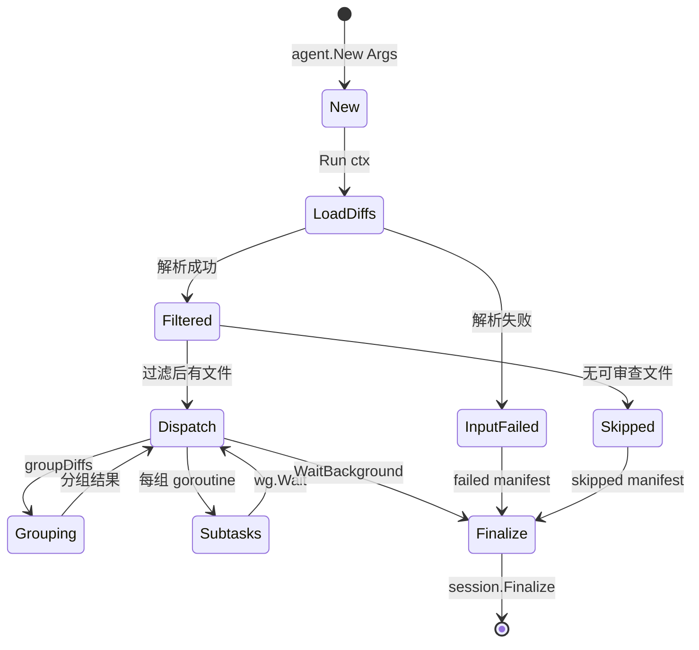
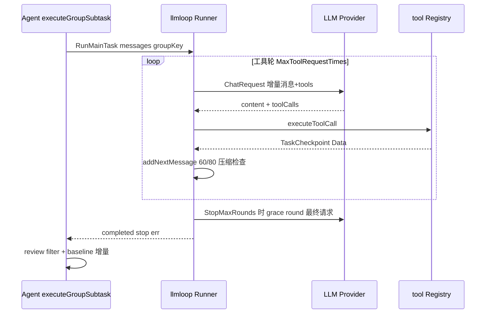
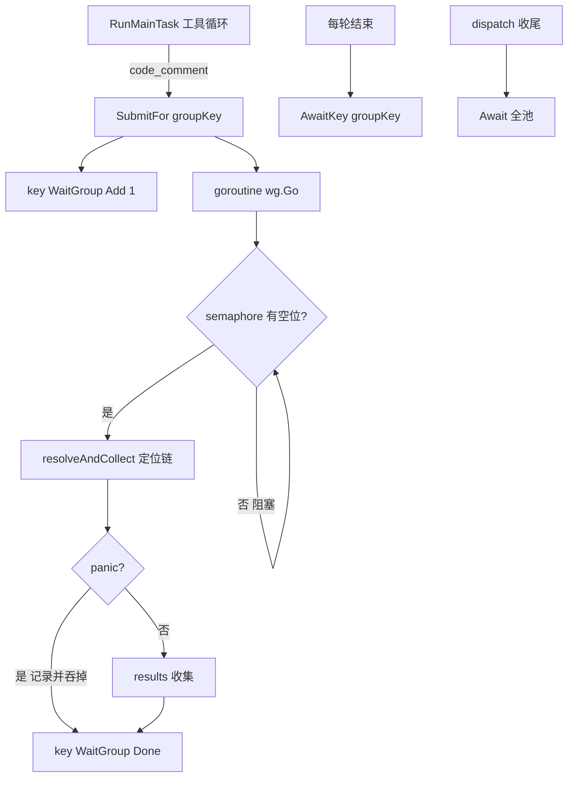
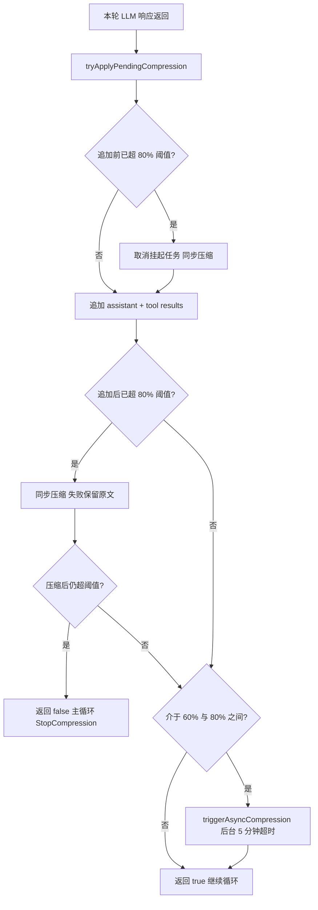

# Agent 与执行循环

> **关联源码**：`internal/agent/`、`internal/llmloop/`
> **前置阅读**：[00-overview.md](00-overview.md)、[04-config-rules.md](04-config-rules.md)、[05-llm-providers.md](05-llm-providers.md)

## 目录

- [1. 模块职责与定位](#1-模块职责与定位)
- [2. Agent 核心结构与生命周期](#2-agent-核心结构与生命周期)
- [3. 运行身份与幂等](#3-运行身份与幂等)
- [4. 文件分组算法](#4-文件分组算法)
- [5. Token 预算与估算](#5-token-预算与估算)
- [6. 预览模式](#6-预览模式)
- [7. util.go 辅助函数](#7-utilgo-辅助函数)
- [8. llmloop 主循环走读](#8-llmloop-主循环走读)
- [9. 并发池](#9-并发池)
- [10. 上下文压缩](#10-上下文压缩)
- [11. 源文件覆盖清单](#11-源文件覆盖清单)

---

## 1. 模块职责与定位

### 1.1 两个包的分工

`internal/agent` 与 `internal/llmloop` 是一条「领域编排层 / 通用执行层」的切分：

- **`internal/agent`**：审查任务的领域建模层。它知道「一次 diff 审查」由哪些阶段构成——diff 解析与过滤、文件分组、Plan 阶段、按组的 MAIN_TASK 多轮审查、review filter、manifest 覆盖率记账、resume 复用。它的输出是 `[]model.LlmComment` 加一份不可变的 run manifest。
- **`internal/llmloop`**：与 LLM 交互的通用执行循环。包文档（[pool.go](../../internal/llmloop/pool.go#L4-L14)）自述其职责：「carries the per-subtask MAIN_TASK tool-use loop shared by `ocr review` (diff-based) and `ocr scan` (full-file)」——即聊天补全的会话状态、三区内存压缩、工具调用分发（含异步评论后处理）、token/警告的聚合记账。它不知道自己在审 diff 还是扫全文件：一个 subtask 在 scan 是一个文件，在 review 是一个文件组（file group）。

这个切分有清晰的演化痕迹：`AgentWarning`、`CommentWorkerPool` 等类型如今在 agent 包里只是向后兼容的类型别名与委托（[agent.go](../../internal/agent/agent.go#L42-L52)），而 `Agent` 的文档注释直说「LLM tool-use loop / memory compression / token aggregation now live in internal/llmloop.Runner; this struct holds the diff-side state and orchestrates per-group subtasks」（[agent.go](../../internal/agent/agent.go#L178-L201)）。换言之，llmloop 是从 agent 包里抽出来的可复用内核，抽离后 scan 流水线（见 [09-scan-pipeline.md](09-scan-pipeline.md)）与 review 流水线共用同一个 `Runner`。

复用的关键机制是依赖注入而非配置开关：`Runner` 通过 `Deps.NewRequestMeta` 是否为 nil 来区分 review 与 scan——注释解释了为什么不用 Provider 字符串当开关：「an empty provider is a legitimate value for an unnamed endpoint — it cannot double as "identity disabled"」（[loop.go](../../internal/llmloop/loop.go#L53-L65)）。

### 1.2 在整体架构中的位置

调用链如下（CLI 层细节见 [02-cli-commands.md](02-cli-commands.md)，端到端流程见 [08-review-pipeline.md](08-review-pipeline.md)）：

```text
cmd/opencodereview review_cmd.go        # 构造 agent.Args，先做 resume 准入（validateResumeIdentity）
        │
        ▼
agent.New(Args) ──► session.New + initManifest + llmloop.NewRunner(Deps)
        │
        ▼
agent.Run(ctx)
  ├─ loadDiffs / filterDiffs / filterLargeDiffs      # 工程侧输入选择
  ├─ dispatchSubtasks
  │    ├─ registerCoverage + applyResume              # manifest 覆盖率分母、断点复用
  │    ├─ groupDiffs                                  # 可能调一次 GROUPING_TASK LLM
  │    └─ 每组一个 goroutine ──► executeGroupSubtask
  │          ├─ executeGroupPlanPhase                 # PLAN_TASK（可选）
  │          ├─ Runner.RunMainTask                    # MAIN_TASK 工具循环（llmloop）
  │          │      └─ executeToolCall ──► tool.Registry ──► 各工具 Provider（含 MCP）
  │          └─ executeGroupReviewFilter               # REVIEW_FILTER_TASK
  ├─ runner.WaitBackground + finalizeManifest + session.Finalize
  └─ 返回 comments / manifest
```

命令层的两个关键时序约束值得先记下（第 2、3 章展开）：

1. `validateResumeIdentity` 必须严格在 `agent.New` **之前**执行，因为 `agent.New` 会创建 session，而 `session.New` 立刻写 `session_start`——晚一步校验就会在每次拒绝后面留一个孤儿 session（[review_cmd.go](../../cmd/opencodereview/review_cmd.go#L370-L412)）。
2. `ocr review` 把同一个 `--concurrency` 值（默认 8，[shared_flags.go](../../cmd/opencodereview/shared_flags.go#L231)）同时喂给 `MaxConcurrency`（组级并发）和 `CommentWorkerPool`（评论后处理池）（[review_cmd.go](../../cmd/opencodereview/review_cmd.go#L210-L236)）。

### 1.3 职责边界：工程决策 vs LLM 决策

本篇的主线是这条边界。整个 review 流水线中，凡是「要不要做、做到哪停」的决策几乎全部由工程代码硬编码；LLM 只被请来回答「内容是什么」。表 6-1 是全流水线的总表，后续各章逐项展开。

**表 6-1**：review 流水线的工程决策 / LLM 决策边界总表

| 决策点 | 决策者 | 依据 / 代码位置 |
|---|---|---|
| 哪些文件进入审查（binary/扩展名/路径/用户规则） | 工程 | [preview.go](../../internal/agent/preview.go#L34-L60) `whyExcluded` |
| 超大文件预过滤（单 diff > 80% MaxTokens 即丢弃） | 工程 | [agent.go](../../internal/agent/agent.go#L1955-L1978) `filterLargeDiffs` |
| 是否计算文件分组（文件数 ≥ GROUPING_MIN_FILES=4？） | 工程 | [template.go](../../internal/config/template/template.go#L129-L137) `GroupingPlan` |
| 小变更集捆绑还是逐文件（churn < 200 行？） | 工程 | 同上 `GroupingPlan` 第二步 |
| 哪些文件语义相关、组标签是什么 | **LLM** | [grouping.go](../../internal/agent/grouping.go#L61-L99) `callGroupingLLM`，prompt 见 [04-config-rules.md](04-config-rules.md) |
| 分组结果的硬约束（≤10 文件/组、组 token 上限、未覆盖兜底） | 工程 | [grouping.go](../../internal/agent/grouping.go#L307-L358) `enforceMaxFilesPerGroup` / `enforceGroupTokenBudget` |
| 是否运行 Plan 阶段（单文件 ≥50 行或组 ≥100 行？） | 工程 | [template.go](../../internal/config/template/template.go#L69-L81) `PlanRequired` |
| 审查计划的内容 | **LLM** | [agent.go](../../internal/agent/agent.go#L1693-L1744) `executeGroupPlanPhase` |
| 每组审查几轮（MAX_REVIEW_ROUNDS=2，effort 可调） | 工程 | [template.go](../../internal/config/template/template.go#L56-L61) `ReviewRounds` |
| 每轮调哪些工具、审查发现什么 | **LLM** | [loop.go](../../internal/llmloop/loop.go#L354-L499) `RunMainTask` 工具循环 |
| 何时声明完成（task_done 的 DONE/FAILED 语义解释） | **LLM 发信号，工程解释** | [loop.go](../../internal/llmloop/loop.go#L591-L612) |
| 工具轮次预算（MAX_TOOL_REQUEST_TIMES=100）、连续空轮上限（3） | 工程 | [loop.go](../../internal/llmloop/loop.go#L362-L364) |
| 何时触发上下文压缩（60% 异步 / 80% 同步） | 工程 | [compression.go](../../internal/llmloop/compression.go#L20-L31) |
| 压缩摘要的内容 | **LLM** | [compression.go](../../internal/llmloop/compression.go#L223-L296) `runCompression` |
| 聚合 token 预算闸门（已用 + 组预估 > 预算 → 停止派发） | 工程 | [agent.go](../../internal/agent/agent.go#L654-L687) |
| 评论行号定位（diff 内解析 → 跨文件重归档 → LLM 兜底） | 工程优先，**LLM 兜底** | [loop.go](../../internal/llmloop/loop.go#L667-L727) `resolveAndCollect` |
| 哪些已产出评论被判定为错误而剔除 | **LLM**（二选一工具调用） | [agent.go](../../internal/agent/agent.go#L1513-L1565) `filterTools` |
| 剔除动作的执行（按索引移除） | 工程 | [agent.go](../../internal/agent/agent.go#L1854-L1874) |
| 终态/退出码的判定（coverage 派生） | 工程 | 见 [10-session-persistence.md](10-session-persistence.md) |

另一条贯穿性的工程原则是**降级链**：LLM 决策失败时工程侧总有确定性的退路——分组失败退到逐文件派发（[grouping.go](../../internal/agent/grouping.go#L96-L99)）、Plan 失败继续无计划审查（[agent.go](../../internal/agent/agent.go#L1380-L1386)）、第 2+ 轮失败保留此前发现（[agent.go](../../internal/agent/agent.go#L1458-L1465)）、压缩失败保留原消息（[compression.go](../../internal/llmloop/compression.go#L262-L267)）。LLM 是加速器与判断器，不是单点依赖。

## 2. Agent 核心结构与生命周期

### 2.1 Args：依赖与配置清单

[Args](../../internal/agent/agent.go#L54-L163) 是一个纯依赖结构（区别于携带运行状态的 `Agent`），字段可分五组：

- **输入定义**：`RepoDir`、`From`/`To`（range 模式）、`Commit`（commit 模式）、`ReviewMode`（空则由三者推导）；workspace/range/commit 三态的推导规则在 [util.go](../../internal/agent/util.go#L147-L155) `reviewModeString`。
- **规则与模板**：`Template`（task_template.json 的运行时产物，见 [04-config-rules.md](04-config-rules.md)）、`SystemRule`（路径规则解析器）、`FileFilter`（用户 include/exclude）。
- **LLM 与工具**：`LLMClient`、`Tools`（tool.Registry）、`PlanToolDefs`/`MainToolDefs`（按阶段启用的工具定义，含 MCP 注入的工具，见 [07-tool-system.md](07-tool-system.md)、[11-delegate-mcp.md](11-delegate-mcp.md)）、`CommentCollector`、`CommentWorkerPool`。
- **预算与并发**：`MaxConcurrency`（≤0 默认 8）、`ConcurrentTaskTimeout`（分钟；组超时 = 该值 × ReviewRounds，见 [agent.go](../../internal/agent/agent.go#L646-L647)）、`MaxTokensBudget`（全运行聚合预算，0 = 不限）。
- **身份与持久化**：`Model`/`Provider`/`RuntimeConfig`（进 manifest 的 execution 与 runtime_config_sha256）、`Session`、`Resume`（断点状态）、`SealedInput`（封存输入，见第 3 章）。

`RuntimeConfig`（[agent.go](../../internal/agent/agent.go#L171-L176)）刻意只装「允许出现在身份哈希里的非机密字段」：protocol、去掉凭据与路径的 endpoint host、语言、超时。注释强调「No secret ever reaches this hash」。

### 2.2 Agent 结构体与构造

`Agent`（[agent.go](../../internal/agent/agent.go#L181-L201)）持有的运行态字段：

| 字段 | 作用 |
|---|---|
| `diffs` / `totalInsertions` / `totalDeletions` | 解析后的 diff 集合与 churn 统计 |
| `session` | 会话历史（JSONL 持久化的入口，见 [10-session-persistence.md](10-session-persistence.md)） |
| `runner` | 委托给 llmloop 的执行器 |
| `subtaskFailed`（atomic） | 失败子任务文件计数，all-failed 判定用 |
| `budgetExceeded`（atomic.Bool） | 聚合预算闸门是否截断了派发 |
| `fileGroups` | 分组结果，供 JSON 输出 |
| `inputResolution` / `repoRemoteIdentity` | loadDiffs 时冻结的提交端点与仓库身份，供 manifest 消费 |

[New](../../internal/agent/agent.go#L207-L253) 的构造顺序是：补默认值（Tools、CommentCollector）→ 若无 Session 则 `session.New`（自动探测 git 分支，5 秒超时，[util.go](../../internal/agent/util.go#L157-L167)）→ `initManifest` 播种 run manifest 的 input/execution 元数据 → `llmloop.NewRunner`。注意 `Deps.DiffLookup`/`AllDiffs` 捕获的是 `a.findDiff`/`a.allDiffs` 两个闭包——`a.diffs` 此时还是空的，`loadDiffs` 之后闭包自然生效（[agent.go](../../internal/agent/agent.go#L234-L251)）。

`newRequestMeta`（[agent.go](../../internal/agent/agent.go#L255-L275)）是 review 侧五种 LLM 请求（grouping、plan、main_task、compression、review filter、re-location）共同的「重试报告身份」构造点——provider 与 model 只在这一处读取，保证五个请求类型不会漂移。它只在 review 路径注入（scan 为 nil，避免 scan 请求进入重试报告）。

### 2.3 Run 主流程走读

[Run](../../internal/agent/agent.go#L278-L405) 是编排的总入口，逐步：

1. **缓存亲和基键**（L282）：`llm.ContextWithSessionKey(ctx, a.SessionID())` 给本次运行的所有 LLM 请求一个 prompt-cache 亲和基键；每个任务会话再用 `llm.SessionTaskKey` 细化到「per-conversation」粒度——注释点明这是 provider prompt cache 实际复用前缀的粒度。
2. **diff 解析**（L285-L311）：`loadDiffs` 失败时不是简单返回错误——先 `SetRunFailure(RunFailureInput)`、再 `finalizeManifest`、再 `session.Finalize`，保证磁盘上留下一个带 failed manifest 的 `session_end` 而不是「看起来被中断」的半成品；三类错误用 `errors.Join` 合并，谁都不许被吞（L296-L306）。
3. **只读 DiffMap 注入**（L315-L316）：用**全部**解析出的 diff（过滤前）构建 `tool.DiffMap` 塞给 `FileReadDiffProvider`，让模型能查询「相关但被过滤掉」文件的 diff；随后 `Tools.Freeze()` 冻结注册表（此后 Register 会 panic，[definitions.go](../../internal/tool/definitions.go#L89-L106)）。
4. **过滤与空集短路**（L322-L339）：`filterDiffs` 过滤后若为空，发 `no.files.changed` 遥测并走 skipped manifest 收尾。
5. **成本预估**（L359-L367）：只在 `MaxTokensBudget > 0` 时打印——注释解释了为什么默认路径不打印：估阶只对「设了预算要对比」的用户有意义。预估超预算会打 WARNING。
6. **resume 谱系**（L373-L374）：在派发任何 item 之前写 `RecordResumeLineage`，保证谱系落盘不依赖后续成功。
7. **派发**（L377）→ **合并后台压缩**（L387，`runner.WaitBackground`，理由见第 10 章）→ **固化 manifest**（L393-L395）→ **session 终结**（L396-L403）。持久化失败同样用 `errors.Join` 与 review 错误并列上报，「a clean skip cannot be claimed if its session_end never reached disk」。

**图 6-1**：Agent 生命周期状态图



### 2.4 sealed input：输入为何封存

`SealedInput`（[identity.go](../../internal/agent/identity.go#L17-L28)）= 预检时算出的 `RunIdentity` + 预检时解析出的 `diff.InputResolution`（冻结的 commit 端点）。它防的是一个时间窗：

> 命令层为了 resume 准入把输入解析了一次，运行自身又会解析一次。若第二次解析能看到不同的 commit（用户 typed 的 ref 在两次之间被移动），就会出现「按一份输入放行、审查另一份输入」，而这个不一致要等子 session 和 manifest 已经落盘之后才会暴露。

把封存端点交给运行后，`loadDiffs` 用固定 SHA 替换用户输入的 ref（[agent.go](../../internal/agent/agent.go#L528-L536)），两次解析只能读到同样的不可变对象。语义上没有偏移：range 模式的 merge-base 本身就是冻结的 base（`merge-base(base, head) = base` 当 base 是 head 的祖先时）；commit 模式的一父比较由 commit 决定而非其拼写；workspace 模式没有 head 可封，保持原样。`fileReadRef`（[review_cmd.go](../../cmd/opencodereview/review_cmd.go#L421-L429)）同样把 file_read 工具的读基准钉到冻结 commit，避免「模型读到的文件版本与被审 diff 的版本不一致」。

[sealed_input_test.go](../../internal/agent/sealed_input_test.go#L48-L96) `TestSealedInputPinsRunToAdmittedCommits` 是这一保证的行为契约，且测试的**对照组**与断言组同样重要：构造 `main..feature` 范围、取得 sealed 身份后追加一个 commit 移动 `feature`，断言 (a) 封存后的运行仍产出与放行身份一致的 `RunIdentity`；(b) 不封存的同一移动**确实**会改变身份——证明是 seal 在起作用，而不是 fixture 天生惰性。这正是「sealed input 防什么」的最直接佐证。

## 3. 运行身份与幂等

### 3.1 run identity 的构成

`runIdentity()`（[identity.go](../../internal/agent/identity.go#L103-L119)）从 Agent 当前选择集读取四元组，与 manifest 落盘字段一一对应（[resume_identity.go](../../internal/session/resume_identity.go#L8-L17)）：

| 字段 | 来源 | 含义 |
|---|---|---|
| `Mode` | `manifestMode()`（纯 From/To/Commit 推导，跨 resume 链稳定） | input.mode，也是每个 item_id 的组成部分 |
| `SourceArtifactSHA256` | `sourceArtifactSHA256()` | 选择集的内容身份 |
| `RuleConfigSHA256` | `ruleConfigSHA256()` | 规则配置身份 |
| `RepositorySHA256` | `repoRemoteIdentity` 的 SHA-256（无 remote 则空） | 仓库身份 |

三个哈希共用一个原语 [hashFields](../../internal/agent/agent.go#L1071-L1080)：每个字段前写 8 字节大端长度前缀再进 SHA-256。前缀是防碰撞的关键——[manifest_hash_test.go](../../internal/agent/manifest_hash_test.go#L29-L35) 明确验证 `["ab",""]` 与 `["a","b"]` 这种拼接后会相同的序列必须得到不同摘要；空序列必须等于空输入的规范 SHA-256（[manifest_hash_test.go](../../internal/agent/manifest_hash_test.go#L23-L27)）。

- **sourceArtifactSHA256**（[agent.go](../../internal/agent/agent.go#L982-L1018)）：对每个非删除 diff 取 `(item_id, 原始 diff fingerprint)` 二元组，按 item_id 排序后折叠。用原始 fingerprint（而非 item_id）是为了「同一逻辑文件的内容变化必须改变 artifact」——这正是 resume 检测「ref 移动带来新输入」所需要的。按 item_id 去重（first wins）与 `RegisterSelected` 的去重保持同分母，二者必须 lockstep（[manifest_hash_test.go](../../internal/agent/manifest_hash_test.go#L87-L113) 验证重复 item_id 与单项集合哈希相同）。
- **ruleConfigSHA256**（[agent.go](../../internal/agent/agent.go#L1020-L1042)）：resolver 的规范化规则文本层（custom > project > global > system，顺序保留）加 include/exclude 过滤器。**顺序敏感**（first match wins），规则重排必须改变摘要——同样有测试钉住（[manifest_hash_test.go](../../internal/agent/manifest_hash_test.go#L37-L78)）。
- **runtimeConfigSHA256**（[agent.go](../../internal/agent/agent.go#L1044-L1065)）：protocol、model、host、language、timeout、concurrency、max_tokens_budget 全部参与。`max_tokens_budget` 入哈希的理由写在注释里：预算改变「一个运行能尝试的覆盖范围」，审计「为何中途停止」时两次运行不可互换（[manifest_hash_test.go](../../internal/agent/manifest_hash_test.go#L115-L155) 逐字段验证）。

### 3.2 ResolveIdentity：在运行存在之前算出身份

[ResolveIdentity](../../internal/agent/identity.go#L30-L63) 的约束是不创造任何东西——「no session, manifest, runner or LLM call」。它复现运行自身的完整选择过程（`loadDiffs` → `filterDiffs` → `filterLargeDiffs`），因为身份是从**过滤后的封存选择集**推导的，少跑一遍过滤就会得到「没有任何运行会记录的摘要」，resume 对比会错误拒绝本应复用的工作（`runIdentity` 的注释，[identity.go](../../internal/agent/identity.go#L103-L108)）。期间 `stdout.Quiet()` 静默过滤日志（预检发生在主 goroutine、并发输出出现之前，故安全）。

`resolveInputBeforeDiff`（[identity.go](../../internal/agent/identity.go#L68-L93)）负责把移动的 ref 变成不可变 commit：commit 模式只冻结 head；range 模式冻结两端并算 merge-base。

这构成 session resume 幂等的三段式（详见 [10-session-persistence.md](10-session-persistence.md)）：

1. **准入**（命令层）：`ResolveIdentity` 算身份 → `ResumeState.ValidateResume` 与父 manifest 逐字段比对，任一不符整体拒绝（不做部分复用，因为混合两份输入的结果无法自证）；
2. **封存**：比对通过的 `SealedInput` 传给运行，运行不再二次解析原始 ref；
3. **复用**：`applyResume` 按 fingerprint 匹配 `ReusableItem`，命中的文件直接搬评论并 `markReused`（[agent.go](../../internal/agent/agent.go#L844-L885)）。

## 4. 文件分组算法

### 4.1 决策阶梯

[groupDiffs](../../internal/agent/grouping.go#L61-L103) 是一个四级决策阶梯，每一级都可能短路：

```text
len(diffs) <= 1 ──────────────► 单文件组（label = 文件路径；仅发遥测 skip 事件）
        │
Template.GroupingPlan(fileCount, totalChanged)
  ├─ GroupingViaLLM ──────────► 走 LLM 分组（见 4.3）
  ├─ GroupingBundleAll ───────► 全部捆成一组（label = "small change set"）
  └─ GroupingPerFile ─────────► 每文件一组
```

两个细节体现了「跳过也要可见」的工程纪律：

- 单文件短路必须无条件先于 `GroupingPlan`（否则 `GroupingMinFiles=0` 会让单文件也发一次分组调用），且**仍发** `grouping.skipped` 遥测——遥测聚合必须完整，而终端读者不需要被告知一个文件无需分区（[grouping.go](../../internal/agent/grouping.go#L64-L80) 注释）。
- 免 LLM 路径的**日志描述实际产物而非意图**：bundle 可能被大小阀门切成多组，此时日志必须说 `reviewing as N groups` 而不是仍然宣称一组（[grouping.go](../../internal/agent/grouping.go#L129-L144)）；[grouping_test.go](../../internal/agent/grouping_test.go#L367-L395) `TestGroupDiffs_SkipLogReportsActualShape` 钉住这一点。

### 4.2 两个阈值回答两个不同的问题

[GroupingPlan](../../internal/config/template/template.go#L129-L137) 的两级阈值（默认值来自 [task_template.json](../../internal/config/template/task_template.json#L38-L45)：`GROUPING_MIN_FILES=4`、`GROUPING_BUNDLE_LINE_THRESHOLD=200`）：

1. `GROUPING_MIN_FILES` 问「**分区值不值得算**」：低于它，合理划分的空间太小，LLM 调用买不到信息。第二步**不再看文件数**。
2. `GROUPING_BUNDLE_LINE_THRESHOLD` 问「**这些文件能否共享一次审查**」：捆绑组的每一轮 `MAX_REVIEW_ROUNDS` 都要覆盖全集的 churn，超过天花板单轮注意力摊得太薄，不如各自成组。

阈值 ≤0 各自禁用自己的步骤：`GroupingMinFiles<=0` 使分组无条件走 LLM；`GroupingBundleLineThreshold<=0` 永不捆绑。测试矩阵覆盖了「恰好达到阈值走 LLM」（[grouping_test.go](../../internal/agent/grouping_test.go#L397-L415)）、「低 churn 捆绑 / 高 churn 逐文件」（[grouping_test.go](../../internal/agent/grouping_test.go#L294-L340)）、「bundle 禁用退逐文件」（[grouping_test.go](../../internal/agent/grouping_test.go#L417-L432)）。

### 4.3 LLM 侧的输入与工程侧的触发

LLM 分组调用的输入刻意只有**文件元数据，没有 diff 内容**——`buildFileList` 用 `formatDiffEntry` 渲染成 `STATUS   path (+N/-M)` 每行一条（[grouping.go](../../internal/agent/grouping.go#L244-L251)、[agent.go](../../internal/agent/agent.go#L1583-L1597)）。这个形状同时服务于 grouping 文件列表与 main_task 的「其他变更文件」块，「every prompt that enumerates files presents them identically」。

prompt（[grouping_task_system.md](../../internal/config/template/prompts/grouping_task_system.md)）给 LLM 的语义指引是：同模块/特性、生产者-消费者（接口与实现）、i18n/config 变体、同目录协作；每文件恰好一组、单文件可成组、**每组 ≤10 文件**、只输出 JSON 数组。注意「≤10」在 prompt 里说了一遍，但工程侧并不信任它——见 4.4。

工程侧触发细节（[callGroupingLLM](../../internal/agent/grouping.go#L167-L242)）：

- `{{file_list}}` 占位符替换后经 `CompletionsWithCtx` 发送，`maxTokens` 取 `Template.CompletionTokenLimit()`，≤0 时兜底 4096（L205-L207）；
- 会话记录挂在魔法键 `__grouping__` 下（区别于任何文件路径），带上 `session.GroupingTask` 类型的 TaskRecord，使分组调用在重试报告与 viewer 中可见（L189-L203）；
- 包了一个 `recover()`：分组 LLM panic 也按普通失败处理并写入 TaskRecord（L170-L179）。

### 4.4 工程侧对 LLM 输出的后处理

`parseGroupingResponse`（[grouping.go](../../internal/agent/grouping.go#L253-L311)）对 LLM 的 JSON 输出做四层防御：

1. 剥 markdown 代码栅栏（有些模型会包 ```json）；
2. **重复文件**跳过（先到先得，同一文件不进两组）；
3. **未知文件路径**跳过（LLM 幻觉出的路径直接忽略）；
4. **未被任何组覆盖的文件**兜底成单文件组（label = 文件路径）。

随后两道硬约束：

- `enforceMaxFilesPerGroup`（L313-L333）：超过 `maxFilesPerGroup = 10` 的组按原顺序切成 ≤10 的块，label 继承。这就是「prompt 说 10 但代码强制 10」的双保险。
- `enforceGroupTokenBudget`（L335-L358）：组内所有 diff 的 token 总和超过 `tokenLimit`（调用方传 `PromptTokenLimit(MaxTokens)` 即 80%）时整组降级为逐文件组，label 加 ` (split: <path>)` 后缀。[grouping_test.go](../../internal/agent/grouping_test.go#L342-L365) `TestGroupDiffs_BundleTokenBudgetSplit` 验证「低 churn 允许捆绑，但极小 prompt 上限使其不可用」时降级到逐文件。

### 4.5 分组的职责边界表

**表 6-2**：分组环节的工程/LLM 职责边界

| 决策 | 归属 | 说明 |
|---|---|---|
| 单文件无需分区 | 工程（无条件短路） | [grouping.go](../../internal/agent/grouping.go#L64-L80) |
| 是否调用分组 LLM | 工程（`GroupingPlan` 两阈值） | 文件数 <4 时永不出 LLM 调用 |
| 低于阈值时 bundle 还是逐文件 | 工程（churn 与 200 行比） | 不消耗 LLM 配额 |
| 语义相关性判断、组标签 | **LLM** | grouping_task prompt |
| 每组文件数上限（10） | 工程（强制执行） | `enforceMaxFilesPerGroup`，即使 prompt 已声明 |
| 组 token 上限（80% MaxTokens） | 工程（强制执行） | 超限降级逐文件，带 split 标记 |
| 幻觉/重复/遗漏文件的处理 | 工程 | 跳过未知与重复、兜底未覆盖 |
| LLM 失败时的形态 | 工程（降级逐文件） | 打日志后 fallback（[grouping.go](../../internal/agent/grouping.go#L96-L99)） |

bundle 的已知代价也被代码注释诚实记录：`dispatchSubtasks` 的预算 look-ahead 按**组**计，捆绑使预算决策对整个变更集变成 all-or-nothing——被拒的 bundle 一个文件都覆盖不到，而逐文件组能覆盖预算允许的那部分；同时该预估对捆绑组**高估**成本（每文件付一次固定 prompt 开销，而捆绑组共享一个会话）（[grouping.go](../../internal/agent/grouping.go#L118-L125)）。

## 5. Token 预算与估算

### 5.1 五个容易混淆的「预算」

| 概念 | 默认值 | 作用域 | 出处 |
|---|---|---|---|
| `Template.MaxTokens` | 200000 | 单请求上下文上限，衍生 80% prompt 阀门 | [task_template.json](../../internal/config/template/task_template.json#L44) |
| `Template.MaxCompletionTokens` | 16384 | 单请求输出上限（`CompletionTokenLimit`） | [template.go](../../internal/config/template/template.go#L141-L146) |
| `Template.MaxToolRequestTimes` | 100 | 一个 MAIN_TASK 会话的工具轮次上限 | [loop.go](../../internal/llmloop/loop.go#L362) |
| `Template.MaxReviewRounds` | 2（effort 可调 1/2/3） | 每组审查轮数 | [effort.go](../../internal/config/template/effort.go#L35-L37) |
| `Args.MaxTokensBudget` | 0（不限） | **整个运行**的聚合 token 预算 | [agent.go](../../internal/agent/agent.go#L148-L151) |

`CompletionTokenLimit` 的设计约束是「运行时 prompt 上限覆盖不得悄悄扩大模型输出预算」（[template.go](../../internal/config/template/template.go#L139-L146)）——`--max-tokens` 只压输入阀门，不动输出上限。

### 5.2 估算公式

[estimate.go](../../internal/agent/estimate.go#L13-L37) 与 scan 的估算是**有意复制**的两份代码（避免 agent→scan 的跨包依赖），三个常数要求与 `internal/scan/estimate.go` 保持同步：`promptOverheadTokens=2000`、`avgMainRoundsPerFile=7`（实测约 6，向上取整）、`avgOutputTokensPerRound=700`。

单文件公式（[estimateDiffFileTokens](../../internal/agent/estimate.go#L48-L68)）：

```text
PLAN:   diffTokens + 2000 + 400
MAIN:   (diffTokens + 2000) × 7 + 700 × 7
```

要点：按 **diff 文本**计 token（review 审的是 patch 不是全文件）；删除文件返回 0（派发前已被跳过，不许绊动闸门）；**估算无法计入 agent 工具调用放大**——工具用一次 prompt 可能翻倍，所以它是下限（floor），真实用量始终以 API 响应为准事后上报。`estimateDiffCost`（[estimate.go](../../internal/agent/estimate.go#L70-L88)）聚合出 `Estimate`（Files/Input/Output/Total），`String()` 输出与 scan 同格式的一行警告且**刻意不含金额**（价格随 provider/model 变化，不暗示精确美元数）。

### 5.3 聚合预算闸门（look-ahead）

`dispatchSubtasks` 的派发循环里，每个组在**获取信号量之前**做预算前瞻（[agent.go](../../internal/agent/agent.go#L654-L687)）：

```text
projected = runner.TotalTokensUsed() + Σ estimateDiffFileTokens(组内 diff)
projected > MaxTokensBudget → 跳过该组与剩余所有组
```

在飞的组允许跑完，超支上界为并发数。停止时的处置是一组精确的语义选择：

- `budgetExceeded.Store(true)` + `token_budget_reached` 警告（含 used/est/projected/budget 四个数）；
- **刻意不调 `SetRunFailure`**：预算耗尽是「受控的覆盖截断」，不是运行级失败。`SetRunFailure` 会无条件把 terminal_state 拧成 failed 并占掉唯一的 first-wins 失败槽（挡住真正的 deadline/cancellation 类因）；改记 pending failure cause，让 Finalize 把未派发项归为 failed(budget)，终态仍由覆盖率单独派生（[agent.go](../../internal/agent/agent.go#L673-L684) 注释）。

[budget_test.go](../../internal/agent/budget_test.go#L82-L174) 用「每次调用固定 5 万 token、预算 12 万、并发 1」的假客户端验证：闸门在 10 个文件跑完前停下、警告已记、`BudgetExceeded()==true`、部分评论以非 nil 切片返回、manifest 终态 = **partial**（覆盖率派生）且 `RunFailure` 为 nil、未派发项分类 = budget。对照组（[budget_test.go](../../internal/agent/budget_test.go#L176-L243)）钉住边界的另一侧：预算连第一个文件都放不进去时，零覆盖、全部 swept 到 failed(budget)、终态 failed、退出码非零——**一个被覆盖的文件就是 partial/exit-0 与 failed/exit-1 的全部差别**。第三组（[budget_test.go](../../internal/agent/budget_test.go#L245-L276)）回归保护 `MaxTokensBudget=0` 时全量运行。

### 5.4 prompt 级预算检查与预过滤

两个更细的阀门共用同一个 80% 定义（`PromptTokenLimit`，见第 10 章）：

- **每轮 prompt 检查**（[checkPromptBudget](../../internal/agent/agent.go#L1294-L1314)）：渲染后的消息 token 超过 80% MaxTokens 即停——第 1 轮直接返回 `subtaskStop{FailureBudget}`，后续轮 break 保留已有发现。同时记 `token_threshold_exceeded` 警告与遥测。
- **大文件预过滤**（[filterLargeDiffs](../../internal/agent/agent.go#L1955-L1978)）：单个 diff 自身 token 就超过 80% 的文件在派发前被丢弃（打印 `Skipping <path>`）；全部超限则整个运行按 skipped 收尾（[agent.go](../../internal/agent/agent.go#L596-L603)）。

预算语义的另一半在 item 级：`classifyMainLoopStop` 只把 `StopMaxRounds` 归入 `FailureBudget`，其余 stop（空轮、压缩）一律 `FailureUnknown`——「只有声明过的预算限制才配叫预算停止」，将来枚举新增值也只会落到诚实的兜底类而不是继承 budget（[agent.go](../../internal/agent/agent.go#L1179-L1196)）。

## 6. 预览模式

[Preview](../../internal/agent/preview.go#L62-L70) 回答「如果现在跑 review，哪些文件会被审、哪些被排除、为什么」——**不发起任何 LLM 调用**。实现上它绕过 `New` 直接构造裸 `Agent{args}`（[preview.go](../../internal/agent/preview.go#L68-L70)），注释说明为什么：走 `New` 会自动创建 session，留下一个未 finalize 的 JSONL 文件在 OCR home 下；preview 「builds none of the review runtime — no session, manifest, or runner」。

输出 `model.Preview`（preview.go 里保留的是 [model 类型的别名](../../internal/agent/preview.go#L14-L30)）：每文件一项 `{Path, Insertions, Deletions, Status, WillReview, ExcludeReason}`，汇总 `TotalFiles/ReviewableCount/ExcludedCount/TotalInsertions/TotalDeletions`。空工作区也保证 `Entries` 非 nil，JSON 输出为 `"files":[]` 而非 `null`（[preview_run_test.go](../../internal/agent/preview_run_test.go#L69-L83)）。

排除原因的判定顺序（[whyExcluded](../../internal/agent/preview.go#L34-L60)）是 preview 与正式审查共用的唯一算法：binary → 用户 exclude → 用户 include（**短路放行**，显式 include 优先于默认过滤）→ 扩展名 allowlist → 默认路径排除。已删除文件在 preview 里标记为 `ExcludeDeleted`（[preview.go](../../internal/agent/preview.go#L94-L97)）。

消费方（以代码为准）：

- `ocr review --preview`（[review_cmd.go](../../cmd/opencodereview/review_cmd.go#L86-L91) 示例；[runPreviewContext](../../cmd/opencodereview/review_cmd.go#L493-L507) 实现）——终端用户与 CI dry-run 的「先看再跑」入口；
- `ocr delegate preview`（[delegate_cmd.go](../../cmd/opencodereview/delegate_cmd.go#L120-L122)）——delegate 工具链的同一预览，文本格式额外带 mode/ref/merge-base 元数据（见 [11-delegate-mcp.md](11-delegate-mcp.md)）。

VS Code 扩展**不经过**这条路径：其「Files-to-review preview」由扩展自身的 GitService 列出变更文件（[extensions/vscode/README.md](../../extensions/vscode/README.md#L14)），CLI 参数构造里也没有 `--preview`（[cliParse.ts](../../extensions/vscode/src/extension/services/cliParse.ts#L9-L22)）。scan 命令有对应的 `scan.Preview` 同构实现（见 [09-scan-pipeline.md](09-scan-pipeline.md)）。

## 7. util.go 辅助函数

[util.go](../../internal/agent/util.go) 是 agent 包的 prompt 后处理杂项层，按重要性：

- **空块剥离**：`stripEmptyPlanBlock`（[L19-L31](../../internal/agent/util.go#L19-L31)）与 `stripEmptyConfirmedBlock`（[L33-L44](../../internal/agent/util.go#L33-L44)）用正则把 MAIN_TASK 模板中「`### ... Review Plan` + `{{plan_guidance}}`」「`### ... Confirmed Findings` + `{{confirmed_comments}}`」的标题-占位符-空行包装整体删掉。触发条件：plan 阶段没产出（或第 2+ 轮刻意剥离 plan 免得当「覆盖率天花板」）、第 1 轮还没有已确认发现。必须发生在对应 `ReplaceAll` **之前**。
- **确认发现块**：`buildConfirmedCommentsBlock`（[L52-L81](../../internal/agent/util.go#L52-L81)）把前几轮已确认发现渲染成 `<confirmed_findings>` 块注入下一轮 prompt，指令模型「不要重复，继续找别的」。每条被压成单行（`flattenOneLine`）且截断（code 200 rune / content 300 rune，[L46-L50](../../internal/agent/util.go#L46-L50) 常数）。同文件的 `confirmedCap = 30` 是组级确认发现的硬上限——达到即跳过后续轮次（[agent.go](../../internal/agent/agent.go#L1501-L1504)）。
- **stripMarkdownFences**（[L91-L109](../../internal/agent/util.go#L91-L109)）：剥 ```json 栅栏。注意这里有一处**故意的重复实现**：llmloop 包有功能相同的 `StripMarkdownFences`（导出版，[compression.go](../../internal/llmloop/compression.go#L168-L172)），agent 的 review filter 解析走 llmloop 的导出版（[agent.go](../../internal/agent/agent.go#L1934)），agent 自己的这份服务包内其他路径。
- **buildMessageXML / copyMessages / countMessagesTokens**（[L111-L145](../../internal/agent/util.go#L111-L145)）：agent 侧的消息工具函数；llmloop 有自己的加强版（含 reasoning 输出与 Native token 估计，见第 10 章），两套并存同样是拆包历史的产物。
- **reviewModeString**（[L147-L155](../../internal/agent/util.go#L147-L155)）与 **detectGitBranch**（[L157-L167](../../internal/agent/util.go#L157-L167)，5 秒超时）：三态推导与 session 构造的小工具。

## 8. llmloop 主循环走读

### 8.1 Runner 与 Deps

[Runner](../../internal/llmloop/loop.go#L89-L110) 是跨 subtask 的会话级执行器：token 四计数器（input/output/cacheRead/cacheWrite，原子累加）、警告列表、每工具调用计数与失败明细、以及 `bg`（追踪结束后仍可能发出 LLM 请求的后台 goroutine，即异步压缩）。所有聚合状态都是并发安全的，因为它被 review 的多个组 goroutine 与 scan 的多个文件 goroutine 共享。

### 8.2 RunMainTask 逐段

[RunMainTask](../../internal/llmloop/loop.go#L336-L499) 驱动**一个** MAIN_TASK 会话到终点（review 每个审查轮调一次，即一个 subtask 可顺序驱动多个会话）：

1. **缓存亲和**（L356-L360）：会话键细化到 `(sessionID, main_task, taskKey)`，保证同一会话每轮请求路由到同一缓存节点——每轮重发增长中的历史，正是 provider prompt cache 复用前缀的形态。
2. **预算初始化**（L362-L375）：`toolReqCount = MaxToolRequestTimes`（默认 100）；`maxConsecutiveEmptyRounds = 3`；`sessionID = uuid.NewString()`（同一会话各轮共享，传给 ChatRequest 便于 provider 侧关联）；每个会话独立的 `compressionState`（第 10 章）；`stop` 默认 `StopMaxRounds`——for 循环若因轮次耗尽退出，原因已经就位。
3. **每轮请求**（L376-L420）：`AppendTaskRecord` 先建记录（RequestNo 是重试报告的 join 键）→ `CompletionsWithCtx`（带 Tools 与 CompletionTokenLimit）→ 错误即 `SetError` 并返回包装错误；成功则把 usage 四项原子累加。注意 `reqCtx` 的注释：请求身份只作用于本轮，基础 ctx 必须保持「identity-free」，否则各轮的 meta 会嵌套而非替换（L389-L391）。
4. **无工具调用**（L425-L434）：追加一条「You did not successfully call any tools. Please try again or use task_done if finished.」的 nudge；若响应里有可见内容/Native payload/reasoning，会把原始助手消息插到 nudge 之前（保序）。
5. **工具分发**（L444-L469）：逐个 `executeToolCall`。`Failed` → 直接返回错误（`task failed: ...`）；`Completed`（task_done DONE）→ 记一条成功 result 并置 `taskCompleted`；`Data` 非空 → 有效 result；都空 → 记「Tool execution returned no result」。**taskCompleted 立即返回 `(true, StopNone, nil)`**（L471-L473），本轮剩余工具调用仍会执行完（循环是顺序的）。
6. **空轮计数**（L474-L484）：本轮没有任何有效 result 才计 1；连续 3 轮 → `StopEmptyRounds` 终止。有效轮会清零计数。
7. **消息推进与压缩**（L486-L491）：`addNextMessage` 返回 false（追加+同步压缩后仍超 80%）→ `StopCompression`。
8. **grace round**（L494-L497）：仅当 `stop == StopMaxRounds` 时执行。

`MainLoopStop` 枚举（[loop.go](../../internal/llmloop/loop.go#L272-L334)）是这套终止语义的类型化表达：`StopNone`（task_done 或错误，原因无附加含义）、`StopMaxRounds`（声明过的轮次预算）、`StopEmptyRounds`（连续空轮）、`StopCompression`（压缩超阈）。`Reason()` 是面向人的安全文案的**单一来源**——review manifest 与 scan 警告渲染同一字符串；在 `--format json` 下进度行被 `stdout.Quiet` 丢弃，这个字符串是 CI 上唯一幸存的 stop 诊断，因此每个值都必须可区分，未识别值要自我通报而不是冒充 StopNone（L321-L334 注释）。

**图 6-2**：主循环消息流（agent ↔ llmloop ↔ LLM ↔ tool）



### 8.3 终止条件汇总

| 终止方式 | 返回 | 触发点 |
|---|---|---|
| task_done(state=DONE) | `(true, StopNone, nil)` | [loop.go](../../internal/llmloop/loop.go#L591-L612) |
| task_done(state=FAILED) | 错误 `task failed` | 同上 |
| ctx 取消/超时 | `(false, StopNone, ctx.Err())` | [loop.go](../../internal/llmloop/loop.go#L377-L381) |
| LLM 请求错误 | 错误（包装） | [loop.go](../../internal/llmloop/loop.go#L402-L408) |
| 工具 Failed | 错误 `task failed: ...` | [loop.go](../../internal/llmloop/loop.go#L446-L447) |
| 轮次耗尽 | `(false, StopMaxRounds, nil)` + grace round | [loop.go](../../internal/llmloop/loop.go#L494-L498) |
| 连续 3 空轮 | `(false, StopEmptyRounds, nil)` | [loop.go](../../internal/llmloop/loop.go#L474-L484) |
| 压缩后仍超阈 | `(false, StopCompression, nil)` | [loop.go](../../internal/llmloop/loop.go#L486-L491) |

[loop_test.go](../../internal/llmloop/loop_test.go#L338-L420) 三条测试分别钉住后三种：轮次耗尽不 complete 且 stop=StopMaxRounds；三次空轮 stop=StopEmptyRounds 且恰好 3 次调用；不可压缩上下文（压缩摘要为空）stop=StopCompression 且主调用+压缩调用共 2 次。

### 8.4 runGraceRound：预算耗尽后的收尾轮

[runGraceRound](../../internal/llmloop/loop.go#L501-L566) 回答一个具体的产品问题：模型可能已经识别了问题但还没来得及 `code_comment` 就被轮次预算掐断。做法是追加一条「Your tool-call budget is exhausted. This is your FINAL round. You may ONLY: Call code_comment ... Call task_done ...」的用户消息，并把工具集裁剪为 `code_comment` 与 `task_done` 两个（[graceRoundToolDefs](../../internal/llmloop/loop.go#L568-L578)）。ctx 已取消则跳过；请求错误只打日志不影响主结果；返回的调用照常执行（含 token 计入）。注意它不改变返回值——`(false, StopMaxRounds, nil)` 不变，grace round 只是「尽力多抢救几条发现」。

### 8.5 executeToolCall：分发与 code_comment 特殊路径

[executeToolCall](../../internal/llmloop/loop.go#L580-L783) 的分派顺序：

1. **task_done 不进注册表**（L591-L612）：参数解析后看 `state` 字段——DONE → `tool.Complete()`；FAILED → `tool.Fail("task_done reported FAILED")`；非法值返回错误消息让模型重试（[loop_test.go](../../internal/llmloop/loop_test.go#L194-L230) 验证非法 state 会得到可重试的反馈）。无 state 字段按 DONE 处理。
2. **未注册工具**（L614-L618）：返回统一的 `NotAvailableMsg` 文案（[definitions.go](../../internal/tool/definitions.go#L111-L113)），作为工具结果喂回模型而非报错终止——模型可以自行修正。
3. **code_comment 特殊路径**（L635-L760）：参数经 `ParseCommentsWithPath` 校验，可修复的 schema 违规会被修复并记 `comment_args_repaired` 警告（「否则修复会无观察地吸收任意多的违规」）；本回合的 reasoning 内容回填到每条 comment（模型无 reasoning 通道则空）。然后是定位链 `resolveAndCollect`（L667-L727）：
   - ① `DiffLookup(path)` 拿 diff → `diff.ResolveComment` 同文件行号解析（确定性）；
   - ② 失败且配置了 `AllDiffs` → `diff.RelocateAcrossFiles` 跨文件重归档（确定性），成功记 `comment_refiled` 警告；顺序先于 LLM 是因为它需要 Agent 原始的 ExistingCode，而 LLM 步骤会覆盖它（L676-L679 注释）；
   - ③ 仍失败且模板配了 `RE_LOCATION_TASK` → 发一次 re-location LLM 请求兜底（记录为 `session.ReLocationTask`，FilePath 用 comment 自己的路径而非组键——组审查时组键不是文件路径，这条注释专门解释了这个 join 为什么必须用 comment 路径，L700-L707）；
   - ④ `CommentCollector.Add`。
   - **异步化**：配置了 CommentWorkerPool 时，整个 `resolveAndCollect` 提交到池（用 `context.WithoutCancel(ctx)`，主循环取消后评论后处理仍继续），工具立即返回成功（`"(async)"` 结果），主循环不被行号解析/可能的 LLM 兜底阻塞（L729-L748）。
4. **其余工具同步执行**（L762-L782）：`p.Execute(ctx, args)`，错误记入 `ToolFailureDetail`（含全局调用序号、原始参数、错误文本，[loop.go](../../internal/llmloop/loop.go#L112-L124)），并作为工具结果返回模型。

`parseToolArgs`（L839-L853）有一个实战修补：某些 OpenAI 兼容网关发 `"arguments": null`，unmarshal 成 nil map 后首个写入即 panic，故强制换成空 map（#382），与 internal/llm 的 buildAnthropicParams 保持同步。

### 8.6 进度流

进度输出不是回调函数而是**全局可替换 writer**：`internal/stdout` 提供 `Writer()/Quiet()/Swap()`（[stdout.go](../../internal/stdout/stdout.go#L17-L57)），主循环与工具层直接 `fmt.Fprintf(stdout.Writer(), ...)`。`--format json` 下命令层用 quiet handle 把进度静默（恢复于 trace 摘要前，[review_cmd.go](../../cmd/opencodereview/review_cmd.go#L241-L244)），遥测事件（`telemetry.PrintToolCallStarted/Finished/Error`、`RecordToolCall`）则并行发出，见 [13-telemetry.md](13-telemetry.md)。

### 8.7 agent 侧的轮外编排：executeGroupSubtask

主循环之上，[executeGroupSubtask](../../internal/agent/agent.go#L1341-L1511) 负责一个组的完整生命周期，其轮次循环有几个值得记录的编排决策：

- **round-delta 隔离**（L1406-L1410）：派发前记每条路径的评论基线，每轮结束后只把**新增**评论计入本轮 confirmed——多轮并发安全，也让 review filter 的候选集合按轮隔离（`from` 参数，[agent.go](../../internal/agent/agent.go#L1746-L1749)）。
- **第 2+ 轮剥离 plan**（L1428-L1432）：plan 结果只在第 1 轮注入，「avoid it acting as a coverage ceiling」。
- **第 2+ 轮预算感知**（L1423-L1426）：聚合预算已超时跳过后续轮。
- **失败轮保留成果**（L1458-L1465）：第 1 轮失败返回错误（整个组按 classifyItemError 归类）；后续轮失败只记警告并 break，「keeping earlier findings」。
- **早停条件**：无新增发现（L1496-L1499）、confirmedCap=30（L1501-L1504）。
- **stop 的 per-file 分类**（回到 dispatchSubtasks 的 L746-L783）：组未完成但部分文件已有评论时，**有评论的文件记 Completed、没评论的才 Failed**——「一个卡死的文件不应拖垮整组（乃至整个 run）的终态」。`reportAsError` 是组级信号（组内无任何评论才报错误），`subtaskFailed` 只数实际标失败的文件数而非整组。

## 9. 并发池

### 9.1 模型与并发来源

[CommentWorkerPool](../../internal/llmloop/pool.go#L34-L51) 是一个固定容量的 goroutine 池：`semaphore`（容量 = workerCount）限并发、`wg` 追踪全部提交、`results` 收集聚合结果、`keys`（map[string]*sync.WaitGroup）实现**按键排水**。构造时 `workerCount <= 0` 默认 8（[pool.go](../../internal/llmloop/pool.go#L53-L62)）；review 路径传入的正是 `--concurrency`（默认 8，与组级并发同一个值，[review_cmd.go](../../cmd/opencodereview/review_cmd.go#L224-L225)）。

它只服务一个用途：`code_comment` 的后处理（行号追踪、跨文件重归档、reflection、建议校验）**离开关键路径**——主 LLM 工具循环在评论被后台处理时能继续发请求（[agent.go](../../internal/agent/agent.go#L94-L102) Args 注释）。

### 9.2 SubmitFor / AwaitKey 契约

全池 `Await` 有一个硬约束：**不得与 Submit 并发**——Submit 内部的 `wg.Go` 同步 `Add(1)`，与 `Wait` 竞态会触发 sync.WaitGroup 的「Add called concurrently with Wait」panic（[pool.go](../../internal/llmloop/pool.go#L120-L133) 注释）。所以需要「排干我的、不阻塞别人的」场景必须走 `SubmitFor`/`AwaitKey`：

- `SubmitFor(key, f)` 在 `keysMu` 下为该 key 取/建 WaitGroup 并 `Add(1)`，再进通用 `submit`（[pool.go](../../internal/llmloop/pool.go#L70-L92)）；
- `AwaitKey(key)` 只等该 key 的 WaitGroup，「never touches the pool-wide WaitGroup」，其他 key 的提交在飞也安全；未知 key 立即返回（[pool.go](../../internal/llmloop/pool.go#L139-L154)）；
- 契约要求同一 key 的所有 SubmitFor happen-before 对应 AwaitKey——review 满足它，因为一个组每轮「先提交完、后排水」，同一组键跨轮复用（L74-L79 注释）。

这正是 review 轮次循环里 `AwaitKey(groupKey)`（[agent.go](../../internal/agent/agent.go#L1467-L1470)）的意义：每轮结束先排干本组的异步评论，再计算本轮新增（基线才准确）；run 收尾则用全池 `Await`（[agent.go](../../internal/agent/agent.go#L796-L798)）。

### 9.3 错误传播、取消与 panic 隔离

- **panic 隔离**：`submit` 的 defer `recover()` 把工作单元的 panic 打日志后吞掉——「一个坏单元不能崩掉整个进程」；panic 的单元贡献零评论，与产出零评论的单元不可区分（[pool.go](../../internal/llmloop/pool.go#L101-L108)、[pool_test.go](../../internal/llmloop/pool_test.go#L107-L129)）。信号量经由 defer 释放，不会泄漏。
- **错误语义**：`f()` 返回 error 只打日志，不上抛——这个池的设计语义是「尽力而为的增强通道」，注释明说错误不会作为 Await 的返回或计数体现（[pool.go](../../internal/llmloop/pool.go#L110-L113)）。真正的部分失败语义留在 agent 层：`subtaskFailed` 只统计文件级失败，all-failed 才转化为运行错误（有复用时豁免，[agent.go](../../internal/agent/agent.go#L808-L823)）。
- **取消**：提交时用 `context.WithoutCancel`（[loop.go](../../internal/llmloop/loop.go#L734)），即主循环/组 ctx 取消不自动终止在飞的评论后处理；正确性由排水点保证（每轮 AwaitKey、run 尾 Await）。组级的 ctx 取消联动在 dispatchSubtasks：select 同时监听信号量获取与 `ctx.Done()`（[agent.go](../../internal/agent/agent.go#L689-L697)），竞态窗口（获取与取消同时发生）由随后的 `ctx.Err()` 复查补上。

**图 6-3**：CommentWorkerPool 并发模型



## 10. 上下文压缩

### 10.1 三区模型与分区算法

压缩把会话消息切成三个区（[compression.go](../../internal/llmloop/compression.go#L129-L163) `partitionMessages`）：

- **冻结区**：恒为 `messages[0:2]`（system + 初始 user），永不参与压缩；
- **压缩区**：冻结区之后、活跃区之前的完整轮次；
- **活跃区**：从尾部回溯，`computeActiveZoneSize`（L107-L127）在「80% 预算减去既有摘要预留」内装下尽可能多的**完整轮**（assistant + 其 tool results）。

轮的划分由 `groupIntoRounds`（L85-L102）完成：从 start 起每条 assistant 消息与其后连续的 tool 消息构成一轮。全部装得下时 `compressEnd = len(messages)` 且 activeCount=0——无需压缩。切点必须在轮边界（最后一个不进活跃区的轮的末尾，L153-L160），保证活跃区以完整轮开始。

token 计数本身也是近似的：`messageTokens` = `ExtractText()` 的 token + `Native.EstimatedTokens()`（Native 回放 payload 不在 ExtractText 视野内，L66-L70）。

### 10.2 触发条件：60% / 80% 双阈值

两个常数（[compression.go](../../internal/llmloop/compression.go#L20-L23)）：`tokenSoftThreshold = 0.60`（异步后台压缩）、`tokenWarningThreshold = 0.80`（立即同步压缩）。`PromptTokenLimit(maxTokens)`（L29-L31）是 80% 的唯一定义，被四处共用：agent/scan 的预检闸门、大文件过滤、`computeActiveZoneSize` 的预算、`addNextMessage` 的 warnLimit——「the threshold has a single definition」。

[addNextMessage](../../internal/llmloop/loop.go#L785-L837) 每轮推进消息时按序执行：

1. `tryApplyPendingCompression`——若上一轮触发的异步压缩已完成，先换入；
2. **追加前**检查：已超 80%（如首 prompt 就过大）→ 取消挂起的异步任务，同步压缩；失败则带着超限消息继续（追加后还有一次机会）；
3. 追加 assistant 消息与各工具 result；
4. **追加后**检查：超 80% → 再次同步压缩并重数；
5. 落在 (60%, 80%) 区间 → `triggerAsyncCompression`（注释特意说明：在本次 update 的所有 append 之后才触发，避免同一调用里「刚启动立刻被取消」——#384，且不会在即将返回 false 时启动）；
6. 返回 `finalCount < warnLimit`——false 即 StopCompression。

### 10.3 runCompression：重建规则

[runCompression](../../internal/llmloop/compression.go#L219-L296) 把压缩区渲染成 `<message><content>` XML（含 `<reasoning>`，L192-L210），替换 `{{context}}` 注入 MEMORY_COMPRESSION_TASK（prompt 五维度——已识别问题（按严重度）/ 工具调用结论 / 已完成 / 待办 / 当前焦点——见 [04-config-rules.md](04-config-rules.md)）。重建结果（L284-L293）：

```text
[冻结的 system+user] + [user 消息尾部追加 <previous_review_summary>...</previous_review_summary>] + [活跃区原样]
```

三条失败/退化路径全部**保留原文**而非截断：

- LLM 请求失败：返回原 msgs + 错误——「截到 frozenEnd 会丢掉全部会话上下文，比暂时超限更糟」（L262-L267）；
- 摘要为空：返回原 msgs（L277-L282）——这正是 [loop_test.go](../../internal/llmloop/loop_test.go#L390-L420) 「不可压缩上下文」用例：返回原文后仍超阈，`addNextMessage` 返回 false，主循环 StopCompression；
- 模板未配压缩任务或消息 ≤2：直接返回 `msgs[:min(len,2)]`（L224-L226）。

压缩请求同样记账：TaskRecord 先建（RequestNo 先于请求存在，因为重试报告按它 join；被杀的运行会留下一条无响应的 `llm_request`，resume 对其无 case）、token 四项原子累加（L247-L275）。

### 10.4 异步压缩的 job 生命周期

`compressionState` 是**每会话**的（一 `RunMainTask` 一份），不能放 Runner 上——Runner 被并发 subtask 共享，共享槽位会让一个 subtask 应用/取消/替换另一个的 job（#384，L56-L64）。生命周期三函数：

- [triggerAsyncCompression](../../internal/llmloop/compression.go#L298-L342)：`st.mu` 下 check-and-set（已有 pending job 直接返回，防泄漏）；快照消息；`context.WithoutCancel + 5 分钟超时`；`r.bg.Add(1)` 在 goroutine 启动**前**注册（WaitBackground 不可能错过已发射未运行的 job）；完成后 `job.rebuilt` 存好并 close(done)。
- [tryApplyPendingCompression](../../internal/llmloop/compression.go#L344-L378)：非阻塞 select done；应用时**保留快照之后追加的消息**（`rebuilt + messages[snapshotLen:]`）——后台 job 只压缩了快照内的前缀，期间主循环继续追加的消息不许丢。
- [cancelPendingCompression](../../internal/llmloop/compression.go#L380-L390)：cancel 并置空。被取消的 job 因所有权检查失败而静默死亡；真正的失败（仍是 owner 且 err 非 nil）则弃用结果、不把截断快照盖到活消息上。

会话结束的 defer 取消（[loop.go](../../internal/llmloop/loop.go#L368-L370)）意味着 `RunMainTask` 返回后压缩 goroutine 仍可能在 LLM 请求内部——所以 `Run` 在冻结 manifest 前必须 `runner.WaitBackground()`（[agent.go](../../internal/agent/agent.go#L381-L387)），否则重试报告 Freeze 会看到未终结请求并整体弃稿。`WaitBackground` 自身不设额外期限：job 自带超时，快慢最终取决于 LLM 客户端是否尊重取消（[loop.go](../../internal/llmloop/loop.go#L131-L150)）；[retry_background_test.go](../../internal/llmloop/retry_background_test.go#L65-L107) 验证了「Freeze 前先 Join」的时序。

### 10.5 压缩的确定性保障

压缩整体是「工程触发 + LLM 内容」的又一实例：何时压（阈值）、压哪段（分区算法、轮边界）、失败怎么办（保留原文）、并发怎么管（per-conversation state + 所有权检查）全是确定性工程规则；LLM 只产出摘要文本。摘要本身的质量没有任何确定性保证（这也是 StopCompression 作为「token 驱动但非声明预算」的 stop 归入 FailureUnknown 的原因）。

**图 6-4**：压缩触发流程（addNextMessage 内）



## 11. 源文件覆盖清单

**表 6-3**：internal/agent 与 internal/llmloop 非测试源文件清单（Glob 核对：两包各 6 + 3 个非测试 .go，全部覆盖）

| 源文件 | 职责 | 关键符号 |
|---|---|---|
| [internal/agent/agent.go](../../internal/agent/agent.go) | 审查编排核心：Args/Agent 生命周期、diff 加载与过滤、子任务派发与并发、manifest 覆盖率记账、resume 复用、plan/review-filter 阶段 | `Args`、`Agent`、`New`、`Run`、`loadDiffs`、`dispatchSubtasks`、`executeGroupSubtask`、`executeGroupPlanPhase`、`executeGroupReviewFilter`、`applyResume`、`registerCoverage`、`finalizeManifest`、`hashFields`、`sourceArtifactSHA256`、`BuildToolDefs` |
| [internal/agent/identity.go](../../internal/agent/identity.go) | 运行身份与封存输入：resume 准入前的预检解析 | `SealedInput`、`ResolveIdentity`、`resolveInputBeforeDiff`、`runIdentity` |
| [internal/agent/grouping.go](../../internal/agent/grouping.go) | 文件分组：阈值阶梯、LLM 调用、输出后处理与硬约束 | `FileGroup`、`groupDiffs`、`groupWithoutLLM`、`callGroupingLLM`、`parseGroupingResponse`、`enforceMaxFilesPerGroup`、`enforceGroupTokenBudget`、`fileGroupKey` |
| [internal/agent/estimate.go](../../internal/agent/estimate.go) | 运行前成本估算与人性化格式化（与 scan 估算保持同步的副本） | `Estimate`、`estimateDiffFileTokens`、`estimateDiffCost`、`humanTokens` |
| [internal/agent/preview.go](../../internal/agent/preview.go) | 预览模式：无副作用的文件清单与排除原因 | `Preview`、`whyExcluded`、`effectivePath`、`diffStatus` |
| [internal/agent/util.go](../../internal/agent/util.go) | prompt 后处理与杂项：空块剥离、确认发现块、模式推导 | `stripEmptyPlanBlock`、`stripEmptyConfirmedBlock`、`buildConfirmedCommentsBlock`、`reviewModeString`、`detectGitBranch` |
| [internal/llmloop/loop.go](../../internal/llmloop/loop.go) | 主执行循环：Runner 聚合记账、MAIN_TASK 工具循环、grace round、工具分发 | `Deps`、`Runner`、`NewRunner`、`RunMainTask`、`runGraceRound`、`executeToolCall`、`addNextMessage`、`MainLoopStop`、`WaitBackground` |
| [internal/llmloop/pool.go](../../internal/llmloop/pool.go) | 评论后处理工作池：信号量并发、按键排水、panic 隔离 | `CommentWorkerPool`、`NewCommentWorkerPool`、`SubmitFor`、`Await`、`AwaitKey`、`AgentWarning` |
| [internal/llmloop/compression.go](../../internal/llmloop/compression.go) | 三区上下文压缩：分区算法、双阈值、同步/异步压缩与 job 生命周期 | `PromptTokenLimit`、`CountMessagesTokens`、`partitionMessages`、`runCompression`、`triggerAsyncCompression`、`tryApplyPendingCompression`、`cancelPendingCompression` |

---

**待与维护者确认**：本文未发现需要标注「待与维护者确认」的行为论断——所有结论均有源码行号或测试佐证。唯一开放问题是 util.go 与 compression.go 各保留一份功能等价的 `stripMarkdownFences`/`buildMessageXML`/`copyMessages`（拆包遗留的有意重复，两处注释均未声明合并计划），是否收敛为单一实现可向维护者确认。
