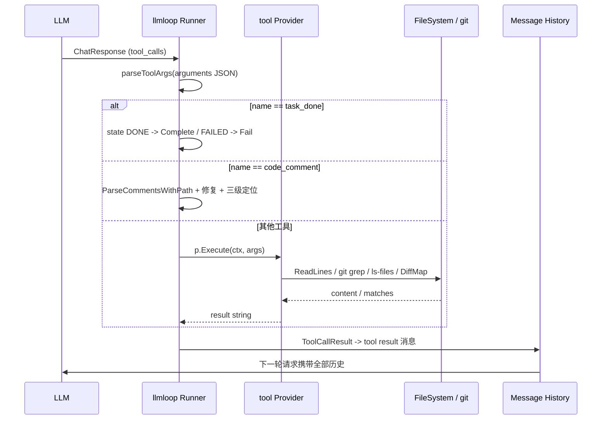
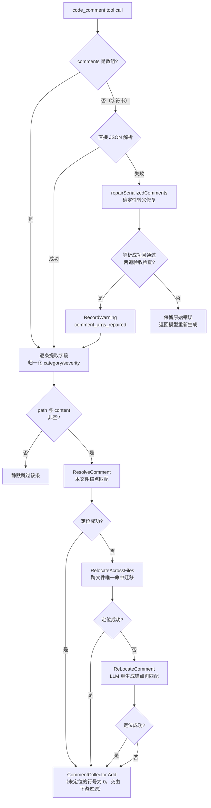

# Agent 工具系统

> **关联源码**：`internal/tool/`
> **前置阅读**：[00-overview.md](00-overview.md)、[06-agent-loop.md](06-agent-loop.md)

## 目录

- [1. 模块职责与定位](#1-模块职责与定位)
- [2. 工具注册与 JSON Schema](#2-工具注册与-json-schema)
- [3. file_read：整文件与行窗口读取](#3-file_read整文件与行窗口读取)
- [4. file_read_diff：diff 范围读取](#4-file_read_diffdiff-范围读取)
- [5. code_search：基于 git grep 的代码搜索](#5-code_search基于-git-grep-的代码搜索)
- [6. file_find：文件定位](#6-file_find文件定位)
- [7. code_comment：评论提交与定位链](#7-code_comment评论提交与定位链)
- [8. 评论收集器](#8-评论收集器)
- [9. response_message.go：工具结果的回注协议](#9-response_messagego工具结果的回注协议)
- [10. stub.go：测试替身](#10-stubgo测试替身)
- [11. 工具集设计意图复盘](#11-工具集设计意图复盘)
- [12. 源文件覆盖清单](#12-源文件覆盖清单)

---

## 1. 模块职责与定位

`internal/tool` 是 Agent 的"手"：当 LLM 在审查循环中发出 tool call 时，[llmloop](../../internal/llmloop/loop.go#L588) 的 `executeToolCall` 负责把调用名解析为本包注册的 `Provider`，执行后把结果字符串回注到消息历史，供模型下一轮消费。本包因此承担四件事：

1. **工具身份与注册表**：[definitions.go](../../internal/tool/definitions.go#L13-L106) 定义 `Tool` 值类型、`Provider` 接口与并发安全的 `Registry`；
2. **检索类工具实现**：file_read / file_read_diff / code_search / file_find，全部只读；
3. **输出类工具**：code_comment——唯一的"写"动作，且写的只是进程内的 `CommentCollector`，不落盘、不发网络请求；
4. **参数解析与自愈**：评论参数的字段提取、category/severity 归一化，以及序列化字符串参数的确定性修复（[comment_args_repair.go](../../internal/tool/comment_args_repair.go#L98-L151)）。

「场景化工具集」是 README 对这套工具的表述（"distilled from large-scale production traces"）。剥开营销措辞看源码，其真实形态是一个刻意收窄的安全边界：**六个工具里没有任意 shell 执行、没有文件写入、没有网络访问**，检索工具全部走 git 或受控的文件系统读取，输出工具只产出结构化评论对象。这与 Claude Code 式"通用工具箱 + 权限确认"是两种完全不同的信任模型——OCR 不给模型犯错的机会，而不是在模型犯错时拦截。

**图 7-1**：工具调用全链路（LLM 视角的请求-执行-回注循环）



（分发细节见第 7 节；回注协议见第 9 节。）

## 2. 工具注册与 JSON Schema

### 2.1 Tool 类型与 Registry

[definitions.go](../../internal/tool/definitions.go#L17-L25) 预定义了六个具名工具加一个 `Unknown` 哨兵。`OfName` 做名字反查（查不到返回 `Unknown`），`IsReserved` 供外部（如 MCP 工具名）检查是否与内置工具重名，`Dynamic` 为 MCP 等动态发现的工具创建带名字的 `Tool` 实例——传入空名或保留名会直接 panic（[definitions.go](../../internal/tool/definitions.go#L51-L59)）。

```go
type Provider interface {
    Tool() Tool
    Execute(ctx context.Context, args map[string]any) (string, error)
}
```

`Provider` 接口（[definitions.go](../../internal/tool/definitions.go#L71-L76)）刻意极简：入参是已反序列化的 `map[string]any`，出参是回给模型的字符串。`Registry`（[definitions.go](../../internal/tool/definitions.go#L79-L106)）是 `map[name]Provider` 加一个 `frozen` 标志——`Freeze` 之后再次 `Register` 会 panic，以此把"注册期"与"并发读期"在时间上切开，避免加锁。

### 2.2 tools.json 的双重角色

[tools.json](../../internal/config/toolsconfig/tools.json) 经 [toolsconfig.go](../../internal/config/toolsconfig/toolsconfig.go#L22-L43) 以 `go:embed` 打进二进制（可用 `--tools` flag 覆盖路径，见 [shared_flags.go](../../cmd/opencodereview/shared_flags.go#L69-L71)）。每个条目有三个字段：

| 字段 | 作用 |
|---|---|
| `name` | 工具名，与 `definitions.go` 的具名值对应 |
| `plan_task` / `main_task` | 阶段开关：Plan 阶段只暴露 `plan_task:true` 的工具，Main 阶段暴露 `main_task:true` 的（[toolsconfig.go](../../internal/config/toolsconfig/toolsconfig.go#L48-L57)） |
| `definition` | 完整的 OpenAI function 定义（description + JSON Schema），**这就是发给 LLM 的工具说明** |

也就是说 tools.json 同时是"给 LLM 看的说明书"（description 里带示例输出、使用策略、限制说明）和"schema 来源"。[shared.go](../../cmd/opencodereview/shared.go#L219-L224) 的 `loadLLMRuntime` 把它解析成 `planToolDefs` / `mainToolDefs` 两组 `llm.ToolDef`（解析失败的工具打 WARNING 跳过，见 [agent.go](../../internal/agent/agent.go#L2176-L2195) 的 `BuildToolDefs`）。

### 2.3 工具全清单

注册入口是 [review_cmd.go](../../cmd/opencodereview/review_cmd.go#L581-L589) 的 `buildToolRegistry`（scan 命令复用同一函数，见 [scan_cmd.go](../../cmd/opencodereview/scan_cmd.go#L196)）：注册五个 Provider；**task_done 不是 Provider**，它在 loop 分发层内联处理（见 7.1）。MCP 工具随后追加进同一个 Registry（[review_cmd.go](../../cmd/opencodereview/review_cmd.go#L576)）。

| 工具名 | 用途 | 是否只读 | 阶段（plan/main） | schema 关键参数 |
|---|---|---|---|---|
| `task_done` | 终止任务，宣告完成或失败 | 控制信号 | false / true | `state`: DONE\|FAILED（必填） |
| `code_comment` | 提交结构化审查评论 | 只写内存 | false / true | `comments[]`: content, existing_code, suggestion_code, category, severity, path |
| `file_read` | 按行窗口读文件（新版内容） | 只读 | false / true | `file_path`（必填）, start_line, end_line |
| `file_read_diff` | 读指定文件的 diff 文本 | 只读 | true / true | `path_array[]`（必填） |
| `code_search` | 全库文本/正则搜索 | 只读 | true / true | `search_text`（必填）, file_patterns[], case_sensitive, use_perl_regexp |
| `file_find` | 按文件名/路径子串定位文件 | 只读 | true / true | `query_name`（必填）, case_sensitive |

值得注意的是阶段划分本身就是一个设计信号：Plan 阶段（评估分组、决定审查顺序）只给三个"侦察"工具（code_search / file_read_diff / file_find），file_read 与 code_comment 留给 Main 阶段——计划期不需要读全文，更不允许提前下评论。

## 3. file_read：整文件与行窗口读取

### 3.1 参数 schema

| 参数 | 类型 | 必填 | 默认 | 语义 |
|---|---|---|---|---|
| `file_path` | string | 是 | - | 相对仓库根的路径 |
| `start_line` | integer | 否 | 1 | 1-based 起始行 |
| `end_line` | integer | 否 | 0（读到文件尾） | 1-based 结束行 |

### 3.2 截断策略

[file_read.go](../../internal/tool/file_read.go#L12) 定死单次读取上限 `fileReadMaxLines = 500`。执行逻辑（[file_read.go](../../internal/tool/file_read.go#L23-L77)）：

- `requested = end_line - start_line + 1`，`requested <= 0` 直接报错；否则 `maxLines = min(500, requested)`；
- `start_line - 1 >= totalLines` 时返回 `"file %q has only %d lines..."`——LLM 给的行号越界会得到明确的行数提示，模型可据此修正后重试；
- 截断判定不在读取层而在展示层：`fullRange > 500` 时输出 `IS_TRUNCATED: true` 并附 "Please narrow your line range" 提示。

输出格式是给模型的结构化契约（tools.json 描述里有逐字示例）：

```
File: path/to/example.go (Total lines: 50)
IS_TRUNCATED: false
LINE_RANGE: 10-12
10|func main() {
11|  fmt.Println("Hello, World!")
12|}
```

tools.json 的 description 还教模型从 diff hunk header `@@-x,y +m,n@@` 推导上下文窗口（如"前后各读 50 行"设 `start_line = m - 50, end_line = m + n + 50`，[tools.json](../../internal/config/toolsconfig/tools.json#L142)），以及一个关键限制："只能读到修改后的版本"。

### 3.3 filereader.go 走读：三种审查模式的统一读取层

`FileReader` 是 file_read / code_search / file_find 共享的底层（[filereader.go](../../internal/tool/filereader.go#L58-L65)），按 `ReviewMode` 分派：

- **ModeWorkspace**：直接读磁盘。路径安全由 `resolveWorkspacePath` 保证（[filereader.go](../../internal/tool/filereader.go#L94-L116)）：`filepath.Join` 后检查 `pathutil.WithinBase`（防 `..` 逃逸），再 `EvalSymlinks` 后**二次**检查 WithinBase（防符号链接出仓）；
- **ModeRange / ModeCommit**：`git -c core.quotepath=false show --end-of-options <Ref>:<path>`（30 秒超时，[filereader.go](../../internal/tool/filereader.go#L118-L138)），保证读到的是被审查 commit 的内容而非工作区当前态。

`ReadLines`（[filereader.go](../../internal/tool/filereader.go#L142-L153)）是 file_read 的实际入口，核心是 `scanLines`（[filereader.go](../../internal/tool/filereader.go#L158-L191)）：逐行流式扫描，跳过前 `startLine-1` 行，最多收集 `maxLines` 行，同时统计总行数；行尾统一剥 `\n` 与 `\r`；文件以换行结尾时会补一个空行计数，与 `strings.Split(content, "\n")` 语义对齐。git 模式下通过 `Runner.Stream`（或手动 `StdoutPipe`）流式消费 stdout——大文件不会整体进内存（[filereader.go](../../internal/tool/filereader.go#L207-L248)）。

## 4. file_read_diff：diff 范围读取

### 4.1 参数 schema

| 参数 | 类型 | 必填 | 语义 |
|---|---|---|---|
| `path_array` | string[] | 是 | 想看 diff 的文件路径列表 |

### 4.2 机制：预解析快照，而非实时计算

`FileReadDiffProvider` 持有一份 `DiffMap`——构造即冻结的 `map[路径]diff 文本` 拷贝（[file_read_diff.go](../../internal/tool/file_read_diff.go#L13-L30)）。执行时（[file_read_diff.go](../../internal/tool/file_read_diff.go#L48-L74)）按 `path_array` 逐个取值，用 `==== FILE: path ====` 分隔拼接；全部 miss 返回 `"Error: diff not found for the requested paths"`，空数组返回 `"Error: no files found"`。

快照的注入发生在两条流水线里：

- review：[agent.go](../../internal/agent/agent.go#L573-L587) 的 `injectDiffMap` 把已解析的 diff（排除 `/dev/null` 的删除文件）灌进去；
- scan：[scan/agent.go](../../internal/scan/agent.go#L412-L426) 的 `injectScanContentMap` 灌的是**全文件内容**——scan 没有 diff，用整文件顶替，让模型调这个工具时不至于扑空。

注册时先传空 `DiffMap{}`，Agent 启动后、并发开始前用 `SetDiffMap` 替换（[file_read_diff.go](../../internal/tool/file_read_diff.go#L41-L44)）——这就是 Registry 不加锁也安全的时间边界。

### 4.3 为什么不直接用 file_read

三个理由，全部可从源码推出：其一，diff 文本是 token 密度最高的形态（只含变更块及上下文，带 `+/-` 标记），工具描述明确说"查看其他变更文件以确认问题是否真实存在"（[tools.json](../../internal/config/toolsconfig/tools.json#L171)）——审查中判断"这个改动是否被别处改动抵消"需要的是对侧视角，不是全文；其二，Range/Commit 模式下 file_read 走 `git show` 读单文件全文，而 diff 快照是一次性预解析的批量数据；其三，scan 模式根本没有 diff 与全文之分，同一个工具语义被复用为"读待扫描文件内容"。

## 5. code_search：基于 git grep 的代码搜索

### 5.1 参数 schema

| 参数 | 类型 | 必填 | 默认 | 语义 |
|---|---|---|---|---|
| `search_text` | string | 是 | - | 搜索文本或正则 |
| `file_patterns` | string[] | 否 | 空（全库） | git pathspec，支持 `:(exclude)*_test.go` 等语法 |
| `case_sensitive` | boolean | 否 | false | 大小写敏感 |
| `use_perl_regexp` | boolean | 否 | false | true 时 `-P` Perl 正则；false 时 `-F` 字面量 |

### 5.2 实现：git grep，而非自研正则引擎

这是本包里防御最密集的工具。`buildGrepArgs`（[code_search.go](../../internal/tool/code_search.go#L58-L99)）拼装命令行：

```
git --no-pager grep [--untracked | --no-index --exclude-standard]
    [-i] [-P | -F] -n --no-color --max-count 100
    -e <search_text> [<ref>] -- <pathspec...>
```

防御点逐条对应源码：

- **搜索词注入**：`-e searchText` 显式标记 pattern 起点，配合 `--` 结束 option 区；
- **ref 注入**：ref 以 `-` 开头直接拒绝（[code_search.go](../../internal/tool/code_search.go#L84-L91)）。注释说明 git grep < 2.45 不支持 `--end-of-options`，这是全仓库唯一无法用该分隔符的 git 调用，只能前置校验兜底（上游 `validateReviewRefs` 已拦一道，此处是纵深防御）；
- **pathspec 逃逸**：`file_patterns` 含 `..` 路径段直接返回错误（[code_search.go](../../internal/tool/code_search.go#L40-L44) 与 [L101-L108](../../internal/tool/code_search.go#L101-L108)）；
- **资源上限**：单文件 `--max-count 100`（[code_search.go](../../internal/tool/code_search.go#L18-L20) 定义 `gitGrepMaxCount = 100`、`gitGrepTimeout = 10s`），整体 10 秒超时；超时报错文案还提示模型"narrow file_patterns"（[code_search.go](../../internal/tool/code_search.go#L154-L156)）。

### 5.3 非 git 目录的降级与结果呈现

`gitGrep`（[code_search.go](../../internal/tool/code_search.go#L136-L238)）有一条明确的降级路径：工作区模式（无 ref）下 `git grep` 以 exit 128 "not a git repository" 失败时，用 `--no-index --exclude-standard` 重试——直接搜工作树但仍尊重 `.gitignore`（[code_search.go](../../internal/tool/code_search.go#L144-L151)）。这让 `ocr scan` 在普通目录上可用。exit 1 且 stderr 为空被识别为"无匹配"，返回友好的 `"No matches found"`（[code_search.go](../../internal/tool/code_search.go#L166-L168)）。

输出按文件分组聚合：`File: <path>` + `Match lines: <n>`，每个匹配一行 `<行号>|<内容>`（[code_search.go](../../internal/tool/code_search.go#L224-L231)）；ref 模式下 git 输出多一个 ref 前缀字段，解析时 `splitN` 从 3 段切到 4 段（[code_search.go](../../internal/tool/code_search.go#L188-L194)）。当输出总行数达到 100 时，头部插入截断提示 "Only showing first 100 results"（[code_search.go](../../internal/tool/code_search.go#L196-L199)）。stderr 有内容但 stdout 非空时（如部分匹配成功部分告警），把 stderr 作为 Warning 追加在结果尾部（[code_search.go](../../internal/tool/code_search.go#L233-L235)）。

## 6. file_find：文件定位

### 6.1 参数 schema

| 参数 | 类型 | 必填 | 默认 | 语义 |
|---|---|---|---|---|
| `query_name` | string | 是 | - | 文件名关键词（子串匹配） |
| `case_sensitive` | boolean | 否 | false | 大小写敏感 |

### 6.2 语义：子串包含，不是 glob

先回答大纲的问题：**没有 doublestar，没有任何 glob 语义**。实现是两轮"包含匹配"（[file_find.go](../../internal/tool/file_find.go#L57-L91)）：第一轮对每个文件的 basename 做 `strings.Contains`；若零命中，第二轮退化为对完整仓库相对路径做 Contains（支持 `pkg/util`、`internal/diff` 这类目录级查询）。tools.json 的 description 对此有准确描述（[tools.json](../../internal/config/toolsconfig/tools.json#L195)）。Windows 风格的 `\` 分隔符会被归一化为 `/`（[file_find.go](../../internal/tool/file_find.go#L40-L41)），保证跨平台查询一致。

结果上限 `fileFindMaxCount = 100`，超限截断；查询为空白时返回 `"// The file was not found"`（[file_find.go](../../internal/tool/file_find.go#L33-L36)），零命中同文案。

### 6.3 文件清单的三个来源

`listGitFiles`（[file_find.go](../../internal/tool/file_find.go#L101-L151)）按模式选择：

- ref 模式：`git ls-tree -r --name-only --end-of-options <ref>`（列出被审查 ref 上的文件树）；
- 工作区：`git ls-files --cached --others --exclude-standard`（tracked + untracked，尊重 .gitignore）；
- **非 git 目录降级**：exit 128 且无 ref 时走 `listWalkFiles`（[file_find.go](../../internal/tool/file_find.go#L157-L200)）——`filepath.WalkDir` 遍历，复用 diff 包的 `LoadGitignorePatterns` + `IsPathExcluded`（.git、node_modules、vendor 等默认黑名单）。

整个调用 10 秒超时（[file_find.go](../../internal/tool/file_find.go#L19-L21)）。文件清单还要过 `shouldSkipFile`（[file_find.go](../../internal/tool/file_find.go#L204-L219)）：无扩展名的文件默认跳过，仅 Makefile / Dockerfile / LICENSE / Vagrantfile / Containerfile 白名单放行——把二进制和生成物挡在 LLM 视野之外。

## 7. code_comment：评论提交与定位链

这是整个工具系统的核心，也是"受控输出"设计的落点。

### 7.1 参数 schema（tools.json）

`comments` 是数组，每个元素（[tools.json](../../internal/config/toolsconfig/tools.json#L36-L91)）：

| 字段 | 类型 | 必填 | 语义 |
|---|---|---|---|
| `content` | string | 是 | 评论正文（问题描述 + 建议） |
| `existing_code` | string | 是 | **定位锚点**：diff 中连续的新增/上下文代码行，需与 diff 逐字符匹配 |
| `suggestion_code` | string | 否 | 建议的替换代码 |
| `category` | enum | 是 | bug / security / performance / maintainability / test / style / documentation / other |
| `severity` | enum | 是 | critical / high / medium / low |
| `path` | string | 是 | 相对文件路径 |

**schema 里没有行号参数。** 这是本工具最反直觉的设计：LLM 不直接给行号，而是给代码锚点，行号由确定性算法事后解析。tools.json 的 description 把这一点讲得很直白："uses a dynamic sliding window algorithm to match corresponding consecutive lines in diff text based on your provided 'existing_code'"（[tools.json](../../internal/config/toolsconfig/tools.json#L33)）。这直接回应了 README 批评通用 Agent 的 "position drift" 痛点——行号是算出来的，不是模型猜出来的。

### 7.2 分发结构：Provider 是准入证，执行在 loop 层

一个必须写清的架构事实：`buildToolRegistry` 注册了 `CodeCommentProvider`（[review_cmd.go](../../cmd/opencodereview/review_cmd.go#L587)），但 loop 分发时（[loop.go](../../internal/llmloop/loop.go#L635)）先做 `Tools.Get(name)` 存在性检查（查不到返回 `NotAvailableMsg`），随后 `if t == tool.CodeComment` **拦截进入专门分支，不再调用 `p.Execute`**。`CodeCommentProvider.Execute`（[code_comment.go](../../internal/tool/code_comment.go#L56-L70)）这个直通路径（解析→逐条 `Collector.Add`→返回 `CommentSucceed`）实际只在单元测试中执行（[code_comment_test.go](../../internal/tool/code_comment_test.go#L296-L333)）；生产流量走的是 loop 里的增强版：带 path 兜底、修复告警、thinking 传播、三级定位与异步收集。

### 7.3 行号校验：三级定位链

loop 的 `resolveAndCollect` 闭包（[loop.go](../../internal/llmloop/loop.go#L667-L727)）对每条评论依次尝试：

1. **本文件锚点匹配**：`DiffLookup(cm.Path)` 取 diff，`diff.ResolveComment`（[resolver.go](../../internal/diff/resolver.go#L62-L73)）先在 hunk 的新侧（context+added）找连续行匹配，再退到旧侧（context+deleted），最后退到对新文件全文逐行扫描（[resolver.go](../../internal/diff/resolver.go#L151-L181)）。匹配前每行做规范化：去首尾空白、剥 `+`/`-` 前缀，空行跳过（[resolver.go](../../internal/diff/resolver.go#L301-L306)）——所以"连续"指相邻非空行；
2. **跨文件重定位**：锚点匹配失败时（典型场景：模型读了 header 文件的 diff，却把评论标到了实现文件上），`RelocateAcrossFiles`（[resolver.go](../../internal/diff/resolver.go#L100-L139)）在其余所有 diff 里做纯字符串匹配，**仅唯一命中才迁移**（Path 与行号一起搬），零命中或多命中都放弃。成功时 loop 记 `comment_refiled` 告警（[loop.go](../../internal/llmloop/loop.go#L683-L687)）；
3. **LLM 重定位**：仍未定位且配置了 ReLocationTask 模板时，`ReLocateComment`（[relocation.go](../../internal/diff/relocation.go#L49-L95)）发起一次独立 LLM 调用——prompt 含原 diff、`existing_code`、评论内容（[relocation.go](../../internal/diff/relocation.go#L28-L42)），要求模型在 fenced code block 里重新给出锚点片段（[relocation.go](../../internal/diff/relocation.go#L99-L117) 的 `extractCodeBlock` 提取），用新锚点重试 `ResolveComment`；失败则恢复原 `ExistingCode`（[relocation.go](../../internal/diff/relocation.go#L88-L94)）。

三级之后无论定位与否，评论都会 `CommentCollector.Add` 入列（[loop.go](../../internal/llmloop/loop.go#L725)）——未定位的评论行号为 0，其去留交给下游的反思/过滤阶段（08 篇详述）。

所以"LLM 给的行号越界时怎么办"的准确答案是：**code_comment 通道里 LLM 从不提供行号**；行号由锚点匹配确定，锚点失配走上述三级回退。file_read 通道里 LLM 才提供行号，越界时返回带总行数的错误文本让模型自纠（见 3.2）。

### 7.4 comment_args_repair.go：确定性参数修复

修复的靶子是一个真实的生产缺陷：模型偶尔把本应是数组的 `comments` 序列化成字符串，且少转义了一层——正文里的裸引号让整个 batch 解析失败（[comment_args_repair.go](../../internal/tool/comment_args_repair.go#L13-L19) 的注释把病理讲得很清楚）。

修复是**进程内的确定性字符串手术，没有修复 prompt，也没有 LLM 参与**（这一点与"构造修复 prompt 重试"的直觉相反）：

- `repairSerializedComments`（[comment_args_repair.go](../../internal/tool/comment_args_repair.go#L98-L151)）：逐字节状态机扫描。字符串内遇到引号，看其后第一个非空白字节是否为 `, } ] :` 或文本结束——是则判为真终止符，否则是内容引号，补 `\` 转义；裸控制字符（< 0x20）转成 `\n`/`\r`/`\t`/`\b`/`\f` 或 `\u00XX`；不构成合法转义序列的反斜杠补成 `\\`。逐字节扫描对 UTF-8 安全（continuation byte 均 >= 0x80，不会误判）；
- 修复后还要过两道验收才被接受（`parseRepairedComments`，[comment_args_repair.go](../../internal/tool/comment_args_repair.go#L275-L291)）：
  - `repairedCommentsAcceptable`（[L188-L208](../../internal/tool/comment_args_repair.go#L188-L208)）：每个条目必须是带非空 content 的对象；不得出现 schema 之外的未知字段（防止把散文误读成结构）；条目数不得少于原文 `"content":` 出现次数（防止把两条评论熔成一条）；
  - `hasSuspectTruncation`（[L242-L255](../../internal/tool/comment_args_repair.go#L242-L255)）：content / existing_code / suggestion_code / path 任一值内引号数为**奇数**即整批拒绝——奇数引号是"值在误判的终止符处被截断"的指纹。thinking 字段刻意豁免（[L210-L215](../../internal/tool/comment_args_repair.go#L210-L215)）：截断的 thinking 只影响诊断输出，不值得为它放弃一次可靠的恢复。
- 修复被接受时，loop 记录 `comment_args_repaired` 告警（[loop.go](../../internal/llmloop/loop.go#L640-L645)）——模型看到的是普通成功，这条告警是 schema 违约唯一的留痕；修复被拒绝时保留原始解析错误返回给模型，且刻意沿用解析器的 "invalid character" 措辞而非点破 schema 违约，因为前者促使模型**重新生成整批**，后者会让模型原样重发坏字符串（[code_comment.go](../../internal/tool/code_comment.go#L104-L109)）。

**图 7-2**：code_comment 参数解析、修复与定位流程



（图注：`comments` 为数组时也可能整批为空——此时返回带原始 args 的错误提示；数组内单条字段缺失只是静默跳过，不触发重试，见 [code_comment.go](../../internal/tool/code_comment.go#L154-L156)。）

### 7.5 字段归一化与兜底

`parseCommentsInner`（[code_comment.go](../../internal/tool/code_comment.go#L94-L161)）逐条提取字段时做了温和的归一化：category 非法（含大小写不同）归为 `other`（[code_comment.go](../../internal/tool/code_comment.go#L163-L169)），severity 非法归为 `low`（[L171-L177](../../internal/tool/code_comment.go#L171-L177)）——宁可降级也不丢评论。`path` 缺失时回退到 `defaultPath`（生产调用方传的是 loop 的 `taskKey`，即当前审查文件组的键，[loop.go](../../internal/llmloop/loop.go#L639)）。模型同一轮的 reasoning content 会批量填充给没有自带 thinking 的评论（[loop.go](../../internal/llmloop/loop.go#L658-L665)）。

## 8. 评论收集器

[comment_collector.go](../../internal/tool/comment_collector.go#L12-L17) 是一个带互斥锁的 append-only 切片，**每个 Agent 实例独享一个**（跨 repo 的审查互不污染）。API 分三组：

| API | 行号 | 用途 |
|---|---|---|
| `Add` / `Comments` / `CommentsForPath` | [L25-L51](../../internal/tool/comment_collector.go#L25-L51) | 基础读写，`Comments` 返回拷贝 |
| `Snapshot` / `Since` / `ReplaceSince` | [L56-L92](../../internal/tool/comment_collector.go#L56-L92) | 批级操作原语：拍快照→跑一批→对增量做去重→把去重结果替换回去 |
| `RemoveByPathAndIndices` | [L96-L116](../../internal/tool/comment_collector.go#L96-L116) | 按路径内序号删除，删除后把尾部残留元素清零，防数据残留 |

需要澄清大纲的一个预设：**收集器本身不做去重、排序或数量上限**——它是纯存储。去重/聚合/上限策略全部发生在调用方（审查流水线的评论反思与过滤阶段，Snapshot/ReplaceSince 注释里写的 "batch-level dedup" 场景即为此准备，详见 08 篇）。另外注意评论收集有异步路径：配置了 `CommentWorkerPool` 时，`code_comment` 的定位与入列被提交到线程池，工具立即返回 `CommentSucceed`，会话里结果记为 `(async)`（[loop.go](../../internal/llmloop/loop.go#L729-L748)）——所以"Add 完成"与"模型收到成功"之间存在时间差，这是收集器必须线程安全的直接原因。

## 9. response_message.go：工具结果的回注协议

这个文件名有几分误导——它不解析模型输出，而是定义**工具执行结果如何变成消息历史的一部分、以及如何向循环层传递控制信号**：

- `ToolCallResult{ToolCallID, Name, Result}`（[response_message.go](../../internal/tool/response_message.go#L7-L11)）：loop 在每轮把各 tool call 的执行结果打包成这个结构（[loop.go](../../internal/llmloop/loop.go#L449-L468)：Completed → "Task completed successfully."，Data 非空 → 原文，两者皆空 → "Error: Tool execution returned no result."），随后拼进下一轮请求的消息历史；
- `TaskCheckpoint{Data, Completed, Failed}` 及 `Complete` / `Fail` / `Of` 构造器（[response_message.go](../../internal/tool/response_message.go#L14-L27)）：每个 `Provider.Execute` 的调用都以 checkpoint 收尾。`task_done` 的 DONE 映射 `Complete`、FAILED 映射 `Fail`（映射逻辑内联在 [loop.go](../../internal/llmloop/loop.go#L591-L612)，不经 Provider）；`Fail` 会终止整个任务并上抛错误（[loop.go](../../internal/llmloop/loop.go#L446-L447)）；
- 常量 `CommentSucceed`（"Successfully commented."，[response_message.go](../../internal/tool/response_message.go#L29)）与 `ToolNotFoundMsg`（[L30](../../internal/tool/response_message.go#L30)）。后者与 [definitions.go](../../internal/tool/definitions.go#L112) 的 `NotAvailableMsg` 文本逐字相同，但全仓库只有后者被 loop 使用——`ToolNotFoundMsg` 无任何引用（待与维护者确认：是遗留还是有意保留的兼容别名）。

task_done 虽不经 Provider，但同样有 tools.json schema（[tools.json](../../internal/config/toolsconfig/tools.json#L10-L24)），补全它的参数表：

| 参数 | 类型 | 必填 | 语义 |
|---|---|---|---|
| `state` | enum: DONE / FAILED | 是（schema 声明必填） | DONE 宣告任务完成；FAILED 表示现有工具无法完成任务。运行时缺失 state 按 DONE 处理、非法值返回错误提示（[loop.go](../../internal/llmloop/loop.go#L591-L612)），比 schema 声明更宽容 |

顺带回应大纲第 9 节的预设："模型文本输出中结构化评论的解析"在源码中**不存在**。全仓库唯一的评论通道是 `code_comment` tool call；对模型纯文本做结构化提取的地方只有一处——重定位场景从 LLM 回复里抽 fenced code block（[relocation.go](../../internal/diff/relocation.go#L99-L117)），且那是锚点不是评论。若曾设想过"文本通道评论"，现无痕迹（待与维护者确认）。

## 10. stub.go：测试替身

[stub.go](../../internal/tool/stub.go#L8-L20) 提供两个通用替身：

- `StubProvider`：对任何调用返回 `NotAvailableMsg`。生产代码不使用，当前使用方是测试（[definitions_test.go](../../internal/tool/definitions_test.go#L50-L83) 验证 Registry 的注册/查找/Freeze 语义、[mcp/provider_test.go](../../internal/mcp/provider_test.go#L84-L101) 验证 MCP 工具与既有注册重名时保留原 Provider 不覆盖）。注释自述用途是"用户未注册真实实现时的兜底"，但 CLI 两条流水线都会经 `buildToolRegistry` 注册全部五个 Provider，该兜底未被动用；
- `BuiltinToolProvider`（[stub.go](../../internal/tool/stub.go#L22-L35)）：把一个闭包适配成 `Provider` 的语法糖，供测试构造任意行为的工具。

它们与 `Dynamic(name)`（[definitions.go](../../internal/tool/definitions.go#L51-L59)）一起，构成"具名工具之外"的扩展面：MCP 工具经 `Dynamic` 获得名字、经 `StubProvider`/自定义 Provider 获得可替换的实现，注册进同一个 Registry 参与统一分发（MCP 详见 11 篇）。

## 11. 工具集设计意图复盘

### 11.1 逐工具复盘

| 工具 | 纳入理由（源码可见的设计意图） |
|---|---|
| `file_read` | diff 只有变更块，判断问题常需上下文；hunk header 策略写进 description 引导模型定向读取，500 行上限控制 token |
| `file_read_diff` | 跨文件确认（"这个改动是否被别处抵消"）是审查刚需；快照式读取零成本且天然只读 |
| `code_search` | 调用点/定义点追踪（description 里的正则示例全是此类用法）；底层 git grep 复用仓库索引 |
| `file_find` | 模型在变更文件列表里找不到相关文件时的入口；basename 优先保精度、全路径兜底保召回 |
| `code_comment` | 唯一输出通道：结构化、带锚点定位、按严重度/类别分类——为下游确定性过滤与多平台投递（CLI/IDE/PR 评论）提供统一格式 |
| `task_done` | 显式终止协议：模型宣告完成或失败，loop 据此停轮（配合 06 篇的 stop budget 防无限循环）；grace 轮只保留 code_comment + task_done 两个工具催收遗漏（[loop.go](../../internal/llmloop/loop.go#L570-L578)） |

### 11.2 安全边界：为什么没有 shell 与写文件

把通用 agent 工具箱（任意 shell 执行、文件写入、网络访问）与本工具集对比，差异不是功能多少而是**信任模型**。通用工具箱假设模型可以犯错、靠权限确认拦截；这里直接不提供犯错面：

- **文件读取**：路径双重防逃逸（join 后 + symlink 解析后各查一次 WithinBase，[filereader.go](../../internal/tool/filereader.go#L94-L116)），500 行/次的量级钳制；
- **搜索**：注入防御成体系（`-e`、`--`、`--end-of-options`、ref 前置校验、pathspec `..` 拒绝），10 秒超时 + 100 条截断双重限流；
- **文件定位**：清单来自 git 索引或受控遍历（.gitignore + 黑名单），结果 100 条封顶，扩展名白名单过滤生成物；
- **评论提交**：唯一"写"操作只写进程内 Collector；位置不是模型说了算，是锚点匹配说了算；
- **超时全覆盖**：git show 30s、grep/ls 10s，单个工具故障不会拖垮整个审查。

这套边界与 00 篇引用的 README 主张（"纯语言驱动缺乏硬约束"）互为表里：工具层就是硬约束在 Agent 能力面上的投影。

### 11.3 对 README 主张的核对

README 称工具集"从大规模生产数据的工具调用轨迹蒸馏而来（调用频率分布、单工具重复率、新工具对调用链的影响）"。源码中可与之互证的痕迹有：阶段化启用（plan_task 过滤掉 Plan 期用不上的工具）、每个 description 里精确到示例输出的使用说明与显式 Limitations 段、以及各处量级参数（500 行、100 条、10 秒）透出的"从真实负载校准"气味。但蒸馏过程本身（轨迹如何采集、参数如何拟合）没有任何代码或数据可查——这一主张在仓库内不可证，读者宜将其视为设计动机的叙事而非可验证事实（待与维护者确认）。

## 12. 源文件覆盖清单

| 源文件 | 职责 | 关键符号 |
|---|---|---|
| [definitions.go](../../internal/tool/definitions.go) | Tool 值类型、Provider 接口、Registry（freeze 语义）、Dynamic 工具名 | `Tool`, `Provider`, `Registry`, `OfName`, `Dynamic`, `NotAvailableMsg` |
| [code_comment.go](../../internal/tool/code_comment.go) | code_comment Provider 与参数解析、category/severity 归一化 | `CodeCommentProvider`, `ParseComments`, `ParseCommentsWithPath`, `parseCommentsInner`, `normalizeCodeCommentCategory` |
| [code_search.go](../../internal/tool/code_search.go) | 基于 git grep 的搜索，注入防御与结果聚合 | `CodeSearchProvider`, `buildGrepArgs`, `gitGrep`, `isNotGitRepoError`, `hasTraversalPathComponent` |
| [file_read.go](../../internal/tool/file_read.go) | file_read Provider：行窗口读取与截断展示 | `FileReadProvider`, `fileReadMaxLines` |
| [file_read_diff.go](../../internal/tool/file_read_diff.go) | file_read_diff Provider 与冻结式 DiffMap | `DiffMap`, `NewDiffMap`, `FileReadDiffProvider`, `SetDiffMap` |
| [file_find.go](../../internal/tool/file_find.go) | file_find Provider：子串匹配定位 + git/遍历清单 | `FileFindProvider`, `listGitFiles`, `listWalkFiles`, `shouldSkipFile` |
| [filereader.go](../../internal/tool/filereader.go) | 三模式统一读取层：磁盘/git show、路径防逃逸、流式行窗口 | `FileReader`, `ReviewMode`, `ParseReviewMode`, `Read`, `ReadLines`, `scanLines`, `resolveWorkspacePath` |
| [comment_collector.go](../../internal/tool/comment_collector.go) | per-Agent 线程安全评论存储与批级操作原语 | `CommentCollector`, `Add`, `Snapshot`, `Since`, `ReplaceSince`, `RemoveByPathAndIndices` |
| [comment_args_repair.go](../../internal/tool/comment_args_repair.go) | 序列化 comments 字符串的确定性修复与验收 | `repairSerializedComments`, `repairedCommentsAcceptable`, `hasSuspectTruncation`, `parseRepairedComments`, `CommentRepair` |
| [response_message.go](../../internal/tool/response_message.go) | 工具结果回注结构（ToolCallResult）与循环控制信号（TaskCheckpoint） | `ToolCallResult`, `TaskCheckpoint`, `Complete`, `Fail`, `Of`, `CommentSucceed` |
| [stub.go](../../internal/tool/stub.go) | 测试替身：恒返回不可用的 StubProvider 与闭包适配器 | `StubProvider`, `NewStub`, `BuiltinToolProvider`, `NewBuiltin` |

（`internal/tool/` 下共 11 个非测试 `.go` 文件，与 `Glob` 结果一致，无遗漏；`*_test.go` 共 12 个，未列入。）

---

**待与维护者确认项汇总**：

1. `ToolNotFoundMsg`（[response_message.go](../../internal/tool/response_message.go#L30)）与 `NotAvailableMsg`（[definitions.go](../../internal/tool/definitions.go#L112)）文本完全相同，前者无任何引用方——是否为遗留死常量或有意保留的兼容别名；
2. README 的"工具集从生产数据蒸馏"主张在仓库内无代码/数据佐证，蒸馏方法（轨迹采集与参数拟合）是否曾开源或计划开源；
3. `CodeCommentProvider.Execute` 直通路径（[code_comment.go](../../internal/tool/code_comment.go#L56-L70)）在生产流量中被 loop 层拦截旁路，仅测试可达——是否有计划将其与 loop 内的增强路径（`ParseCommentsWithPath` + 定位链）合并，还是维持"注册即准入、执行走 loop"的现状。
