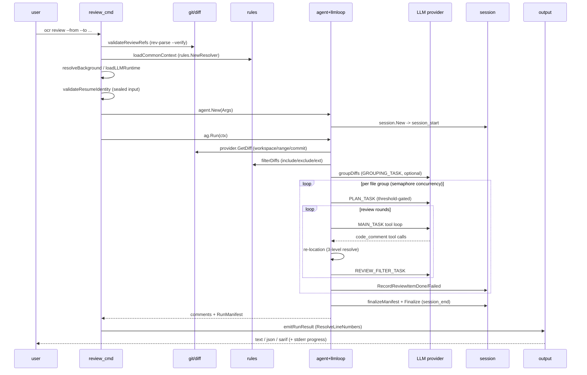
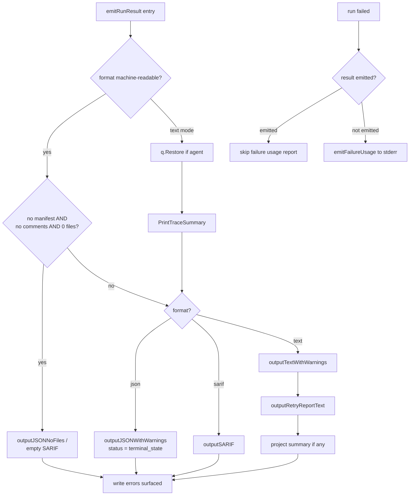
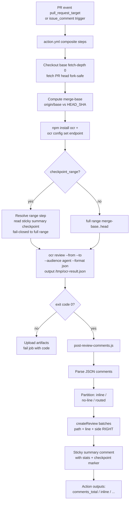

# Review 端到端流水线

> **关联源码**：`cmd/opencodereview/review_cmd.go`、`cmd/opencodereview/output.go`、`cmd/opencodereview/sarif.go`、`internal/model/review.go`、`internal/suggestdiff/`、`internal/stdout/`
> **前置阅读**：[03-diff-engine.md](03-diff-engine.md)、[04-config-rules.md](04-config-rules.md)、[06-agent-loop.md](06-agent-loop.md)、[07-tool-system.md](07-tool-system.md)

## 目录

- [1. 端到端流程总览](#1-端到端流程总览)
- [2. 参数与运行模式](#2-参数与运行模式)
- [3. 阶段拆解](#3-阶段拆解)
- [4. 输出系统](#4-输出系统)
- [5. suggestdiff：建议性 diff 的渲染](#5-suggestdiff建议性-diff-的渲染)
- [6. 与 session 持久化的交互点](#6-与-session-持久化的交互点)
- [7. GitHub Action 集成链路](#7-github-action-集成链路)
- [8. 失败与恢复路径汇总表](#8-失败与恢复路径汇总表)
- [9. 源文件覆盖清单](#9-源文件覆盖清单)

---

## 1. 端到端流程总览

本篇是「总装车间」：把 [03-diff-engine.md](03-diff-engine.md)（diff 解析）、[04-config-rules.md](04-config-rules.md)（规则与 prompt 模板）、[05-llm-providers.md](05-llm-providers.md)（LLM 客户端与重试）、[06-agent-loop.md](06-agent-loop.md)（Agent 编排与执行循环）、[07-tool-system.md](07-tool-system.md)（工具系统）产出的零部件按 `ocr review` 的真实执行顺序串起来。与兄弟篇的分工：

- [02-cli-commands.md](02-cli-commands.md) 已从「命令层」视角写过 review 命令（flag 注册体系、`resolveOutputWriter`/`lazyFileWriter`/`quietHandle` 的机制细节、退出码契约）；本篇聚焦**流水线本身的阶段顺序、每阶段的数据变换、以及结果如何流到终端 / JSON / SARIF / GitHub PR**。
- [06-agent-loop.md](06-agent-loop.md) 已详述 `internal/agent` 与 `internal/llmloop` 内部（分组算法、主循环、并发池、内存压缩）；本篇只讲它们在总装中的**位置与衔接点**，不重复展开。
- [10-session-persistence.md](10-session-persistence.md) 详述 JSONL 会话格式；本篇第 6 章只列出 review 路径上的读写交互点。

### 1.1 端到端时序

**图 8-1**：`ocr review` 端到端时序（主链路）

### 1.2 阶段总表

**表 8-1**：`ocr review` 的阶段、数据变换与归属

| # | 阶段 | 输入 | 输出 | 负责模块 | 详见 |
|---|---|---|---|---|---|
| 0 | 命令装配与前置校验 | CLI flags | `commonContext`、`llmRuntime`、resume 准入 | `review_cmd.go` + `shared.go` | 本文 §3.1、[02](02-cli-commands.md) |
| 1 | diff 获取与解析 | `--from/--to/--commit` 或工作区 | `[]model.Diff` + `InputResolution`（冻结的 commit 端点） | `internal/diff` provider | [03](03-diff-engine.md)、本文 §3.2 |
| 2 | allowlist 过滤 | 全量 diffs | 可审查 diffs（剔 binary / 扩展名 / 路径 / 用户 exclude） | `rules.FileFilter` + `agent.filterDiffs` | [04](04-config-rules.md)、本文 §3.3 |
| 3 | 超大文件预过滤 + 覆盖率登记 + resume 复用 | 过滤后 diffs | 覆盖率分母（selected 集密封）、待派发集 | `agent.dispatchSubtasks` 前半 | 本文 §3.4、[10](10-session-persistence.md) |
| 4 | 语义分组 | 待派发 diffs | `[]FileGroup`（LLM 分组或兜底） | `agent.groupDiffs` | [06](06-agent-loop.md)、本文 §3.5 |
| 5 | 并发子代理执行 | 每个 FileGroup | Plan 文本 + MAIN_TASK 多轮工具循环 | `agent.executeGroupSubtask` + `llmloop.Runner` | [06](06-agent-loop.md)、[07](07-tool-system.md)、本文 §3.6 |
| 6 | 评论收集 + 行号解析（re-location） | `code_comment` 工具调用参数 | 收进 `CommentCollector` 的 `LlmComment`（尽力带上行号） | `llmloop` 工具分发 + `internal/diff/resolver.go` | [07](07-tool-system.md)、[03](03-diff-engine.md)、本文 §3.7 |
| 7 | review filter 反思 | 本轮新增评论 | 删除误报后的评论集 | `agent.executeGroupReviewFilter` | [04](04-config-rules.md)、本文 §3.8 |
| 8 | 定稿：manifest 冻结 + 行号兜底解析 | 全部评论 + 覆盖率 | `[]model.LlmComment`（最终）+ 不可变 `RunManifest` | `agent.Run` 收尾 + `emitRunResult` | 本文 §3.9 |
| 9 | 输出渲染 | 最终评论 + manifest + retry report | 终端 text / JSON / SARIF / `--output` 文件 | `output.go`、`sarif.go`、`shared.go` | 本文 §4 |
| 10 | （可选）CI 消费 | JSON/SARIF 结果 | PR 行内评论 + 摘要 / Code Scanning 告警 | GitHub Action + post 脚本 | 本文 §7 |

## 2. 参数与运行模式

flag 的注册与校验细节见 [02-cli-commands.md](02-cli-commands.md) §4 与 §7.4，这里只讲**每个 flag 改变流水线的哪一段**。

### 2.1 三种 diff 运行模式

`reviewModeFromOptions`（[review_cmd.go](../../cmd/opencodereview/review_cmd.go#L432-L440)）按优先级决定模式：

| 模式 | 触发 | diff 来源 |
|---|---|---|
| `commit` | `--commit <ref>` | 该 commit 对其父的变更（first-parent） |
| `range` | `--from A --to B` | merge-base(A,B)..B |
| `workspace`（默认） | 三者皆空 | 暂存 + 未暂存 + 未跟踪文件 |

模式选择同时决定 resume 支持（workspace 模式不可 resume，[review_cmd.go](../../cmd/opencodereview/review_cmd.go#L353-L355)）与 `file_read` 工具读文件所对的 ref（`fileReadRef`，[review_cmd.go](../../cmd/opencodereview/review_cmd.go#L414-L430)：resume 密封输入会把 ref 替换为录取时解析到的 commit，防止「审一份 diff、读另一份内容」）。

### 2.2 输出相关 flag

- `--format text|json|sarif`（默认 text，[shared_flags.go](../../cmd/opencodereview/shared_flags.go#L34-L39)）：决定第 9 阶段走哪条渲染分支（§4.1）。`json`/`sarif` 是机器可读格式（`isMachineReadable`，[shared.go](../../cmd/opencodereview/shared.go#L354-L361)），进度行全部改道 stderr。
- `--output/-o <path>`（[shared_flags.go](../../cmd/opencodereview/shared_flags.go#L44-L46)）：结果文档写入文件而非 stdout；文件写入器惰性创建并在 text 模式剥离 ANSI（§4.6，机制详见 [02](02-cli-commands.md) §8.1）。
- `--audience human|agent`（默认 human）：配合格式决定**进度流**去向。`agent` 丢弃所有进度（`stdout.Quiet()`）；human + 机器可读格式则把进度重定向到 stderr，保证 stdout 始终是单一可解析文档（`newQuietHandle`，[shared.go](../../cmd/opencodereview/shared.go#L375-L384)）。该契约由 e2e 测试固定：`--audience human --format json` 曾完全静默（#928），现在 stderr 必须有 `[ocr]` 进度、stdout 必须能被 `json.Unmarshal` 解析（[progress_stream_e2e_test.go](../../cmd/opencodereview/progress_stream_e2e_test.go#L35-L59)）。
- `--preview/-p`：不跑 LLM，只列出「会审 / 被排除」的文件清单（`runPreviewContext` → `agent.Preview` → `outputPreview`，[review_cmd.go](../../cmd/opencodereview/review_cmd.go#L493-L507)）；`--preview` 与 `--format sarif` 互斥，因为预览没有 findings 可产出 SARIF result（[output.go](../../cmd/opencodereview/output.go#L716-L728)）。

### 2.3 上下文注入：--background / --background-file

`resolveBackground`（[background_file.go](../../cmd/opencodereview/background_file.go#L50-L64)）的三级优先级：`--background-file` > `--background` > commit 模式下的 **commit message 兜底**。文件内容经过控制字符/零宽字符清洗、保留分隔符检查与 2000/8000 字符软/硬限制后，包上 `<ocr_user_background>` 标签（[background_file.go](../../cmd/opencodereview/background_file.go#L66-L114)）。最终字符串通过 `agent.Args.Background` 进入 MAIN_TASK prompt 的 `{{requirement_background}}` 占位符（[agent.go](../../internal/agent/agent.go#L1278)）。

### 2.4 行为开关与预算

- `--no-filter`：跳过 REVIEW_FILTER_TASK（`SkipFilter`，[agent.go](../../internal/agent/agent.go#L1761-L1765)）。
- `--concurrency`（默认 8）：同时喂给组级并发信号量与评论后处理池两个消费方（[review_cmd.go](../../cmd/opencodereview/review_cmd.go#L224-L225)，详见 [06](06-agent-loop.md)）。
- `--timeout`（分钟，默认 15）：单组子任务超时 = timeout × ReviewRounds（[agent.go](../../internal/agent/agent.go#L647)）。
- `--max-tokens`：单组 prompt token 上限；CLI > app config > 模板默认的解析顺序在 [shared.go](../../cmd/opencodereview/shared.go#L50-L64)。超过 80% 即在预过滤阶段丢弃整个文件（§3.4）。
- `--max-tokens-budget`：**整个 run** 的聚合 token 上限。开启后运行前会先打印成本预估（[agent.go](../../internal/agent/agent.go#L359-L367)）；预算触顶时停止派发新组、未派发项记 `failed(budget)`，只要还有覆盖就退出码为 0（[review_cmd.go](../../cmd/opencodereview/review_cmd.go#L319-L339) 注释与 [review_cmd_test.go](../../cmd/opencodereview/review_cmd_test.go#L52-L82) 的边界测试）。

### 2.5 resume 的入口条件

`--resume <session-id>` 要求：必须是 range 或 commit 模式（[review_cmd.go](../../cmd/opencodereview/review_cmd.go#L353-L355)）；父会话能被重放（`LoadReviewResumeState` 容忍损坏行，[resume.go](../../internal/session/resume.go#L101-L109)）；当前 flags 与父会话一致（`ValidateOptions`）；输入身份 / provider / model 与父 run 一致（`validateResumeIdentity`，§3.1）。通过后 `agent.Args.Resume` 携带 `ResumeState` 进入 `applyResume`（§3.4）。

## 3. 阶段拆解

### 3.1 阶段 0：命令装配与前置校验

`executeReviewContext`（[review_cmd.go](../../cmd/opencodereview/review_cmd.go#L113-L313)）按严格顺序装配：

1. **输出目标先解析**（L114）：`--output` 指向目录 / 父目录不存在时立刻失败，不创建不截断任何文件。
2. **公共上下文**（L124-L129）：`loadCommonContext` 加载内嵌模板、把 RepoDir 锚定到 git 顶层（monorepo 子目录场景 #287，[shared.go](../../cmd/opencodereview/shared.go#L155-L172)）、构建 `rules.Resolver` 与 `FileFilter`；`applyCLIExcludes` 把 `--exclude` 模式并入 FileFilter。
3. **ref 注入防御**（L132）：`validateReviewRefs` 拒绝以 `-` 开头的 ref 并用 `git rev-parse --verify --end-of-options <ref>^{commit}` 逐一验证（#112，[review_cmd.go](../../cmd/opencodereview/review_cmd.go#L466-L491)）。
4. **背景解析**（L136-L140）→ **preview 分流**（L142-L144）→ **resume 状态加载**（L146）。
5. **LLM 运行时**（L151-L168）：`loadLLMRuntime` 构建 client、评论收集器、retry collector、（可选）raw 捕获 holder（[shared.go](../../cmd/opencodereview/shared.go#L218-L271)）；随后解析 max-tokens 与 effort。
6. **resume 身份校验**（L173-L176）：**必须严格在 `agent.New` 之前**——`agent.New` 会创建 session 并立刻写 `session_start`，晚一步校验就会在每次拒绝后面留下孤儿 session（[review_cmd.go](../../cmd/opencodereview/review_cmd.go#L370-L384) 注释）。校验通过返回的 `SealedInput` 把本次 run 钉死在「校验那一刻」解析到的 commit 上，之后 ref 再移动也无法改变被审内容（[review_cmd.go](../../cmd/opencodereview/review_cmd.go#L384-L412)）。
7. **工具与 MCP**（L188-L208）：`buildToolRegistry` 注册 file_read / file_find / file_read_diff / code_search / code_comment 五个内置工具（[review_cmd.go](../../cmd/opencodereview/review_cmd.go#L581-L588)）；`initMCPClients` 按配置拉起本地/远程 MCP server 并把其工具并入 plan/main 工具定义（失败仅告警降级，[review_cmd.go](../../cmd/opencodereview/review_cmd.go#L509-L579)）。
8. **构造 Agent**（L210-L236）并绑定 raw writer（L238）、静音句柄（L243）、遥测 span 与 TraceID（L246-L258）。

### 3.2 阶段 1：diff 获取

`ag.Run` 第一步 `loadDiffs`（[agent.go](../../internal/agent/agent.go#L516-L568)）：按模式选 provider（commit / range / workspace）；resume 密封输入会把用户输入的 ref 替换成预解析的 commit SHA（L528-L536）。provider 返回 `[]model.Diff` 的同时，`ResolveInput` / `RemoteIdentity` 在此刻冻结本 run 的真实 commit 端点与仓库身份（L558-L559），供 manifest 使用——之后**不再**重新解析。解析失败时记录 `run_failure=input` 并仍然落盘一个 failed manifest 的 session_end（L292-L307），保证中断路径不表现为「被放弃」。解析细节见 [03-diff-engine.md](03-diff-engine.md)。

随后 `injectDiffMap` 把**全部**（含被过滤文件的）diff 注入 `file_read_diff` 工具的只读 DiffMap（[agent.go](../../internal/agent/agent.go#L573-L587)），让模型能查询「相关但被排除」文件的 diff；`Tools.Freeze()` 封闭注册表后才进入并发阶段。

### 3.3 阶段 2：allowlist 过滤

`filterDiffs`（[agent.go](../../internal/agent/agent.go#L2002-L2024)）逐文件调 `shouldReview` → `whyExcluded`（分类依据：用户 exclude 规则 / 不支持的扩展名 / 默认排除路径 / 删除文件 / 二进制，枚举见 [preview.go](../../internal/model/preview.go#L10-L17)）。被剔文件逐行打印原因（binary 单独提示）。过滤后为空则直接走 skipped 终态：`finalizeManifest` + `session.Finalize`，返回空评论而非错误（[agent.go](../../internal/agent/agent.go#L324-L339)）。规则系统细节见 [04-config-rules.md](04-config-rules.md)。

### 3.4 阶段 3：预过滤、覆盖率登记与 resume 复用

`dispatchSubtasks`（[agent.go](../../internal/agent/agent.go#L590-L826)）的前三步都是**派发前的一次性工程决策**：

1. `filterLargeDiffs`（L597，实现 [agent.go](../../internal/agent/agent.go#L1954-L1978)）：单个 diff 的 token 数超过 `PromptTokenLimit(MaxTokens)`（即 max-tokens 的 80%）即整文件丢弃；全部超限则整个 run 记为 skipped。
2. `registerCoverage`（L609）：把每个非删除文件注册进 manifest 的 selected 集并**密封**（[agent.go](../../internal/agent/agent.go#L1218-L1232)）——覆盖率分母在任何复用/并发派发之前冻结，reused 文件也计入同一分母。
3. `applyResume`（L619）：对每个文件计算 diff 指纹（mode+path+diff 内容的 SHA-256，[agent.go](../../internal/agent/agent.go#L904-L911)），父 manifest 判定可复用的文件直接把 checkpoint 里的评论灌回收集器并记 `reused`，其余进入待派发集（[agent.go](../../internal/agent/agent.go#L844-L885)）。

### 3.5 阶段 4：语义分组

`groupDiffs`（调用点 [agent.go](../../internal/agent/agent.go#L630-L637)，实现在 [grouping.go](../../internal/agent/grouping.go#L61-L99)）：文件元数据（不含 diff 内容）交给 GROUPING_TASK LLM 做语义分组，任何失败兜底为「一文件一组」。算法与硬约束（≤10 文件/组、组 token 上限）见 [06-agent-loop.md](06-agent-loop.md) §4。

### 3.6 阶段 5：并发子代理执行

派发循环（[agent.go](../../internal/agent/agent.go#L649-L692)）在获取信号量**之前**做逐组预算前瞻（已用 + 组估算 > 预算即停止派发，L659-L687），随后每组一个 goroutine，带 panic 隔离（L701-L720）与超时上下文。每组走 `executeGroupSubtask`（[agent.go](../../internal/agent/agent.go#L1346-L1417)）：

- **Plan 阶段**（可选）：模板未配置或变更量低于阈值则跳过；失败不阻断，仅清空 plan 继续（L1370-L1397）。
- **MAIN_TASK 多轮循环**（L1399 起）：第 2 轮起剥离 plan 文本（防止 plan 变成覆盖率天花板，L1428-L1432）并注入上一轮已确认评论（`{{confirmed_comments}}`）；每轮渲染 prompt 后先过 `checkPromptBudget`（超 80% 上限即停止该组，L1437-L1442），再进 `llmloop` 的工具循环（`RunMainTask`，L1449）。主循环内部（工具分发、三区内存压缩）见 [06-agent-loop.md](06-agent-loop.md) §8-§10 与 [07-tool-system.md](07-tool-system.md)。
- 组完成后按文件记 `markCompleted` + `RecordReviewItemDone`；组中途停止则**逐文件**分类——已有评论的文件记 completed，其余记 failed（[agent.go](../../internal/agent/agent.go#L746-L790)）。

全部组结束后 `wg.Wait` + 评论工作池 `Await()`，一次性从全局收集器取出评论（[agent.go](../../internal/agent/agent.go#L794-L825)）。若全部派发文件失败且无复用，返回错误；但即使如此，已产出的评论仍会被返回而非丢弃（L816-L823）。

### 3.7 阶段 6：评论收集与 re-location

模型在工具循环中通过 `code_comment` 工具提交评论（参数 schema 与修复逻辑见 [07-tool-system.md](07-tool-system.md)）。每条评论的行号解析在**收集时刻**完成（`resolveAndCollect`，[loop.go](../../internal/llmloop/loop.go#L667-L727)），三级顺序：

1. `diff.ResolveComment`：在评论自己声明的文件 diff 里，先按 hunk 新侧/旧侧匹配 `existing_code`，再回退到新文件全文扫描（[resolver.go](../../internal/diff/resolver.go#L62-L73)）。
2. `diff.RelocateAcrossFiles`：匹配失败且现有代码片段**唯一**命中其他文件的 diff 时，把评论整体改判到那个文件（Path 与行号一起搬，[resolver.go](../../internal/diff/resolver.go#L100-L139)）；零命中或多个命中都不动。
3. `RE_LOCATION_TASK` LLM 调用：仍失败时把 diff + 评论交给 LLM 重新定位（[loop.go](../../internal/llmloop/loop.go#L690-L723)）。

解析完成后 `CommentCollector.Add` 入库（L725）；整个解析被提交到 `CommentWorkerPool` **异步执行**，工具循环立刻返回成功给模型（L729-L748）。收集器本身是带互斥锁的追加式存储，review 路径的去重不在这里做——去重发生在 REVIEW_FILTER_TASK（误报删除）与 scan 的 DEDUP_TASK（review 不做内容去重，[shared_flags.go](../../cmd/opencodereview/shared_flags.go#L240) 对比可见 `--no-dedup` 仅为 scan flag）。

### 3.8 阶段 7：review filter 反思

每轮 MAIN_TASK 排空评论工作池后执行 `executeGroupReviewFilter`（调用点 [agent.go](../../internal/agent/agent.go#L1468-L1471)，实现 [agent.go](../../internal/agent/agent.go#L1750-L1869)）：

- 输入：本轮**新增**的候选评论（以轮次基线 `baseline` 切分，实现按轮隔离，L1773-L1785）+ 组 diff + `{{path}}/{{diff}}/{{comments}}` 模板（prompt 属 REVIEW_FILTER_TASK，见 [04-config-rules.md](04-config-rules.md)）。
- LLM 用 `filterTools` 返回要删除的下标；解析优先走 tool call，回退走文本（`parseFilterToolCalls` / `parseFilterResponse`，L1841-L1844）。
- 删除通过 `RemoveByPathAndIndices` 按真实路径内下标执行（[comment_collector.go](../../internal/tool/comment_collector.go#L96-L116)）。
- 失败（LLM 错误或解析失败）只打警告，**评论保持原样**——反思是优化项不是正确性项。

### 3.9 阶段 8：最终评论定稿

`ag.Run` 收尾三连（[agent.go](../../internal/agent/agent.go#L377-L404)）：

1. `runner.WaitBackground()`：等后台内存压缩任务收口，防止 retry report 在请求未终结时冻结（L381-L387 注释）。
2. `finalizeManifest`：覆盖率 builder → 不可变 `RunManifest`（L393，实现见 [agent.go](../../internal/agent/agent.go#L1240-L1257)）。
3. `session.Finalize`：写 session_end 并嵌入 manifest（L396）。

命令层拿到 `comments + manifest` 后，先冻结 retry report（`RetryCollector.Freeze`，[review_cmd.go](../../cmd/opencodereview/review_cmd.go#L264-L277)，run_id 用内存态 SessionID 保证未持久化 run 的报告 ID 也稳定），再计算退出错误（`reviewResultError`，L279），最后 `emitRunResult` 里对**仍未定位**的评论做最后一轮 `diff.ResolveLineNumbers` 兜底解析（[shared.go](../../cmd/opencodereview/shared.go#L692)）。这一步兜底覆盖的是历史/旁路产生的评论，例如 resume 复用灌回的 checkpoint 评论。

## 4. 输出系统

### 4.1 输出格式分支总览

**图 8-2**：`emitRunResult` 的输出格式分支

关键分支语义：

- **空跑短路**（[shared.go](../../cmd/opencodereview/shared.go#L707-L712)）：机器可读格式 + 无 manifest + 无评论 + 0 文件时，输出「No supported files changed.」的最小文档（json）或空 results 的 SARIF。
- **status 单一事实源**：有 manifest 时 JSON `status` 直接取 `terminal_state`（complete/partial/failed/skipped，[output.go](../../cmd/opencodereview/output.go#L383-L385)）；`budget_exceeded` **刻意不改** status——预算触顶是受控覆盖截断，通过 `summary.budget_exceeded`、`token_budget_reached` warning、`coverage.failed[].classification == "budget"` 三个出口观察（[output.go](../../cmd/opencodereview/output.go#L400-L408) 注释，测试 [budget_output_test.go](../../cmd/opencodereview/budget_output_test.go#L27-L120)）。
- **失败与结果互斥的报告归属**：是否发布由 `emitted := manifest != nil || runErr == nil` 决定（[review_cmd.go](../../cmd/opencodereview/review_cmd.go#L288-L295)）——run 失败但 manifest 构造成功时 `emitRunResult` 照常发布。跑过则失败路径不再重复发 retry report；只有结果发布被整体跳过时才把报告随 `emitFailureUsage` 发到 stderr（[review_cmd.go](../../cmd/opencodereview/review_cmd.go#L296-L311) 与 [output.go](../../cmd/opencodereview/output.go#L660-L667) 注释）。

### 4.2 stdout 渲染与内容组织

text 模式（`outputTextWithWarnings`，[output.go](../../cmd/opencodereview/output.go#L68-L91)）自上而下：

1. **manifest 结论行**（有 manifest 时）：`manifestMessage` 按 terminal_state 输出一行摘要，含 findings 数、selected/failed/waived 计数（[output.go](../../cmd/opencodereview/output.go#L601-L626)）。无 manifest 的 legacy 路径退回「No comments generated. Looks good to me.」或子任务错误提示。
2. **逐条评论**（`renderComment`，[output.go](../../cmd/opencodereview/output.go#L93-L133)）：
   - 文件头 `─── path:start-end ───`（dim）；
   - `[category · severity]` 徽章内联进首行，按 severity 映射 ANSI 色（critical=粗体亮红 … 未知=dim，[output.go](../../cmd/opencodereview/output.go#L153-L168)）；
   - 正文按 **100 可见 rune 列**换行（CJK 宽字符安全，`wrapByRunes`/`visibleRunesLen`，[output.go](../../cmd/opencodereview/output.go#L181-L238)）；
   - 若评论带 `existing_code` + `suggestion_code`，追加渲染建议 diff（§5）。
3. **非子任务警告**输出到 **stderr**（[output.go](../../cmd/opencodereview/output.go#L85-L90)）；子任务类警告在 manifest 存在时被 `warningsForOutput` 剥除——其结论已在 `coverage.failed` 里，重复发布会暴露 provider 原始错误文本（[output.go](../../cmd/opencodereview/output.go#L43-L62)）。
4. **retry report 摘要**（§4.4）与 **Project Summary**（review 恒空，scan 才有；[shared.go](../../cmd/opencodereview/shared.go#L756-L758)）。

颜色系统的判定（`--color auto|always|never`、TERM=dumb、isatty）见 [02-cli-commands.md](02-cli-commands.md) §7.6；所有输出路径先过 `sanitizeTerminal` 剥控制字符（[output.go](../../cmd/opencodereview/output.go#L240-L249)）。

### 4.3 SARIF 导出

`outputSARIF`（[sarif.go](../../cmd/opencodereview/sarif.go#L125-L151)）产出 SARIF v2.1.0 文档：单 run、driver 含 **8 个内置 category 规则**（bug/security/performance/maintainability/test/style/documentation/other，[sarif.go](../../cmd/opencodereview/sarif.go#L155-L166)），每条 `LlmComment` 一个 result，外加携带执行状态与警告的 invocations 块。

**表 8-2**：`LlmComment` → SARIF result 字段映射（[sarif.go](../../cmd/opencodereview/sarif.go#L213-L228) 注释 FR-3）

| LlmComment | SARIF | 说明 |
|---|---|---|
| `Path` | `locations[].physicalLocation.artifactLocation.uri` | |
| `StartLine/EndLine`（合法区间） | `locations[].physicalLocation.region` | 非法区间省略 region |
| `Content` | `message.text` | |
| `Category`（空则 `other`） | `ruleId` | 必须落在 8 规则内 |
| `Severity` | `level`：critical/high→error，medium→warning，low/未知→note | 未知降为 note 防止夸大（[sarif.go](../../cmd/opencodereview/sarif.go#L168-L185)） |
| `SuggestionCode`+`ExistingCode`+合法 region | `fixes[].artifactChanges[].replacements[]` | `deletedRegion` 是 schema 必填，region 非法时不发 fixes、建议仍留在 message.text（[sarif.go](../../cmd/opencodereview/sarif.go#L258-L275)） |
| `Path`+`Category`+`ExistingCode`（空则 StartLine） | `partialFingerprints["ocrFinding/v1"]` = SHA-256 | 用代码而非 LLM 措辞做指纹，跨 run 稳定（[sarif.go](../../cmd/opencodereview/sarif.go#L280-L297)） |

GitHub Code Scanning 的消费方式：指纹让同一告警跨 run 被追踪而不是反复关开；同指纹重复发现（同文件同代码两处相同问题）追加 `#N` 序号让 GitHub 视为独立告警（[sarif.go](../../cmd/opencodereview/sarif.go#L187-L211)）。上传路径是标准 CodeQL action（`ocr review --format sarif --audience agent > results.sarif` + `github/codeql-action/upload-sarif@v3`，官方文档 [ci.md](../../pages/src/content/docs/en/integrations/ci.md#L260-L280)）。`run.invocations` 记录 `executionSuccessful`（仅 StateFailed 为 false；partial/skipped 是可发布结果，[sarif.go](../../cmd/opencodereview/sarif.go#L299-L332)）与 warnings→notifications 的转换（[sarif.go](../../cmd/opencodereview/sarif.go#L334-L347)）。schema 合规性有专门测试（[sarif_test.go](../../cmd/opencodereview/sarif_test.go#L403-L459)）。

### 4.4 JSON 输出与 manifest

`jsonOutput`（[output.go](../../cmd/opencodereview/output.go#L317-L336)）顶层字段：`status` / `llm`（provider+model）/ `trace_id` / `message` / `summary`（files_reviewed、comments、四类 token 计数、elapsed、budget_exceeded）/ `tool_calls`（含 per-tool 失败明细）/ `comments` / `groups`（分组结果）/ `warnings` / `project_summary` / `resume`（复用统计）/ `session_id` / `manifest` / `retry_report`（omitempty，首跑成功时字节级省略，#368 兼容约束）。`manifest` 即 `RunManifest`（[manifest.go](../../internal/session/manifest.go#L274-L286)）：schema_version、run_id/parent_run_id、terminal_state、repository/input/execution 三个身份块、coverage 五集合（selected/completed/reused/failed/waived）、run_failure、elapsed_ms。**CLI JSON 与持久化 session_end 序列化的是同一个对象**（[manifest.go](../../internal/session/manifest.go#L270-L273) 注释），两个出口不可能算出不同的覆盖率。

### 4.5 retry report 的呈现

retry report 记录本 run 每个「值得注意」的 LLM 逻辑请求（重试过、恢复过、失败或取消的）及其每次 HTTP 尝试（结构见 [retry_report.go](../../internal/llm/retry_report.go#L126-L155)，机制见 [05-llm-providers.md](05-llm-providers.md)）。两处呈现：

- **text**（`outputRetryReportText`，[output.go](../../cmd/opencodereview/output.go#L453-L494)）：按 6 个 review 阶段分桶（Plan/Core review/Context compaction/Comment re-location/Comment filtering/File grouping，[output.go](../../cmd/opencodereview/output.go#L416-L426)），每桶列出文件与「错误短语 -> 结果」链（`retryAttemptChain`，只渲染稳定错误类与 HTTP 状态码，绝不透出 provider 原始错误文本）；每组最多列 5 条，末尾提示 JSON 里有逐尝试明细。
- **json**：`retry_report` 字段直接嵌 `llm.RetryReport`，保留全部请求与尝试。

冻结时机即 `ag.Run` 返回、后台任务全部收口之后（[review_cmd.go](../../cmd/opencodereview/review_cmd.go#L264-L270)）。e2e 断言「干净 run 不发报告、全失败 run 恰好发一次、Freeze 不变量破坏只是警告不改退出码」见 [retry_report_e2e_test.go](../../cmd/opencodereview/retry_report_e2e_test.go#L37-L269)。

### 4.6 失败时的用量输出与 --output 文件

`emitFailureUsage`（[output.go](../../cmd/opencodereview/output.go#L667-L710)）在 run 失败时把结构化用量记录写到 **stderr**（json 格式输出一个 `jsonOutput` 形状的对象，保证 stdout 永远只有一个文档；text 格式输出一行 `[ocr] usage on failure: ...` + retry report）。它补充而非替代已发布的结果（[output.go](../../cmd/opencodereview/output.go#L645-L660) 注释）。失败路径还会在 stderr 提示 `Session: <id> (retry with: --resume <id>)`（[review_cmd.go](../../cmd/opencodereview/review_cmd.go#L307-L309)）。

`--output` 文件链路（惰性创建、text 剥 ANSI、写失败经 `writeOutError` 上浮为非零退出）详见 [02-cli-commands.md](02-cli-commands.md) §8.1；本篇只强调流水线语义：**无输出的 run 不落文件**，text 渲染丢弃的 per-write 错误由 `emitRunResult` 末尾统一检查（[shared.go](../../cmd/opencodereview/shared.go#L759-L763)）。

## 5. suggestdiff：建议性 diff 的渲染

`internal/suggestdiff` 是**纯展示层**的行级 diff 计算，只在 text 输出渲染单条评论时使用：

- **何时生成**：`renderComment` 调 `buildDiffLines`（[output.go](../../cmd/opencodereview/output.go#L259-L266)），当且仅当评论同时携带非空 `SuggestionCode` 与 `ExistingCode`——这正是 `LlmComment` 中由 `code_comment` 工具产出、表示「把这段现有代码替换为这段建议代码」的字段对（[model/review.go](../../internal/model/review.go#L7-L21)）。任一为空则不渲染 diff 块。
- **算法**：`ComputeLineDiff`（[diff.go](../../internal/suggestdiff/diff.go#L27-L71)）是 Myers 风格 LCS：对两段代码按行求最长公共子序列（行比较先 `TrimSpace` 且大小写不敏感，容忍缩进/大小写噪声），回溯产出 context/added/deleted 三类行。
- **渲染**：added 用亮绿前景+深绿背景、deleted 用亮红前景+深红背景、context 用 dim（[output.go](../../cmd/opencodereview/output.go#L119-L129)）；`--color=never` 时退化为保留 `+/-/空格` 前缀的纯文本，语义不丢失（`printDiffLine`，[output.go](../../cmd/opencodereview/output.go#L170-L179)）。
- **与评论的关系**：suggestdiff 只消费评论字段，不反向影响评论。同两个字段在 SARIF 里变成机器可读的 `fixes`（§4.3），在 GitHub PR 评论里以 markdown 形式随正文发布（§7.3）——三个输出面共享同一份数据，各自负责呈现。

## 6. 与 session 持久化的交互点

review 路径在 run 生命周期内对 session 的读写点（格式细节全部见 [10-session-persistence.md](10-session-persistence.md)）：

**表 8-3**：review run 的 session 交互点（文件位于 `~/.opencodereview/sessions/<encoded-repo>/<sessionID>.jsonl`，[resume.go](../../internal/session/resume.go#L81-L90)）

| 时机 | 操作 | 代码 |
|---|---|---|
| `agent.New`（run 开始） | `session.New` 写 `session_start`；manifest builder 初始化（input.mode、parent_run_id 等种子字段） | [agent.go](../../internal/agent/agent.go#L207-L253)、[agent.go](../../internal/agent/agent.go#L913-L919) |
| resume 被接受后、任何派发前 | `RecordResumeLineage` 写血缘记录（即使随后 run 立即失败，血缘也在盘上） | [agent.go](../../internal/agent/agent.go#L369-L374) |
| 每个文件定稿时 | `RecordReviewItemDone` / `RecordReviewItemFailed` / `RecordReviewItemReused` 写文件级 checkpoint（含评论快照） | [agent.go](../../internal/agent/agent.go#L785-L790)、[history.go](../../internal/session/history.go#L256-L270) |
| 每次 LLM 请求前后 | `AppendTaskRecord` 写 `llm_request`，响应/错误回填写 `llm_response` | [history.go](../../internal/session/history.go#L363-L383) |
| run 收尾 | `finalizeManifest` → `SetFinalManifest` → `Finalize` 幂等写 `session_end`（嵌入冻结 manifest；持久化失败按 delivery error 上抛） | [agent.go](../../internal/agent/agent.go#L393-L403)、[history.go](../../internal/session/history.go#L324-L361) |
| resume 启动时 | `LoadReviewResumeState` 重放父 JSONL → `ResumeState`（Items 指纹索引 + 父 manifest + Closed）；复用资格由父 manifest 的 completed/reused 指纹决定 | [resume.go](../../internal/session/resume.go#L20-L48)、[agent.go](../../internal/agent/agent.go#L858-L873) |

一个关键约束：**manifest 构造失败时 session_end 以 legacy 形式落盘且 CLI 侧 manifest 为 nil**（[agent.go](../../internal/agent/agent.go#L1234-L1238) 注释），此时 JSON 输出退回 warning 驱动的旧状态语义（`completed_with_errors` 等，[output.go](../../cmd/opencodereview/output.go#L393-L399)）。

## 7. GitHub Action 集成链路

### 7.1 链路总览

**图 8-3**：GitHub Action CI 集成链路

### 7.2 action.yml：从输入到 ocr review

仓库根 [action.yml](../../action.yml) 是 composite action。关键编排：

- **安全模型**：checkout 的是**可信 base**（fetch-depth: 0），PR head 的 blob 通过 `git fetch origin pull/N/head` 单独取回，不把不可信 PR 文件落到工作区（[action.yml](../../action.yml#L292-L309) 注释）；fork PR 因此也能安全使用 `pull_request_target`。
- **审查范围**：`git merge-base origin/<base> <head>`（[action.yml](../../action.yml#L311-L317)）；开启 `checkpoint_range` 时由 Resolve range 步骤读取上一次 sticky summary 里的 checkpoint marker，一切存疑（summary 缺失、指纹变化、非祖先、配置变化）都 fail-closed 回退全量范围（[action.yml](../../action.yml#L412-L643)）。
- **执行命令**（[action.yml](../../action.yml#L645-L680)）：核心是
  `ocr review --from "${RANGE_FROM:-$MERGE_BASE}" --to "${HEAD_SHA}" --audience agent --format json --timeout ...`，
  结果与 stderr 分别写入 `/tmp/ocr-result.json` 与 `/tmp/ocr-stderr.log`；非零退出码先上传 artifacts 再 fail job（[action.yml](../../action.yml#L682-L697)）。
- **输入映射**：`llm_url/llm_auth_token/llm_model/...` 输入先经 `ocr config set` 落为运行配置（token 走 `auth_token_cmd` 从环境变量读取，[action.yml](../../action.yml#L378-L410)）。

示例工作流 [ocr-review.yml](../../examples/github_actions/ocr-review.yml#L56-L123) 展示两种触发：`pull_request_target`（opened/synchronize/reopened）与 MEMBER/OWNER/COLLABORATOR 的 `/open-code-review` 评论（issue_comment 事件需先解析 base/head，L95-L111）。

### 7.3 post-review-comments.js：JSON 到 PR 评论

[post-review-comments.js](../../scripts/github-actions/post-review-comments.js#L69-L105) 的 `runPostReviewComments` 是唯一入口：

1. **读取** `/tmp/ocr-result.json`（解析失败则把 stderr 包装成错误 summary，L220-L240）；`comments.length === 0` 时直接发「Looks good」摘要并推进 checkpoint（L247-L255）。
2. **三路分区**（L283-L316）：无行号评论 → 摘要区；行号合法但被 `route_severity_below`/`route_categories` 政策路由的 → 摘要区（fail-open，永不丢弃 finding）；其余进入行内评论集。
3. **行内位置映射**（L302-L315）：`comment.start_line != comment.end_line` 且都 ≥1 时映射为多行 review comment `{path, start_line, line: end_line, start_side/side: "RIGHT"}`，否则单行 `{path, line, side: "RIGHT"}`——即**始终锚定 diff 新侧**，与 ocr 侧行号解析语义（新文件行号优先，[resolver.go](../../internal/diff/resolver.go#L147-L181)）一致。
4. **增量模式**：`incremental: true` 时与既有 bot 评论按 (path, 行区间) 的 IoU ≥ 阈值（默认 0.6）判重叠，只追加不覆盖（L318-L333）。
5. **批量发布**：排序后按批（默认 50 条/批）`pulls.createReview`（L383-L402、L496-L507）；每条评论带随机 ID 的 HTML 注释做幂等对账，整批 422（行越界）时按 PR diff hunk 清单三态分类——确证越界的转摘要、未知走逐条重试（L556-L598，解决 #624 时间线噪音）。
6. **sticky summary**：先锚定摘要评论（保证时间线在最上），评审落地后回填统计、无行号/被路由/失败评论、警告与 checkpoint marker（L335-L461）。
7. **输出**：`comments_total/inline/skipped/routed/failed/summary_comment_url/checkpoint_after` 等写入 action outputs（[action.yml](../../action.yml#L162-L228)）。

评论徽章与 CLI 字节级对齐（`[category · severity]` 退化规则同 [output.go](../../cmd/opencodereview/output.go#L135-L151)，[post-review-comments.js](../../scripts/github-actions/post-review-comments.js#L1484-L1499)），Markdown 面再升级为 shields.io 徽章图（L1555-L1566）。

## 8. 失败与恢复路径汇总表

**表 8-4**：review 流水线的失败、降级与恢复路径

| 场景 | 触发条件 | 行为 | 退出码 | 出处 |
|---|---|---|---|---|
| LLM 请求级失败/重试 | HTTP 429/5xx/超时等 | SDK 退避重试；逻辑请求终结为 succeeded/recovered/failed/cancelled，进入 retry report | 不变 | [05](05-llm-providers.md)、[retry_report.go](../../internal/llm/retry_report.go#L74-L85) |
| flag 校验失败 | 非法组合/取值 | RunE 前置即返回，无任何落盘产物 | 非零 | [shared_flags.go](../../cmd/opencodereview/shared_flags.go#L124-L162)、[review_cmd_test.go](../../cmd/opencodereview/review_cmd_test.go#L121-L134) |
| ref 注入/无效 ref | `--from/--to/--commit` 以 `-` 开头或非 commit | 拒绝执行 | 非零 | [review_cmd.go](../../cmd/opencodereview/review_cmd.go#L466-L491) |
| diff 解析失败 | git/diff 错误 | `run_failure=input` + failed manifest 照常落盘 | 非零 | [agent.go](../../internal/agent/agent.go#L286-L307) |
| 单组子任务失败 | LLM/工具错误、超时、panic | panic 与错误都被组级隔离，计数 `subtaskFailed`，其余组继续；文件级分类（有评论=completed） | 视覆盖率 | [agent.go](../../internal/agent/agent.go#L701-L745) |
| 全部派发文件失败且无复用 | failed == dispatched 且 reused == 0 | 返回错误（若仍有评论则连评论一起返回） | 非零 | [agent.go](../../internal/agent/agent.go#L816-L823) |
| 单组 prompt 超预算 | 渲染后 token > 80% max-tokens | 该组停止并记 `failed(budget)` | 视覆盖率 | [agent.go](../../internal/agent/agent.go#L1292-L1314) |
| 聚合 token 预算触顶 | `--max-tokens-budget` 投影超限 | 停止派发新组，未派发项 `failed(budget)`，无 run_failure；有覆盖 → partial | 有覆盖 0 / 全失败非零 | [agent.go](../../internal/agent/agent.go#L659-L687)、[review_cmd_test.go](../../cmd/opencodereview/review_cmd_test.go#L52-L82) |
| 超时/取消（Ctrl-C） | ctx deadline / SIGINT | deadline → pendingFailureCause(timeout)；显式取消 → run_failure(cancelled) | 非零 | [agent.go](../../internal/agent/agent.go#L799-L802)、[agent.go](../../internal/agent/agent.go#L828-L842) |
| 中断后 resume | `--resume <id>` 且身份校验通过 | 文件级 checkpoint 复用（指纹匹配 + 父 manifest 背书），未完成文件重跑；血缘先落盘 | — | [agent.go](../../internal/agent/agent.go#L844-L885)、[10](10-session-persistence.md) |
| resume 准入被拒 | 输入/规则/provider/model 与父 run 不一致 | 在 session 创建前拒绝，不留孤儿 session | 非零 | [review_cmd.go](../../cmd/opencodereview/review_cmd.go#L370-L412) |
| 父会话含孤儿请求记录 | `llm_request` 无配对响应 | review 重放忽略该行（文件重审，安全方向） | — | [resume_orphan_request_test.go](../../internal/session/resume_orphan_request_test.go#L19-L23) |
| manifest 构造失败 | builder 不变量破坏 | manifest=nil（legacy 输出），记 warning，不影响已有评论 | 视覆盖率 | [agent.go](../../internal/agent/agent.go#L1234-L1238) |
| session 持久化失败 | 磁盘/权限错误 | 作为 delivery error 与 run 错误 join 上抛；内存 manifest 照常发布 | 非零 | [agent.go](../../internal/agent/agent.go#L393-L403)、[history.go](../../internal/session/history.go#L318-L323) |
| retry report Freeze 失败 | collector 不变量破坏 | 报告整体抑制，仅 stderr 警告，不改退出码 | 不变 | [review_cmd.go](../../cmd/opencodereview/review_cmd.go#L270-L277) |
| 结果文件写失败 | `--output` 路径权限/磁盘 | 惰性创建不截断旧文件；首写错误上浮为命令错误 | 非零 | [shared.go](../../cmd/opencodereview/shared.go#L528-L590) |
| GitHub 行内评论越界 | 评论行不在 PR diff 内 | 批量 422 后按 diff hunk 三态分类：确证越界转摘要，未知逐条重试 | — | [post-review-comments.js](../../scripts/github-actions/post-review-comments.js#L556-L598) |

退出码契约一句话：**非零仅当 run 级失败，或 selected 集全部失败**；complete/partial/skipped（含预算截断但有覆盖）都是 0，且 partial 结果总是先发布再返回错误（[review_cmd.go](../../cmd/opencodereview/review_cmd.go#L315-L341)）。

## 9. 源文件覆盖清单

**表 8-5**：本篇通读的源文件

| 源文件 | 职责 | 关键符号 |
|---|---|---|
| [cmd/opencodereview/review_cmd.go](../../cmd/opencodereview/review_cmd.go) | review 命令总装：装配、resume 准入、MCP/工具注册、run 后收尾与退出码 | `executeReviewContext`、`reviewResultError`、`loadReviewResumeState`、`validateResumeIdentity`、`validateReviewRefs`、`fileReadRef`、`runPreviewContext`、`initMCPClients`、`buildToolRegistry` |
| [cmd/opencodereview/output.go](../../cmd/opencodereview/output.go) | text/JSON 渲染、retry report 文本分组、失败用量输出、预览输出 | `outputTextWithWarnings`、`renderComment`、`buildBadge`、`severityColor`、`jsonOutput`、`outputJSONWithWarnings`、`outputRetryReportText`、`manifestMessage`、`emitFailureUsage`、`outputPreview` |
| [cmd/opencodereview/sarif.go](../../cmd/opencodereview/sarif.go) | SARIF v2.1.0 导出：结构定义、字段映射、指纹、invocations | `outputSARIF`、`sarifRules`、`sarifSeverityLevel`、`sarifResults`、`sarifResultFromComment`、`sarifFingerprints`、`sarifInvocationFromRun` |
| [cmd/opencodereview/shared.go](../../cmd/opencodereview/shared.go) | review/scan 共享上下文、LLM 运行时、stdout 保护、输出 writer、统一收尾 | `loadCommonContext`、`loadLLMRuntime`、`quietHandle`、`resolveOutputWriter`、`lazyFileWriter`、`stripAnsiWriter`、`ResultProvider`、`emitRunResult` |
| [cmd/opencodereview/shared_flags.go](../../cmd/opencodereview/shared_flags.go) | flag 注册与校验（模式互斥、格式/受众枚举、预算下限） | `registerReviewFlags`、`validateReviewOptions`、`validateDiffMode`、`addOutputFlags` |
| [cmd/opencodereview/background_file.go](../../cmd/opencodereview/background_file.go) | --background/--background-file 解析、清洗与限额 | `resolveBackground`、`loadBackgroundFile`、`selectBackground`、`sanitizeMarkdown` |
| [internal/model/review.go](../../internal/model/review.go) | 评论数据模型（全流水线的核心数据结构） | `LlmComment`、`CodeReviewResult` |
| [internal/suggestdiff/diff.go](../../internal/suggestdiff/diff.go) | 建议性 diff 的行级 LCS 计算与 ANSI 渲染数据 | `ComputeLineDiff`、`DiffLine`、`DiffLineType` |
| [internal/stdout/stdout.go](../../internal/stdout/stdout.go) | 全局 stdout writer 的静音/换向（进度流与结果流分离的基础） | `Writer`、`Quiet`、`Swap` |
| [internal/tool/comment_collector.go](../../internal/tool/comment_collector.go) | 线程安全评论收集器（追加、按路径取、filter 删除） | `Add`、`Comments`、`CommentsForPath`、`RemoveByPathAndIndices` |
| [internal/diff/resolver.go](../../internal/diff/resolver.go) | 行号解析三件套（hunk/全文/跨文件） | `ResolveLineNumbers`、`ResolveComment`、`RelocateAcrossFiles` |
| internal/llmloop/loop.go（引用，详见 [06](06-agent-loop.md)） | 主任务工具循环；评论三级 re-location 的发起与异步收集点 | `resolveAndCollect`、`RunMainTask` |
| internal/llm/retry_report.go（引用，详见 [05](05-llm-providers.md)） | retry report 的数据模型与冻结出口 | `RetryReport`、`RetryCollector`、`Freeze` |
| internal/agent/agent.go（引用，详见 [06](06-agent-loop.md)） | 流水线领域编排：Run 主流程、派发、组执行、review filter、manifest 冻结 | `Run`、`loadDiffs`、`dispatchSubtasks`、`executeGroupSubtask`、`executeGroupReviewFilter`、`registerCoverage`、`finalizeManifest`、`applyResume` |
| internal/session/manifest.go、resume.go、history.go（引用，详见 [10](10-session-persistence.md)） | manifest 数据模型、resume 重放、session 记录 | `RunManifest`、`TerminalState`、`ResumeState`、`LoadReviewResumeState`、`Finalize` |
| [action.yml](../../action.yml) | GitHub composite action：输入、范围解析、ocr 调用、post 步骤 | `runs.steps`（Run OpenCodeReview / Post review comments） |
| [scripts/github-actions/post-review-comments.js](../../scripts/github-actions/post-review-comments.js) | JSON 结果 → PR 行内评论/摘要的发布、增量与幂等、checkpoint | `runPostReviewComments`、`publishBatch`、`buildPolicy`、`buildBadgeImage` |
| [examples/github_actions/ocr-review.yml](../../examples/github_actions/ocr-review.yml) | 示例工作流：双触发、并发组、权限收敛 | `on.pull_request_target`、`on.issue_comment` |

> **待与维护者确认**：无。本篇全部行为论断均有源码行号或测试佐证。
