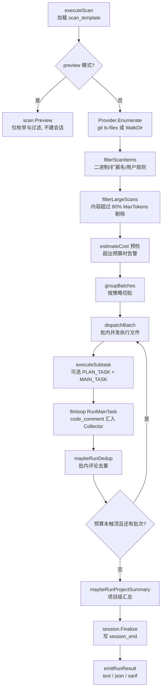
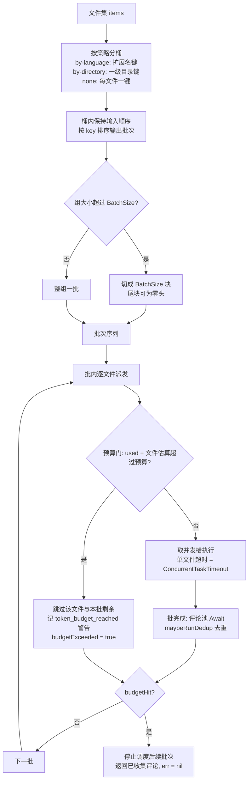

# Scan 流水线

> **关联源码**：`internal/scan/`、`internal/model/scan.go`、`cmd/opencodereview/scan_cmd.go`
> **前置阅读**：[08-review-pipeline.md](08-review-pipeline.md)

## 目录

- [1. scan 与 review 的定位差异](#1-scan-与-review-的定位差异)
- [2. 文件发现与过滤](#2-文件发现与过滤)
- [3. 批处理算法](#3-批处理算法)
- [4. Token 预算](#4-token-预算)
- [5. LLM 请求的组装与 scan_template 的消费](#5-llm-请求的组装与-scan_template-的消费)
- [6. agent.go：scan 侧 Agent 的构建与执行](#6-agentgo-scan-侧-agent-的构建与执行)
- [7. preview 与 resume](#7-preview-与-resume)
- [8. scan 特有配置与未消费字段](#8-scan-特有配置与未消费字段)
- [9. 源文件覆盖清单](#9-源文件覆盖清单)

---

## 1. scan 与 review 的定位差异

### 1.1 全文件审计 vs diff 审查

`ocr scan` 的定位写在命令声明里：「Scan entire files (no diff required)」（[scan_cmd.go](../../cmd/opencodereview/scan_cmd.go#L55-L59)）。它与 `ocr review` 构成一对互补的审查入口：

- **review（diff 审查）**：输入是一次变更（workspace / range / commit），LLM 只看 diff 及其上下文，回答「这次改动有没有引入问题」。适合代码合入前的把关。
- **scan（全文件审计）**：输入是仓库（或 `--path` 圈定的子集）的现存文件全文，LLM 看 `<current_file_content>` 里的整个文件，回答「这份代码现在有什么问题」。适合存量代码体检、无 diff 上下文的仓库级审计。scan 的 MAIN_TASK system prompt 明确声明「you are reviewing an ENTIRE existing source file (no diff context)」（[scan_template.json](../../internal/config/template/scan_template.json#L6)）。

数据模型层面同样成对：review 的原子输入是携带 unified diff 文本的 `model.Diff`，scan 的原子输入是携带整个文件内容的 `model.ScanItem`（[scan.go](../../internal/model/scan.go#L6-L15)）。`ScanItem.AsDiff()` 提供一个合成 `Diff` 适配器——`NewFileContent` 装全文、`Diff` 字段留空——让行号解析器与输出管线把两者当同一种形状处理（[scan.go](../../internal/model/scan.go#L17-L32)）。

### 1.2 平行的第二条流水线，共享同一个引擎

从源码结构回答：scan 是**平行的第二条编排流水线，但复用同一执行引擎与输出管线**。拆开看：

| 维度 | 复用（共享） | 独立（scan 自有） |
|---|---|---|
| LLM 工具循环、内存压缩、token 记账 | `llmloop.Runner`（[06-agent-loop.md](06-agent-loop.md)） | — |
| LLM 客户端、重试、prompt-cache 会话键 | `llm.LLMClient` 与 session key 机制（[05-llm-providers.md](05-llm-providers.md)） | — |
| 会话持久化 | `session.SessionHistory`，`review_mode = full_scan`（[agent.go](../../internal/scan/agent.go#L126-L131)） | — |
| 输出收尾 | `emitRunResult` + `ResultProvider` 接口（[08-review-pipeline.md](08-review-pipeline.md)） | — |
| 任务模板 | — | `scan_template.json`，与 diff 模板完全分离（[04-config-rules.md](04-config-rules.md)） |
| 编排逻辑 | — | `internal/scan` 包：文件枚举、分批、逐文件调度、批内去重 |
| 输入枚举 | — | `scan.Provider`（diff 侧对偶是 `diff.Provider`） |

包文档把这个边界说得很清楚：「Shared LLM tool-use loop / memory compression lives in internal/llmloop; this package only handles scan-specific concerns (enumeration, FULL_SCAN_TASK rendering, scan-specific filter)」（[provider.go](../../internal/scan/provider.go#L4-L9)）。`scan.Agent` 的类型注释也自述：「It delegates the per-file LLM tool-use loop to llmloop.Runner and owns only scan-specific concerns (file enumeration, FULL_SCAN_TASK rendering, per-file filtering)」（[agent.go](../../internal/scan/agent.go#L96-L98)）。

两个结构性差异值得单独记住：

1. **scan 没有 run manifest**。review 会冻结一份 v1 覆盖率清单（manifest）决定终态；scan 的 `RunManifest()` 恒返回 nil，注释说明这是刻意把 scan 排除在 v1 manifest 范围外，接口存在只是为了与 review 共享输出管线（[agent.go](../../internal/scan/agent.go#L184-L187)）。这个差异向下游辐射到 resume 语义（第 7.2 节）与终态判定（[shared.go](../../cmd/opencodereview/shared.go#L649-L659) 注释：终态仅由 manifest 的覆盖决定，而 scan 无 manifest）。
2. **scan 的 LLM 请求不进 retry 报告**。`NewAgent` 刻意不设置 `Deps.NewRequestMeta`（保持 nil），使共享 Runner 发出的请求不带 review 的请求身份（[agent.go](../../internal/scan/agent.go#L150-L153)；[loop.go](../../internal/llmloop/loop.go#L53-L65)）。测试 [retry_identity_test.go](../../internal/scan/retry_identity_test.go#L75-L145) 逐类验证了 plan / dedup / summary / main task 四种请求都不携带身份。

**图 9-1**：scan 流水线总览

## 2. 文件发现与过滤

### 2.1 枚举：git 与非 git 双路径

先澄清一个命名：`internal/scan/provider.go` **不是** LLM 提供商，而是文件枚举器——`diff.Provider` 的对偶物。类型注释说明它「produces no unified diffs — each ScanItem carries the full file content」（[provider.go](../../internal/scan/provider.go#L38-L42)）。

`Enumerate` 的入口是 `listFiles`，按仓库形态分两条路（[provider.go](../../internal/scan/provider.go#L154-L159)）：

- **git 仓库**（`git rev-parse --git-dir` 探测，[L162-L165](../../internal/scan/provider.go#L162-L165)）：合并 `git ls-files -z`（已跟踪）与 `git ls-files -z --others --exclude-standard`（未跟踪但未被忽略）两个列表并去重，获得完整 `.gitignore` 语义（嵌套 + 全局排除 + 取反规则）（[L167-L190](../../internal/scan/provider.go#L167-L190)）。`gitLs` 用 `-z` 的 NUL 分隔解析路径并强制 `core.quotepath=false` 防止非 ASCII 路径被转义（[L245-L272](../../internal/scan/provider.go#L245-L272)）。
- **非 git 目录**：回退 `filepath.WalkDir`，只支持根 `.gitignore` 的简化语义加内置 `ExcludedDirs` 块名单（.git、node_modules、vendor 等），目录级排除直接 `filepath.SkipDir` 剪枝（[L192-L243](../../internal/scan/provider.go#L192-L243)）。

非 git 容忍性在 CLI 层的入口是 `loadCommonContext(..., requireGit=false)`（[scan_cmd.go](../../cmd/opencodereview/scan_cmd.go#L122)，02 篇已详述）；从 scan 侧确认：`TestProvider_Enumerate_NonGitDirectory` 验证了普通目录下 WalkDir 回退会滤掉根 `.gitignore` 条目和 `node_modules` 子树（[provider_test.go](../../internal/scan/provider_test.go#L178-L202)）。

`Enumerate` 拿到文件清单后逐个加工（[L80-L147](../../internal/scan/provider.go#L80-L147)），每一轮先查 `ctx.Err()` 以便大仓库枚举能及时中止（[L94-L99](../../internal/scan/provider.go#L94-L99)，对应测试 [provider_test.go](../../internal/scan/provider_test.go#L204-L222)）：

1. `--path` 过滤（见 2.2）；
2. `diff.IsPathExcluded`（gitignore 模式 + 内置排除）；
3. `os.Lstat` 只接受普通文件（跳过符号链接 / socket）；
4. **字节上限**：`info.Size() > maxFileSizeBytes`（默认 `DefaultMaxFileSizeBytes = 2 << 20` 即 2 MiB，[L36](../../internal/scan/provider.go#L36)）直接跳过并告警。注释解释了这个上限的定位：真正的可行性限制是 token 预算（约 188 KB @ MaxTokens=58888），字节上限只是为了不把多 MB 的转储读进内存（[L31-L35](../../internal/scan/provider.go#L31-L35)）；
5. **二进制嗅探**：读前 8000 字节查 NUL 字节（git 的二进制启发式，[L304-L316](../../internal/scan/provider.go#L304-L316)），二进制文件产出占位条目（`Content` 为空、`IsBinary=true`），不把字节读进内存——占位存在的意义是 preview 还能把它显示为被排除项（[L125-L132](../../internal/scan/provider.go#L125-L132)）；
6. 文本文件 `os.ReadFile` 全量读入，`countLines` 统计行数（无尾换行的末行也计数，[L291-L300](../../internal/scan/provider.go#L291-L300)）。

`TestProvider_Enumerate_FullRepo` 对上述语义做了端到端锚定：`.gitignore` 条目不出现、`image.bin` 产出二进制占位、`main.go` 带内容与行数（[provider_test.go](../../internal/scan/provider_test.go#L131-L176)）。

### 2.2 `--path` 圈定与路径规范化

`--path` 接受逗号分隔的仓库相对文件或目录列表（[shared_flags.go](../../cmd/opencodereview/shared_flags.go#L227)）。`NewProvider` 先做规范化：去首部 `./`、去尾部 `/`、`filepath.ToSlash`，让前缀匹配能对上从不带 `./` 的 `git ls-files` 输出（[provider.go](../../internal/scan/provider.go#L54-L66)）。过滤规则是精确匹配（文件）或目录前缀匹配（`want + "/"`）（[filterByPaths](../../internal/scan/provider.go#L276-L287)）。空列表表示整仓扫描。

### 2.3 审查性过滤：whyExcluded 与 token 预过滤

枚举之后、调度之前，`Run` 连做两层过滤（[agent.go](../../internal/scan/agent.go#L331-L333)）：

**第一层 `filterScanItems`**（可审性规则，[L431-L450](../../internal/scan/agent.go#L431-L450)）逐项调用 `whyExcluded`（[L477-L499](../../internal/scan/agent.go#L477-L499)），判定顺序为：

1. 二进制 → `ExcludeBinary`；
2. 用户 exclude 规则命中 → `ExcludeUserRule`；
3. **用户 include 优先于扩展名白名单**——显式 include glob 可以放进白名单不支持的扩展名（如 `.ftl`），注释标注对应 issue #371（[L485-L490](../../internal/scan/agent.go#L485-L490)）；
4. 扩展名不在 `allowedext` 白名单 → `ExcludeExtension`；
5. 命中默认排除路径（`allowedext.IsExcludedPath`）→ `ExcludeDefaultPath`。

这套规则镜像 review 侧 `agent.whyExcluded`，但输入是 `ScanItem`（[L476](../../internal/scan/agent.go#L476) 注释自述「mirrors agent.whyExcluded but for ScanItem inputs」）。

**第二层 `filterLargeScans`**（token 预过滤，[L453-L474](../../internal/scan/agent.go#L453-L474)）：文件内容 token 数超过 `PromptTokenLimit(MaxTokens)`（即 80% 阈值，[compression.go](../../internal/llmloop/compression.go#L25-L31)）的文件被剔除。边界测试精确锚定阈值：MaxTokens=100 时 80-token 文件保留、81-token 文件剔除（[agent_test.go](../../internal/scan/agent_test.go#L279-L295)）。注意这一层使用 `llm.CountTokens(it.Content)`，与 review 侧 `filterLargeDiffs` 数 diff 文本不同（见第 4.2 节的镜像关系）。

两层过滤后若无可审文件，scan 打印「No reviewable files」并以空结果返回——但即便这种干净跳过也要 `session.Finalize()` 落盘，否则「skip cannot be claimed」（[L339-L349](../../internal/scan/agent.go#L339-L349)）。

## 3. 批处理算法

### 3.1 三种分批策略

`batch.go` 定义 `BatchStrategy` 三值（[batch.go](../../internal/scan/batch.go#L13-L24)）：

| 策略 | 键函数 | 语义 |
|---|---|---|
| `none` | 文件自身路径 | 每个文件一批（v1 行为，安全默认值） |
| `by-language` | 小写扩展名（含点），无扩展名为 `<no-ext>` | 同语言文件同批（[L99-L109](../../internal/scan/batch.go#L99-L109)） |
| `by-directory` | 路径首段目录，根下文件为 `<root>` | 同一级目录同批（[L113-L119](../../internal/scan/batch.go#L113-L119)） |

`parseBatchStrategy` 大小写与空白容忍，未知值回落 `none`（[L28-L37](../../internal/scan/batch.go#L28-L37)），`TestParseBatchStrategy` 把回落语义锚进测试（[batch_test.go](../../internal/scan/batch_test.go#L33-L49)）。策略来源是模板 `BATCH_STRATEGY`，可被 CLI `--batch` 覆盖（[scan_cmd.go](../../cmd/opencodereview/scan_cmd.go#L141-L145)），未识别的覆盖值同样静默回落 `none`。

### 3.2 groupBatches：分桶、排序、切块

切分算法（[groupBatches](../../internal/scan/batch.go#L45-L82)）分三步：

1. 按 key 分桶，桶内保持输入顺序；
2. 桶 key 排序后按序输出——这是**确定性**的来源；
3. 组大小超过 `BatchSize`（size > 0 时）再切成 `BatchSize` 大小的块，尾块为零头。

测试锚定了全部边界：`TestGroupBatches_ByLanguage` 验证 `.go < .md < .sh` 的字典序批次输出与桶内输入序保持（[batch_test.go](../../internal/scan/batch_test.go#L51-L71)）；`TestGroupBatches_BatchSizeCap` 验证 5 个 `.go` 文件在 size=2 时切成 2/2/1 三块（[L102-L114](../../internal/scan/batch_test.go#L102-L114)）；`TestGroupBatches_Empty` 验证空输入返回 nil（[L116-L120](../../internal/scan/batch_test.go#L116-L120)）。模板默认值 `BATCH_STRATEGY: "by-language"`、`BATCH_SIZE: 50`（[scan_template.json](../../internal/config/template/scan_template.json#L84-L85)）。

**图 9-2**：batch 切分与预算控制

### 3.3 调度：批间串行、批内并发

`dispatchSubtasks`（[agent.go](../../internal/scan/agent.go#L518-L579)）的调度形态是「批次串行、批内并发」。类型注释解释了为什么批间要串行：为逐批钩子（dedup）留挂点，同时让同语言文件在时间上相邻以提高 LLM prompt-cache 命中率（[L513-L517](../../internal/scan/agent.go#L513-L517)）。

`dispatchBatch`（[L649-L749](../../internal/scan/agent.go#L649-L749)）内部用 `sem := make(chan struct{}, concurrency)` 限并发（`MaxConcurrency <= 0` 时默认 8），每个文件一个 goroutine，单文件超时为 `ConcurrentTaskTimeout` 分钟的 `context.WithTimeout`（[L650-L720](../../internal/scan/agent.go#L650-L720)）——该值来自 CLI `--timeout`（默认 15 分钟，[shared_flags.go](../../cmd/opencodereview/shared_flags.go#L232)），而非模板标量（见 8.2 节）。

每个文件的三种结局（[L665-L744](../../internal/scan/agent.go#L665-L744)）：

- **resume 命中**：评论直接 `Add` 进 collector，登记 `reused` checkpoint，不发 LLM 请求（见 7.2 节）；
- **失败**：`subtaskFailed` 原子计数、`RecordReviewItemFailed`、`scan_subtask_error` 警告；批全部失败且「失败数 == 派发数」时整个 dispatch 报错「all N file scan(s) failed — check your LLM configuration and API key」（[L574-L577](../../internal/scan/agent.go#L574-L577)，测试 [coverage_test.go](../../internal/scan/coverage_test.go#L707-L735)）；
- **成功**：登记 `batchCheckpoint{item}`，批结束后统一持久化（[L741-L743](../../internal/scan/agent.go#L741-L743)）。

ctx 中途取消时返回已收集评论与 `ctx.Err()`，已完成的 checkpoint 照常落盘以便下次 resume 不重扫（[L538-L553](../../internal/scan/agent.go#L538-L553)）。

### 3.4 budget_exceeded：逐文件前瞻预算门

`MaxTokensBudget`（`--max-tokens-budget` 或模板 `MAX_TOKENS_BUDGET`，0 = 不限）是运行级 token 总量闸门。它的检查点不在批次级而在**文件级**：每个文件派发前（尚未占用并发槽）计算 `used + estimateFileTokens(it)`，投影超预算即跳过该文件**及本批剩余全部文件**，记 `token_budget_reached` 警告并置 `budgetHit` 与运行级 `a.budgetExceeded`，然后 break（[agent.go](../../internal/scan/agent.go#L682-L698)）。

函数注释解释了这个粒度选择：超支被限制在「每 worker 约一个在途文件」，而不是早期粗粒度批次级闸门可能造成的整批超支（[L643-L648](../../internal/scan/agent.go#L643-L648)）。`budgetHit` 只终止本批，外层循环检测到它后停止调度后续批次（[L569-L571](../../internal/scan/agent.go#L569-L571)）。

关键语义是**这只是诊断信号，不是失败**：`BudgetExceeded()` 的注释明确「scan still returns its partial comments and a nil error, and the value reaches output solely as summary.budget_exceeded」，且单文件 `MaxToolRequestTimes` 耗尽不置位——那是文件级结局，不是运行级预算停（[L230-L235](../../internal/scan/agent.go#L230-L235)）。`budget_exceeded` 是 `omitempty` 布尔，false 与缺失不可区分，`TestBudgetExceededFlag` 与 `TestBudgetGate_StopsBeforeExceeding` 分别锚定置位与超支截停行为（[budget_exceeded_test.go](../../internal/scan/budget_exceeded_test.go#L14-L60) 提到这是 #771 的修复；[budget_test.go](../../internal/scan/budget_test.go#L74-L123)）；CLI 侧 JSON 输出由 [scan_budget_json_test.go](../../cmd/opencodereview/scan_budget_json_test.go#L60-L124) 锚定。运行前若估算已超预算，会提前打 WARNING「scan will stop partway」（[agent.go](../../internal/scan/agent.go#L354-L359)）。

### 3.5 dedup：批内评论去重

去重是批级钩子（这也是批间串行的动机之一）。触发条件（[maybeRunDedup](../../internal/scan/agent.go#L944-L957)）：模板有 `DEDUP_TASK` 且未设 `--no-dedup`，且本批新增评论数（`CommentCollector.Since(batchStart)`，即**去重范围是单个批次内、不跨批**）达到 `DEDUP_MIN_COMMENTS`（模板 4，代码默认 2）。

流程（[L959-L999](../../internal/scan/agent.go#L959-L999)）：

1. `buildDedupCommentsJSON` 把批内评论序列化为带 `c-N` 稳定 id 的紧凑 JSON（只含 path / content / existing_code，[L1006-L1024](../../internal/scan/agent.go#L1006-L1024)）；
2. 渲染 `{{batch_comments}}` 占位符后直接调 `LLMClient.CompletionsWithCtx`（不经 Runner 工具循环），请求记录在合成路径键 `__scan_dedup_batch_%d__` 的会话下（[L960-L978](../../internal/scan/agent.go#L960-L978)）；
3. `applyDedupGroupsWithCheckpoints` 解析 LLM 返回的 `{"groups":[{"members":[...],"merged_content":...}]}`（[L1035-L1103](../../internal/scan/agent.go#L1035-L1103)）。

分组语义与安全约束：`members[0]` 为 canonical 保留者，多成员组可用 `merged_content` 改写 canonical 内容；**每个输入 id 必须恰好被覆盖一次**——空组、未知 id、重复指派、漏掉任何一个 id 都整体拒绝（返回 ok=false），拒绝即保持原评论不变。注释把这定位为安全底线：「we refuse to silently drop comments we can't account for」（[L1026-L1029](../../internal/scan/agent.go#L1026-L1029)）。接受 markdown 代码围栏包裹的 JSON（[L1039-L1043](../../internal/scan/agent.go#L1039-L1043)）。`TestApplyDedupGroups_*` 家族覆盖合并、保留 canonical 原文、六种坏形状拒绝、围栏容忍（[dedup_test.go](../../internal/scan/dedup_test.go#L17-L91)）。

去重成功的 checkpoint 语义（这是 resume 正确性的关键）：**同文件组**记 canonical 评论，**跨文件组**为每个成员文件保留其原始评论——注释解释是「invalidating one file cannot erase another file's finding on resume」（[L587-L595](../../internal/scan/agent.go#L587-L595)，即 resume 按文件指纹复用时，某文件内容变化不该连带抹掉同组其他文件的结论）。`TestDispatchSubtasks_PersistsDedupedCommentsForResume` 端到端验证：去重后的 canonical 评论进 checkpoint，resume 后 0 次 LLM 调用即复现结论（[coverage_test.go](../../internal/scan/coverage_test.go#L888-L1000)）。任何失败（LLM 错误 / 坏 JSON / 无变化）都降级为保留原评论——「dedup is a best-effort optimization, never a correctness gate」（[L937-L943](../../internal/scan/agent.go#L937-L943)）。

## 4. Token 预算

### 4.1 估算模型：estimate.go

scan 的成本估算刻意粗糙——目标是运行前给用户一个量级警告，不是计费精度；真实用量始终以 API 响应为准（[estimate.go](../../internal/scan/estimate.go#L13-L16)）。三个启发式常量（[L17-L26](../../internal/scan/estimate.go#L17-L26)）：

- `promptOverheadTokens = 2000`：每次调用固定 prompt 脚手架（system prompt + 模板包装 + 工具定义）；
- `avgMainRoundsPerFile = 7`：单文件 MAIN_TASK 工具轮数（实测约 6，向上取整）；
- `avgOutputTokensPerRound = 700`：每轮输出。

`estimateFileTokens`（[L45-L60](../../internal/scan/estimate.go#L45-L60)）投影单文件成本：二进制 / 空文件返回 0（派发前已被跳过）；PLAN 阶段输入 `fileTokens + 2000`、输出 400；MAIN 阶段输入 `(fileTokens + 2000) × 7`、输出 `700 × 7`。它同时服务两个消费点——聚合估算与 dispatch 的逐文件预算前瞻（[L40-L44](../../internal/scan/estimate.go#L40-L44) 注释自述）。

`estimateCost`（[L62-L103](../../internal/scan/estimate.go#L62-L103)）在文件成本之外再叠加运行级相位：dedup 与 summary 各按「每文件约 3 条评论、每评论约 120 input / 20 output token」近似（`allCommentsApprox += 3`，[L85](../../internal/scan/estimate.go#L85)），summary 输出固定按 2000 计。

### 4.2 与 review 侧 estimate 的镜像关系

[agent/estimate.go](../../internal/agent/estimate.go#L13-L18) 的头注释直言两者是刻意镜像：「scan and review are two paths over the same underlying review model, and their estimates should be comparable」。三个常量在 agent 包**重新声明**而非 import，以避免 agent→scan 的反向包依赖，并以「KEEP IN SYNC」标注（[L25-L37](../../internal/agent/estimate.go#L25-L37)）。差异点：

| | scan | review |
|---|---|---|
| 计量对象 | 文件全文 `llm.CountTokens(it.Content)` | diff 文本 `llm.CountTokens(d.Diff)` |
| 零值条件 | `IsBinary \|\| Content == ""` | `IsDeleted \|\| Diff == ""` |
| 聚合额外相位 | dedup + summary 项 | 无 |
| String() 提示 | 「rough; actual reported after run」 | 额外声明「agent tool-use inflates this — a floor」（估算无法计入工具调用膨胀，是下限） |

`TestEstimateFileTokens` 锚定两条不变量：二进制 / 空文件估算为 0；单文件聚合估算与逐文件估算严格相等（aggregate 与 look-ahead 共用同一模型，[estimate_test.go](../../internal/scan/estimate_test.go#L67-L92)）。

## 5. LLM 请求的组装与 scan_template 的消费

（本章对应大纲中「provider.go」一节；如 2.1 节所述，`internal/scan/provider.go` 实为文件枚举器，LLM 请求的组装代码位于 `agent.go` 与共享的 `llmloop`。）

### 5.1 MAIN_TASK：模板渲染 + 共享 Runner

`renderMessages`（[agent.go](../../internal/scan/agent.go#L1160-L1175)）对模板 `MAIN_TASK` 的每条消息做占位符替换，scan 支持的全部占位符为：`{{plan_guidance}}`（来自 PLAN 阶段）、`{{current_system_date_time}}`、`{{current_file_path}}`、`{{system_rule}}`、`{{change_files}}`、`{{file_content}}`、`{{requirement_background}}`。其中 `{{change_files}}`（review 里的「其他变更文件」概念）在 scan 模式下用固定哨兵值 `(not applicable in full-scan mode)` 填充——注释解释「less misleading than leaving the placeholder empty」（[L30-L33](../../internal/scan/agent.go#L30-L33)）。`TestRenderMessages` 验证全部占位符替换且无泄漏（[agent_test.go](../../internal/scan/agent_test.go#L199-L238)）。

渲染后的消息先过 token 预检：`CountMessagesTokens > PromptTokenLimit(MaxTokens)`（80%）则跳过该文件并记 `token_threshold_exceeded` 警告（[L779-L791](../../internal/scan/agent.go#L779-L791)），然后交给 `Runner.RunMainTask`（[L793](../../internal/scan/agent.go#L793)）进入共享工具循环（[06-agent-loop.md](06-agent-loop.md)）。工具循环中 `code_comment` 的行号解析依赖 `Deps.DiffLookup`：scan 注入 `a.lookupDiff`，按路径返回合成 `Diff`（`NewFileContent` = 全文），使 `resolveFromFileContent` 兜底逻辑仍然可用（[L146-L149](../../internal/scan/agent.go#L146-L149)、[L398-L407](../../internal/scan/agent.go#L398-L407)）。

### 5.2 三类直达调用：plan / dedup / summary

除 MAIN_TASK 外，scan 有三个**不经 Runner 工具循环**、直接 `LLMClient.CompletionsWithCtx` 的请求类型（都带 `MaxTokens: CompletionTokenLimit()`，并把 usage 记回 runner 以聚合）：

| 任务 | 函数 | 占位符 | 会话记录 |
|---|---|---|---|
| PLAN_TASK | [maybeRunPlan](../../internal/scan/agent.go#L816-L859) | `{{current_file_path}}` `{{file_content}}` `{{current_system_date_time}}` `{{system_rule}}` | `session.PlanTask` |
| PROJECT_SUMMARY_TASK | [maybeRunProjectSummary](../../internal/scan/agent.go#L864-L914) | `{{comment_count}}` `{{file_count}}` `{{all_comments}}` | 复用 `MemoryCompressionTask` 类型，路径键 `__scan_project_summary__` |
| DEDUP_TASK | [maybeRunDedup](../../internal/scan/agent.go#L944-L1000) | `{{batch_comments}}` | 复用 `MemoryCompressionTask` 类型，路径键 `__scan_dedup_batch_%d__` |

复用 `MemoryCompressionTask` 类型是显式的取舍——注释写明「reuse existing task type; no scan-specific type to invent」（[L970](../../internal/scan/agent.go#L970)）。

三类辅助任务的失败语义都是**降级不阻断**：plan 失败回退到无 plan 模式（[L846-L850](../../internal/scan/agent.go#L846-L850)）；summary 失败静默不产出（[L902-L904](../../internal/scan/agent.go#L902-L904)）；dedup 失败保留原评论（3.5 节）。PLAN 的输出经 `formatPlanGuidance` 解析为 markdown 清单（summary + 带行号范围的 focus 列表），解析失败时把原文直接交给主任务——「better than nothing」的兜底（[L1105-L1153](../../internal/scan/agent.go#L1105-L1153)）。PROJECT_SUMMARY 的输入是 `buildSummaryCommentsList` 渲染的紧凑清单，每条评论压成一行并截断到 280 字符以约束 prompt 增长（[L916-L935](../../internal/scan/agent.go#L916-L935)）。

### 5.3 prompt-cache 亲和键与 scan_template 的消费链

`Run` 顶部把 `SessionID` 绑为该次运行所有 LLM 请求的基亲和键，每个任务会话再以 `llm.SessionTaskKey` 细化为（session, task, scope）三元组，让每条会话的增长前缀落在同一个缓存节点（[L310-L315](../../internal/scan/agent.go#L310-L315) + [sessionkey.go](../../internal/llm/sessionkey.go#L49-L65)；机制详见 [05-llm-providers.md](05-llm-providers.md)）。

`scan_template.json` 的消费链全部集中在 `executeScan`（[scan_cmd.go](../../cmd/opencodereview/scan_cmd.go#L111-L250)）：

1. `template.LoadScanDefault()` 加载内联模板并 `Validate`（[L131-L137](../../cmd/opencodereview/scan_cmd.go#L131-L137)）；
2. CLI 覆盖：`--max-tools` **只升不降**模板的 `MaxToolRequestTimes`（[L139-L140](../../cmd/opencodereview/scan_cmd.go#L139-L140)）；`--batch` 覆盖 `BatchStrategy`（[L141-L145](../../cmd/opencodereview/scan_cmd.go#L141-L145)）；`--max-tokens-budget` 在 >0 时覆盖模板预算（[L146-L150](../../cmd/opencodereview/scan_cmd.go#L146-L150)）；`--max-tokens` 经 `resolveMaxTokens` 解析后写回模板（[L170-L174](../../cmd/opencodereview/scan_cmd.go#L170-L174)）；LLM 运行时语言配置经 `ApplyLanguage` 应用（[L181-L183](../../cmd/opencodereview/scan_cmd.go#L181-L183)）；
3. 模板字段→`scan.Args`：`MaxFileSizeBytes`、`MaxTokensBudget`、`BatchStrategy`/`BatchSize`（经 Template 整体传入）、phase 开关（[L198-L220](../../cmd/opencodereview/scan_cmd.go#L198-L220)）；
4. 模板→Runner：`toLoopTemplate` 把 `ScanTemplate` 映射到 `llmloop` 需要的 `template.Template` 子集——只搬 `MemoryCompressionTask` / `MaxTokens` / `MaxCompletionTokens` / `MaxToolRequestTimes` / `ReLocationTask`，diff 专属字段留零值（[agent.go](../../internal/scan/agent.go#L157-L170)）。

## 6. agent.go：scan 侧 Agent 的构建与执行

### 6.1 与 internal/agent 的关系：独立实现，接口归一

`scan.Agent` 不是 `agent.Agent` 的配置变体，而是**平行独立实现**（两个包互不依赖；`internal/agent/estimate.go` 的头注释反向印证了这一点——为了避免 agent→scan 依赖宁可复制常量）。两者只通过三处共享设施汇合：

1. **`llmloop.Runner`**：同一执行引擎（[agent.go](../../internal/scan/agent.go#L137-L153)）；
2. **`ResultProvider` 接口**（[shared.go](../../cmd/opencodereview/shared.go#L630-L660)）：`Diffs()` / `FilesReviewed()` / token 计数 / `Warnings()` / `ProjectSummary()` / `SessionID()` / `BudgetExceeded()` / `RunManifest()`，让 `emitRunResult` 不区分两条流水线；scan 的 `Diffs()` 经 `AsDiff()` 适配（[agent.go](../../internal/scan/agent.go#L201-L210)）；
3. **session / tool / llm 基础设施**。

`Args` 结构（[agent.go](../../internal/scan/agent.go#L43-L79)）捆绑全部依赖，其中两处注释值得注意：`Template` 明确是 scan 专属的 `template.ScanTemplate` 而非 diff 模板（「the two are intentionally separate so review/scan prompts evolve independently」，[L36-L39](../../internal/scan/agent.go#L36-L39)）；`MaxFileSizeBytes` 通常由 `ScanTemplate.MaxFileSizeBytes` 经 scan_cmd 填入（[L40-L42](../../internal/scan/agent.go#L40-L42)）。

### 6.2 NewAgent：默认值与 Runner 装配

`NewAgent`（[agent.go](../../internal/scan/agent.go#L119-L155)）做三件事：

1. 补默认 `Tools`（`tool.NewRegistry()`）与 `CommentCollector`；
2. 无 Session 时自动创建，`ReviewMode = session.ReviewModeFullScan`、携带 `ScanPaths` 与 resume 来源（[L126-L132](../../internal/scan/agent.go#L126-L132)）；
3. 构造 `llmloop.Runner`，注入 LLMClient / 模板子集 / 工具 / 评论池 / DiffLookup，并**刻意留空 `NewRequestMeta`**（5.2 节的 retry 隔离，[L150-L153](../../internal/scan/agent.go#L150-L153)）。

`Agent` 自身的字段只有 scan 特有状态：原子 `subtaskFailed`、`scanFingerprints`（路径→指纹缓存，避免逐文件重复 sha256，[L241-L258](../../internal/scan/agent.go#L241-L258)）、`resumeInfo`、`projectSummary`、`budgetExceeded`（[L96-L110](../../internal/scan/agent.go#L96-L110)）。token / 警告 / 工具调用计数全部委托 runner（[L212-L228](../../internal/scan/agent.go#L212-L228)），`TestTokenCountersDelegateToRunner` 防止 getter 漂移（[agent_test.go](../../internal/scan/agent_test.go#L357-L366)）。

### 6.3 Run：端到端编排

`Run`（[agent.go](../../internal/scan/agent.go#L305-L396)）的完整序：

1. 模板 `MAIN_TASK` 为空即报错（[L306-L308](../../internal/scan/agent.go#L306-L308)）；
2. 绑 session key 基亲和键（[L315](../../internal/scan/agent.go#L315)）；
3. `Provider.Enumerate`（telemetry span `scan.enumerate`，[L317-L325](../../internal/scan/agent.go#L317-L325)）→ `injectScanContentMap` 填充 `file_read_diff` 的 DiffMap → `Tools.Freeze()`（[L327-L329](../../internal/scan/agent.go#L327-L329)）；
4. 两层过滤（第 2.3 节）→ 无可审文件则干净跳过但仍 Finalize（[L331-L349](../../internal/scan/agent.go#L331-L349)）；
5. `estimateCost` 预检 + 预算告警（[L351-L360](../../internal/scan/agent.go#L351-L360)）；
6. `dispatchSubtasks`（第 3 章）；
7. `maybeRunProjectSummary`（永不阻断返回，[L375-L376](../../internal/scan/agent.go#L375-L376)）；
8. `runner.WaitBackground()`：join 后台内存压缩 goroutine，确保没有后台任务泄漏或写入已 finalize 的 session（[L378-L382](../../internal/scan/agent.go#L378-L382)）。`TestScanAgent_WaitBackground_NoLeakOnRun` 用阻塞式假客户端证明 Run 会一直等到压缩 goroutine 释放、且 session JSONL 末条记录是 `session_end`（[agent_test.go](../../internal/scan/agent_test.go#L444-L559)）；
9. `session.Finalize()`：持久化失败本身即投递失败——与 dispatch 错误并存时用 `errors.Join` 双报（[L384-L394](../../internal/scan/agent.go#L384-L394)）。

`executeSubtask`（[L761-L808](../../internal/scan/agent.go#L761-L808)）是单文件管线：per-file telemetry span → `SystemRule.Resolve(it.Path)` 取路径级规则 → 可选 plan → 渲染 → token 预检 → `RunMainTask`。`RunMainTask` 未完成（如工具轮数耗尽）时返回统一诊断串「main_task did not complete before stopping: 」+ `stop.Reason()`——注释解释 scan 无 manifest，这一句就是全部诊断，前缀与 review 共用 `Reason()` 以免两边对同一停止原因描述不一致（[L797-L805](../../internal/scan/agent.go#L797-L805)）。

## 7. preview 与 resume

### 7.1 preview：无会话的只读预演

`ocr scan --preview` 输出「哪些文件将被扫描」而不发任何 LLM 调用。实现上 `Preview` 包函数直接构造一个裸 `Agent{args: args}` 调 `preview`——**不建任何 scan 运行时（无 session、无 runner）**。函数注释解释了为什么不走 `NewAgent`：那会自动创建 session 并在 OCR home 留下一个未 finalize 的 JSONL 文件（[preview.go](../../internal/scan/preview.go#L15-L19)）。`TestRunScanPreviewCreatesNoSession` 在 CLI 层锚定「预览不留 session 存档」（[scan_helpers_test.go](../../cmd/opencodereview/scan_helpers_test.go#L85-L105)）。

`preview` 逐文件复用 `whyExcluded` 判定 `WillReview` / `ExcludeReason`，条目 `Status` 固定为 `"scan"`（review preview 的 status 是 added / modified 等 diff 状态，见 [03-diff-engine.md](03-diff-engine.md)），`Insertions` 用 `LineCount` 充当（[preview.go](../../internal/scan/preview.go#L43-L62)）。两个防御性细节：`Entries` 预分配为非 nil 空切片，保证 JSON 输出是 `"files":[]` 而非 `null`（[L35-L41](../../internal/scan/preview.go#L35-L41)）；`preview` 不修改 `a.items`——早期版本会，导致同一 Agent 后续 Run 静默使用 preview 的旧枚举，`TestPreview_DoesNotMutateAgentItems` 防回归（[L24-L27](../../internal/scan/preview.go#L24-L27)、[agent_test.go](../../internal/scan/agent_test.go#L99-L122)）。注意 preview 只应用 `whyExcluded` 一层过滤，不含 `filterLargeScans` 的 token 预过滤——预览的可审数与实际派发数在存在超大文件时可能不一致（[preview.go](../../internal/scan/preview.go#L52-L54) 与 [agent.go](../../internal/scan/agent.go#L331-L333) 的过滤序列可对照）。

### 7.2 resume：内容指纹复用

scan 的 resume 入口是 `loadScanResumeState`（[scan_cmd.go](../../cmd/opencodereview/scan_cmd.go#L252-L267)），三道准入门：

1. `session.LoadResumeState` 重放 JSONL（scan 用**严格模式**：解析不了任何一行直接失败；review 走 `LoadReviewResumeState` 容忍坏行，[resume.go](../../internal/session/resume.go#L92-L109) 的注释解释了分歧——review 有 manifest 兜底，scan 没有）；
2. `ValidateScanOptions`：前次会话必须也是 `full_scan` 模式，且扫描路径范围必须与本次一致（`HasScanPathScope` 时逐项比对，[resume.go](../../internal/session/resume.go#L294-L309)）；
3. 至少一个已完成条目（[scan_cmd.go](../../cmd/opencodereview/scan_cmd.go#L263-L266)）。

**与 review resume 的核心差异**：review 的复用走 `ReusableItem`——manifest 冻结的覆盖率是唯一真相，checkpoint 行不被 manifest 背书的记录不予复用（[resume.go](../../internal/session/resume.go#L240-L251)）；scan 没有 manifest 可查，「reuses exactly these」——`Item()` 命中即复用（[resume.go](../../internal/session/resume.go#L208-L216) 注释）。`CompletedCount` 的文档直说两者的宽窄之别（[L208-L216](../../internal/session/resume.go#L208-L216)）。

复用的键是**内容指纹**：`sha256("full_scan" + NUL + path + NUL + content)`（[agent.go](../../internal/scan/agent.go#L291-L294)）。文件内容变一个字节指纹即变，该文件重审——`TestDispatchSubtasks_ResumeRerunsChangedContent` 验证（[coverage_test.go](../../internal/scan/coverage_test.go#L1157-L1205)）。指纹在 dispatch 前批量初始化缓存（[L529](../../internal/scan/agent.go#L529)），并统计 reused / rerun 生成 `ResumeInfo` 供 JSON 输出（[L260-L282](../../internal/scan/agent.go#L260-L282)）。`TestDispatchSubtasks_ResumeSkipsCompletedFiles` 验证命中文件零 LLM 调用、缓存评论直接进结果（[coverage_test.go](../../internal/scan/coverage_test.go#L634-L705)）；`TestDispatchSubtasks_ResumeMultiBatchAndChained` 验证多批次场景 3 复用 / 2 重审（[L1207-L1270](../../internal/scan/coverage_test.go#L1207-L1270)）。会话 JSONL 的记录格式与 `review_item_done/reused/failed` 语义见 [10-session-persistence.md](10-session-persistence.md)。

checkpoint 的写入时机在批级：`recordBatchCheckpoints`（[agent.go](../../internal/scan/agent.go#L591-L621)）先 `Await` 评论异步池保证 checkpoint 完整，reused 条目保留源 checkpoint（`RecordReviewItemReused`，可跨链传播），新完成条目优先取 dedup 后的 per-file 结论（3.5 节）。CLI 侧 resume 的拒绝路径（非 scan 会话 / 零完成条目）由 [scan_resume_more_test.go](../../cmd/opencodereview/scan_resume_more_test.go#L32-L68) 锚定。

## 8. scan 特有配置与未消费字段

### 8.1 模板独有内容（消费侧视角）

`scan_template.json` 的结构（任务清单 + 标量清单）在 [04-config-rules.md](04-config-rules.md) 已详解，本章只讲消费方式。scan 相对 review 的独有任务与标量：

| 配置 | 值 | 消费点 |
|---|---|---|
| `PLAN_TASK` | JSON checklist 产出器 | `planEnabled` 门控 + `maybeRunPlan`（[agent.go](../../internal/scan/agent.go#L84-L86)） |
| `DEDUP_TASK` | 批内去重组装器 | `dedupEnabled` + `maybeRunDedup`（[L88-L90](../../internal/scan/agent.go#L88-L90)） |
| `DEDUP_MIN_COMMENTS` | 4 | 去重触发下限，代码默认 2（[L949-L952](../../internal/scan/agent.go#L949-L952)） |
| `PROJECT_SUMMARY_TASK` | 项目级汇总 | `summaryEnabled` + `maybeRunProjectSummary`（[L92-L94](../../internal/scan/agent.go#L92-L94)） |
| `BATCH_STRATEGY` / `BATCH_SIZE` | `by-language` / 50 | `resolveBatchStrategy` + `groupBatches`（[L532-L533](../../internal/scan/agent.go#L532-L533)） |
| `MAX_TOKENS` / `MAX_COMPLETION_TOKENS` | 58888 / 16384 | `CompletionTokenLimit()` 与两级 token 过滤 |
| `MAX_TOOL_REQUEST_TIMES` | 60 | `toLoopTemplate` → Runner |
| `MAX_FILE_SIZE_BYTES` | 2097152 | `scan.Args.MaxFileSizeBytes` → Provider 字节上限 |
| `MAX_TOKENS_BUDGET` | （模板未设置） | `--max-tokens-budget` 覆盖式注入（[scan_cmd.go](../../cmd/opencodereview/scan_cmd.go#L146-L150)） |

三个 phase 的启用判定是「模板定义 **且** 未被 `--no-plan` / `--no-dedup` / `--no-summary` 关闭」的双门（[agent.go](../../internal/scan/agent.go#L81-L94)），估算与调度共用同一判定（`TestPhaseEnabled_GatedByTemplateAndFlag`，[estimate_test.go](../../internal/scan/estimate_test.go#L111-L142)）。与 review 的一个语义差异：review 的 Plan 阶段有行数阈值（`PlanRequired`，[04-config-rules.md](04-config-rules.md)），scan 的 plan 只看模板存在与否与 flag，无规模门槛。

工具侧还有一处 scan 专属裁剪：`file_read_diff` 从 `MainToolDefs` 剔除（scan 无 diff，暴露它只会让 LLM 浪费轮次探测不存在的 diff 内容），`FileReader` 固定 `ModeWorkspace` 从工作树读文件（[scan_cmd.go](../../cmd/opencodereview/scan_cmd.go#L185-L195)）。工具注册表本身仍注册全部工具（[review_cmd.go](../../cmd/opencodereview/review_cmd.go#L581-L589)），`injectScanContentMap` 也仍为注册表里的 `file_read_diff` 填充全文 DiffMap——注释写「if the model calls it the tool returns the whole file rather than failing」（[agent.go](../../internal/scan/agent.go#L409-L426)）。工具相位列（tools.json 的 `plan_task` / `main_task` 布尔）见 [04-config-rules.md](04-config-rules.md)。

### 8.2 未消费字段（待与维护者确认）

以下两点在 `ScanTemplate` 中声明、模板 JSON 中有值，但全仓检索（`internal/` 与 `cmd/`）找不到任何读取点：

1. `TOOL_REQUEST_WAIT_TIME_MS`（模板值 10000）与 `MAX_SUBTASK_EXECUTION_TIME_MINUTES`（模板值 5）：仅在 [template.go](../../internal/config/template/template.go#L43-L45) 声明、[scan_template.json](../../internal/config/template/scan_template.json#L87-L88) 出现。单文件超时实际由 CLI `--timeout`（默认 15 分钟，[shared_flags.go](../../cmd/opencodereview/shared_flags.go#L232)）→ `Args.ConcurrentTaskTimeout`（[scan_cmd.go](../../cmd/opencodereview/scan_cmd.go#L210)）→ [agent.go](../../internal/scan/agent.go#L655) 驱动。注意 [04-config-rules.md](04-config-rules.md) 的「待确认」清单断言「scan 实际超时由 MAX_SUBTASK_EXECUTION_TIME_MINUTES 驱动」，与代码观察不符，待与维护者确认这两个字段是预留还是遗留。
2. 模板各任务的 `timeout` 字段（90-180s）未被结构体消费，`json.Unmarshal` 静默忽略——04 篇已列为待确认项，本篇从 scan 侧复核属实。

另有一处可留意：`file_read_diff` 已对 LLM 隐藏，`injectScanContentMap` 仍填充其 DiffMap（8.1 节）。按代码注释这是对「模型调用了它」的防御（LLM 严格来说只能调用清单内工具，但防御幻觉调用无害），是否属历史遗留，待与维护者确认。

## 9. 源文件覆盖清单

| 源文件 | 职责 | 关键符号 |
|---|---|---|
| [internal/scan/agent.go](../../internal/scan/agent.go) | scan 编排器：过滤、分批调度、预算门、三类辅助任务、checkpoint 持久化 | `Agent`、`Args`、`NewAgent`、`Run`、`dispatchSubtasks`、`dispatchBatch`、`executeSubtask`、`maybeRunPlan`、`maybeRunDedup`、`maybeRunProjectSummary`、`recordBatchCheckpoints`、`renderMessages`、`applyDedupGroups(WithCheckpoints)`、`formatPlanGuidance`、`buildDedupCommentsJSON`、`buildSummaryCommentsList`、`toLoopTemplate`、`scanItemFingerprint`、`whyExcluded`、`filterScanItems`、`filterLargeScans`、`injectScanContentMap` |
| [internal/scan/batch.go](../../internal/scan/batch.go) | 分批策略解析与确定性切分 | `BatchStrategy`（`BatchNone`/`BatchByLanguage`/`BatchByDirectory`）、`parseBatchStrategy`、`groupBatches`、`batchKeyFunc`、`languageKey`、`firstLevelDirKey` |
| [internal/scan/estimate.go](../../internal/scan/estimate.go) | 运行前成本投影与人类可读格式化 | `Estimate`、`estimateCost`、`estimateFileTokens`、`humanTokens`、`promptOverheadTokens`、`avgMainRoundsPerFile`、`avgOutputTokensPerRound` |
| [internal/scan/provider.go](../../internal/scan/provider.go) | 文件枚举器（git / 非 git 双路径、字节上限、二进制嗅探） | `Provider`、`NewProvider`、`Enumerate`、`listFiles`、`listFilesViaGit`、`listFilesViaWalk`、`isGitRepo`、`gitLs`、`filterByPaths`、`countLines`、`isBinaryFile`、`DefaultMaxFileSizeBytes`、`binarySniffWindow` |
| [internal/scan/preview.go](../../internal/scan/preview.go) | 无会话的只读预演 | `Preview`、`preview` |
| [internal/model/scan.go](../../internal/model/scan.go) | ScanItem 数据模型与 Diff 适配器 | `ScanItem`、`AsDiff` |
| [cmd/opencodereview/scan_cmd.go](../../cmd/opencodereview/scan_cmd.go) | `ocr scan` 命令装配：模板加载、CLI 覆盖、Agent 构造、resume 准入 | `scanCmd`、`scanOptions`、`executeScan`、`loadScanResumeState`、`runScanPreview`、`splitPaths` |

Glob 核对：`internal/scan/*.go` 非测试文件共 5 个（agent.go、batch.go、estimate.go、preview.go、provider.go），加 `internal/model/scan.go` 与 `cmd/opencodereview/scan_cmd.go`，覆盖清单共 7 个文件，与实际一致，无遗漏。
