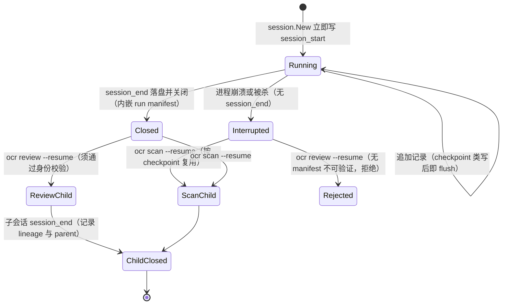
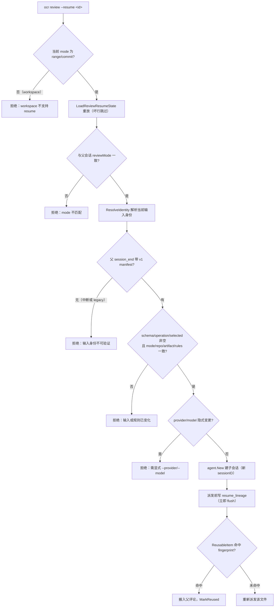

# 会话持久化与断点续跑

> **关联源码**：`internal/session/`
> **前置阅读**：[06-agent-loop.md](06-agent-loop.md)、[08-review-pipeline.md](08-review-pipeline.md)

## 目录

- [1. 会话存储布局](#1-会话存储布局)
- [2. manifest 数据结构](#2-manifest-数据结构)
- [3. 持久化写入](#3-持久化写入)
- [4. 断点续跑 resume](#4-断点续跑-resume)
- [5. 历史与列表](#5-历史与列表)
- [6. 会话比较](#6-会话比较)
- [7. comments.go：评论读取接口](#7-commentsgo评论读取接口)
- [8. testing.go：测试基建](#8-testinggo测试基建)
- [9. session 子命令](#9-session-子命令)
- [10. 源文件覆盖清单](#10-源文件覆盖清单)

---

## 1. 会话存储布局

### 1.1 磁盘目录结构

会话数据的根目录在用户主目录下的 `~/.opencodereview/`，由 `os.UserHomeDir()` 解析（[persist.go](../../internal/session/persist.go#L103-L109)）。其下有两个互不重叠的子目录，由包级变量 `sessionSubDir = "sessions"`（[persist.go](../../internal/session/persist.go#L21)）与 `rawSubDir = "raw"`（[raw_writer.go](../../internal/session/raw_writer.go#L24)）分别管理：

```text
~/.opencodereview/
├── sessions/
│   └── <encoded-repo-path>/        # 每个仓库一个目录
│       ├── <session-id>.jsonl      # 每次运行一个会话文件（UUID v4 命名）
│       └── ...
└── raw/
    └── <encoded-repo-path>/
        └── <session-id>.jsonl      # 原始 LLM HTTP 捕获（按需开启）
```

两个目录刻意分离：会话主 JSONL 是 resume 的 checkpoint 载体，而 raw 捕获是「供下游后处理的未解析字节」，注释明言「the two must never write into each other's files」（[raw_writer.go](../../internal/session/raw_writer.go#L19-L25)）。两处布局保持一致（同样的 `encodeRepoPath(repoDir)` 编码），因此可以按仓库互相发现。

### 1.2 会话命名与仓库目录编码

- **会话 ID**：UUID v4，由 `generateUUID()` 用 `crypto/rand` 生成（[persist.go](../../internal/session/persist.go#L63-L74)）；`rand.Reader` 读失败时退化为 `fallback-<UnixNano>` 字符串，保证不 panic。每次运行（无论是否 resume）都生成全新 ID，因此子会话与父会话是两个独立文件，父文件从不被改写。
- **仓库目录名**：`encodeRepoPath()` 把仓库绝对路径编码为文件系统安全的目录名——先剥离卷名，去掉前导分隔符，再把 `/`、`\` 替换为 `-`，卷名中的 `:` 换成 `_`；空路径返回 `empty`（[persist.go](../../internal/session/persist.go#L76-L101)）。
- **文件名**：`<session-id>.jsonl`，无时间戳前缀；列表排序靠重放 `session_start` 记录里的 timestamp（见第 5 章），而非文件名。

目录以 `0700` 创建、文件以 `0600` 打开（[persist.go](../../internal/session/persist.go#L110-L115)；raw 侧同为 0700/0600，[raw_writer.go](../../internal/session/raw_writer.go#L54-L62)）。会话文件包含完整 prompt、补全与评论；raw 捕获还包含 API 端点信息，注释强调二者都是 per-user 数据。

### 1.3 文件构成：一个 JSONL，十种记录

会话主文件是**单条 JSON Lines 流**，没有独立的 manifest 文件——run manifest 以 `run_manifest` 字段内嵌在最后一条 `session_end` 记录里（[persist.go](../../internal/session/persist.go#L363-L368)）。每行记录通过 `uuid` / `parentUuid` 串成链（`lastUUID` 字段维护，[persist.go](../../internal/session/persist.go#L40-L41)），`session_start` 的 `parentUuid` 为 `nil`。

**表 10-1**：会话 JSONL 的记录类型（写入 API 均在 [persist.go](../../internal/session/persist.go#L136-L418)）

| type | 写入时机 | 代表性字段 | 写入后是否立即 flush |
|---|---|---|---|
| `session_start` | `session.New` 调用即写 | sessionId、cwd、gitBranch、model、reviewMode、diffFrom/diffTo/diffCommit、scanPaths、resumedFrom | 否 |
| `review_item_done` | 单个文件子任务完成 | filePath、oldPath/newPath、fingerprint、comments | **是** |
| `review_item_reused` | resume 命中并复用父 checkpoint | 同上，另加 sourceSessionId | **是** |
| `review_item_failed` | 单个文件子任务失败 | 同上，另加 error | **是** |
| `llm_request` | TaskRecord 创建时（HTTP 调用前） | taskType、request_no、messages | 否 |
| `llm_response` | LLM 响应返回 | content、reasoning_content、tool_calls、usage、duration_ms、native_payload | 否 |
| `llm_error` | LLM 请求失败 | error、duration_ms | 否 |
| `tool_call` | 工具执行后 | tool_name、arguments、result、ok、duration_ms | 否 |
| `resume_lineage` | resume 准入后、派发前（每次 resume 至多一条） | run_id、parent_run_id、source/target provider+model | **是** |
| `session_end` | `SessionHistory.Finalize`（每次运行恰一次） | files_reviewed、duration_seconds、llm_failures、run_manifest | **是**（写后 flush 并关闭文件） |

「是否立即 flush」的含义见第 3 章：checkpoint 类记录是断点续跑的依据，必须写完即落盘；LLM 审计流允许留在 bufio 缓冲里随后续 flush 带出。

Viewer Web 服务器不经过 session 包，而是独立解析同一 `sessions/` 目录树（[store.go](../../internal/viewer/store.go#L32)），详见 [12-viewer-server.md](12-viewer-server.md)。

## 2. manifest 数据结构

[manifest.go](../../internal/session/manifest.go) 定义了版本化的 run manifest：一次 review 运行的不可变覆盖率快照。它只在 Finalize 时产出一次，且**同一个对象**同时序列化到 CLI JSON 与持久化会话，两个出口因此不可能算出不同的覆盖率（[manifest.go](../../internal/session/manifest.go#L270-L274)）。

### 2.1 版本与枚举

- `ManifestSchemaVersion = "ocr.run-manifest/v1"`：消费方必须按此值门控，未知未来版本必须忽略而非误读（[manifest.go](../../internal/session/manifest.go#L20-L23)）。
- `OperationReview = "review"`：v1 中唯一接入 manifest 的操作；scan 保持 legacy、无 manifest（[manifest.go](../../internal/session/manifest.go#L25-L27)）。
- 输入模式（`ManifestInput.Mode`，必填）：`range` / `commit` / `workspace`（[manifest.go](../../internal/session/manifest.go#L33-L47)）。
- 项级失败分类 `FailureClass`：`provider` / `timeout` / `cancelled` / `configuration` / `input` / `budget` / `panic` / `unknown`（[manifest.go](../../internal/session/manifest.go#L53-L64)）。
- 运行级失败分类 `RunFailureClass`：`input` / `configuration` / `timeout` / `cancelled` / `budget` / `internal` / `unknown`。它与项级枚举刻意分离：运行永远不会以 "provider" 或 "panic" 失败（那两者永远归因于单个 item），而 "internal" 是运行级独有的调度器/不变量失败（[manifest.go](../../internal/session/manifest.go#L77-L99)）。`itemFailureForRunClass()` 负责运行级到项级的映射，internal/unknown 落到 `FailureUnknown`（[manifest.go](../../internal/session/manifest.go#L119-L134)）。
- 终态 `TerminalState`：`complete` / `partial` / `failed` / `skipped`。它是**纯覆盖率推导**的产物——只由五个覆盖集合加 `run_failure` 计算，从不依赖评论数或警告（[manifest.go](../../internal/session/manifest.go#L159-L170)）。

### 2.2 RunManifest 逐字段

**表 10-2**：`RunManifest` 结构体与 JSON 形态（[manifest.go](../../internal/session/manifest.go#L274-L286)）

| 字段 | JSON | 说明 |
|---|---|---|
| `SchemaVersion` | `schema_version` | 恒为 `ocr.run-manifest/v1` |
| `RunID` | `run_id` | 即会话 ID（canonical session ID） |
| `ParentRunID` | `parent_run_id,omitempty` | resume 链的直接父运行；父输入永不拷贝进子运行 |
| `Operation` | `operation` | v1 中恒为 `review` |
| `TerminalState` | `terminal_state` | complete / partial / failed / skipped |
| `Repository` | `repository` | 脱敏后的仓库身份，仅 `identity_sha256`（[manifest.go](../../internal/session/manifest.go#L240-L242)） |
| `Input` | `input` | 冻结的已解析输入身份，见下 |
| `Execution` | `execution` | 非机密的执行溯源，见下 |
| `Coverage` | `coverage` | 五个互斥文件集合，见下 |
| `RunFailure` | `run_failure,omitempty` | 整个运行停止的原因；存在即强制终态为 failed |
| `ElapsedMS` | `elapsed_ms` | 运行耗时（毫秒） |

三个子结构：

- **`ManifestInput`**（[manifest.go](../../internal/session/manifest.go#L249-L257)）：`mode`（必填，决定其余字段如何解读）、`requested_from` / `requested_head`（用户输入的原始 ref 拼写）、`resolved_base` / `resolved_head`（执行前捕获的实际 commit SHA，而非可变 ref）、`exact_range`、`source_artifact_sha256`。注释强调子（resume）运行**总是重新计算自己的输入**，而不是拷贝父运行的。
- **`ManifestExecution`**（[manifest.go](../../internal/session/manifest.go#L261-L268)）：`ocr_version`、`provider`、`model`、`configured_concurrency`、`rule_config_sha256`、`runtime_config_sha256`。只存非机密值与哈希——绝不存 token、端点或原始配置。
- **`Coverage`**（[manifest.go](../../internal/session/manifest.go#L231-L237)）：`selected`（分母，等于其余四集合的不相交并集）、`completed`、`reused`、`failed`、`waived`。各数组按 `item_id` 排序且恒非 nil，JSON 渲染为 `[]` 而非 `null`。

`CoverageItem`（[manifest.go](../../internal/session/manifest.go#L181-L188)）的 `item_id` 与 `fingerprint` 是两种互补的身份：前者**内容无关**，由 `ItemID(operation, mode, oldPath, newPath)` 对操作、输入模式与规范化路径做 NUL 连接后取 SHA-256 得到（[manifest.go](../../internal/session/manifest.go#L199-L210)），因此同一逻辑文件即使 diff 内容变了（fingerprint 随之变化）也能在 resume 链上保持稳定 ID；后者保留原始 diff 指纹（含 diff 内容），专用于与 resume checkpoint 索引按键匹配。`normalizePath()` 统一分隔符为 `/` 并 `path.Clean`，消除同一路径的不同拼写（[manifest.go](../../internal/session/manifest.go#L216-L226)）。`classification` / `reason` 只在 failed/waived 项上填充。

### 2.3 ManifestBuilder：两道边界与冲突规则

`ManifestBuilder` 是并发安全的覆盖率累加器（单一互斥锁串行化全部注册、转移与冻结，[manifest.go](../../internal/session/manifest.go#L315-L347)）。生命周期上有两道显式边界：

1. **sealed**：`SealSelected()` 之后 `RegisterSelected()` 返回错误——预派发遍历先注册全部计划内 item 并立即封口，覆盖率分母在派发中途绝不可能被扩大（[manifest.go](../../internal/session/manifest.go#L526-L542)）。注释同时警告：只允许注册「删除/过滤之后的可派发集合」，因为每个从未收到 `Mark*` 的已注册 item 都会在 Finalize 被扫成 failed——注册一个不可派发文件会伪造失败并误报 partial（[manifest.go](../../internal/session/manifest.go#L488-L495)）。
2. **frozen**：`Finalize()` 之后整个 builder 不可变，所有变更调用返回 `errFrozen`，重复 Finalize 幂等地返回同一份冻结 manifest 的拷贝（[manifest.go](../../internal/session/manifest.go#L739-L741)、[manifest.go](../../internal/session/manifest.go#L748-L750)）。

状态转移由单一入口 `transition()` 收口，冲突规则如下（[manifest.go](../../internal/session/manifest.go#L554-L613)）：

- 未知 `item_id`、非法失败分类、空 waive 理由、freeze 后调用、与已记录终态冲突的转移，全部**返回错误而非静默 no-op**——防止一个错键的转移悄悄丢掉一个结果、直到 Finalize（或永远）才被发现。
- 重放同一终态幂等；但 failed 项以不同 `classification` 重标是冲突（reason 是自由文本不参与，机器可读的分类必须一致，否则报错）。
- `RegisterSelected` 重复注册同一 ID 时首次注册胜出（幂等）。

`SetRunFailure` 与 `SetPendingFailureCause` 都遵循「首个原因胜出、同类重记幂等、异类改记报错」（[manifest.go](../../internal/session/manifest.go#L415-L436)、[manifest.go](../../internal/session/manifest.go#L460-L481)）。后者是**受控覆盖率截断**的入口：调用方故意不再覆盖剩余 selected 项（当前唯一的生产者是聚合 token 预算），这些项归因到该特定原因而不是退化为 unknown，且运行终态保持覆盖率推导——只要还有完成/复用就是 partial，只有截断后一无所获才是 failed。`pendingFailureCause` 刻意不进 RunManifest：schema v1 已冻结，该事实已经可以通过 `coverage.failed[].classification` 观察（[manifest.go](../../internal/session/manifest.go#L144-L157)）。

### 2.4 Finalize：清扫、校验与回滚

`Finalize(elapsed)` 按序执行（[manifest.go](../../internal/session/manifest.go#L742-L821)）：

1. **清扫（sweep）**：仍处于 selected 的 item 是没有终态的漏网之鱼（提前退出的 goroutine、派发前取消、受控截断、调用方遗忘的任何路径）。优先级为：`run_failure` 存在则用其映射的项级类着色并强制终态 failed；否则用 pending failure cause 着色、终态保持覆盖率推导；都没有则退到 `FailureUnknown`（[manifest.go](../../internal/session/manifest.go#L765-L778)）。注释明言这只是「进程还能执行 Finalize 时的兜底」——硬 kill 落回到逐项 checkpoint。
2. **构建并校验**：`validateLocked()` 强制契约不变式——非空 run_id/operation、合法 input.mode、`selected` 是四个终态集合的不相交并集（分区大小检查）、每个 failed 项分类合法、每个 waived 项理由非空、run_failure 分类合法（[manifest.go](../../internal/session/manifest.go#L841-L874)）。
3. **校验失败回滚**：清扫写入的状态被恢复原样，builder 不冻结——调用方可以修复校验问题、补记真实结果后重试 Finalize（[manifest.go](../../internal/session/manifest.go#L795-L804)）。
4. **推导终态并冻结**：`computeTerminal()`：run_failure 强制 failed；selected 为空是 skipped；failed 为 0 是 complete；全部失败是 failed；否则 partial（[manifest.go](../../internal/session/manifest.go#L941-L958)）。返回值经 `cloned()` 深拷贝（含 RunFailure），「不可变」契约对原地修改的消费者也成立（[manifest.go](../../internal/session/manifest.go#L876-L892)）。

### 2.5 reason 的脱敏底线

`sanitizeReason()` 是所有写入 manifest 的 reason 的统一「脱敏 + 截断地板」，使任何调用路径都无法把未脱敏的摘要写进 manifest（它同时进 CLI JSON 与持久化会话）：先强制转合法 UTF-8 并剔除控制字符（顺序敏感——先剔控制符再跑正则，否则 `Bearer AAA\x00BBB` 里的 NUL 会截断正则匹配、剥离后把残段拼接回去造成泄漏），再脱敏 URL userinfo、Bearer/Basic token 与凭证式 key=value 赋值，最后按 rune 截断到 500 字符（[manifest.go](../../internal/session/manifest.go#L617-L687)）。注释明确它是地板不是替代：绝对路径、cookie、原始请求/响应体不在此处理，调用方仍须先行摘要。

### 2.6 防护逻辑的测试佐证

[manifest_guards_test.go](../../internal/session/manifest_guards_test.go) 固定了两类守卫：

- **nil receiver 守卫**（`TestManifestBuilderNilReceiver`，[manifest_guards_test.go](../../internal/session/manifest_guards_test.go#L15-L52)）：nil builder 上所有导出方法不得 panic；void setter 静默、错误返回方法返回 `errNilBuilder`、布尔谓词返回 false。这保证了「scan/legacy 会话的 manifest 为 nil」时调用方可以放心直接调用。
- **frozen 无操作守卫**（`TestManifestBuilderFrozenNoOp`，[manifest_guards_test.go](../../internal/session/manifest_guards_test.go#L57-L97)）：Finalize 之后的 void setter 静默 no-op、变更方法返回 `errFrozen`；并断言冻结后的 manifest 仍报告原来的 `parent_run_id`，证明 freeze 后的 `SetParentRunID` 确实没有生效。

[final_manifest_test.go](../../internal/session/final_manifest_test.go#L8-L33) 另外固定了 `SessionHistory.FinalManifest()` 的 nil 语义：nil receiver 不 panic、无 manifest 的会话返回 nil、存取返回携带数据的拷贝。

## 3. 持久化写入

### 3.1 写入时机

**会话创建即落第一笔**。`session.New()` 生成 UUID、构造 `SessionHistory`，并**立即**通过 `WriteSessionStart` 写出 `session_start`（[history.go](../../internal/session/history.go#L155-L188)）。这个「先斩后奏」的时序正是 review 命令层必须把 resume 准入校验放在 `agent.New` 之前的原因——晚一步校验，每次拒绝都会在磁盘上留下一个孤儿会话（[review_cmd.go](../../cmd/opencodereview/review_cmd.go#L370-L383)）。

**checkpoint 逐文件落盘**。每个文件子任务完成/复用/失败时，agent 调 `RecordReviewItemDone/Reused/Failed`（review 侧调用点在 [agent.go](../../internal/agent/agent.go#L760-L789)，scan 侧在 [scan/agent.go](../../internal/scan/agent.go#L619-L736)），落到 `jsonlWriter.writeReviewItemRecord`——写完后**立即 `Flush()`**（[persist.go](../../internal/session/persist.go#L216-L218)）。这正是断点续跑的持久化语义：一个文件的审查结果一出来就安全到盘，进程随后死掉也不丢这个文件。

**LLM 审计流缓冲追加**。`llm_request` / `llm_response` / `llm_error` / `tool_call` 走 `writeRecordLocked()`，只写入 `bufio.Writer` 不主动 flush（[persist.go](../../internal/session/persist.go#L125-L133)），随下一条 checkpoint 的 flush、缓冲区写满或 `session_end` 的收尾 flush 一并落盘。它们的消费者是 `ocr session show` 与 viewer 的审计展示，允许尾部丢失。

**resume 谱系立即落盘**。`WriteResumeLineage` 与 checkpoint 一样写后即 flush，理由写在注释里：谱系的意义就是「熬过一次死掉的运行」，留在缓冲里只会在第一个 item 完成时才到盘——而那正是运行最可能死掉反而没完成的窗口（[persist.go](../../internal/session/persist.go#L352-L358)）。

### 3.2 原子性与错误处理

会话文件**没有 temp 文件 + rename 的原子写**：`open()` 以 `O_CREATE|O_WRONLY|O_TRUNC` 直接截断创建（全新 sessionID 保证不会撞旧文件），之后按行追加（[persist.go](../../internal/session/persist.go#L114-L122)）。崩溃一致性由三层机制替代：

1. 追加式单行记录——一行要么完整要么不完整，重放方按行解析；
2. checkpoint 类记录写后即 flush；
3. `session_end` 是流的最后一条物理记录（不单独追加 `run_manifest` 记录），显式 marshal、write、flush、close，**任何错误都上抛给调用方**作为「交付错误」而不是吞掉（[persist.go](../../internal/session/persist.go#L369-L418)）。普通记录的 marshal 失败只打印一行警告并跳过（[persist.go](../../internal/session/persist.go#L125-L133)），但 session_end 的失败必须让命令层知道 manifest 没到盘。

`SessionHistory.Finalize()` 用 `sync.Once` + 缓存的 `finalizeErr` 保证 `session_end` **恰写一次**：正常、跳过、全失败、运行级失败等多条路径（甚至并发）都可以安全调用；第一次尝试的结果被缓存，后续调用（含重试）读到的是同一份交付结果，而不是让某次重试虚假地报告成功。磁盘 I/O 放在锁外执行（[history.go](../../internal/session/history.go#L315-L361)）。

创建 writer 本身失败（如 home 不可解析、目录不可建）也不会打断运行：错误缓存在 `persistInitErr`，运行仍可产出 CLI manifest，但 Finalize 必须报告「持久化出口从未可用」（[history.go](../../internal/session/history.go#L67-L70)、[history.go](../../internal/session/history.go#L348-L351)）。注释解释了为何 `New` 里不打印警告：它运行在 JSON 输出静默之前，向 stdout 写警告会破坏机器可读输出。

### 3.3 raw 原始捕获

`RawFileWriter` 实现 `llm.RawWriter` 接口，**每次 HTTP attempt 追加一行**到 `~/.opencodereview/raw/<encoded-repo>/<session-id>.jsonl`。与主会话文件的差异（[raw_writer.go](../../internal/session/raw_writer.go#L26-L97)）：

- 以 `O_APPEND` 打开——append-only 捕获的天然模式；
- **不经 bufio，每行编码后直接写盘**，注释直说动机：「so a crashed run keeps every record written up to the crash」；
- 捕获失败**绝不能弄挂 review**：编码或写失败只丢弃该行，`warnOnce` 保证第一个失败在 stderr 报一次警告、后续静默（防止降级的 sink 对每条记录刷屏）。

raw 捕获按需开启（`bindRawWriter`，holder 为 nil 即关闭；打开失败降级为 no-op closer，[shared.go](../../cmd/opencodereview/shared.go#L273-L295)），仓库内没有读取方，定位是用户侧调试数据——用户文档（telemetry 页）将其描述为比会话转录更详细的调试信息，默认关闭。它与 retry 身份无关，只与 HTTP 中间件逐次尝试挂钩（[05-llm-providers.md](05-llm-providers.md)）。

**图 10-1**：session 生命周期与 resume 链



注意中断会话对两条 resume 路线的待遇不同：scan 直接按 checkpoint 索引复用（`Item()`），review 则因身份不可验证而整体拒绝（见第 4 章）。

## 4. 断点续跑 resume

### 4.1 两条链路，两个读取器

`resume.go` 提供同一重放内核的两种包装（[resume.go](../../internal/session/resume.go#L92-L109)）：

- `LoadResumeState`（严格模式）：任何一行解析失败即整体报错。理由：没有 manifest 来仲裁覆盖率时，丢一行与「从未写过这个 checkpoint」不可区分，且 `review_item_failed` 撤回先前 done 记录的配对关系无法从文件其余部分重建（[resume.go](../../internal/session/resume.go#L92-L97)）。**scan 用这个**（[scan_cmd.go](../../cmd/opencodereview/scan_cmd.go#L253-L264)）。
- `LoadReviewResumeState`（宽松模式）：跳过无法解析的行。review 的复用以父 manifest 门控而非这些行为准（见 `ReusableItem`），一条坏 checkpoint 只意味着那个文件被重新审查——「这正是一个损坏的 checkpoint 应该做的事」；反之整体失败会把一行坏数据放大成丢掉所有其他文件的 checkpoint（[resume.go](../../internal/session/resume.go#L101-L109)）。

### 4.2 review 链路的五步准入与复用

命令层把 review resume 组织为五步（[review_cmd.go](../../cmd/opencodereview/review_cmd.go#L343-L412)；06 篇第 3 章已有身份侧的完整论述，此处聚焦 session 侧）：

1. **模式门槛**：`loadReviewResumeState` 先拒绝 workspace 模式（resume 要求 `--from/--to` 或 `--commit`），再以宽松模式重放父会话，并调 `ValidateOptions` 校验双方 reviewMode 一致且为 range/commit 之一（[resume.go](../../internal/session/resume.go#L274-L291)）。注释刻意说明它**不比较 ref 文本**：`abc1234` 与 `abc1234def` 可以指向同一 commit，而拼写没变的 ref 也可能指向新 commit——ref 拼写对输入既不充分也不必要，比对的是已解析的输入身份。
2. **身份解析**：`agent.ResolveIdentity` 在任何会话存在之前算出当前候选运行的 `RunIdentity`（mode、source artifact SHA-256、rule config SHA-256、repository SHA-256 四元组，[resume_identity.go](../../internal/session/resume_identity.go#L8-L17)）。
3. **准入校验**：`ValidateResume` 逐字段比对（下文详述）。它必须发生在 `agent.New` 之前（孤儿会话问题），也必须在 max-tokens 解析之后——过滤大 diff 的依据正是这个上限，被丢掉的文件就不再被输入身份覆盖（[review_cmd.go](../../cmd/opencodereview/review_cmd.go#L374-L383)）。
4. **谱系落盘**：`agent.Run` 在派发任何 item 之前写 `RecordResumeLineage`，且只对被接受的 resume 写——准入已在命令层决定，拒绝发生在会话存在之前（[agent.go](../../internal/agent/agent.go#L369-L374)）。
5. **逐项复用**：`applyResume` 按每个 diff 的 fingerprint 查 `ReusableItem`，命中者直接搬入评论、`RecordReviewItemReused`（把 sourceSessionId 写进子会话）并 `markReused`，未命中者进入正常派发（[agent.go](../../internal/agent/agent.go#L844-L885)）。

**图 10-2**：review resume 判定与复用流程



### 4.3 可续判定：validateInputIdentity

`validateInputIdentity`（[resume_identity.go](../../internal/session/resume_identity.go#L79-L128)）先做五项「父 manifest 可用性」检查，再做四项「输入一致性」检查，顺序自上而下、首个不匹配即决定：

| # | 检查 | 拒绝理由（错误信息要点） |
|---|---|---|
| 1 | `m == nil && !Closed` | 父会话中断未收尾，从未记录 manifest，身份不可验证 |
| 2 | `m == nil`（但 Closed） | 干净收尾但无 manifest——早于 manifest 的 legacy 会话，或冻结前就失败的运行 |
| 3 | schema 版本不是 v1 | 本构建只能验证 v1 |
| 4 | operation 不是 review | v1 的 manifest 只属于 review |
| 5 | `Coverage.Selected` 为空 | 空父与空子都会哈希到空摘要、通过全部比较、产出「无所复用也无事可派」的空运行 |
| 6 | `Input.Mode` 不一致 | mode 参与 item_id 推导，父子的 item 根本无法并排 |
| 7 | `Repository.IdentitySHA256` 不一致 | 已经不是父运行审查的那个仓库 |
| 8 | `Input.SourceArtifactSHA256` 不一致 | ref 可能已指向新 commit，或入选文件集变了 |
| 9 | `Execution.RuleConfigSHA256` 为空或不同 | 规则身份缺失/规则文本层或文件过滤器变了 |

几个值得展开的细节：

- **「manifest 存在但零完成项」与以上全部情形的区分是这套检查的要点**：前者可续（一个全失败的父会话正是 resume 存在的意义），后者全部不可续——[resume_identity_test.go](../../internal/session/resume_identity_test.go#L78-L86) 用 "parent that completed nothing is still resumable" 显式固定了这一点。
- **整体拒绝而非部分复用**：任何输入字段不匹配都拒绝整个 resume，因为「把一份输入算出的结果与另一份输入算出的混在一起，产出的报告里没有任何字段能区分这两者」（[resume_identity.go](../../internal/session/resume_identity.go#L36-L40)）。
- **rule_config 的归因顺序**：`rule_config_sha256` 是规则文本层加文件过滤器的单一聚合哈希，不可分解；源码注释解释了 source_artifact 与 rule_config 的检查顺序问题——过滤器变化实际造成的是输入不匹配，应按输入不匹配报告（[resume_identity.go](../../internal/session/resume_identity.go#L44-L49)）。
- 检查只跑一次（准入时），运行中不再重复：调用方把运行钉死在这场比较所针对的 commit 端点上（`agent.SealedInput`），第二次比较只能确认第一次（[resume_identity.go](../../internal/session/resume_identity.go#L71-L78)）。

### 4.4 provider/model 的「显式变更」契约

`ValidateResume` 的后半段处理执行环境（[resume_identity.go](../../internal/session/resume_identity.go#L58-L68)）：

- provider 变了且**不是**用户在本条命令行上用 flag 明确要求的 → 拒绝。`ProviderExplicit` / `ModelExplicit` 标记值是否来自本条命令行；因配置文件、环境变量或 shell RC 变了的 provider 是**隐式**变更，而隐式变更正是这个检查要抓的对象（[resume_identity.go](../../internal/session/resume_identity.go#L19-L25)）。
- model 只在同 provider 内比较：有意切换 provider 必然带上该 provider 自己的模型（[resume_identity.go](../../internal/session/resume_identity.go#L64-L67)）。
- 被接受的跨 provider/model resume 会写一条 `resume_lineage` 记录（schema 独立版本 `ocr.resume-lineage/v1`，字段全部是非机密标签：run_id、parent_run_id、source/target 的 provider 与 model；`IsTransition()` 由源/目标是否相等直接读出，不需要单独的 transition-kind 字段，[resume_identity.go](../../internal/session/resume_identity.go#L141-L191)）。

### 4.5 复用判定：manifest 担保（ReusableItem）

重放出的 checkpoint 行本身**不足以**支撑 review 复用。`ReusableItem(fingerprint)` 要求父 manifest 同时把该 fingerprint 记录在 completed 或 reused 里（[resume.go](../../internal/session/resume.go#L231-L251)）：

- manifest 是覆盖率的唯一事实源：父运行对每个 item 冻结了裁决，一条 manifest 不为其背书的重放记录是「父运行不为其结果负责的记录」；
- 这也使得被丢掉的 `review_item_failed` 行在这里无害——失败同样记录在 manifest 里，覆盖率不会撒谎（[resume.go](../../internal/session/resume.go#L237-L240)）；
- 担保指纹由 `manifestReusableFingerprints` 从 completed+reused 两集合收集——reused 也算：自己也是 resume 的父运行把没亲自算过的结果向前带，这些结果同样终局（[resume.go](../../internal/session/resume.go#L253-L266)）。

对比之下 `Item()`（无门控按 fingerprint 取 checkpoint）就是 scan 的复用语义：scan 没有 manifest 可查，重放出的 checkpoint 即复用集（[resume.go](../../internal/session/resume.go#L208-L216)）。

### 4.6 orphan request 与 LLM 请求的重放问题

**LLM 请求在 resume 中从不重放**。`llm_request` / `llm_response` 记录是审计流，不是重放日志；resume 的复用粒度是文件级 checkpoint（`review_item_*`），未完成的文件由子运行发起新请求。因此重放器需要正确忽略「发了请求但没有响应」的孤儿记录：现在 TaskRecord 在 HTTP 调用**之前**创建，运行死在请求中途就会在 JSONL 里留下一条没有 `llm_response` 跟随的 `llm_request`。`applyResumeLine` 的 switch 对 `llm_request` 没有任何 case——它是彻底的 no-op——[resume_orphan_request_test.go](../../internal/session/resume_orphan_request_test.go#L19-L59) 固定了这一点：孤儿请求行既不报错也不把 b.go 算成已完成，另一个单测在单元层面断言它连 SessionID / ReviewMode 都不改动（[resume_orphan_request_test.go](../../internal/session/resume_orphan_request_test.go#L63-L74)）。

重放语义的其余三条规则（[resume.go](../../internal/session/resume.go#L150-L187)）：

- **同 fingerprint 后写覆盖先写**：`review_item_done` / `review_item_reused` 写入 `Items[fingerprint]`，天然支持「重试后覆盖」；
- **`review_item_failed` 删除对应 fingerprint 的 checkpoint**：失败即撤回该文件此前可能存在的完成记录；
- `session_end` 置 `Closed = true` 并在带 manifest 时更新 `Manifest`（「最后一条胜出」——重放截断写不应清掉更早的好值）。

`Closed` 与 `Manifest` 的组合含义值得强调：`Closed` 区分「中断的父会话」与「收尾但没什么可验证的父会话」（legacy / 冻结前失败），这正是 validateInputIdentity 第 1、2 条分支能给出不同错误信息的原因（[resume.go](../../internal/session/resume.go#L33-L42)）。

### 4.7 scan 链路

scan resume 走严格读取器 `LoadResumeState` + `ValidateScanOptions`：要求父会话 reviewMode 是 `full_scan`，且若父会话记录了 scan path scope（`HasScanPathScope`），则当前 scope 必须与其一致（[resume.go](../../internal/session/resume.go#L294-L309)）。scope 比较前经 `normalizeScanPaths` 规范化：trim 空格、去 `./` 前缀与尾部 `/`、去重、排序，所以 `./src/` 与 `src` 匹配（[resume.go](../../internal/session/resume.go#L311-L332)，[validate_scan_options_test.go](../../internal/session/validate_scan_options_test.go#L38-L60) 佐证）。父会话未记录 scope 时跳过 scope 检查（[validate_scan_options_test.go](../../internal/session/validate_scan_options_test.go#L62-L71)）。命令层另要求 checkpoint 索引非空，否则报「无可复用扫描项」（[scan_cmd.go](../../cmd/opencodereview/scan_cmd.go#L260-L264)）。scan 流水线细节见 [09-scan-pipeline.md](09-scan-pipeline.md)。

## 5. 历史与列表

[list.go](../../internal/session/list.go) 提供 `ocr session list/show` 的数据层，全部是只读重放。

- **`ListSessions(repoDir)`**（[list.go](../../internal/session/list.go#L106-L138)）：枚举 `SessionsDir` 下全部 `.jsonl`（跳过子目录与其他后缀），每个文件重放成 `Summary`，**按 StartTime 降序**（最新在前）。目录不存在返回空切片无错误；单个文件重放失败**静默跳过**（`loadSummaryFromFile` 出错即 `continue`）——一条坏会话不应让整个列表消失。
- **错误处理边界**：`os.ReadDir` 的非 NotExist 错误必须上抛。[list_error_test.go](../../internal/session/list_error_test.go#L16-L42) 用「目录路径被普通文件占据」（ENOTDIR）固定该分支；该测试同时注释了 Windows 上此分支不可达（readdir 把这种情形报告为空列表而非错误）并跳过。
- **`LoadSummary` / `LoadDetail`**（[list.go](../../internal/session/list.go#L142-L176)）：单会话摘要 / 摘要 + 逐文件 `ItemDetail`。`LoadDetail` 预置 `Aborted: true`，只有重放到 `session_end` 才翻为 false。
- **重放内核 `walkSessionFile`**（[list.go](../../internal/session/list.go#L196-L219)）：逐行解析为 `summaryRecord`（`resumeRecord` 的超集，额外携带 session_end 与 lineage 字段，[list.go](../../internal/session/list.go#L64-L94)），**解析失败的行静默跳过**——列表场景对坏行的容忍度与 resume 宽松模式一致。
- **`applyRecordToSummary`** 的 legacy 分支（[list.go](../../internal/session/list.go#L221-L294)）：`session_end` 带 v1 manifest 时，五个计数字段直接采信 manifest（selected/completed/reused/failed/waived 取各集合长度）；无已知 v1 manifest 的收尾会话标记 `Legacy = true`，保留 checkpoint 计数、必要时从 `files_reviewed` 回填，且**绝不推断出 v1 终态**。`resume_lineage` 记录只在 schema 版本匹配时才读——「本构建不理解的版本未必意味着这些字段是现在的含义」，未知版本整条忽略（[list.go](../../internal/session/list.go#L241-L256)）。
- `recordToItem` 只转换 `review_item_*` 三类为 `ItemDetail`，`FilePath` 空时回退 `NewPath`（[list.go](../../internal/session/list.go#L296-L318)，[list_error_test.go](../../internal/session/list_error_test.go#L46-L64) 佐证）；`countCommentsRaw` 只数评论条数不反序列化整个数组。

`Summary` 结构（[list.go](../../internal/session/list.go#L20-L48)）因此同时承载新旧的两种口径：有 manifest 的会话走覆盖率字段 + `RunManifest`，legacy 会话走 checkpoint 计数 + `Legacy` 标记，中断会话保持 `Aborted`。

## 6. 会话比较

[compare.go](../../internal/session/compare.go) 回答「两次运行之间，发现的问题发生了什么变化」，是 `ocr session compare` 的核心。

`Compare(before, after, afterReviewed)` 把 before 的 findings 与 after 的分进四个互斥桶（[compare.go](../../internal/session/compare.go#L13-L23)）：

| 桶 | 含义 |
|---|---|
| `New` | after 有、before 没有 |
| `Persisting` | 两边都有（取 after 的拷贝，因为它带当前行号） |
| `Resolved` | before 有、after 没有，**且** after 确实复查过该文件 |
| `NotReviewed` | before 有、after 没有，但 after 从未看过该文件——不算 resolved，没人复查过它 |

匹配是 **findingKey 上的多重集匹配**：N 条相同 before 对 M 条 after 产出 min(N,M) 条 persisting，余数落到长的一边（[compare.go](../../internal/session/compare.go#L25-L34)）。`findingKey = normalizePath(path) + "|" + lower(category) + "|" + normalizeSnippet(snippet 或 content)`——**刻意不含行号**，因此仅因代码下移而漂移的 finding 仍能匹配（[compare.go](../../internal/session/compare.go#L81-L104)）。`normalizeSnippet` 把所有空白折叠成单空格，重排缩进不改变身份（[compare.go](../../internal/session/compare.go#L107-L112)）。

`afterReviewed` 来自 after 会话 manifest 的 **Completed + Reused** 两集合（命令层 `reviewedPaths`，[session_cmd.go](../../cmd/opencodereview/session_cmd.go#L305-L327)）——注释解释了为何不用 Selected（那是意图集合，中断运行会把没看过的文件全报成干净）也不用 Failed/Waived（未决）。legacy 会话（无 manifest）传 nil，Compare 退化为「每条未匹配的 before 都算 resolved」。源码以 `ponytail:` 标注了两个已知的刻意取舍：与 cmd 层的 SARIS 指纹**刻意分离**（后者是已发布 GitHub 告警的身份，改归一化会重开下游每条告警）；无 snippet 时回退到 prose 而非 StartLine（行号回退会重新破坏行漂移容忍）；重命名文件会读成 resolved + new（升级路径：经 after manifest 的 `OldPath -> Path` 映射，[compare.go](../../internal/session/compare.go#L85-L103)）。

四个桶输出前都过 `sortFindings`（path、start line、category、content、snippet 五级稳定排序并保证非 nil）——New 桶从 map 排空，没有 snippet 兜底排序的话 `--json` 输出在两次运行间不可 diff（[compare.go](../../internal/session/compare.go#L114-L141)）。

## 7. comments.go：评论读取接口

`LoadComments(repoDir, sessionID)` 重放一个会话并按**文件完成顺序**返回全部评论（[comments.go](../../internal/session/comments.go#L12-L27)）。它的重放语义刻意与 resume 一致：

- 同 fingerprint 的后续 checkpoint **覆盖**前一条（重试后的新评论替换旧的）；
- `review_item_failed` **清空**该 fingerprint 组的评论；
- 持久化时没有 path 的评论继承记录的 filePath（[comments.go](../../internal/session/comments.go#L36-L60)）。

实现上复用 `walkSessionFile`，用 `order` 切片保持完成顺序、`byFingerprint` 索引做去重。它是 `ocr session comments` 的数据源（[session_cmd.go](../../cmd/opencodereview/session_cmd.go#L200-L232)），命令层在其上叠加 severity/category 过滤。Viewer 展示单会话评论走自己的解析器（[12-viewer-server.md](12-viewer-server.md)）。

## 8. testing.go：测试基建

[testing.go](../../internal/session/testing.go#L12-L16) 只有一个函数：`UseTestSessions()` 把 `sessionSubDir` 改为 `"test-sessions"`、`rawSubDir` 改为 `"test-raw"`，让测试运行不污染真实存储。注释规定了使用契约：必须在 `_test.go` 的 `init()` 或 `TestMain` 里、任何测试 goroutine 启动之前调用，且**非并发安全**。

配套的 [test_home_test.go](../../internal/session/test_home_test.go#L8-L18) 提供 `setTestHome`：同时设置 `HOME` 与 `USERPROFILE`。注释解释了为什么只设 HOME 不够：Windows 上 `os.UserHomeDir()` 优先读 USERPROFILE，漏设的话测试会读写开发者真实的 `~/.opencodereview`。这两个函数共同构成 session 包（以及依赖它的包）的测试地基：目录重定向防污染，家目录重定向防越界，其余行为全部在真实文件系统上执行（无 mock fs 层）。

## 9. session 子命令

[session_cmd.go](../../cmd/opencodereview/session_cmd.go#L20-L28) 定义 `ocr session`（别名 `sessions`）父命令与四个子命令：

**表 10-3**：session 子命令面板（[session_cmd.go](../../cmd/opencodereview/session_cmd.go#L34-L95)）

| 子命令 | 参数 | 关键 flag | 行为 |
|---|---|---|---|
| `list`（别名 `ls`） | 无 | `--repo`、`--json`、`--limit`（默认 20，0 = 不限） | `ListSessions` + 截断 limit；表格或 JSON 输出（[session_cmd.go](../../cmd/opencodereview/session_cmd.go#L149-L174)） |
| `show` | `<session-id>` | `--repo`、`--json` | `LoadDetail`；文本模式打印元数据 + coverage 行 + 逐文件表（TYPE/FILE/COMMENTS/NOTE），reused 标注来源会话、failed 截断显示错误（[session_cmd.go](../../cmd/opencodereview/session_cmd.go#L176-L198)、[session_cmd.go](../../cmd/opencodereview/session_cmd.go#L423-L486)） |
| `comments` | `<session-id>` | `--repo`、`--json`、`--severity`、`--category` | `LoadComments` + 逗号分隔大小写不敏感过滤；按 `ocr review` 终端格式逐条渲染（[session_cmd.go](../../cmd/opencodereview/session_cmd.go#L200-L232)） |
| `compare`（别名 `diff`） | `<before-id> <after-id>` | `--repo`、`--json` | 见下 |

`compare` 的命令层约束（[session_cmd.go](../../cmd/opencodereview/session_cmd.go#L234-L287)）：

- **跨仓库比较是错误**而非警告——两个 session 的 `RepoDir` 不同直接报错；review mode 或范围不同只是 stderr 警告（警告绝不上 stdout，`--json` 会被管道进其他工具）；
- `reviewedPaths` 只取 after manifest 的 Completed+Reused（语义见第 6 章）；
- 文本输出打印 `N new, N persisting, N resolved`，NotReviewed 非零时单独一行说明「未计入 resolved」。

辅助设施：`completeSessionIDs`（[session_cmd.go](../../cmd/opencodereview/session_cmd.go#L101-L123)）为 shell 补全提供最新在前的会话 ID 及摘要描述（compare 因有两个位置参数而对 args 做了重置处理）；`resolveWorkingDirForSession` 与 review 的 `resolveRepoDir` 不同——**不要求目标是 git 仓库**，用户归档掉 checkout 之后仍能查看历史会话（[session_cmd.go](../../cmd/opencodereview/session_cmd.go#L394-L404)）。

状态描述 `describeStatus`（[session_cmd.go](../../cmd/opencodereview/session_cmd.go#L547-L563)）集中了三口径：`aborted`（无 session_end）、manifest 的 `TerminalState`（complete/partial/failed/skipped，未知值显示 unknown）、以及 legacy 会话的 `legacy` / `legacy (N fail)`。

## 10. 源文件覆盖清单

| 源文件 | 职责 | 关键符号 |
|---|---|---|
| [manifest.go](../../internal/session/manifest.go) | run manifest 的数据结构、并发安全的覆盖率构建器（sealed/frozen 边界、Finalize 校验与回滚）、reason 脱敏底线 | `RunManifest`、`ManifestBuilder`、`Coverage`、`ItemID`、`sanitizeReason`、`Finalize` |
| [persist.go](../../internal/session/persist.go) | 会话 JSONL 写入器：路径布局（`sessions/`、`encodeRepoPath`）、UUID 链、十类记录的序列化与 flush 策略 | `jsonlWriter`、`generateUUID`、`encodeRepoPath`、`WriteSessionStart`、`WriteSessionEnd` |
| [resume.go](../../internal/session/resume.go) | 父会话重放为 checkpoint 索引（`ResumeState`）及 review/scan 各自的选项校验 | `LoadResumeState`、`LoadReviewResumeState`、`applyResumeLine`、`ReusableItem`、`ValidateOptions`、`ValidateScanOptions` |
| [resume_identity.go](../../internal/session/resume_identity.go) | resume 准入的身份契约：输入身份逐字段比对、provider/model 显式变更要求、resume 谱系记录 | `RunIdentity`、`ResumeRequest`、`ValidateResume`、`ResumeLineage`、`NewResumeLineage` |
| [history.go](../../internal/session/history.go) | 会话内存模型与对外记录 API：文件级 checkpoint、LLM/工具审计流、`Finalize` 恰一次收尾 | `SessionHistory`、`FileSession`、`TaskRecord`、`New`、`Finalize`、`RecordReviewItemDone` |
| [list.go](../../internal/session/list.go) | 会话列表/摘要/明细的只读重放（`session list/show` 数据层），legacy 双口径 | `Summary`、`ItemDetail`、`ListSessions`、`LoadSummary`、`LoadDetail`、`walkSessionFile` |
| [comments.go](../../internal/session/comments.go) | 单会话评论重放（fingerprint 覆盖/撤回语义），`session comments` 数据源 | `LoadComments` |
| [compare.go](../../internal/session/compare.go) | 两次 run 的 findings 四桶分组比较（new/persisting/resolved/not_reviewed） | `Compare`、`CompareResult`、`findingKey`、`sortFindings` |
| [raw_writer.go](../../internal/session/raw_writer.go) | 原始 LLM HTTP 捕获的 append-only JSONL（`raw/` 目录，写失败降级不阻跑） | `RawFileWriter`、`NewRawFileWriter`、`Write`、`warn` |
| [testing.go](../../internal/session/testing.go) | 测试基建：把持久化目录重定向到 `test-sessions` / `test-raw` | `UseTestSessions` |

测试文件（不入清单，但作为本篇佐证引用）：`manifest_guards_test.go`、`manifest_test.go`、`persist_test.go`、`resume_test.go`、`resume_identity_test.go`、`resume_orphan_request_test.go`、`final_manifest_test.go`、`validate_scan_options_test.go`、`history_test.go`、`list_test.go`、`list_more_test.go`、`list_error_test.go`、`compare_test.go`、`comments_test.go`、`raw_writer_test.go`、`test_home_test.go`。
