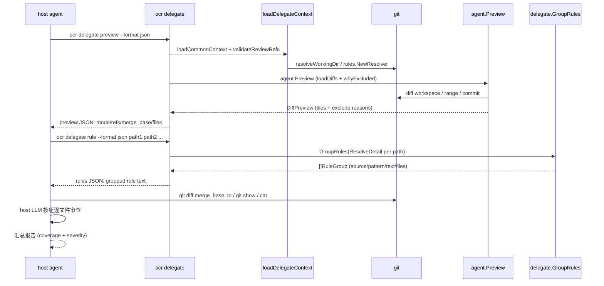
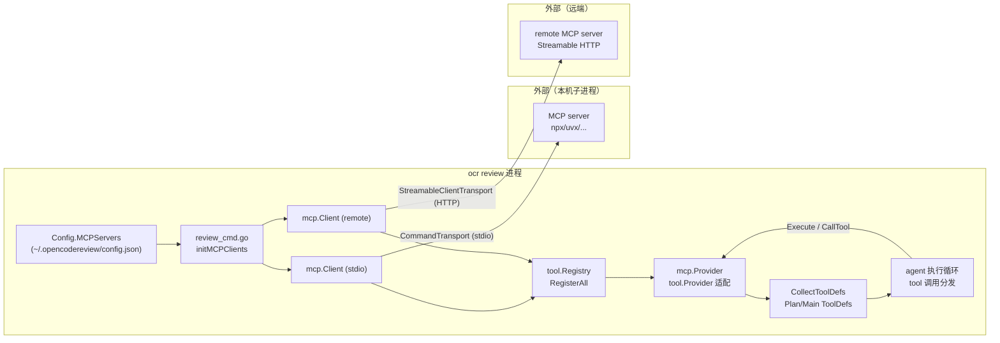

# Delegate 委托与 MCP

> **关联源码**：`internal/delegate/`、`internal/mcp/`、`cmd/opencodereview/delegate_cmd.go`
> **前置阅读**：[08-review-pipeline.md](08-review-pipeline.md)

## 目录

- [1. 委托模式动机](#1-委托模式动机)
- [2. delegate_cmd.go 走读](#2-delegate_cmdgo-走读)
- [3. format.go：面向 agent 的输出格式](#3-formatgo面向-agent-的输出格式)
- [4. rulegroup.go：委托场景下的规则组选择](#4-rulegroupgo委托场景下的规则组选择)
- [5. MCP 集成架构](#5-mcp-集成架构)
- [6. 与 IDE/agent 生态的对接链路](#6-与-ideagent-生态的对接链路)
- [7. 源文件覆盖清单](#7-源文件覆盖清单)

---

## 1. 委托模式动机

### 1.1 定位：OCR 出确定性工程，宿主 agent 出智能

README 对委托模式的一句话定义是「let your AI coding agent perform the review itself — OCR handles file selection and rule resolution; no LLM configuration needed」（[README.md](../../README.md#L158-L161)），并在配置章节明确「You must configure an LLM before reviewing code, unless you use Delegation Mode」（[README.md](../../README.md#L119)）。源码侧的对应表述在 `internal/delegate` 包文档里：委托模式下 OCR 产出「审查规格」（spec），全程不调任何 LLM（[rulegroup.go](../../internal/delegate/rulegroup.go#L4-L6)）；CLI 层的命令描述也是「Output review spec for host-agent delegation (no LLM required)」（[delegate_cmd.go](../../cmd/opencodereview/delegate_cmd.go#L36-L55)）。

换句话说，委托模式把 [08-review-pipeline.md](08-review-pipeline.md) 里的流水线从中间砍断：保留前半段（diff 收集、文件过滤、规则解析），丢弃后半段（LLM 调用、评论过滤、输出渲染），把「推理」这一步交还给宿主 agent。官方文档给出的适用场景是订阅制的编码 agent（Claude Code、Codex、Cursor、Open Code、Qoder 等）——宿主已自带 LLM 订阅额度，委托模式让审查复用这份额度，省去为 OCR 单独配置 API key（[delegate.md](../../pages/src/content/docs/en/integrations/delegate.md#L11-L28)）。

### 1.2 为什么父 agent 不把全部活儿自己干

父 agent 理论上可以自己跑 `git diff` 再逐文件审，但 OCR 的价值在前半段的**确定性工程**，且这段逻辑并非表面那么简单：

- **文件选择算法与 review 完全同源**。委托命令复用 `loadCommonContext`（模板、仓库解析、git 并发限制、规则 Resolver，[shared.go](../../cmd/opencodereview/shared.go#L92-L129)），再走 `agent.Preview` 的过滤算法——二进制排除、扩展名白名单、默认路径排除、用户 include/exclude、删除文件排除等，口径与真正跑 `ocr review` 时一字不差（见 [preview.go](../../internal/agent/preview.go#L34-L60) 的 `whyExcluded`）。
- **规则解析带分层与匹配语义**。规则来自 custom/project/global/system 四层、按 glob 模式首配优先、还有内容嗅探兜底（详见 [04-config-rules.md](04-config-rules.md)）；父 agent 若自行复刻这套语义，极易与 OCR 侧漂移。
- **安全防线复用**。`loadDelegateContext` 里同样调用 `validateReviewRefs` 拒绝 ref-option 注入（[delegate_cmd.go](../../cmd/opencodereview/delegate_cmd.go#L104-L108)），这条防线与 review 共用（[review_cmd.go](../../cmd/opencodereview/review_cmd.go#L466-L476)）。
- **规则去重**。规则文本是整篇 Markdown，多个文件命中同一规则时按组输出一次（见第 4 节），父 agent 的上下文不会被重复文本撑爆。

### 1.3 与直接跑 review 的区别：`--audience agent` 的输出适配

OCR 自管 LLM 的路径上，其实也有一档「为 agent 消费设计」的输出：`ocr review --audience agent --format json`。`--audience` flag 的语义是「human（展示进度；json/sarif 时进度走 stderr）或 agent（只输出摘要）」（[shared_flags.go](../../cmd/opencodereview/shared_flags.go#L34-L38)）。本仓库自己的工作流也依赖它——[AGENTS.md](../../AGENTS.md) 要求提交前用 `ocr review --audience agent` 做代码审查。两条路径的完整对比：

| 维度 | `ocr review --audience agent` | `ocr delegate preview/rule` |
|---|---|---|
| LLM | OCR 调用自己配置的 provider | 宿主 agent 用自己的模型 |
| API key | 需要 | 不需要 |
| 会话持久化 | JSONL session（[10-session-persistence.md](10-session-persistence.md)） | 无（测试断言不创建 session store，[delegate_exec_test.go](../../cmd/opencodereview/delegate_exec_test.go#L153-L167)） |
| 输出物 | 结构化评论（JSON/SARIF/text） | 审查「规格」：文件清单 + 规则组 |
| 后续动作 | OCR 已完成审查 | 父 agent 拿规格自己跑 git、自己审 |
| background 支持 | `--background/-B` | 同一套（[delegate_cmd.go](../../cmd/opencodereview/delegate_cmd.go#L110-L114)） |

`--audience agent` 解决的是「输出怎么给机器读」；委托模式更进一步，把「推理本身」也交出去。两者不是竞争关系：前者适合 CI 与自动化脚本，后者适合已驻留在 IDE 里的对话式 agent。

## 2. delegate_cmd.go 走读

### 2.1 子命令面与参数

`delegate` 在 [root.go](../../cmd/opencodereview/root.go#L46-L55) 注册为一级命令（别名 `d`，[delegate_cmd.go](../../cmd/opencodereview/delegate_cmd.go#L38)），父命令本身只是 `cmd.Help()` 占位，挂两个子命令（[delegate_cmd.go](../../cmd/opencodereview/delegate_cmd.go#L83-L88)）：

- `ocr delegate preview [flags]`：输出待审查文件清单 + 模式/ref 元数据，`cobra.NoArgs`（[delegate_cmd.go](../../cmd/opencodereview/delegate_cmd.go#L57-L68)）；
- `ocr delegate rule [flags] <path...>`：输出按内容分组的规则，`minimumArgs(1)`（[delegate_cmd.go](../../cmd/opencodereview/delegate_cmd.go#L70-L81)，`minimumArgs` 定义于 [arg_errors.go](../../cmd/opencodereview/arg_errors.go#L34)）。

两个子命令共享同一份 [delegateOptions](../../cmd/opencodereview/delegate_cmd.go#L20-L31)（repoDir/from/to/commit/excludes/rulePath/background/backgroundFile/maxGitProcs/format），flag 注册集中在 [registerDelegateFlags](../../cmd/opencodereview/shared_flags.go#L249-L259)：`--repo`、`--from/--to/--commit`、`--exclude`、`--rule`、`--background/-b`、`--background-file/-B`、`--max-git-procs`（默认 16）、`--format/-f`（text/json；flag help 明确「sarif is not supported by delegate mode」）。参数校验在 [validateDelegateOptions](../../cmd/opencodereview/shared_flags.go#L191-L199)：先走 `validateDiffMode`（模式互斥、`--from`/`--to` 必须成对，[shared_flags.go](../../cmd/opencodereview/shared_flags.go#L85-L103)），再校验 format 只能是 text/json——空值、`yaml`、`sarif` 全部拒绝（用例见 [delegate_helpers_test.go](../../cmd/opencodereview/delegate_helpers_test.go#L17-L27)）。

### 2.2 执行流程：loadDelegateContext

[loadDelegateContext](../../cmd/opencodereview/delegate_cmd.go#L96-L117) 是两个子命令共用的装配序列：

1. 计算 `contentRef`：`tool.ParseReviewMode(from, to, commit).RefValue(to, commit)`（[delegate_cmd.go](../../cmd/opencodereview/delegate_cmd.go#L97)）——决定规则嗅探等操作在哪个 ref 上读文件内容；
2. `loadCommonContext(repoDir, rulePath, contentRef, 0, maxGitProcs, true)`（[delegate_cmd.go](../../cmd/opencodereview/delegate_cmd.go#L98)）：加载默认模板、解析工作目录（`requireGit=true`，非 git 仓库报错，测试佐证 [delegate_exec_test.go](../../cmd/opencodereview/delegate_exec_test.go#L265-L270)）、构造 `gitcmd.Runner` 与规则 Resolver；
3. `applyCLIExcludes` 应用 `--exclude`（[delegate_cmd.go](../../cmd/opencodereview/delegate_cmd.go#L102)）；
4. `validateReviewRefs`：拒绝 ref-option 注入（[delegate_cmd.go](../../cmd/opencodereview/delegate_cmd.go#L105-L108)）；
5. `resolveBackground` 解析业务背景（[delegate_cmd.go](../../cmd/opencodereview/delegate_cmd.go#L110-L114)）：`-B` 文件优先于 `-b` 内联文本（[background_file.go](../../cmd/opencodereview/background_file.go#L32-L48)）；commit 模式下若都没给，自动取 commit message 作为 background（[background_file.go](../../cmd/opencodereview/background_file.go#L58-L62)，测试注释佐证 [delegate_exec_test.go](../../cmd/opencodereview/delegate_exec_test.go#L141-L151)）。

装配产物是 [delegateContext](../../cmd/opencodereview/delegate_cmd.go#L90-L117)，挂四个方法：`preview` 转调 [agent.Preview](../../cmd/opencodereview/delegate_cmd.go#L119-L129)；`mergeBase` 仅 range 模式经 `diff.NewProvider(...).MergeBase` 计算（[delegate_cmd.go](../../cmd/opencodereview/delegate_cmd.go#L131-L138)，非 range 返回空串的用例见 [delegate_helpers_test.go](../../cmd/opencodereview/delegate_helpers_test.go#L58-L67)）；`reviewMode` 按 commit > range > workspace 判定（[delegate_cmd.go](../../cmd/opencodereview/delegate_cmd.go#L141-L150)）；`resolver` 暴露规则 Resolver（[delegate_cmd.go](../../cmd/opencodereview/delegate_cmd.go#L152-L155)）。

**图 11-1**：委托模式端到端时序（父 agent 两次调用 ocr 子进程，审查本身发生在父 agent 侧）



### 2.3 executeDelegatePreview：文件清单规格

[executeDelegatePreview](../../cmd/opencodereview/delegate_cmd.go#L157-L223) 先跑 `dc.preview(ctx)`，再取 `mergeBase`，然后按 `--format` 分叉：

- **JSON 分支**（[delegate_cmd.go](../../cmd/opencodereview/delegate_cmd.go#L169-L187)）：整体装进 `delegatePreviewJSON` 信封（见 2.5）。
- **text 分支**（[delegate_cmd.go](../../cmd/opencodereview/delegate_cmd.go#L189-L220)）：先输出 `# Files (N reviewable / M total)` 头部与键值元数据块（mode/from/to/commit/merge_base/background/total_insertions/total_deletions），再逐文件输出条目：reviewable 文件用两空格缩进的 `- \`path\` [status] +N/-M`；被排除文件用 `~~` 包裹（Markdown 删除线）并附 `(excluded: reason)`（[delegate_cmd.go](../../cmd/opencodereview/delegate_cmd.go#L209-L219)）。`merge_base` 只在 range 模式输出（[delegate_cmd.go](../../cmd/opencodereview/delegate_cmd.go#L200-L201)），父 agent 用它构造 `git diff merge_base..<to>`（见 SKILL.md 第 3 步）。

### 2.4 executeDelegateRule：规则组规格

[executeDelegateRule](../../cmd/opencodereview/delegate_cmd.go#L225-L240) 先 `delegate.GroupRules(dc.resolver(), paths)` 分组，再分叉：JSON 走 [ruleGroupsJSON](../../cmd/opencodereview/delegate_cmd.go#L300-L314) 转换，text 直接调 [delegate.RuleGroupsMarkdown](../../internal/delegate/format.go#L11-L28)。注意 `rule` 命令的 paths 由父 agent 传入（通常是 preview 结果里的 reviewable 路径），OCR 不做「必须是 reviewable 文件」的强校验——命令语义是「解析这些路径的规则」。

### 2.5 JSON 契约：schema_version = "1"

两个输出共享常量 [delegateSchemaVersion = "1"](../../cmd/opencodereview/delegate_cmd.go#L242)，字段结构如下：

- [delegatePreviewJSON](../../cmd/opencodereview/delegate_cmd.go#L252-L268)：`schema_version`、`mode`、`repository`、`from/to/commit/merge_base/background`、`total_files`、`reviewable_count`、`excluded_count`、`total_insertions/deletions`、`reviewable_files`、`excluded_files`；
- [delegatePreviewFileJSON](../../cmd/opencodereview/delegate_cmd.go#L244-L250)：`path/status/insertions/deletions/exclude_reason`；
- [delegateRulesJSON](../../cmd/opencodereview/delegate_cmd.go#L278-L281)：`schema_version` + `groups`；每组是 [delegateRuleGroupJSON](../../cmd/opencodereview/delegate_cmd.go#L270-L276)：`group_id/source/pattern/files/rule`。

两个对 agent 消费很关键的工程细节：

1. **数组永不为 null**。`previewFiles` 用 `make(..., 0)` 初始化（[delegate_cmd.go](../../cmd/opencodereview/delegate_cmd.go#L283-L298)），`ruleGroupsJSON` 同样（[delegate_cmd.go](../../cmd/opencodereview/delegate_cmd.go#L303)），空结果序列化为 `[]` 而非 `null`——测试分别断言「JSON arrays must not be null」（[delegate_exec_test.go](../../cmd/opencodereview/delegate_exec_test.go#L199-L201)）与「files JSON must be []」（[delegate_exec_test.go](../../cmd/opencodereview/delegate_exec_test.go#L223-L245)）。
2. **不转义 HTML**。[writeDelegateJSON](../../cmd/opencodereview/delegate_cmd.go#L316-L321) 设置 `SetEscapeHTML(false)`，路径里的 `<`/`>` 等字符原样输出，避免父 agent 拿到 `&lt;` 之类的噪音。

### 2.6 与 review 主流程的复用关系

delegate 与 review 的关系可以概括为「同一前处理，不同后处理」：

- 共享 `loadCommonContext` 启动序列（[02-cli-commands.md](02-cli-commands.md) 7.1 节详述）；
- 共享 `agent.Preview` 引擎——`ocr review --preview` 的 [runPreviewContext](../../cmd/opencodereview/review_cmd.go#L493-L507) 调的是同一个函数；
- 关键差异：`agent.Preview` 刻意**不构建任何 review 运行时**——无 session、无 manifest、无 runner（[preview.go](../../internal/agent/preview.go#L62-L70) 注释），所以 preview/delegate 不会在 OCR home 下留下未终结的 JSONL 文件（测试 [TestExecuteDelegatePreviewCreatesNoSession](../../cmd/opencodereview/delegate_exec_test.go#L153-L167) 与 [assertNoSessionStore](../../cmd/opencodereview/delegate_exec_test.go#L106-L115) 专门守这条线）；
- delegate 全程不触碰 `loadLLMRuntime`、`buildToolRegistry`、`initMCPClients`——第 5 节的 MCP 桥接只属于 review 流水线。

## 3. format.go：面向 agent 的输出格式

整个 [format.go](../../internal/delegate/format.go#L11-L28) 只有一个函数 `RuleGroupsMarkdown`，把规则组渲染成 Markdown 小节，骨架是：

```markdown
### Rule Group 1: project / internal/**

Applies to:
- internal/agent/agent.go
- internal/llm/client.go

#### Content

(整篇规则文本)
```

实现逐行看：组间以 `\n---\n\n` 分隔（[format.go](../../internal/delegate/format.go#L16)）；组标题把三元组 `ID / Source / Pattern` 拼进 `### Rule Group %d: %s / %s`（[format.go](../../internal/delegate/format.go#L18)）；`Applies to:` 后逐行列文件（[format.go](../../internal/delegate/format.go#L19-L21)）；`#### Content` 之后是整段规则文本（[format.go](../../internal/delegate/format.go#L23-L24)）。渲染契约由 [format_test.go](../../internal/delegate/format_test.go#L24-L45) 钉死：单组的四个锚点子串、多组的 `---` 分隔。

这个格式是为「父 agent 的上下文」设计的：

- **标题即索引**。父 agent 为某文件找规则时只需按 `path -> group` 的 `Applies to` 列表定位，再读对应组的 `Content`；
- **Markdown 与 agent 的系统提示天然兼容**。宿主 agent 的技能文本（SKILL.md）本身是 Markdown，规则组可以直接嵌进审查 prompt；
- **与 JSON 分工**。text 面向对话式 agent 直接阅读，JSON 面向程序化集成（信封带 `schema_version`，可演进）。

另有一条跨包的隐性契约值得记录：规则解析的 `RuleDetail.SniffedAs`（内容嗅探标记）被显式标注为「内部字段，序列化 `RuleDetail` 的调用方（点名 delegateRuleGroupJSON）不得输出它」，因为 `Pattern` 是「命中的 glob」这一版本化契约，嗅探注记会悄悄破坏它（[system_rules.go](../../internal/config/rules/system_rules.go#L132-L137)）。也就是说，委托输出里的 `pattern` 字段永远是干净的 glob 或 `default`。

## 4. rulegroup.go：委托场景下的规则组选择

### 4.1 数据结构与算法

[RuleGroup](../../internal/delegate/rulegroup.go#L12-L19) 五个字段：`ID`（从 1 递增）、`Source`（"custom" | "project" | "global" | "system" 四层）、`Pattern`（命中的 glob，或 "default"）、`Text`（解析后的完整规则文本）、`Files`（组内文件）。

[GroupRules](../../internal/delegate/rulegroup.go#L27-L62) 的分组算法：

1. 先断言 Resolver 是否实现了 [rules.DetailResolver](../../internal/config/rules/system_rules.go#L140-L143)（[rulegroup.go](../../internal/delegate/rulegroup.go#L28)）。实现了就逐路径 `ResolveDetail(path)` 拿 `(source, pattern, text)` 三元组（[rulegroup.go](../../internal/delegate/rulegroup.go#L35-L40)）；否则退化为 `resolver.Resolve(path)` 且固定 `source="system"`、`pattern="default"`（[rulegroup.go](../../internal/delegate/rulegroup.go#L40-L44)）——让 `GroupRules` 不绑定具体 Resolver 实现（测试用 stub 双路径验证，[rulegroup_test.go](../../internal/delegate/rulegroup_test.go#L13-L33)）；
2. 以 `source + "\x00" + pattern + "\x00" + text` 为 key 建组索引（[rulegroup.go](../../internal/delegate/rulegroup.go#L46)）——`\x00` 不会出现在规则文本里，天然免注入；
3. 新组顺号分配 `ID = idx+1`，老组直接追加文件（[rulegroup.go](../../internal/delegate/rulegroup.go#L47-L58)）。

### 4.2 为什么委托时规则要分组、按什么分

分组键是**三元组全等**，而非仅文本相等。包注释写明：「只有 source、pattern、text 三者都一致的文件才进同一组，这样组的 Source/Pattern 元数据对组内每个文件都成立；文本相同但来源不同的两个文件（比如被不同 pattern 命中、或从不同层解析）留在不同组」（[rulegroup.go](../../internal/delegate/rulegroup.go#L21-L26)）。测试把这两条边界都钉死了：同文本不同 source 分开（[rulegroup_test.go](../../internal/delegate/rulegroup_test.go#L80-L92)）、同文本同 source 不同 pattern 也分开（[rulegroup_test.go](../../internal/delegate/rulegroup_test.go#L93-L106)）。

这样设计的原因：

1. **去重是主要收益**。规则文本是整篇 Markdown（`rule_docs/*`），一个 Go 仓库几百个 `.go` 文件共享同一条 Go 规则时，按组输出一次即可；
2. **元数据诚实**。若只按文本分，`internal/**` 命中的文件和 `cmd/**` 命中的文件会被并进一个组，组的 `Pattern` 就对部分成员撒谎了；父 agent 若依赖 pattern 判断「这条规则为什么适用于我」，就会被误导；
3. **支撑分批审查**。SKILL.md 明确建议「for large changes, review in bounded batches grouped by shared rules and diff size」（[SKILL.md](../../plugins/open-code-review/skills/open-code-review-delegate/SKILL.md#L93)），组正是天然的批次单位。

## 5. MCP 集成架构

### 5.1 方向结论：ocr 只是 MCP client

**OCR 在 MCP 生态中只扮演 client（消费者）角色：它连接外部 MCP server，把外部工具并入自己的审查 agent；不存在 OCR 作为 MCP server 向外暴露能力的入口。** 证据链：

1. `internal/mcp/client.go` 全文只构造 `mcp.NewClient`（[client.go](../../internal/mcp/client.go#L37-L40) 与 [client.go](../../internal/mcp/client.go#L90-L93)），传输层只有 stdio 子进程 `mcp.CommandTransport`（[client.go](../../internal/mcp/client.go#L42)）与远端 `mcp.StreamableClientTransport`（[client.go](../../internal/mcp/client.go#L95-L98)）；包内生产代码没有任何 `mcp.NewServer` 调用；
2. `internal/mcp` 的唯一 import 方是 [review_cmd.go](../../cmd/opencodereview/review_cmd.go#L22)，生产代码里唯一调用点是 `initMCPClients`（[review_cmd.go](../../cmd/opencodereview/review_cmd.go#L197)）；
3. CLI 命令面没有 `ocr mcp serve` 之类的入口——[root.go](../../cmd/opencodereview/root.go#L46-L55) 注册的 10 个一级命令（version/review/scan/delegate/session/config/llm/rules/viewer/completion）里没有 mcp 子命令；
4. `mcp.NewServer` 只出现在测试代码里，用于在进程内/子进程里起一个假 server 来测客户端（[stdio_test.go](../../internal/mcp/stdio_test.go#L27-L59)、[client_test.go](../../internal/mcp/client_test.go#L215-L274)）；
5. 官方文档第一句即「OCR can act as a Model Context Protocol (MCP) client」（[mcp.md](../../pages/src/content/docs/en/mcp.md#L7-L10)）。

术语澄清：README 文档列表里的「MCP Server — extend the review agent with external tools」（[README.md](../../README.md#L173)）指的是**被连接的外部 server**（配置视角的措辞），不是 OCR 对外提供 MCP 服务。实现依赖官方 Go SDK `github.com/modelcontextprotocol/go-sdk v1.7.0`（[go.mod](../../go.mod#L14)）。

### 5.2 MCP 桥接总览

**图 11-2**：MCP 集成架构（ocr 进程内桥接，标注进程边界与两种传输）



数据流：配置声明 server → review 启动时拉起/连接 → 工具注册进 `tool.Registry` → 工具定义并入 LLM 请求的工具列表 → agent 循环里 LLM 决定调用某 MCP 工具 → `Provider.Execute` 转成 `Client.CallTool` 经传输层发给外部 server → 文本结果回流给 LLM。

### 5.3 client.go：连接、会话与调用

[Client](../../internal/mcp/client.go#L18-L23) 包装「一条 MCP server 连接」：server 名、SDK 会话（`*mcp.ClientSession`）、初始化时缓存的工具列表。

两条构造路径：

- **本地 stdio**：[NewClient](../../internal/mcp/client.go#L25-L66) 用 `exec.Command` 起子进程（`env = os.Environ() + 配置的 env`，`dir` 非空则以该目录为工作目录），SDK 的 `CommandTransport` 接管 stdio（[client.go](../../internal/mcp/client.go#L30-L43)）。注意 ctx 的语义：只约束初始化（Connect + ListTools）超时，**不管子进程生命周期**——子进程活到 `Close` 为止（[client.go](../../internal/mcp/client.go#L25-L29)）。初始化中途失败会回滚 `session.Close`（[client.go](../../internal/mcp/client.go#L48-L53)）。
- **远端 Streamable HTTP**：[NewRemoteClient](../../internal/mcp/client.go#L68-L122) 先做 header 的 `$VAR`/`${VAR}` 环境变量展开（`os.Expand`，[client.go](../../internal/mcp/client.go#L71-L81)）——任何一个值展开为空都直接报错拒绝连接，而不是发一个空头出去（[client.go](../../internal/mcp/client.go#L77-L80)，测试 [client_test.go](../../internal/mcp/client_test.go#L92-L111)）；随后用 `StreamableClientTransport` 连接（[client.go](../../internal/mcp/client.go#L95-L98)）。

远端路径的 HTTP 细节在 [headerTransport](../../internal/mcp/client.go#L124-L152)：每个请求克隆后注入配置的 header（[client.go](../../internal/mcp/client.go#L132-L136)），并把 401/403 翻译成带 server 名的明确错误信息（[client.go](../../internal/mcp/client.go#L141-L150)），认证配错的用户能立刻看懂该查 token 还是查权限（测试 [client_test.go](../../internal/mcp/client_test.go#L50-L90)）。

调用语义在 [CallTool](../../internal/mcp/client.go#L157-L174)：MCP 协议层的失败有两种，传输/协议错误返回 Go error；而 `result.IsError`（server 端工具执行失败）**不返回 error**，而是把错误文本格式化成字符串结果、以 `nil` error 交给调用方（[client.go](../../internal/mcp/client.go#L169-L171)）——工具失败以文本形式回流给 LLM 让它自行调整策略，而不是中断整场 review。结果内容经 [contentToText](../../internal/mcp/client.go#L180-L194) 归一：只认 `TextContent`（多条按换行拼接），其他类型打 `[unsupported content type: ...]` 占位符（[client_test.go](../../internal/mcp/client_test.go#L193-L201)）。客户端在 MCP 握手时的自我标识是 `Implementation{Name: "open-code-review", Version: OCR 版本号}`（[client.go](../../internal/mcp/client.go#L37-L40)），版本号来自 ldflags 注入（[version.go](../../cmd/opencodereview/version.go#L12-L17)，经 review 命令传入 [review_cmd.go](../../cmd/opencodereview/review_cmd.go#L197)）。

### 5.4 provider.go：工具桥接三件套

[Provider](../../internal/mcp/provider.go#L16-L20) 把「一个 MCP 工具」适配成 OCR 工具系统的 [tool.Provider](../../internal/tool/definitions.go#L69-L76) 接口：`Tool()` 返回 `tool.Dynamic(toolName)`（[provider.go](../../internal/mcp/provider.go#L22-L24)）——动态工具与内置六工具（`file_read`/`code_search` 等）共用同一名字空间与分发机制（[07-tool-system.md](07-tool-system.md)）；`Execute()` 直通 `client.CallTool`（[provider.go](../../internal/mcp/provider.go#L26-L28)）。

[RegisterAll](../../internal/mcp/provider.go#L30-L67) 把某个 server 的全部工具灌进 `tool.Registry`，过三道闸门：

1. **allowlist 过滤**：`tools` 配置非空时只注册名单内的工具（[provider.go](../../internal/mcp/provider.go#L34-L47)），名单里 server 并不提供的名字会在末尾统一告警（[provider.go](../../internal/mcp/provider.go#L62-L66)）——拼写错误在 stderr 早暴露而不是静默消失（测试 [provider_test.go](../../internal/mcp/provider_test.go#L103-L113)）；
2. **保留名冲突**：与内置工具重名（[tool.IsReserved](../../internal/tool/definitions.go#L40-L48)）的跳过并告警（[provider.go](../../internal/mcp/provider.go#L48-L51)，测试 [provider_test.go](../../internal/mcp/provider_test.go#L66-L82)）；
3. **已注册冲突**：与其他 MCP server 撞名时先到先得，后到者跳过并告警（[provider.go](../../internal/mcp/provider.go#L52-L55)，测试 [provider_test.go](../../internal/mcp/provider_test.go#L84-L101)）。

工具定义侧有两个纯函数：[ToToolDef](../../internal/mcp/provider.go#L69-L95) 把 MCP 工具的 `InputSchema`（`map[string]any`）转成 `llm.ToolDef.Parameters`，nil schema 兜底 `{"type":"object"}`、非 map 类型告警后用空 schema（[provider.go](../../internal/mcp/provider.go#L73-L85)）；[CollectToolDefs](../../internal/mcp/provider.go#L97-L118) 以 `tool.Registry` 为准绳收集**真正注册成功**的工具定义，并跨 server 去重（[provider_test.go](../../internal/mcp/provider_test.go#L233-L241)）——「注册表里有」是唯一事实来源，避免把被闸门拦掉的失效工具泄漏给 LLM。

### 5.5 review_cmd.go 中的 MCP 初始化点

初始化发生在 [executeReviewContext](../../cmd/opencodereview/review_cmd.go#L197)：`buildToolRegistry` 注册完五个内置工具后，调 `initMCPClients`，随后把返回的客户端集合交给 `CollectToolDefs`，并把产出的工具定义**同时 append 进 `PlanToolDefs` 与 `MainToolDefs`**（[review_cmd.go](../../cmd/opencodereview/review_cmd.go#L206-L208)）——规划阶段与主审查阶段的 LLM 请求都能看到 MCP 工具。命令退出前 defer 逐个 `Close`（[review_cmd.go](../../cmd/opencodereview/review_cmd.go#L198-L204)）。这一步的完整语义：**为本次 review 的 agent 提供外部 MCP 工具**，且只影响 review 命令——`initMCPClients` 在生产代码中的唯一调用点就是这里，scan 流水线不初始化 MCP。

[initMCPClients](../../cmd/opencodereview/review_cmd.go#L509-L579) 的流程：

1. config 为 nil 或 `mcp_servers` 为空直接返回 nil（[review_cmd.go](../../cmd/opencodereview/review_cmd.go#L510-L512)，测试 [review_helpers_test.go](../../cmd/opencodereview/review_helpers_test.go#L116-L122)）；
2. server 名排序保证确定性（[review_cmd.go](../../cmd/opencodereview/review_cmd.go#L514-L518)）；
3. `type: "remote"` 分支：URL 必填否则跳过（[review_cmd.go](../../cmd/opencodereview/review_cmd.go#L527-L530)）；30 秒初始化超时（[review_cmd.go](../../cmd/opencodereview/review_cmd.go#L531)）；连接成功即 `RegisterAll`（[review_cmd.go](../../cmd/opencodereview/review_cmd.go#L532-L539)）；
4. stdio 分支：`command` 必填（[review_cmd.go](../../cmd/opencodereview/review_cmd.go#L543-L546)）；可选 `setup` 命令——5 分钟超时、以仓库根为 cwd、经 `shellCommand` + `configureProcessGroup` 跑（进程组保证超时后连孙进程一起杀，见 [02-cli-commands.md](02-cli-commands.md) 的 shell 封装节），失败则打印命令/目录/输出并跳过该 server（[review_cmd.go](../../cmd/opencodereview/review_cmd.go#L547-L566)）；
5. `mcp.NewClient` 拉起子进程（`dir=repoDir`，server 在仓库根运行）并 `RegisterAll`（[review_cmd.go](../../cmd/opencodereview/review_cmd.go#L568-L576)）。

**降级策略贯穿始终**：任何单个 server 的连接/启动/setup 失败都只 WARN 到 stderr，review 继续跑（「review will proceed without it」，[review_cmd.go](../../cmd/opencodereview/review_cmd.go#L563)）。三条失败分支（remote 连接失败、stdio 启动失败、setup 失败）由 [review_mcp_more_test.go](../../cmd/opencodereview/review_mcp_more_test.go#L34-L81) 覆盖。所有诊断都走 stderr 且带 `[ocr]` 前缀，因此不会污染 `--format json` 的 stdout（[mcp.md](../../pages/src/content/docs/en/mcp.md#L138-L165)）。

### 5.6 配置面：`ocr config set/unset`

MCP server 声明在用户级配置 `~/.opencodereview/config.json` 的 `mcp_servers` 键下（[Config.MCPServers](../../cmd/opencodereview/config_cmd.go#L350-L362)），单个 server 的 [MCPServerConfig](../../cmd/opencodereview/config_cmd.go#L337-L348) 含八个字段：`type`（"stdio" 默认 / "remote"）、`command`/`args`/`env`（stdio 专属）、`url`/`headers`（remote 专属）、`tools`（allowlist）、`setup`（安装命令）。

非交互写入走 [setMCPServerValue](../../cmd/opencodereview/config_cmd.go#L844-L932)，key 形如 `mcp_servers.<name>.<field>`，逐字段校验：`type` 只接受 `stdio`/`remote`（[config_cmd.go](../../cmd/opencodereview/config_cmd.go#L857-L861)）；`url` 必须 http(s) 且带 host（[config_cmd.go](../../cmd/opencodereview/config_cmd.go#L885-L899)）；`env` 要求 `KEY=VALUE` 形态（[config_cmd.go](../../cmd/opencodereview/config_cmd.go#L873-L884)）；`tools` 去空去重（[config_cmd.go](../../cmd/opencodereview/config_cmd.go#L906-L923)）。删除走 [unsetMCPServer](../../cmd/opencodereview/config_cmd.go#L262-L286)，删空后整个 map 置 nil（[config_cmd.go](../../cmd/opencodereview/config_cmd.go#L275-L277)）。`headers` 的 JSON 对象解析在 [parseMCPHeaders](../../cmd/opencodereview/config_cmd.go#L934-L943)。完整字段语义表见官方文档 [mcp.md](../../pages/src/content/docs/en/mcp.md#L91-L100)。

## 6. 与 IDE/agent 生态的对接链路

委托模式的「规格」产出后如何被消费，由仓库内的插件资产定义（完整生态见 [17-ecosystem.md](17-ecosystem.md)，此处只讲数据流）。

### 6.1 通用技能：SKILL.md

可移植技能 [skills/open-code-review-delegate/SKILL.md](../../skills/open-code-review-delegate/SKILL.md)（[plugins/open-code-review/skills/](../../plugins/open-code-review/skills/open-code-review-delegate/SKILL.md#L23-L26) 下有刻意同步的镜像副本）定义了七步工作流：

1. `ocr delegate preview --format json`（Step 1，[SKILL.md](../../plugins/open-code-review/skills/open-code-review-delegate/SKILL.md#L32-L50)）；
2. `ocr delegate rule --format json <paths>`——把 preview 的 reviewable 路径喂进去（Step 2，[SKILL.md](../../plugins/open-code-review/skills/open-code-review-delegate/SKILL.md#L52-L58)）；
3. 父 agent **自己跑 git**：range 模式 `git diff <merge_base>..<to> -- <path>`、commit 模式 `git show`、workspace 模式 `git diff HEAD` 加上对 untracked 文件直接 `cat`（Step 3，[SKILL.md](../../plugins/open-code-review/skills/open-code-review-delegate/SKILL.md#L60-L80)）；
4. 以 `(path, status)` 为清单身份逐文件审查——workspace 模式同一路径可能出现两次（staged 删除后 untracked 重建），所以身份必须带 status（Step 4，[SKILL.md](../../plugins/open-code-review/skills/open-code-review-delegate/SKILL.md#L82-L93)）；
5. 输出格式约定：`path/content/start_line/end_line/category/severity` 字段表（Step 5，[SKILL.md](../../plugins/open-code-review/skills/open-code-review-delegate/SKILL.md#L95-L106)）；
6. 汇总必须带 `total_files/reviewed_files/skipped_files/coverage_rate`，skipped 必须给理由（Step 6，[SKILL.md](../../plugins/open-code-review/skills/open-code-review-delegate/SKILL.md#L108-L118)）；
7. 可选修复（Step 7）。

技能还内建两条韧性规则：`--background-file` 超限（原始 1 MiB / 消毒后 8000 字符）时让父 agent 摘要后重试而非静默截断（[SKILL.md](../../plugins/open-code-review/skills/open-code-review-delegate/SKILL.md#L157-L174)）；`--format` flag 要求 `ocr` v1.9.0+，遇到 `unknown flag: --format` 时回退 text 输出且不得把 text 当 JSON 解析（[SKILL.md](../../plugins/open-code-review/skills/open-code-review-delegate/SKILL.md#L176-L194)）——技能与 CLI 版本可独立演进。

### 6.2 Claude Code 斜杠命令与 QCA Forward

Claude Code 侧安装插件后获得 `/open-code-review:delegate-review` 斜杠命令（[plugins README](../../plugins/open-code-review/README.md#L31-L32)），其命令模板 [delegate-review.md](../../plugins/open-code-review/claude-code/commands/delegate-review.md#L1-L29) 是 SKILL 的精简版：用户参数（`--commit`/`--from --to`）原样透传，严重级策略为 High（明确 bug/安全问题，附修复提案）、Medium（合理关切）、Low（静默丢弃疑似误报）。

QCA Forward 是「宿主模型 + 委托模式」的组合：[qca/system-prompt.md](../../plugins/open-code-review/qca/system-prompt.md#L1-L23) 的系统提示要求宿主**只准**用 `ocr delegate preview/rule --format json`，禁止 `ocr review` 与 `ocr llm test`、禁止索要 OCR LLM 凭据（[system-prompt.md](../../plugins/open-code-review/qca/system-prompt.md#L9-L11)），默认只读、按 8 条规则产出带覆盖率与行号区间的报告。

### 6.3 三条数据流对照

| 链路 | 调用关系 | OCR 角色 |
|---|---|---|
| 委托（本篇） | 父 agent →（子进程）`ocr delegate preview` / `ocr delegate rule` → stdout JSON → 父 agent 自行 git + 审查 | 规格生成器，零 LLM |
| 常规（08 篇） | 父 agent/CI →（子进程）`ocr review` → OCR 自配 LLM → comments JSON/SARIF | 完整审查执行者 |
| MCP（本篇第 5 节） | OCR review 进程 →（stdio/HTTP）外部 MCP server | MCP client，为**自己的** agent 扩工具 |

注意第三条与前两条正交且不叠加：MCP 是 OCR 自管 LLM 路径的增强（给 review agent 提供仓库之外的上下文工具，如 issue 查询、内部文档，[mcp.md](../../pages/src/content/docs/en/mcp.md#L12-L25)），委托路径根本不构建工具注册表，也就消费不到 MCP 工具（见 2.6）。

## 7. 源文件覆盖清单

以下为 `internal/delegate`、`internal/mcp` 全部非测试 `.go` 文件与 `delegate_cmd.go`（Glob 核对：`internal/delegate/**/*.go` 非测试 2 个、`internal/mcp/**/*.go` 非测试 2 个、命令文件 1 个，共 5 个，无遗漏）：

| 源文件 | 职责 | 关键符号 |
|---|---|---|
| [internal/delegate/format.go](../../internal/delegate/format.go) | 规则组的 Markdown 渲染（text 输出路径） | `RuleGroupsMarkdown` |
| [internal/delegate/rulegroup.go](../../internal/delegate/rulegroup.go) | 委托模式的确定性规格生成：按 (source, pattern, text) 三元组对文件分规则组 | `RuleGroup`、`GroupRules` |
| [internal/mcp/client.go](../../internal/mcp/client.go) | MCP 客户端：stdio 子进程与 Streamable HTTP 两条连接路径、header 注入与 401/403 翻译、工具调用与文本归一 | `Client`、`NewClient`、`NewRemoteClient`、`headerTransport`、`CallTool`、`contentToText` |
| [internal/mcp/provider.go](../../internal/mcp/provider.go) | MCP 工具到 OCR 工具系统的桥接：注册闸门（allowlist/保留名/撞名）与 LLM 工具定义转换 | `Provider`、`RegisterAll`、`ToToolDef`、`CollectToolDefs` |
| [cmd/opencodereview/delegate_cmd.go](../../cmd/opencodereview/delegate_cmd.go) | `ocr delegate` 命令面：preview/rule 子命令、上下文装配、text/JSON 双格式输出与 JSON 契约 | `delegateCmd`、`delegatePreviewCmd`、`delegateRuleCmd`、`loadDelegateContext`、`executeDelegatePreview`、`executeDelegateRule`、`delegatePreviewJSON`、`delegateRulesJSON` |

辅助佐证测试（不进清单）：[delegate_exec_test.go](../../cmd/opencodereview/delegate_exec_test.go)、[delegate_helpers_test.go](../../cmd/opencodereview/delegate_helpers_test.go)、[format_test.go](../../internal/delegate/format_test.go)、[rulegroup_test.go](../../internal/delegate/rulegroup_test.go)、[client_test.go](../../internal/mcp/client_test.go)、[provider_test.go](../../internal/mcp/provider_test.go)、[stdio_test.go](../../internal/mcp/stdio_test.go)、[review_mcp_more_test.go](../../cmd/opencodereview/review_mcp_more_test.go)。
