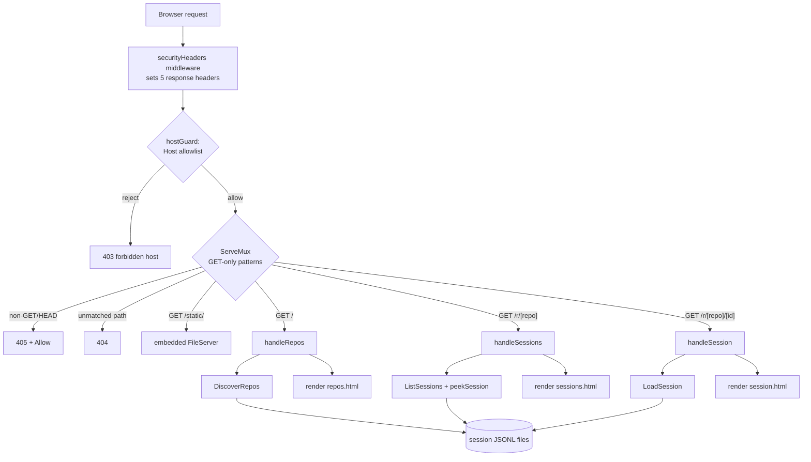
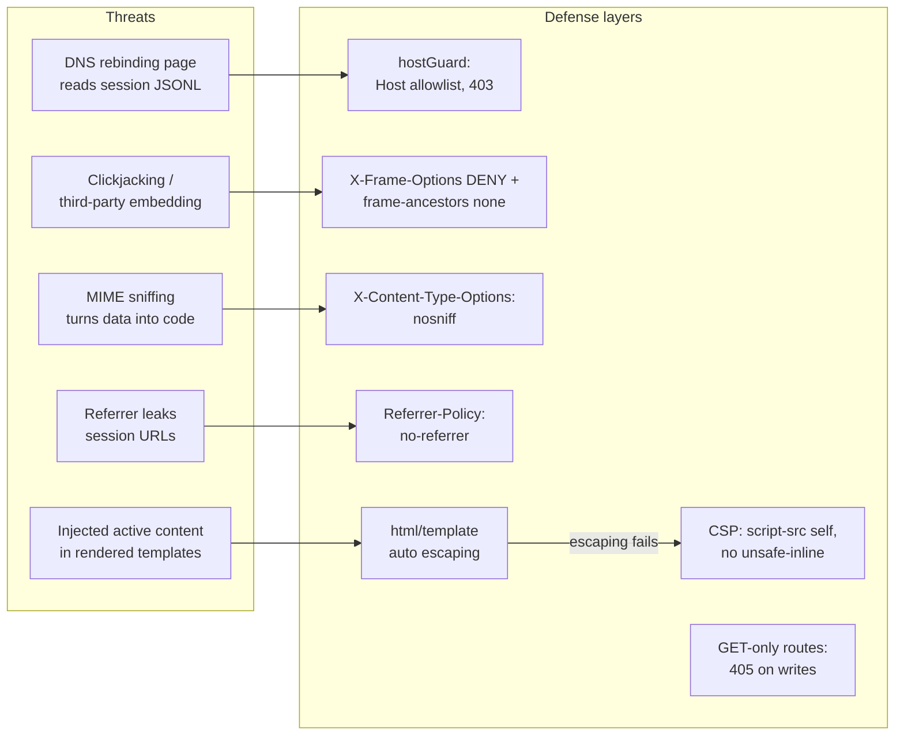

# Viewer Web 服务器

> **关联源码**：`internal/viewer/`
> **前置阅读**：[10-session-persistence.md](10-session-persistence.md)

## 目录

- [1. 服务器架构](#1-服务器架构)
  - [1.1 ocr viewer 的用途](#11-ocr-viewer-的用途)
  - [1.2 启动流程：StartServer](#12-启动流程startserver)
  - [1.3 路由表](#13-路由表)
  - [1.4 模板与静态资源的嵌入](#14-模板与静态资源的嵌入)
  - [1.5 模板函数与渲染管线](#15-模板函数与渲染管线)
- [2. store.go：会话数据读取](#2-storego会话数据读取)
  - [2.1 目录发现：DiscoverRepos](#21-目录发现discoverrepos)
  - [2.2 会话列表：ListSessions 与 peekSession](#22-会话列表listsessions-与-peeksession)
  - [2.3 完整解析：LoadSession](#23-完整解析loadsession)
  - [2.4 与 internal/session 的分工](#24-与-internalsession-的分工)
  - [2.5 commentMarkID：marks 功能的稳定标识](#25-commentmarkidmarks-功能的稳定标识)
- [3. 安全设计](#3-安全设计)
  - [3.1 威胁模型](#31-威胁模型)
  - [3.2 hostguard.go 精读](#32-hostguardgo-精读)
  - [3.3 securityheaders.go 精读](#33-securityheadersgo-精读)
  - [3.4 其他只读保障](#34-其他只读保障)
- [4. browser.go：跨平台浏览器打开](#4-browsergo跨平台浏览器打开)
  - [4.1 三态 --open 决策](#41-三态---open-决策)
  - [4.2 候选命令与 $BROWSER 解析](#42-候选命令与-browser-解析)
  - [4.3 执行策略与失败行为](#43-执行策略与失败行为)
- [5. 前端页面](#5-前端页面)
  - [5.1 三个模板的职责](#51-三个模板的职责)
  - [5.2 repos.js](#52-reposjs)
  - [5.3 session.js](#53-sessionjs)
  - [5.4 style.css 的组织](#54-stylecss-的组织)
- [6. viewer_cmd.go：命令入口](#6-viewer_cmdgo命令入口)
- [7. 源文件覆盖清单](#7-源文件覆盖清单)

## 1. 服务器架构

### 1.1 ocr viewer 的用途

`ocr viewer`（别名 `ocr v`）在本地启动一个**只读** Web 服务器，用于浏览历史审查会话。它扫描 `$HOME/.opencodereview/sessions/` 下的 JSONL 会话文件，解析后以三类页面呈现：仓库列表、会话列表、会话详情（包含每条 LLM 请求/响应对话、工具调用、审查发现与 token 统计）。包注释明确了这一定位（[store.go](../../internal/viewer/store.go#L4-L7)）。

这个查看器面对的数据非常敏感：会话 JSONL 中包含 LLM 请求体，即**被审查的源码本身**以及 LLM 对它的分析（[server.go](../../internal/viewer/server.go#L32-L35) 注释原文）。整个 viewer 的安全设计（见第 3 章）都围绕这一点展开。

### 1.2 启动流程：StartServer

入口是 [StartServer](../../internal/viewer/server.go#L24-L83)，签名 `StartServer(addr, openMode string) error`：

1. **解析会话根目录**：[SessionsRoot()](../../internal/viewer/store.go#L27-L33) 返回 `$HOME/.opencodereview/sessions`，失败则启动中止（[server.go](../../internal/viewer/server.go#L25-L28)，测试佐证 [server_startserver_test.go](../../internal/viewer/server_startserver_test.go#L17-L26)）。
2. **构建路由**：`newMux(root)` 建立路由表（见 1.3）。
3. **包装中间件（由内到外）**：mux 先被 [hostGuard](../../internal/viewer/server.go#L36-L37)（Host 头校验）包裹，再被 [securityHeaders](../../internal/viewer/server.go#L40)（安全响应头）包裹。请求处理顺序为 securityHeaders → hostGuard → mux。
4. **先绑定后打印**：[net.Listen](../../internal/viewer/server.go#L49-L52) 在打印 URL 或打开浏览器**之前**执行。注释解释了原因：一旦 Listen 返回，早到的连接会进入 accept backlog 排队而不是被拒绝，浏览器因此"跑不赢"服务器。
5. **计算展示 URL**：[displayURL](../../internal/viewer/server.go#L133-L139) 见下文。
6. **异步 Serve**：`srv.Serve(ln)` 在 goroutine 中运行，错误经 channel 返回（[server.go](../../internal/viewer/server.go#L63-L66)）。
7. **打印与开浏览器**：先打印 `Viewer ready: <url>`；若 auto-open 被抑制则附上原因。打开浏览器本身也在独立 goroutine 中进行，失败只打警告不影响服务（[server.go](../../internal/viewer/server.go#L68-L80)）。

**displayURL 的 host/port 来源不对称**（[server.go](../../internal/viewer/server.go#L123-L139)）：

- host 取自**请求的地址**而非 listener：`net.Listen` 会把主机名解析成 IP 字面量，而 hostGuard 的 allowlist 是从请求地址构建的。若用解析后的形式，`ocr viewer --addr box.local:5483` 会自动打开 `http://192.168.1.10:5483` 并撞上 "403 forbidden host"。回归测试 [TestDisplayURL_AgreesWithHostGuard](../../internal/viewer/server_startserver_test.go#L90-L121) 逐 case 验证"打印并交给浏览器的 URL 必须能通过自己的 Host allowlist"。
- port 取自 **listener**：`--addr :0` 时报告内核实际分配的端口而非字面 0（测试 [TestDisplayURL](../../internal/viewer/server_startserver_test.go#L48-L84) 的 `port zero reports the assigned port` 用例）。

端口选择完全交给调用者：`--addr` 默认 `localhost:5483`（见第 6 章），支持 `:0`（随机端口）和任意 `host:port`。展示时通配地址（空 host、`0.0.0.0`、`::`）会被 [DisplayAddr](../../internal/viewer/hostguard.go#L122-L132) 改写为 `localhost` 形式，保证打印出的 URL 可直接打开（测试 [TestDisplayAddr](../../internal/viewer/hostguard_test.go#L166-L188)）。

### 1.3 路由表

路由在 [newMux](../../internal/viewer/server.go#L92-L121) 中注册。全部文档路由使用 **GET-only 方法限定模式**（Go 1.22 ServeMux 语法，同时服务 HEAD），因此任何其他方法由 ServeMux 本身以 405 + `Allow` 头应答，根本不会进入 handler——这是 viewer 只读契约的机制保障，由 [TestMux_HasNoWriteRoutes](../../internal/viewer/handler_test.go#L279-L324) 锁定（POST/PUT/DELETE/PATCH/OPTIONS 对所有已注册路径一律 405，未知路径保持 404）。`newMux` 的注释明确要求：新路由必须注册 method-qualified 模式，否则该测试会失败。

| 路由 | 处理函数 | 返回 | 附加校验 |
|---|---|---|---|
| `GET /static/` | 嵌入式文件服务（[server.go](../../internal/viewer/server.go#L96)） | style.css / repos.js / session.js | — |
| `GET /{$}`（精确匹配 `/`） | [handleRepos](../../internal/viewer/handler.go#L12-L27) | repos.html（200）；sessions 根目录不可读时 500 | handler 内再次校验 `r.URL.Path == "/"`（防御直接调用，[handler.go](../../internal/viewer/handler.go#L13-L16)） |
| `GET /r/{repo}` | [handleSessions](../../internal/viewer/handler.go#L35-L56) | sessions.html（200）；repo 目录读取失败时 500（测试 [TestHandleSessions_ErrorOnBadDir](../../internal/viewer/handler_test.go#L147-L156)） | repo 含 `..` 或 `/` 时 400（[server.go](../../internal/viewer/server.go#L104-L107)） |
| `GET /r/{repo}/{sessionID}` | [handleSession](../../internal/viewer/handler.go#L64-L82) | session.html（200）；会话文件打不开时 404 并附错误信息 | repo 或 sid 含 `..` 时 400（[server.go](../../internal/viewer/server.go#L113-L116)） |
| 其他方法（已注册路径） | ServeMux 内建 | 405 + `Allow` | — |
| 未匹配路径 | ServeMux 内建 | 404 | — |
| Host 头不在 allowlist | hostGuard | 403 `forbidden host` | 最外层，先于路由 |

`{$}` 是 Go 1.22 的"精确匹配结尾"语法：`GET /{$}` 只匹配 `/`，避免裸 `/` 前缀匹配吞掉所有路径（[server.go](../../internal/viewer/server.go#L89) 注释）。

路径参数校验（拒绝 `..` 与 `/`）在路由层完成，是目录穿越的第一道防线；配合 `LoadSession` 直接以 `filepath.Join(root, encodedRepo, sessionID+".jsonl")` 拼路径（[store.go](../../internal/viewer/store.go#L326)），二者共同保证只能读到 sessions 目录树内的 `.jsonl` 文件。

### 1.4 模板与静态资源的嵌入

资源通过 `go:embed` 打进二进制，**运行期不依赖任何外部文件**：

```go
//go:embed templates/*.html static/style.css static/session.js static/repos.js
var assets embed.FS
```

（[server.go](../../internal/viewer/server.go#L18-L19)）

模板经 [parseTemplate](../../internal/viewer/server.go#L408-L412) 从 `assets` 读取并解析；静态文件经 [staticFS()](../../internal/viewer/server.go#L435-L441) 用 `fs.Sub(assets, "static")` 暴露给 FileServer。测试 [TestStaticFS](../../internal/viewer/server_extra_test.go#L228-L239) 验证嵌入 FS 可打开 style.css。这意味着 `ocr viewer` 不需要安装目录或资源路径，单个二进制即可分发（与第 15 篇的分发策略呼应）。

### 1.5 模板函数与渲染管线

[parseTemplate](../../internal/viewer/server.go#L287-L413) 注册了一组模板函数，全部服务于三个页面的展示需求：

- **格式化**：`formatTime`（固定 Asia/Shanghai 时区，格式 `2006-01-02 15:04`，[server.go](../../internal/viewer/server.go#L141-L151)；UTC 午夜会显示为 08:00，测试 [TestFormatTime_UTC](../../internal/viewer/server_test.go#L105-L112)）、`formatDuration`（秒 / `Xm Ys`，[server.go](../../internal/viewer/server.go#L488-L496)）、`formatNumber`（`1234` → `1.23K`、`1200000` → `1.2M`，[server.go](../../internal/viewer/server.go#L443-L462)）、`truncate`。
- **任务展示**：`taskTypeClass`（5 种任务类型各配色）、`orderedTasks`（按 plan → main → relocation → memory → grouping 的固定顺序排列任务组，[server.go](../../internal/viewer/server.go#L325-L351)）、`cardCount`、`sessionTaskLabel`（`__grouping__` 虚拟路径显示为 "File Grouping"）。
- **评论聚合**：`groupCommentsByFile`（按文件路径保序分组）、`severityCounts` / `categoryCounts`（过滤 chips 上的计数）、`commentCategory` / `commentSeverity`（未知值归一到 `other` / 原样小写）、`severityClass` / `categoryClass`（CSS 类名映射）。
- **代码行号**：`numberedCodeLines`（见下）。

`numberedCodeLines`（[server.go](../../internal/viewer/server.go#L259-L285)）体现了一个"宁缺毋错"的原则：`internal/diff/resolver.go` 匹配 existing_code 时两侧都会丢弃空行，因此报告的行区间跨度不保证等于代码片段行数。只有当 `startLine > 0` 且 `endLine-startLine+1 == 行数` 时才标注行号，否则所有行 `Num` 留 0、模板退回无行号的普通 `<pre>` 块——"审查工具里没有行号好过错误的行号"（注释原文）。[TestNumberedCodeLines](../../internal/viewer/server_startserver_test.go#L237-L268) 与 [TestParseTemplate_ExistingCodeLineNumbers](../../internal/viewer/server_startserver_test.go#L273-L343) 逐 case 锁定了这一契约。

[renderTemplate](../../internal/viewer/server.go#L422-L433) 先设置 `Content-Type: text/html; charset=utf-8` 再执行模板；执行中途出错只打日志（此时响应头已写出，无法再改状态码）。

## 2. store.go：会话数据读取

store.go 是 viewer 的数据层，职责是"把磁盘上的 JSONL 组装成三类页面数据"。它对会话文件**只读不写**。

### 2.1 目录发现：DiscoverRepos

[DiscoverRepos(root)](../../internal/viewer/store.go#L43-L83) 遍历 sessions 根目录：

- 根目录不存在时返回 `(nil, nil)`，repos 页显示空态（测试 [TestDiscoverRepos_NonExistentDir](../../internal/viewer/store_test.go#L35-L43)、[TestHandleRepos_EmptyRoot](../../internal/viewer/handler_test.go#L37-L49)）。
- 每个子目录即一个"仓库"（`RepoInfo{EncodedPath, SessionCount, LastModified}`）：统计其中 `.jsonl` 文件数量并取最大 mtime；没有 `.jsonl` 的目录跳过；子目录读取失败静默跳过（[store.go](../../internal/viewer/store.go#L60-L63)，测试 [TestDiscoverRepos_SkipsUnreadableSubdir](../../internal/viewer/store_load_test.go#L582-L611)）。
- 结果按 LastModified 降序排列（最近使用的仓库排最前）。

### 2.2 会话列表：ListSessions 与 peekSession

[ListSessions(root, encodedRepo)](../../internal/viewer/store.go#L113-L138) 列出某仓库目录下全部 `.jsonl`（文件名去掉后缀即 sessionID），逐个调用 [peekSession](../../internal/viewer/store.go#L142-L206) 生成轻量摘要，按 Timestamp 降序。不可读的文件被跳过而不是让整个列表失败（测试 [TestListSessions_SkipsUnreadableFiles](../../internal/viewer/store_load_test.go#L613-L650)）。

peekSession 是"低成本摘要"设计——不完整解析，只关心三样东西：

1. **首条记录**（session_start）的元数据：timestamp、cwd、gitBranch、model、reviewMode、diffFrom/diffTo/diffCommit（[store.go](../../internal/viewer/store.go#L154-L184)）。
2. **review_item_done / review_item_reused 记录的 comments 数组长度**累加，用于列表页的 Comments 列（[store.go](../../internal/viewer/store.go#L186-L194)）。注意这里先用 `bytes.Contains` 粗筛再做 JSON 解析，避免对每行都反序列化。
3. **最后一条记录**若是 session_end，则应用 [applySessionEnd](../../internal/viewer/store.go#L621-L659)（见 2.4）。

行读取由 [readJSONLLines](../../internal/viewer/store.go#L211-L231) 承担：用 `bufio.Reader.ReadBytes` 逐行读取而不用 `bufio.Scanner`，因为 session_end 内嵌完整 run manifest，超大审查会话的记录可合法超过 Scanner 的 10 MiB token 上限。测试 [TestViewerReadsSessionEndLargerThanScannerLimit](../../internal/viewer/store_load_test.go#L301-L364) 构造了 35000 个 coverage item（>10 MiB 的 session_end 行）验证。非 EOF 读错误时丢弃残余半行，不把损坏片段当记录交给调用方（测试 [TestReadJSONLLinesDiscardsPartialDataOnNonEOFError](../../internal/viewer/store_load_test.go#L36-L50)）。

### 2.3 完整解析：LoadSession

[LoadSession(root, encodedRepo, sessionID)](../../internal/viewer/store.go#L325-L601) 是详情页的数据源，逐行解析全部记录，按 `type` 字段分发：

| 记录类型 | 处理 | 代码位置 |
|---|---|---|
| `session_start` | 填充 Summary 元数据 | [store.go](../../internal/viewer/store.go#L346-L370) |
| `llm_request` | 创建 `TaskCard`（保留 RequestMessages 供展示），按 filePath 归入 `FileGroup`（不存在则建） | [store.go](../../internal/viewer/store.go#L372-L389) |
| `llm_response` | 回填该文件+任务类型下**最后一张尚无响应的卡**：content、reasoning_content、duration、model、error、四类 token（prompt/completion/cache_read/cache_write）；同时把响应中的 `tool_calls` 初始化为 `ToolCallInfo` | [store.go](../../internal/viewer/store.go#L391-L459) |
| `llm_error` | 回填最后一张无错误卡的 Error 与 DurationMs | [store.go](../../internal/viewer/store.go#L461-L478) |
| `tool_call` | 按工具名（老记录无名字时退化为位置匹配）回填 Result/Ok/DurationMs 到对应 ToolCallInfo | [store.go](../../internal/viewer/store.go#L480-L511) |
| `review_item_done` / `review_item_reused` | 解析 comments 数组为 `ReviewComment`（comment 内的 `path` 覆盖记录级 filePath），并生成 MarkID | [store.go](../../internal/viewer/store.go#L513-L550) |
| `session_end` | applySessionEnd | [store.go](../../internal/viewer/store.go#L552-L554) |

几个值得注意的行为细节：

- **孤儿记录不 panic**：response/error/tool_call 若指向没有先导 request 的文件，`fileIndex` 无该条目，直接跳过（[store.go](../../internal/viewer/store.go#L422-L424)；测试 [TestLoadSession_ResponseWithoutRequest](../../internal/viewer/store_load_test.go#L512-L534) 等三个 orphan 用例）。
- **畸形行跳过**：JSON 解析失败的行直接忽略（[store.go](../../internal/viewer/store.go#L340-L342)，测试 [TestLoadSession_MalformedLines](../../internal/viewer/store_load_test.go#L366-L387)）。
- **tool_call 的 `task_done` 特判**：Ok 不由执行结果记录决定，而是解析 arguments JSON——无 `state` 字段或 `state == "DONE"` 视为成功（[taskDoneSucceeded](../../internal/viewer/store.go#L669-L680)），测试 [TestLoadSession_TaskDoneStates](../../internal/viewer/store_load_test.go#L211-L261) 覆盖五种参数形态；`report_incorrect_comments` 与 `approve_all_comments` 恒为成功（[store.go](../../internal/viewer/store.go#L452-L454)）。

解析完成后做三组后处理（[store.go](../../internal/viewer/store.go#L557-L596)）：

1. **token 汇总**：全局合计四类 token 与请求数（`ResponseContent != "" || PromptTokens > 0` 才计入 RequestCount），并生成按 token 总量降序的 `FileTokenBreakdown`。
2. **会话级虚拟路径分离**：`__grouping__` 等 `sessionLevelPaths`（[store.go](../../internal/viewer/store.go#L291-L297)）从 `Files` 挪到 `SessionTasks`，模板据此渲染独立的 "Session Tasks" 区块。
3. **Files 按路径排序**，保证展示稳定。

### 2.4 与 internal/session 的分工

viewer 与 internal/session 是"一写一读"的关系（写入端细节见 [10-session-persistence.md](10-session-persistence.md)）：

- **写入端**（internal/session）：[jsonlWriter.open](../../internal/session/persist.go#L103-L122) 创建 `$HOME/.opencodereview/sessions/<encodeRepoPath(repoDir)>/<sessionID>.jsonl`，目录权限 0700、文件 0600。[encodeRepoPath](../../internal/session/persist.go#L76-L101) 把仓库绝对路径的分隔符替换为 `-`，产物即 viewer 侧的 `EncodedPath`——repos 页显示的目录名与路由 `/r/{repo}` 里的 `repo` 都是它。
- **读取端**（viewer）：不复用 session 包的 reader（那是为 resume 服务的 `LoadResumeState`），而是用 `map[string]any` 逐行自行解析。唯一共享的是 **run manifest 的结构化类型**：applySessionEnd 在解析 `session_end.run_manifest` 时借用 `session.RunManifest` / `session.CoverageItem`，并校验 `schema_version == session.ManifestSchemaVersion`（`"ocr.run-manifest/v1"`，[manifest.go](../../internal/session/manifest.go#L23)）才采用（[store.go](../../internal/viewer/store.go#L638-L654)）。schema 不匹配的未来格式回退为 legacy 展示（[store.go](../../internal/viewer/store.go#L655-L658)，测试 [TestPeekSessionUnknownManifestIsLegacy](../../internal/viewer/store_test.go#L274-L287)）——viewer 永远不会因为会话格式演进而崩溃。

manifest 存在时，Summary 的 TerminalState、FilesReviewed（从 `Coverage.Selected` 派生）、Selected/Completed/Reused/Failed/Waived 计数、FileCount 全部来自 manifest（[store.go](../../internal/viewer/store.go#L644-L652)）；无 manifest 的旧会话则置 `Legacy = true`，FileCount 取 `files_reviewed` 长度。`Aborted` 默认 true，只有见到 session_end 才置 false（[store.go](../../internal/viewer/store.go#L149)，测试 [TestPeekSession_NoSessionEnd](../../internal/viewer/store_test.go#L231-L253)）——中断的会话在列表页显示为 `aborted`。

### 2.5 commentMarkID：marks 功能的稳定标识

详情页的"标记已处理/已忽略"（marks）功能需要每条评论有一个**跨刷新稳定**的标识。由于会话文件不可变（viewer 只读），[commentMarkID](../../internal/viewer/store.go#L608-L619) 的策略是：

- 记录带 `uuid`：直接 `uuid#commentIndex`——精确、无碰撞、每次重载一致。
- 旧记录无 uuid：退化为 sha256(全部评论字段) + 出现计数，即使完全相同的两条评论也能区分。

`MarkID` 字段标 `json:"-"` 不参与序列化（[store.go](../../internal/viewer/store.go#L243)）。测试 [TestLoadSession_MarkIDStableAndDistinct](../../internal/viewer/store_load_test.go#L756-L799) 验证稳定性与去重性（含 unicode 字段的 [TestLoadSession_MarkIDUnicodeFields](../../internal/viewer/store_load_test.go#L801-L826)）。服务端只负责把 `data-mark-id` 渲染进 HTML，不保存任何 mark 状态——状态存浏览器 localStorage（见 5.3，测试 [TestHandleSession_RendersMarkIdentityNotState](../../internal/viewer/handler_test.go#L242-L270) 断言渲染结果不含 mark 状态）。

## 3. 安全设计

**图 12-1**：HTTP 请求处理流水线（中间件由外到内：安全头 → Host 校验 → 路由 → handler → store → 模板渲染）



### 3.1 威胁模型

viewer 暴露的数据是"被审查的源码 + LLM 分析"（[server.go](../../internal/viewer/server.go#L32-L35)），而它是一个**监听在本地的 HTTP 明文服务**。代码注释明确列出的核心威胁是 DNS rebinding：用户访问的任何恶意网页都可以把自己域名的 DNS 解析 rebinding 到 127.0.0.1，此后该页面在同源（origin 仍是攻击者域名）下直接 `fetch` 本地 viewer，读取会话数据。securityheaders.go 的注释补充了第二层担忧：模板中渲染的是用户/LLM 提供的值，万一转义被绕过，注入的活动内容会在浏览器执行（[securityheaders.go](../../internal/viewer/securityheaders.go#L8-L13)）。

**图 12-2**：威胁 → 防护层映射



### 3.2 hostguard.go 精读

**目标**：阻断 DNS rebinding。攻击链是：恶意页面 `http://attacker.example/` 先以真实 IP 加载，DNS 记录 TTL 过后 rebinding 到 127.0.0.1；页面再请求 `http://attacker.example:5483/`，浏览器认为仍是同源（域名没变），请求却打到了本地 viewer。关键在于——**到达 viewer 的 HTTP 请求 Host 头仍是 `attacker.example`**，与用户手输 `localhost:5483` 时的 Host 头不同。hostGuard 就是利用这一差异做默认拒绝（[hostguard.go](../../internal/viewer/hostguard.go#L84-L87) 注释原文：an attacker page that resolves its own domain to 127.0.0.1 still sends the attacker's domain in the Host header, which fails this check）。

**默认允许的 host**（两层判定）：

1. **回环恒放行**（[isLoopbackHost](../../internal/viewer/hostguard.go#L42-L52)）：`localhost`、`127.0.0.1`、`::1`、`0:0:0:0:0:0:0:1` 字面量，外加任何 `127.0.0.0/8` 的 IPv4 字面量（`net.ParseIP` + `IsLoopback`，所以 `127.0.0.2` 也放行，测试 [TestIsLoopbackHost](../../internal/viewer/hostguard_test.go#L36-L49)）。这一层不看配置，操作者无法误关。
2. **allowlist**（[buildAllowedHosts](../../internal/viewer/hostguard.go#L61-L82)）：
   - 种子集合恒为 `{localhost, 127.0.0.1, ::1}`；
   - **具体**（非通配）的 bind host 自动加入——`ocr viewer --addr 192.168.1.10:5483` 的用户仍能用该地址访问 UI（测试 [TestBuildAllowedHosts](../../internal/viewer/hostguard_test.go#L63-L67)）；
   - **通配绑定（空 host、`0.0.0.0`、`::`、`*`）不自动加入**。这是有意为之的"强迫确认"设计（注释 [hostguard.go](../../internal/viewer/hostguard.go#L57-L60)）：绑定公网接口的操作者必须显式设置 `OCR_VIEWER_ALLOWED_HOSTS` 才能让外部 host 通过，设置环境变量这个动作本身就是对暴露的承认。测试 [TestBuildAllowedHosts](../../internal/viewer/hostguard_test.go#L69-L75) 锁定通配绑定时 allowlist 仍只有 3 个回环项；
   - 环境变量 `OCR_VIEWER_ALLOWED_HOSTS`（[EnvAllowedHosts](../../internal/viewer/hostguard.go#L15)）按逗号分隔追加（大小写不敏感，测试 [TestResolveAllowedHostsFromEnv](../../internal/viewer/server_extra_test.go#L241-L257)）。[resolveAllowedHostsFromEnv](../../internal/viewer/hostguard.go#L136-L138) 把 bind host 与环境变量合成最终 allowlist。

**Host 头解析**（[hostOnly](../../internal/viewer/hostguard.go#L20-L38)）：剥离端口（`net.SplitHostPort` 兼容 `[::1]:5483` 括号形式）、去 IPv6 方括号、统一小写；**裸的未加括号 IPv6**（多于一个冒号，与端口语法无法区分）返回空串按拒绝处理（测试 [TestHostOnly](../../internal/viewer/hostguard_test.go#L12-L34) 的 `"::1"` 与 `"a:b:c"` 用例）。

**拒绝方式**（[hostGuard](../../internal/viewer/hostguard.go#L88-L105)）：Host 解析为空、非回环且不在 allowlist——一律 `403 forbidden host`，请求不会到达任何业务 handler。[TestHostGuard](../../internal/viewer/hostguard_test.go#L103-L164) 的表驱动用例覆盖了完整的攻击面，包括几个代表性场景：

- `rebind-attacker` / `rebind-with-port`：Host 为 `attacker.example` / `evil.com:5483` → 403，响应体不含内部数据（测试同时断言 body 不泄露，L158-L161）；
- `link-local-metadata`：`169.254.169.254`（云元数据地址）→ 403；
- `public-ip-rebind`：`8.8.8.8:5483` → 403；
- `empty-host`：空 Host → 403；
- `lan-bind-attacker-rejected`：绑定 `192.168.1.10` 时，其他名字仍 403；
- `wildcard-bind-attacker-rejected`：`0.0.0.0` 绑定且未设环境变量时，非回环 Host 仍 403。

### 3.3 securityheaders.go 精读

[securityHeaders](../../internal/viewer/securityheaders.go#L28-L37) 是最外层中间件，对**每个响应**（包括 403/404/405）统一设置 5 个头，构成纵深防御。逐个说明防御目标：

| 响应头 | 值 | 防什么攻击 |
|---|---|---|
| `Content-Security-Policy` | 见下方逐指令分析 | 模板转义被绕过时，注入的脚本/样式无法加载执行——活动内容注入的第二道闸 |
| `X-Content-Type-Options` | `nosniff` | MIME 嗅探攻击：阻止浏览器把声明的 `text/plain`/`text/html` 之外的内容嗅探成可执行类型。会话 JSONL 若被直接当文件返回，也不会被嗅探执行 |
| `X-Frame-Options` | `DENY` | 点击劫持与第三方嵌入：任何页面都不许用 iframe 嵌入本 viewer（与 CSP `frame-ancestors 'none'` 互为双保险，XFO 兼容不支持 CSP 的旧浏览器） |
| `Referrer-Policy` | `no-referrer` | 信息泄露：会话 URL 含 repo 名与 sessionID，跳转外链时不携带 Referer |
| `Permissions-Policy` | `geolocation=(), camera=(), microphone=()` | 纵深防御：本地只读查看器根本不需要定位/摄像头/麦克风，直接禁掉，防范未来前端代码意外（或被注入后）调用敏感 API |

**CSP 逐指令分析**（[contentSecurityPolicy](../../internal/viewer/securityheaders.go#L14-L21)）：

```go
const contentSecurityPolicy = "default-src 'self'; " +
    "script-src 'self'; " +
    "style-src 'self'; " +
    "img-src 'self' data:; " +
    "object-src 'none'; " +
    "base-uri 'none'; " +
    "frame-ancestors 'none'; " +
    "form-action 'none'"
```

- `default-src 'self'`：所有资源类别默认只允许同源——viewer 不加载任何第三方脚本、样式、字体或框架（注释 L9-L10），因此严格同源策略不需要任何放宽。
- `script-src 'self'`：脚本只能来自 `/static/`。**没有 `unsafe-inline`**——这是有前提的：早期版本内联在 session.html 里的脚本被抽到了 `static/session.js`（注释 [securityheaders.go](../../internal/viewer/securityheaders.go#L10-L11)），CSP 才能保持严格。若模板转义被绕过、`<script>alert(1)</script>` 被注入 HTML，内联脚本也不执行。
- `style-src 'self'`：样式同源，注入的 `style` 属性/标签不生效。
- `img-src 'self' data:`：图片允许同源与 data URI——style.css 中的品牌图标就是内嵌 SVG data URI（[style.css](../../internal/viewer/static/style.css#L170)），`data:` 是为它开的唯一口子。
- `object-src 'none'`：禁用 `<object>`/`<embed>`/`<applet>` 插件内容。
- `base-uri 'none'`：禁止 `<base>` 注入改写页面相对 URL 的解析基准（否则攻击者可让"同源"的相对资源指向别处）。
- `frame-ancestors 'none'`：CSP 版的防嵌入，与 X-Frame-Options 双保险。
- `form-action 'none'`：禁止任何表单提交——页面本无表单，直接封死。

**HSTS 有意省略**：注释（[securityheaders.go](../../internal/viewer/securityheaders.go#L25-L27)）说明原因——viewer 在回环地址上服务明文 HTTP，HSTS 在这里没有意义，反而会错误地把 localhost 钉住（一旦浏览器对 `http://localhost` 实施 HSTS，未来其他本地明文服务可能被殃及）。测试 [TestSecurityHeadersOmitsHSTS](../../internal/viewer/securityheaders_test.go#L38-L47) 锁定这一决定。

测试对齐：[TestSecurityHeadersSetsAllHeaders](../../internal/viewer/securityheaders_test.go#L13-L35) 逐一断言 5 个头的存在与精确值；[TestContentSecurityPolicyIsStrict](../../internal/viewer/securityheaders_test.go#L51-L57) 禁止 CSP 出现 `unsafe-inline`、`unsafe-eval`、`*` 中的任何一个。

### 3.4 其他只读保障

- **方法白名单**：全部路由 GET-only，写方法 405（见 1.3）。viewer 没有任何写路径，磁盘上的会话文件不可能经它被修改。
- **路径校验**：路由层拒绝 `..` 与 `/`（见 1.3）。
- **模板自动转义**：`html/template` 默认转义。测试 [TestParseTemplate_ExistingCodeLineNumbers](../../internal/viewer/server_startserver_test.go#L314-L318) 的 "html in numbered code is escaped" 用例直接注入 `<script>alert(1)</script>`，断言输出为 `&lt;script&gt;…`。
- **会话文件本身的权限**：写入端以 0600 创建（[persist.go](../../internal/session/persist.go#L115)），本机其他用户本就不可读。
- **前端 localStorage 的不可信数据处理**：session.js 从 localStorage 读回的 mark 数据用 null-prototype 对象承载（防 `__proto__` 原型污染）、状态值白名单过滤（见 5.3）。

## 4. browser.go：跨平台浏览器打开

### 4.1 三态 --open 决策

`--open` 有三个值（[browser.go](../../internal/viewer/browser.go#L22-L26)）：`auto`（默认）、`always`、`never`。三态设计与 CLI 的 `--color` 一致（注释 L20-L21），允许用户在两个方向上覆盖启发式。[ValidateOpenMode](../../internal/viewer/browser.go#L30-L37) 拒绝未知值而不是静默当作 auto——`--open=yes` 这类拼写错误会被报告（测试 [TestValidateOpenMode](../../internal/viewer/browser_test.go#L60-L76)）。

auto 模式的启发式（[shouldAutoOpenEnv](../../internal/viewer/browser.go#L84-L102)）逐层判断：

1. stdout 不是终端（管道、重定向）→ 不开，理由 "stdout is not a terminal"；
2. `SSH_CONNECTION` 非空**且**无 `DISPLAY`/`WAYLAND_DISPLAY` → 不开，理由 "SSH session with no forwarded display"——注意 SSH 与显示变量是**联合判断**的：`ssh -X` 转发了 X11 就照常打开（注释 L78-L83）；
3. Linux 上无任何显示变量 → 不开，理由 "no DISPLAY or WAYLAND_DISPLAY"；
4. 其余情况（本机 macOS/Windows 终端、有显示的 Linux）→ 打开。

被抑制时**理由会呈现在 ready 行上**（[server.go](../../internal/viewer/server.go#L68-L73)），因为"被抑制的 auto-open"与"失败的 auto-open"从外面看无法区分——这正是该功能保护的远程/无头用户最需要的信息。注释也坦承了启发式的盲区：非终端 stdout 但有桌面（IDE runner）、或 WSL 宿主经 wslu 无 DISPLAY 地唤起浏览器——这些场景就是 `always` 存在的意义（L82-L83）。测试 [TestShouldAutoOpenEnv](../../internal/viewer/server_startserver_test.go#L123-L166) 以 15 行表驱动覆盖全部组合，包括 "unknown mode behaves as auto"（未校验值降级为 auto 而非盲目打开）。

### 4.2 候选命令与 $BROWSER 解析

[browserCandidates](../../internal/viewer/browser.go#L118-L139) 按偏好顺序生成候选 argv 列表：

1. **`$BROWSER`（仅 Unix）**：按 freedesktop 惯例解析——冒号分隔的命令列表，每项支持 `%s` 占位符（无占位符则 URL 追加为末参数，[browserEnvArgv](../../internal/viewer/browser.go#L142-L158)）。Windows 上跳过 `$BROWSER`：冒号会切碎盘符路径，且该变量不是 Windows 惯例（注释 L113-L115）。
2. **平台兜底**：
   - Windows：`rundll32 url.dll,FileProtocolHandler <url>`——注释（L130-L131）解释了为何不用 `cmd /c start`：后者会把 URL 中的 `&` 当命令分隔符，还需要额外的空标题参数；
   - macOS：`open <url>`；
   - 其余（linux/各 BSD，含未知 OS 兜底）：`xdg-open <url>`。

测试 [TestBrowserCandidates](../../internal/viewer/browser_test.go#L12-L58) 覆盖各平台、`$BROWSER` 多候选顺序、`%s` 占位与额外参数、空条目跳过、Windows 忽略 `$BROWSER` 等全部行为。

### 4.3 执行策略与失败行为

执行策略的核心问题是：**"fork 成功"不等于"打开了浏览器"**。[runBrowserCmd](../../internal/viewer/browser.go#L165-L200) 的注释点出两个反例：`xdg-open` 在没有注册 handler 时 fork 成功但以非零退出；`open` 在没有应用认领该 scheme 时同样非零退出——只检查 `Start()` 会把两者都误报成功，用户既没浏览器也没警告。

因此策略是（[browser.go](../../internal/viewer/browser.go#L165-L200)）：

1. 捕获子进程 stderr（调用方未设置时），失败时错误信息附带 stderr 内容——"exit status 3" 什么都说明不了，xdg-open 的诊断才有用（注释 L167-L170）；
2. `Start()` 后在 goroutine 中 `Wait()`，窗口期内（[browserWaitWindow](../../internal/viewer/browser.go#L59) = 3 秒，借自 Go 工具链 `cmd/internal/browser` 的 `appearsSuccessful`）退出则检查退出码：非零 → 报错（带 stderr）；
3. 超过 3 秒仍在运行 → 判定为"opener 自己变成了浏览器"，**立即按成功返回**（不让调用方阻塞整个会话），但留一个 watcher goroutine 继续观察——若它后来失败，经 [browserWarnf](../../internal/viewer/browser.go#L47-L49)（`[ocr] WARNING:` 前缀，写 stderr）补发警告。

[openBrowserCandidates](../../internal/viewer/browser.go#L211-L224) 逐个尝试候选，**所有失败都用 `errors.Join` 汇报而不只报第一个**（注释 L207-L210）：`$BROWSER` 指向未安装的程序且平台 opener 也缺失时，只听 `$BROWSER` 的报错会让人误以为修好那个变量就行。无任何候选时报 "no browser opener available"。

browser_exec_test.go 用"测试二进制自 exec 为 helper 子进程"的方式（[TestBrowserHelperProcess](../../internal/viewer/browser_exec_test.go#L31-L43)）在不依赖真实浏览器的情况下佐证了整套策略：

- [TestRunBrowserCmd_NonZeroExit](../../internal/viewer/browser_exec_test.go#L143-L156)：fork 成功 + 退出码 3 → 报 `*exec.ExitError`（回归测试，注释 L138-L142 讲述了修复前"用户既没浏览器也没警告"的场景）；
- [TestRunBrowserCmd_NonZeroExitIncludesStderr](../../internal/viewer/browser_exec_test.go#L161-L175)：错误携带子进程 stderr，同时退出码仍可解包；
- [TestRunBrowserCmd_PreservesCallerStderr](../../internal/viewer/browser_exec_test.go#L179-L190)：stderr 捕获不劫持调用方已设置的 Stderr；
- [TestRunBrowserCmd_StillRunningIsSuccess](../../internal/viewer/browser_exec_test.go#L201-L215) 与 [TestRunBrowserCmd_LateFailureWarns](../../internal/viewer/browser_exec_test.go#L221-L230)：超窗按成功返回 + 事后失败补发警告（"failed after being treated as successful"）；
- [TestOpenBrowserCandidates_FallsThroughToNextCandidate](../../internal/viewer/browser_exec_test.go#L232-L242) / [SkipsNonZeroExit](../../internal/viewer/browser_exec_test.go#L246-L253)：降级到下一候选由**退出状态**驱动，而非仅看二进制是否存在；
- [TestOpenBrowserCandidates_AllFail](../../internal/viewer/browser_exec_test.go#L258-L274)：每个候选的失败都被点名。

失败对服务器的影响：**打开浏览器永远只是警告，不会停服务**（[browserWarnOut](../../internal/viewer/browser.go#L39-L43) 注释；StartServer 中 openBrowser 在独立 goroutine 运行且错误仅打警告，[server.go](../../internal/viewer/server.go#L74-L80)）。

## 5. 前端页面

### 5.1 三个模板的职责

**repos.html**（[templates/repos.html](../../internal/viewer/templates/repos.html)）——仓库列表页：

- 有仓库时渲染搜索框 + 三列表格（Repository / Sessions / Last Modified），每行链接到 `/r/<EncodedPath>`（L19-L30），并引入 repos.js（L31）；
- 无仓库时空态文案 "No session data found. Run a code review first."（L32-L34）；
- 服务端渲染 [TestRenderTemplate_WithRepos](../../internal/viewer/server_extra_test.go#L68-L93) 断言搜索框、表格与 repos.js 引用的存在。

**sessions.html**（[templates/sessions.html](../../internal/viewer/templates/sessions.html)）——会话列表页：

- 九列表格：Session ID（截前 8 字符，L20）、Branch、Mode、Model、Files、Status、Comments、Duration、Started At；
- Status 列的三态渲染 `{{if .Aborted}}aborted{{else if .Legacy}}legacy{{else}}{{.TerminalState}}{{end}}`（L25），与 2.4 节的数据来源对应。

**session.html**（[templates/session.html](../../internal/viewer/templates/session.html)）——会话详情页，信息密度最高：

- **会话头部**（L13-L31）：CWD、分支、模式（range 模式附 From/To、commit 模式附 Commit）、模型、时长、文件数、状态；
- **Coverage**（L33-L44）：仅当 RunManifest 非空时渲染，展示 Selected/Completed/Reused/Failed/Waived 五格统计，Failed 非零时标红；
- **Token Usage**（L46-L107）：Prompt/Completion/Total/请求数四格（有缓存时追加 Cache Read/Write，LLM 失败非零时追加红色计数），下方折叠的 File breakdown 表格按文件列出 token 明细；
- **Review Comments**（L109-L190）：先渲染 severity 与 category 两组过滤 chips（带计数，L112-L135）、marks 工具条（Hide marked 开关、已标记计数、Clear all，L136-L140），再按文件分组渲染评论卡（每卡含 category/severity 徽章、行号范围、正文、Existing Code / Suggested Change 双栏代码面板、Fixed/Ignored/Clear 三个 mark 按钮，L141-L188）；分组默认展开（`<details open>`）；
- **Files Reviewed**（L193-L208）与 **Session Tasks**（L210-L225）、**Conversations**（L227-L242）：三个区块用折叠面板组织，后两者共享底部定义的 `task-cards` 子模板（L249-L338）——每个文件一个手风琴，内部按任务类型分组，每张卡展示请求号、模型、token、耗时徽章、错误详情（可展开）、reasoning（可展开）、响应正文与全部工具调用（含参数/结果/失败标记）；
- 页尾引入 session.js（L244）。

折叠状态由测试锁定：次级区块（Files Reviewed、Conversations）默认折叠、评论组默认展开、token 明细默认折叠（[TestRenderTemplate_SecondarySectionsCollapsedByDefault](../../internal/viewer/server_extra_test.go#L159-L196)）；无对话数据时整个 Conversations 区块不渲染（[TestRenderTemplate_HidesEmptyConversationsSection](../../internal/viewer/server_extra_test.go#L198-L211)）。

### 5.2 repos.js

[repos.js](../../internal/viewer/static/repos.js#L4-L18) 是一个 15 行的 IIFE：监听搜索框 `input` 事件，把表格每行的仓库名（`data-repository-name` 单元格的 textContent）与查询串做小写包含匹配，不匹配的行置 `hidden`。**不发起任何网络请求**。

### 5.3 session.js

[session.js](../../internal/viewer/static/session.js) 同样**不 fetch 任何端点**——所有数据由服务端模板渲染进 DOM，前端脚本只做三类纯客户端增强。这个"零 XHR"设计与严格 CSP 自洽：`script-src 'self'` 下不需要也不会有动态数据加载。

1. **轻量 Markdown 渲染**（L4-L30）：对每个 `.response-text` 元素，先整体 HTML 转义（L6-L9），再把 ``` 围栏代码块抽占位符、行内代码、`**bold**`、三级标题、列表项、换行依次替换为对应 HTML。先转义后替换保证 LLM 输出中的任何 HTML 都不会被执行。
2. **评论过滤**（L32-L147）：severity 与 category 两个维度各自单选/取消（再次点击同一 chip 回到 all），卡片按 `data-severity`/`data-category` 显隐；组内全部卡片隐藏时隐藏整个分组并更新组内计数；无可见卡片时显示空态文案——且文案区分"没有匹配"与"匹配的都被 mark 藏了"两种情况（L123-L128）。
3. **marks**（L149-L289）：服务端只渲染 `data-mark-id`，mark 状态完全存浏览器 localStorage，键为 `ocr-viewer-marks:<页面路径>`（L163-L165）——一个会话一个键，绝不写回服务器（注释 L149-L151）。健壮性设计：
   - localStorage 抛异常（隐私模式、配额、策略禁用）时降级为"仅页内生效"，并在工具栏提示 "not saved (storage unavailable)"（L50-L64、L199-L215）；
   - 从 localStorage 读回的数据用 **null-prototype 对象**承载、状态值经 `knownMarkStates` 白名单过滤——注释（L156-L161）说明了原因：普通对象字面量的属性查找会到达 `Object.prototype`，`toString`/`constructor` 会冒充 mark 状态，恶意的 `__proto__` 键必须作为惰性数据重放；
   - 清空所有 mark 时删除存储键而非写入空对象，避免固定 origin 下每访问一个会话就积累一个不可回收的条目（L201-L205）；
   - Hide marked 开关的偏好独立持久化（`ocr-viewer-hide-marked`），默认开启以匹配"标记即处理完"的工作流（L66-L68）。

### 5.4 style.css 的组织

[style.css](../../internal/viewer/static/style.css) 共 1277 行，单文件、零外部依赖（系统字体栈，L6-L7），按注释分节组织：

- **双主题**：`:root` 定义全套 CSS 变量（L2-L64），`@media (prefers-color-scheme: dark)` 整体覆盖（L66-L110）——所有组件只引用变量，暗色主题无需逐组件改写。severity/category 徽章、代码面板、mark chip 等也有各自的暗色覆盖块；
- **基础与导航**（L112-L190）：reset、面包屑导航（sticky + backdrop-filter，品牌图标为内嵌 SVG data URI）；
- **页面组件**：表格（L244-L293）、会话头部（带渐变色顶条，L295-L345）、token 统计格与明细表（L347-L443）、手风琴与 chevron（L484-L583）、任务类型配色（`--task-*` 变量 + `.task-*` 左边条，L585-L633）、卡片与徽章（L616-L664）、Markdown 渲染元素（L694-L721）、工具调用区（L723-L892）、评论区（L915-L1081）、代码面板与行号槽（L1114-L1196，行号槽的 `white-space` 处理注释 L1148-L1151 解释了 `<pre>` 内换行与块级行的矛盾）；
- **可访问性**：`.sr-only`（行号存在时行号范围仅保留在可访问性树，L1083-L1095）、`prefers-reduced-motion` 全局降级（L1208-L1215）、键盘焦点样式（L966-L969）；
- **响应式**（L1198-L1206）：768px 以下收窄。

## 6. viewer_cmd.go：命令入口

命令定义在 [viewer_cmd.go](../../cmd/opencodereview/viewer_cmd.go#L18-L34)：`ocr viewer [flags]`，别名 `v`，`cobra.NoArgs`。共两个 flag（[init](../../cmd/opencodereview/viewer_cmd.go#L36-L40)）：

| flag | 默认值 | 说明 |
|---|---|---|
| `--addr` | `localhost:5483` | 监听地址。支持 `:3000`（全接口）、`:0`（随机端口，展示实际分配值）、`192.168.1.10:5483`（具体地址，自动加入 Host allowlist） |
| `--open` | `auto` | 浏览器打开时机：`auto`（仅本地终端且有显示时）/ `always` / `never`，带 flag 补全 |

`RunE` 先 `ValidateOpenMode` 再 `StartServer`（L28-L33）——校验发生在 cobra 层，非法值在服务器启动前就被拒绝。示例文本（L24-L27）列出了四种典型用法：默认启动并开浏览器、指定端口、只打印 URL、强制打开（管道输出 / WSL 场景）。

## 7. 源文件覆盖清单

| 源文件 | 职责 | 关键符号 |
|---|---|---|
| [internal/viewer/server.go](../../internal/viewer/server.go) | 服务器启动、中间件组装、路由表、模板渲染、嵌入资源、展示格式化 | `StartServer`, `newMux`, `displayURL`, `parseTemplate`, `renderTemplate`, `staticFS`, `numberedCodeLines`, `formatNumber`, `formatDuration`, `formatTime` |
| [internal/viewer/handler.go](../../internal/viewer/handler.go) | 三个页面处理器与页面数据结构 | `handleRepos`, `handleSessions`, `handleSession`, `sessionsData`, `sessionPageData` |
| [internal/viewer/store.go](../../internal/viewer/store.go) | 会话 JSONL 读取、目录发现、摘要与全量解析、评论标识 | `SessionsRoot`, `DiscoverRepos`, `ListSessions`, `peekSession`, `readJSONLLines`, `LoadSession`, `commentMarkID`, `applySessionEnd`, `taskDoneSucceeded`, `ViewSession`, `SessionSummary`, `ReviewComment`, `TaskCard` |
| [internal/viewer/hostguard.go](../../internal/viewer/hostguard.go) | Host 头校验中间件、地址解析与展示工具 | `hostGuard`, `buildAllowedHosts`, `hostOnly`, `isLoopbackHost`, `splitBindHost`, `DisplayAddr`, `resolveAllowedHostsFromEnv`, `EnvAllowedHosts` |
| [internal/viewer/securityheaders.go](../../internal/viewer/securityheaders.go) | 安全响应头中间件与 CSP 常量 | `securityHeaders`, `contentSecurityPolicy` |
| [internal/viewer/browser.go](../../internal/viewer/browser.go) | 跨平台浏览器打开：三态决策、候选解析、执行与降级 | `openBrowser`, `browserCandidates`, `browserEnvArgv`, `runBrowserCmd`, `openBrowserCandidates`, `shouldAutoOpenEnv`, `ValidateOpenMode`, `browserWarnf`, `browserWaitWindow` |
| [internal/viewer/templates/repos.html](../../internal/viewer/templates/repos.html) | 仓库列表页模板（搜索框 + 表格 + 空态） | — |
| [internal/viewer/templates/sessions.html](../../internal/viewer/templates/sessions.html) | 会话列表页模板（九列会话表格） | — |
| [internal/viewer/templates/session.html](../../internal/viewer/templates/session.html) | 会话详情页模板：Coverage、Token Usage、Review Comments（过滤/marks/代码面板）、`task-cards` 子模板 | `task-cards` |
| [internal/viewer/static/repos.js](../../internal/viewer/static/repos.js) | 仓库表客户端过滤（无网络请求） | — |
| [internal/viewer/static/session.js](../../internal/viewer/static/session.js) | Markdown 渲染、评论过滤、localStorage marks（无网络请求） | — |
| [internal/viewer/static/style.css](../../internal/viewer/static/style.css) | 全站样式：CSS 变量双主题、组件分节、可访问性与响应式 | — |

补充（本篇阅读范围内、位于 cmd 目录的命令入口）：[cmd/opencodereview/viewer_cmd.go](../../cmd/opencodereview/viewer_cmd.go) — `ocr viewer` 命令定义与 `--addr` / `--open` flag — `viewerCmd`, `viewerOptions`。
