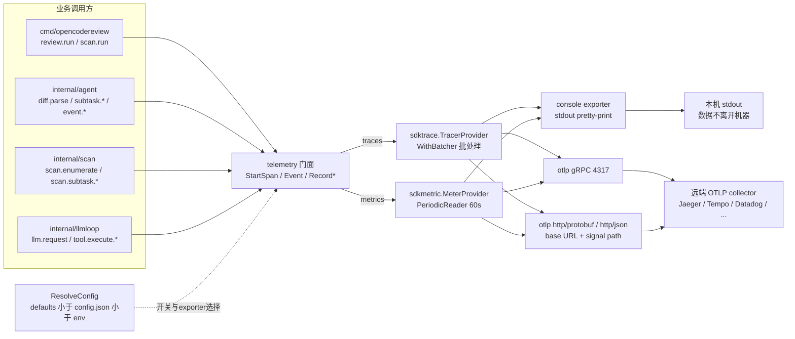
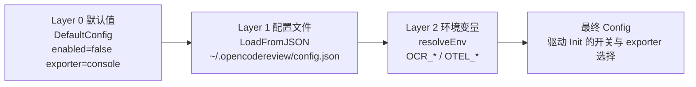
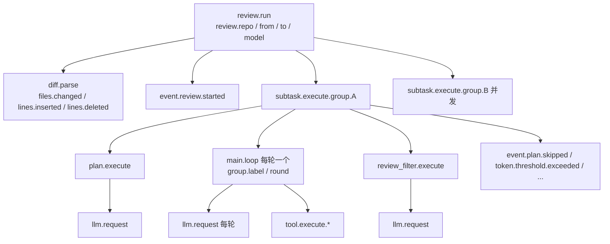

# 遥测系统

> **关联源码**：`internal/telemetry/`
> **前置阅读**：[00-overview.md](00-overview.md)

## 目录

- [1. 可观测性设计总览](#1-可观测性设计总览)
- [2. 遥测配置：config.go](#2-遥测配置configgo)
- [3. exporter 体系：exporter.go 与 provider.go](#3-exporter-体系exportergo-与-providergo)
- [4. 指标清单：metrics.go](#4-指标清单metricsgo)
- [5. 追踪范围：span.go](#5-追踪范围spango)
- [6. 事件模型：events.go](#6-事件模型eventsgo)
- [7. 优雅关闭：shutdown.go](#7-优雅关闭shutdowngo)
- [8. 隐私边界与关闭方式](#8-隐私边界与关闭方式)
- [9. 源文件覆盖清单](#9-源文件覆盖清单)

---

## 1. 可观测性设计总览

### 1.1 定位

遥测包是 OpenTelemetry（下称 OTel）Go SDK 的一层薄封装，提供 **traces（分布式追踪）与 metrics（指标）双信号**，没有接入 logs 信号。依赖面在 [go.mod](../../go.mod#L19-L29) 中直接声明：`otel`、`otel/metric`、`otel/trace`、`otel/sdk`、`otel/sdk/metric`，以及四类 exporter（otlp trace gRPC/http、otlp metric gRPC/http）与 stdout trace/metric exporter，全部锁定 `v1.45.0`（依赖总表见 [00-overview.md](00-overview.md)）。

三条设计原则贯穿全包：

1. **默认关闭**。`DefaultConfig` 的 `Enabled=false`（[config.go](../../internal/telemetry/config.go#L32-L41)），不开开关时 `Init` 提前返回（[provider.go](../../internal/telemetry/provider.go#L38-L42)），零 exporter、零开销。
2. **best-effort，绝不打断主流程**。指标注册错误被刻意忽略（[metrics.go](../../internal/telemetry/metrics.go#L73-L75) 的 `checkMetricErr` 空实现）；exporter 创建失败只打 stderr 警告后继续（[exporter.go](../../internal/telemetry/exporter.go#L106-L110)）；关闭失败也只警告（[shutdown.go](../../internal/telemetry/shutdown.go#L35-L42)）。
3. **关掉即 no-op**。`StartSpan` 在禁用时返回原 context 与 no-op span（[span.go](../../internal/telemetry/span.go#L25-L30)），`Event`/`Record*` 系列第一步就短路（[events.go](../../internal/telemetry/events.go#L23-L26)、[metrics.go](../../internal/telemetry/metrics.go#L77-L80)），调用方无需感知开关状态。

### 1.2 初始化：全局单例 + main 一次性装配

遥测采用 **进程级全局单例**，而非显式依赖传递：`tracerProvider`、`meterProvider`、`shutdownFuncs`、`initialized`、`serviceName` 五个包级变量（[provider.go](../../internal/telemetry/provider.go#L18-L27)）构成全部状态；初始化后通过 `otel.SetTracerProvider` / `otel.SetMeterProvider` / `otel.SetTextMapPropagator`（TraceContext + Baggage 组合传播器）注入 OTel 全局（[provider.go](../../internal/telemetry/provider.go#L62-L67)）。业务代码一律通过 `otel.GetTracerProvider().Tracer(serviceName)`、`otel.GetMeterProvider().Meter(serviceName)` 间接消费（[span.go](../../internal/telemetry/span.go#L19-L21)、[metrics.go](../../internal/telemetry/metrics.go#L28-L30)），不持有 provider 引用。

初始化只发生在**命令进程入口一处**：[main.go](../../cmd/opencodereview/main.go#L16-L28) 在 `rootCmd.Execute()` 之前调用 `telemetry.Init(ctx)`，返回 true（即至少注册了一个 exporter）时 `defer telemetry.ShutdownWithTimeout(ctx, 5*time.Second)`。`Init` 可安全重入——已初始化时直接返回当前开关状态（[provider.go](../../internal/telemetry/provider.go#L32-L36)）。`IsEnabled` 的判定是 `initialized && len(shutdownFuncs) > 0`（[provider.go](../../internal/telemetry/provider.go#L72-L75)），也就是说「初始化过」与「真正有 exporter 在工作」是两个概念。

### 1.3 接入面：谁在产数据

初始化在 main，但产数据的调用方分布在四层（`ocr viewer`、`ocr config`、`ocr session` 等命令不创建任何 span）：

| 层 | 调用点 | 产出 |
|---|---|---|
| 命令层 | [review_cmd.go](../../cmd/opencodereview/review_cmd.go#L246-L258)、[scan_cmd.go](../../cmd/opencodereview/scan_cmd.go#L228-L247) | 顶层 `review.run` / `scan.run` span、TraceID 打印 |
| 命令层 | [shared.go](../../cmd/opencodereview/shared.go#L694-L698)（emitRunResult） | run 级指标记录与 `PrintTraceSummary` |
| agent 流水线 | [agent.go](../../internal/agent/agent.go#L285)、[grouping.go](../../internal/agent/grouping.go#L159) | `diff.parse`、`subtask.*`、`plan.*`、`main.loop`、`review_filter.*` 与决策事件 |
| scan 流水线 | [scan/agent.go](../../internal/scan/agent.go#L317) | `scan.enumerate`、`scan.subtask.*`、scan 事件 |
| llmloop | [loop.go](../../internal/llmloop/loop.go#L393)、[loop.go](../../internal/llmloop/loop.go#L637) | `llm.request`、`tool.execute.*` span 与全部 LLM/工具指标 |
| diff 引擎 | [relocation.go](../../internal/diff/relocation.go#L62-L81) | 评论重定位 LLM 调用的 `llm.request` span |

### 1.4 数据流

**图 13-1**：遥测数据流（业务代码 → telemetry 门面 → 双 provider → exporter 选择 → 本机 stdout 或远端 collector）。

## 2. 遥测配置：config.go

### 2.1 Config 结构与默认值

[Config](../../internal/telemetry/config.go#L21-L29) 是已解析（resolved）的最终形态，共 6 个字段：

| 字段 | 默认值 | 含义 |
|---|---|---|
| `Enabled` | `false` | 总开关（master switch） |
| `ServiceName` | `"open-code-review"` | tracer/meter 的 instrumentation 名称 |
| `Exporter` | `"console"` | `"console"` 或 `"otlp"` |
| `OTLPEndpoint` | `""` | OTLP collector 地址（grpc/http 通用） |
| `OTLPProtocol` | `"grpc"` | `"grpc"` / `"http/protobuf"` / `"http/json"` |
| `ContentLog` | `false` | 「在日志事件中包含 prompt/response 内容」（保留字段，见 8.3） |

默认值断言有单测锁定（[config_test.go](../../internal/telemetry/config_test.go#L12-L32)）。

### 2.2 三层优先级：defaults < config.json < env

`ResolveConfig`（[config.go](../../internal/telemetry/config.go#L111-L125)）按固定顺序合并：先 `DefaultConfig`，再 `LoadFromJSON` 读 `~/.opencodereview/config.json`（路径由 [HomeConfigPath](../../internal/telemetry/config.go#L127-L134) 用 `os.UserHomeDir()` 拼出），最后 `resolveEnv` 让环境变量**整体覆盖**文件值。「env 覆盖 json」有专门测试（[config_test.go](../../internal/telemetry/config_test.go#L252-L266)）。

**图 13-2**：配置解析优先级。

JSON 层的实现有几个防御性细节（[config.go](../../internal/telemetry/config.go#L74-L109)）：

- 文件不存在 → 返回 nil（不报错）；**malformed JSON → 静默跳过**（`json.Unmarshal` 错误被吞掉，L86-L88）。
- `telemetry` 节只有 4 个键：`enabled` / `exporter` / `otlp_endpoint` / `content_logging`（[telemetrySection](../../internal/telemetry/config.go#L64-L70)）。**没有 service name 键**——服务名只能用 `OTEL_SERVICE_NAME` 环境变量改。
- `exporter` 仅在当前值还是默认 `"console"` 时才被文件覆盖（L96-L98）；`otlp_endpoint` 仅在 endpoint 为空时写入（L99-L100），且写入 endpoint 时若 exporter 仍是默认 `"console"` 会自动切到 `"otlp"`（L100-L104）。
- 文件中的 `enabled: false` 可被 `OCR_ENABLE_TELEMETRY=1` 推翻——CLI 场景常见的「平时关、CI 开」用法。

命令层通过 `ocr config set` 写这些键：`telemetry.enabled` / `telemetry.exporter` / `telemetry.otlp_endpoint` / `telemetry.content_logging`（[config_cmd.go](../../cmd/opencodereview/config_cmd.go#L439-L442)、[config_cmd.go](../../cmd/opencodereview/config_cmd.go#L569-L588)，键空间详见 [04-config-rules.md](04-config-rules.md)）。

### 2.3 环境变量清单

`resolveEnv`（[config.go](../../internal/telemetry/config.go#L45-L62)）识别 5 个变量：

| 环境变量 | 效果 |
|---|---|
| `OCR_ENABLE_TELEMETRY=1` | 打开总开关（只有字面量 `"1"` 生效，其它值包括 `"0"`/`"true"` 都不开） |
| `OTEL_SERVICE_NAME` | 覆盖 `ServiceName` |
| `OTEL_EXPORTER_OTLP_ENDPOINT` | 设置 endpoint 并**强制** `Exporter="otlp"`（L52-L55），适合一次性 `OTEL_EXPORTER_OTLP_ENDPOINT=... ocr review` |
| `OTEL_EXPORTER_OTLP_PROTOCOL` | 覆盖协议（透传，不校验） |
| `OCR_CONTENT_LOGGING=1` | 打开 `ContentLog`（同样只有 `"1"` 生效） |

两个易错点值得写明：

1. **`OTEL_EXPORTER_OTLP_ENDPOINT` 本身不会打开遥测**。它只切 exporter 类型；`Enabled` 仍需 `OCR_ENABLE_TELEMETRY=1` 或 config `telemetry.enabled=true`。`Init` 在 `!cfg.Enabled` 时直接返回 false（[provider.go](../../internal/telemetry/provider.go#L38-L42)）。
2. **`ContentLogging()` 读不到 config 文件里的 `content_logging`**。该函数调用 `ResolveConfig("")`——空路径意味着 JSON 层被跳过，只剩环境变量（[provider.go](../../internal/telemetry/provider.go#L77-L84)）。由于该函数目前无任何生产调用方（见 8.3），此偏差暂无实际影响，但与「config 可设 `telemetry.content_logging`」的表面承诺不一致。

### 2.4 采样率

代码**没有应用层采样配置**：三处 `sdktrace.NewTracerProvider` 都不传 `WithSampler`（[exporter.go](../../internal/telemetry/exporter.go#L112-L115) 等），OTel SDK 默认即 `ParentBased(AlwaysSample)`——只要 span 被创建就全部上报，与用户文档页「OCR exports everything」的说法一致。想采样只能走 OTel 标准环境变量：SDK 在 `NewTracerProvider` 内部应用 `OTEL_TRACES_SAMPLER` / `OTEL_TRACES_SAMPLER_ARG`（`always_on` / `parentbased_traceidratio` 等取值），这对 OCR 透传生效；批处理器参数（`OTEL_BSP_SCHEDULE_DELAY`、`OTEL_BSP_MAX_QUEUE_SIZE` 等）同理。这些是 SDK 默认行为而非 OCR 代码，配置入口层面 OCR 未做二次封装。

## 3. exporter 体系：exporter.go 与 provider.go

### 3.1 选择逻辑

`Init` 解析配置后按 `cfg.Exporter` 二分（[provider.go](../../internal/telemetry/provider.go#L55-L60)）：`"otlp"` 走 `initOTLPProviders`，**其余一切值（包括拼写错误）都落入 console**。OTLP 内部再按 `cfg.OTLPProtocol` 三分（[exporter.go](../../internal/telemetry/exporter.go#L85-L96)）：`http/protobuf` 与 `http/json` 走 HTTP exporter；`""` 与 `"grpc"` 走 gRPC；**未知协议打 stderr 警告后回退 gRPC**（L92-L95，路由行为有表驱动测试 [exporter_test.go](../../internal/telemetry/exporter_test.go#L141-L210)）。

每条路径都同时装配 trace 与 metric 两个 provider，并把各自的 `Shutdown` 追加进 `shutdownFuncs`——所以正常初始化后 `len(shutdownFuncs) == 2`（测试断言见 [exporter_test.go](../../internal/telemetry/exporter_test.go#L89-L91)）。

### 3.2 console exporter：本机 pretty-print

`initConsoleProviders`（[exporter.go](../../internal/telemetry/exporter.go#L183-L210)）用 `stdouttrace.New(WithPrettyPrint())` 与 `stdoutmetric.New(WithPrettyPrint())` 把 span/指标 JSON 美化后打到 stdout，供个人调试。**数据不离开本机**——隐私评估（第 8 节）中「console 开着也安全」的依据就在这里。

### 3.3 OTLP gRPC

[initOTLPGRPCProviders](../../internal/telemetry/exporter.go#L98-L135) 先用 `parseOTLPEndpoint`（L41-L50）归一化地址：`http://` 前缀剥掉并标记 insecure（明文）；`https://` 剥掉保 TLS；**裸 `host:port` 原样保留且默认 TLS**；尾部 `/` 会 trim（gRPC 的 `WithEndpoint` 只吃裸地址）。随后 trace/metric 各自 `New(ctx, WithEndpoint(addr))`，insecure 时补 `WithInsecure()`。大小写不敏感（`EqualFold`），case 表见 [exporter_test.go](../../internal/telemetry/exporter_test.go#L20-L47)。

### 3.4 OTLP HTTP 与 base path 语义

HTTP 路径（[initOTLPHTTPProviders](../../internal/telemetry/exporter.go#L153-L181)）是本包**注释最密、有真实事故史**的部分：它用 `WithEndpointURL`（而非 `WithEndpoint`），配合 [otlpSignalURL](../../internal/telemetry/exporter.go#L69-L83) 把配置的 endpoint 当作 OTel 规范定义的 **base URL**，手工拼上每信号的路径 `/v1/traces`、`/v1/metrics`。三条规则：

- 裸 `host:port` 补 `https://` 前缀，保持 gRPC 路径「裸地址 = TLS」的既有语义（`WithEndpointURL` 从 scheme 推导 Insecure）；
- base path 保留——`http://langfuse:3000/api/public/otel` 会发往 `.../api/public/otel/v1/traces`。源码注释记录了为什么：`WithEndpoint` 只接受裸 `host:port`，无法表达路径前缀，导致经路径前缀暴露的后端（如 Langfuse 的 `/api/public/otel`）收到的是根路径请求、每个 span 都 404 丢弃且无任何报错（[exporter.go](../../internal/telemetry/exporter.go#L137-L152)）；
- 已经以 signal path 结尾的 endpoint 不再重复拼接，避免 `/v1/traces/v1/traces`（L79-L82）。

该回归有端到端测试：起一个本地 httptest server，断言 collector 实际收到的请求路径（[exporter_test.go](../../internal/telemetry/exporter_test.go#L236-L299)）。

### 3.5 资源属性：service name 从哪来

资源由 `resource.New(ctx, WithFromEnv(), WithProcess(), WithOS(), WithHost())` 构造（[provider.go](../../internal/telemetry/provider.go#L44-L49)），失败回退 `resource.Default()`（L50-L53）。这里有三个容易误解的点，全部以代码为准：

1. **`cfg.ServiceName` 不写入 resource**。它只作为 tracer/meter 的 instrumentation scope 名称（[span.go](../../internal/telemetry/span.go#L19-L21)、[metrics.go](../../internal/telemetry/metrics.go#L28-L30)、[events.go](../../internal/telemetry/events.go#L29)）。span 数据里的 `service.name` 资源属性**只能**经 `WithFromEnv` 探测器从 `OTEL_SERVICE_NAME`（或 `OTEL_RESOURCE_ATTRIBUTES`）注入；不设该变量时导出的 span **没有 `service.name` 资源属性**。用户文档页把 `OTEL_SERVICE_NAME` 的默认值写作 `open-code-review`（[telemetry.md](../../pages/src/content/docs/en/telemetry.md#L66)），指的是 instrumentation 名，而非 resource 属性——两码事，**待与维护者确认**文档措辞是否需要澄清。
2. **没有 `service.version`**。OCR 的版本号 `llm.AppVersion`（main.go 注入）只用于 User-Agent 与 session manifest（见 [02-cli-commands.md](02-cli-commands.md)），不进 OTel resource。
3. **`WithProcess` 会带上进程信息**，包括 `process.command_args`（完整 `os.Args`，即整条 `ocr` 命令行——若 `--background` 里写了敏感内容会原样进入 resource）与 `process.owner`（操作系统用户名）。这是 OTel SDK `WithProcess()` 的固有行为（SDK 源码 config.go 中对该选项有明确的 sensitive-information 警告），加上 `os.*`、`host.*`。隐私影响见第 8 节。

### 3.6 失败语义：lazy、警告、以及一个潜在 nil 路径

exporter 创建基本是 lazy 的：错误的 endpoint（如 `localhost:0`）在 `New` 时不报错，要等首次导出才失败（测试 [exporter_test.go](../../internal/telemetry/exporter_test.go#L94-L139) 专门断言「创建是 lazy 的」；用户文档的 troubleshooting 也据此提醒「endpoint 配错是静默晚失败」）。trace exporter 创建失败时函数直接 `return`（[exporter.go](../../internal/telemetry/exporter.go#L106-L110)），此时 metric provider 也不会装配，`shutdownFuncs` 为空、`IsEnabled()` 为 false，后续 span/事件全部短路——行为安全。

但存在一个**不对称的混合失败路径**：trace exporter 成功、metric exporter 创建失败（[exporter.go](../../internal/telemetry/exporter.go#L124-L127) 同样 warning + return）时，`shutdownFuncs` 已有 1 项（trace），`IsEnabled()` 为 true，而 `meterProvider` 保持 nil 且仍被 `otel.SetMeterProvider` 注册（[provider.go](../../internal/telemetry/provider.go#L63)）。此后首次 `Record*` 会经 `getMeter()` 对 nil `*sdkmetric.MeterProvider` 调 `Meter()`，SDK 实现首行即解引用接收者，理论上 nil panic。该路径仅在 exporter 构造报错（lazy 语义下罕见，通常限于配置项冲突）时可达，且现有测试未覆盖「metric 失败而 trace 成功」的分支。**待与维护者确认**是否值得在 metric 失败时也降级整个遥测（例如清空 shutdownFuncs 或注册 noop meter）。

## 4. 指标清单：metrics.go

### 4.1 懒初始化

8 个指标句柄都是包级变量（[metrics.go](../../internal/telemetry/metrics.go#L16-L26)），由 `ensureMetrics` 在**首次 `Record*` 调用时**创建一次（[metrics.go](../../internal/telemetry/metrics.go#L32-L71)），门闩是普通 bool `initMetricsOnce` 而非 `sync.Once`——并发首发理论上可能双建，但 SDK meter 对同名同 identity 的 instrument 有缓存去重，加上 best-effort 语义，无用户可见影响（观察，非缺陷定论）。所有 `Record*` 入口都先查 `IsEnabled()`，禁用时是纯 no-op（[metrics_test.go](../../internal/telemetry/metrics_test.go#L13-L27)）。

### 4.2 全量指标表

以下与 [metrics.go](../../internal/telemetry/metrics.go#L40-L70) 的注册代码一一对应，共 **8 个**——5 个 Int64Counter、1 个 Int64Histogram、2 个 Float64Histogram：

| 指标名 | 类型 | 单位 | 标签 | 记录函数 | 触发点（代码路径） |
|---|---|---|---|---|---|
| `ocr.review.duration_seconds` | Int64Histogram | `s` | — | `RecordReviewDuration`（[L77-L85](../../internal/telemetry/metrics.go#L77-L85)） | review dispatch 结束（[agent.go](../../internal/agent/agent.go#L591-L594)）、scan dispatch 结束（[scan/agent.go](../../internal/scan/agent.go#L518-L522)）、run 级 emitRunResult（[shared.go](../../cmd/opencodereview/shared.go#L694-L695)） |
| `ocr.files_reviewed_total` | Int64Counter | — | — | `RecordFilesReviewed`（[L87-L95](../../internal/telemetry/metrics.go#L87-L95)） | review.started 后按 reviewCount（[agent.go](../../internal/agent/agent.go#L342-L348)）、scan.started 后按 reviewable（[scan/agent.go](../../internal/scan/agent.go#L363-L368)） |
| `ocr.comments_generated_total` | Int64Counter | — | — | `RecordCommentsGenerated`（[L97-L105](../../internal/telemetry/metrics.go#L97-L105)） | review 主流程返回后（[agent.go](../../internal/agent/agent.go#L377-L380)）、scan 汇总后（[scan/agent.go](../../internal/scan/agent.go#L370-L373)）、emitRunResult（[shared.go](../../cmd/opencodereview/shared.go#L696-L698)） |
| `ocr.llm.requests_total` | Int64Counter | — | `model`，`status`（`ok`/`error`） | `RecordLLMRequest`（[L107-L125](../../internal/telemetry/metrics.go#L107-L125)） | **仅** llmloop 主循环（[loop.go](../../internal/llmloop/loop.go#L406)、[L420](../../internal/llmloop/loop.go#L420)）与 grace round（[L539](../../internal/llmloop/loop.go#L539)、[L555](../../internal/llmloop/loop.go#L555)） |
| `ocr.llm.tokens_used` | Int64Counter | — | `model`，`type`（当前恒为 `total`） | `RecordLLMRequest`（[L122-L124](../../internal/telemetry/metrics.go#L122-L124)） | 同上；仅 `totalTokens > 0` 时累加 |
| `ocr.llm.request_duration_seconds` | Float64Histogram | `s` | `model` | `RecordLLMRequest`（[L118-L120](../../internal/telemetry/metrics.go#L118-L120)） | 同 `ocr.llm.requests_total` |
| `ocr.tool.calls_total` | Int64Counter | — | `tool.name`，`status`（`ok`/`error`） | `RecordToolCall`（[L127-L141](../../internal/telemetry/metrics.go#L127-L141)） | llmloop executeTool：code_comment 参数解析失败（[loop.go](../../internal/llmloop/loop.go#L646-L655)）、异步/同步 code_comment（[L746](../../internal/llmloop/loop.go#L746)、[L754](../../internal/llmloop/loop.go#L754)）、其余同步工具（[L770](../../internal/llmloop/loop.go#L770)） |
| `ocr.tool.execution_duration_seconds` | Float64Histogram | `s` | `tool.name` | `RecordToolCall`（[L142-L144](../../internal/telemetry/metrics.go#L142-L144)） | 同 `ocr.tool.calls_total` |

### 4.3 两个值得注意的统计口径问题

1. **`ocr.review.duration_seconds` 每次 run 会记两个数据点**：dispatchSubtasks 的 defer 记一次 dispatch 阶段时长（[agent.go](../../internal/agent/agent.go#L591-L594)），emitRunResult 又记一次全程时长（[shared.go](../../cmd/opencodereview/shared.go#L694-L695)）。聚合 `count` 时一次典型 run 贡献 2，直方图里混着两种口径的时长；空跑（无可审文件提前返回）只有全程一个点。用该指标做告警/计费时需知晓。
2. **`ocr.llm.*` 系列不覆盖所有 LLM 调用**。`RecordLLMRequest` 只挂在 llmloop 的主循环与 grace round。以下 LLM 调用**只产生 span、不进指标**：agent plan 阶段（[agent.go](../../internal/agent/agent.go#L1719-L1739)）、review filter（[agent.go](../../internal/agent/agent.go#L1815-L1837)）、评论重定位（[relocation.go](../../internal/diff/relocation.go#L62-L81)）。以下 LLM 调用则**完全不产生遥测**：内存压缩（[compression.go](../../internal/llmloop/compression.go#L253-L259)）、分组（[grouping.go](../../internal/agent/grouping.go#L209)）、scan 的 plan/dedup/项目总结（[scan/agent.go](../../internal/scan/agent.go#L841)、[L896](../../internal/scan/agent.go#L896)、[L975](../../internal/scan/agent.go#L975)）。因此「`ocr.llm.requests_total` = 全部 LLM 请求数」是不成立的，用 token 总量对账应以 session/raw 记录（[10-session-persistence.md](10-session-persistence.md)、[05-llm-providers.md](05-llm-providers.md)）为准。用户文档页的指标表未做此区分。

## 5. 追踪范围：span.go

### 5.1 API 面

[span.go](../../internal/telemetry/span.go) 是低层 API 集：

| 函数 | 行为 |
|---|---|
| `StartSpan`（[L25-L30](../../internal/telemetry/span.go#L25-L30)） | 禁用时返回原 ctx + no-op span，调用方可放心 `defer .End()` |
| `StartToolSpan`（[L86-L90](../../internal/telemetry/span.go#L86-L90)） | 创建 `tool.execute.<name>`，自带 `tool.name` 属性 |
| `StartLLMSpan`（[L108-L112](../../internal/telemetry/span.go#L108-L112)） | 创建 `llm.request`，自带 `llm.model` 属性 |
| `RecordToolResult`（[L92-L106](../../internal/telemetry/span.go#L92-L106)） | 写 `tool.duration_ms` / `tool.status`（+`tool.error`），失败时 `SetStatus(Error)` + `RecordError` |
| `RecordLLMResult`（[L114-L129](../../internal/telemetry/span.go#L114-L129)） | 写 `llm.duration_ms` / `llm.total_tokens` / `llm.status`（+`llm.error`） |
| `EndSpan` / `SetAttr` / `AnyToAttr`（[L56-L84](../../internal/telemetry/span.go#L56-L84)、[L131-L146](../../internal/telemetry/span.go#L131-L146)） | 结束/属性辅助；`SetAttr` nil span 安全、未知类型落空串 |
| `ContextWithTraceParentFromEnv`（[L32-L44](../../internal/telemetry/span.go#L32-L44)） | 从 `TRACEPARENT` 环境变量提取 W3C traceparent，把本次 run 接成上游 trace 的子 span |
| `TraceIDFromContext`（[L46-L54](../../internal/telemetry/span.go#L46-L54)） | 取 ctx 携带 span 的 hex trace ID，无效返回空串 |

`TRACEPARENT` 继承让「外层系统（CI、编排器）→ ocr」能拼成一棵树：review/scan 命令入口统一先 `ContextWithTraceParentFromEnv` 再开顶层 span（[review_cmd.go](../../cmd/opencodereview/review_cmd.go#L246)、[scan_cmd.go](../../cmd/opencodereview/scan_cmd.go#L228)）；提取、禁用、malformed 三种情况都有测试（[span_test.go](../../internal/telemetry/span_test.go#L183-L247)）。`TraceIDFromContext` 的产出有两处消费：非机器可读格式时打印 `[ocr] TraceID: ...` 到 stderr（[review_cmd.go](../../cmd/opencodereview/review_cmd.go#L253-L258)），以及嵌入 JSON/SARIF 输出（[shared.go](../../cmd/opencodereview/shared.go#L700)）和 raw LLM 记录（[raw.go](../../internal/llm/raw.go#L57-L60)），把三条观测通道 join 到同一 trace——raw 记录与 OTLP 对齐的细节见 [05-llm-providers.md](05-llm-providers.md)。但 review 的 stderr 打印实际读到的是**空值**：`review.run` span 与 TRACEPARENT 提取结果都在 `runCtx` 中，而打印处读的是未经提取的原始 `ctx`（[review_cmd.go](../../cmd/opencodereview/review_cmd.go#L246) 以 `runCtx, span := ...` 接收，[L254](../../cmd/opencodereview/review_cmd.go#L254) 却调用 `TraceIDFromContext(ctx)`——该 ctx 来自 signal 包装的 cobra background，不含任何 span，函数体内也无覆写），因此 review 的 `[ocr] TraceID:` 行恒为空串；scan_cmd 以 `ctx, span := ...` 直接覆写同名变量，无此问题（[scan_cmd.go](../../cmd/opencodereview/scan_cmd.go#L228)）。JSON/SARIF 与 raw 记录走 `runCtx` 链路（emitRunResult 于 [L291](../../cmd/opencodereview/review_cmd.go#L291) 收到 runCtx），不受影响。**待与维护者确认**这是否为笔误——改成 `TraceIDFromContext(runCtx)` 才能真正 join 三个通道。

### 5.2 span 树全貌（review）

**图 13-3**：review 一次 run 的 span 树（scan 的差异见后表）。

每个被审 group 一个 `subtask.execute.group.<group-key>` span（group key = 组内文件路径排序逗号拼接，[agent.go](../../internal/agent/agent.go#L1346-L1355)），其下 plan / 每轮 main.loop / review_filter 各一层；`llm.request` 与 `tool.execute.*` 是叶子。

### 5.3 span 清单（与代码一一对应）

| span 名称 | 关键属性 | 创建点 |
|---|---|---|
| `review.run` | `review.repo` / `review.from` / `review.to` / `review.model`；失败时 `SetStatus(Error)` + `RecordError` | [review_cmd.go](../../cmd/opencodereview/review_cmd.go#L246-L251)、[L281-L282](../../cmd/opencodereview/review_cmd.go#L281-L282) |
| `scan.run` | 启动无属性；失败时 error status | [scan_cmd.go](../../cmd/opencodereview/scan_cmd.go#L228-L247) |
| `diff.parse` | `files.changed` / `lines.inserted` / `lines.deleted` | [agent.go](../../internal/agent/agent.go#L285-L311) |
| `scan.enumerate` | `files.enumerated` | [scan/agent.go](../../internal/scan/agent.go#L317-L325) |
| `subtask.execute.group.<key>` | `group.label` / `group.file_count` / `lines.changed` / `lines.changed.max_file` | [agent.go](../../internal/agent/agent.go#L1348-L1355) |
| `scan.subtask.<file.path>` | `file.path` | [scan/agent.go](../../internal/scan/agent.go#L761-L764) |
| `main.loop`（每轮一个） | `group.label` / `round`；失败时 error status | [agent.go](../../internal/agent/agent.go#L1444-L1456) |
| `plan.execute` | `group.label`；失败时 error status | [agent.go](../../internal/agent/agent.go#L1694-L1696)、[L1730-L1731](../../internal/agent/agent.go#L1730-L1731) |
| `review_filter.execute` | `group.label` / `skipped` / `comments.before` / `comments.filtered`；失败时 error status | [agent.go](../../internal/agent/agent.go#L1752-L1763)、[L1789](../../internal/agent/agent.go#L1789)、[L1828](../../internal/agent/agent.go#L1828) |
| `llm.request` | `llm.model`；结果属性见 5.1 | [loop.go](../../internal/llmloop/loop.go#L393) / [L526](../../internal/llmloop/loop.go#L526)、[agent.go](../../internal/agent/agent.go#L1719) / [L1815](../../internal/agent/agent.go#L1815)、[relocation.go](../../internal/diff/relocation.go#L63) |
| `tool.execute.<name>` | `tool.name`；结果属性见 5.1 | [loop.go](../../internal/llmloop/loop.go#L637) / [L764](../../internal/llmloop/loop.go#L764) |
| `event.<name>` | 见第 6 节事件表 | [events.go](../../internal/telemetry/events.go#L23-L50) |

scan 与 review 的树差异：顶层是 `scan.run` → `scan.enumerate` → 每文件一个 `scan.subtask.<path>`（无 group 维度），主循环 span（`main.loop`）由 review 独有，scan 的 subtask 直接调用 `RunMainTask` 不再包一层（[scan/agent.go](../../internal/scan/agent.go#L793)）；scan 侧的 LLM/工具叶子 span 与 review 相同（都出自 llmloop）。span 命名在 [06-agent-loop.md](06-agent-loop.md)、[08-review-pipeline.md](08-review-pipeline.md)、[09-scan-pipeline.md](09-scan-pipeline.md) 中按流水线阶段有更细的语境。

### 5.4 与用户文档的一处冲突（以代码为准）

用户文档页声称「LLM 往返与工具执行**不**产生独立 span，只进指标」（[telemetry.md](../../pages/src/content/docs/en/telemetry.md#L130-L133)，其 span 属性表也相应没有这两个条目）。但当前代码明确在五处创建 `llm.request` span、两处创建 `tool.execute.*` span（上表引用的行号即证据）。**以源码为准：两者都产生独立 span，且同时进指标**（llmloop 路径）或只进 span（agent/relocation 路径）。**待与维护者确认**文档页是否滞后于一次未同步文档的代码演进。

## 6. 事件模型：events.go

### 6.1 事件 = 即生即灭的 span

「事件」不是 OTel 的 log signal，而是**立即 End 的短命 span**：`Event` 起名 `event.<name>`、挂属性、`defer span.End()`（[events.go](../../internal/telemetry/events.go#L23-L31)）；`ErrorEvent` 额外置 Error 状态并 `RecordError`（[L38-L50](../../internal/telemetry/events.go#L38-L50)）；`Eventf` 附带 `message` 属性（[L33-L36](../../internal/telemetry/events.go#L33-L36)）。因此事件与指标共享同一开关、同一 exporter、同一 resource；区别只在形态——事件是**离散决策点的点迹**（发生了什么、为什么跳过），指标是**聚合数值**（做了多少、多快）。后端里事件表现为「叶子 span」而非独立序列。

### 6.2 事件全表（生产事件 13 个）

| 事件名 | 属性 | 触发点 |
|---|---|---|
| `review.started` | `file.count` / `review.count` / `repo.dir` | diff 装载完成（[agent.go](../../internal/agent/agent.go#L342-L345)） |
| `no.files.changed` | — | 过滤后无支持文件（[agent.go](../../internal/agent/agent.go#L326)） |
| `grouping.skipped` | `strategy` / `file.count` / `lines.changed` / `threshold.files` / `threshold.lines` | 低于分组阈值本地分区（[grouping.go](../../internal/agent/grouping.go#L150-L165)；单文件变更集也强制上报，聚合需完整） |
| `plan.skipped` | `group.label` / `group.file_count` / `lines.changed` / `lines.changed.max_file` / `threshold` / `threshold.group` | 低于 plan 阈值（[agent.go](../../internal/agent/agent.go#L1390-L1396)） |
| `plan.failed` | `group.label` / `message` | plan 阶段报错、降级无 plan（[agent.go](../../internal/agent/agent.go#L1383-L1384)） |
| `token.threshold.exceeded` | review：`group.label` / `tokens` / `max_tokens` / `round`；scan：`file.path` / `tokens` / `max_tokens` | prompt 超 80% max_tokens（[agent.go](../../internal/agent/agent.go#L1304-L1308)、[scan/agent.go](../../internal/scan/agent.go#L786-L790)） |
| `subtask.panic` | `group.label` + error | 组审查 panic 被隔离（[agent.go](../../internal/agent/agent.go#L716-L718)） |
| `subtask.error` | `group.label` + error | 组审查报错或预算停止（[agent.go](../../internal/agent/agent.go#L741-L743)、[L778-L780](../../internal/agent/agent.go#L778-L780)） |
| `review_filter.completed` | `group.label` / `total_comments` / `removed` | 过滤完成（含 0 移除分支）（[agent.go](../../internal/agent/agent.go#L1845-L1850)、[L1870-L1873](../../internal/agent/agent.go#L1870-L1873)） |
| `scan.no.files` | — | 无可审文件（[scan/agent.go](../../internal/scan/agent.go#L341)） |
| `scan.started` | `file.count` / `review.count` / `est.total.tokens` / `repo.dir` | 枚举与成本预估完成（[scan/agent.go](../../internal/scan/agent.go#L363-L367)） |
| `scan.subtask.error` | `file.path` / `batch.index` + error | 单文件子任务报错（[scan/agent.go](../../internal/scan/agent.go#L727-L730)） |
| `phase.completed`（`PhaseEvent`） | `phase` / `file.path` / `duration_ms`（+error） | **无生产调用方**（见 6.3） |

### 6.3 PhaseEvent：定义了、测了、没人用

`PhaseEvent`（[events.go](../../internal/telemetry/events.go#L52-L64)）把「阶段名 + 文件 + 时长 + 可选错误」打包成事件，有成功/失败两个测试（[events_test.go](../../internal/telemetry/events_test.go#L117-L127)），但全仓库 grep 不到任何生产调用点（仅测试引用）。它与其说是死代码，不如说是为「按文件分阶段计时」预留的接口——当前阶段计时实际由 span 自带的 duration 承担。**待与维护者确认**其去留。

### 6.4 events.go 的另一半：控制台输出（不受开关控制）

[events.go](../../internal/telemetry/events.go) 还装着**与 OTel 无关**的终端 UX 函数，这点容易被包名误导：`PrintTraceSummary`（[L84-L102](../../internal/telemetry/events.go#L84-L102)）、`PrintToolCallStarted/Finished/Error`（[L104-L126](../../internal/telemetry/events.go#L104-L126)）、`FormatDuration`（[L66-L69](../../internal/telemetry/events.go#L66-L69)）、`summarizeArgs`（[L128-L149](../../internal/telemetry/events.go#L128-L149)）。它们**不检查 `IsEnabled()`**——`[ocr] ▶ file_read "..."` 这类工具轨迹行和 `[ocr] Summary: ...` 汇总行在遥测关闭时照常打印（输出格式的测试见 [events_test.go](../../internal/telemetry/events_test.go#L138-L195)）；真正的静音开关是命令层的 quiet handle（见 [08-review-pipeline.md](08-review-pipeline.md)）。`summarizeArgs` 只挑 `path`/`search`/`query`/`pattern` 等键做引号摘要、其余值截断到 50 字符，控制了终端行的信息量，但注意这走 stdout 本地，与上报无关。

## 7. 优雅关闭：shutdown.go

### 7.1 结构

`Shutdown`（[shutdown.go](../../internal/telemetry/shutdown.go#L13-L33)）顺序执行 `shutdownFuncs` 里的每个 provider Shutdown，**聚合并返回**错误（不中断后续 flush），最后把切片清空——因此 `Shutdown` 后 `IsEnabled()` 变 false，幂等。`ShutdownWithTimeout`（[L35-L42](../../internal/telemetry/shutdown.go#L35-L42)）只是包一层 `context.WithTimeout`，错误降级为 stderr 警告。错误聚合语义有测试（[shutdown_test.go](../../internal/telemetry/shutdown_test.go#L43-L58)）。

唯一调用点在 [main.go](../../cmd/opencodereview/main.go#L21-L23)：`defer telemetry.ShutdownWithTimeout(ctx, 5*time.Second)`——**5 秒是硬编码的 flush 预算**，超时即放弃（此时 ctx 取消会让 SDK 的 Shutdown 提前返回，残余数据丢弃）。没有强制（force-kill）逻辑，只有「尽力 flush、超时认赔」。

### 7.2 为什么 CLI 场景必须依赖这次 Shutdown

两个默认值决定了短命进程里数据基本靠 Shutdown 落盘：

- **traces**：`WithBatcher` 用默认参数——队列 2048、批超时 5s、单批 512、导出超时 30s（OTel SDK 默认，`OTEL_BSP_*` 环境变量可调）。review 一整次 run 通常短于批超时，span 全在队列里等 `Shutdown` 触发导出。
- **metrics**：`NewPeriodicReader` 未传任何选项，默认 **60s 导出间隔**、30s 超时（OTel SDK `periodic_reader.go` 的 `defaultInterval`/`defaultTimeout`；`OTEL_METRIC_EXPORT_INTERVAL` 可调）。CLI 进程活不到 60s，PeriodicReader 一次都不会自己跑——**全部指标实际上只由 Shutdown 的 flush 导出**。

### 7.3 一个丢失边界：`os.Exit(1)` 绕过 defer

[main.go](../../cmd/opencodereview/main.go#L25-L28) 在 `rootCmd.Execute()` 返回错误时 `os.Exit(1)`——Go 的 `os.Exit` **不执行 defer**。也就是说：命令以错误退出（包括 review/scan 运行期错误被 cobra 上抛）时，注册好的 5 秒 shutdown 不会发生，批队列里的 span 与未导出的指标直接丢失；只有退出码 0 的路径才有 flush。对「失败 run 的遥测最宝贵」（排障场景恰恰是失败 run）这一用途是个实际的盲区。**待与维护者确认**是否应在错误路径显式调用 `ShutdownWithTimeout` 后再 `os.Exit`。

## 8. 隐私边界与关闭方式

### 8.1 如何完全禁用

以 [config.go](../../internal/telemetry/config.go#L44-L62) 的解析逻辑为准：

- **默认即禁用**：不设 `OCR_ENABLE_TELEMETRY`、config 里没有 `telemetry.enabled: true`，就是关。`Init` 直接返回，不创建任何 provider（[provider_test.go](../../internal/telemetry/provider_test.go#L105-L132)）。
- 反向注意：只设 `OTEL_EXPORTER_OTLP_ENDPOINT` 等 OTEL_* 变量**不会**打开遥测（2.3 节）；反之要关掉时也需确认没被 env 或 config 打开——`enabled` 的判定是「`OCR_ENABLE_TELEMETRY=1` 或 config true」二者取或后 env 覆盖。
- 关闭后并非「无操作仍上报」而是「无数据产生」：所有入口短路，控制台 `[ocr]` 输出（6.4 节）与遥测是两套东西，不受此开关影响。

### 8.2 上报了什么（从字段倒推）

开启且 exporter=otlp 时，**离开本机**的数据面：

- **指标**：模型名、工具名、ok/error 状态、计数与时长。无路径、无内容。
- **span 属性**：仓库绝对路径（`review.repo`、`repo.dir`）、commit ref（`review.from`/`to`）、文件路径（`group.label`、`file.path`、`scan.subtask.<path>` 直接进 span 名）、模型名、token 数、轮次、以及 **`err.Error()` 原文**（`error` 属性、`llm.error`、`tool.error`、`Eventf` 的 `message`）。
- **resource**：`process.command_args`（整条命令行，含 `--background` 等参数原文）、`process.owner`（用户名）、`process.executable.path`、`os.*`、`host.*`（3.5 节；这是 SDK `WithProcess()` 的固有行为）。

**不上报**的：prompt 与 response 正文、diff 内容、评论正文——全包没有任何把消息内容附到 span/指标的代码路径；HTTP header 完全不经过遥测层，与 [ASSURANCE_CASE.md](../../ASSURANCE_CASE.md#L98)「API keys and sensitive headers are excluded from all log output and telemetry」的声明一致。需要看内容时，官方答案是本地 session 转录（viewer 读取，[10-session-persistence.md](10-session-persistence.md)）或 `OCR_RAW_LOGGING=1` 的本地 raw 捕获（[05-llm-providers.md](05-llm-providers.md)）——两者都只落 `~/.opencodereview/` 磁盘，不进 collector。

两条**间接外溢**通道需要如实说明：

1. **错误文本可能携带源码片段**。git 报错曾把 stdout（diff 正文，含源码与内嵌 secret）一并拼进 error 文本，随 `span.RecordError` 到达遥测后端——这正是 [git_error_test.go](../../internal/diff/git_error_test.go#L171-L198) 锁定的回归：`TestGetDiff_FailureQuotesStderrNotStdout` 保证 error 只引用 stderr 诊断、不含 stdout 内容。同理，LLM API 的错误消息原文（可能含 provider 返回的请求片段）会原样进入 `llm.error`/`message` 属性。错误文本是当前遥测里唯一可能间接携带仓库内容的通道。
2. **resource 的进程信息**（8.2 第一段所列）在用户未细看时容易被忽略：命令行参数与用户名随每个 span 无条件导出。

### 8.3 ContentLog：接了线、没接负载

`content_logging` config 键与 `OCR_CONTENT_LOGGING` 环境变量贯穿配置层（[config.go](../../internal/telemetry/config.go#L59-L61)、[L105-L107](../../internal/telemetry/config.go#L105-L107)），`telemetry.ContentLogging()` 也实现了（[provider.go](../../internal/telemetry/provider.go#L77-L84)，含三态测试 [provider_test.go](../../internal/telemetry/provider_test.go#L49-L73)），但**全仓库没有任何生产代码调用 `ContentLogging()`**——它不 gate 任何输出路径。用户文档页对此的表述（「plumbed through the config layer but currently does not gate any code path, treat the flag as reserved」）与代码一致（[telemetry.md](../../pages/src/content/docs/en/telemetry.md#L184-L195)）。结论：**不存在「打开某开关就上报 prompt/response」的路径**，`content_logging` 目前是纯保留位。另见 2.3 的细节：即便未来接线，`ContentLogging()` 当前实现也读不到 config 文件值。

### 8.4 与各声明的对照小结

| 声明来源 | 说法 | 与源码关系 |
|---|---|---|
| [ASSURANCE_CASE.md](../../ASSURANCE_CASE.md#L98) | API key / 敏感 header 不进日志与遥测 | 一致：遥测层不触碰 header/key |
| [telemetry.md](../../pages/src/content/docs/en/telemetry.md#L186-L190) 文档页 | 只导出 LLM 流量「形状」，从不附 prompt/response | 一致（含 ContentLog 为 no-op 的说明） |
| 文档页 [L130-L133](../../pages/src/content/docs/en/telemetry.md#L130-L133) | LLM/工具调用不产生独立 span | **不一致**：代码有 `llm.request` / `tool.execute.*` span（5.4 节，以代码为准） |
| 文档页 [L66](../../pages/src/content/docs/en/telemetry.md#L66) | `OTEL_SERVICE_NAME` 默认 `open-code-review` | 部分成立：仅 instrumentation 名有默认值，resource 的 `service.name` 无（3.5 节） |
| AGENTS.md / README | 遥测整体默认关闭、指向文档页 | 一致 |

## 9. 源文件覆盖清单

Glob 核对 `/workspace/internal/telemetry/*.go` 剔除 8 个 `_test.go` 后共 **7 个**源文件，全部覆盖：

| 源文件 | 职责 | 关键符号 |
|---|---|---|
| [config.go](../../internal/telemetry/config.go) | 配置解析：默认值、JSON 层、env 层、优先级合并 | `Config`、`DefaultConfig`、`resolveEnv`、`LoadFromJSON`、`ResolveConfig`、`HomeConfigPath`、`telemetrySection` |
| [events.go](../../internal/telemetry/events.go) | 事件模型（短命 span）与控制台输出助手 | `Event`、`Eventf`、`ErrorEvent`、`PhaseEvent`、`TraceSummary`、`PrintTraceSummary`、`PrintToolCallStarted/Finished/Error`、`FormatDuration`、`summarizeArgs` |
| [exporter.go](../../internal/telemetry/exporter.go) | exporter 装配与 OTLP 端点语义 | `newStdoutTraceExporter`、`newStdoutMetricExporter`、`parseOTLPEndpoint`、`otlpSignalURL`、`initOTLPProviders`、`initOTLPGRPCProviders`、`initOTLPHTTPProviders`、`initConsoleProviders` |
| [metrics.go](../../internal/telemetry/metrics.go) | 8 个指标的定义与记录 API | `ensureMetrics`、`getMeter`、`checkMetricErr`、`RecordReviewDuration`、`RecordFilesReviewed`、`RecordCommentsGenerated`、`RecordLLMRequest`、`RecordToolCall` |
| [provider.go](../../internal/telemetry/provider.go) | 全局 provider 装配、开关与资源构造 | `Init`、`IsEnabled`、`ContentLogging`、包级 `tracerProvider` / `meterProvider` / `shutdownFuncs` / `serviceName` |
| [shutdown.go](../../internal/telemetry/shutdown.go) | 优雅关闭与 flush | `Shutdown`、`ShutdownWithTimeout` |
| [span.go](../../internal/telemetry/span.go) | span API：创建、属性、trace 上下文 | `StartSpan`、`StartToolSpan`、`StartLLMSpan`、`EndSpan`、`SetAttr`、`RecordToolResult`、`RecordLLMResult`、`ContextWithTraceParentFromEnv`、`TraceIDFromContext`、`AnyToAttr` |

佐证测试（不进清单）：[config_test.go](../../internal/telemetry/config_test.go)、[events_test.go](../../internal/telemetry/events_test.go)、[exporter_test.go](../../internal/telemetry/exporter_test.go)、[metrics_test.go](../../internal/telemetry/metrics_test.go)、[provider_test.go](../../internal/telemetry/provider_test.go)、[shutdown_test.go](../../internal/telemetry/shutdown_test.go)、[span_test.go](../../internal/telemetry/span_test.go)、[traceid_test.go](../../internal/telemetry/traceid_test.go)；测试基建 `setupEnabledTelemetry`（[events_test.go](../../internal/telemetry/events_test.go#L26-L49)）在 [16-testing-quality.md](16-testing-quality.md) 有整体讨论。
