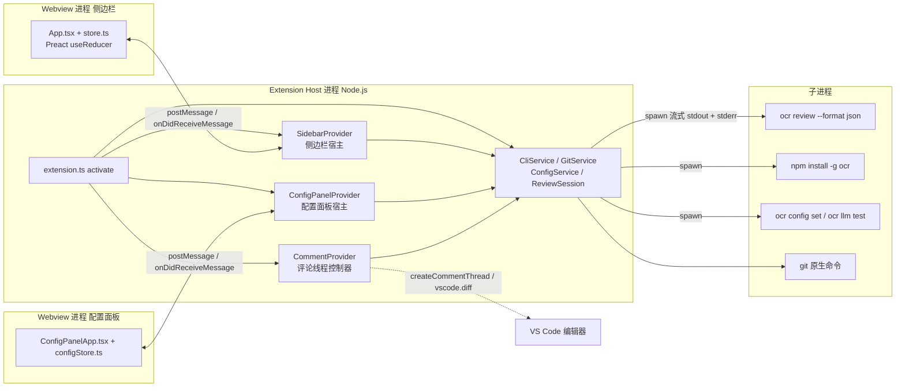
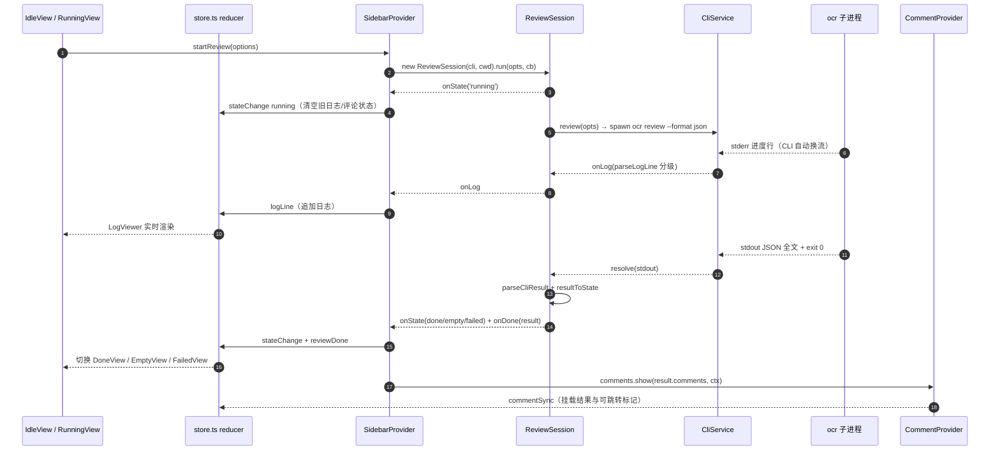
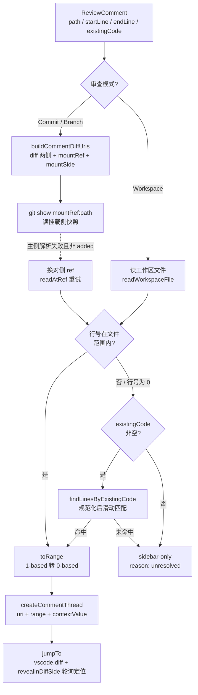

# VS Code 扩展

> **关联源码**：`extensions/vscode/`
> **前置阅读**：[02-cli-commands.md](02-cli-commands.md)、[08-review-pipeline.md](08-review-pipeline.md)

## 目录

- [1. 扩展架构总览](#1-扩展架构总览)
- [2. CliService：ocr 子进程管理](#2-cliserviceocr-子进程管理)
- [3. cliParse：CLI 输出解析](#3-cliparsecli-输出解析)
- [4. GitService 与 gitMap](#4-gitservice-与-gitmap)
- [5. ConfigService、configParse、configDraft](#5-configserviceconfigparseconfigdraft)
- [6. ReviewSession：运行状态机](#6-reviewsession运行状态机)
- [7. SidebarProvider 与 webview 应用](#7-sidebarprovider-与-webview-应用)
- [8. 视图组件矩阵](#8-视图组件矩阵)
- [9. CommentProvider 与行号对齐](#9-commentprovider-与行号对齐)
- [10. ConfigPanelProvider：配置面板](#10-configpanelprovider配置面板)
- [11. i18n 与构建](#11-i18n-与构建)
- [12. 源文件覆盖清单](#12-源文件覆盖清单)

---

## 1. 扩展架构总览

### 1.1 三方进程边界

扩展运行在三个进程边界之上：**extension host 进程**（Node.js，承载全部服务与 VS Code API 访问）、**webview 进程**（两个相互独立的 Preact 应用：活动栏侧边栏与配置面板）、以及由 extension host **spawn 出来的 ocr CLI 子进程**。webview 与 host 之间只能靠 `postMessage` 双向通信（协议定义在 [messages.ts](../../extensions/vscode/src/shared/messages.ts)），webview 内没有任何 Node 能力；ocr CLI 则以 `--format json` 的机器可读模式运行，进度日志走 stderr、结果 JSON 走 stdout（见 [3.2 节](#32-结果解析parsecliresult)）。

**图 14-1**：扩展三方架构（extension host / 两个 webview / ocr CLI 子进程，含消息流与进程边界）。



值得强调的边界纪律：

- **shared/ 目录是唯一的跨进程契约层**。[types.ts](../../extensions/vscode/src/shared/types.ts)、[messages.ts](../../extensions/vscode/src/shared/messages.ts)、[providers.ts](../../extensions/vscode/src/shared/providers.ts)、[configUtils.ts](../../extensions/vscode/src/shared/configUtils.ts) 等同时被 extension（tsconfig.extension.json include，[tsconfig.extension.json](../../extensions/vscode/tsconfig.extension.json#L11-L12)）与 webview（[tsconfig.webview.json](../../extensions/vscode/tsconfig.webview.json#L12-L13)）两个编译目标包含，消息类型与数据结构因此不可能漂移。
- **两个 webview 是完全独立的 bundle 与状态树**：侧边栏（webview.js）与配置面板（configPanel.js）各自有入口（[index.tsx](../../extensions/vscode/src/webview/index.tsx)、[configPanel.tsx](../../extensions/vscode/src/webview/configPanel.tsx)）、各自的 reducer（[store.ts](../../extensions/vscode/src/webview/store.ts)、[configStore.ts](../../extensions/vscode/src/webview/configStore.ts)）。二者没有直接通信；配置变更由 ConfigPanelProvider 通过回调 `sidebar.pushConfig` 转发给侧边栏（[extension.ts](../../extensions/vscode/src/extension/extension.ts#L25-L26)）。
- **ocr CLI 是唯一的审查执行者**。扩展自己不实现任何 diff 解析或 LLM 调用，只负责参数构造、输出解析与结果可视化——CLI 侧的 review 流水线详见 [08-review-pipeline.md](08-review-pipeline.md)。

### 1.2 激活流程与贡献点

[package.json](../../extensions/vscode/package.json) 声明 `activationEvents: ["onStartupFinished"]`（[L21-L23](../../extensions/vscode/package.json#L21-L23)），即 VS Code 启动完成后即激活，不等待任何命令或视图打开。`main` 指向 `./out/extension.js`（[L20](../../extensions/vscode/package.json#L20)），`engines.vscode` 要求 `^1.74.0`（[L14](../../extensions/vscode/package.json#L14)）。唯一的运行时依赖是 `preact`（[L123](../../extensions/vscode/package.json#L123)）——webview UI 是 Preact 而非 React（详见 [7.2 节](#72-storets-usereducer-状态管理)）。

贡献点（contributes）一览：

| 类别 | 内容 | 位置 |
|---|---|---|
| 活动栏容器 | `ocr-container`，图标 `resources/icon.svg` | [L25-L33](../../extensions/vscode/package.json#L25-L33) |
| 视图 | `ocr.sidebar`（webview 类型，注册到活动栏容器） | [L34-L42](../../extensions/vscode/package.json#L34-L42) |
| 命令 | `ocr.review.start`、`ocr.review.cancel`、`ocr.config.open`、`ocr.comment.apply`、`ocr.comment.discard`、`ocr.comment.falsePositive` 共 6 个 | [L43-L68](../../extensions/vscode/package.json#L43-L68) |
| 评论线程标题菜单 | apply（`when: commentController == ocr-review && commentThread == pending`）、discard（`commentThread =~ /^pending/`） | [L69-L82](../../extensions/vscode/package.json#L69-L82) |

注意一个差异：**命令贡献点声明了 6 个命令，但 [commands.ts](../../extensions/vscode/src/extension/commands.ts#L16-L33) 只注册了 4 个**（`ocr.config.open` 与三个 `ocr.comment.*`）。`COMMANDS.reviewStart` / `COMMANDS.reviewCancel` 在 [constants.ts](../../extensions/vscode/src/shared/constants.ts#L7-L14) 中定义了常量却没有任何注册或调用方——审查的启动/取消实际由 webview 消息 `startReview` / `cancelReview` 驱动（[7.3 节](#73-消息协议全表)）。这两个命令 ID 疑似为命令面板直启预留，**待与维护者确认**。

菜单 `when` 子句与 [CommentProvider.threadContextValue](../../extensions/vscode/src/extension/providers/CommentProvider.ts#L115-L118) 存在精确配合：只有 Workspace 模式且带建议的线程 contextValue 为 `'pending'`（Apply + Discord 按钮都显示），其余为 `'pendingNoSuggestion'`（正则 `/^pending/` 只放行 Discard）；状态流转后 contextValue 被改为 `applied`/`discarded`/`falsePositive`，两个按钮同时消失（[setStatus](../../extensions/vscode/src/extension/providers/CommentProvider.ts#L179-L199)）。

### 1.3 组装：extension.ts 的对象图

[activate](../../extensions/vscode/src/extension/extension.ts#L16-L37) 是唯一组装点，全程手工依赖注入（无 DI 框架）：

```
CliService('ocr') ──┬─→ ConfigService(cli)
                    ├─→ SidebarProvider(extensionUri, cli, config, git, comments)
                    └─→ ConfigPanelProvider(extensionUri, cli, config, onConfigChanged)
GitService(output) ──→ CommentProvider(extensionUri, git)
```

两个 provider 之间通过回调互相解耦（[extension.ts](../../extensions/vscode/src/extension/extension.ts#L25-L26)）：

- ConfigPanelProvider 构造时收到 `(cfg) => sidebar.pushConfig(cfg)`——面板里每次保存/删除/激活 provider 后，最新配置会推给侧边栏（`config` 消息）；
- 反向 `sidebar.bindConfigPanel((focus) => configPanel.open(focus))` 让侧边栏的「模型配置」「管理自定义 Provider」按钮能打开面板并定位到指定 step/tab（[SidebarProvider.handle 的 openConfigPanel 分支](../../extensions/vscode/src/extension/providers/SidebarProvider.ts#L114-L115)）。

侧边栏注册时开了 `retainContextWhenHidden: true`（[extension.ts](../../extensions/vscode/src/extension/extension.ts#L28-L32)）——活动栏切走时 webview 状态不丢，审查日志与评论列表在切换回来后原样保留。所有 Disposable 统一收入 `context.subscriptions`，[deactivate](../../extensions/vscode/src/extension/extension.ts#L39-L41) 里二次兜底释放。

## 2. CliService：ocr 子进程管理

[CliService](../../extensions/vscode/src/extension/services/CliService.ts#L11-L170) 是扩展对 ocr CLI 的全部封装：进程 spawn、流式读取、取消、环境探测、一键安装。

### 2.1 命令定位与 shell 环境（shellEnv）

扩展最隐蔽的工程问题是**命令找不到**：GUI 启动的 VS Code（尤其 macOS Dock/Spotlight 启动）继承的是精简 PATH，不含 nvm / homebrew / npm 全局 bin，直接 spawn `ocr` 会 ENOENT。[shellEnv.ts](../../extensions/vscode/src/extension/services/shellEnv.ts#L29-L47) 的解法是在**首次需要时**用 `spawnSync(shell, ['-ilc', 'echo DELIM; env; echo DELIM'])` 跑一次用户的登录交互式 shell（加载 `~/.zshrc`、`~/.zprofile` 等），用双分隔标记 `_OCR_ENV_DELIM_` 从输出中切出真实环境变量块（[parseEnvBlock](../../extensions/vscode/src/extension/services/shellEnv.ts#L9-L20)，只按每行首个 `=` 切分，value 含 `=` 不受影响——[shellEnv.test.ts](../../extensions/vscode/src/extension/services/__tests__/shellEnv.test.ts#L11-L27)），与 `process.env` 合并后进程级缓存。Windows 下终端与 GUI 环境一致，直接返回 `process.env`（[L31-L34](../../extensions/vscode/src/extension/services/shellEnv.ts#L31-L34)）；测试可用 `OCR_SKIP_SHELL_RESOLVE=1` 跳过（各测试文件顶部统一设置）。

[resolveBin](../../extensions/vscode/src/extension/services/shellEnv.ts#L56-L75) 解决同一问题的另一面：nvm 等工具用 shell function 或动态 PATH 暴露二进制，`command -v` 在登录 shell 里才能解析出绝对路径；解析失败回退原命令名交给 spawn 在注入的 PATH 中查找。所有 spawn 点（[CliService](../../extensions/vscode/src/extension/services/CliService.ts#L39)、[L78](../../extensions/vscode/src/extension/services/CliService.ts#L78)、[L115](../../extensions/vscode/src/extension/services/CliService.ts#L115)）都先过 `resolveBin`；Windows 上统一加 `shell: true`（[CliService.test.ts](../../extensions/vscode/src/extension/services/__tests__/CliService.test.ts#L35-L53) 佐证平台差异），注释明确说明这里安全的前提是参数全部硬编码、无用户输入（[L38](../../extensions/vscode/src/extension/services/CliService.ts#L38)）。

### 2.2 runRaw：流式输出读取

[runRaw](../../extensions/vscode/src/extension/services/CliService.ts#L108-L138) 是所有 CLI 调用的底座：

- **stdout 只累积不分发**：`stdout` 全量拼接，进程结束后整体返回——它承载的是单个 JSON 结果文档，必须完整解析；
- **stderr 逐行分发**：每个 chunk 按 `\n` 切行，逐行过 [parseLogLine](../../extensions/vscode/src/extension/services/cliParse.ts#L68-L72)（空行丢弃；含 `retrying|warning|warn` 的行归为 `warn` 级别，其余 `info`）后回调 `onLog`——stderr 承载的是实时进度流；
- **退出码语义**：0 → resolve(stdout)；非 0 → reject，错误消息优先取 [extractCliError](../../extensions/vscode/src/extension/services/cliParse.ts#L60-L66) 从 stderr 提取的 `Error:` 行（多个时取最后一个），否则取最后一行非空内容，都没有则退回 `CLI exited with code N`。

子进程引用存入 `this.current`（[L119](../../extensions/vscode/src/extension/services/CliService.ts#L119)），供 cancel 使用；`error`/`close` 事件都会清空它。`review()`（[L140-L143](../../extensions/vscode/src/extension/services/CliService.ts#L140-L143)）在 runRaw 之上完成「构造参数 → 拿 stdout → parseCliResult」的组合。

### 2.3 取消机制：SIGTERM → SIGKILL 升级

[cancel](../../extensions/vscode/src/extension/services/CliService.ts#L161-L170) 的策略是先 `SIGTERM`，同时挂一个 3 秒定时器：若进程仍未退出（`exitCode === null && signalCode === null`）则补发 `SIGKILL` 强杀；`close` 事件一旦到达即取消定时器。[CliService.cancel.test.ts](../../extensions/vscode/src/extension/services/__tests__/CliService.cancel.test.ts#L41-L70) 用 fake timers 精确佐证了两条路径：子进程忽略 SIGTERM 时 3 秒后收到第二次 kill（SIGKILL）；正常退出后不再追杀。

### 2.4 环境探测与一键安装

[checkEnvironment](../../extensions/vscode/src/extension/services/CliService.ts#L55-L68) 依次探测 node → npm → ocr 三件套（各跑 `--version`，[probeCommand](../../extensions/vscode/src/extension/services/CliService.ts#L36-L53)），结果带 5 分钟 TTL 缓存（[L13-L14](../../extensions/vscode/src/extension/services/CliService.ts#L13-L14)，`ENV_CACHE_TTL_MS = 5 * 60 * 1000`），短路逻辑：node 不过则 npm/ocr 直接判失败。

[install](../../extensions/vscode/src/extension/services/CliService.ts#L71-L105) 实现了「一键安装」：`npm install -g @alibaba-group/open-code-review --loglevel http --no-progress`，并强制 `npm_config_progress=false` 与 `npm_config_color=false`（非 TTY 下 npm 默认静默进度条，关闭后才能拿到干净的行式输出）。npm 输出可能跨 chunk 断行，[emitLines 闭包](../../extensions/vscode/src/extension/services/CliService.ts#L84-L93) 维护一个行缓冲：`\r` 归一为 `\n`，切行后尾部残行留在缓冲区等下个 chunk，`flush` 时强制清空。安装成功即失效环境缓存并回发 `environmentResult`（[ConfigPanelProvider 的 installCli 分支](../../extensions/vscode/src/extension/providers/ConfigPanelProvider.ts#L139-L145)）。

### 2.5 testConnection 的隔离 HOME

[testConnection](../../extensions/vscode/src/extension/services/CliService.ts#L145-L159) 跑 `ocr llm test`，支持注入 `HOME`（Windows 同步覆盖 `USERPROFILE`）与 `OCR_CONFIG_PATH` 环境变量——这是 [ConfigService.testWithEntries](#54-连接测试的隔离沙箱) 的沙箱基础：在临时 HOME 里测试未保存的草稿配置而不触碰真实 `~/.opencodereview/config.json`。CLI 侧 `OCR_CONFIG_PATH` 只影响只读命令、不能重定向写路径的防线见 [02-cli-commands.md](02-cli-commands.md) 6.3 节。

## 3. cliParse：CLI 输出解析

[cliParse.ts](../../extensions/vscode/src/extension/services/cliParse.ts) 是扩展对 CLI 协议的解析端，四个纯函数分别处理参数构造、结果解析、错误提取、日志分级。

### 3.1 参数构造：buildReviewArgs

[buildReviewArgs](../../extensions/vscode/src/extension/services/cliParse.ts#L6-L25) 把 UI 的 `CliRunOptions`（[types.ts](../../extensions/vscode/src/shared/types.ts#L106-L113)）翻译为 CLI 参数：

| UI 选项 | CLI 参数 |
|---|---|
| `mode=branch` + from/to | `--from <ref> --to <ref>` |
| `mode=commit` + commit | `--commit <sha>` |
| `mode=workspace` | （无模式参数，默认工作区 diff） |
| 恒定 | `--format json` |
| `customPrompt` 非空 | `--background <prompt>` |
| `concurrency` 为数字 | `--concurrency <n>` |

[cliParse.test.ts](../../extensions/vscode/src/extension/services/__tests__/cliParse.test.ts#L8-L31) 逐一固化了这五种组合。关键注释在 [L14-L17](../../extensions/vscode/src/extension/services/cliParse.ts#L14-L17)：**JSON 结果走 stdout、进度日志走 stderr，供扩展实时回显**；`--progress-stderr` flag 的启用被注释为 TODO（当前已安装的 CLI 版本不识别该 flag）。实际上进度换流**已经发生**——不靠显式 flag，而靠 CLI 侧对 `--format json`（machine-readable 格式）的自动检测：[newQuietHandle](../../cmd/opencodereview/shared.go#L363-L384) 在机器可读格式 + 人类受众时执行 `stdout.Swap(os.Stderr)`，把 `[ocr]` 进度行整体搬到 stderr。扩展今天能读到进度流正是依赖这个隐式契约；TODO 注释表明未来会改为显式 flag，**演进方向待与维护者确认**。

### 3.2 结果解析：parseCliResult

[parseCliResult](../../extensions/vscode/src/extension/services/cliParse.ts#L39-L58) 对 stdout 做的是**容错定位 + snake_case 到 camelCase 的字段映射**：

- 容错定位：`stdout.indexOf('{')` 找到第一个 `{` 再 `JSON.parse` 其后的全部内容，JSON 之前的非 JSON 噪声行被跳过（[cliParse.test.ts](../../extensions/vscode/src/extension/services/__tests__/cliParse.test.ts#L63-L67)）；
- 字段映射：CLI 侧 [jsonOutput](../../cmd/opencodereview/output.go#L317-L336) 的 `comments[].suggestion_code/existing_code/start_line/end_line` 映射为扩展的 `suggestionCode/existingCode/startLine/endLine`（[toComment](../../extensions/vscode/src/extension/services/cliParse.ts#L27-L37)），`summary.files_reviewed/total_tokens/...` 映射为 `filesReviewed/totalTokens/...`；
- 扩展只消费 `status` / `message` / `comments` / `warnings` / `summary` 五个字段。CLI 侧 jsonOutput 还携带 `llm/trace_id/tool_calls/groups/manifest/retry_report` 等字段（[outputJSONWithWarnings](../../cmd/opencodereview/output.go#L352-L412)，字段语义详见 [02-cli-commands.md](02-cli-commands.md) 8.3 节），扩展一概忽略——协议向前兼容：CLI 新增字段不会破坏扩展解析。

### 3.3 从 CLI 输出到 UI 状态

**图 14-2**：一次审查的完整数据流（CliService 流 → cliParse 解析 → ReviewSession 状态 → store 更新 → 视图渲染）。



[parseLogLine](../../extensions/vscode/src/extension/services/cliParse.ts#L68-L72) 的级别判定是纯正则启发（`/retrying|warning|warn/i` → warn），CLI 侧 `[ocr] WARNING` 行（[output.go](../../cmd/opencodereview/output.go#L85-L90)）与 LLM SDK 的 retrying 输出都会命中（[cliParse.test.ts](../../extensions/vscode/src/extension/services/__tests__/cliParse.test.ts#L87-L99)）；`extractCliError` 优先抓 `Error:` 行，与 CLI 根命令 `Error: %v` 的退出输出（[main.go](../../cmd/opencodereview/main.go)）对齐。

## 4. GitService 与 gitMap

### 4.1 双轨数据源

[GitService](../../extensions/vscode/src/extension/services/GitService.ts#L13-L501) 同时使用两种 git 数据源，按场景取舍：

- **VS Code Git 扩展 API**（[ensureApi](../../extensions/vscode/src/extension/services/GitService.ts#L24-L32) 激活 `vscode.git` 取 `getAPI(1)`）：用于分支列表（[refreshBranches](../../extensions/vscode/src/extension/services/GitService.ts#L184-L191)，`getBranches({remote: true})`）、最近提交（[refreshRecentCommits](../../extensions/vscode/src/extension/services/GitService.ts#L193-L204)，`log({maxEntries: 20})`）、构造 git URI（`api.toGitUri`）以及仓库状态订阅（[watchWorkspaceChanges](../../extensions/vscode/src/extension/services/GitService.ts#L101-L143)）；
- **原生 `git` 命令**（[runGit](../../extensions/vscode/src/extension/services/GitService.ts#L503-L510)，`execFile` + `-c core.quotepath=false` + 10MB maxBuffer）：用于一切需要**确定性**的场合——仓库根解析（`rev-parse --show-toplevel`）、工作区文件列表、分支 diff、ref 处文件内容。不依赖 Git 扩展意味着首次打开仓库时无需等待其异步扫描（[repoRootFast](../../extensions/vscode/src/extension/services/GitService.ts#L172-L182) 注释）。

[getState](../../extensions/vscode/src/extension/services/GitService.ts#L70-L95) 按审查模式（`ReviewMode.Workspace | Branch | Commit`，[types.ts](../../extensions/vscode/src/shared/types.ts#L4-L8)）返回裁剪后的 `GitState`：Workspace 只刷新变更文件；Branch 额外拉分支；Commit 额外拉提交历史。[waitForRepo](../../extensions/vscode/src/extension/services/GitService.ts#L47-L68) 用「事件 + 200ms 轮询 + 5 秒超时」三保险等待 Git 扩展报告至少一个仓库。

工作区模式的文件列表构造在 [refreshWorkspaceFiles](../../extensions/vscode/src/extension/services/GitService.ts#L146-L169)：`git diff --name-status HEAD`（首次提交前 HEAD 不存在则回退 `git diff --cached --name-status`）+ `git ls-files --others --exclude-standard` 合并——与 ocr CLI workspace 模式的文件收集口径一致（[gitMap.buildWorkspaceFiles](../../extensions/vscode/src/extension/services/gitMap.ts#L77-L83) 注释明说这一对齐）。`watchWorkspaceChanges` 订阅 `repo.state.onDidChange`，300ms debounce 后重刷并回调，让侧边栏实时反映暂存/工作区/未跟踪变更（[L11](../../extensions/vscode/src/extension/services/GitService.ts#L11)）。

### 4.2 gitMap：纯函数族

[gitMap.ts](../../extensions/vscode/src/extension/services/gitMap.ts) 收拢了全部 git 文本输出解析，全部无副作用、可单测：

| 函数 | 职责 | 佐证 |
|---|---|---|
| [mapStatusCode](../../extensions/vscode/src/extension/services/gitMap.ts#L7-L16) | A/?/D/R/M 等状态码 → `FileChange['status']`，未知兜底 modified | [gitMap.test.ts](../../extensions/vscode/src/extension/services/__tests__/gitMap.test.ts#L20-L29) |
| [parsePorcelain](../../extensions/vscode/src/extension/services/gitMap.ts#L23-L49) | `git status --porcelain`：XY 双状态列、`??` 未跟踪、`R old -> new` 取新路径、按路径去重 | [L32-L66](../../extensions/vscode/src/extension/services/__tests__/gitMap.test.ts#L32-L66) |
| [parseNameStatus](../../extensions/vscode/src/extension/services/gitMap.ts#L161-L175) | `--name-status`：TAB 分隔，`R<score>` 重命名行取最后一列 | [L68-L98](../../extensions/vscode/src/extension/services/__tests__/gitMap.test.ts#L68-L98) |
| [parseUntrackedList](../../extensions/vscode/src/extension/services/gitMap.ts#L52-L54) / [mergeWorkspaceFiles](../../extensions/vscode/src/extension/services/gitMap.ts#L57-L71) / [buildWorkspaceFiles](../../extensions/vscode/src/extension/services/gitMap.ts#L77-L83) | 未跟踪列表解析；已跟踪+未跟踪合并去重（已跟踪优先）；diff HEAD 为空回退 staged | [L100-L129](../../extensions/vscode/src/extension/services/__tests__/gitMap.test.ts#L100-L129) |
| [unquoteGitPath](../../extensions/vscode/src/extension/services/gitMap.ts#L130-L155) | 解码 `core.quotepath=true` 时的八进制转义（中文路径 `\344\273...` → UTF-8） | [L143-L160](../../extensions/vscode/src/extension/services/__tests__/gitMap.test.ts#L143-L160) |

两个防御性设计值得展开：

- **嵌套仓库漂移**：[pickRepoRoot](../../extensions/vscode/src/extension/services/gitMap.ts#L90-L111) 处理 VS Code Git 扩展 `repositories` 顺序不稳定的问题——不能直接取 `[0]`（会漂移到子仓库）。优先级：精确等于 workspace 根 > workspace 的最深祖先（`path.relative` 不以 `..` 开头且非绝对）> 第一个。Windows/UNC 路径按分隔符形态选 `path.win32`/`path.posix`，并有同前缀目录（`C:\repo` vs `C:\repository`）的排除用例（[L176-L226](../../extensions/vscode/src/extension/services/__tests__/gitMap.test.ts#L176-L226)）。[GitService.selectRepo](../../extensions/vscode/src/extension/services/GitService.ts#L38-L44) 直接消费它。
- **ref 解析与注入防护**：[branchRefCandidates](../../extensions/vscode/src/extension/services/gitMap.ts#L114-L125) 为分支名生成 `rev-parse --verify` 候选列表——本地名补 `origin/` 前缀，`master`/`main` 互相补位（用户仓库默认分支改名后 UI 仍可用）；[getCommitFiles](../../extensions/vscode/src/extension/services/GitService.ts#L240-L259) 的参数序列把 revision 放在 `--end-of-options` 之前，防止 sha 被解析成 pathspec——[gitMap.test.ts](../../extensions/vscode/src/extension/services/__tests__/gitMap.test.ts#L228-L241) 用真实 git 仓库断言了两种顺序的输出差异。merge commit 走 `--diff-merges=first-parent`，与审查语义一致（相对第一父的改动，[GitService.test.ts](../../extensions/vscode/src/extension/services/__tests__/GitService.test.ts#L43-L67)）。

### 4.3 diff 打开与评论挂载 URI

[openDiff](../../extensions/vscode/src/extension/services/GitService.ts#L270-L319) 在侧边栏点击文件时打开 VS Code 原生 diff 编辑器，三种模式各决定左右两侧：

| 模式 | 左侧 | 右侧 | 兜底 |
|---|---|---|---|
| Workspace | `HEAD`（added 文件为空侧） | 工作区文件（deleted 为空侧） | 无 |
| Commit | `commit^` | `commit` | patch 文本 |
| Branch | merge-base(from,to) | to | patch 文本 |

空侧用 `/dev/null`（Windows `\\.\NUL`，[emptySideUri](../../extensions/vscode/src/extension/services/GitService.ts#L355-L357)）；[presentRefDiff](../../extensions/vscode/src/extension/services/GitService.ts#L322-L338) 先验证文件在对应 ref 存在（`git cat-file -e ref:path`，[pathExistsAtRef](../../extensions/vscode/src/extension/services/GitService.ts#L393-L400)）再构造 git URI，`vscode.diff` 失败时降级为展示 `git diff range -- path` 的补丁文本（[presentPatchDiff](../../extensions/vscode/src/extension/services/GitService.ts#L374-L391)，注明「最后兜底」）。

[buildCommentDiffUris](../../extensions/vscode/src/extension/services/GitService.ts#L448-L493) 是 openDiff 的评论挂载变体，额外返回 `mountRef`/`mountSide`（deleted 文件挂左侧父版本、其余挂右侧新版本），供 commentAnchor 使用（[9.2 节](#92-commentanchor锚点解析算法)）。[prepareReviewFileStatus](../../extensions/vscode/src/extension/services/GitService.ts#L412-L421) 在审查开始前把 commit/branch 模式的文件状态缓存进 `reviewFileStatus` Map，评论挂载时按 path 查询，避免每条评论重复跑 git。

## 5. ConfigService、configParse、configDraft

### 5.1 配置读取与写入

[ConfigService](../../extensions/vscode/src/extension/services/ConfigService.ts#L13-L98) 直接读写 `~/.opencodereview/config.json`（[configPath](../../extensions/vscode/src/extension/services/ConfigService.ts#L16-L18)，与 CLI 侧 `defaultConfigPath` 同一文件，见 [02-cli-commands.md](02-cli-commands.md) 6.3 节）：

- **读**：[read](../../extensions/vscode/src/extension/services/ConfigService.ts#L20-L28) 过 [parseConfig](../../extensions/vscode/src/extension/services/configParse.ts#L30-L48) 把 snake_case 原始 JSON（`api_key`/`auth_token`/`custom_providers`/`use_anthropic`…）转为扩展侧 camelCase 的 `OcrConfig`（[types.ts](../../extensions/vscode/src/shared/types.ts#L57-L70)），缺字段全部给默认值、providers 为数组时忽略（[configParse.test.ts](../../extensions/vscode/src/extension/services/__tests__/configParse.test.ts#L8-L52)）。原始 JSON 由 [readRaw](../../extensions/vscode/src/extension/services/ConfigService.ts#L30-L38) 单独保留（不丢未知字段）；
- **写**：[writeRaw](../../extensions/vscode/src/extension/services/ConfigService.ts#L40-L57) 有两个纪律——配置为空（无 provider/model/providers/custom_providers/llm 内容）时**删除**文件而非写空对象；写入用 `mode: 0o600`（仅属主可读，文件里有 API Key）；
- **删除联动**：[deleteCustomProvider](../../extensions/vscode/src/extension/services/ConfigService.ts#L59-L71) 删除的是激活的 custom provider 时，同步清空 `provider`/`model` 标量——与 CLI 侧 `deleteCustomProvider` 的联动逻辑一致（[02-cli-commands.md](02-cli-commands.md) 6.3 节）。

### 5.2 写路径的分工：直接写 JSON vs 走 CLI

写配置有两条路径，分工明确：

- [set/setMany](../../extensions/vscode/src/extension/services/ConfigService.ts#L88-L98)：逐条 spawn `ocr config set <key> <value>`（[toConfigSetArgs](../../extensions/vscode/src/extension/services/configParse.ts#L50-L52)），让 CLI 侧的键白名单、协议镜像、Bedrock 拒绝等校验（[02-cli-commands.md](02-cli-commands.md) 6.3 节）继续生效，扩展不重复实现校验；写完重读文件拿规范化结果；
- [deleteCustomProvider / writeRaw](../../extensions/vscode/src/extension/services/ConfigService.ts#L59-L71)：直接改 JSON——删除操作 CLI 没有等价命令。

### 5.3 configDraft：不落盘的草稿

[configDraft.ts](../../extensions/vscode/src/extension/services/configDraft.ts) 的 [applyConfigEntries](../../extensions/vscode/src/extension/services/configDraft.ts#L144-L149) 在内存中把一组 `config set` 条目合并进原始配置的深拷贝（`JSON.parse(JSON.stringify(base))`），**不写磁盘**。[setConfigValue](../../extensions/vscode/src/extension/services/configDraft.ts#L81-L141) 完整复刻了 CLI `config set` 的语义：`providers.<name>.<field>` 按名字路由到官方或自定义 provider（`isPresetProvider` 判定，[setProviderValue](../../extensions/vscode/src/extension/services/configDraft.ts#L66-L79)）；切换 `provider` 时清空 `model` 并确保对应 entry 存在；`models` 字段接受 JSON 数组或逗号分隔列表（[parseModelList](../../extensions/vscode/src/extension/services/configDraft.ts#L18-L32)）。[configDraft.test.ts](../../extensions/vscode/src/extension/services/__tests__/configDraft.test.ts#L7-L53) 固化了官方/自定义/legacy llm 三类条目的合并结果。

草稿的两个消费者都要求「假设这些 set 执行完」的中间态：**连接测试**（下一节）与表单的 entries 生成（[configUtils.build*SaveEntries](../../extensions/vscode/src/shared/configUtils.ts#L97-L166) 生成的条目列表既是测试输入也是保存输入，保证「测试通过 = 保存后可用」）。

### 5.4 连接测试的隔离沙箱

[testWithEntries](../../extensions/vscode/src/extension/services/ConfigService.ts#L74-L86) 的流程：`mkdtemp` 建临时 HOME → 写入草稿配置（`0o700` 目录 / `0o600` 文件）→ 以 `{home: testHome, configPath}` 调 [CliService.testConnection](../../extensions/vscode/src/extension/services/CliService.ts#L145-L159)（注入 `HOME`/`USERPROFILE` 与 `OCR_CONFIG_PATH` 环境变量跑 `ocr llm test`）→ finally 递归删除临时目录。效果：用户在表单里点「测试连接」时，验证的是**草稿配置**且**绝不污染**真实配置文件。

## 6. ReviewSession：运行状态机

[ReviewSession](../../extensions/vscode/src/extension/services/ReviewSession.ts#L19-L50) 是一次审查运行的宿主，状态全集定义在 [ReviewState](../../extensions/vscode/src/shared/types.ts#L10-L11)：`idle | running | done | empty | cancelled | failed`。

**图 14-3**（状态转移见下）的核心是 [resultToState](../../extensions/vscode/src/extension/services/ReviewSession.ts#L7-L11) 的三分支：

| 条件 | 终态 |
|---|---|
| `comments.length > 0` | `done`（即使 status 是 `completed_with_errors`，有产出仍算 done） |
| 无 comments 且 `status === 'completed_with_errors'` | `failed` |
| 其余（success/skipped/completed_with_warnings 且无 comments） | `empty` |

[ReviewSession.test.ts](../../extensions/vscode/src/extension/services/__tests__/ReviewSession.test.ts#L8-L22) 五个用例穷举了这张表，包括「completed_with_errors 有 comments → done」这个容易误判的组合。

[run](../../extensions/vscode/src/extension/services/ReviewSession.ts#L24-L44) 的时序：先回调 `onState('running')` → `cli.review(...)` → 成功且未取消则 `onState(resultToState(result))` + `onDone(result)`；异常且未取消则打一条 `[ocr] <msg>` 错误日志并 `onState('failed', msg)`。**取消优先**是关键纪律：`this.cancelled` 标志在任何回调路径上先于结果检查——用户点取消后，子进程即便正常退出（SIGTERM 后 flush 完输出），结果也被丢弃，终态锁定 `cancelled`（[L29-L32](../../extensions/vscode/src/extension/services/ReviewSession.ts#L29-L32) 与 [L36-L38](../../extensions/vscode/src/extension/services/ReviewSession.ts#L36-L38)）。[cancel](../../extensions/vscode/src/extension/services/ReviewSession.ts#L46-L50) 立即置标志、转发 `cli.cancel()`（SIGTERM→SIGKILL，[2.3 节](#23-取消机制sigterm--sigkill-升级)）并同步回调 `onState('cancelled')`——UI 即刻切到取消态，不等子进程真正退出。

SidebarProvider 每次 `startReview` 都 `new ReviewSession(...)`（[SidebarProvider.ts](../../extensions/vscode/src/extension/providers/SidebarProvider.ts#L90-L108)），会话不复用；`onDone` 里若有评论，异步调 `comments.show(result.comments, ctx)` 挂载评论线程，再 post `reviewDone`。

## 7. SidebarProvider 与 webview 应用

### 7.1 SidebarProvider：webview 生命周期与消息分发

[SidebarProvider](../../extensions/vscode/src/extension/providers/SidebarProvider.ts#L15-L143) 实现 `vscode.WebviewViewProvider`，职责是：管理侧边栏 webview 生命周期、把 webview 消息分发给各服务、把服务事件转回消息。

- [resolveWebviewView](../../extensions/vscode/src/extension/providers/SidebarProvider.ts#L39-L54)：开 `enableScripts`、注入宿主 HTML（内联 CSP：`default-src 'none'; style-src <cspSource> 'unsafe-inline'; script-src 'nonce-<nonce>'`，[L139](../../extensions/vscode/src/extension/providers/SidebarProvider.ts#L139)）、订阅 `onDidReceiveMessage`；同时启动 `git.watchWorkspaceChanges` 订阅，仓库状态变化即 post `gitState`（webview 隐藏时的 dispose 处理在 [L49-L53](../../extensions/vscode/src/extension/providers/SidebarProvider.ts#L49-L53)）；
- 构造函数里 `comments.onSync(...)` 把 CommentProvider 的评论状态变化桥接为 `commentSync` 消息（[L28](../../extensions/vscode/src/extension/providers/SidebarProvider.ts#L28)）——这是编辑器里的评论操作（如点 Discard）实时反映到侧边栏列表的通道；
- [handle](../../extensions/vscode/src/extension/providers/SidebarProvider.ts#L60-L129) 是 webview→host 消息的总分发（与 [7.3 节](#73-消息协议全表)的表格逐条对应）。

### 7.2 store.ts：useReducer 状态管理

webview 用的是 **Preact + `useReducer` + 纯函数 reducer**（手写 Redux 模式），**没有引入任何第三方状态管理库**（package.json 唯一依赖 `preact`，[App.tsx](../../extensions/vscode/src/webview/App.tsx#L5) `import { useEffect, useReducer } from 'preact/hooks'`）。

[AppState](../../extensions/vscode/src/webview/store.ts#L10-L22) 的字段即侧边栏全部状态：当前视图 `view`、配置 `config`、git 状态 `gitState`、模式文件 `modeFiles`、加载标记 `filesLoading`、日志数组 `logs`、会话 `session`（state + result + error）、评论状态/可跳转映射、审查模式与 locale。[reducer](../../extensions/vscode/src/webview/store.ts#L47-L101) 同时接受**宿主消息**（`HostToWebview`）与**本地 action**（`LocalAction`：`filesLoading` / `startReview`，[L43-L45](../../extensions/vscode/src/webview/store.ts#L43-L45)）——App.tsx 里 `bridge.onMessage((msg) => dispatch(msg))`（[L21-L25](../../extensions/vscode/src/webview/App.tsx#L21-L25)）让消息直接作为 action 进 reducer，宿主消息就是 reducer 的主要 action 来源。

几个有语义含量的 reducer 分支：

- `stateChange` 且 `state === 'running'`：**清空旧日志与评论状态**（新一轮审查不留上一轮痕迹），`session.result` 置 null（[L68-L78](../../extensions/vscode/src/webview/store.ts#L68-L78)，[store.test.ts](../../extensions/vscode/src/webview/__tests__/store.test.ts#L56-L61)）；
- `stateChange` 同时经 [STATE_TO_VIEW](../../extensions/vscode/src/webview/store.ts#L38-L41) 把六个 ReviewState 一一映射为六个 AppView——状态与视图的对应关系收拢在一张表里；
- `reviewDone`：把全部评论初始标记为 jumpable（[L81-L89](../../extensions/vscode/src/webview/store.ts#L81-L89)），等 `commentSync` 到达后再被 CommentProvider 的真实挂载结果覆盖（挂载失败的会翻转为 false）。

[App.tsx](../../extensions/vscode/src/webview/App.tsx#L18-L74) 是唯一消费者：派发 `startReview`/`getGitState`/`getModeFiles` 等 bridge 消息、用 [isConfigReady](../../extensions/vscode/src/shared/configUtils.ts#L81-L95) 判断是否已配置、按 `state.view` 条件渲染六个视图（IdleView 恒渲染，其余五者按状态出现，[L57-L69](../../extensions/vscode/src/webview/App.tsx#L57-L69)）。

### 7.3 消息协议全表

协议是三个 discriminated union，共 **39 个消息类型**（[messages.ts](../../extensions/vscode/src/shared/messages.ts)）。bridge 层（[bridge.ts](../../extensions/vscode/src/webview/bridge.ts#L11-L19)）只是 `acquireVsCodeApi().postMessage` 与 `window message` 事件的薄封装，两个 webview 共用。

**WebviewToHost（webview → host，21 个）**——侧边栏与面板共用一个类型：

| type | 载荷 | 处理方（分支） |
|---|---|---|
| `ready` | — | SidebarProvider [L63-L69](../../extensions/vscode/src/extension/providers/SidebarProvider.ts#L63-L69)：回发 `init` |
| `readyConfigPanel` | — | ConfigPanelProvider [L81-L97](../../extensions/vscode/src/extension/providers/ConfigPanelProvider.ts#L81-L97)：回发 `configPanelInit` |
| `openConfigPanel` | `focus?: ConfigPanelFocus` | SidebarProvider [L114-L115](../../extensions/vscode/src/extension/providers/SidebarProvider.ts#L114-L115)：转开面板 |
| `getGitState` | `mode` | SidebarProvider [L70-L72](../../extensions/vscode/src/extension/providers/SidebarProvider.ts#L70-L72)：回发 `gitState` |
| `getModeFiles` | `mode/from/to/commit` | SidebarProvider [L74-L82](../../extensions/vscode/src/extension/providers/SidebarProvider.ts#L74-L82)：branch/commit 模式拉文件，回发 `modeFiles` |
| `openFileDiff` | `path/status/mode/from/to/commit` | SidebarProvider [L84-L89](../../extensions/vscode/src/extension/providers/SidebarProvider.ts#L84-L89)：`git.openDiff` |
| `startReview` | `options: CliRunOptions` | SidebarProvider [L90-L109](../../extensions/vscode/src/extension/providers/SidebarProvider.ts#L90-L109)：建 ReviewSession 运行 |
| `cancelReview` | — | SidebarProvider [L111-L112](../../extensions/vscode/src/extension/providers/SidebarProvider.ts#L111-L112)：`session.cancel` |
| `getConfig` | — | SidebarProvider [L117-L119](../../extensions/vscode/src/extension/providers/SidebarProvider.ts#L117-L119)：回发 `config` |
| `jumpToComment` | `index` | SidebarProvider [L120-L121](../../extensions/vscode/src/extension/providers/SidebarProvider.ts#L120-L121)：`comments.jumpTo` |
| `commentAction` | `index/action` | SidebarProvider [L123-L127](../../extensions/vscode/src/extension/providers/SidebarProvider.ts#L123-L127)：apply/discard/falsePositive |
| `setConfig` | `key/value` | ConfigPanelProvider [L101-L104](../../extensions/vscode/src/extension/providers/ConfigPanelProvider.ts#L101-L104)：单条 `ocr config set` |
| `setConfigBatch` | `entries[]` | ConfigPanelProvider [L105-L108](../../extensions/vscode/src/extension/providers/ConfigPanelProvider.ts#L105-L108)：批量 setMany |
| `testConnection` | `entries[]` | ConfigPanelProvider [L109-L113](../../extensions/vscode/src/extension/providers/ConfigPanelProvider.ts#L109-L113)：沙箱测试，回发 `connectionResult` |
| `closeConfigPanel` | — | ConfigPanelProvider [L98-L99](../../extensions/vscode/src/extension/providers/ConfigPanelProvider.ts#L98-L99)：销毁面板 |
| `deleteCustomProvider` | `name` | ConfigPanelProvider [L114-L124](../../extensions/vscode/src/extension/providers/ConfigPanelProvider.ts#L114-L124)：modal 确认后删除 |
| `activateCustomProvider` | `name` | ConfigPanelProvider [L125-L128](../../extensions/vscode/src/extension/providers/ConfigPanelProvider.ts#L125-L128)：`set('provider', name)` |
| `checkCli` | — | ConfigPanelProvider [L129-L134](../../extensions/vscode/src/extension/providers/ConfigPanelProvider.ts#L129-L134)：与 checkEnvironment 合并处理 |
| `checkEnvironment` | — | 同上：`checkEnvironment(true)` 强制刷新，回发 `environmentResult` |
| `installCli` | — | ConfigPanelProvider [L139-L145](../../extensions/vscode/src/extension/providers/ConfigPanelProvider.ts#L139-L145)：npm 安装 + 流式 `installLog` + `installDone` |
| `copyToClipboard` | `text` | ConfigPanelProvider [L135-L138](../../extensions/vscode/src/extension/providers/ConfigPanelProvider.ts#L135-L138)：写剪贴板，回发 `copyDone` |

**HostToWebview（host → 侧边栏 webview，8 个）**：

| type | 载荷 | reducer 效果 |
|---|---|---|
| `init` | `config/gitState/locale` | 初始化三项 + 退出 loading（[store.ts L53-L61](../../extensions/vscode/src/webview/store.ts#L53-L61)） |
| `gitState` | `gitState` | 更新 git 状态 + 退出 loading |
| `modeFiles` | `mode/files` | 存 branch/commit 模式文件列表 |
| `logLine` | `line: LogLine` | 追加日志 |
| `stateChange` | `state/error?` | 切会话状态与视图；running 清空旧态 |
| `reviewDone` | `result: CliResult` | 存结果；评论全量标记 jumpable |
| `config` | `config: OcrConfig \| null` | 更新配置（面板保存后经 pushConfig 到达） |
| `commentSync` | `comments: CommentSyncState[]` | 合并评论状态与 jumpable 标记 |

**ConfigPanelHostToWebview（host → 配置面板 webview，10 个）**：

| type | 载荷 | 说明 |
|---|---|---|
| `configPanelInit` | `config/focus/env/skipEnvCheck/locale` | 面板初始化（[configStore.ts L65-L77](../../extensions/vscode/src/webview/configStore.ts#L65-L77)） |
| `configPanelFocus` | `focus` | 已开面板的定位跳转（[L78-L84](../../extensions/vscode/src/webview/configStore.ts#L78-L84)） |
| `config` | `config` | 配置更新（[L86](../../extensions/vscode/src/webview/configStore.ts#L86)） |
| `connectionResult` | `ok/message` | 测试结果（[L107-L108](../../extensions/vscode/src/webview/configStore.ts#L107-L108)） |
| `cliStatus` | `installed` | **无发送方**——host 侧无任何 post 点，仅 reducer 分支残留（[messages.ts L49](../../extensions/vscode/src/shared/messages.ts#L49)、[configStore.ts L93-L94](../../extensions/vscode/src/webview/configStore.ts#L93-L94)；面板内 cliStatus 状态实际由本地 action `checkingEnv` 与 `environmentResult` 维护） |
| `environmentResult` | `env: EnvCheckResult` | 环境探测结果 → cliStatus（[L87-L92](../../extensions/vscode/src/webview/configStore.ts#L87-L92)） |
| `copyDone` | — | 触发 2 秒 toast（[L99-L100](../../extensions/vscode/src/webview/configStore.ts#L99-L100)） |
| `panelError` | `message` | host 消息处理异常 → 5 秒错误 toast（[L105-L106](../../extensions/vscode/src/webview/configStore.ts#L105-L106)） |
| `installLog` | `line` | npm 安装日志流 |
| `installDone` | `ok` | 安装结束 |

`cliStatus` 消息无发送方这一点可作为遗留清理项，**是否删除待与维护者确认**。

## 8. 视图组件矩阵

### 8.1 七个视图与运行状态

侧边栏六个状态视图 + 配置面板的 ConfigView，与 [AppView](../../extensions/vscode/src/webview/store.ts#L8) 的对应关系：

| 视图 | 触发状态（AppView） | 职责 | 关键实现 |
|---|---|---|---|
| [IdleView](../../extensions/vscode/src/webview/views/IdleView.tsx#L25-L133) | `idle`（恒渲染） | 三模式选择、文件列表、自定义 prompt、发起审查 | 模式切换后按分支两端齐/提交选中才拉文件（[L46-L53](../../extensions/vscode/src/webview/views/IdleView.tsx#L46-L53)）；`canReview` 前置条件链（[L60-L63](../../extensions/vscode/src/webview/views/IdleView.tsx#L60-L63)）：已配置 && 非运行中 && 非加载 && 选择就绪 && 有文件 |
| [RunningView](../../extensions/vscode/src/webview/views/RunningView.tsx#L10-L19) | `running` | 实时日志 + 取消按钮 | LogViewer + 取消 pill |
| [DoneView](../../extensions/vscode/src/webview/views/DoneView.tsx#L19-L45) | `done` | 摘要行（评论数·文件数·耗时）、可折叠过程日志、评论卡片列表 | 摘要读 `result.summary`（[L27](../../extensions/vscode/src/webview/views/DoneView.tsx#L27)）；CommentCard 列表 [L40-L44](../../extensions/vscode/src/webview/views/DoneView.tsx#L40-L44) |
| [EmptyView](../../extensions/vscode/src/webview/views/EmptyView.tsx#L11-L31) | `empty` | 「未发现问题 · 已通过」+ 可折叠日志 | 结构与 DoneView 的日志区一致 |
| [CancelledView](../../extensions/vscode/src/webview/views/CancelledView.tsx#L5-L11) | `cancelled` | 取消提示 | 纯静态 |
| [FailedView](../../extensions/vscode/src/webview/views/FailedView.tsx#L7-L17) | `failed` | 失败原因 + 重试 | 无 error 时提示查 API Key（CLI 没给出错误文本的场景）；重试固定以 Workspace 模式重跑（[App.tsx L68](../../extensions/vscode/src/webview/App.tsx#L68)） |
| [ConfigView](../../extensions/vscode/src/webview/views/ConfigView.tsx#L52-L171) | （配置面板专用） | 两步向导：环境检测 → Provider 配置 | 详见 [10 章](#10-configpanelprovider配置面板) |

### 8.2 组件组合

七个通用组件（`src/webview/components/`）：

- **[CommentCard](../../extensions/vscode/src/webview/components/CommentCard.tsx#L16-L38)**：单条评论卡片。头部（文件路径 + `L<startLine>`）在 `canJump` 时可点击/键盘可达（role=button、Enter/Space，[L21-L28](../../extensions/vscode/src/webview/components/CommentCard.tsx#L21-L28)）；非 pending 状态整卡加 `dismissed` 样式；操作区只有「查看」（可跳转时）与「忽略」两个按钮——apply/falsePositive 走评论线程菜单或编辑器内操作；
- **[LogViewer](../../extensions/vscode/src/webview/components/LogViewer.tsx#L10-L28)**：日志流渲染，`logs.length` 变化时自动滚到底（[L14-L16](../../extensions/vscode/src/webview/components/LogViewer.tsx#L14-L16)）；空态显示「等待输出」+ 光标动画；warn 行加高亮 class。RunningView（实时）、DoneView/EmptyView（折叠回看）、EnvSetupGuide（安装日志）三处复用；
- **[EnvSetupGuide](../../extensions/vscode/src/webview/components/EnvSetupGuide.tsx#L43-L130)**：三步环境时间线（Node.js → npm → ocr CLI，[CHECK_ITEMS](../../extensions/vscode/src/webview/components/EnvSetupGuide.tsx#L11-L15)），每步四态（pending/checking/ok/fail，[resolveStepState](../../extensions/vscode/src/webview/components/EnvSetupGuide.tsx#L32-L41)）；检查中/安装中/已就绪三种整体形态互斥渲染；未就绪时给出一键安装、重检测、复制安装命令（`npm install -g @alibaba-group/open-code-review`，[L9](../../extensions/vscode/src/webview/components/EnvSetupGuide.tsx#L9)）三个出口；
- **[CustomProviderManager](../../extensions/vscode/src/webview/components/CustomProviderManager.tsx#L22-L76)**：自定义 provider 列表（名称/协议/URL/模型，[formatModels](../../extensions/vscode/src/webview/components/CustomProviderManager.tsx#L16-L20) 优先展示 models 列表），当前激活项带徽章；每卡片编辑/设为当前/删除三操作；
- **[FileList](../../extensions/vscode/src/webview/components/FileList.tsx#L13-L40)**：待审查文件列表，状态徽章 A/M/D/R/B（[BADGE](../../extensions/vscode/src/webview/components/FileList.tsx#L7-L9)），点击触发 `openFileDiff`；加载中显示三行骨架屏；
- **[PasswordInput](../../extensions/vscode/src/webview/components/PasswordInput.tsx#L34-L57)**：API Key 输入，明文/密文切换（内联 SVG 眼睛图标）；
- **[Select](../../extensions/vscode/src/webview/components/Select.tsx#L19-L60)**：自绘下拉（webview 里原生 select 样式受限），document mousedown 关闭、点击外部收起。

## 9. CommentProvider 与行号对齐

这是扩展技术上最难的一块：ocr 的评论行号产生于**审查时点的 diff 快照**，而挂载目标是**编辑器此刻打开的文件**——两者可能不是同一份内容。

### 9.1 问题：三种模式 × 两类行号

[ReviewComment](../../extensions/vscode/src/shared/types.ts#L15-L23) 携带 `startLine/endLine`（CLI 侧解析出的新文件行号，可能为 0 表示未解析）与 `existingCode`（评论针对的原文代码块）。三种审查模式下挂载目标不同：

- **Workspace**：文件就在磁盘上，行号可能因审查后用户又改了文件而漂移；
- **Commit / Branch**：文件内容在 git ref 处（`commit`、`merge-base` 或 `to`），编辑器打开的是 git URI 快照；deleted 文件的评论要挂到**父版本**（左侧）。

### 9.2 commentAnchor：锚点解析算法

**图 14-3**：评论行号到编辑器 URI/Range 的对齐流程。



[resolveCommentAnchor](../../extensions/vscode/src/extension/providers/commentAnchor.ts#L126-L193) 的两级解析策略：

1. **先信行号**：[resolveLinesInContent](../../extensions/vscode/src/extension/providers/commentAnchor.ts#L101-L120) 检查 `startLine/endLine`（1-based）是否落在文件行数范围内且 start ≤ end，在范围内直接采用（`relocated: false`）；
2. **行号失效时用内容重定位**：[findLinesByExistingCode](../../extensions/vscode/src/extension/providers/commentAnchor.ts#L71-L99) 把 `existingCode` 与文件内容都做规范化（[normalizeLine](../../extensions/vscode/src/extension/providers/commentAnchor.ts#L55-L59) 去掉 +/- diff 标记与首尾空白、[splitAndNormalize](../../extensions/vscode/src/extension/providers/commentAnchor.ts#L61-L68) 跳过空行），然后在文件的规范化行序列上做**连续子串滑动匹配**，命中则返回真实起止行号（`relocated: true`）。重定位成功会附带 [locateNote](../../extensions/vscode/src/extension/providers/commentAnchor.ts#L195-L200)（`⚠ Original line L99 could not be matched; showing L2 instead.`）渲染进评论正文——用户能看见行号被修正过（[CommentProvider.renderBody](../../extensions/vscode/src/extension/providers/CommentProvider.ts#L124-L139)）。[commentAnchor.test.ts](../../extensions/vscode/src/extension/providers/__tests__/commentAnchor.test.ts#L23-L41) 覆盖了「范围内直用 / 越界回退 existingCode / 双双失败返回 null」三条路径。

快照模式还有**对侧回退**：先在 mountRef（deleted→左侧父版本，否则右侧新版本）解析，失败且非 added 文件时换对侧 ref 再试一次（[L166-L180](../../extensions/vscode/src/extension/providers/commentAnchor.ts#L166-L180)）——LLM 偶尔会报旧行号，对侧兜底能捞回一部分。

解析失败的降级是 `sidebar` 锚点（`binary`/`missing-file`/`unresolved` 三种原因，[SidebarOnlyCommentAnchor](../../extensions/vscode/src/extension/providers/commentAnchor.ts#L26-L29)）：评论不挂编辑器、只在侧边栏 DoneView 列表展示，`jumpable=false`；点击「查看」时 [showJumpFailed](../../extensions/vscode/src/extension/providers/CommentProvider.ts#L222-L233) 按原因弹警告（`L0` 多为行号未解析，[inferJumpBlockReason](../../extensions/vscode/src/extension/providers/CommentProvider.ts#L236-L239)）。

### 9.3 lineOffset：应用建议后的行号补偿

Workspace 模式下用户会**连续应用多条建议**：第一条建议替换了 N 行后，文件行数变了，后续评论的原始行号全部错位。[LineOffsetTracker](../../extensions/vscode/src/extension/providers/lineOffset.ts#L4-L24) 的解法：每次 apply 后 `record(file, startLine, lineDelta)`（delta = 新行数 - 旧行数，[CommentProvider.apply 的 L171](../../extensions/vscode/src/extension/providers/CommentProvider.ts#L171)）；后续评论取行号时 [adjusted](../../extensions/vscode/src/extension/providers/lineOffset.ts#L13-L18) 把**所有位于已应用编辑点之前**的记录的 delta 累加到该行号上（编辑点之后的记录不影响更早的行号），下限钳到 0。按文件隔离记录，互不污染（[lineOffset.test.ts](../../extensions/vscode/src/extension/providers/__tests__/lineOffset.test.ts#L12-L27)：插入顺移、删除回退、跨文件隔离）。

### 9.4 apply / jumpTo / 状态流转

[apply](../../extensions/vscode/src/extension/providers/CommentProvider.ts#L141-L174) 仅 Workspace 模式可用（其余模式弹警告，[L142-L145](../../extensions/vscode/src/extension/providers/CommentProvider.ts#L142-L145)——快照模式改不了真实文件，这也是 [8.1 节](#81-七个视图与运行状态)所述 Apply 按钮只在 workspace 建议线程出现的原因）。流程：打开文档 → 行号过 `offsets.adjusted` 补偿 → 越界（end < start）报「代码位置已失效」→ 有建议则 `WorkspaceEdit.replace`、无建议则 `delete`（删除问题代码行）→ `applyEdit` 失败报「文件被占用/只读」→ 保存 → 记录偏移 → 跳转展示 → 状态置 `applied`。

[jumpTo](../../extensions/vscode/src/extension/providers/CommentProvider.ts#L201-L220) 分两路：快照锚点先 `vscode.diff` 打开双栏，然后 [revealInDiffSide](../../extensions/vscode/src/extension/providers/CommentProvider.ts#L258-L272) **轮询 8 次 × 40ms** 在 `visibleTextEditors` 里找挂载侧的 editor（diff 编辑器异步就绪），找到后设 selection 并 `revealRange(InCenter)`——不再额外打开单文件 tab；workspace 锚点直接 `showTextDocument` + selection。[findEditorForUri](../../extensions/vscode/src/extension/providers/CommentProvider.ts#L274-L296) 优先按 side 匹配 diff 的 original/modified 侧，[urisMatch](../../extensions/vscode/src/extension/providers/CommentProvider.ts#L298-L307) 对 git scheme URI 额外比较 query 里的 `ref`（同一文件不同 ref 是不同快照）。

状态流转（`pending → applied/discarded/falsePositive`，[CommentStatus](../../extensions/vscode/src/shared/types.ts#L13)）由 [setStatus](../../extensions/vscode/src/extension/providers/CommentProvider.ts#L179-L199) 统一处理：更新线程作者名（`✅ [Applied]` 等）、重渲染正文、contextValue 改为状态名（菜单按钮消失）、线程折叠，最后 `emitSync()` 把全量状态推给 SidebarProvider → `commentSync` 消息 → 侧边栏列表同步。[commands.ts](../../extensions/vscode/src/extension/commands.ts#L18-L20) 的 `idxOf` 兼容两种调用形态：评论线程标题栏按钮传 `CommentThread`（经 [indexOfThread](../../extensions/vscode/src/extension/providers/CommentProvider.ts#L309-L312) 反查索引），侧边栏/Markdown 链接直接传 index。

## 10. ConfigPanelProvider：配置面板

[ConfigPanelProvider](../../extensions/vscode/src/extension/providers/ConfigPanelProvider.ts#L14-L163) 管理 `ocr.configPanel` 类型的 WebviewPanel（单例：[open](../../extensions/vscode/src/extension/providers/ConfigPanelProvider.ts#L26-L52) 已存在则 `reveal` + 补发 `configPanelFocus`，否则创建并记录 `pendingFocus` 供 webview ready 后消费）。

宿主与 webview 的协作链（消息语义见 [7.3 节](#73-消息协议全表)）：

- **ConfigPanelApp**（[ConfigPanelApp.tsx](../../extensions/vscode/src/webview/ConfigPanelApp.tsx#L16-L74)）：`readyConfigPanel` 后按 `skipEnvCheck` 决定是否自动发起环境检测（[L26-L31](../../extensions/vscode/src/webview/ConfigPanelApp.tsx#L26-L31) 的 effect）；copyHint/errorHint 两个 2 秒/5 秒自动消失的 toast（[L33-L43](../../extensions/vscode/src/webview/ConfigPanelApp.tsx#L33-L43)）；把 onInstall/onTest/onSave 等回调全部转成 bridge 消息；
- **configStore**（[configStore.ts](../../extensions/vscode/src/webview/configStore.ts#L52-L112)）：面板专属 reducer，状态含 cliStatus（`unknown/checking/installed/missing`）、envCheck、installing/installLogs、connTest（`idle/testing/ok/fail`）、panelFocus 等；`configPanelInit` 里 env 缺失且 skipEnvCheck 时 cliStatus 直接置 `installed`（配置已就绪则跳过环境向导，[L74](../../extensions/vscode/src/webview/configStore.ts#L74)）；
- **ConfigView**（[ConfigView.tsx](../../extensions/vscode/src/webview/views/ConfigView.tsx#L52-L171)）：两步向导容器。[resolvePanelState](../../extensions/vscode/src/webview/views/ConfigView.tsx#L41-L50) 由 focus 与当前配置推导初始 step/tab/视图（未配置进 step 1；provider 是 preset 进 official tab）；`panelFocus` 变化的 effect 重新解析（外部「管理自定义 Provider」按钮跳进面板的机制，[L66-L74](../../extensions/vscode/src/webview/views/ConfigView.tsx#L66-L74)）。step 1 是 EnvSetupGuide；step 2 是 [ProviderStep](../../extensions/vscode/src/webview/views/ConfigView.tsx#L226-L297)——官方/自定义两个 tab，官方表单（[OfficialForm](../../extensions/vscode/src/webview/views/ConfigView.tsx#L326-L424)：preset 下拉 → 模型下拉（preset 模型列表与已存 models 合并 + 自定义输入）→ API Key（已存时留空保持不变）），自定义表单（[CustomForm](../../extensions/vscode/src/webview/views/ConfigView.tsx#L426-L539)：名称/协议/URL/模型/模型列表/API Key/Auth Header，创建与编辑共用，编辑时名称锁定）；[ConnActions](../../extensions/vscode/src/webview/views/ConfigView.tsx#L550-L572) 统一「上一步/测试连接/保存」三键；
- **表单 → 保存**：表单不直接改配置，而是经 [configUtils](../../extensions/vscode/src/shared/configUtils.ts#L97-L166) 的 `buildOfficialSaveEntries`/`buildCustomCreateSaveEntries`/`buildCustomUpdateSaveEntries` 生成 `ConfigEntry[]`，`onTest` 与 `onSave` 用**同一份 entries**——「测试连接」验证的就是「保存」将写入的最终状态（草稿机制见 [5.3 节](#53-configdraft不落盘的草稿)）。

面板还负责 [ActiveProviderBanner](../../extensions/vscode/src/webview/views/ConfigView.tsx#L191-L224)（当前生效 provider 摘要，数据来自 [describeActiveProvider](../../extensions/vscode/src/shared/configUtils.ts#L40-L78)：official/custom/legacy 三类）与 [OcrVersionMeta](../../extensions/vscode/src/webview/views/ConfigView.tsx#L173-L189)（面板右上角 ocr CLI 版本号）。

一个观察：ConfigView 保留了 `layout: 'modal' | 'panel'` 双形态（modal 分支 [L150-L170](../../extensions/vscode/src/webview/views/ConfigView.tsx#L150-L170)），但当前唯一调用方 ConfigPanelApp 固定 `layout="panel"`——modal 形态无使用方，疑似历史遗留，**待与维护者确认**。

## 11. i18n 与构建

### 11.1 双语机制：三层各司其职

| 层 | 机制 | 文件 |
|---|---|---|
| 贡献点（命令名、视图名等） | VS Code 平台 `%key%` 引用 + `package.nls.<locale>.json` | [package.nls.json](../../extensions/vscode/package.nls.json) / [package.nls.zh-cn.json](../../extensions/vscode/package.nls.zh-cn.json)（10 个键值对，含 `ocr.review.start: "OCR: 开始代码审查"` 等） |
| extension host 与 webview 运行时 | 手写字典 `messages: Record<SupportedLocale, Record<string, string>>`（en/zh-cn 两份，约 120 键），[t(locale, key)](../../extensions/vscode/src/shared/i18n.ts#L320-L322) 查表，缺键回落 en 再回落键名 | [i18n.ts](../../extensions/vscode/src/shared/i18n.ts#L13-L318) |
| locale 解析 | [resolveLocale](../../extensions/vscode/src/shared/i18n.ts#L330-L333) 只把 `zh-cn`（大小写不敏感）映射中文，`zh-tw`/`zh-hk` 等暂回落 en（注释标明待补充翻译）；[toHtmlLang](../../extensions/vscode/src/shared/i18n.ts#L339-L341) 转 HTML `lang` 属性 | 同上 |

locale 的传递路径：host 侧各处 `resolveLocale(vscode.env.language)`；侧边栏经 `init.locale` 消息带给 webview（[SidebarProvider L66-L67](../../extensions/vscode/src/extension/providers/SidebarProvider.ts#L66-L67)），存入 store 后由 [I18nContext.Provider](../../extensions/vscode/src/webview/App.tsx#L45) 注入，组件用 [useT](../../extensions/vscode/src/webview/I18nProvider.tsx#L10-L13) 取翻译函数。webview 内 UI 文案全部走字典（i18n 键按视图/组件前缀分组：`view.idle.*`、`cmp.comment.*`、`ext.*`），无硬编码文案。

### 11.2 构建产物：三个 bundle

[webpack.config.js](../../extensions/vscode/webpack.config.js#L7-L76) 导出三个配置：

| 配置 | target | 入口 | 产物 | 要点 |
|---|---|---|---|---|
| extension（[L7-L28](../../extensions/vscode/webpack.config.js#L7-L28)） | `node` | `src/extension/extension.ts` | `out/extension.js` | `libraryTarget: commonjs2`；`externals: { vscode: 'commonjs vscode' }`（VS Code 运行时注入）；tsconfig.extension.json |
| webview（[L31-L51](../../extensions/vscode/webpack.config.js#L31-L51)） | `web` | `src/webview/index.tsx` | `out/webview.js` | css-loader + style-loader；tsconfig.webview.json |
| configPanel（[L54-L74](../../extensions/vscode/webpack.config.js#L54-L74)） | `web` | `src/webview/configPanel.tsx` | `out/configPanel.js` | 同上 |

三份 tsconfig 的分工：[tsconfig.extension.json](../../extensions/vscode/tsconfig.extension.json)（commonjs / node types，include `src/extension` + `src/shared`）、[tsconfig.webview.json](../../extensions/vscode/tsconfig.webview.json)（ESNext / DOM / `jsx: react-jsx` + `jsxImportSource: preact`，include `src/webview` + `src/shared`）、根 [tsconfig.json](../../extensions/vscode/tsconfig.json)（strict 全开，供 IDE 与 lint 使用）。webview 的 HTML 由两个 provider 各自内联生成（CSP + nonce + `<div id="root">`，[SidebarProvider.html](../../extensions/vscode/src/extension/providers/SidebarProvider.ts#L131-L143)），脚本经 `asWebviewUri` 引用产物。`package` 脚本走 `vsce package --no-yarn`，`vscode:prepublish` 先跑生产构建（[package.json L84-L92](../../extensions/vscode/package.json#L84-L92)）；分发细节见 [15-distribution-release.md](15-distribution-release.md)。

### 11.3 测试设计：jest + 手写 vscode mock

[jest.config.js](../../extensions/vscode/jest.config.js#L4-L10)：ts-jest（isolatedModules）+ node 环境，`testMatch` 只收 `**/__tests__/**/*.test.ts`（12 个测试文件）。VS Code API 无法在 node 里真实存在，[__mocks__/vscode.js](../../extensions/vscode/__mocks__/vscode.js#L4-L22) 提供手写 mock——利用 jest「`__mocks__` 与 node_modules 同级时 node 模块自动 mock」的约定，测试文件无需显式 `jest.mock('vscode')`。mock 覆盖了扩展实际触碰的全部 API 面：`workspaceFolders`（指向 `/mock`）、`openTextDocument`（10 行空文档）、`createCommentThread`（返回可 dispose 的桩线程）、`MarkdownString`/`Range`/`WorkspaceEdit` 构造函数等。

两类依赖隔离手法值得注意：

- **shell 解析短路**：[CliService.test.ts](../../extensions/vscode/src/extension/services/__tests__/CliService.test.ts#L5)、[CliService.cancel.test.ts](../../extensions/vscode/src/extension/services/__tests__/CliService.cancel.test.ts#L4)、[shellEnv.test.ts](../../extensions/vscode/src/extension/services/__tests__/shellEnv.test.ts#L5) 顶部统一设 `process.env.OCR_SKIP_SHELL_RESOLVE = '1'`，避免测试环境跑登录 shell；
- **真子进程替代**：CliService 测试用 `new CliService('node')` 借真 node 打印 JSON/退出码来模拟 ocr 行为（[CliService.test.ts L76-L107](../../extensions/vscode/src/extension/services/__tests__/CliService.test.ts#L76-L107)）；cancel 测试则把 `spawn` mock 成 EventEmitter + PassThrough 流的假进程，配合 fake timers 精确驱动 SIGTERM→SIGKILL 时序；GitService 测试用临时目录跑**真实 git**（init/add/commit/merge，[GitService.test.ts](../../extensions/vscode/src/extension/services/__tests__/GitService.test.ts#L15-L67)），并临时改写 `vscode.workspace.workspaceFolders` 指向临时仓库。

注意 webview 的 `.tsx` 组件没有直接的单测（testMatch 只收 `.ts`）；侧边栏逻辑经由 [store.test.ts](../../extensions/vscode/src/webview/__tests__/store.test.ts#L17-L115) 以 reducer 纯函数测试覆盖，这与其「逻辑全在 reducer、视图薄」的结构自洽。整体测试策略详见 [16-testing-quality.md](16-testing-quality.md)。

## 12. 源文件覆盖清单

`extensions/vscode/src` 下全部非测试 `.ts`/`.tsx` 共 **44 个**（Glob `**/*.ts*` 命中 56，剔除 12 个测试文件；`__tests__/` 与 `*.test.ts` 不计入）：

| 源文件 | 职责 | 关键符号 |
|---|---|---|
| [extension/extension.ts](../../extensions/vscode/src/extension/extension.ts) | 扩展入口：组装服务与 provider、注册视图/命令 | activate / deactivate |
| [extension/commands.ts](../../extensions/vscode/src/extension/commands.ts) | 注册 configOpen 与三个评论命令（thread/index 双参数兼容） | registerCommands / idxOf |
| [extension/services/CliService.ts](../../extensions/vscode/src/extension/services/CliService.ts) | ocr CLI 子进程生命周期：spawn、流式读取、取消、探测、安装 | runRaw / cancel / install / checkEnvironment / testConnection |
| [extension/services/cliParse.ts](../../extensions/vscode/src/extension/services/cliParse.ts) | CLI 参数构造与输出解析（stdout JSON / stderr 日志 / 错误提取） | buildReviewArgs / parseCliResult / extractCliError / parseLogLine |
| [extension/services/shellEnv.ts](../../extensions/vscode/src/extension/services/shellEnv.ts) | 登录 shell 环境解析与二进制绝对路径定位（GUI PATH 问题） | getShellEnv / resolveBin / parseEnvBlock |
| [extension/services/GitService.ts](../../extensions/vscode/src/extension/services/GitService.ts) | 仓库状态、分支/提交/diff、原生 diff 打开、评论挂载 URI | getState / watchWorkspaceChanges / openDiff / buildCommentDiffUris / prepareReviewFileStatus |
| [extension/services/gitMap.ts](../../extensions/vscode/src/extension/services/gitMap.ts) | git 文本输出解析纯函数族与仓库根选择 | parsePorcelain / parseNameStatus / buildWorkspaceFiles / pickRepoRoot / branchRefCandidates / unquoteGitPath |
| [extension/services/ConfigService.ts](../../extensions/vscode/src/extension/services/ConfigService.ts) | config.json 读写（0o600/空配置删文件）、隔离沙箱连接测试 | read / writeRaw / deleteCustomProvider / testWithEntries / setMany |
| [extension/services/configParse.ts](../../extensions/vscode/src/extension/services/configParse.ts) | 配置 JSON snake_case → camelCase、set 参数生成 | parseConfig / toConfigSetArgs |
| [extension/services/configDraft.ts](../../extensions/vscode/src/extension/services/configDraft.ts) | config set 条目的内存草稿合并（不落盘） | applyConfigEntries / setConfigValue |
| [extension/services/ReviewSession.ts](../../extensions/vscode/src/extension/services/ReviewSession.ts) | 审查运行状态机（running→done/empty/failed/cancelled） | run / cancel / resultToState |
| [extension/providers/SidebarProvider.ts](../../extensions/vscode/src/extension/providers/SidebarProvider.ts) | 侧边栏 webview 宿主：生命周期、消息分发、git 订阅桥接 | resolveWebviewView / handle / pushConfig |
| [extension/providers/ConfigPanelProvider.ts](../../extensions/vscode/src/extension/providers/ConfigPanelProvider.ts) | 配置面板 webview 宿主（单例 panel + focus 定位） | open / handleMessage / notifyConfig |
| [extension/providers/CommentProvider.ts](../../extensions/vscode/src/extension/providers/CommentProvider.ts) | 评论线程挂载、建议应用、跳转定位、状态同步 | show / apply / jumpTo / setStatus / revealInDiffSide |
| [extension/providers/commentAnchor.ts](../../extensions/vscode/src/extension/providers/commentAnchor.ts) | 评论锚点解析：行号直用 / existingCode 重定位 / 对侧回退 | resolveCommentAnchor / resolveLinesInContent / findLinesByExistingCode |
| [extension/providers/lineOffset.ts](../../extensions/vscode/src/extension/providers/lineOffset.ts) | 应用建议后的行号偏移补偿（按文件记录编辑 delta） | LineOffsetTracker（record / adjusted） |
| [shared/types.ts](../../extensions/vscode/src/shared/types.ts) | 跨进程共享数据模型 | ReviewMode / ReviewState / ReviewComment / CliResult / OcrConfig / CliRunOptions / CommentSyncState |
| [shared/messages.ts](../../extensions/vscode/src/shared/messages.ts) | 消息协议（39 个类型：21 + 8 + 10） | WebviewToHost / HostToWebview / ConfigPanelHostToWebview |
| [shared/constants.ts](../../extensions/vscode/src/shared/constants.ts) | 视图/控制器/命令 ID 常量 | SIDEBAR_VIEW_ID / COMMENT_CONTROLLER_ID / COMMANDS |
| [shared/providers.ts](../../extensions/vscode/src/shared/providers.ts) | 15 个内置 provider 预设（与 CLI internal/llm/providers.go registry 对齐） | PROVIDER_PRESETS / lookupPreset / isPresetProvider / mergeModelLists |
| [shared/configUtils.ts](../../extensions/vscode/src/shared/configUtils.ts) | 配置就绪判定、当前 provider 摘要、表单 entries 生成 | isConfigReady / describeActiveProvider / buildOfficialSaveEntries / buildCustom*SaveEntries |
| [shared/i18n.ts](../../extensions/vscode/src/shared/i18n.ts) | en/zh-cn 字典与 locale 解析 | t / resolveLocale / toHtmlLang |
| [webview/index.tsx](../../extensions/vscode/src/webview/index.tsx) | 侧边栏 webview 入口 | render(App) |
| [webview/App.tsx](../../extensions/vscode/src/webview/App.tsx) | 侧边栏根组件：reducer 装配、bridge 消息发送、六视图切换 | App |
| [webview/store.ts](../../extensions/vscode/src/webview/store.ts) | 侧边栏状态与 reducer（消息即 action） | AppState / reducer / initialState / STATE_TO_VIEW |
| [webview/bridge.ts](../../extensions/vscode/src/webview/bridge.ts) | acquireVsCodeApi 消息桥（两 webview 共用） | bridge（post / onMessage） |
| [webview/I18nProvider.tsx](../../extensions/vscode/src/webview/I18nProvider.tsx) | locale context 与 useT hook | I18nContext / useT |
| [webview/configPanel.tsx](../../extensions/vscode/src/webview/configPanel.tsx) | 配置面板 webview 入口 | render(ConfigPanelApp) |
| [webview/ConfigPanelApp.tsx](../../extensions/vscode/src/webview/ConfigPanelApp.tsx) | 面板根组件：环境检测/安装/测试/保存的编排与 toast | ConfigPanelApp / runEnvCheck |
| [webview/configStore.ts](../../extensions/vscode/src/webview/configStore.ts) | 面板状态与 reducer（cliStatus/connTest/installLogs 等） | configPanelReducer / ConfigPanelState / envToCliStatus |
| views/ 七个视图（[CancelledView](../../extensions/vscode/src/webview/views/CancelledView.tsx)、[ConfigView](../../extensions/vscode/src/webview/views/ConfigView.tsx)、[DoneView](../../extensions/vscode/src/webview/views/DoneView.tsx)、[EmptyView](../../extensions/vscode/src/webview/views/EmptyView.tsx)、[FailedView](../../extensions/vscode/src/webview/views/FailedView.tsx)、[IdleView](../../extensions/vscode/src/webview/views/IdleView.tsx)、[RunningView](../../extensions/vscode/src/webview/views/RunningView.tsx)） | 与六个运行状态一一对应的视图 + 配置面板向导 | IdleView / RunningView / DoneView / EmptyView / CancelledView / FailedView / ConfigView（含 ProviderStep、OfficialForm、CustomForm） |
| components/ 七个组件（[CommentCard](../../extensions/vscode/src/webview/components/CommentCard.tsx)、[CustomProviderManager](../../extensions/vscode/src/webview/components/CustomProviderManager.tsx)、[EnvSetupGuide](../../extensions/vscode/src/webview/components/EnvSetupGuide.tsx)、[FileList](../../extensions/vscode/src/webview/components/FileList.tsx)、[LogViewer](../../extensions/vscode/src/webview/components/LogViewer.tsx)、[PasswordInput](../../extensions/vscode/src/webview/components/PasswordInput.tsx)、[Select](../../extensions/vscode/src/webview/components/Select.tsx)） | 复用 UI 组件：评论卡、日志流、环境引导、文件列表、密钥输入、自绘下拉 | CommentCard / LogViewer / EnvSetupGuide / CustomProviderManager / FileList / PasswordInput / Select |

---

**交叉引用**：CLI 参数与输出协议详见 [02-cli-commands.md](02-cli-commands.md)；review 流水线本体详见 [08-review-pipeline.md](08-review-pipeline.md)；provider 预设与 CLI 侧 registry 的对应关系见 [05-llm-providers.md](05-llm-providers.md)；config.json 的 CLI 侧模型见 [04-config-rules.md](04-config-rules.md)；打包发布见 [15-distribution-release.md](15-distribution-release.md)；扩展测试在整个仓库测试体系中的位置见 [16-testing-quality.md](16-testing-quality.md)。
