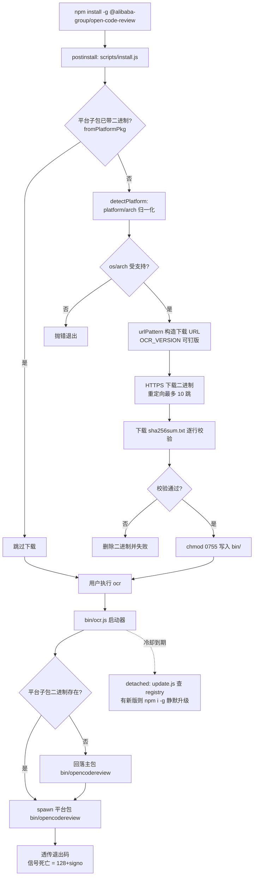
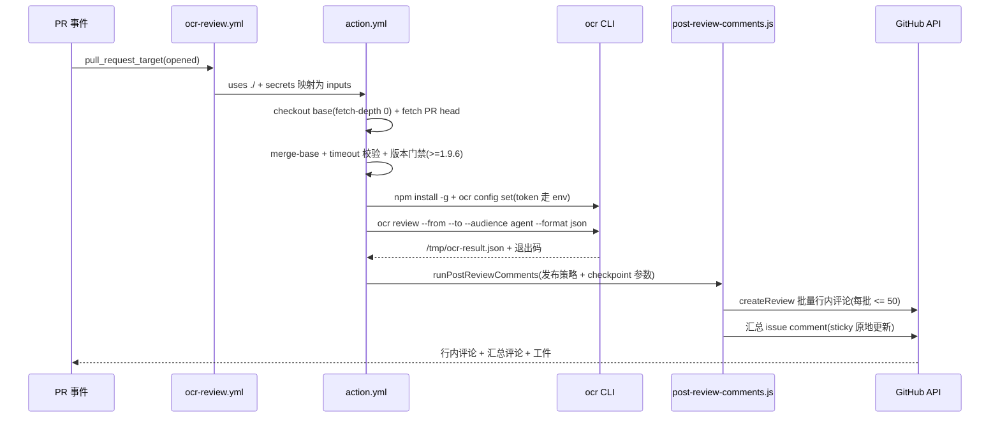
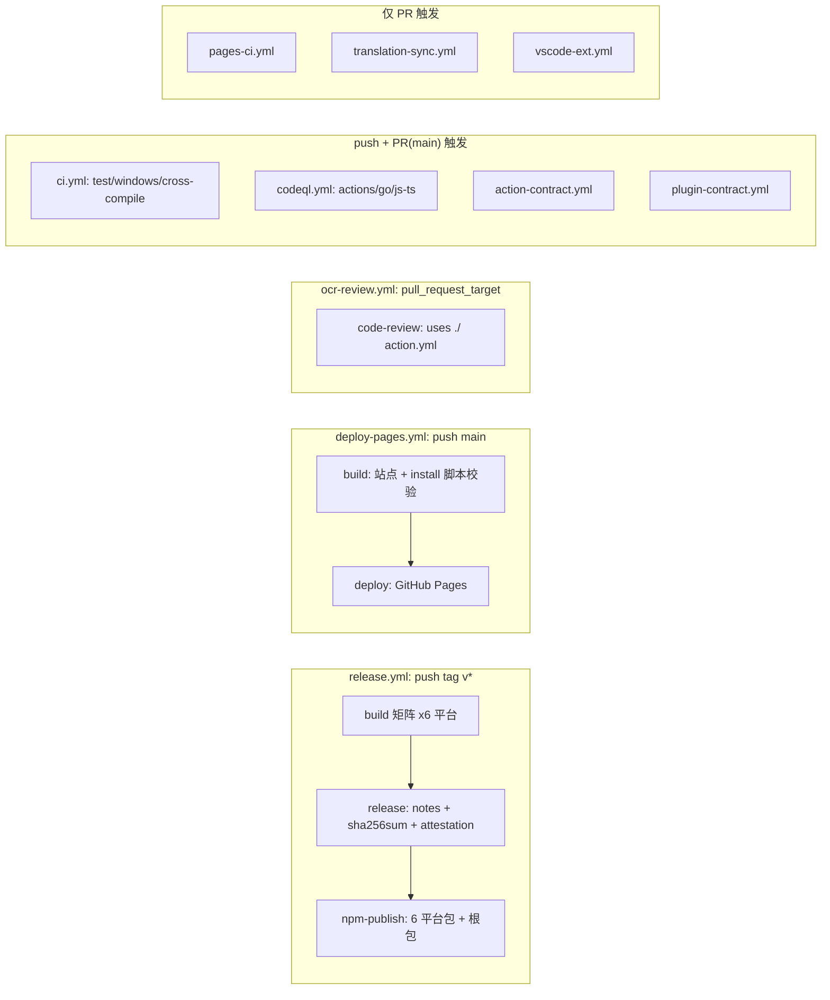
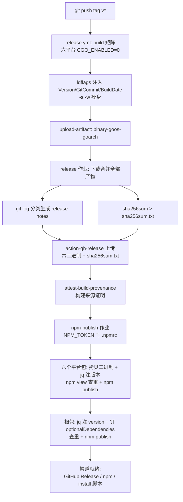

# 分发、发布与 CI

> **关联源码**：`bin/`、`npm/`、`scripts/`、`action.yml`、`.github/workflows/`、`install.sh`、`install.ps1`
> **前置阅读**：[00-overview.md](00-overview.md)

## 目录

- [1. 分发渠道矩阵](#1-分发渠道矩阵)
- [2. npm 包装机制](#2-npm-包装机制)
- [3. 安装脚本 install.sh 与 install.ps1](#3-安装脚本-installsh-与-installps1)
- [4. GitHub Action：action.yml 契约与 PR 评论引擎](#4-github-actionactionyml-契约与-pr-评论引擎)
- [5. CI 工作流逐个走读](#5-ci-工作流逐个走读)
- [6. 发布流水线](#6-发布流水线)
- [7. 第三方 CI 集成示例](#7-第三方-ci-集成示例)
- [8. 源文件覆盖清单](#8-源文件覆盖清单)

---

## 1. 分发渠道矩阵

OCR 是 Go 单二进制工具，但对外分发并非"只有二进制"。仓库同时维护四条（外加一条消费侧）分发通道，覆盖从"本机开发者"到"无 Node 的服务器"再到"PR 自动审查"的全部场景：

| 渠道 | 入口 | 适用场景 | 核心机制 |
|---|---|---|---|
| npm 主包 | `npm install -g @alibaba-group/open-code-review` | 开发者本机、所有 CI 示例 | JS 启动器 + `postinstall` 下载或平台子包直供二进制（见第 2 章） |
| GitHub Release 二进制 | `opencodereview-<os>-<arch>[.exe]` + `sha256sum.txt` | 直接下载、脚本安装的数据源 | tag 触发流水线产出六平台资产（见第 6 章） |
| install 脚本 | `curl -fsSL https://open-codereview.ai/install.sh \| sh`、`irm https://open-codereview.ai/install.ps1 \| iex` | 无 Node/npm 环境的 Linux/macOS/Windows | 脚本从 GitHub Release 下载并校验（见第 3 章），由文档站托管 |
| 从源码构建 | `go build ./cmd/opencodereview`、`make build` | 贡献者、自定义构建 | Go 1.26，`CGO_ENABLED=0` 纯静态（见 6.5） |
| （消费侧）GitHub Action | `uses: alibaba/open-code-review@main` | 在 PR 上自动跑审查 | 复合 action 内部执行 `npm install -g`（见第 4 章） |

几个贯穿性的版本策略值得先说明：

- **占位版本号**：根 [package.json](../../package.json#L3) 与六个 [npm/](../../npm/darwin-arm64/package.json#L3) 平台子包的 `version` 字段在仓库里都是占位符 `0.0.0`，真实版本在发布时由流水线从 git tag 注入（[release.yml](../../.github/workflows/release.yml#L191) 与 [publish.sh](../../scripts/publish/publish.sh#L198)）。
- **双下载源**：npm 主包的 [ocrConfig.urlPattern](../../package.json#L29-L32) 指向 GitHub Release——即使走 npm 安装，`postinstall` 也可能从 Release 下载二进制（当平台子包不可用时，见 2.4）。
- **命名一致性被测试锁定**：[internal/release/asset_naming_test.go](../../internal/release/asset_naming_test.go#L62-L189) 用四个测试锁住 `package.json` 的 URL 模板、[release.yml](../../.github/workflows/release.yml#L48) 的产物名、[Makefile](../../Makefile#L25-L29) 的构建输出名三者必须逐字一致，防止"改了一处、install 404"的回归。

## 2. npm 包装机制

### 2.1 根 package.json：一个纯 JS 的"壳"

根 [package.json](../../package.json) 是 npm 主包 `@alibaba-group/open-code-review` 的清单，其关键设计：

- `bin` 字段把 `ocr` 命令映射到 [bin/ocr.js](../../bin/ocr.js)（[L5-L7](../../package.json#L5-L7)）；
- `files` 只打包启动器与四个安装/更新脚本加图标目录（[L8-L15](../../package.json#L8-L15)）——**二进制不在主包里**；
- `postinstall` 钩子执行 `node scripts/install.js`（[L17](../../package.json#L17)），负责把二进制就位；
- `ocrConfig` 声明二进制与校验和的下载 URL 模板（[L29-L32](../../package.json#L29-L32)）：

  ```
  https://github.com/alibaba/open-code-review/releases/download/v{version}/opencodereview-{os}-{arch}
  https://github.com/alibaba/open-code-review/releases/download/v{version}/sha256sum.txt
  ```

- `optionalDependencies` 声明六个平台子包 `@alibaba-group/ocr-<platform>-<arch>`（[L33-L40](../../package.json#L33-L40)），npm 会按当前机器的 os/cpu 只安装匹配的一个；
- `engines` 要求 Node >= 14（[L41-L43](../../package.json#L41-L43)），安装脚本只用了 Node 内建模块，无任何运行时依赖。

### 2.2 bin/ocr.js：启动器的三件事

[bin/ocr.js](../../bin/ocr.js) 是 `ocr` 命令的实际入口，除转发参数外只做三件事：

1. **定位二进制**：调用 `resolveNativeBinary()`（[L35](../../bin/ocr.js#L35)），找不到时报错并提示重装（[L37-L39](../../bin/ocr.js#L37-L39)）。
2. **展示升级提示**：读取 `~/.opencodereview/update-available` hint 文件，若其中版本高于当前包版本，向 stderr 打印黄色的升级命令；否则删掉过期 hint（[L44-L55](../../bin/ocr.js#L44-L55)）。
3. **后台自更新检查**：除非设置了 `OCR_NO_UPDATE`，以 `~/.opencodereview/last-update-check` 的 mtime 做冷却（默认 18 分钟，`OCR_UPDATE_INTERVAL` 以分钟为单位，[L60-L61](../../bin/ocr.js#L60-L61)），到期就 detached 启动 [scripts/update.js](../../scripts/update.js) 并立即 `unref`，不阻塞审查（[L69-L77](../../bin/ocr.js#L69-L77)）。

真正执行时用 `spawnSync` 把 argv 原样透传给原生二进制（[L80-L83](../../bin/ocr.js#L80-L83)）。退出码处理是启动器里最讲究的一处：`launcherExitCode`（[L21-L26](../../bin/ocr.js#L21-L26)）确保被信号杀死的子进程（status 为 null）不会回落成 0，而是按惯例返回 `128 + signo`——否则以退出码做门禁的 CI 会把 OOM 误读为审查成功。[bin/ocr.test.js](../../bin/ocr.test.js#L12-L33) 用断言锁死了这一语义（`npm run test:launcher`）。

### 2.3 scripts/platform.js：平台探测与二进制定位

[scripts/platform.js](../../scripts/platform.js) 是所有 JS 侧代码共享的平台解析层：

- 常量 `IS_WINDOWS` 与 `BINARY_FILENAME`（Windows 下为 `opencodereview.exe`，其余为 `opencodereview`，[L9-L10](../../scripts/platform.js#L9-L10)）；
- `PLATFORM_PKG` 硬编码六平台到子包名的映射（[L12-L19](../../scripts/platform.js#L12-L19)）；
- `getPlatformPackageName()`（[L21-L37](../../scripts/platform.js#L21-L37)）优先读根 package.json 的 `optionalDependencies`，用"包名以 `-${platform}-${arch}` 结尾"做匹配（例如 `@alibaba-group/ocr-linux-x64` 匹配 `linux-x64`），这样即使未来改包名也不必同步改脚本；读不到时回落到硬编码表；
- `resolveNativeBinary()`（[L39-L61](../../scripts/platform.js#L39-L61)）的查找顺序：
  1. **平台子包优先**：`require.resolve("<pkg>/package.json")` 拿到子包目录，检查 `<pkg>/bin/opencodereview[.exe]` 是否存在，存在则返回 `fromPlatformPkg: true`；
  2. **legacy 回落**：主包自身的 `bin/opencodereview[.exe]`（[L55-L58](../../scripts/platform.js#L55-L58)）——这正是 `postinstall` 下载器落盘的位置。

### 2.4 scripts/install.js：postinstall 下载器

[scripts/install.js](../../scripts/install.js) 在 `npm install` 后把二进制就位，流程：

1. **平台子包短路**：若 `resolveNativeBinary()` 已从平台子包找到二进制，直接跳过下载（[L160-L165](../../scripts/install.js#L160-L165)）——这是 npm 安装在"平台子包可用"时的正常路径，全程不联网。
2. **平台检测**：`detectPlatform()` 把 `process.arch` 的 `x64` 归一化为 `amd64`、`win32` 归一化为 `windows`，不支持的平台直接抛错（[L31-L62](../../scripts/install.js#L31-L62)）。
3. **版本解析**：`OCR_VERSION` 环境变量可钉版本（剥离 `v` 前缀），否则用 package.json 的版本（[L75-L85](../../scripts/install.js#L75-L85)）。
4. **下载**：`download()` 拒绝一切非 HTTPS URL、最多跟随 10 次重定向（[L94-L116](../../scripts/install.js#L94-L116)）；Windows 产物追加 `.exe` 后缀（[L191-L193](../../scripts/install.js#L191-L193)）；下载后 `chmod 0755`（[L197-L199](../../scripts/install.js#L197-L199)）。
5. **sha256 校验**：下载 `sha256sum.txt`，逐行寻找包含 `-{os}-{arch}` 的条目，与本地 `crypto.createHash("sha256")` 计算值比对；校验失败、找不到条目、甚至校验文件下载失败，都会**删除已下载的二进制**并中止安装（[L201-L243](../../scripts/install.js#L201-L243)）——宁可安装失败也不留下未验证的二进制。

### 2.5 六个平台子包

[npm/](../../npm) 下每个目录一个 `package.json`，内容同构，以 [darwin-arm64](../../npm/darwin-arm64/package.json) 为例：

```json
{
  "name": "@alibaba-group/ocr-darwin-arm64",
  "os": ["darwin"],
  "cpu": ["arm64"],
  "files": ["bin/"],
  "preferUnplugged": true
}
```

- `os`/`cpu` 字段让 npm/yarn 在不匹配的机器上自动跳过安装（optionalDependencies 不报错）；
- `files: ["bin/"]` 表示包内只有 `bin/opencodereview` 一个二进制；
- `preferUnplugged: true` 强制实体安装到 node_modules（防 Yarn PnP 把二进制留在 zip 里导致路径探测失败）。

六平台目录与 Node 的 `<process.platform>-<process.arch>` 命名一致：darwin-arm64、darwin-x64、linux-arm64、linux-x64、win32-arm64、win32-x64。注意这里的 `x64` 与 Release 资产命名里的 `amd64` 不同——npm 包目录名用 Node 术语，Release 二进制用 Go 术语，两套名字的映射关系固定写在发布流水线里（见 6.3）。

### 2.6 update.js 与 version.js：静默自更新机制

[scripts/update.js](../../scripts/update.js) 是被启动器 detached 拉起的后台更新器，全部状态放在 `~/.opencodereview/` 下：`last-update-check`（冷却时间戳）、`update.lock`（并发锁）、`update-available`（升级提示）（[L18-L21](../../scripts/update.js#L18-L21)）。

执行流程（`main()`，[L128-L168](../../scripts/update.js#L128-L168)）：

1. 更新冷却时间戳，随后 `acquireLock()` 以 `wx` 标志独占创建锁文件；若锁已存在则读取其中的 PID，用 `process.kill(pid, 0)` 探测属主是否存活，死进程的陈旧锁会被清掉重试（[L35-L56](../../scripts/update.js#L35-L56)）。
2. `getInstalledVersion()` 直接 `spawn` 原生二进制执行 `ocr version`（3 秒超时），用 [version.js](../../scripts/version.js) 的 `parseVersionOutput` 从输出中提取 `v` 前缀版本（[L64-L74](../../scripts/update.js#L64-L74)、[version.js L9-L14](../../scripts/version.js#L9-L14)）。
3. `fetchLatestVersion()` 向 registry（`publishConfig.registry`，默认 `https://registry.npmjs.org`）请求 `/<pkg>/latest`（[L76-L114](../../scripts/update.js#L76-L114)）。
4. 用 `semverGt` 比较（忽略 build 元数据；无预发布版本大于有预发布版本，[version.js L16-L31](../../scripts/version.js#L16-L31)）。若 registry 无更新，删除 hint 后退出。
5. **若有更新：直接执行 `npm i -g <pkg>@<latest>`（120 秒超时）完成静默升级**（[L151-L157](../../scripts/update.js#L151-L157)）；成功则清 hint，失败则把 `{version, pkg}` 写入 hint 文件（[L159-L163](../../scripts/update.js#L159-L163)），此时下次启动 `ocr` 会看到 2.2 中的黄色升级提示。

也就是说 OCR 具备**自动静默升级**能力：默认每 18 分钟最多检查一次，检查即升级；`OCR_NO_UPDATE=1` 完全关闭。`shouldShowUpdateHint`（[version.js L33-L38](../../scripts/version.js#L33-L38)）供启动器复用同一比较逻辑，`npm run test:update`（[scripts/version.test.js](../../scripts/version.test.js)）覆盖其单元行为。

**图 15-1**：npm 安装与启动决策流



## 3. 安装脚本 install.sh 与 install.ps1

两个脚本是"无 Node 环境"的安装通道，逻辑高度对称：检测平台 → 解析版本 → 构造 Release 下载 URL → sha256 校验 → 安装到本机目录 → PATH 提示。

### 3.1 install.sh（POSIX sh）

[install.sh](../../install.sh) 的走读要点：

- **环境变量**：`OCR_INSTALL_DIR`（默认 `/usr/local/bin`）、`OCR_VERSION`（默认 latest）、`OCR_GITHUB_MIRROR`（镜像域名）（[L11-L21](../../install.sh#L11-L21)）；唯一硬依赖是 `curl`（[L22](../../install.sh#L22)）。
- **平台检测**：`uname -s` 接受 darwin/linux（其余提示改用 install.ps1），`uname -m` 把 `x86_64/amd64` 归一为 `amd64`、`arm64/aarch64` 归一为 `arm64`（[L24-L35](../../install.sh#L24-L35)）。
- **版本解析**：未钉版本时请求 `api.github.com/repos/.../releases/latest`，用 `sed` 提取 `tag_name`（[L37-L43](../../install.sh#L37-L43)）。
- **镜像支持**：`OCR_GITHUB_MIRROR` 剥离协议与尾部斜杠、拒绝含空格的值，拼成 `https://<mirror>/github.com/<repo>/releases/download/<tag>`，并在 stderr 明确警告"非官方镜像不保证校验完整性"（[L46-L56](../../install.sh#L46-L56)）。
- **下载与校验**：资产名 `opencodereview-<os>-<arch>`（[L45](../../install.sh#L45)）；二进制与 `sha256sum.txt`（连接超时 5s、总超时 15s）分别下载（[L60-L64](../../install.sh#L60-L64)）；`awk` 按**文件名精确匹配**（`$2 == a`）取期望哈希（[L66-L67](../../install.sh#L66-L67)），本地哈希优先用 macOS 的 `shasum`、否则 Linux 的 `sha256sum`（[L68-L69](../../install.sh#L68-L69)、[L104-L113](../../install.sh#L104-L113)）。
- **安装与提权**：`install -m 0755` 安装；目标目录不可写时才用 `sudo` 提权（同样走 `sudo install` 让二进制归 root）；无 sudo 则报错引导用户改 `OCR_INSTALL_DIR`（[L79-L92](../../install.sh#L79-L92)）。
- **PATH 提示**：安装目录不在 PATH 时提示加入；在 PATH 但当前 shell 解析不到时提示开新终端（[L94-L102](../../install.sh#L94-L102)）。
- 临时目录用 `mktemp -d` + `trap` 保证任何退出路径都清理（[L57-L58](../../install.sh#L57-L58)）。

### 3.2 install.ps1（Windows PowerShell）

[install.ps1](../../install.ps1) 与 shell 版逐项对应，Windows 特有之处：

- **架构检测**：读 `PROCESSOR_ARCHITECTURE`，正则映射 `AMD64/X64/x86_64 → amd64`、`ARM64/aarch64 → arm64`（[L17-L27](../../install.ps1#L17-L27)）。
- **默认安装位置**：`$env:LOCALAPPDATA\Programs\ocr`（用户级，无需管理员权限），文件名 `ocr.exe`（[L93-L101](../../install.ps1#L93-L101)）。
- **TLS 兼容**：为 PowerShell 5.1 显式开启 TLS 1.2（PS 7 已默认）（[L85-L91](../../install.ps1#L85-L91)）。
- **校验与安装**：`Get-ChecksumFromFile` 按文件名取期望哈希（[L45-L54](../../install.ps1#L45-L54)），`Get-FileHash -Algorithm SHA256` 计算后大小写不敏感比对（[L142-L149](../../install.ps1#L142-L149)）；`Copy-Item -Force` 安装（[L56-L64](../../install.ps1#L56-L64)）。
- **PATH 检查**：对 PATH 各段做大小写不敏感、尾部反斜杠归一后的比较（[L66-L83](../../install.ps1#L66-L83)）。

### 3.3 脚本的分发托管

两个脚本的推荐入口是 `https://open-codereview.ai/install.sh|install.ps1`（[install.sh L7](../../install.sh#L7)、[install.ps1 L2](../../install.ps1#L2)）。这个 URL 由 [deploy-pages.yml](../../.github/workflows/deploy-pages.yml) 保障：文档站构建时把仓库根的 `install.sh`/`install.ps1` 原样复制进 `_site`（[L43-L49](../../.github/workflows/deploy-pages.yml#L43-L49)），并用 `sh -n` 语法检查加 `cmp` 字节级比对确保站点上的脚本与仓库一致（[L51-L57](../../.github/workflows/deploy-pages.yml#L51-L57)）；且 `install.sh`、`install.ps1` 的变更会触发站点重新部署（[L6-L9](../../.github/workflows/deploy-pages.yml#L6-L9)）。

## 4. GitHub Action：action.yml 契约与 PR 评论引擎

### 4.1 定位

[action.yml](../../action.yml) 定义了一个 `using: composite` 的复合 Action（[L230-L232](../../action.yml#L230-L232)），名称 "OpenCodeReview PR Review"。它是官方对外的 PR 自动审查产品：外部仓库 `uses: alibaba/open-code-review@main`，本仓库自己的 [ocr-review.yml](../../.github/workflows/ocr-review.yml) 也用它做 dogfooding。全部逻辑（装 CLI、跑审查、发评论）都在这个文件与其调用的 [post-review-comments.js](../../scripts/github-actions/post-review-comments.js) 里。

### 4.2 inputs 契约

必填 4 项（[L11-L26](../../action.yml#L11-L26)）：`llm_url`、`llm_auth_token`、`llm_model`、`llm_use_anthropic`（前三个映射为 `OCR_LLM_URL`/`OCR_LLM_TOKEN`/`OCR_LLM_MODEL` 环境变量，第四个归一化后映射 `OCR_USE_ANTHROPIC`）。可选输入按用途分四组：

| 分组 | 输入 | 默认 | 说明（行号） |
|---|---|---|---|
| LLM | `llm_auth_header`、`llm_extra_headers` | 空 | 自定义鉴权头与附加头（[L27-L32](../../action.yml#L27-L32)） |
| LLM | `llm_extra_body` | `'{"thinking": {"type": "disabled"}}'` | 无环境变量等价物，经 `ocr config set llm.extra_body` 写入（[L33-L38](../../action.yml#L33-L38)） |
| LLM | `language`、`llm_timeout` | `English`、`300` | 输出语言与单请求超时秒数（[L39-L48](../../action.yml#L39-L48)） |
| 行为 | `review_task_timeout`、`review_concurrency`、`background`、`rule` | `15` 分钟、空 | 透传给 `ocr review` 的 `--timeout/--concurrency/--background/--rule`（[L49-L69](../../action.yml#L49-L69)） |
| 行为 | `ocr_version`、`node_version`、`github_token` | `latest`、`24`、`github.token` | CLI 版本 spec（要求 v1.9.6+）、setup-node 版本、发评论用的 token（[L53-L60](../../action.yml#L53-L60)、[L157-L160](../../action.yml#L157-L160)） |
| 发布策略 | `sticky_summary`、`incremental`、`incremental_overlap_threshold`、`review_comment_batch_size` | `true`、`false`、`0.6`、`50` | 汇总评论原地更新 / 增量跳过重叠评论（IoU 阈值）/ 单次 createReview 批量上限（[L77-L106](../../action.yml#L77-L106)） |
| 发布策略 | `route_severity_below`、`route_categories` | 空 | 按严重度/类别把行内评论改投汇总（fail-open，不丢发现）（[L107-L129](../../action.yml#L107-L129)） |
| checkpoint | `checkpoint_range`、`full_review`、`base_ref`、`head_sha` | `false`、`false`、空 | 跨 push 检查点增量审查；后两项供 issue_comment 等非 PR 事件显式指定范围（[L130-L156](../../action.yml#L130-L156)） |
| 产物 | `upload_artifacts` | `'true'` | 必须是**带引号的字符串** `'true'/'false'`——步骤按字符串比较，YAML 裸布尔不会命中（[L70-L76](../../action.yml#L70-L76)） |

### 4.3 outputs 契约

三类输出（[L162-L228](../../action.yml#L162-L228)）：评论计数（`comments_total/inline/skipped/routed/failed`，其中 routed 与 inline/skipped/failed 互斥）、`summary_comment_url`，以及 checkpoint 系列可观测性输出（`range_mode/range_summary/range_reason/range_from/range_to/checkpoint_before/ancestry/source_run/checkpoint_after`），全部来自 `range` 与 `post` 两个步骤的 step outputs。

### 4.4 执行步骤走读

| # | 步骤 | 要点（行号） |
|---|---|---|
| 1 | Check git and Node.js | 探测已有工具，输出 `*_installed` 标志（[L233-L250](../../action.yml#L233-L250)） |
| 2 | Install git | 缺失时按 apt/brew/yum/apk 顺序兜底安装（[L252-L269](../../action.yml#L252-L269)） |
| 3 | Setup Node.js | 缺 Node 时 setup-node，**SHA 固定** `actions/setup-node@8207627...# v7.0.0`（[L271-L275](../../action.yml#L271-L275)） |
| 4 | Resolve PR refs | `base_ref`/`head_sha` 输入优先，事件字段兜底，写入 `GITHUB_ENV`（[L277-L290](../../action.yml#L277-L290)） |
| 5 | Checkout base | **checkout 的是可信基线而非 PR head**（fetch-depth: 0），PR 的 blob 由下一步单独 fetch、不落工作区（[L292-L299](../../action.yml#L292-L299)）——`pull_request_target` 语境下的安全设计 |
| 6 | Fetch PR head (fork-safe) | `git fetch origin pull/<n>/head`，支持 fork PR（[L301-L309](../../action.yml#L301-L309)） |
| 7 | Compute merge-base | `git merge-base origin/<base> <head>`，失败回落 head 自身（[L311-L317](../../action.yml#L311-L317)） |
| 8 | Validate review_task_timeout | 正则校验 1-120 的十进制整数（含前导零归一）（[L319-L341](../../action.yml#L319-L341)） |
| 9 | Install OpenCodeReview | `npm install -g @alibaba-group/open-code-review@<ocr_version>`；**版本门禁**：解析 `ocr version` 首行，必须 >= v1.9.6 且不接受预发布版本；实际版本写入 `OCR_VERSION_ACTUAL` 供 checkpoint 指纹使用（[L343-L376](../../action.yml#L343-L376)） |
| 10 | Configure OCR | 一串 `ocr config set`：先 unset provider、清空 auth_token/extra_headers/retry_codes，再写 url/model/protocol 等；**token 通过 `llm.auth_token_cmd 'printf "%s" "$OCR_LLM_TOKEN"'` 注入**——密钥只存在于步骤环境变量，不落配置文件（[L378-L410](../../action.yml#L378-L410)）；`llm_use_anthropic` 做大小写不敏感归一（空/true/1/yes → anthropic）（[L388-L398](../../action.yml#L388-L398)） |
| 11 | Resolve review range | 仅 `checkpoint_range == 'true'` 时运行；github-script 内联脚本计算配置指纹并调用辅助模块的 `resolveCheckpointRange`（见 4.5） |
| 12 | Run OpenCodeReview | `ocr review --from ${RANGE_FROM:-$MERGE_BASE} --to $HEAD_SHA --audience agent --format json --timeout <N>`，可选拼 `--concurrency/--background/--rule`；stdout/stderr 落 `/tmp/ocr-result.json`、`/tmp/ocr-stderr.log`；退出码写 `GITHUB_ENV`（[L645-L680](../../action.yml#L645-L680)） |
| 13 | Upload review artifacts | `always()` 且字符串比较 `upload_artifacts == 'true'`；artifact 名含 run_id 与 run_attempt（[L682-L690](../../action.yml#L682-L690)） |
| 14 | Fail job on OCR error | 退出码非 0 时以原码失败（[L692-L697](../../action.yml#L692-L697)） |
| 15 | Post review comments | 退出码为 0 才运行；github-script 定位并 `require` 辅助模块（先查 `GITHUB_ACTION_PATH` 再查 `GITHUB_WORKSPACE`，兼容容器化自托管场景），调用 `runPostReviewComments` 传入全部发布策略与 checkpoint 参数（[L699-L760](../../action.yml#L699-L760)） |

第 11 步的**配置指纹**是 checkpoint 功能的信任根基：对 `[llm_url, model, use_anthropic, language, extra_body, auth_header, llm_timeout, extra_headers摘要, rule路径, 路由两项, background, OCR实际版本, rule文件内容摘要, .opencodereview/rule.json摘要]` 这一 JSON 数组做 SHA-256 并截取 16 hex（[L573-L592](../../action.yml#L573-L592)）。用 JSON 数组而非拼接字符串是为了长度定界，防注入式碰撞；extra_headers 与规则文件按内容摘要进入指纹（值可能是凭据或大文件）；OCR 版本取不到时指纹为空——空指纹匹配不了任何存量 checkpoint，也不会被写入（fail-closed）。祖先判定直接 `git merge-base --is-ancestor`，只有返回码为字面 0 才算 ancestor（[L598-L599](../../action.yml#L598-L599)）。

### 4.5 post-review-comments.js：评论发布引擎

[post-review-comments.js](../../scripts/github-actions/post-review-comments.js)（约 2600 行，零外部依赖，仅 Node 内建 `crypto`）是 PR 评论的唯一实现，被 action.yml 的两个 github-script 步骤共享。主入口 `runPostReviewComments`（[L69-L105](../../scripts/github-actions/post-review-comments.js#L69-L105)）的流水：

1. **读结果**：解析 `/tmp/ocr-result.json`，取 `comments`/`warnings`/`message`/`manifest`（[L220-L244](../../scripts/github-actions/post-review-comments.js#L220-L244)）；解析失败时把 stderr 以 fenced block 发成错误汇总评论（[L225-L239](../../scripts/github-actions/post-review-comments.js#L225-L239)）；零评论发"Looks good"（[L246-L255](../../scripts/github-actions/post-review-comments.js#L246-L255)）。
2. **三分区**：每条评论按 `start_line >= 1 || end_line >= 1` 判定有无行信息（[L288](../../scripts/github-actions/post-review-comments.js#L288)）——无行的进 `commentsWithoutLine`（原因 `NO_LINE_REASON`）；有行但被 `buildPolicy`/`routeComment` 发布策略命中的进 `commentsRouted`（fail-open：解析出问题一律退化为 `NO_ROUTING` 不路由，[L67](../../scripts/github-actions/post-review-comments.js#L67)、[L283-L299](../../scripts/github-actions/post-review-comments.js#L283-L299)）；其余构造 `reviewComment`，多行评论用 `start_line`+`line` 双字段并固定 `side: RIGHT` 锚定到 diff 新侧（[L303-L314](../../scripts/github-actions/post-review-comments.js#L303-L314)）。
3. **增量过滤**：`incremental` 开启时列出既有 review comments，过滤出本机器人（`isBotComment` + `getAuthenticatedLogin`）发出的历史，按 `overlapsHistory` 的 IoU 阈值（默认 0.6）跳过重叠项——历史永不删除（[L318-L333](../../scripts/github-actions/post-review-comments.js#L318-L333)）。
4. **汇总锚点**：在发 review **之前**先创建汇总 issue comment（含"Posting…"占位正文），利用 GitHub 时间线旧评论在前的排序把汇总钉在 review 之上；后续只原地更新（[L335-L357](../../scripts/github-actions/post-review-comments.js#L335-L357)）。
5. **批量发布**：确定性排序（`sortToSendDeterministically`：path → start_line → end_line → 原始序）后按 `resolveBatchSize`（默认 50，来自"生产曾在一次 71 条时失败"的教训，[L34-L40](../../scripts/github-actions/post-review-comments.js#L34-L40)）切块，逐块 `publishBatch`（[L359-L402](../../scripts/github-actions/post-review-comments.js#L359-L402)）。
6. **publishBatch 的失败路径**（[L478-L639](../../scripts/github-actions/post-review-comments.js#L478-L639)）：
   - 单块一次 `pulls.createReview(event: COMMENT, commit_id: head)`（[L496-L504](../../scripts/github-actions/post-review-comments.js#L496-L504)）；
   - 失败后先 `cooldownAndReconcile`：按 `retry-after`/`x-ratelimit-*` 头退避（[L519-L523](../../scripts/github-actions/post-review-comments.js#L519-L523) 的 `OCR_MAX_RETRIES` 等环境旋钮），并对"可能已落地"的请求做**幂等对账**——每条评论体内嵌随机 HTML 注释 id（[L272-L276](../../scripts/github-actions/post-review-comments.js#L272-L276)），重试前先查服务端是否已有该 id，避免 5xx 假失败导致重复发帖；
   - **422 行解析回退**：仅当确认是行/diff 校验失败时，拉取 PR diff hunks 对每条评论做三态分类（`classifyCommentAgainstDiff`）：可证在 diff 外的直接降级进汇总，可证在内的二次成批发送，判不清的走单条重试（[L556-L639](../../scripts/github-actions/post-review-comments.js#L556-L639)）。
7. **汇总定稿**：`buildSummaryBody` 输出五计数（inline/summary/routed/skipped/failed，互斥且合计为 total，[L1707-L1728](../../scripts/github-actions/post-review-comments.js#L1707-L1728)），随后追加无行、被路由、发送失败评论的完整渲染（`formatCommentMarkdown`：徽章 + `### 📄 <path>` 标题 + 折叠的 Before/After 建议，[L1665-L1690](../../scripts/github-actions/post-review-comments.js#L1665-L1690)），sticky 模式原地更新锚点评论（[L411-L459](../../scripts/github-actions/post-review-comments.js#L411-L459)）。
8. **checkpoint 写路径**：`buildAdvanceMarker` 只有在"manifest `terminal_state == complete`、零发送失败、指纹非空、resolved_head 为 40 位 hex"全部满足时才把新检查点（形如 `<!-- ocr-checkpoint:v1 <base64> -->`，[L2279](../../scripts/github-actions/post-review-comments.js#L2279)）追加进汇总正文；否则原样携带上一轮 marker（carry-forward），保证失败运行既不跳过未审区间、也不重置检查点（[L156-L195](../../scripts/github-actions/post-review-comments.js#L156-L195)）。`resolveCheckpointRange`（[L2481-L2576](../../scripts/github-actions/post-review-comments.js#L2481-L2576)）是读取侧的判定器，一切可疑（无汇总、作者未验证、schema 无效、base 变更、指纹变更、非祖先、对象未知、resolver 出错）都返回 `mode: full` 的全量审查；唯一非回退分支是 `same_head_noop`——同 head 重跑不重写汇总（[L214-L218](../../scripts/github-actions/post-review-comments.js#L214-L218)）。完整原因表见 [examples/github_actions/README.md](../../examples/github_actions/README.md#L214-L233)。

**图 15-2**：GitHub Action 事件流



## 5. CI 工作流逐个走读

### 5.0 总览

`.github/workflows/` 下共 10 个工作流：

| # | 工作流 | 文件 | 触发 | 作业 | 依赖 secret |
|---|---|---|---|---|---|
| 1 | CI | [ci.yml](../../.github/workflows/ci.yml) | push/PR 到 main（忽略 md/LICENSE/.gitignore） | test、windows、cross-compile | 无 |
| 2 | Release | [release.yml](../../.github/workflows/release.yml) | push tag `v*` | build → release → npm-publish | `NPM_TOKEN` |
| 3 | CodeQL Advanced | [codeql.yml](../../.github/workflows/codeql.yml) | push/PR main + 周五 cron | analyze 矩阵 | 无 |
| 4 | Deploy Pages | [deploy-pages.yml](../../.github/workflows/deploy-pages.yml) | push main（pages/**、install.*、本文件）+ manual | build → deploy | 无（Pages 环境） |
| 5 | Pages CI | [pages-ci.yml](../../.github/workflows/pages-ci.yml) | PR（pages/**） | check | 无 |
| 6 | OpenCodeReview PR Review | [ocr-review.yml](../../.github/workflows/ocr-review.yml) | `pull_request_target: opened` | code-review | `OCR_LLM_URL/AUTH_TOKEN/MODEL/USE_ANTHROPIC` |
| 7 | translation-sync | [translation-sync.yml](../../.github/workflows/translation-sync.yml) | PR（README*.md、docs、检查器） | translation-sync | 无 |
| 8 | VS Code Extension | [vscode-ext.yml](../../.github/workflows/vscode-ext.yml) | PR（extensions/vscode/**） | check | 无 |
| 9 | plugin-contract | [plugin-contract.yml](../../.github/workflows/plugin-contract.yml) | push/PR main（插件清单、skills、文档） | plugin-contract | 无 |
| 10 | Action Contract | [action-contract.yml](../../.github/workflows/action-contract.yml) | push/PR main（action.yml、package.json、scripts/github-actions、示例 README） | action-contract | 无 |

几个横切模式：

- **自托管 runner + 容器固定环境**：除 windows/codeql 外几乎全部 `runs-on: self-hosted` + 容器（`golang:1.26.6`、`node:24`、`node:24.18.0`、`node:24.4.1`、`ubuntu:24.04`），并统一执行 `git config --global --replace-all safe.directory '*'` 消除容器内 "dubious ownership"。
- **paths 过滤 + 分流**：契约/翻译类检查独立成 workflow 而非塞进 ci.yml，注释明确说明理由——"慢容器拉取不应拖慢核心 CI 反馈"（[plugin-contract.yml L3-L5](../../.github/workflows/plugin-contract.yml#L3-L5)）。
- **concurrency 取消旧跑**：多数 workflow 有 `cancel-in-progress: true` 的并发组；codeql 刻意设为 `false`（[L22-L24](../../.github/workflows/codeql.yml#L22-L24)）。
- **权限最小化**：默认 `contents: read`，只有 release（write + id-token + attestations）与 deploy-pages（pages:write + id-token）例外。

**图 15-3**：workflow 作业依赖关系（发布链路与检查类分组）



除 release 与 deploy-pages 两条链外，各 workflow 之间无依赖、各自独立触发。

### 5.1 ci.yml：核心 Go CI

[test 作业](../../.github/workflows/ci.yml#L25-L113)在 `golang:1.26.6` 容器（2 CPU、15 分钟超时）里按顺序执行：license 头校验（[verify-license.sh](../../scripts/verify-license.sh)）→ **action 引用 SHA 固定校验**（[verify-action-pins.sh](../../scripts/verify-action-pins.sh)，见 4.4）→ 源码英文-only 校验（[verify-english-only.go](../../scripts/verify-english-only.go)）→ gofmt 检查 → 行尾 LF 检查（`git add --renormalize .` 后必须无 diff，[L56-L63](../../.github/workflows/ci.yml#L56-L63)）→ go mod tidy 检查 → vet → govulncheck（固定 v1.6.0，[L76-L79](../../.github/workflows/ci.yml#L76-L79)）→ `go test -race -count=1` 带覆盖率 → **覆盖率 90% 门槛**（[L86-L94](../../.github/workflows/ci.yml#L86-L94)）→ build → 冒烟测试（`--version` 含 "open-code-review"、`--help` 列全 review/scan/delegate/config/llm/viewer/session/rules 八个命令，[L99-L113](../../.github/workflows/ci.yml#L99-L113)）。

[windows 作业](../../.github/workflows/ci.yml#L120-L162)在 `windows-latest` 原生跑（GitHub 不支持 Windows 容器）：vet、`go test -count=1`（无 -race——竞态与 OS 无关且 Windows 缺 C 工具链；也无覆盖率门槛）、build、共享的 bash 冒烟脚本。

[cross-compile 作业](../../.github/workflows/ci.yml#L164-L190)用矩阵构建 5 个非本机平台（linux/arm64、darwin/amd64、darwin/arm64、windows/amd64、windows/arm64；本机 linux/amd64 已被 test 作业的 build 覆盖），`CGO_ENABLED=0 go build -o /dev/null` 只验证可编译。

### 5.2 release.yml：发布流水线

见[第 6 章](#6-发布流水线)完整走读。概要：tag `v*` 触发，build 矩阵六平台交叉编译 → release 作业生成分类 release notes、sha256sum、创建 GitHub Release 并做构建来源证明 → npm-publish 作业发布六个平台子包与根包，全部依赖 secret `NPM_TOKEN`，且以 `npm view` 查重实现可重跑。

### 5.3 codeql.yml：安全扫描

标准 CodeQL Advanced 模板：push/PR main 加每周五 06:39 UTC 的定时扫描（[L14-L20](../../.github/workflows/codeql.yml#L14-L20)）；矩阵分析三种"语言"——`actions`（workflow 文件本身）、`go`（autobuild）、`javascript-typescript`（[L46-L55](../../.github/workflows/codeql.yml#L46-L55)）；结果写 security-events。

### 5.4 deploy-pages.yml：文档站部署

push main 且改动 `pages/**`、`install.sh`、`install.ps1` 或本文件时触发（另有 workflow_dispatch）（[L3-L11](../../.github/workflows/deploy-pages.yml#L3-L11)）。build 作业（`node:24`）在 pages/ 下 install+build，组装 `_site`：站点产物 + logo + 两个 install 脚本，随后验证脚本存在、`sh -n` 语法正确、且与仓库版本逐字节一致（[L43-L57](../../.github/workflows/deploy-pages.yml#L43-L57)），经 `upload-pages-artifact@v5` 交给 deploy 作业（github-pages 环境 + `deploy-pages@v5`）（[L59-L77](../../.github/workflows/deploy-pages.yml#L59-L77)）。两个作业都以 `github.repository == 'alibaba/open-code-review'` 门禁，只在主仓库部署（[L24](../../.github/workflows/deploy-pages.yml#L24)）。

### 5.5 pages-ci.yml：文档站 PR 检查

PR 改动 `pages/**` 时在 `node:24.18.0` 里跑 lint → test → typecheck → build，然后做冒烟：`npx serve dist -s` 起本地服务器，逐个请求 `/`、`/docs/contributing`、`/docs/quickstart`、`/features` 并断言响应含 `.bundle.js` 引用（SPA 路由生效），再验证 `/404.html` 静态资源可达（[L48-L79](../../.github/workflows/pages-ci.yml#L48-L79)），最后 `npm run size` 检查包体积（[L81-L82](../../.github/workflows/pages-ci.yml#L81-L82)）。

### 5.6 ocr-review.yml：dogfooding PR 审查

这是仓库用自己的 action 审查自己 PR 的工作流：

- 触发 `pull_request_target: [opened]`（[L24-L29](../../.github/workflows/ocr-review.yml#L24-L29)）——用 `pull_request_target` 而非 `pull_request` 是为了 fork PR 也能拿到 secrets；安全性依赖 action.yml 的"checkout 可信基线 + 只读 diff"设计（见 4.4 第 5 步）。
- `node:24` 容器内先 checkout 本仓库（让 `uses: ./` 可解析），再调用本地 action（[L47-L54](../../.github/workflows/ocr-review.yml#L47-L54)）。
- LLM 配置全部来自 secrets：`OCR_LLM_URL/AUTH_TOKEN/MODEL/USE_ANTHROPIC`（[L56-L59](../../.github/workflows/ocr-review.yml#L56-L59)），并设 `llm_extra_body: '{"enable_thinking": false}'`、`sticky_summary: 'true'`、`incremental: 'false'`、`upload_artifacts: 'true'`（[L60-L64](../../.github/workflows/ocr-review.yml#L60-L64)）。

与对外示例 [examples/github_actions/ocr-review.yml](../../examples/github_actions/ocr-review.yml) 的差异：示例用 `uses: alibaba/open-code-review@main`（`uses: ./` 是本仓库内部捷径），触发面更宽（opened/synchronize/reopened + issue_comment 关键词 `/open-code-review`、`@open-code-review`），并带权限门控的按需重审（[L56-L93](../../examples/github_actions/ocr-review.yml#L56-L93)）。

### 5.7 translation-sync.yml：翻译同步守卫

PR 改动 `README*.md`、`pages/src/content/docs/**` 或检查器本身时触发（[L9-L15](../../.github/workflows/translation-sync.yml#L9-L15)）。三个步骤：先跑守卫脚本自身的单测，再做**阻塞性**的 README 结构检查——五个语言版本的 README 必须有完全一致的 `##` 级标题序列（比较结构而非文本，[L40-L43](../../.github/workflows/translation-sync.yml#L40-L43)）；最后是**非阻塞**的 docs 同步提醒——en 文档变更而 zh/ja/ru 对应路径未变时打 `::warning` 注解（`continue-on-error: true`，[L44-L56](../../.github/workflows/translation-sync.yml#L44-L56)）。实现见 [check-translation-sync.js](../../scripts/github-actions/check-translation-sync.js#L6-L30)。

### 5.8 vscode-ext.yml：VS Code 扩展 CI

PR 改动 `extensions/vscode/**` 时在 `node:24.4.1` 容器里跑：Yarn 缓存 → `yarn install --frozen-lockfile` → lint → compile → test（[L32-L50](../../.github/workflows/vscode-ext.yml#L32-L50)）。注意该 workflow **只做检查不做发布**——仓库中未发现 vsce/marketplace 发布步骤（见 8 章待确认项；扩展本身见 [14-vscode-extension.md](14-vscode-extension.md)）。

### 5.9 plugin-contract.yml：插件与文档链接契约

push/PR 改动插件清单（`.claude-plugin/**`、`.agents/**`、`plugins/**`、`skills/**`）、文档或 README 时触发（[L23-L49](../../.github/workflows/plugin-contract.yml#L23-L49)）。三步：守卫脚本自测 → **阻塞性**检查文档/README 中所有仓库内路径链接指向真实文件（这些 URL 从默认分支对外服务，死链即 404）→ **阻塞性**检查插件/marketplace 清单声明的每个路径都存在且非空、每个 SKILL.md/命令提示词带可加载 frontmatter（[L74-L85](../../.github/workflows/plugin-contract.yml#L74-L85)）。除 PR 外也在 push main 时跑，注释解释了原因：两个各自通过的 PR 合并后可能破坏不变量（一个改名文件、另一个引用旧路径），没有 push 触发就没人重新评估合并结果（[L17-L21](../../.github/workflows/plugin-contract.yml#L17-L21)）。

### 5.10 action-contract.yml：Action 契约测试

action.yml 是 shell 而非 Go，`make test` 覆盖不到，于是这个 workflow 专门跑 `npm run test:github-actions`（[L49-L50](../../.github/workflows/action-contract.yml#L49-L50)），即 package.json 里串联的四个 Node 契约测试：post-review-comments、check-translation-sync、action-contract、check-plugin-contract（[package.json L18](../../package.json#L18)）。触发路径包含 `examples/github_actions/README.md`，因为契约测试断言了该 README 记录的默认值——文档即契约（[L3-L7](../../.github/workflows/action-contract.yml#L3-L7)）。`node:24` 容器注释说明了刻意不跑 `npm install` 的原因：避免触发 postinstall 的二进制下载（[L37-L40](../../.github/workflows/action-contract.yml#L37-L40)）。

## 6. 发布流水线

### 6.1 触发与构建矩阵

[release.yml](../../.github/workflows/release.yml) 由 `push: tags: ['v*']` 触发（[L3-L5](../../.github/workflows/release.yml#L3-L5)）。**build 作业**是六平台矩阵（linux/darwin/windows × amd64/arm64，[L17-L31](../../.github/workflows/release.yml#L17-L31)），每个组合在 `golang:1.26.6` 容器里 `CGO_ENABLED=0 go build`，并以 ldflags 注入三元组版本信息：`-s -w -X main.Version=<tag> -X main.GitCommit=<短SHA> -X main.BuildDate=<UTC>`（[L43-L52](../../.github/workflows/release.yml#L43-L52)）。产物名 `opencodereview-<goos>-<goarch>`（Windows 加 `.exe`），以 `binary-<goos>-<goarch>` 为名上传 artifact（[L48-L58](../../.github/workflows/release.yml#L48-L58)）。

### 6.2 GitHub Release 与构建来源证明

**release 作业**（`needs: build`，权限 `contents: write` + `id-token: write` + `attestations: write`，[L60-L67](../../.github/workflows/release.yml#L60-L67)）在 `ubuntu:24.04` 容器中：

1. **release notes 从提交历史生成**：`git describe` 找上一个 tag，`git log --oneline --no-merges <prev>..<tag>` 按 `feat*`/`fix*`/`refactor*`/`docs*`/其他分桶拼装成 Markdown，附 Full Changelog 对比链接（[L81-L137](../../.github/workflows/release.yml#L81-L137)）。
2. 下载全部 `binary-*` artifact 合并，`sha256sum opencodereview-* | sort > sha256sum.txt`（[L144-L145](../../.github/workflows/release.yml#L144-L145)）。
3. `softprops/action-gh-release@v3` 创建 Release 并上传六个二进制 + sha256sum.txt（[L147-L153](../../.github/workflows/release.yml#L147-L153)）。
4. `actions/attest-build-provenance@v4` 为全部产物生成**构建来源证明**（SLSA attestation）（[L155-L160](../../.github/workflows/release.yml#L155-L160)）。

### 6.3 npm 发布（平台子包 → 根包）

**npm-publish 作业**（`needs: release`，`node:24` 容器）先把 `secrets.NPM_TOKEN` 写入 `~/.npmrc`（[L184-L187](../../.github/workflows/release.yml#L184-L187)），然后两阶段发布：

- **六个平台包**：维护一张"npm 目录名 ← dist 二进制名 → 包内文件名"映射表（[L192-L197](../../.github/workflows/release.yml#L192-L197)）：

  | npm 目录 | Release 资产 | 包内文件 |
  |---|---|---|
  | darwin-arm64 | opencodereview-darwin-arm64 | opencodereview |
  | darwin-x64 | opencodereview-darwin-amd64 | opencodereview |
  | linux-arm64 | opencodereview-linux-arm64 | opencodereview |
  | linux-x64 | opencodereview-linux-amd64 | opencodereview |
  | win32-arm64 | opencodereview-windows-arm64.exe | opencodereview.exe |
  | win32-x64 | opencodereview-windows-amd64.exe | opencodereview.exe |

  每个包：拷贝二进制 → `jq` 注入 tag 版本 → `npm view` 查重（已发布则跳过）→ `npm publish --access public`（[L199-L220](../../.github/workflows/release.yml#L199-L220)）。
- **根包**：`jq` 一次性注入 `version` 并把 `optionalDependencies` 全部钉到同版本（[L224-L230](../../.github/workflows/release.yml#L224-L230)），同样查重后发布（[L232-L242](../../.github/workflows/release.yml#L232-L242)）。

`npm view` 查重让整条流水线**幂等可重跑**——失败重跑不会撞"already published"错误。发布顺序（先平台包后根包）保证了用户装到新根包时其 optionalDependencies 指向的平台包必然已存在。

### 6.4 手动发布脚本 scripts/publish/

`scripts/publish/` 是一套**环境变量驱动**的发布管线，与 release.yml 平行存在。从 [.env.example](../../scripts/publish/.env.example#L7-L20) 的配置项可看出它的目标场景是"改包名/换 registry/换下载源"的内部发布：`OCR_PKG_NAME`（覆盖包名与 scope）、`OCR_PUBLISH_REGISTRY`（私有 registry）、`OCR_URL_PATTERN`/`OCR_CHECKSUM_PATTERN`（二进制改从别处下载）、`OCR_RELEASE_GIT_REPO`（把二进制上传到一个 git 仓库而非 GitHub Release）。用法是复制为 gitignored 的 `.env.internal` 后 `source` 并执行（[.env.example L1-L5](../../scripts/publish/.env.example#L1-L5)）。

[publish.sh](../../scripts/publish/publish.sh) 的主流程：

1. **版本解析**：`OCR_VERSION_OVERRIDE` 或最近 git tag（`git describe --tags --abbrev=0`），归一化出 `VERSION_TAG` 与 `NPM_VERSION`（[L49-L55](../../scripts/publish/publish.sh#L49-L55)）。
2. **preflight**：检查 go/jq/npm/git/shasum 五个工具齐备、git 工作树必须干净（[L66-L91](../../scripts/publish/publish.sh#L66-L91)）。
3. **确认**（`OCR_FORCE_YES=1` 跳过，供 CI）→ `make dist` 六平台构建（[L94-L105](../../scripts/publish/publish.sh#L94-L105)）。
4. **发布平台包**：委托 [publish-platform.sh](../../scripts/publish/publish-platform.sh)（见下）。
5. **可选上传 git 二进制仓库**（[L116-L173](../../scripts/publish/publish.sh#L116-L173)）：对 `OCR_RELEASE_GIT_REPO` 做 `--filter=blob:none --sparse` 浅克隆，把 `dist/opencodereview-*` 拷到 `bin/<tag>/`，本地重算 `sha256sum.txt`，向 `VERSION` 文件追加 tag，以 `open-code-review-bot` 身份提交推送；幂等（无变更不推）。
6. **patch 根 package.json**（[L187-L236](../../scripts/publish/publish.sh#L187-L236)）：注入版本 → 钉 optionalDependencies → 可选改名（连带把子包 scope 一起换）→ 可选 registry/URL 模板覆盖。
7. **发布**：`npm view` 查重（已发布则询问跳过）→ `npm publish`（[L241-L269](../../scripts/publish/publish.sh#L241-L269)）。
8. **还原 package.json**：patch 是临时的，发布后从备份恢复（[L271-L277](../../scripts/publish/publish.sh#L271-L277)）——所以仓库里的 `0.0.0` 占位版本永远不必手工维护。

[publish-platform.sh](../../scripts/publish/publish-platform.sh) 与 release.yml 的平台发布逻辑同构（同一张映射表，[L24-L31](../../scripts/publish/publish-platform.sh#L24-L31)），增强点在防御性：发布前**全量预检**六个二进制存在（[L45-L48](../../scripts/publish/publish-platform.sh#L45-L48)）；每个包走"备份 package.json → 改写 → 发布 → 清理"循环，EXIT trap 保证任何中断都恢复原文件、删除临时 bin 目录（[L55-L68](../../scripts/publish/publish-platform.sh#L55-L68)）；失败平台聚合到 `FAILED_PLATFORMS` 最后统一报错（[L115-L117](../../scripts/publish/publish-platform.sh#L115-L117)）。[_common.sh](../../scripts/publish/_common.sh) 提供共享的彩色日志、`resolve_project_root`、版本归一化、确认提示与带计时的 `run_step`（[L18-L68](../../scripts/publish/_common.sh#L18-L68)）。

### 6.5 Makefile 的构建目标

[Makefile](../../Makefile) 的发布相关目标：

- `BUILD_PLATFORM` 宏（[L25-L29](../../Makefile#L25-L29)）：`GOOS=x GOARCH=y CGO_ENABLED=0 go build -ldflags "-s -w ..." -o dist/opencodereview-<os>-<arch>[.exe]`，与 release.yml 的构建参数一致；
- 六个 `build-<plat>` 目标（[L89-L105](../../Makefile#L89-L105)）与聚合的 `build-all`（[L107](../../Makefile#L107)）；
- `sha256sum`：依赖 `build-all`，`shasum -a 256 opencodereview-* | sort > sha256sum.txt`（[L110-L111](../../Makefile#L110-L111)）；
- `dist`：`clean + build-all + sha256sum` 再写入 `dist/VERSION`（[L114-L115](../../Makefile#L114-L115)）——publish.sh 调用的就是它。

版本变量链：`GIT_TAG`（`git describe`）→ `VERSION`（无 tag 时回落 `v0.0.0-<短SHA>`）→ ldflags 注入 `main.Version/GitCommit/BuildDate`（[L12-L23](../../Makefile#L12-L23)）。

### 6.6 命名一致性守卫

[internal/release/asset_naming_test.go](../../internal/release/asset_naming_test.go) 从 Go 测试侧反向锁定分发契约：`TestURLPatternNoVersionInFilename`/`TestURLPatternFormat` 校验 package.json 模板展开后是 `opencodereview-<os>-<arch>`；`TestReleaseYmlMatchesURLPattern` 与 `TestMakefileBuildMatchesURLPattern` 分别正则解析 release.yml 的 `BIN_NAME=` 与 Makefile 的 `-o` 输出名，逐平台渲染后必须与 URL 模板产物一致（[L91-L175](../../internal/release/asset_naming_test.go#L91-L175)）；`TestChecksumFilenameNoVersion`/`TestURLPatternHTTPS` 锁死校验文件名与 HTTPS 前缀（[L177-L189](../../internal/release/asset_naming_test.go#L177-L189)）。这些测试随 `make test`/ci.yml 运行，是"改发布配置必须同步四处"的第一道闸门。

**图 15-4**：发布流水线



## 7. 第三方 CI 集成示例

### 7.1 总览

[examples/](../../examples/README.md) 下六个目录覆盖六种托管平台，共同的设计宣言写在每个 `post_review.py` 的 docstring 里：**平台特定的发布逻辑全部留在 CI 层，不进 ocr 二进制**（如 [gitlab_ci/post_review.py L4-L7](../../examples/gitlab_ci/post_review.py#L4-L7)、[gerrit_ci/post_review.py L4-L6](../../examples/gerrit_ci/post_review.py#L4-L6)）。

| 平台 | 目录 | 触发 | 调用方式 | 评论通道 | 发帖载体 |
|---|---|---|---|---|---|
| GitHub Actions | github_actions/ | PR 事件 + 评论关键词 | 官方 composite action | 行内 review 评论 + 汇总 issue 评论 | post-review-comments.js（JS） |
| GitLab CI | gitlab_ci/ | `only: merge_requests` | npm 装 CLI + `ocr config set` | Discussions API 行内讨论 + 汇总 note | post_review.py（Python 标准库） |
| Bitbucket Pipelines | bitbucket_pipelines/ | `pullrequest-push` 触发自定义管线 | npm 装 CLI + `ocr config set` | PR Comments API 行内评论 + 汇总 | 内联 Node 脚本（fetch API） |
| Gerrit | gerrit_ci/ | Gerrit Trigger `patchset-created`（Jenkins） | npm 装 CLI，**纯环境变量配置** | 单次批量 set-review（原子） | post_review.py（Python 标准库） |
| CodeUp（云效） | codeup_ci/ | Flow `mergeRequestOpen/Update` | 脚本内自行调 `ocr review` | 单条汇总评论（无行内） | post_review.py（Python 标准库） |
| GitFlic | gitflic_ci/ | Merge Request Pipeline | npm 装 CLI + `ocr config set` | Discussions API 行内 + 汇总 | post_review.py（Python 标准库） |

### 7.2 github_actions：官方 action 的示范用法

[examples/github_actions/ocr-review.yml](../../examples/github_actions/ocr-review.yml) 是给外部仓库抄的 demo，几个值得学习的细节：

- **条件并发组**（[L31-L54](../../examples/github_actions/ocr-review.yml#L31-L54)）：GitHub 在 if 之前评估 concurrency，扁平分组会让任何无关 PR 评论取消正在跑的审查；这里用表达式让匹配事件共享 `ocr-<pr>` 组、非匹配评论落入唯一的 `noop-<run_id>` 组，被瞬间跳过且不打扰在跑审查。
- **issue_comment 触发的权限门**（[L78-L93](../../examples/github_actions/ocr-review.yml#L78-L93)）：必须评论在 PR 上、非 Bot、作者为 MEMBER/OWNER/COLLABORATOR、且以 `/open-code-review` 或 `@open-code-review` 开头——四道闸分别防非 PR 评论、自触发循环、任意人烧 LLM 配额、误触。
- **pr-context 步骤**（[L95-L111](../../examples/github_actions/ocr-review.yml#L95-L111)）：issue_comment 事件没有顶层 pull_request 字段，先用 github-script 查 PR 拿 `base_ref`/`head_sha` 再传给 action（对应 action.yml 的 `base_ref`/`head_sha` 输入）。
- [README](../../examples/github_actions/README.md#L27-L41) 论证了"可复现固定"需要同时钉 action 引用（commit SHA）与 `ocr_version`——action 内部所有第三方 action 都被 verify-action-pins.sh 强制 SHA 固定，外层 SHA 因此传递性地冻结整条链。

### 7.3 gitlab_ci：最完整的 post_review.py 移植

[.gitlab-ci.yml](../../examples/gitlab_ci/.gitlab-ci.yml) 的 `code-review` 作业：`node:20` 镜像、`only: merge_requests`、`GIT_DEPTH: 0`（merge-base 需要全历史）、`resource_group: mr-review-$CI_MERGE_REQUEST_IID` 串行化同 MR 的审查（[L76-L84](../../examples/gitlab_ci/.gitlab-ci.yml#L76-L84)）。安装后用 `ocr config set` 配置 LLM——`llm.use_anthropic` 硬编码 `false`，因为 **GitLab CI/CD 变量值不能短于 8 个字符**，"true"/"false" 存不进去（[L95-L104](../../examples/gitlab_ci/.gitlab-ci.yml#L95-L104)）。审查范围用 `--from origin/<target> --to $CI_COMMIT_SHA` 支持 fork MR（[L119-L134](../../examples/gitlab_ci/.gitlab-ci.yml#L119-L134)）。

[post_review.py](../../examples/gitlab_ci/post_review.py#L14-L35) 是与 GitHub Action 行为对齐最完整的移植：transport 无关的 `publish()` 与可注入 Poster 的架构（无网络、无真实 sleep 即可单测）；类别/严重度徽章、发布策略路由、确定性排序、sticky 汇总、增量过滤、幂等 HTML id 重试、400 行解析回退（拉 MR diffs 分类）、`RateLimit-Remaining` 主动降速、`.ocr/ocr-stats.env` dotenv 报告、`OCR_FAIL_ON_SEVERITY` 严重度门禁。流水线末尾的退出码门禁把 OCR 与发帖两段失败都转成红色管道（[L153-L165](../../examples/gitlab_ci/.gitlab-ci.yml#L153-L165)），工件（结果 JSON + stderr + dotenv）`when: always` 保留一周（[L169-L176](../../examples/gitlab_ci/.gitlab-ci.yml#L169-L176)）。

### 7.4 bitbucket_pipelines：内联 Node 发帖

[bitbucket-pipelines.yml](../../examples/bitbucket_pipelines/bitbucket-pipelines.yml) 定义可复用的 `ocr-pr-review` 步骤（YAML 锚点），由 `pullrequest-push` 触发器按 `glob(BITBUCKET_BRANCH, "**")` 条件调起（[L253-L263](../../examples/bitbucket_pipelines/bitbucket-pipelines.yml#L253-L263)）。要点：`clone: depth: full` 保证 merge-base（[L24-L25](../../examples/bitbucket_pipelines/bitbucket-pipelines.yml#L24-L25)）；显式 `git fetch` 目标分支 refspec 物化 tracking ref（[L56-L59](../../examples/bitbucket_pipelines/bitbucket-pipelines.yml#L56-L59)）；发帖是 60 行的内联 Node 脚本（Node 20 自带 fetch）：有行信息的构造 `inline: {path, to, start_to?}` 发行内评论，**HTTP 400（行锚不上 diff）时回退为普通评论**（仅 400 重试，其他错误直接失败以免重复）（[L185-L223](../../examples/bitbucket_pipelines/bitbucket-pipelines.yml#L185-L223)）；鉴权支持仓库访问 token（Bearer）或 scoped API token + 邮箱（Basic）双通道（[L108-L125](../../examples/bitbucket_pipelines/bitbucket-pipelines.yml#L108-L125)）；最后发一条带 `<!-- open-code-review-summary -->` 标记的汇总评论（[L225-L241](../../examples/bitbucket_pipelines/bitbucket-pipelines.yml#L225-L241)）。

### 7.5 gerrit_ci：原子批量 set-review

[Jenkinsfile](../../examples/gerrit_ci/Jenkinsfile) 由 Gerrit Trigger 插件的 `patchset-created` 事件驱动（触发器在 Jenkins UI 配置，插件注入 `GERRIT_CHANGE_NUMBER/GERRIT_PATCHSET_REVISION/GERRIT_CHANGE_URL` 等，[L1-L16](../../examples/gerrit_ci/Jenkinsfile#L1-L16)）。LLM 配置**全部走环境变量**（`OCR_LLM_URL/TOKEN/MODEL`，`OCR_USE_ANTHROPIC=false`），token 不落盘（[L21-L33](../../examples/gerrit_ci/Jenkinsfile#L21-L33)）。审查用 `--from origin/$GERRIT_BRANCH --to $GERRIT_PATCHSET_REVISION`，且 `|| true` 护栏——`ocr review` 只在全部子代理失败时才非零退出（[L68-L82](../../examples/gerrit_ci/Jenkinsfile#L68-L82)）。

[post_review.py](../../examples/gerrit_ci/post_review.py#L2-L31) 的独特之处是**单请求原子发布**：把全部行内评论（按文件分组）加汇总消息组装成一个 Gerrit `ReviewInput`，POST 到 `/a/changes/{change}/revisions/{revision}/review`，带 `tag: autogenerated:opencodereview`、`omit_duplicate_comments: true`、`notify: OWNER`。Gerrit 皱褶的处理：预防性 HTTP basic auth（`/a/` 端点某些配置无 401 挑战往返）、剥离 `)]}'` 反 XSSI 前缀、把"200 但返回 HTML 登录页"判为配置错误、批量 400 时把行内评论折叠进 summary 消息重试一次（[L14-L23](../../examples/gerrit_ci/post_review.py#L14-L23)）。重试策略克制：只重试可证明未生效的失败（5xx 与连接错误），读超时不重试（服务端可能已生效，且 `omit_duplicate_comments` 不去重 summary 消息）（[README L102](../../examples/gerrit_ci/README.md#L102)）。

### 7.6 codeup_ci：云效 Flow 汇总评论

[codeup-flow.yml](../../examples/codeup_ci/codeup-flow.yml) 是阿里云云效 Flow 流水线定义：codeup 代码源在 `mergeRequestOpen/mergeRequestUpdate` 事件触发（[L4-L15](../../examples/codeup_ci/codeup-flow.yml#L4-L15)）；步骤依次 NodeInstall → npm 装 CLI → 运行 [post_review.py](../../examples/codeup_ci/post_review.py)。与其他示例不同，这里的脚本**自己负责调 `ocr review`**（`origin/<target>..origin/<source>`）而不只是消费 JSON（[codeup_ci/post_review.py L3-L14](../../examples/codeup_ci/post_review.py#L3-L14)），随后经 CodeUp `CreateChangeRequestComment` OpenAPI（`x-yunxiao-token` 头）发**单条 Markdown 汇总**（严重度 emoji 圆点排序、`OCR_MAX_ITEMS` 截断保护）。v1 限制明确记录：无行内评论——那需要先解析 MR 当前 patchset biz id（[README L56-L63](../../examples/codeup_ci/README.md#L56-L63)）。

### 7.7 gitflic_ci：old-side 行号重算

[gitflic-ci.yaml](../../examples/gitflic_ci/gitflic-ci.yaml) 在 `node:20` 镜像里跑 MR 管道：非 MR 环境直接跳过（[L38-L42](../../examples/gitflic_ci/gitflic-ci.yaml#L38-L42)）；`git fetch --unshallow` + 目标分支 fetch 补全历史（[L57-L59](../../examples/gitflic_ci/gitflic-ci.yaml#L57-L59)）；审查结果为空则跳过发帖（[L79-L84](../../examples/gitflic_ci/gitflic-ci.yaml#L79-L84)）。[post_review.py](../../examples/gitflic_ci/post_review.py#L13-L22) 的平台特有问题是 **GitFlic 的 Discussions API 要求行内（代码）评论必须同时给齐 `newLine/oldLine/newPath/oldPath` 四元组**，缺一就静默降级为普通评论；而 `ocr review` 只报告新侧行号——于是脚本自己解析 `git diff merge-base(from,to)..to` 的 hunk，把新增行锚定到最近的旧侧行（上下文行数与 CLI 的 diff 保持一致，[L38-L40](../../examples/gitflic_ci/post_review.py#L38-L40)）。

### 7.8 post_review.py 家族的共性

五个平台的发帖脚本（GitHub 侧为 JS，其余为 Python）呈现同一套模式：读 `ocr review --format json` 的 `comments[]` → 行内优先、发不出去的折叠进汇总 → 幂等标记（HTML 注释 id 或 tag）防重复发帖 → 限流头感知的指数退避 → 零第三方依赖（标准库/fetch）→ 自带无网络单测。差异只在平台 API 的形状：GitHub 批量 createReview + checkpoint；GitLab Discussions 逐条 + 最完整的策略移植；Gerrit 原子批量 set-review；Bitbucket 行内/普通双形态；CodeUp 汇总单条；GitFlic 需要重算旧侧行。这印证了 [00-overview.md](00-overview.md) 中"平台耦合留在 CI 层"的架构决策。

## 8. 源文件覆盖清单

| 源文件 | 职责 | 关键符号 |
|---|---|---|
| [package.json](../../package.json) | npm 主包清单 | `bin`、`postinstall`、`ocrConfig.urlPattern`、`optionalDependencies`、`test:github-actions` |
| [bin/ocr.js](../../bin/ocr.js) | `ocr` 命令启动器 | `launcherExitCode`、`resolveNativeBinary`、detached update、`spawnSync` |
| [bin/ocr.test.js](../../bin/ocr.test.js) | 启动器退出码测试 | `launcherExitCode` 断言 |
| [npm/darwin-arm64/package.json](../../npm/darwin-arm64/package.json) 等 6 个 | 平台子包清单（os/cpu/files/preferUnplugged） | `@alibaba-group/ocr-<platform>-<arch>` |
| [scripts/install.js](../../scripts/install.js) | postinstall 二进制下载与校验 | `detectPlatform`、`buildUrl`、`download`、`computeChecksum`、`main` |
| [scripts/platform.js](../../scripts/platform.js) | 平台探测与二进制定位 | `PLATFORM_PKG`、`getPlatformPackageName`、`resolveNativeBinary` |
| [scripts/update.js](../../scripts/update.js) | 后台自更新器 | `acquireLock`、`getInstalledVersion`、`fetchLatestVersion`、`main` |
| [scripts/version.js](../../scripts/version.js) | semver 工具 | `SEMVER_RE`、`parseVersionOutput`、`semverGt`、`shouldShowUpdateHint` |
| [install.sh](../../install.sh) | POSIX 安装脚本 | `main`、`install_binary`、`sha256`、`post_install_path_notice` |
| [install.ps1](../../install.ps1) | Windows 安装脚本 | `Get-OcrArch`、`Resolve-OcrVersion`、`Install-OcrBinary`、`Show-PostInstallPathNotice` |
| [action.yml](../../action.yml) | GitHub Action 完整契约 | `inputs`/`outputs`、composite steps（15 步） |
| [.github/workflows/ci.yml](../../.github/workflows/ci.yml) | 核心 Go CI | test/windows/cross-compile 作业、覆盖率 90% 门槛 |
| [.github/workflows/release.yml](../../.github/workflows/release.yml) | 发布流水线 | build → release → npm-publish、`NPM_TOKEN`、attestation |
| [.github/workflows/codeql.yml](../../.github/workflows/codeql.yml) | CodeQL 安全扫描 | actions/go/javascript-typescript 矩阵、周五 cron |
| [.github/workflows/deploy-pages.yml](../../.github/workflows/deploy-pages.yml) | 文档站 + install 脚本部署 | build → deploy、`_site` 组装与 `cmp` 校验 |
| [.github/workflows/pages-ci.yml](../../.github/workflows/pages-ci.yml) | 文档站 PR 检查 | lint/test/typecheck/build/smoke/size |
| [.github/workflows/ocr-review.yml](../../.github/workflows/ocr-review.yml) | dogfooding PR 审查 | `pull_request_target: opened`、`uses: ./` |
| [.github/workflows/translation-sync.yml](../../.github/workflows/translation-sync.yml) | 翻译同步守卫 | readmes（阻塞）/ docs（非阻塞）检查 |
| [.github/workflows/vscode-ext.yml](../../.github/workflows/vscode-ext.yml) | VS Code 扩展 CI | yarn lint/compile/test |
| [.github/workflows/plugin-contract.yml](../../.github/workflows/plugin-contract.yml) | 插件与文档链接契约 | links / manifests 检查 |
| [.github/workflows/action-contract.yml](../../.github/workflows/action-contract.yml) | Action 契约测试 | `npm run test:github-actions` |
| [.github/release.yml](../../.github/release.yml) | label 分类 changelog 配置（GitHub UI 用） | `changelog.categories` |
| [scripts/publish/_common.sh](../../scripts/publish/_common.sh) | 发布共享工具 | `resolve_project_root`、`confirm`、`run_step` |
| [scripts/publish/publish.sh](../../scripts/publish/publish.sh) | 环境驱动手动发布管线 | `preflight`、`upload_to_git_repo`、`patch_package_json`、`do_publish` |
| [scripts/publish/publish-platform.sh](../../scripts/publish/publish-platform.sh) | 平台子包发布 | `PLATFORMS` 映射、预检、cleanup trap |
| [scripts/publish/.env.example](../../scripts/publish/.env.example) | 发布环境变量样例 | `OCR_PKG_NAME`、`OCR_PUBLISH_REGISTRY`、`OCR_RELEASE_GIT_REPO` 等 |
| [scripts/github-actions/post-review-comments.js](../../scripts/github-actions/post-review-comments.js) | PR 评论发布引擎 | `runPostReviewComments`、`publishBatch`、`resolveCheckpointRange`、`buildPolicy` |
| [scripts/github-actions/check-translation-sync.js](../../scripts/github-actions/check-translation-sync.js) | 翻译守卫脚本 | `runReadmeCheck`、`runDocsCheck`、`extractHeadings` |
| [scripts/verify-action-pins.sh](../../scripts/verify-action-pins.sh) | action 引用 SHA 固定检查 | `pinned` 正则（40-hex + `# vX.Y.Z`） |
| [Makefile](../../Makefile) | 构建与发布目标 | `BUILD_PLATFORM`、`build-all`、`sha256sum`、`dist` |
| [internal/release/asset_naming_test.go](../../internal/release/asset_naming_test.go) | 资产命名一致性测试 | `TestReleaseYmlMatchesURLPattern`、`TestMakefileBuildMatchesURLPattern` |
| [examples/README.md](../../examples/README.md) | 示例索引 | 六平台目录导览 |
| [examples/github_actions/](../../examples/github_actions/ocr-review.yml) | GitHub Action 示例 | 条件 concurrency、issue_comment 门控、pr-context |
| [examples/gitlab_ci/](../../examples/gitlab_ci/.gitlab-ci.yml) | GitLab CI 示例 | `resource_group`、`post_review.py`（publish/GitLabPoster） |
| [examples/bitbucket_pipelines/](../../examples/bitbucket_pipelines/bitbucket-pipelines.yml) | Bitbucket 示例 | `pullrequest-push` 触发、内联 Node 发帖、400 回退 |
| [examples/gerrit_ci/](../../examples/gerrit_ci/Jenkinsfile) | Gerrit 示例 | Gerrit Trigger、批量 ReviewInput、XSSI 剥离 |
| [examples/codeup_ci/](../../examples/codeup_ci/codeup-flow.yml) | 云效 CodeUp 示例 | `mergeRequestOpen/Update`、CreateChangeRequestComment |
| [examples/gitflic_ci/](../../examples/gitflic_ci/gitflic-ci.yaml) | GitFlic 示例 | MR pipeline、old-side 行号重算 |

### 待与维护者确认项

1. **`.github/release.yml` 是否仍在使用**：它是 GitHub 基于 label 自动生成 release notes 的配置（[L1-L21](../../.github/release.yml#L1-L21)），但 release.yml workflow 自行从提交历史生成 notes 并以 `body` 传入 action-gh-release（[L147-L150](../../.github/workflows/release.yml#L147-L150)），后者优先；该文件可能仅服务于 UI 手动发版或已闲置。
2. **VS Code 扩展的发布方式**：vscode-ext.yml 只做 lint/compile/test，仓库内未发现 vsce/`vscode:publish` 相关工作流或脚本（扩展细节见 [14-vscode-extension.md](14-vscode-extension.md)）。
3. **源码内注释漂移**（不影响行为）：[check-translation-sync.js L25-L27](../../scripts/github-actions/check-translation-sync.js#L25-L27) 写"Invoked from .github/workflows/ci.yml"，实际调用方是 translation-sync.yml；[ci.yml L138](../../.github/workflows/ci.yml#L137-L139) windows 作业注释称 Linux 作业"enforces 80%"，实际门槛是 90%（[L90](../../.github/workflows/ci.yml#L90)）；ci.yml windows 作业注释提及"golang:1.26.5 image"而 test 作业容器实为 `golang:1.26.6`（[L29](../../.github/workflows/ci.yml#L29)）。
4. **workflow 内 action 引用未统一 SHA 固定**：`verify-action-pins.sh` 只覆盖 action.yml；workflow 内部混用 SHA 固定（action-contract.yml、plugin-contract.yml 的 checkout）与 tag 引用（ci.yml 的 `actions/checkout@v7`、release.yml 的 `softprops/action-gh-release@v3`）。
