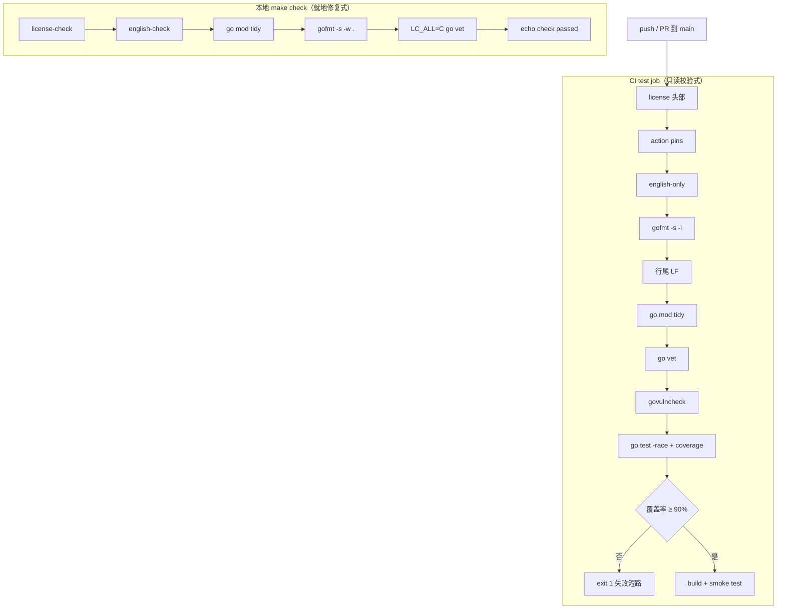
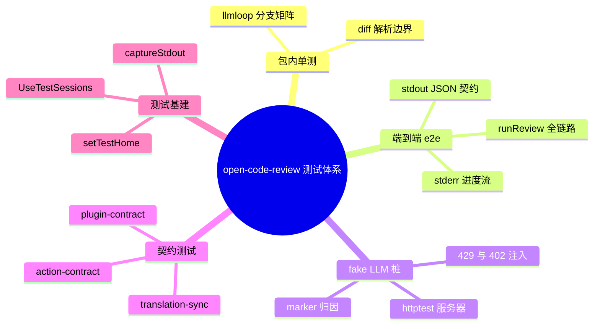

# 测试与质量保障

> **关联源码**：`Makefile`、`scripts/verify-*.go`、`scripts/verify-*.sh`、`ASSURANCE_CASE.md`、`SECURITY.md`
> **前置阅读**：[00-overview.md](00-overview.md)

## 目录

1. [测试策略与分层](#1-测试策略与分层)
2. [覆盖率工程](#2-覆盖率工程)
3. [质量门禁全景](#3-质量门禁全景)
4. [ASSURANCE_CASE 安全论证](#4-assurance_case-安全论证)
5. [SECURITY.md 政策](#5-securitymd-政策)
6. [CI 全景](#6-ci-全景)
7. [抽样测试走读](#7-抽样测试走读)
8. [源文件覆盖清单](#8-源文件覆盖清单)

---

## 1. 测试策略与分层

### 1.1 四层组织

本仓库的测试体系可归纳为四层加一层共享基建：

| 层 | 载体 | 特征 |
|----|------|------|
| L1 包内纯单测 | 各包同包 `_test.go` | 白盒测试，直接调用未导出符号（如 [loop_execute_test.go](../../internal/llmloop/loop_execute_test.go#L34-L46) 直接调 `r.executeToolCall`） |
| L2 跨包端到端（e2e） | `cmd/opencodereview` 的 `*_e2e_test.go` | 以 `package main` 身份直接调用 `runReview` 等命令入口，驱动完整 review 链路 |
| L3 fake LLM 桩 | [retry_fake_llm_test.go](../../cmd/opencodereview/retry_fake_llm_test.go) 等 | `httptest.Server` 模拟 Anthropic 协议，通过 `OCR_LLM_*` 环境变量注入端点 |
| L4 契约测试（.test.js） | [scripts/github-actions/](../../scripts/github-actions) 下的 `*.test.js` | 纯 Node 内置模块、零依赖，验证 action/plugin/translation 的行为契约 |
| 基建层 | [testing.go](../../internal/session/testing.go)、各包 `test_home_test.go`、[output_helpers_test.go](../../cmd/opencodereview/output_helpers_test.go#L433-L482) | HOME 隔离、会话目录重定向、stdout/stderr 捕获 |

L4 层的四个 JS 契约测试由 `package.json` 的 `test:github-actions` 脚本串行执行（[package.json](../../package.json#L16-L21)）：

```
node scripts/github-actions/post-review-comments.test.js && node scripts/github-actions/check-translation-sync.test.js && node scripts/github-actions/action-contract.test.js && node scripts/github-actions/check-plugin-contract.test.js
```

其中 [action-contract.test.js](../../scripts/github-actions/action-contract.test.js#L8-L14) 的定位在文件头注释里说得很清楚：`action.yml` 是 shell 而非 Go，`make test` 够不到它，所以用一个小型 YAML 提取器取出真实的 shell 块、配合伪造的 `ocr`/`npm` 二进制实际执行——不引入任何 YAML 或测试框架依赖。

### 1.2 测试文件分布

以 `*_test.go` 普查（截至本文写作，共 203 个测试文件、分布于 23 个包），规模前十的包为：

| 包 | 测试文件数 | 被测主题 |
|----|-----------|---------|
| `cmd/opencodereview` | 62 | CLI 命令层、TUI、e2e |
| `internal/llm` | 23 | 提供商客户端、重试、密钥解析 |
| `internal/agent` | 16 | Agent 编排、manifest、预算 |
| `internal/session` | 16 | 会话持久化、resume、清单 |
| `internal/scan` | 14 | scan 流水线 |
| `internal/tool` | 12 | Agent 工具系统 |
| `internal/diff` | 11 | diff 解析引擎 |
| `internal/viewer` | 10 | Viewer Web 服务器 |
| `internal/llmloop` | 9 | 执行循环 |
| `internal/telemetry` | 8 | 遥测 |

`cmd/opencodereview` 一家占全仓库近三成测试文件，这与它承担「命令入口 + 全链路粘合」的角色一致（参见 [02-cli-commands.md](02-cli-commands.md)）。另一个值得注意的现象是「回归测试锚定 issue 编号」的写法：[parser_test.go](../../internal/diff/parser_test.go#L53-L56) 注释标注 guards issue #99、[progress_stream_e2e_test.go](../../cmd/opencodereview/progress_stream_e2e_test.go#L12-L15) 标注 #928、[retry_fake_llm_test.go](../../cmd/opencodereview/retry_fake_llm_test.go#L27-L30) 标注 #368——每个边界用例都记录了它所防御的历史缺陷。

### 1.3 test_home 隔离模式

名为 `test_home_test.go` 的文件出现在 **5 个包**中：

- [internal/agent/test_home_test.go](../../internal/agent/test_home_test.go)
- [internal/scan/test_home_test.go](../../internal/scan/test_home_test.go)
- [internal/llm/test_home_test.go](../../internal/llm/test_home_test.go)
- [internal/session/test_home_test.go](../../internal/session/test_home_test.go)
- [internal/config/rules/test_home_test.go](../../internal/config/rules/test_home_test.go)

五份文件逐字相同，都是一个 17 行的 `setTestHome` helper（以 [internal/agent/test_home_test.go](../../internal/agent/test_home_test.go#L13-L17) 为代表）：

```go
func setTestHome(t *testing.T, dir string) {
	t.Helper()
	t.Setenv("HOME", dir)
	t.Setenv("USERPROFILE", dir)
}
```

其背后的约定有三点：

1. **为什么存在**：OCR 的配置、会话、日志都落在 `~/.opencodereview`（解析路径为 `os.UserHomeDir()`）。测试若不重定向，会读写开发者真实的用户目录。
2. **为什么设两个变量**：Windows 上 `os.UserHomeDir()` 优先读 `USERPROFILE` 而非 `HOME`，只设 `HOME` 在 Windows 上会失效；`USERPROFILE` 在非 Windows 平台是无害的 no-op。注释原话见 [internal/agent/test_home_test.go](../../internal/agent/test_home_test.go#L8-L12)。
3. **为什么是五份拷贝而非共享**：helper 只包内可见才能避免为此建一个「测试工具包」；`t.Setenv` 只能在测试 goroutine 中调用，无法在 `TestMain` 里替全包预设。因此采用「逐包复制同一约定」的方式，靠注释说明保持一致。跨包共享的变体见 7.5 节的 `UseTestSessions`（导出 helper 模式）。

除这五份文件外，HOME 隔离手法还被更广泛地内联使用（`t.Setenv("HOME", ...)` 出现于 19 个文件），最完整的是 [retry_fake_llm_test.go 的 startFakeLLM](../../cmd/opencodereview/retry_fake_llm_test.go#L275-L291)：`HOME` + `USERPROFILE` + `XDG_CONFIG_HOME` 三重重定向，确保真实配置与真实会话目录都不被触碰。

### 1.4 LC_ALL=C 与 make test

[AGENTS.md](../../AGENTS.md#L30-L34) 要求用 `make test` 而非裸 `go test`，并解释了原因：`make test` 设置 `LC_ALL=C` 以确保 git 输出英文消息。git 在某些 locale 下会把错误信息（如 pathspec 提示）本地化，而大量测试用 `git` 构造 fixture 仓库并对输出做断言；locale 抖动会让同一测试在不同机器上不稳定。

[Makefile](../../Makefile#L43-L44) 的实现：

```make
test:
	LC_ALL=C $(GO) test -v -race -count=1 $(PACKAGES)
```

三个标志各有分工：`-race` 开启竞争检测器（见第 2 节）、`-count=1` 禁用测试结果缓存（每次真跑）、`-v` 输出每个用例名。同样的 `LC_ALL=C` 前缀也出现在 [coverage](../../Makefile#L48-L49)、[vet](../../Makefile#L70-L71) 与 [check](../../Makefile#L73-L77) 目标中。

## 2. 覆盖率工程

### 2.1 make coverage 的 90% 门槛

[Makefile](../../Makefile#L46-L56) 完整定义了覆盖率门槛：

```make
COVERAGE_THRESHOLD := 90

coverage:
	LC_ALL=C $(GO) test -count=1 -coverprofile=coverage.out $(PACKAGES)
	$(GO) tool cover -func=coverage.out | grep total:
	@COVERAGE=$$($(GO) tool cover -func=coverage.out | grep total: | awk '{print $$3}' | sed 's/%//'); \
	if awk "BEGIN {exit !($$COVERAGE < $(COVERAGE_THRESHOLD))}"; then \
		echo "FAIL: Coverage $${COVERAGE}% is below $(COVERAGE_THRESHOLD)% threshold"; \
		exit 1; \
	fi; \
	echo "PASS: Coverage $${COVERAGE}% meets $(COVERAGE_THRESHOLD)% threshold"
```

判定逻辑走了一个 awk 惯用法：`awk "BEGIN {exit !(COVERAGE < 90)}"`——覆盖率低于 90 时 `!(...)` 为假、awk 以 0 退出、shell 进入 then 分支报 FAIL 并 `exit 1`。用 awk 而非 shell 的 `[` 是因为覆盖率是浮点数（`89.7`），shell 整数比较无法处理。CI 中 [Check coverage threshold](../../.github/workflows/ci.yml#L86-L94) 步骤逐字复刻了这段逻辑。

一个细节：本地 `make coverage` 跑测试时**不带** `-race`（速度优先），而 `make test` 带 `-race` 但不产出 coverage；CI 则在 [同一步](../../.github/workflows/ci.yml#L81-L84) 里合并两者（`-race -count=1 -coverprofile`）。

### 2.2 PACKAGES 过滤规则

[Makefile](../../Makefile#L35-L41) 对 `PACKAGES` 的定义带一段值得全文引用的注释：

```make
# No node_modules filter is needed for the docs site: pages/go.mod puts it in a
# module of its own, so `go list ./...` skips that subtree entirely -- see that
# file for why a module boundary is used instead of a per-command grep. Deleting
# it brings pages/node_modules/flatted/golang back into this list.
# The /extensions/ filter still earns its keep: extensions/vscode has no Go code
# of ours, but its eslint dependency installs another copy of flatted's.
PACKAGES := $(shell $(GO) list ./... | grep -v /extensions/)
```

两个决策：

1. **`pages/` 不需要过滤**：文档站有自己的 `go.mod`（模块边界），`go list ./...` 天然跳过整个子树，包括其中的 `node_modules`。注释警告：删掉那个 go.mod 会让 `pages/node_modules/flatted/golang`（一个 npm 包里意外携带的 Go 文件）重新混进测试与覆盖率统计。
2. **`/extensions/` 必须过滤**：VS Code 扩展目录没有我们的 Go 代码，但其 eslint 依赖会安装另一份 flatted 的 Go 拷贝；不过滤会把第三方 vendored 代码拉进 90% 覆盖率门槛的分母，直接击穿门禁。

`PACKAGES` 被 [test](../../Makefile#L43-L44)、[coverage](../../Makefile#L48-L49)、[vet](../../Makefile#L70-L71)、[check](../../Makefile#L73-L77) 四个目标共用，保证「测的包 = 检查的包 = 算覆盖率的包」三者一致。

### 2.3 -race 的意义与 Windows 豁免

`-race` 在 CI 的 Linux 容器与本地 `make test` 中都开启。[ASSURANCE_CASE.md](../../ASSURANCE_CASE.md#L102-L110) 的 Automated Verification 表把 `go test -race` 列为「每次 push/PR」的数据竞争验证，并指出 Go 的内存安全加 `CGO_ENABLED=0` 使 use-after-free 类缺陷不适用（[第 100 行](../../ASSURANCE_CASE.md#L100)）。

Windows job 有意豁免，[ci.yml](../../.github/workflows/ci.yml#L131-L140) 的注释给出两层理由：竞争检测器在 Windows 上需要可用的 C 工具链；且数据竞争与 OS 无关，Linux job 已覆盖——Windows job 的价值在 OS 特有行为（路径处理、shell 差异等）。同一段注释还解释了为何 Windows job 不设覆盖率门槛：`//go:build !windows` 的测试文件在 Windows 上不参与编译，会合法地把总覆盖率拉低。

## 3. 质量门禁全景

### 3.1 门禁总表

| # | 门禁 | 命令 | 检查什么 | 失败行为 | 触发点 |
|---|------|------|---------|---------|--------|
| 1 | license-check | `make license-check` → `bash scripts/verify-license.sh` | 每个源文件的 SPDX 头部、版权行、年份 | 列出违规文件清单，`exit 1`，提示 `make license-add` | 本地 `make check` 第一步；CI [Verify license headers](../../.github/workflows/ci.yml#L37-L38) |
| 2 | english-check | `make english-check` → `go run scripts/verify-english-only.go` | 源码中的非英文字母与全角标点 | 逐行报告 `file:line` 与违规字符，`exit 1` | 本地 `make check`；CI [Verify sources contain no unapproved non-English text](../../.github/workflows/ci.yml#L43-L44) |
| 3 | action-pins | `bash scripts/verify-action-pins.sh` | `action.yml` 的外部 action 引用必须 SHA pin | 列出未 pin 的行，`exit 1` | 仅 CI [Verify action pins](../../.github/workflows/ci.yml#L40-L41) |
| 4 | gofmt | CI: `gofmt -s -l .` | Go 格式 | `::error` 注解 + diff，`exit 1` | CI [Check formatting](../../.github/workflows/ci.yml#L46-L54)；本地 `make check` 用 `gofmt -s -w .` 就地修复 |
| 5 | 行尾 LF | CI: `git add --renormalize .` + `git diff --cached --quiet` | CRLF 混入 | `::error` + diff stat，`exit 1` | CI [Check line endings](../../.github/workflows/ci.yml#L56-L63)；规则源 [.gitattributes](../../.gitattributes#L1) |
| 6 | tidy | `go mod tidy` + `git diff --exit-code` | go.mod/go.sum 一致性 | `::error`，`exit 1` | CI [Check go.mod is tidy](../../.github/workflows/ci.yml#L65-L71)；本地 `make check` 就地 tidy |
| 7 | vet | `go vet` | 标准静态分析 | 非零退出 | 本地 [make check](../../Makefile#L73-L77)；CI test/windows 两 job |
| 8 | govulncheck | `govulncheck ./...`（v1.6.0） | 已知漏洞可达性 | 非零退出 | 仅 CI [Govulncheck](../../.github/workflows/ci.yml#L76-L79) |
| 9 | race 测试 | `make test` / CI `go test -race` | 数据竞争 | 测试失败 | 本地 `make test`；CI |
| 10 | coverage | `make coverage` | 总覆盖率 ≥ 90% | `FAIL: ... below 90% threshold`，`exit 1` | 本地 `make coverage`；CI [Check coverage threshold](../../.github/workflows/ci.yml#L86-L94) |
| 11 | smoke | 构建 + `--version`/`--help` grep | 二进制可跑、命令面完整 | grep 失败即 `exit 1` | CI [test job](../../.github/workflows/ci.yml#L96-L113) 与 [windows job](../../.github/workflows/ci.yml#L142-L162) |
| 12 | translation-sync | `node check-translation-sync.js readmes\|docs` | README 结构同步（阻断）/ 文档翻译滞后（仅警告） | readmes 失败 `exit 1`；docs 为 `::warning` + `continue-on-error` | [translation-sync.yml](../../.github/workflows/translation-sync.yml#L42-L56) |
| 13 | plugin-contract | `node check-plugin-contract.js links\|manifests` | 仓库内链接存在性 / 插件清单完整性 | 任一失败 `exit 1` | [plugin-contract.yml](../../.github/workflows/plugin-contract.yml#L77-L84) |
| 14 | action-contract | `npm run test:github-actions` | composite action 行为契约 | 断言失败 | [action-contract.yml](../../.github/workflows/action-contract.yml#L49-L50) |
| 15 | CodeQL | CodeQL Advanced workflow | actions/go/javascript-typescript 三语言静态安全分析 | 报告告警 | [codeql.yml](../../.github/workflows/codeql.yml#L46-L56)，push/PR/每周五 |

**图 16-1**：质量门禁流水线（本地 `make check` 与 CI test job 的执行顺序与失败短路）



本地 `make check` 是**修复式**（tidy、gofmt 就地改写文件后通过），CI 是**校验式**（同样的检查以只读方式重做，发现差异即失败）。这个「本地改、CI 验」的镜像关系正是 [AGENTS.md](../../AGENTS.md#L25) 说「`make check` 格式化并整理到位，无需再单独跑 gofmt 或 go vet」的底气。

### 3.2 license-check 与 license-add

[verify-license.sh](../../scripts/verify-license.sh#L36-L80) 的检查规则：

- **枚举**：`git ls-files`（[第 72 行](../../scripts/verify-license.sh#L72)）。
- **范围**：扩展名 `go sh js mjs ts tsx`（[第 17 行](../../scripts/verify-license.sh#L17)）；忽略 `vendor/`、`dist/`、`node_modules/`、`testdata/`（[第 19-24 行](../../scripts/verify-license.sh#L19-L24)）。
- **头部窗口**：只看前 20 行（[第 52 行](../../scripts/verify-license.sh#L52)），因此 SPDX 头允许前面有 shebang、`//go:build` 等内容。
- **三项断言**：必须含 `SPDX-License-Identifier: Apache-2.0`（[第 56-59 行](../../scripts/verify-license.sh#L56-L59)）；必须含 `Copyright YYYY alibaba/open-code-review Contributors`（[第 61-64 行](../../scripts/verify-license.sh#L61-L64)）；年份须落在 `[2026, 当前年]` 区间（[第 66-71 行](../../scripts/verify-license.sh#L66-L71)）——下限锚定项目诞生年，上限防止未来年份笔误。
- **一个防误报的细节**：头部经 here-string 喂给 grep 而非 `echo |` 管道，因为 `grep -q` 在首个匹配处退出会让上游 `echo` 死于 SIGPIPE(141)，`pipefail` 会把合法头部误报为缺失（[第 54-55 行注释](../../scripts/verify-license.sh#L54-L55)）。

修复端 [add-license.sh](../../scripts/add-license.sh#L49-L105) 与检查端对称：`has_header` 用同样两段正则判断（[第 40-47 行](../../scripts/add-license.sh#L40-L47)），已带头部的文件跳过；插入时区分注释风格——`.sh` 用 `#` 头、其余用 `//` 头（[第 15-19、102-105 行](../../scripts/add-license.sh#L15-L19)）；若首行是 `//go:build` 或 shebang，则保持它在最前、头部插在其后（[第 63-79 行](../../scripts/add-license.sh#L63-L79)）；mktemp 加 chmod 保序原文件权限（[第 53-58 行](../../scripts/add-license.sh#L53-L58)）。它同样用 here-string 防 SIGPIPE——注释点明这个 bug 的后果是给已有头部的文件再叠一份版权块（[第 43-45 行](../../scripts/add-license.sh#L43-L45)）。

### 3.3 english-check 扫描算法

[verify-english-only.go](../../scripts/verify-english-only.go) 是本仓库最具特色的门禁，值得完整走读。

**文件枚举**（[run，第 204-240 行](../../scripts/verify-english-only.go#L204-L240)）：

- `git ls-files -z --cached --others --exclude-standard`（[第 212 行](../../scripts/verify-english-only.go#L212)）——同时含已跟踪与未跟踪文件，所以新文件在落地前就会被检查；被 ignore 的路径（`dist/`、`node_modules/`）自然排除。
- `-z` 以 NUL 分隔，让 git 原样输出路径而不做引号转义——非 ASCII 路径正是 `internal/diff/git_test.go` 有 fixture 的场景（[第 209-211 行注释](../../scripts/verify-english-only.go#L209-L211)）。

**扫描范围**：十三种扩展名（`.go .ts .tsx .js .cjs .mjs .py .sh .ps1 .css .html .yml .yaml .json`，[第 63-67 行](../../scripts/verify-english-only.go#L63-L67)）加无扩展名的 `Makefile`（[第 70 行](../../scripts/verify-english-only.go#L70)）。注意 **Markdown 不在列表中**——翻译后的 README 与文档页天然合法（[第 29-30 行注释](../../scripts/verify-english-only.go#L29-L30)）。

**字符判定** `isNonEnglish`（[第 116-141 行](../../scripts/verify-english-only.go#L116-L141)），被拒绝的 Unicode 范围：

| 条件 | 覆盖内容 |
|------|---------|
| `r >= 0x80 && unicode.IsLetter(r) && !unicode.Is(unicode.Common, r) && !unicode.Is(unicode.Inherited, r)` | 一切非 ASCII **字母**：Han、假名、谚文、西里尔、希腊、阿拉伯、希伯来、天城文，以及德/法/土/越语的变音字母 |
| `U+0300–U+036F` | 组合变音符号——NFD 分解写法中重音符号单独成 rune，字母本身是 ASCII，重音携带了语言信息（[第 124-130 行注释](../../scripts/verify-english-only.go#L124-L130)） |
| `U+3000–U+303F` | CJK 符号和标点（全角空格、句号等） |
| `U+FE10–U+FE19` | 竖排形式 |
| `U+FE30–U+FE6F` | CJK 兼容形式 + 小形式变体 |
| `U+FF00–U+FFEF` | 半角全角形式（全角冒号 `：`、全角逗号 `，`） |

设计上的几个关键取舍（均出自函数前的长注释，[第 84-115 行](../../scripts/verify-english-only.go#L84-L115)）：

- **规则是「ASCII 之外的字母」而非「Latin 之外的字母」**：书面英语不需要 26 个 ASCII 字母以外的任何字母，所以任何超出者都是别的语言。不枚举文字系统，规则随贡献者基础增长保持稳定。
- **测字母而非测非 ASCII 字节**：box drawing、箭头、emoji、数学符号（`─ → ≥ ✅`）不是字母，TUI 输出里大量故意使用；朴素的非 ASCII 测试会把它们全部误报。
- **Common 与 Inherited script 豁免**：ℹ（U+2139，Unicode 类别 Ll 但渲染为信息图标）、ℓ（U+2113）、数学字母表大写——这些不拼写任何语言的单词。而欧姆符号 U+2126 因 Unicode 归入 Greek script 仍被拦截：为数学记号豁免希腊就会连希腊散文一起豁免。

**逐行处理**（[scan，第 170-193 行](../../scripts/verify-english-only.go#L170-L193)）：某行只要包含 `allow-non-english:` 标记（[第 82 行](../../scripts/verify-english-only.go#L82)，冒号是标记一部分，裸写 `allow-non-english` 不带理由无法豁免）则整行跳过；否则逐 rune 检查，**命中第一个违规字符即记录该行并 break**——报告按行而非按字符计数。行缓冲上限 8 MiB（[第 179 行](../../scripts/verify-english-only.go#L179)）。

**两层豁免机制**（文件头注释 [第 37-45 行](../../scripts/verify-english-only.go#L37-L45)）：

1. **行级**（首选，窄）：在违规行尾追加 `// allow-non-english: <reason>`，适合编码 fixture、语言切换器标签等少量行，文件其余部分仍受保护。
2. **路径前缀级**（宽，慎用）：`allowedPrefixes`（[第 74-77 行](../../scripts/verify-english-only.go#L74-L77)）目前两项——`pages/src/i18n/`（文档站翻译文案，长期豁免）与 `extensions/vscode/`（**临时**豁免，注释声明扩展的中文注释翻译后即删除）。每个条目都必须写明理由，临时条目要写明什么会移除它。

**失败输出**（[第 242-261 行](../../scripts/verify-english-only.go#L242-L261)）：每个 finding 打印 `file:line`、违规 rune、被 `trim` 截断到 100 rune 的行内容（[第 195-202 行](../../scripts/verify-english-only.go#L195-L202)），随后打印修复指引（加标记或改 allowedPrefixes）。

最后一个工程细节：文件顶部的 `//go:build ignore`（[第 4 行](../../scripts/verify-english-only.go#L4)）让它游离于 `./...` 包列表之外，因此不影响 `go vet`、`go build` 与覆盖率统计（[第 32-35 行注释](../../scripts/verify-english-only.go#L32-L35)）——这与第 2.2 节 PACKAGES 过滤是同一主题的两个侧面。

### 3.4 make check 组合

[Makefile](../../Makefile#L73-L77)：

```make
check: license-check english-check
	$(GO) mod tidy
	gofmt -s -w .
	LC_ALL=C $(GO) vet $(PACKAGES)
	@echo "check passed"
```

组合语义：先过两个仓库特有门禁（license、english），再做 Go 生态的三件套（tidy、gofmt、vet），全部就地修复式。对照 CI，`make check` 不含 action-pins、govulncheck、LF、覆盖率——这四项只在 CI 强制（见 3.1 表的触发点列）。[AGENTS.md](../../AGENTS.md#L23-L28) 把 `make check`、license 头部与英文写作规范并列为提交前三条纪律。

### 3.5 action-pins

[verify-action-pins.sh](../../scripts/verify-action-pins.sh#L6-L11) 防的是一个供应链盲点：`action.yml` 是对外发布的 composite action，消费者用 SHA pin 住 `alibaba/open-code-review` 本身时，内部若引用浮动 tag（如 `actions/checkout@v4`），外层 pin 冻结的只是本仓库快照——内部 tag 一移动，实际执行的内容就变了（注释援引 issue #816）。

实现极简（[第 16-44 行](../../scripts/verify-action-pins.sh#L16-L44)）：对 `action.yml` 的每个 `uses:` 行，本地引用（`uses: ./`）豁免；其余必须匹配 `owner/repo@<40 位十六进制 SHA>` 且带 `# vX.Y` 版本注释，否则列出违规行并以 `exit 1` 结束。40 位十六进制排除了短 SHA 与 tag 冒充。

### 3.6 translation-sync 与 plugin-contract

这两个门禁都不在 ci.yml 里，而是拆成独立 workflow，注释给出了拆分理由：慢速容器拉取不应延迟核心 CI 反馈（[translation-sync.yml 第 3-7 行](../../.github/workflows/translation-sync.yml#L3-L7)、[plugin-contract.yml 第 3-5 行](../../.github/workflows/plugin-contract.yml#L3-L5)）。两者都按 `paths:` 触发，只在相关文件变更时运行。

**translation-sync**（[check-translation-sync.js](../../scripts/github-actions/check-translation-sync.js#L6-L27)）做两个独立检查：

1. **README 结构检查（阻断）**：五个 README（en/zh-CN/ja-JP/ko-KR/ru-RU）的 `##` 二级标题结构必须一致。因为标题**文本**必然随语言不同，比较的是**结构指纹**——标题层级的有序序列（`structuralSignature`，[第 96-100 行](../../scripts/github-actions/check-translation-sync.js#L96-L100)），语言无关。检测器是 fence 感知的 ATX 标题解析（[第 59-87 行](../../scripts/github-actions/check-translation-sync.js#L59-L87)），否则 README 里 bash 代码块的 `# 注释` 会被误读为一级标题。
2. **文档翻译同步（非阻断）**：PR 改了 `pages/src/content/docs/en/**` 而未改对应 zh/ja/ru 路径时，发 `::warning` 注解——只提醒，从不挂掉构建（workflow 侧用 `continue-on-error: true` 保证，[第 50-56 行](../../.github/workflows/translation-sync.yml#L50-L56)）。

**plugin-contract**（[check-plugin-contract.js](../../scripts/github-actions/check-plugin-contract.js#L6-L37)）同样两个阻断检查：

1. **links**：文档与 README 里大量 `github.com/.../blob|tree/main/<path>` 与 `raw.githubusercontent.com` 链接，逐一解析回仓库相对路径并断言存在——这些 URL 从默认分支提供服务，失效路径等于给每个读者一个 404。路径缺失是阻断，blob/tree 类型不匹配只警告（GitHub 会重定向）。无需网络访问。
2. **manifests**：插件/marketplace 清单声明的每个路径必须解析到真实且非空的目录，每个 SKILL.md / 命令提示词必须带 loader 要求的 frontmatter——否则一次重命名会产出一个「安装成功但什么都不暴露」的插件。

两者都把核心逻辑导出为纯函数，用同名 `.test.js` 测试自身（workflow 里先跑守卫的自测再跑守卫，[第 37-43 行](../../.github/workflows/translation-sync.yml#L37-L43)）。此外还有一个藏在 Go 测试里的文档同步门禁：[cli_reference_compare_docs_test.go](../../cmd/opencodereview/cli_reference_compare_docs_test.go#L13-L37) 用子串断言四个 locale 的 `cli-reference.md` 都记录了 `ocr session compare`——四个文件靠人工同步，最常见的失败是新命令只落在 en 版。

## 4. ASSURANCE_CASE 安全论证

[ASSURANCE_CASE.md](../../ASSURANCE_CASE.md) 是一份结构完整的安全论证文档，其论证链为「威胁模型 → 设计原则 → 弱点对照 → 自动化验证」：

1. **威胁模型**（[第 5-67 行](../../ASSURANCE_CASE.md#L5-L67)）：先给系统描述（读 git diff、送 LLM、收评论、可选本地 viewer），再列 actors 信任级别表（本地用户可信、LLM API 半可信、git 仓库半可信、网络不可信、浏览器不可信），然后是一张 ASCII 信任边界图——四条边界分别对应 git→CLI、CLI→LLM API、CLI→本地输出、浏览器→viewer。威胁表 T1–T7 逐条给边界与缓解（命令注入、API key 泄漏、路径穿越、DNS rebinding、MITM、恶意 LLM 响应、依赖漏洞）。
2. **安全设计原则**（[第 69-82 行](../../ASSURANCE_CASE.md#L69-L82)）：把 Saltzer & Schroeder 八原则逐条映射到实现——如 least privilege 落在 `CGO_ENABLED=0` 与默认无监听；complete mediation 落在 viewer 每请求过 host allowlist（`internal/viewer/hostguard.go`）与工具路径逐次校验（`internal/tool/filereader.go:91-112`）。
3. **常见弱点对照**（[第 84-100 行](../../ASSURANCE_CASE.md#L84-L100)）：OWASP Top 10 / CWE SANS Top 25 逐项标注适用性与对策。论证的可贵之处在于**坦白**：A03 注入一行明确列出四类「非 git」的 `exec.Command` 调用点（API key 命令、agent shell 工具、MCP client、viewer 浏览器启动器），并论证它们只执行本地用户自己配置的内容、从不执行远端或 LLM 供给的输入——而不是简单声称「无命令执行」。
4. **自动化验证**（[第 102-110 行](../../ASSURANCE_CASE.md#L102-L110)）：静态分析（vet）、已知漏洞（govulncheck）、数据竞争（`go test -race`）、依赖监控（Dependabot）、构建完整性（`CGO_ENABLED=0`、go.sum）各就各位，且都在 CI 落地——论证的 evidence 不是声明而是可复现的检查项。

这与 [GOVERNANCE.md](../../GOVERNANCE.md#L40-L47) 的项目价值观互为呼应：security first（涉及凭据与执行安全的变更需额外审视）与 documentation-implementation alignment。

## 5. SECURITY.md 政策

[SECURITY.md](../../SECURITY.md) 的政策要点：

- **版本支持**（[第 3-10 行](../../SECURITY.md#L3-L10)）：只有最新发布版本接收安全更新，鼓励及时升级。
- **报告渠道**（[第 12-16 行](../../SECURITY.md#L12-L16)）：明确禁止通过公开 GitHub issue 报告漏洞；走 GitHub Private Vulnerability Reporting（Security Advisories 页面）。报告应包含描述与影响、复现步骤、受影响版本、建议修复（[第 18-23 行](../../SECURITY.md#L18-L23)）。
- **响应时限**（[第 25-29 行](../../SECURITY.md#L25-L29)）：3 个工作日内确认、7 个工作日内初评、确认的高危问题力争 14 天内修复并与报告者协同披露。
- **范围**（[第 31-44 行](../../SECURITY.md#L31-L44)）：纳入范围的是「通过构造 diff/配置/LLM 响应实现的 RCE 或命令注入、凭据泄漏、路径穿越、可经本项目利用的依赖漏洞」——与 ASSURANCE_CASE 的威胁模型一一对应；明确排除第三方 LLM 提供商问题、需要本地访问的 DoS、社工。
- **发布签名**（[第 46-60 行](../../SECURITY.md#L46-L60)）：发布二进制与校验和用 GitHub Artifact Attestations（Sigstore keyless，由 Actions OIDC 背书，无长期私钥）；版本 tag 用 SSH 密钥 `git tag -s` 签名。验证命令：`gh attestation verify <binary> --repo alibaba/open-code-review` 与 `git tag -v <tag>`。
- **致谢**（[第 62-63 行](../../SECURITY.md#L62-L63)）：负责任披露的报告者按意愿记入发布说明。

## 6. CI 全景

[ci.yml](../../.github/workflows/ci.yml) 由三个 job 组成：

**test job**（[第 25-113 行](../../.github/workflows/ci.yml#L25-L113)）：`self-hosted` runner 跑在 `golang:1.26.6` 容器里（`--cpus=2`、15 分钟超时）。步骤严格串行：checkout → trust workspace（`git config safe.directory`）→ license → action-pins → english → gofmt 只读检查 → 行尾 LF → tidy → vet → govulncheck（安装 `golang.org/x/vuln/cmd/govulncheck@v1.6.0`）→ `go test -v -race -count=1 -coverprofile` → 覆盖率 90% 门槛 → build → smoke test。任何一步非零退出即短路失败。smoke test（[第 99-113 行](../../.github/workflows/ci.yml#L99-L113)）不止 `--version`：还 grep `--help` 输出必须含 `review/scan/delegate/config/llm/viewer/session/rules` 八个子命令名——命令面收缩会被立即发现。

**windows job**（[第 120-162 行](../../.github/workflows/ci.yml#L120-L162)）：`windows-latest` 原生 runner + `setup-go` 装的 Go 1.26.5。GitHub 不支持 Windows runner 用 `container:`（注释援引 actions/runner#904），所以无法复用其他 job 共享的 golang 镜像，改为直接装 Go。vet + test（无 `-race`、无覆盖率门槛，理由见 2.3 节）+ build + smoke（`shell: bash`，注释说明用 git-bash 让 smoke 脚本逐字共享而非重写成 PowerShell）。

**cross-compile job**（[第 164-190 行](../../.github/workflows/ci.yml#L164-L190)）：五格矩阵 `linux/arm64、darwin/amd64、darwin/arm64、windows/amd64、windows/arm64`（`fail-fast: false`），`CGO_ENABLED=0` 交叉编译 `go build -o /dev/null ./...`。它只证明 build-tag 拆分在各目标平台可编译——**原生运行**验证由 windows job 承担（[第 115-119 行注释](../../.github/workflows/ci.yml#L115-L119)）；linux/amd64 不在矩阵里，因为 test job 本身就在该平台构建并运行。

两个全局设定值得注意：`paths-ignore` 排除 `**.md`、`**/LICENSE`、`**/.gitignore`——纯文档变更跳过核心 CI，翻译同步由 translation-sync.yml 补位；每个 workflow 都有 `concurrency` + `cancel-in-progress`，同一 PR 的新推送会取消旧的运行。

其余 workflow 的质量相关部分（release.yml 的签名与产物、vscode-ext.yml 的扩展构建、pages-ci.yml/deploy-pages.yml 的文档站构建、ocr-review.yml 用本项目审查自家 PR 的 dogfooding，[第 1-16 行](../../.github/workflows/ocr-review.yml#L1-L16)）详见 [15-distribution-release.md](15-distribution-release.md)。[codeql.yml](../../.github/workflows/codeql.yml#L46-L56) 以 actions/go/javascript-typescript 三语言矩阵运行，并带每周五的定时扫描。

两处**陈旧注释**（代码行为正确、注释与现状不符，记录备查）：

- [ci.yml 第 138 行](../../.github/workflows/ci.yml#L138) 注释称 Windows 测试会把覆盖率拉到「Linux job 强制的 80%」以下，但实际门槛是 90%（[第 90 行](../../.github/workflows/ci.yml#L90) 与 [Makefile 第 46 行](../../Makefile#L46)）——疑为门槛从 80 提到 90 后注释未同步，**待与维护者确认**。
- [ci.yml 第 118-119 行](../../.github/workflows/ci.yml#L118-L119) 注释称其他 job 共享 `golang:1.26.5` 镜像，而 test/cross-compile 实际用 `golang:1.26.6`（[第 29、168 行](../../.github/workflows/ci.yml#L29)）；类似地 [check-translation-sync.js 第 25-27 行](../../scripts/github-actions/check-translation-sync.js#L25-L27) 注释称自己由 ci.yml 调用，实际调用方是 translation-sync.yml。同为镜像版本升级/工作流拆分后的注释滞后。

## 7. 抽样测试走读

本章按 1.1 节的分层各取一个代表走读。五个样本覆盖了四层与基建层的全部典型手法：

**图 16-2**：测试体系分层总览（与五个样本的对应关系）



### 7.1 parser_test：diff 解析的边界用例设计

[internal/diff/parser_test.go](../../internal/diff/parser_test.go) 是 L1 层纯单测的代表：被测对象 `ParseDiffText` 是纯文本解析，fixture 就是内联的 diff 字符串，repo 参数用 `t.TempDir()` 充当——**不依赖 git 二进制**。八个测试不采用表驱动，而是一用例一函数，每个针对 git diff 语法的一个陷阱：

- [rename 头识别](../../internal/diff/parser_test.go#L57-L91)（guards issue #99）：文件改名须从 `rename from/to` 扩展头识别，否则按旧路径读内容报 `exit status 128`；连带覆盖带空格的路径。
- [纯改名](../../internal/diff/parser_test.go#L95-L113)：100% 相似度的 rename 完全没有 hunk 与 `---/+++` 行。
- [删除文件](../../internal/diff/parser_test.go#L118-L145)：git 对删除发 `+++ /dev/null` **不带 b/ 前缀**，旧正则要求前缀导致误分类。
- [内容提及 "Binary files "](../../internal/diff/parser_test.go#L183-L213)：文本文件内容行里出现该串不得判为二进制（未锚定的正则曾匹配任意行），真二进制仍须命中。
- [内容行以 +++/--- 开头](../../internal/diff/parser_test.go#L220-L245)：增行 `++i` 渲染成 `+++i`，旧的「排除 +++/--- 头」守卫把它从计数里丢掉，扭曲统计与 changeLines 阈值。
- [hunk 内出现 "+++ /dev/null" 字符串](../../internal/diff/parser_test.go#L251-L273)：文件恰好新增一行 `++ /dev/null` 时是内容而非头标记。

设计取向：**每个用例的注释都先讲历史 bug 的形态再讲断言**，测试同时是回归防线与语法陷阱的文档。

### 7.2 progress_stream_e2e：端到端如何驱动 CLI

[progress_stream_e2e_test.go](../../cmd/opencodereview/progress_stream_e2e_test.go) 展示 L2 层 e2e 的标准姿势。驱动方式不是 exec 二进制，而是**同包直接调用** `runReview([]string{...})`（[第 26-29 行](../../cmd/opencodereview/progress_stream_e2e_test.go#L26-L29)）——测试与 main 同包，可调用包私有入口，省去进程启动与路径解析。

配套三件套：`retryTestRepo(t)` 用临时目录 + 固定 git 身份造出 `HEAD~1..HEAD` 可审查区间；`startFakeLLM(t, ...)` 起 httptest 服务器并注入 `OCR_LLM_*` 环境变量；`runReviewWithAudience` helper（[第 20-33 行](../../cmd/opencodereview/progress_stream_e2e_test.go#L20-L33)）用 `captureStderr(captureStdout(...))` 嵌套捕获双通道——这正是被测契约：stdout 必须恰好是一份可 `json.Unmarshal` 的 JSON 文档（模拟 jq 消费者），进度只能走 stderr。

两向断言（[第 35-59 行](../../cmd/opencodereview/progress_stream_e2e_test.go#L35-L59)）：`--audience human --format json` 时 stderr 必须含 `[ocr]` 进度且 stdout 无任何泄漏；[反例](../../cmd/opencodereview/progress_stream_e2e_test.go#L63-L80)则验证 `audience=agent` 请求静默时重定向不得把进度复活。捕获 helper 本身（[output_helpers_test.go 第 433-456 行](../../cmd/opencodereview/output_helpers_test.go#L433-L456)）有一个非显然的正确性细节：管道必须**并发排水**——只在 fn 返回后读会把捕获量封顶在管道缓冲（Linux 64 KiB，Windows 更小），超量即写端永久阻塞。

### 7.3 retry_fake_llm：fake 的接口设计

[retry_fake_llm_test.go](../../cmd/opencodereview/retry_fake_llm_test.go) 是 L3 层桩设计的教科书样本，其核心问题是「如何在 HTTP 层注入故障并归因到文件」：

- **注入**：`fakeLLM` 实现 `http.Handler` 挂上 `httptest.NewServer`（[第 282-291 行](../../cmd/opencodereview/retry_fake_llm_test.go#L282-L291)），两个旋钮——`rateLimitOnce`（某文件首次请求回 429 + `Retry-After: 1`，测 SDK 自身重试）与 `hardFail`（永久 402，测必须不重试）。`attemptsByFile` 统计**真实 HTTP 尝试数**，让测试能区分「SDK 重试」与「OCR 重新请求」（[第 36-48 行](../../cmd/opencodereview/retry_fake_llm_test.go#L36-L48)）。
- **归因**：按 marker 归因而非路径——`MARKER_ALPHA` 等 token 只出现在对应文件 diff 正文里，而 grouping 提示词会列出**其他**文件的路径，按路径归因必错（[第 104-116 行](../../cmd/opencodereview/retry_fake_llm_test.go#L104-L116)注释）。
- **协议分支**：grouping 调用没有 marker，靠匹配 `groupingSystemPrompt` 常量（提示词稳定片段，[第 118-125 行](../../cmd/opencodereview/retry_fake_llm_test.go#L118-L125)）识别并应答「一文件一组」——因为重试记账必须一文件一请求，模型自由并组会塌缩被测对象；有 `"tools"` 则应答 `task_done` 工具调用（主任务轮次），否则应答 plan 文本（[第 149-213 行](../../cmd/opencodereview/retry_fake_llm_test.go#L149-L213)）。
- **防退化守卫**：`assertGroupingRecognized`（[第 71-91 行](../../cmd/opencodereview/retry_fake_llm_test.go#L71-L91)）——提示词一旦改写，fake 会静默错过 grouping 调用、所有断言依旧通过而覆盖消失；该守卫把这种静默退化变成显式失败，并解释了为何只在一个测试里调用。类似地，[retryTestRepo](../../cmd/opencodereview/retry_fake_llm_test.go#L240-L266) 的文件数刻意达到 `GROUPING_MIN_FILES`——低于它 grouping 本地决策、单请求打包全部文件，同样塌缩被测对象。
- **复用防漂移**：整套 fixture 被 `//go:build manual_e2e` 门控的人工 harness（[manual_e2e_retry_test.go](../../cmd/opencodereview/manual_e2e_retry_test.go#L4-L15)，需 `-tags manual_e2e` 显式运行）共享，注释明言「两个 harness 对何为可重试服务的理解不能漂移」。
- **环境隔离**：`startFakeLLM` 除注入五个 `OCR_LLM_*` 变量外，还做 HOME/USERPROFILE/XDG_CONFIG_HOME 三重重定向（见 1.3 节）。
- **不可达分支的构造**：[poisonedRetryCollector](../../cmd/opencodereview/retry_fake_llm_test.go#L293-L303) 手工造一个「记录了尝试但从未 Finalize」的 collector——这是 `Freeze` 拒绝发布的唯一外部可达路径，生产代码每条退出路径都会 Finalize，注释直说这是从外面够到该分支的唯一办法。

### 7.4 loop_execute_test：并发与分支的组织

[internal/llmloop/loop_execute_test.go](../../internal/llmloop/loop_execute_test.go) 围绕 `executeToolCall` 的分支矩阵组织，特点是用**最小桩**覆盖每个分支而非写大而全的场景测试：

- `erroringProvider`（[第 23-30 行](../../internal/llmloop/loop_execute_test.go#L23-L30)）：一个 Execute 恒返回 `boom` 的动态工具 provider，八行代码覆盖「已注册工具执行失败」分支。
- 分支覆盖成对出现：动态工具未注册（[第 34 行](../../internal/llmloop/loop_execute_test.go#L34)）/ 已知内建工具未入注册表（[第 113 行](../../internal/llmloop/loop_execute_test.go#L113)）/ 参数解析失败（[第 157 行](../../internal/llmloop/loop_execute_test.go#L157)）/ 执行成功并记录（[第 85 行](../../internal/llmloop/loop_execute_test.go#L85)）——每个测试同时断言三个观测面：返回的 `cp.Data`、会话 `TaskRecord`（`rec.ToolResults`）、`ToolFailures()` 聚合。
- [TestCollectPendingComments_AwaitsPool](../../internal/llmloop/loop_execute_test.go#L129-L153) 是并发语义测试：向 worker pool 提交一个 `close(done)` 的任务，断言 `CollectPendingComments` 返回**之后** `done` 已关闭——即它确实等待池排空而非立即返回；用 channel 的 closed/未 closed 状态取代 sleep。
- [captureToolTerminal](../../internal/llmloop/loop_execute_test.go#L211-L234) 展示双通道捕获的组合：进度走 `stdout.Swap` 替换包级 writer（可并发安全的交换接口），终端错误走 os.Pipe 捕获 os.Stderr——一个用依赖注入点、一个用 OS 级重定向。

### 7.5 session/testing.go：导出测试基建的模式

[internal/session/testing.go](../../internal/session/testing.go#L12-L16) 与 1.3 节的 `setTestHome` 构成同一问题的两种解法。它导出 `UseTestSessions()`，把会话子目录与原始捕获目录从生产值改为 `test-sessions`/`test-raw`。关键差异在于**为什么必须导出**：session 持久化路径被 `cmd/opencodereview` 的 e2e 测试间接走到，那些测试无法访问 `internal/session` 的未导出变量，只能调用这个导出函数——因此它是 `testing.go`（非 `_test.go` 后缀）文件，属于包的常规编译单元。

文档注释同时写明契约：必须在 `_test.go` 的 `init()` 或 `TestMain` 中、任何测试 goroutine 启动前调用，且**并发不安全**——因为改的是包级变量 `sessionSubDir`/`rawSubDir`，调用时机约束就是它的安全边界。与 `setTestHome` 的「逐包私有复制」相比，这是「单点导出共享」：前者隔离的是进程级环境（HOME），后者切换的是包内全局状态，隔离物性质决定了共享方式。

## 8. 源文件覆盖清单

| 源文件 | 职责 | 关键符号 |
|--------|------|---------|
| [Makefile](../../Makefile) | 测试/覆盖率/检查目标与交叉编译入口 | `test`、`coverage`、`check`、`PACKAGES`、`COVERAGE_THRESHOLD`、`license-check/add`、`english-check` |
| [scripts/verify-english-only.go](../../scripts/verify-english-only.go) | 源码非英文文本扫描门禁 | `isNonEnglish`、`allowedPrefixes`、`exemptMarker`、`scan`、`run` |
| [scripts/verify-license.sh](../../scripts/verify-license.sh) | SPDX 头部校验 | `SPDX_REGEX`、`COPYRIGHT_REGEX`、`LICENSE_EXTS`、`is_ignored` |
| [scripts/add-license.sh](../../scripts/add-license.sh) | 自动补 SPDX 头部 | `has_header`、`add_header`、`SLASH_HEADER`/`HASH_HEADER` |
| [scripts/verify-action-pins.sh](../../scripts/verify-action-pins.sh) | action.yml SHA pin 校验 | `pinned`、`local_ref` |
| [scripts/github-actions/check-translation-sync.js](../../scripts/github-actions/check-translation-sync.js) | README 结构与文档翻译同步守卫 | `extractHeadings`、`structuralSignature`、`readmes`/`docs` 模式 |
| [scripts/github-actions/check-plugin-contract.js](../../scripts/github-actions/check-plugin-contract.js) | 仓库内链接与插件清单契约守卫 | `links`/`manifests` 模式、`SCAN_SKIP_DIRS` |
| [scripts/github-actions/action-contract.test.js](../../scripts/github-actions/action-contract.test.js) | composite action 可执行契约测试 | `parseInputs`、`parseSteps` |
| [package.json](../../package.json) | npm 分发入口与 JS 测试脚本 | `test:github-actions`、`test:update`、`test:launcher` |
| [AGENTS.md](../../AGENTS.md) | 贡献者/agent 规则来源（英文写作、make test、README 同步） | — |
| [ASSURANCE_CASE.md](../../ASSURANCE_CASE.md) | 安全论证：威胁模型/原则/弱点/验证 | T1–T7、Automated Verification 表 |
| [SECURITY.md](../../SECURITY.md) | 漏洞报告政策与发布签名 | 支持版本表、响应时限、`gh attestation verify` |
| [GOVERNANCE.md](../../GOVERNANCE.md) | 治理与决策（略读） | 项目价值观 |
| [.gitattributes](../../.gitattributes) | LF 归一化与二进制声明 | `text=auto eol=lf` |
| [.github/workflows/ci.yml](../../.github/workflows/ci.yml) | 核心 CI：test/windows/cross-compile 三 job | 步骤序列、覆盖率门槛、smoke 断言 |
| [.github/workflows/translation-sync.yml](../../.github/workflows/translation-sync.yml) | 翻译同步专项门禁 | blocking readmes / non-blocking docs |
| [.github/workflows/action-contract.yml](../../.github/workflows/action-contract.yml) | action 契约专项门禁 | `npm run test:github-actions` |
| [.github/workflows/plugin-contract.yml](../../.github/workflows/plugin-contract.yml) | 插件契约专项门禁 | links / manifests 两检查 |
| [.github/workflows/codeql.yml](../../.github/workflows/codeql.yml) | CodeQL 三语言静态安全分析 | language matrix、周五定时 |
| [.github/workflows/ocr-review.yml](../../.github/workflows/ocr-review.yml) | PR 自动审查（dogfooding，前 50 行） | `pull_request_target` 触发 |
| [internal/diff/parser_test.go](../../internal/diff/parser_test.go) | diff 解析边界单测（抽样） | `TestParseDiffText_*` 系列 |
| [cmd/opencodereview/progress_stream_e2e_test.go](../../cmd/opencodereview/progress_stream_e2e_test.go) | stdout/stderr 契约 e2e（抽样） | `runReviewWithAudience` |
| [cmd/opencodereview/retry_fake_llm_test.go](../../cmd/opencodereview/retry_fake_llm_test.go) | fake LLM 桩基建（抽样） | `fakeLLM`、`markers`、`startFakeLLM`、`retryTestRepo` |
| [cmd/opencodereview/manual_e2e_retry_test.go](../../cmd/opencodereview/manual_e2e_retry_test.go) | tag 门控人工 e2e harness（抽样） | `//go:build manual_e2e` |
| [cmd/opencodereview/output_helpers_test.go](../../cmd/opencodereview/output_helpers_test.go) | stdout/stderr 捕获基建 | `captureStdout`、`captureStderr` |
| [cmd/opencodereview/cli_reference_compare_docs_test.go](../../cmd/opencodereview/cli_reference_compare_docs_test.go) | CLI 参考文档同步测试 | `TestCLIReferenceDocumentsSessionCompare` |
| [internal/llmloop/loop_execute_test.go](../../internal/llmloop/loop_execute_test.go) | 工具执行分支与并发单测（抽样） | `erroringProvider`、`captureToolTerminal` |
| [internal/session/testing.go](../../internal/session/testing.go) | 导出测试基建：会话目录重定向 | `UseTestSessions` |
| internal/agent、internal/scan、internal/llm、internal/session、internal/config/rules 五包的 test_home_test.go | HOME 隔离 helper（逐字相同） | `setTestHome` |
