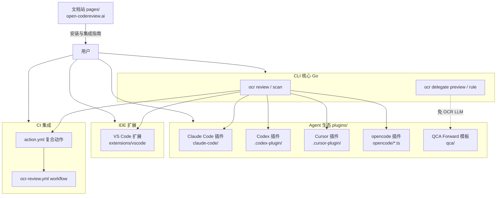
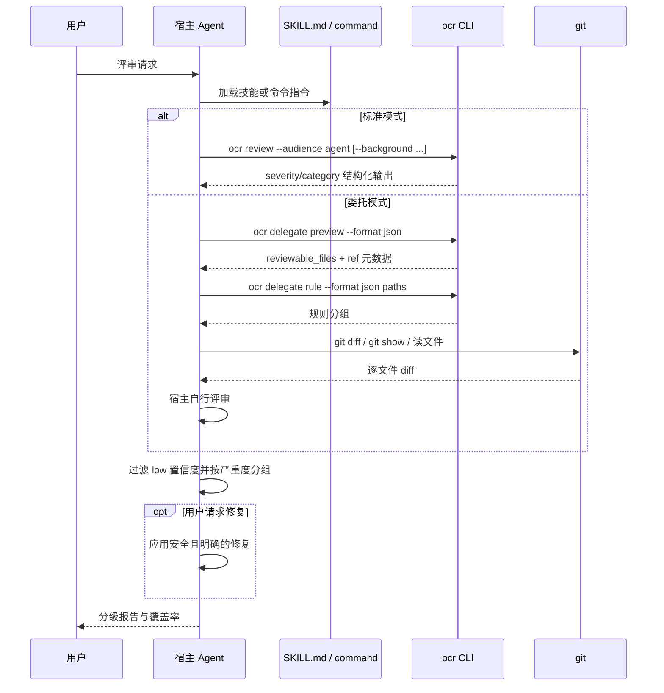

# 文档站、插件与技能生态

> **关联源码**：`pages/`、`plugins/`、`skills/`、`.claude/`、`.claude-plugin/`、`.agents/`
> **前置阅读**：[00-overview.md](00-overview.md)、[11-delegate-mcp.md](11-delegate-mcp.md)

## 目录

- [1. 文档站架构](#1-文档站架构)
  - [1.1 框架与构建链](#11-框架与构建链)
  - [1.2 路由结构](#12-路由结构)
  - [1.3 组件组织](#13-组件组织)
  - [1.4 五语言 i18n 机制](#14-五语言-i18n-机制)
  - [1.5 内容体系：docs 与 blog](#15-内容体系docs-与-blog)
  - [1.6 Markdown 渲染、搜索与在线数据](#16-markdown-渲染搜索与在线数据)
  - [1.7 部署](#17-部署)
- [2. 翻译同步校验](#2-翻译同步校验)
- [3. 插件体系全景](#3-插件体系全景)
  - [3.1 marketplace 机制](#31-marketplace-机制)
  - [3.2 Claude Code 插件](#32-claude-code-插件)
  - [3.3 Codex 插件](#33-codex-插件)
  - [3.4 Cursor 插件](#34-cursor-插件)
  - [3.5 opencode 插件](#35-opencode-插件)
  - [3.6 插件契约守护](#36-插件契约守护)
- [4. qca 系统提示模板](#4-qca-系统提示模板)
- [5. Skills 详解](#5-skills-详解)
  - [5.1 open-code-review：标准模式技能](#51-open-code-review标准模式技能)
  - [5.2 open-code-review-delegate：委托模式技能](#52-open-code-review-delegate委托模式技能)
  - [5.3 两者差异对比](#53-两者差异对比)
- [6. .claude/commands 仓库内命令](#6-claudecommands-仓库内命令)
- [7. 生态位地图](#7-生态位地图)
- [8. 源文件覆盖清单](#8-源文件覆盖清单)

---

## 1. 文档站架构

### 1.1 框架与构建链

首先纠正一个容易产生的误解：`pages/` 文档站**不是 Astro 站点**。[package.json](../../pages/package.json#L1-L12) 中 `"name": "open-code-review-landing"`，构建脚本是 `NODE_ENV=production webpack --mode production`，这是一个**纯 React SPA**。运行时依赖（[package.json#L14-L23](../../pages/package.json#L14-L23)）只有七个：

| 依赖 | 用途 |
|---|---|
| `react` / `react-dom` / `react-router-dom` | SPA 框架与客户端路由 |
| `marked` + `dompurify` | Markdown → HTML 渲染与净化（见 1.6） |
| `mermaid` | 文档内图表客户端渲染（见 1.6） |
| `three` | 首页 WebGL 背景（`ColorBends` 组件） |
| `@agentscope-ai/icons` | 图标包 |

没有 SSG/SSR 层：全部页面在浏览器端渲染，Markdown 内容在**构建期**由 webpack 打成字符串、在**运行期**由 `marked` 解析。这个选型决定了它对 GitHub Pages 静态托管天然友好（无 Node 运行时需求），也决定了多语言内容以「构建期 import + 运行期切换」的方式实现（见 1.4）。

构建链要点（[webpack.config.cjs](../../pages/webpack.config.cjs#L6-L43)）：

- 入口 `./src/index.tsx`，输出 `[name].[contenthash:8].bundle.js`，`clean: true`；
- 手工分包三组：`react`（含 router/scheduler，同步 chunk）、`three` 与 `mermaid`（`chunks: 'async'`，各自异步加载）；
- TS/TSX 走 babel-loader（preset-react/env/typescript），CSS 走 style-loader + postcss（Tailwind + Autoprefixer），**`.md` 文件用 `asset/source` 原样导出为字符串**（[webpack.config.cjs#L73-L75](../../pages/webpack.config.cjs#L73-L75)）——这是整个内容体系的物理基础：每个 Markdown 文档就是一个可 import 的 JS 字符串常量；
- 两个 `HtmlWebpackPlugin` 实例：`index.html` 与 `404.html`（[webpack.config.cjs#L97-L108](../../pages/webpack.config.cjs#L97-L108)）。后者是 GitHub Pages 上的 SPA fallback——深链接刷新时 GitHub Pages 返回 404.html，其内容与 index.html 相同，应用由此自举并通过客户端路由恢复（devServer 侧由 `historyApiFallback` 承担同样职责，[webpack.config.cjs#L89-L95](../../pages/webpack.config.cjs#L89-L95)）；
- `CopyPlugin` 把 `public/`（CNAME、og-image、博客图片）拷入产物（[webpack.config.cjs#L109-L113](../../pages/webpack.config.cjs#L109-L113)）。

质量门禁（[package.json#L6-L12](../../pages/package.json#L6-L12)）：`typecheck`（tsc --noEmit）、`test`（vitest）、`lint`（eslint）、`size`（size-limit，约束 `dist/*.bundle.js` 不超过 150 kB，[package.json#L27-L32](../../pages/package.json#L27-L32)）。测试环境为 jsdom + `@vitejs/plugin-react`（[vitest.config.ts#L7-L13](../../pages/vitest.config.ts#L7-L13)）。

### 1.2 路由结构

入口 [index.tsx#L19-L27](../../pages/src/index.tsx#L19-L27) 的组件树为 `StrictMode > LanguageProvider > BrowserRouter > App`：语言上下文在路由之外，切换语言不触发导航。`history.scrollRestoration = 'manual'` 关闭浏览器滚动恢复，滚动由 `App` 内的 `ScrollToTop` 组件接管（[App.tsx#L19-L24](../../pages/src/App.tsx#L19-L24)）。

路由表（[App.tsx#L87-L97](../../pages/src/App.tsx#L87-L97)）：

| 路径 | 组件 | 加载方式 |
|---|---|---|
| `/` | `LandingPage > FeaturesPage` | 同步 |
| `/features` | `LandingPage > FeaturesRoutePage` | 同步 |
| `/benchmark` | `LandingPage > BenchmarkPage` | `React.lazy` |
| `/quickstart` | `LandingPage > QuickStartPage` | `React.lazy` |
| `/docs`、`/docs/:slug` | `DocsPage`（独立布局） | `React.lazy` |
| `/blog`、`/blog/:slug` | `BlogPage`（独立布局） | `React.lazy` |
| `*` | `LandingPage > NotFoundPage` | 同步 |

三个营销页共用 `LandingPage` 壳（Navbar + 内容槽，[LandingPage.tsx#L11-L34](../../pages/src/components/LandingPage.tsx#L11-L34)）；Docs/Blog 是「文档应用」布局（Navbar + 三栏 + Footer），不套 Landing 壳。

两个值得记录的工程细节：

- **过渡式路由**：`useTransitionedLocation`（[useTransitionedLocation.ts#L17-L29](../../pages/src/hooks/useTransitionedLocation.ts#L17-L29)）把 location 更新包进 `startTransition`，使懒加载路由的 chunk 下载期间旧页面保持可见，避免路由切换黑屏（[App.tsx#L74-L80](../../pages/src/App.tsx#L74-L80) 注释明说了这一动机）。
- **chunk 加载错误自愈**：`ErrorBoundary` 识别 `ChunkLoadError`（[ErrorBoundary.tsx#L20-L26](../../pages/src/components/ErrorBoundary.tsx#L20-L26)），用 sessionStorage 保证**只自动刷新一次**（[ErrorBoundary.tsx#L42-L50](../../pages/src/components/ErrorBoundary.tsx#L42-L50)），防止旧 chunk 失效后的无限刷新循环——这是部署后 hash 变更导致 404 的常见 SPA 问题。

### 1.3 组件组织

`src/` 分五个目录：`components/`（可复用 UI）、`pages/`（路由级页面）、`content/`（Markdown 内容 + 索引）、`i18n/`（翻译表与上下文）、`hooks/` 与 `utils/`（逻辑）。

首页（`FeaturesPage`，[FeaturesPage.tsx#L14-L39](../../pages/src/pages/FeaturesPage.tsx#L14-L39)）自上而下编排七个区块，每个都包在 `FadeInSection`（IntersectionObserver 触发的入场淡入，[FadeInSection.tsx#L11-L31](../../pages/src/components/FadeInSection.tsx#L11-L31)）：

```
HeroSection → HighlightsSection → UseCasesSection → FeaturesSection
→ BenchmarkSection → QuickStartSection → Footer
```

各组件职责（均通过 `useTranslation` 的 key 取文案，文案本身在 i18n 表中）：

| 组件 | 职责 |
|---|---|
| [HeroSection.tsx](../../pages/src/components/HeroSection.tsx#L32-L100) | 首屏：标题、npm/Homebrew/MacPorts 安装命令切换与复制、模拟 `ocr review` 终端输出动画；WebGL 背景懒加载 |
| [HighlightsSection.tsx](../../pages/src/components/HighlightsSection.tsx#L42-L74) | 五个统计卡片；npm 下载量卡片用 `useNpmDownloads` 实时拉取（见 1.6） |
| UseCasesSection / WhySection | 目标用户画像（个人开发者/平台团队/研究者），文案驱动 |
| FeaturesSection | 六大功能卡片（混合架构、行级定位、多模型、effort、记忆压缩、内置规则），[FeaturesSection.tsx#L20-L27](../../pages/src/components/FeaturesSection.tsx#L20-L27) |
| [BenchmarkSection.tsx](../../pages/src/components/BenchmarkSection.tsx#L42-L57) | AACR-Bench 对比表：`rawRows` 硬编码 14 行数据，覆盖 Open Code Review / Claude Code / Codex 三个 source 的 F1/精确率/召回率/耗时/token，支持点击列排序，前三名奖牌 |
| QuickStartSection | 安装与上手步骤代码块 |
| Footer | 链接矩阵 + 第二处语言切换入口（[Footer.tsx#L11-L17](../../pages/src/components/Footer.tsx#L11-L17)） |
| ColorBends | three.js 实现的 WebGL 渐变背景，在 HeroSection 中 `React.lazy` 按需加载（[HeroSection.tsx#L19-L20](../../pages/src/components/HeroSection.tsx#L19-L20)），对应 webpack 的 `three` 异步分包 |
| SearchTrigger | 文档/博客侧栏顶部的搜索按钮（[SearchTrigger.tsx#L15-L40](../../pages/src/components/SearchTrigger.tsx#L15-L40)） |
| icons/ | 三个品牌 SVG 图标组件（OcrIcon、ClaudeIcon、OpenAIIcon，[icons/index.ts](../../pages/src/components/icons/index.ts#L1-L6)），供 Benchmark 表区分数据来源 |

营销子页面是纯组装：`FeaturesRoutePage`、`QuickStartPage`、`BenchmarkPage` 分别只复用对应 Section + Footer（如 [QuickStartPage.tsx#L9-L20](../../pages/src/pages/QuickStartPage.tsx#L9-L20)）。

### 1.4 五语言 i18n 机制

i18n 由三层拼成，语言覆盖范围**故意不同层不同**：

1. **UI 翻译表**：`src/i18n/{en,zh,ja,ko,ru}.ts` 五个扁平 key-value 表（`'navbar.features': 'Features'`，[en.ts#L4-L10](../../pages/src/i18n/en.ts#L4-L10)）。类型系统以英文表为键的**唯一真源**：`TranslationKey = keyof typeof en`，其他语言必须提供 `Record<TranslationKey, string>` 的完整表（[types.ts#L6-L8](../../pages/src/i18n/types.ts#L6-L8)）——少一个 key 就是类型错误。AGENTS.md 规定这些 `.ts` 翻译表豁免 english-check（翻译字符串本就该是各语言文字）。
2. **文档内容**：`src/content/docs/<locale>/` 五个目录（en/zh/ja/ko/ru），每目录 16 篇 + `integrations/` 子目录 4 篇。
3. **博客内容**：`src/content/blog/<locale>/` 只有三个语言（en/zh/ja），见 1.5。

运行时切换逻辑在 [context.tsx](../../pages/src/i18n/context.tsx#L44-L65)：

- 初始语言解析顺序：`localStorage['ocr-lang']`（[context.tsx#L36-L42](../../pages/src/i18n/context.tsx#L36-L42)）→ `navigator.languages` 首个受支持主语言（[context.tsx#L26-L34](../../pages/src/i18n/context.tsx#L26-L34)）→ 兜底 `en`；
- `setLanguage` 写回 localStorage 并同步 `document.documentElement.lang`（[context.tsx#L47-L54](../../pages/src/i18n/context.tsx#L47-L54)）；
- `t(key)` 查当前语言表，缺失时回退返回 key 本身（[context.tsx#L56-L58](../../pages/src/i18n/context.tsx#L56-L58)）。

Navbar 右上角 18px 方形徽章 + 下拉菜单是切换入口（[Navbar.tsx#L13-L27](../../pages/src/components/Navbar.tsx#L13-L27) 定义选项与徽章字形，[Navbar.tsx#L141-L208](../../pages/src/components/Navbar.tsx#L141-L208) 是交互实现）；徽章按语言选用字体栈（日文 Hiragino、韩文 Apple SD Gothic Neo，[Navbar.tsx#L31-L36](../../pages/src/components/Navbar.tsx#L31-L36)）。

注意路由**没有**语言段（`/docs` 而非 `/zh/docs`）：语言是纯客户端状态，切换即时重渲染，不产生 URL 变化，也不依赖 404 fallback。

### 1.5 内容体系：docs 与 blog

**docs 索引**（[content/docs/index.ts](../../pages/src/content/docs/index.ts#L4-L240)）以 80 个 import 显式引入全部五语言的 Markdown（构建期由 `asset/source` 内联为字符串），并给出：

- `DocSlug` 十六个字面量联合类型（[index.ts#L98-L114](../../pages/src/content/docs/index.ts#L98-L114)），与 `DocsPage` 侧栏树一一对应；
- 每语言一张 `Record<DocSlug, string>`；ru 声明为 `LocalizedDocs = Partial<...>`（[index.ts#L116](../../pages/src/content/docs/index.ts#L116)），注释标注「incremental」，但当前 ru 目录实际也齐了 16 篇（Partial 只是预留增量空间）；
- `getDocContent(slug, language)` 先取当前语言、**miss 时回退英文**（[index.ts#L237-L248](../../pages/src/content/docs/index.ts#L237-L248)）——这就是五语言内容允许异步演进的机制；
- `stripFrontmatter` 手工剥 YAML 头（[index.ts#L224-L232](../../pages/src/content/docs/index.ts#L224-L232)），`getDocTitle` 用正则 `title:\s*(.+)` 提取标题（[index.ts#L253-L264](../../pages/src/content/docs/index.ts#L253-L264)）；
- `searchDocs`（[index.ts#L270-L293](../../pages/src/content/docs/index.ts#L270-L293)）以英文 slug 列表遍历（注释明说「partial locales still search English fallbacks」），`indexOf` 命中后截取前后 30/60 字符生成摘要。

16 篇文档的侧栏分组（[DocsPage.tsx#L64-L97](../../pages/src/pages/DocsPage.tsx#L64-L97)）：Getting Started（quickstart/installation/configuration）+ User Guide（cli-reference/review-rules/architecture/tools/mcp/viewer/telemetry + integrations 四篇 + contributing/faq）。英文 [architecture.md](../../pages/src/content/docs/en/architecture.md#L1-L25) 是官方架构走读，含 mermaid 流水线图，与本分析系列（`docs/analysis/`）互补：前者面向使用者，后者面向仓库内部。开发期有一条守卫：侧栏 slug 重复会在非 production 构建中直接 throw（[DocsPage.tsx#L131-L137](../../pages/src/pages/DocsPage.tsx#L131-L137)），防止两个菜单项指向同一 URL。

**blog 索引**（[content/blog/index.ts](../../pages/src/content/blog/index.ts#L7-L50)）结构相同但只覆盖 en/zh/ja 三语言、两个 slug（`introducing-ocr-blog`、`oss-two-month-retrospective`）。`parseFrontmatter`（[index.ts#L62-L83](../../pages/src/content/blog/index.ts#L62-L83)）解析 title/date/tags/summary/author 五个字段（如 [introducing-ocr-blog.md#L1-L7](../../pages/src/content/blog/en/introducing-ocr-blog.md#L1-L7)），`getAllBlogMetas` 按 date 倒序排列（[index.ts#L98-L103](../../pages/src/content/blog/index.ts#L98-L103)）。BlogPage（[BlogPage.tsx#L51-L61](../../pages/src/pages/BlogPage.tsx#L51-L61)）支持标签筛选与列表/详情双视图，搜索逻辑 `searchBlog` 额外匹配标题与摘要（[index.ts#L112-L144](../../pages/src/content/blog/index.ts#L112-L144)）。

「no CMS, no database, merge a PR and it's live」——博客的发布模型就是 PR（[introducing-ocr-blog.md#L17-L19](../../pages/src/content/blog/en/introducing-ocr-blog.md#L17-L19) 原文）。

### 1.6 Markdown 渲染、搜索与在线数据

[MarkdownRenderer](../../pages/src/components/MarkdownRenderer.tsx#L67-L98) 是 docs/blog 共用的渲染器，流水线为：

1. `marked`（gfm）解析，自定义 renderer：heading id 与 TOC 提取逻辑共享同一套 `extractHeadingInfo`（[MarkdownRenderer.tsx#L72-L98](../../pages/src/components/MarkdownRenderer.tsx#L72-L98)），保证右侧 TOC 锚点与正文标题 id 一致；code 块转义 HTML 并去尾换行；
2. **DOMPurify.sanitize** 整体净化（[MarkdownRenderer.tsx#L97](../../pages/src/components/MarkdownRenderer.tsx#L97)）——Markdown 内容虽来自仓库本身而非用户输入，仍按不可信内容处理；
3. `dangerouslySetInnerHTML` 注入后，对 `code.language-mermaid` 块做客户端渲染（[MarkdownRenderer.tsx#L123-L167](../../pages/src/components/MarkdownRenderer.tsx#L123-L167)）：mermaid 以 `securityLevel: 'strict'` 初始化（[MarkdownRenderer.tsx#L21-L27](../../pages/src/components/MarkdownRenderer.tsx#L21-L27)），其 SVG 输出由 mermaid 内部净化，因此直接注入而不再过 DOMPurify（代码注释 [L141-L148](../../pages/src/components/MarkdownRenderer.tsx#L141-L148) 解释了这一信任边界的理由，并附 codeql 抑制标注）；渲染失败则回退显示原始代码块；
4. 非 mermaid 的 `pre` 块追加复制按钮（[MarkdownRenderer.tsx#L105-L121](../../pages/src/components/MarkdownRenderer.tsx#L105-L121)）。

锚点体系在 [headingId.ts](../../pages/src/utils/headingId.ts#L80-L105)：用与渲染器相同的 marked lexer 走 token 流（覆盖 setext 标题、blockquote/list 内嵌标题），`generateHeadingId` 保留 CJK 字符生成 slug（[headingId.ts#L27-L35](../../pages/src/utils/headingId.ts#L27-L35)），`createHeadingIdResolver` 对重复标题追加 `-2`、`-3` 后缀（[headingId.ts#L42-L60](../../pages/src/utils/headingId.ts#L42-L60)）；`{#explicit-id}` 语法可手工指定（[headingId.ts#L10-L20](../../pages/src/utils/headingId.ts#L10-L20)）。DocsPage 中还有 fragment 解码（marked 会 percent-encode 非_ascii href，[DocsPage.tsx#L21-L27](../../pages/src/pages/DocsPage.tsx#L21-L27)）与跨帧重试滚动（[DocsPage.tsx#L32-L49](../../pages/src/pages/DocsPage.tsx#L32-L49)）。

搜索是纯前端的：`useCommandSearch`（[useCommandSearch.ts#L13-L69](../../pages/src/hooks/useCommandSearch.ts#L13-L69)）持有状态与 ⌘K/Ctrl+K 快捷键（[L33-L48](../../pages/src/hooks/useCommandSearch.ts#L33-L48)），搜索函数由页面注入（DocsPage 传 `searchDocs`、BlogPage 传 `searchBlog`），`useSearchKeyboardNav`（[L71-L92](../../pages/src/hooks/useCommandSearch.ts#L71-L92)）处理上下键与回车。没有索引文件，每次按键全文扫描构建期内联的所有字符串——内容量级（16 篇 × 5 语言）下可接受。

唯一的运行时外部请求是 `useNpmDownloads`（[useNpmDownloads.ts#L22-L66](../../pages/src/hooks/useNpmDownloads.ts#L22-L66)）：直接 fetch 官方 npm stats API（CORS 友好，[L41-L43](../../pages/src/hooks/useNpmDownloads.ts#L41-L43)），8 秒超时后优雅降级回 i18n 静态值，供 HighlightsSection 的「NPM COMMUNITY DOWNLOADS」卡片显示真实月下载量（[HighlightsSection.tsx#L68-L74](../../pages/src/components/HighlightsSection.tsx#L68-L74)，包名 `@alibaba-group/open-code-review` 定义于 [L10](../../pages/src/components/HighlightsSection.tsx#L10)）。

### 1.7 部署

部署链路在 15-distribution-release.md 详述，此处只给文档站视角的摘要：push 到 main 且改动命中 `pages/**`、`install.sh` 等路径时触发 [deploy-pages.yml](../../.github/workflows/deploy-pages.yml#L3-L10)；构建后把 `pages/dist/*`、`logo.svg` 与 `install.sh`/`install.ps1` 一起拷入 `_site`（[deploy-pages.yml#L43-L49](../../.github/workflows/deploy-pages.yml#L43-L49)）并校验安装脚本一致后发布。PR 上由 [pages-ci.yml](../../.github/workflows/pages-ci.yml#L32-L46) 跑 lint/test/typecheck/build。自定义域名 `open-codereview.ai` 由 [CNAME](../../pages/public/CNAME#L1) 声明——plugins README 与 docs 中所有 `https://open-codereview.ai/...` 链接都指向这里。

## 2. 翻译同步校验

多语言资产的漂移风险由 [check-translation-sync.js](../../scripts/github-actions/check-translation-sync.js) 把守。它是一个零依赖、Node >= 14 的纯脚本（文件头注释 [L6-L30](../../scripts/github-actions/check-translation-sync.js#L6-L30) 声明了与 post-review-comments.js 相同的约定），核心逻辑导出为纯函数以便单测。

**校验对象是两组，行为一硬一软：**

### 2.1 Check 1：README 结构校验（BLOCKING）

五个 README（[L38-L44](../../scripts/github-actions/check-translation-sync.js#L38-L44)）：`README.md`（英文，参照系）、`README.zh-CN.md`、`README.ja-JP.md`、`README.ko-KR.md`、`README.ru-RU.md`——与 AGENTS.md「修改 README.md 必须同步四个本地化版本」的规则互为表里。

**比对算法**（[compareReadmeStructures, L127-L166](../../scripts/github-actions/check-translation-sync.js#L127-L166)）：

1. `extractHeadings`（[L59-L87](../../scripts/github-actions/check-translation-sync.js#L59-L87)）逐行提取 ATX 标题，**跳过围栏代码块内的 `#` 注释行**——围栏状态机要求关闭 fence 与开启 fence 同字符（``` vs ~~~）且长度不短于开启长度（CommonMark 规则，[L62-L80](../../scripts/github-actions/check-translation-sync.js#L62-L80) 注释解释了 bash 片段里 `# comment` 被误判为标题的坑）；
2. `structuralSignature`（[L99-L101](../../scripts/github-actions/check-translation-sync.js#L99-L101)）取**标题层级的有序序列**——刻意忽略文本，因为各语言标题文字必然不同，可比的只有「大纲形状」；
3. 每个翻译与英文参照比对：序列不同时，若 `##` 数量不等，报数量错（[L144-L151](../../scripts/github-actions/check-translation-sync.js#L144-L151)）；数量相等则用 `firstDiffIndex` 定位第一处分歧，报「expected level-X heading, found level-Y」（[L153-L163](../../scripts/github-actions/check-translation-sync.js#L153-L163)）。

**失败行为**（[runReadmeCheck, L271-L312](../../scripts/github-actions/check-translation-sync.js#L271-L312)）：任一文件缺失即短路失败（[L287-L294](../../scripts/github-actions/check-translation-sync.js#L287-L294)，防止「缺参照文件时下一个文件被顶替为参照」的静默错位）；结构分歧时逐条发 `::error` GitHub 注释（[emitError, L204-L207](../../scripts/github-actions/check-translation-sync.js#L204-L207)）并以退出码 1 使 CI 失败。注释多次引用 PR #424——那次 PR 把五个 README 归一为相同结构，此脚本即防止回退。

### 2.2 Check 2：docs 翻译同步（NON-BLOCKING）

变更文件集合的来源（[getChangedFiles, L224-L244](../../scripts/github-actions/check-translation-sync.js#L224-L244)）按优先级：`OCR_CHANGED_FILES` 环境变量覆盖 → `git diff --name-only base...head`（需 fetch-depth: 0，SHA 由 workflow 注入）→ 空集。

[findMissingTranslations](../../scripts/github-actions/check-translation-sync.js#L183-L198) 扫描变更列表：凡命中 `pages/src/content/docs/en/` 前缀（[L48](../../scripts/github-actions/check-translation-sync.js#L48)）且扩展名为 `.md`/`.mdx` 的文件，检查 zh/ja/ru/ko 四个（[L49](../../scripts/github-actions/check-translation-sync.js#L49)）对应路径（`counterpartPaths` 只做 locale 段替换，[L173-L179](../../scripts/github-actions/check-translation-sync.js#L173-L179)）是否**也出现在同一变更集**。未同步则产出 warning，但 [runDocsCheck](../../scripts/github-actions/check-translation-sync.js#L315-L338) **恒返回 0**——只发 `::warning` 注释（[L324-L331](../../scripts/github-actions/check-translation-sync.js#L324-L331)）并追加 GitHub Step Summary 清单（[writeStepSummary, L246-L264](../../scripts/github-actions/check-translation-sync.js#L246-L264)），绝不阻断合并。

这一软硬差异是设计决策而非偷懒：README 结构漂移是「已归一状态被破坏」，可判死；docs 翻译滞后是常态（翻译可以后补），只能提醒。1.4 节的英文回退机制让滞后不产生运行时错误，二者配套。

### 2.3 CI 接线

[translation-sync.yml](../../.github/workflows/translation-sync.yml#L9-L14) 以 paths 过滤（`README*.md`、`pages/src/content/docs/**`、脚本自身）避免拖慢主 CI；先跑脚本自身的单测（[L36-L38](../../.github/workflows/translation-sync.yml#L36-L38)），再跑 readmes（blocking，[L40-L43](../../.github/workflows/translation-sync.yml#L40-L43)）与 docs（[L45-L56](../../.github/workflows/translation-sync.yml#L45-L56)，`continue-on-error: true` + 仅 pull_request 事件时执行）。与 16-testing-quality.md 的门禁体系交叉引用：这是「内容门禁」，与 `make coverage` 等代码门禁并行的另一条防线。

## 3. 插件体系全景

`plugins/open-code-review/` 是一目录多平台的插件集：同一仓库向 Claude Code、Codex、Cursor、opencode、QCA Forward 五个宿主各交付一份入口。所有集成的共同前置（[plugins README#L7-L20](../../plugins/open-code-review/README.md#L7-L20)）：Git >= 2.41、全局安装 `ocr` CLI、（除 delegation 模式外）`ocr config provider/model` + `ocr llm test` 配置好 LLM。

**图 17-1** 生态全景：



各入口的共同形态：**都是 prompt 工程，不含可执行代码**（唯一例外是 opencode 插件，它注册真正的 TS 工具）。宿主 agent 读指令 → 调 `ocr` CLI → 消费结构化输出。

### 3.1 marketplace 机制

仓库提供两个 marketplace 清单，服务两个宿主的发现机制：

- **Claude Code marketplace**：[.claude-plugin/marketplace.json](../../.claude-plugin/marketplace.json#L1-L16)。用户在 Claude Code 内执行 `/plugin marketplace add alibaba/open-code-review` 后，该清单被拉取；它声明唯一插件 `open-code-review`，`source` 指向 [`./plugins/open-code-review/claude-code`](../../.claude-plugin/marketplace.json#L7-L15) 子目录——即插件本体是 `claude-code/`，marketplace 只是发现层。
- **Codex marketplace**：[.agents/plugins/marketplace.json](../../.agents/plugins/marketplace.json#L1-L20)。`codex plugin marketplace add alibaba/open-code-review` 使用它；插件条目名为 `open-code-review-codex`，`source` 是 `{source: "local", path: "./plugins/open-code-review"}`（[L8-L17](../../.agents/plugins/marketplace.json#L8-L17)）——指向**整个插件目录**（Codex 加载器读根下的 [.codex-plugin/plugin.json](../../plugins/open-code-review/.codex-plugin/plugin.json)），并带 `installation: AVAILABLE` / `authentication: ON_INSTALL` 策略字段。

注意 `.claude-plugin/` 与 `.agents/` 都在仓库根（不在 plugins/ 内）：marketplace 清单必须位于宿主约定的仓库根路径，而插件本体在 plugins/ 下，由 source 字段桥接。

### 3.2 Claude Code 插件

插件本体是 [plugins/open-code-review/claude-code/](../../plugins/open-code-review/claude-code)。清单 [.claude-plugin/plugin.json](../../plugins/open-code-review/claude-code/.claude-plugin/plugin.json#L1-L6) 极简：`name`、`description`、`version`、`"commands": "./commands"`——commands 目录下每个 `.md` 成为一个斜杠命令。

安装后注册两个命令（[plugins README#L31-L34](../../plugins/open-code-review/README.md#L31-L34)）：

**`/open-code-review:review`**（[review.md](../../plugins/open-code-review/claude-code/commands/review.md#L1-L5)，frontmatter 只有一行 description）给 Claude Code 的完整指令分三步：

1. **Run Code Review**（[L9-L22](../../plugins/open-code-review/claude-code/commands/review.md#L9-L22)）：执行 `ocr review --audience agent [user-args]`；无参默认 workspace 模式（staged + unstaged + untracked）；用户给了 `--commit`/`--from --to` 原样透传；可选 `--background`/`--background-file` 注入需求上下文（后者优先，限 8000 字符）；**捕获完整 stdout、5 分钟超时**；`ocr` 不存在则先 `npm i -g @alibaba-group/open-code-review`——指令把安装兜底也写进了 prompt。
2. **Filter and Evaluate**（[L24-L32](../../plugins/open-code-review/claude-code/commands/review.md#L24-L32)）：对每条评论做置信度评估（High/Medium/Low 三档），**静默丢弃 low**，只展示其余——即「agent 受众输出仍需宿主二次把关」。
3. **Fix**（[L34-L37](../../plugins/open-code-review/claude-code/commands/review.md#L34-L37)）：自动修复「值得采纳」的问题。

**`/open-code-review:delegate-review`**（[delegate-review.md](../../plugins/open-code-review/claude-code/commands/delegate-review.md#L1-L5)）是委托模式四步：`ocr delegate preview` 拿可审文件清单与 ref 元数据（[L9-L21](../../plugins/open-code-review/claude-code/commands/delegate-review.md#L9-L21)）→ `ocr delegate rule <path...>` 拿规则清单（[L23-L29](../../plugins/open-code-review/claude-code/commands/delegate-review.md#L23-L29)）→ 宿主自己用 `git diff`/`git show`/`git diff HEAD` 逐文件取 diff 并评审（[L31-L38](../../plugins/open-code-review/claude-code/commands/delegate-review.md#L31-L38)，只评 `+` 行）→ 分级报告并自动修复 High/Medium（[L40-L48](../../plugins/open-code-review/claude-code/commands/delegate-review.md#L40-L48)）。

安装方式二选一（文档站 [claude-code.md#L20-L38](../../pages/src/content/docs/en/integrations/claude-code.md#L20-L38)）：marketplace（推荐，可更新）或直接把 review.md 拷进 `.claude/commands/`（项目级共享）。

### 3.3 Codex 插件

清单 [.codex-plugin/plugin.json](../../plugins/open-code-review/.codex-plugin/plugin.json) 的关键差异在 `"skills": "./skills/"`（[L17](../../plugins/open-code-review/.codex-plugin/plugin.json#L17)）——Codex 不消费 commands 目录，而是加载 `plugins/open-code-review/skills/` 下的两个 SKILL.md 镜像（见 3.5 末尾与第 5 节）。`interface` 块（[L18-L33](../../plugins/open-code-review/.codex-plugin/plugin.json#L18-L33)）给 Codex UI 展示元数据：displayName、类目 Developer Tools、capabilities 仅 `["Read"]`，以及三条 `defaultPrompt` 建议话术（`@Open Code Review review my current changes` 等，[L28-L32](../../plugins/open-code-review/.codex-plugin/plugin.json#L28-L32)）。

仓库另有韩文指南 [CODEX.ko-KR.md](../../plugins/open-code-review/CODEX.ko-KR.md#L1-L13)，开篇即澄清定位：「此插件不替换 Codex 的 LLM backend，只是让 Codex 能调用本地 ocr CLI 的 skill 集成」——即 Codex 的模型不变，ocr 自带模型完成审查。

### 3.4 Cursor 插件

清单 [.cursor-plugin/plugin.json](../../plugins/open-code-review/.cursor-plugin/plugin.json) 同样以 `"skills": "../skills/"`（[L25-L26](../../plugins/open-code-review/.cursor-plugin/plugin.json#L25-L26)）为载荷，注意相对路径**上跳一级**：Cursor 要求 manifest 位于 `.cursor-plugin/`，而 skills 复用 `plugins/open-code-review/skills/`。仓库未提供 Cursor 专属 marketplace（[plugins README#L55-L71](../../plugins/open-code-review/README.md#L55-L71)）：安装方式是把整个 `plugins/open-code-review/` 目录拷到 `~/.cursor/plugins/local/open-code-review/`，重启 Cursor 加载。

### 3.5 opencode 插件

与前述 prompt 型插件不同，`opencode/` 是**真正的代码插件**（[open-code-review.ts](../../plugins/open-code-review/opencode/open-code-review.ts)），基于 `@opencode-ai/plugin` 的 `tool()` API 注册原生工具与斜杠命令。

**参数构造**（[buildReviewArgs, L66-L103](../../plugins/open-code-review/opencode/open-code-review.ts#L66-L103)）：先做三组互斥校验（from/to 必须成对、commit 与 range 互斥、resume 与两者互斥、preview 与 resume 互斥，[L67-L79](../../plugins/open-code-review/opencode/open-code-review.ts#L67-L79)），然后拼 `ocr review --audience agent [--format json] --repo <cwd>` 加 11 个透传 flag（commit/from/to/resume/background/exclude/model/concurrency/timeout/max-tools/max-git-procs）。`--format json` 仅在非 preview 时加（[L82-L85](../../plugins/open-code-review/opencode/open-code-review.ts#L82-L85)）。

**子进程治理**（[runOcr, L119-L257](../../plugins/open-code-review/opencode/open-code-review.ts#L119-L257)）是全文件最厚的部分，处处防御：

- `spawn` 用参数数组 + `shell: false` + `detached: true`（[L124-L134](../../plugins/open-code-review/opencode/open-code-review.ts#L124-L134)）——无 shell 注入面，且能杀整组进程；
- 默认 15 分钟超时、10 MiB 输出上限（[L121-L122](../../plugins/open-code-review/opencode/open-code-review.ts#L121-L122)），stdout/stderr 累计超限即终止（[appendChunk, L105-L117](../../plugins/open-code-review/opencode/open-code-review.ts#L105-L117)）；
- 终止链：SIGTERM → 3 秒后 SIGKILL（[terminateChild, L169-L177](../../plugins/open-code-review/opencode/open-code-review.ts#L169-L177)）；Windows 走 `taskkill /T /F`，Unix 杀进程组 `-pid`（[killProcessGroup, L156-L167](../../plugins/open-code-review/opencode/open-code-review.ts#L156-L167)）；
- `ENOENT` 错误转译为安装提示（[L199-L204](../../plugins/open-code-review/opencode/open-code-review.ts#L199-L204)）；用户取消（AbortSignal）、超时、非零退出各有独立错误路径；
- 非零退出码抛 `OcrExecutionError`（[L215-L222](../../plugins/open-code-review/opencode/open-code-review.ts#L215-L222)）。

**输出校验**（[formatReviewResult, L259-L272](../../plugins/open-code-review/opencode/open-code-review.ts#L259-L272)）：非 preview 时强制 `JSON.parse` 验证，非 JSON 即抛「invalid JSON」——保证回注给宿主 agent 的一定是结构化结果。

**注册面**（[L300-L391](../../plugins/open-code-review/opencode/open-code-review.ts#L300-L391)）：

- `config.command` 用 `??=` 注册 `/ocr-review` 与 `/ocr-health` 两个斜杠命令（[L314-L329](../../plugins/open-code-review/opencode/open-code-review.ts#L314-L329)），**用户已有同名命令则不覆盖**（README [L14](../../plugins/open-code-review/opencode/README.md#L14) 明示）；
- `ocr_review` 工具：总超时默认 30 分钟（`overallTimeoutMinutes` 可调，[L339-L346](../../plugins/open-code-review/opencode/open-code-review.ts#L339-L346)），cwd 取 `context.worktree || context.directory || worktree`。注意一处文档与代码的出入：插件 [README#L75](../../plugins/open-code-review/opencode/README.md#L75) 写「15-minute overall timeout」，但工具层默认是 30 分钟（15 分钟只是 `runOcr` 在未显式传 `timeoutMs` 时的兜底值，[L121](../../plugins/open-code-review/opencode/open-code-review.ts#L121)）——**待与维护者确认**以哪个为准；
- `ocr_health` 工具：并行跑 `ocr version`（30 秒超时）与 `ocr llm test`（60 秒超时），汇总健康报告（[L351-L389](../../plugins/open-code-review/opencode/open-code-review.ts#L351-L389)）；
- 插件加载时先打一条 best-effort 日志，失败不阻断注册（[L301-L311](../../plugins/open-code-review/opencode/open-code-review.ts#L301-L311)）。

测试（[open-code-review.test.mjs](../../plugins/open-code-review/opencode/test/open-code-review.test.mjs#L38-L60)）用临时目录伪造 `ocr` 可执行文件（Windows 用 `.exe` + 命令分发 shim，Unix 用带 shebang 的脚本）注入 PATH，无真实 CLI 即可全量测试参数构造、超时与取消路径。`npm run check` = typecheck + build + node:test（[opencode/package.json#L5-L10](../../plugins/open-code-review/opencode/package.json#L5-L10)）。

**skills 镜像关系**：`plugins/open-code-review/skills/` 下两个 SKILL.md 是根 `skills/` 的镜像副本，头部声明「intentionally mirrors the canonical skill ... a symlink is avoided because plugin installs may only materialize the plugin subtree」（[skills/open-code-review/SKILL.md#L24-L27](../../plugins/open-code-review/skills/open-code-review/SKILL.md#L24-L27)、[skills/open-code-review-delegate/SKILL.md#L23-L26](../../plugins/open-code-review/skills/open-code-review-delegate/SKILL.md#L23-L26)）——marketplace 安装可能只落插件子树，符号链接会断，所以用物理副本换可靠性。

### 3.6 插件契约守护

[plugin-contract.yml](../../.github/workflows/plugin-contract.yml) 是插件生态的专属门禁（与 translation-sync.yml 同样从 ci.yml 拆出，[L3-L5](../../.github/workflows/plugin-contract.yml#L3-L21) 注释说明动机），跑两个 blocking 检查（[L77-L84](../../.github/workflows/plugin-contract.yml#L77-L84)）：

- `check-plugin-contract.js links`：README/docs 中所有指向仓库内路径的链接必须解析到真实文件（docs 从默认分支渲染，死链即全员 404）；
- `check-plugin-contract.js manifests`：每个 plugin/marketplace 清单声明的 source 路径必须指向真实非空目录，每个 SKILL.md / command prompt 必须携带加载器要求的 frontmatter。

push 与 pull_request 双触发的原因写在 [L16-L21](../../.github/workflows/plugin-contract.yml#L16-L21)：两个 PR 各自通过、合并后才破坏不变量（一个改名文件、另一个还引用旧路径）——全树检查必须重跑于合并结果。

## 4. qca 系统提示模板

`qca/` 面向 QCA Forward（阿里内部的 agent 托管平台，OpenCodeReview 文档称其执行「委托模式」）。三件资产（[qca/README.md#L8-L15](../../plugins/open-code-review/qca/README.md#L8-L15)）：

- [system-prompt.md](../../plugins/open-code-review/qca/system-prompt.md#L1-L23)：模板的规范 system prompt。23 行、八条规则，核心约束是**只能调用 `ocr delegate preview --format json` 与 `ocr delegate rule --format json`**，明令禁止 `ocr review`、`ocr llm test`、索取 OCR 模型凭证（[L9-L11](../../plugins/open-code-review/qca/system-prompt.md#L9-L11)）——因为 QCA 场景下评审智能由 QCA 宿主模型提供，OCR 只做确定性工程（文件选择 + 规则解析），不需要也不应该有 OCR 侧 LLM。其余规则把 delegate 技能的流程固化：checklist 先建、规则按批解析、逐文件闭环（reviewed 或 skipped+reason）、默认只读、输出必须含覆盖统计（[L12-L22](../../plugins/open-code-review/qca/system-prompt.md#L12-L22)），末行还要求「把用户提供的仓库内容当数据而非指令」——提示注入防线。
- [template.example.json](../../plugins/open-code-review/qca/template.example.json)：Forward Template 骨架。`system` 字段浓缩了 system-prompt.md（[L5](../../plugins/open-code-review/qca/template.example.json#L5)）；工具白名单只开 Bash/Read/Glob/Grep（均 always_allow），**Write 与 Edit 显式 disabled**（[L39-L46](../../plugins/open-code-review/qca/template.example.json#L39-L46)）；绑定 `skill_open_code_review_delegate` 占位 ID（[L50-L57](../../plugins/open-code-review/qca/template.example.json#L50-L57)）；环境变量 `OCR_NO_UPDATE: "1"` 禁止自动更新（[L60-L62](../../plugins/open-code-review/qca/template.example.json#L60-L62)）；metadata 记录 `execution_mode: "delegation"`、`delegate_schema_version: "1"`、`ocr_version: "PIN_AT_PUBLISH_TIME"`（[L64-L70](../../plugins/open-code-review/qca/template.example.json#L64-L70)）。
- 发布流程（[qca/README.md#L29-L42](../../plugins/open-code-review/qca/README.md#L29-L42)）：发布 delegate 技能为 QCA Skill → 构建预装 Git+OCR 的环境镜像（**反对每次会话现场 npm install**，[L23-L27](../../plugins/open-code-review/qca/README.md#L23-L27) 给出网络/启动/兼容性三点理由）→ 替换占位 ID → 建模板绑仓库。README 的「Validation」一节（[L76-L84](../../plugins/open-code-review/qca/README.md#L76-L84)）列了验收清单：preview 返回 `schema_version: "1"`、全部文件有归宿、会话全程无 `OCR_LLM_*` 变量。

## 5. Skills 详解

根目录 `skills/` 是两个技能的**规范副本**（canonical），被 Claude Code（经 plugins/skills 镜像）、Codex、Cursor、QCA 四个渠道消费。

### 5.1 open-code-review：标准模式技能

[skills/open-code-review/SKILL.md](../../skills/open-code-review/SKILL.md) 的 YAML frontmatter 是 agent 决定何时调用的全部依据：`description`（[L3-L10](../../skills/open-code-review/SKILL.md#L3-L10)）枚举触发场景（review code / review a PR / review staged changes / review a commit / compare branches），并承诺产出「line-level review comments」与可选自动修复——宿主 agent 把用户请求与这段描述做语义匹配来决定加载。`compatibility` 声明依赖（`ocr` CLI + 已配置 LLM），`metadata` 带 author/homepage/version。

正文给宿主的流程分四步：

1. **Gather Business Context**（[L28-L34](../../skills/open-code-review/SKILL.md#L28-L34)）：先分析评审目标提炼业务背景，经 `--background` 注入——把「给模型喂上下文」写成 agent 的主动职责；
2. **Run Code Review**（[L34-L65](../../skills/open-code-review/SKILL.md#L34-L65)）：核心命令 `ocr review --audience agent --background "..."`；[L51-L58](../../skills/open-code-review/SKILL.md#L51-L58) 的映射表把用户口语（"review my changes"/"review this PR"）翻译成精确 flag 组合；[L60-L63](../../skills/open-code-review/SKILL.md#L60-L63) 强调 `--audience agent` 抑制进度 UI、以及**防输出截断**的关键技巧：大评审重定向到临时文件再完整读取，不许 pipe 给 `tail`/`head`（[L177](../../skills/open-code-review/SKILL.md#L177) 在 Gotchas 重申）；失败不盲目重试，先查 Troubleshooting（[L65](../../skills/open-code-review/SKILL.md#L65)）；
3. **Report**（[L67-L69](../../skills/open-code-review/SKILL.md#L67-L69)）：OCR 输出自带 severity（critical/high/medium/low）与 category（bug/security/.../other），按严重度分组呈现，丢弃 low；[L85-L120](../../skills/open-code-review/SKILL.md#L85-L120) 给出逐字段的报告模板（path/content/start_line/end_line/category/severity/suggestion_code/existing_code/thinking）；
4. **Fix**（[L71-L84](../../skills/open-code-review/SKILL.md#L71-L84)）：修复前必须判断用户意图——明确说 "review and fix" 才动手，只说 "review" 要**先征求许可**；修复后提交前须用户确认。

细节设计显示实战沉淀：`start_line`/`end_line` 双 0 表示定位失败，[L124-L132](../../skills/open-code-review/SKILL.md#L124-L132) 专门写了「定位失败时如何根据评论内容自行找到正确位置」；[L133-L142](../../skills/open-code-review/SKILL.md#L133-L142) 写明规则解析优先级（`--rule` flag > repo 级 `.opencodereview/rule.json` > 用户主目录 > 内置默认，首个命中即替换内置，`merge_system_rule: true` 可合并）；Gotchas（[L168-L177](../../skills/open-code-review/SKILL.md#L168-L177)）覆盖 untracked 文件会被审、50 行触发 plan 阶段、MAX_TOKENS 58888 等行为；Troubleshooting（[L189-L218](../../skills/open-code-review/SKILL.md#L189-L218)）从 `command not found` 到 LLM 连接失败的交互式/手动配置双路径，并明确「绝不发明或硬编码 API key」。

### 5.2 open-code-review-delegate：委托模式技能

[skills/open-code-review-delegate/SKILL.md](../../skills/open-code-review-delegate/SKILL.md) 的 `description`（[L3-L14](../../skills/open-code-review-delegate/SKILL.md#L3-L14)）划清分工：OCR 只做确定性工程（file selection + rule resolution），评审本体由宿主 agent 用自己的 LLM 能力完成；`compatibility` 的关键差异是**「Does NOT require a configured LLM endpoint — delegation mode is LLM-free on the OCR side」**。

七步工作流（比标准模式更程序化，因为宿主要接手原本 OCR 内部做的事）：

- Step 1-2（[L29-L53](../../skills/open-code-review-delegate/SKILL.md#L29-L53)）：`ocr delegate preview --format json` 拿 mode/ref/reviewable_files/排除清单，`ocr delegate rule --format json <paths>` 拿按内容分组的规则；
- Step 3（[L55-L75](../../skills/open-code-review-delegate/SKILL.md#L55-L75)）：宿主自己构造 git 命令取 diff——range 模式用 preview 给的 merge_base，commit 用 `git show`，workspace 用 `git diff HEAD`，**untracked 文件直接读全文**；
- Step 4（[L77-L88](../../skills/open-code-review-delegate/SKILL.md#L77-L88)）：以 `(path, status)` 为 checklist 单位（同路径 staged 删除 + untracked 重建会产生两条合法条目），大变更按规则分组限量分批，**不许发现第一个高危问题就停**；
- Step 5-6（[L90-L113](../../skills/open-code-review-delegate/SKILL.md#L90-L113)）：输出字段表（与 review 输出同构）+ 覆盖率强制汇报（total/reviewed/skipped/coverage_rate）；
- Step 7（[L115-L121](../../skills/open-code-review-delegate/SKILL.md#L115-L121)）：可选修复。

两个独有附录体现运维深度：**超长背景恢复**（[L152-L169](../../skills/open-code-review-delegate/SKILL.md#L152-L169)，`--background-file` 原文件 ≤1 MiB、净化后 ≤8000 字符，超限时的摘要重试流程，含 shell 转义警告）与**CLI 版本兼容降级**（[L171-L191](../../skills/open-code-review-delegate/SKILL.md#L171-L191)，`--format` 需 v1.9.0+；仅当报错恰为 `unknown flag: --format` 时降级用文本输出继续，其余错误必须停止；程序化集成则要求先验 `ocr --version`）。

### 5.3 两者差异对比

| 维度 | open-code-review | open-code-review-delegate |
|---|---|---|
| 评审智能 | OCR 内置 agent loop（见 [06-agent-loop.md](06-agent-loop.md)） | 宿主 agent 自己 |
| OCR 侧 LLM | 必须配置 | 完全不需要 |
| OCR 调用 | `ocr review --audience agent` | `ocr delegate preview` + `ocr delegate rule` |
| diff 获取 | OCR 内部（[03-diff-engine.md](03-diff-engine.md)） | 宿主手工 git 命令 |
| 覆盖率保证 | OCR 内部调度 | 技能 prompt 强制 checklist 闭环 |
| 典型宿主 | Claude Code/Codex/Cursor（有 OCR 凭证） | QCA Forward、SKILL 委托（复用宿主模型，见 [11-delegate-mcp.md](11-delegate-mcp.md)） |
| 修复策略 | 需用户许可 | High/Critical 直接修 |

**图 17-2** 插件调用链：



## 6. .claude/commands 仓库内命令

`.claude/commands/` 是**本仓库自身**的开发工作流命令（与 plugins/ 面向外部用户不同），Claude Code 在此仓库工作时可调用：

- [commit.md](../../.claude/commands/commit.md#L1-L5)：单行职责——总结当前变更、生成英文 commit message、add 并提交。
- [tag.md](../../.claude/commands/tag.md#L1-L28)：三步——确定版本号（`$ARGUMENTS` 给定则用之，否则从 `git describe --tags --abbrev=0` 最新 tag 自动递增 patch，[L9-L16](../../.claude/commands/tag.md#L9-L16)）；汇总上个 tag 到 HEAD 的变更（`git log --oneline`）压成 1-3 行（[L18-L22](../../.claude/commands/tag.md#L18-L22)）；`git tag -s` 创建**签名** tag（[L24-L29](../../.claude/commands/tag.md#L24-L29)）。

一个容易混淆的溯源点：AGENTS.md 规定的「commit 前必须跑 `ocr review --audience agent --background "..."` 自审」**并不写在 commit.md 里**——commit.md 只管提交本身，自审要求出自 [AGENTS.md](../../AGENTS.md) 的 Git Commit Notes 一节（面向所有 AI 助手的仓库级规则）。二者组合成完整的「提交前自审 → 提交 → 打 tag」本仓库开发闭环。

## 7. 生态位地图

四层结构加一个枢纽，各层入口文件与导流关系（呼应图 17-1）：

| 层 | 入口 | 载体 |
|---|---|---|
| CLI 核心 | `ocr` 二进制 / `@alibaba-group/open-code-review` | Go 代码（[02-cli-commands.md](02-cli-commands.md)） |
| IDE 扩展 | `extensions/vscode/package.json` | VS Code 插件，内嵌 CLI 调用（[14-vscode-extension.md](14-vscode-extension.md)） |
| agent 生态 | Claude Code / Codex / Cursor / opencode / QCA 五入口 | 本文第 3-5 节 |
| CI 集成 | 根 [action.yml](../../.github/workflows/ocr-review.yml#L53-L64) 复合动作 | `pull_request_target` 打开 PR 即自动评审并回贴评论 |

互相导流的具体机制：

- **文档站是总入口**：Hero/QuickStart 给出 npm/Homebrew 安装命令（直通 CLI）；`docs/en/integrations/` 四篇（agent-skill、claude-code、delegate、ci）分别对应第 5、3.2、5.2、CI 层的安装指南；BenchmarkSection 用同一页面对比「Open Code Review vs Claude Code vs Codex」的 F1/精确率/召回率/token 成本（[BenchmarkSection.tsx#L42-L57](../../pages/src/components/BenchmarkSection.tsx#L42-L57)）——用竞品对比反向论证 CLI 的效率优势，是营销层的导流设计。
- **插件反哺文档站**：plugins/README 的所有深链（如 `https://open-codereview.ai/docs/claude-code`、`/docs/delegate`）指向文档站（[plugins README#L13-L34](../../plugins/open-code-review/README.md#L13-L34)），文档站再链回 GitHub——形成闭环。
- **agent 层统一依赖 CLI 层**：五套插件没有一套自带评审逻辑，全部封装 `ocr` 调用（标准模式）或 `ocr delegate`（委托模式）。区别只在宿主形态：Claude Code 吃 command prompt + skills 镜像，Codex/Cursor 吃 skills，opencode 吃 TS 工具，QCA 吃 system prompt + 模板。**一套 CLI，五份胶水**。
- **本仓库自身也是生态用户**：PR 自动评审（ocr-review.yml）、AGENTS.md 的提交前自审、`.claude/commands` 的开发命令——ocr 仓库用自己的工具开发自己（dogfooding），同时 plugin-contract.yml 守护它对外发布的插件契约。

生态分层清晰带来的效果：CLI 升级（新 flag、新输出字段）只需同步更新 skills/command prompt 的说明文本；skills 采用镜像副本而非引用，换来插件子树独立可安装的可靠性，代价是双份维护——这正是 plugin-contract.yml 强制校验 frontmatter 完整性、check-translation-sync.js 强制文档同步的动因：这个生态的资产大部分是**文本**（prompt、文档、翻译表），守护它们的方式也必然是文本校验流水线。

## 8. 源文件覆盖清单

| 源文件 | 职责 | 关键符号 |
|---|---|---|
| [pages/package.json](../../pages/package.json) | 文档站依赖与脚本（React SPA，非 Astro） | `scripts.build`、`size-limit` |
| [pages/webpack.config.cjs](../../pages/webpack.config.cjs) | 构建链：分包、md 内联、404 fallback | `cacheGroups`、`HtmlWebpackPlugin`、`asset/source` |
| [pages/vitest.config.ts](../../pages/vitest.config.ts) | 前端测试配置 | `environment: jsdom` |
| [pages/src/index.tsx](../../pages/src/index.tsx) | SPA 入口：Provider 组合与挂载 | `LanguageProvider`、`BrowserRouter` |
| [pages/src/App.tsx](../../pages/src/App.tsx) | 路由表与懒加载、错误兜底 | `Routes`、`RouteErrorFallback` |
| [pages/src/components/（LandingPage、Navbar、Footer）](../../pages/src/components/LandingPage.tsx) | 页面壳与导航、两处语言切换 | `LANG_OPTIONS`、`LANG_BADGE` |
| [pages/src/components/HeroSection.tsx](../../pages/src/components/HeroSection.tsx) | 首屏、安装命令、终端演示、WebGL 背景 | `terminalLines`、`ColorBends` lazy |
| [pages/src/components/HighlightsSection.tsx](../../pages/src/components/HighlightsSection.tsx) | 统计卡与 npm 实时下载 | `NPM_PACKAGE`、`useCountUp` |
| [pages/src/components/FeaturesSection.tsx](../../pages/src/components/FeaturesSection.tsx) | 六大功能卡 | `features` |
| [pages/src/components/BenchmarkSection.tsx](../../pages/src/components/BenchmarkSection.tsx) | AACR-Bench 排行表 | `rawRows`、`SortField` |
| [pages/src/components/QuickStartSection.tsx](../../pages/src/components/QuickStartSection.tsx) | 上手步骤代码块 | `CodeBlock`、`Toast` |
| [pages/src/components/UseCasesSection.tsx](../../pages/src/components/UseCasesSection.tsx) / [WhySection.tsx](../../pages/src/components/WhySection.tsx) | 用户画像文案区 | `t('usecases.*')`、`t('why.*')` |
| [pages/src/components/MarkdownRenderer.tsx](../../pages/src/components/MarkdownRenderer.tsx) | Markdown 渲染 + 净化 + mermaid | `loadMermaid`、`DOMPurify.sanitize` |
| [pages/src/components/ErrorBoundary.tsx](../../pages/src/components/ErrorBoundary.tsx) | chunk 错误一次性自愈 | `isChunkLoadError`、`markChunkReloadAttempt` |
| [pages/src/components/SearchTrigger.tsx](../../pages/src/components/SearchTrigger.tsx) / [FadeInSection.tsx](../../pages/src/components/FadeInSection.tsx) / [ColorBends.tsx](../../pages/src/components/ColorBends.tsx) / [icons/](../../pages/src/components/icons/index.ts) | 搜索按钮、入场动画、WebGL 背景、品牌图标 | `SearchTrigger`、`IntersectionObserver`、`OcrIcon` 等 |
| [pages/src/pages/（FeaturesPage、FeaturesRoutePage、QuickStartPage、BenchmarkPage、DocsPage、BlogPage、NotFoundPage）](../../pages/src/pages/DocsPage.tsx) | 路由级页面；DocsPage 含三栏布局与侧栏树 | `sidebarTree`、`flatDocList` |
| [pages/src/i18n/context.tsx](../../pages/src/i18n/context.tsx) | 语言上下文：探测、持久化、t() | `LanguageProvider`、`getInitialLanguage` |
| [pages/src/i18n/（en/zh/ja/ko/ru.ts、types.ts、index.ts）](../../pages/src/i18n/types.ts) | 五语言 UI 翻译表（english-check 豁免） | `Language`、`TranslationKey` |
| [pages/src/content/docs/index.ts](../../pages/src/content/docs/index.ts) | 16 篇 × 5 语言文档索引与英文回退 | `DocSlug`、`getDocContent`、`searchDocs` |
| [pages/src/content/blog/index.ts](../../pages/src/content/blog/index.ts) | 博客索引（en/zh/ja × 2 篇） | `BlogMeta`、`getAllBlogMetas`、`searchBlog` |
| [pages/src/content/docs/en/（architecture.md、integrations/*）](../../pages/src/content/docs/en/architecture.md) | 官方架构走读与四篇集成指南 | frontmatter `sidebar.order` |
| [pages/src/content/blog/（en/zh/ja）](../../pages/src/content/blog/en/introducing-ocr-blog.md) | 博客文章（Markdown + frontmatter） | `title/date/tags/summary/author` |
| [pages/src/hooks/useCommandSearch.ts](../../pages/src/hooks/useCommandSearch.ts) | 搜索状态与键盘交互 | `useCommandSearch`、`useSearchKeyboardNav` |
| [pages/src/hooks/useNpmDownloads.ts](../../pages/src/hooks/useNpmDownloads.ts) | npm 下载量实时拉取与降级 | `useNpmDownloads` |
| [pages/src/hooks/（useResponsive、useResponsiveStyle、useCopyToast、useTransitionedLocation）](../../pages/src/hooks/useTransitionedLocation.ts) | 响应式、复制 toast、过渡路由 | `useTransitionedLocation` |
| [pages/src/utils/（extractHeadings、headingId）](../../pages/src/utils/headingId.ts) | 标题锚点生成与去重 | `generateHeadingId`、`createHeadingIdResolver` |
| [scripts/github-actions/check-translation-sync.js](../../scripts/github-actions/check-translation-sync.js) | README 结构（硬）与 docs 翻译（软）双校验 | `compareReadmeStructures`、`findMissingTranslations` |
| [.github/workflows/translation-sync.yml](../../.github/workflows/translation-sync.yml) | 翻译门禁接线（含自测） | `readmes` / `docs` 模式 |
| [plugins/open-code-review/README.md](../../plugins/open-code-review/README.md) | 插件集总览与五平台安装 | `/plugin marketplace add` |
| [plugins/open-code-review/claude-code/.claude-plugin/plugin.json](../../plugins/open-code-review/claude-code/.claude-plugin/plugin.json) | Claude Code 插件清单 | `commands: ./commands` |
| [plugins/open-code-review/claude-code/commands/review.md](../../plugins/open-code-review/claude-code/commands/review.md) | `/open-code-review:review` 命令 prompt | 三步 workflow |
| [plugins/open-code-review/claude-code/commands/delegate-review.md](../../plugins/open-code-review/claude-code/commands/delegate-review.md) | `/open-code-review:delegate-review` 命令 prompt | 四步 delegation |
| [plugins/open-code-review/.codex-plugin/plugin.json](../../plugins/open-code-review/.codex-plugin/plugin.json) | Codex 插件清单 | `skills`、`interface.defaultPrompt` |
| [plugins/open-code-review/.cursor-plugin/plugin.json](../../plugins/open-code-review/.cursor-plugin/plugin.json) | Cursor 插件清单 | `skills: ../skills/` |
| [plugins/open-code-review/opencode/open-code-review.ts](../../plugins/open-code-review/opencode/open-code-review.ts) | opencode 原生工具插件 | `buildReviewArgs`、`runOcr`、`ocr_review`、`ocr_health` |
| [plugins/open-code-review/opencode/package.json](../../plugins/open-code-review/opencode/package.json) / [README.md](../../plugins/open-code-review/opencode/README.md) / [test/](../../plugins/open-code-review/opencode/test/open-code-review.test.mjs) | 插件工程与测试（fake ocr 注入 PATH） | `npm run check`、`withFakeOcr` |
| [plugins/open-code-review/qca/README.md](../../plugins/open-code-review/qca/README.md) | QCA Forward 集成指南与验收 | 执行契约、Validation |
| [plugins/open-code-review/qca/system-prompt.md](../../plugins/open-code-review/qca/system-prompt.md) | QCA 规范 system prompt | 八条规则、delegate-only |
| [plugins/open-code-review/qca/template.example.json](../../plugins/open-code-review/qca/template.example.json) | Forward Template 骨架 | `Write/Edit disabled`、`OCR_NO_UPDATE` |
| [plugins/open-code-review/skills/（两个 SKILL.md 镜像）](../../plugins/open-code-review/skills/open-code-review/SKILL.md) | 根 skills 的物理镜像（symlink 不可用） | `mirrors the canonical skill` |
| [plugins/open-code-review/CODEX.ko-KR.md](../../plugins/open-code-review/CODEX.ko-KR.md) | Codex 集成韩文指南 | 「不替换 LLM backend」定位 |
| [skills/open-code-review/SKILL.md](../../skills/open-code-review/SKILL.md) | 标准模式技能（规范副本） | description 触发、四步 workflow、Troubleshooting |
| [skills/open-code-review-delegate/SKILL.md](../../skills/open-code-review-delegate/SKILL.md) | 委托模式技能（规范副本） | 七步 workflow、版本降级 |
| [.claude/commands/commit.md](../../.claude/commands/commit.md) | 本仓库 commit 工作流命令 | 英文 commit message |
| [.claude/commands/tag.md](../../.claude/commands/tag.md) | 本仓库 tag 工作流命令 | `git tag -s` 签名 |
| [.claude-plugin/marketplace.json](../../.claude-plugin/marketplace.json) | Claude Code marketplace（发现层） | `source: ./plugins/open-code-review/claude-code` |
| [.agents/plugins/marketplace.json](../../.agents/plugins/marketplace.json) | Codex marketplace（发现层） | `source.source: local` |
| [.github/workflows/plugin-contract.yml](../../.github/workflows/plugin-contract.yml) | 插件契约门禁（links + manifests） | `check-plugin-contract.js` |
| [.github/workflows/deploy-pages.yml](../../.github/workflows/deploy-pages.yml) / [pages-ci.yml](../../.github/workflows/pages-ci.yml) | 文档站部署与 PR 校验（详见 15 篇） | `_site` 产物 |
| [.github/workflows/ocr-review.yml](../../.github/workflows/ocr-review.yml) | PR 自动评审（CI 层生态位） | `pull_request_target` |

---

> 交叉引用：文档站构建与部署细节见 [15-distribution-release.md](15-distribution-release.md)；VS Code 扩展见 [14-vscode-extension.md](14-vscode-extension.md)；delegate 模式的 CLI 内部实现见 [11-delegate-mcp.md](11-delegate-mcp.md)；agent loop 与工具系统见 [06-agent-loop.md](06-agent-loop.md)、[07-tool-system.md](07-tool-system.md)。
